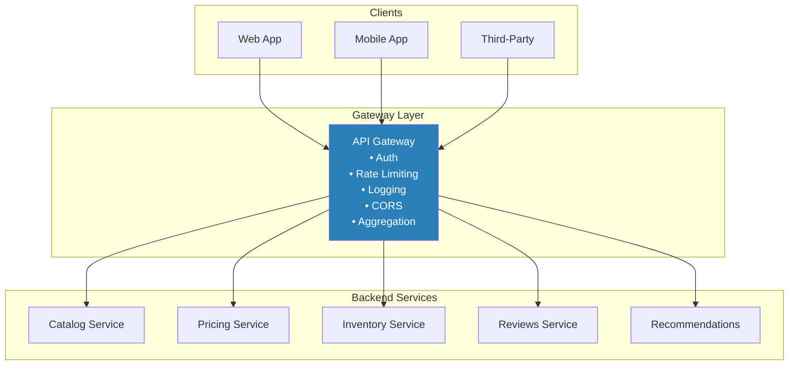
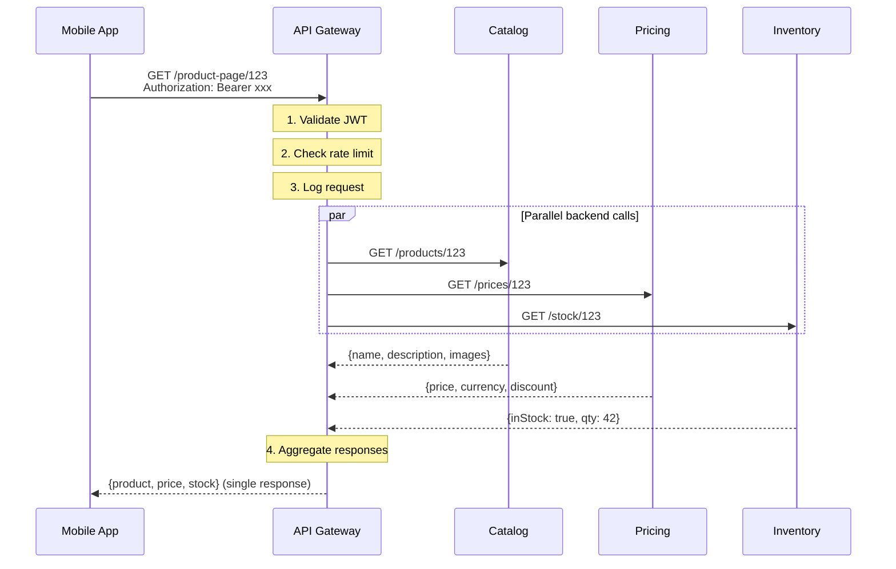

# API Gateway

## 1. The Problem

Your shopping app's product page needs data from 5 microservices: catalog, pricing, inventory, reviews, and recommendations. The mobile app makes 5 separate HTTP calls:

```
GET https://catalog.internal/products/123
GET https://pricing.internal/prices/123
GET https://inventory.internal/stock/123
GET https://reviews.internal/products/123/reviews
GET https://recommendations.internal/users/me/suggestions?product=123
```

Five problems emerge immediately:

1. **Five round trips** — On mobile (200ms latency), that's 1 second minimum just in network overhead.
2. **Five different auth flows** — Each service validates the JWT independently.
3. **Client knows the internal architecture** — If you split the catalog service into catalog + media, every client must be updated.
4. **No centralized rate limiting** — Each service implements its own, inconsistently.
5. **CORS, logging, and monitoring** — Duplicated across 5 services.

**The client is doing the work of an orchestration layer that doesn't exist.**

---

## 2. Naïve Solutions (and Why They Fail)

### Attempt 1: Let the Client Aggregate

```typescript
const productPage = {
  product: await fetch("/catalog/products/123").then(r => r.json()),
  price: await fetch("/pricing/prices/123").then(r => r.json()),
  stock: await fetch("/inventory/stock/123").then(r => r.json()),
  reviews: await fetch("/reviews/products/123/reviews").then(r => r.json()),
};
```

**Why it's suboptimal:**
- Mobile bandwidth is expensive. 5 requests × headers × TLS handshakes wastes data.
- The client must handle partial failures (reviews service down but catalog is fine).
- Every client (iOS, Android, web) reimplements the same orchestration logic.

### Attempt 2: Monolithic API

```
GET /api/product-page/123  → Returns everything from one service
```

**Why it defeats microservices:**
- You've coupled all data into one service, defeating the purpose of independent deployment. To add a field from the recommendations service, you modify and redeploy the monolithic API.
- The monolithic API becomes the God Service that knows about every domain.

### Attempt 3: Nginx Reverse Proxy

```nginx
location /catalog/ { proxy_pass http://catalog:8080/; }
location /pricing/ { proxy_pass http://pricing:8080/; }
location /inventory/ { proxy_pass http://inventory:8080/; }
```

**Why it's too dumb:**
- Pure routing, no aggregation. Clients still make 5 calls. Nginx just forwards them.
- No request/response transformation. No auth centralization. No protocol translation.

---

## 3. The Insight

**Place a single entry point between clients and backend services. This gateway handles cross-cutting concerns (auth, rate limiting, logging, CORS) once, aggregates multiple backend calls into a single client response, and insulates clients from the internal service topology.**

---

## 4. The Pattern

### API Gateway

**Definition:** A server that acts as a single entry point for all client requests. It routes each request to the appropriate backend service(s), performs cross-cutting operations (authentication, authorization, rate limiting, logging, CORS), and optionally aggregates responses from multiple services into a single response for the client.

**Guarantees:**
- Single entry point: clients interact with one URL, not dozens.
- Cross-cutting concerns implemented once (auth, logging, rate limiting, TLS termination).
- Internal service topology hidden from clients.

**Non-guarantees:**
- Does NOT eliminate backend latency — it adds a hop.
- Does NOT fix broken backends — if the catalog service is slow, the gateway doesn't magically speed it up.
- Can become a single point of failure if not properly scaled.

---

## 5. Mental Model

**A hotel concierge.** You don't call the kitchen, the housekeeping department, and the valet separately. You call the concierge desk (one number), describe what you need, and the concierge coordinates with the right departments, combines the results, and returns one unified response to your room.

---

## 6. Structure





---

## 7. Code Example

### TypeScript

```typescript
import express, { Request, Response, NextFunction } from "express";

const app = express();
app.use(express.json());

// ========== CROSS-CUTTING: AUTH MIDDLEWARE ==========
function authMiddleware(req: Request, res: Response, next: NextFunction) {
  const token = req.headers.authorization?.replace("Bearer ", "");
  if (!token) {
    res.status(401).json({ error: "Missing authorization" });
    return;
  }
  // Verify JWT (simplified)
  try {
    (req as any).userId = verifyJwt(token);
    next();
  } catch {
    res.status(401).json({ error: "Invalid token" });
  }
}

// ========== CROSS-CUTTING: RATE LIMITING ==========
const requestCounts = new Map<string, number>();
setInterval(() => requestCounts.clear(), 60_000);

function rateLimitMiddleware(req: Request, res: Response, next: NextFunction) {
  const key = (req as any).userId || req.ip;
  const count = (requestCounts.get(key) ?? 0) + 1;
  requestCounts.set(key, count);

  if (count > 100) {
    res.status(429).json({ error: "Rate limit exceeded" });
    return;
  }
  next();
}

// ========== CROSS-CUTTING: LOGGING ==========
function loggingMiddleware(req: Request, res: Response, next: NextFunction) {
  const start = Date.now();
  res.on("finish", () => {
    console.log(
      `${req.method} ${req.path} → ${res.statusCode} (${Date.now() - start}ms)`
    );
  });
  next();
}

app.use(loggingMiddleware);
app.use(authMiddleware);
app.use(rateLimitMiddleware);

// ========== AGGREGATED ROUTE: PRODUCT PAGE ==========
app.get("/api/v1/product-page/:id", async (req: Request, res: Response) => {
  const productId = req.params.id;

  // Fan out to backend services in parallel
  const [catalogResult, pricingResult, inventoryResult, reviewsResult] =
    await Promise.allSettled([
      callService("http://catalog:8080", `/products/${productId}`),
      callService("http://pricing:8080", `/prices/${productId}`),
      callService("http://inventory:8080", `/stock/${productId}`),
      callService("http://reviews:8080", `/products/${productId}/reviews`),
    ]);

  // Catalog is critical — fail if unavailable
  if (catalogResult.status === "rejected") {
    res.status(502).json({ error: "Product catalog unavailable" });
    return;
  }

  res.json({
    product: catalogResult.value,
    price: pricingResult.status === "fulfilled" ? pricingResult.value : null,
    stock: inventoryResult.status === "fulfilled" ? inventoryResult.value : null,
    reviews: reviewsResult.status === "fulfilled" ? reviewsResult.value : [],
  });
});

// ========== PASSTHROUGH ROUTES ==========
app.all("/api/v1/users/*", async (req: Request, res: Response) => {
  const backendPath = req.path.replace("/api/v1/users", "");
  const result = await callService("http://users:8080", backendPath, {
    method: req.method,
    body: req.method !== "GET" ? req.body : undefined,
  });
  res.json(result);
});

// ========== SERVICE CALLER ==========
async function callService(
  baseUrl: string,
  path: string,
  options: { method?: string; body?: unknown } = {}
): Promise<unknown> {
  const response = await fetch(`${baseUrl}${path}`, {
    method: options.method ?? "GET",
    headers: { "Content-Type": "application/json" },
    body: options.body ? JSON.stringify(options.body) : undefined,
    signal: AbortSignal.timeout(3000),
  });

  if (!response.ok) {
    throw new Error(`Service returned ${response.status}`);
  }
  return response.json();
}

function verifyJwt(token: string): string {
  return "user-123"; // Simplified
}

app.listen(8080, () => console.log("Gateway on :8080"));
```

### Go

```go
package main

import (
	"context"
	"encoding/json"
	"fmt"
	"io"
	"net/http"
	"strings"
	"sync"
	"time"
)

// ========== GATEWAY ==========
type Gateway struct {
	services map[string]string
	client   *http.Client
}

func NewGateway() *Gateway {
	return &Gateway{
		services: map[string]string{
			"catalog":   "http://catalog:8080",
			"pricing":   "http://pricing:8080",
			"inventory": "http://inventory:8080",
			"reviews":   "http://reviews:8080",
		},
		client: &http.Client{Timeout: 3 * time.Second},
	}
}

// ========== AGGREGATED ENDPOINT ==========
func (gw *Gateway) productPage(w http.ResponseWriter, r *http.Request) {
	productID := strings.TrimPrefix(r.URL.Path, "/api/v1/product-page/")
	ctx := r.Context()

	type result struct {
		key  string
		data json.RawMessage
		err  error
	}

	ch := make(chan result, 4)
	var wg sync.WaitGroup

	calls := map[string]string{
		"product":   gw.services["catalog"] + "/products/" + productID,
		"price":     gw.services["pricing"] + "/prices/" + productID,
		"stock":     gw.services["inventory"] + "/stock/" + productID,
		"reviews":   gw.services["reviews"] + "/products/" + productID + "/reviews",
	}

	for key, url := range calls {
		wg.Add(1)
		go func(k, u string) {
			defer wg.Done()
			data, err := gw.callService(ctx, u)
			ch <- result{key: k, data: data, err: err}
		}(key, url)
	}

	go func() { wg.Wait(); close(ch) }()

	response := map[string]json.RawMessage{}
	for r := range ch {
		if r.err != nil {
			if r.key == "product" {
				http.Error(w, "Catalog unavailable", http.StatusBadGateway)
				return
			}
			response[r.key] = json.RawMessage("null")
		} else {
			response[r.key] = r.data
		}
	}

	w.Header().Set("Content-Type", "application/json")
	json.NewEncoder(w).Encode(response)
}

func (gw *Gateway) callService(ctx context.Context, url string) (json.RawMessage, error) {
	req, err := http.NewRequestWithContext(ctx, http.MethodGet, url, nil)
	if err != nil {
		return nil, err
	}

	resp, err := gw.client.Do(req)
	if err != nil {
		return nil, err
	}
	defer resp.Body.Close()

	if resp.StatusCode != http.StatusOK {
		return nil, fmt.Errorf("HTTP %d", resp.StatusCode)
	}

	body, err := io.ReadAll(resp.Body)
	return json.RawMessage(body), err
}

// ========== PROXY PASSTHROUGH ==========
func (gw *Gateway) proxyHandler(service, stripPrefix string) http.HandlerFunc {
	return func(w http.ResponseWriter, r *http.Request) {
		backendPath := strings.TrimPrefix(r.URL.Path, stripPrefix)
		targetURL := gw.services[service] + backendPath

		proxyReq, _ := http.NewRequestWithContext(r.Context(), r.Method, targetURL, r.Body)
		proxyReq.Header = r.Header.Clone()

		resp, err := gw.client.Do(proxyReq)
		if err != nil {
			http.Error(w, "Backend unavailable", http.StatusBadGateway)
			return
		}
		defer resp.Body.Close()

		for k, v := range resp.Header {
			w.Header()[k] = v
		}
		w.WriteHeader(resp.StatusCode)
		io.Copy(w, resp.Body)
	}
}

func main() {
	gw := NewGateway()

	mux := http.NewServeMux()
	mux.HandleFunc("/api/v1/product-page/", gw.productPage)
	mux.HandleFunc("/api/v1/catalog/", gw.proxyHandler("catalog", "/api/v1/catalog"))

	fmt.Println("Gateway on :8080")
	http.ListenAndServe(":8080", mux)
}
```

---

## 8. Gotchas & Beginner Mistakes

| Mistake | Why It Hurts |
|---|---|
| **Business logic in the gateway** | The gateway starts validating orders, calculating discounts, transforming data. It becomes a monolith. Keep the gateway thin: routing, auth, rate limiting, aggregation. |
| **Single point of failure** | One gateway instance means one machine crash = total API outage. Run multiple instances behind a load balancer. Use managed gateways (AWS API Gateway, Kong, Envoy). |
| **Added latency not measured** | The gateway adds a network hop. If backends respond in 50ms and the gateway adds 10ms, that's 20% overhead. Measure gateway latency independently. |
| **No circuit breaker on backend calls** | If the reviews service hangs for 30s, every product page request holds a gateway thread for 30s. Add per-service timeouts and circuit breakers inside the gateway. |
| **Gateway does response caching incorrectly** | Caching authenticated responses and serving them to different users leaks data. Only cache public, non-personalized responses at the gateway level. |

---

## 9. Related & Confusable Patterns

| Pattern | How It Differs |
|---|---|
| **Reverse Proxy** | Routes requests to backends based on URL. No aggregation, transformation, or auth. The gateway is a smart reverse proxy. |
| **Backend for Frontend (BFF)** | A separate gateway per client type (mobile, web). API Gateway is one gateway for all clients. BFF specializes the gateway per consumer. |
| **Service Mesh** | Handles service-to-service communication (east-west traffic). API Gateway handles external-to-service communication (north-south traffic). Different traffic direction. |
| **Load Balancer** | Distributes traffic across instances of the same service. Gateway routes traffic across different services. Load balancer is horizontal; gateway is vertical. |
| **GraphQL** | A query language that lets clients request exactly what they need. Can be implemented as a gateway layer. GraphQL solves data fetching flexibility; gateway solves cross-cutting concerns. |

---

## 10. When This Pattern Is the WRONG Choice

- **Monolith** — If you have one backend service, a gateway in front of it is just an extra hop. Use the framework's built-in middleware for auth and rate limiting.
- **Service-to-service calls** — Microservices calling each other should not go through the API gateway. That creates a single bottleneck for all internal traffic. Use a service mesh or direct calls.
- **Simple CRUD APIs** — If you have 2 services and no cross-cutting requirements, a gateway adds complexity without proportional benefit.

**Symptoms you should reconsider:**
- The gateway team is a bottleneck — every backend team needs gateway changes to expose new endpoints. Consider letting teams manage their own routes.
- The gateway has 50 custom transformation rules — it's becoming the monolith you were trying to avoid. Simplify or move logic to BFF/backend services.
- Gateway latency is a significant portion of total response time — you're paying the hop tax without enough value. Measure and justify.

**How to back out:** Have clients call backend services directly. Move auth to a shared library. Lose aggregation (clients make multiple calls). If the pain of direct calls exceeds the pain of maintaining the gateway, keep the gateway.
