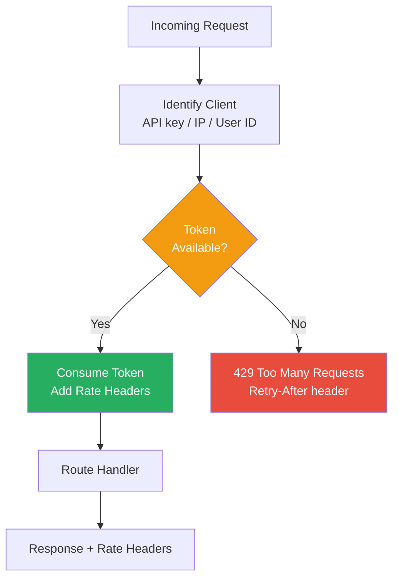

# API Rate Limiting

## 1. The Problem

Your SaaS API serves 200 customers. Most send 10-50 requests per minute. On Monday at 9 AM, a customer's deployment script has a bug — an infinite loop that fires `POST /deployments` 3,000 times per second.

Within 30 seconds:
- Your API server's CPU hits 100%.
- Database connection pool is exhausted.
- Every other customer's requests start timing out.
- Your monitoring alerts fire: "P99 latency > 10 seconds."

You kill the runaway client's requests by blocking their API key. But the damage is done — 15 minutes of downtime for all 200 customers because one client had a bug.

The next week, a different customer mass-imports 500,000 records. Legitimate use case, but the volume overwhelms your database. Same result: everyone slows down.

**You need a mechanism that protects your API from any single consumer — whether malicious, buggy, or just unexpectedly enthusiastic — without affecting everyone else.**

---

## 2. Naïve Solutions (and Why They Fail)

### Attempt 1: Hard Block After Threshold

```
if (requestCount > 1000) → 403 Forbidden forever
```

**Why it's too blunt:**
- "Forbidden forever" means a legitimate user who hits 1,001 requests is locked out until someone manually resets their counter.
- When does the counter reset? If it's daily, a burst of 1,000 in the first second blocks the user for 24 hours.
- No communication — the client doesn't know the limit, doesn't know when it resets, and can't self-correct.

### Attempt 2: Simple Counter per Time Window

```typescript
const counts = new Map<string, number>();
setInterval(() => counts.clear(), 60000); // Reset every minute

if ((counts.get(apiKey) || 0) >= 100) return res.status(429);
```

**Why window boundaries cause spikes:**
- A client sends 100 requests at 11:59:59 (within limit). Window resets at 12:00:00. They send 100 more at 12:00:01. That's 200 requests in 2 seconds — double the intended rate.
- The sharp reset creates a "thundering herd" at window boundaries — all rate-limited clients retry simultaneously when the window opens.

### Attempt 3: Just Scale Up

"If one client can overwhelm us, we need more servers."

**Why resources aren't infinite:**
- A buggy client sending 3,000 req/s costs you $X/hour in autoscaled infrastructure. The client pays $0 for that.
- Scaling up handles the load but doesn't isolate the damage. One client still consumes resources that belong to others.
- The database is usually the bottleneck. You can scale API servers, but database connections and IOPS are finite.

---

## 3. The Insight

**Rate limiting isn't about saying "no" — it's about saying "not yet." A well-designed rate limiter smooths traffic into a sustainable flow, tells clients exactly when they can retry, and differentiates between tiers of service. The limits should be transparent, fair, and self-correcting.**

---

## 4. The Pattern

### API Rate Limiting

**Definition:** A mechanism that controls the number of requests a client can make to an API within a given time window. Implemented at the API layer (middleware or gateway), it tracks request counts per client identity (API key, IP, user ID) and rejects excess requests with informative responses that help clients self-regulate.

**Common algorithms:**

| Algorithm | How It Works | Best For |
|---|---|---|
| **Token Bucket** | Tokens added at steady rate; each request consumes one. Burst allowed up to bucket capacity. | General purpose, allows bursts |
| **Sliding Window** | Counts requests in a rolling time window, no sharp boundary resets. | Accurate rate enforcement |
| **Fixed Window** | Counts per calendar window (per minute). Simple but boundary spikes. | Low-complexity needs |
| **Leaky Bucket** | Requests queued and processed at constant rate. | Strict rate smoothing |

**Guarantees:**
- No single client can monopolize server resources.
- Clients receive clear feedback: current usage, limits, and when to retry.
- Different service tiers get different limits.

**Non-guarantees:**
- Does NOT prevent distributed attacks (same client, different API keys).
- Does NOT replace proper autoscaling — rate limiting protects fairness, not capacity.
- Limits set too low will frustrate legitimate heavy users.

---

## 5. Mental Model

**A highway on-ramp meter.** During rush hour, a traffic light at the on-ramp lets one car through every few seconds. This prevents the highway from gridlocking. Cars wait briefly at the ramp (429 + Retry-After) instead of everyone sitting in a highway jam. Emergency vehicles (admin/internal) skip the meter entirely.

---

## 6. Structure



---

## 7. Code Example

### TypeScript

```typescript
import express, { Request, Response, NextFunction } from "express";
import Redis from "ioredis";

const redis = new Redis(process.env.REDIS_URL);
const app = express();

// ========== TOKEN BUCKET IMPLEMENTATION ==========

interface RateLimitConfig {
  maxTokens: number;     // Bucket capacity (burst size)
  refillRate: number;    // Tokens added per second
  name: string;          // Tier name for logging
}

interface BucketState {
  tokens: number;
  lastRefill: number;    // Unix timestamp ms
}

const TIER_CONFIGS: Record<string, RateLimitConfig> = {
  free:       { maxTokens: 10,   refillRate: 1,    name: "Free" },
  pro:        { maxTokens: 100,  refillRate: 10,   name: "Pro" },
  enterprise: { maxTokens: 1000, refillRate: 100,  name: "Enterprise" },
};

async function checkRateLimit(
  key: string,
  config: RateLimitConfig
): Promise<{ allowed: boolean; remaining: number; resetMs: number }> {
  const now = Date.now();
  const bucketKey = `ratelimit:${key}`;

  // Atomic Lua script — no race conditions
  const luaScript = `
    local key = KEYS[1]
    local maxTokens = tonumber(ARGV[1])
    local refillRate = tonumber(ARGV[2])
    local now = tonumber(ARGV[3])

    local data = redis.call('HMGET', key, 'tokens', 'lastRefill')
    local tokens = tonumber(data[1]) or maxTokens
    local lastRefill = tonumber(data[2]) or now

    -- Refill tokens based on elapsed time
    local elapsed = (now - lastRefill) / 1000
    tokens = math.min(maxTokens, tokens + (elapsed * refillRate))

    -- Try to consume a token
    local allowed = 0
    if tokens >= 1 then
      tokens = tokens - 1
      allowed = 1
    end

    -- Save state
    redis.call('HMSET', key, 'tokens', tokens, 'lastRefill', now)
    redis.call('EXPIRE', key, 3600)

    -- Calculate time until next token
    local resetMs = 0
    if tokens < 1 then
      resetMs = math.ceil((1 - tokens) / refillRate * 1000)
    end

    return {allowed, math.floor(tokens), resetMs}
  `;

  const [allowed, remaining, resetMs] = (await redis.eval(
    luaScript, 1, bucketKey,
    config.maxTokens, config.refillRate, now
  )) as number[];

  return { allowed: allowed === 1, remaining, resetMs };
}

// ========== MIDDLEWARE ==========
function rateLimitMiddleware(
  identifyClient: (req: Request) => string,
  getTier: (clientId: string) => string
) {
  return async (req: Request, res: Response, next: NextFunction) => {
    const clientId = identifyClient(req);
    const tier = getTier(clientId);
    const config = TIER_CONFIGS[tier] || TIER_CONFIGS.free;

    const { allowed, remaining, resetMs } = await checkRateLimit(
      clientId, config
    );

    // Always set rate limit headers (even on success)
    res.setHeader("X-RateLimit-Limit", config.maxTokens);
    res.setHeader("X-RateLimit-Remaining", remaining);
    res.setHeader("X-RateLimit-Reset", Math.ceil(Date.now() / 1000 + resetMs / 1000));

    if (!allowed) {
      const retryAfterSeconds = Math.ceil(resetMs / 1000);
      res.setHeader("Retry-After", retryAfterSeconds);
      res.status(429).json({
        error: "RATE_LIMIT_EXCEEDED",
        message: `Rate limit exceeded. Retry after ${retryAfterSeconds} seconds.`,
        limit: config.maxTokens,
        retryAfter: retryAfterSeconds,
        tier: config.name,
        upgradeUrl: tier === "free" ? "https://api.example.com/pricing" : undefined,
      });
      return;
    }

    next();
  };
}

// ========== USAGE ==========
const identifyClient = (req: Request): string => {
  return (req.headers["x-api-key"] as string) || req.ip || "anonymous";
};

const getTier = (clientId: string): string => {
  // In production, look up from database/cache
  const tiers: Record<string, string> = {
    "key-free-123": "free",
    "key-pro-456": "pro",
    "key-ent-789": "enterprise",
  };
  return tiers[clientId] || "free";
};

app.use(rateLimitMiddleware(identifyClient, getTier));

app.get("/products", (_req, res) => {
  res.json({ products: [{ id: 1, name: "Widget" }] });
});

app.listen(3000, () => console.log("Rate-limited API on :3000"));
```

### Go

```go
package main

import (
	"encoding/json"
	"fmt"
	"math"
	"net/http"
	"strconv"
	"sync"
	"time"
)

// ========== TOKEN BUCKET ==========
type TokenBucket struct {
	maxTokens  float64
	refillRate float64 // tokens per second
	tokens     float64
	lastRefill time.Time
	mu         sync.Mutex
}

func NewTokenBucket(maxTokens, refillRate float64) *TokenBucket {
	return &TokenBucket{
		maxTokens:  maxTokens,
		refillRate: refillRate,
		tokens:     maxTokens,
		lastRefill: time.Now(),
	}
}

type ConsumeResult struct {
	Allowed   bool
	Remaining int
	ResetMs   int64
}

func (b *TokenBucket) TryConsume() ConsumeResult {
	b.mu.Lock()
	defer b.mu.Unlock()

	now := time.Now()
	elapsed := now.Sub(b.lastRefill).Seconds()
	b.tokens = math.Min(b.maxTokens, b.tokens+(elapsed*b.refillRate))
	b.lastRefill = now

	if b.tokens >= 1 {
		b.tokens--
		return ConsumeResult{
			Allowed:   true,
			Remaining: int(b.tokens),
			ResetMs:   0,
		}
	}

	// Time until next token
	deficit := 1 - b.tokens
	resetMs := int64(math.Ceil(deficit / b.refillRate * 1000))
	return ConsumeResult{
		Allowed:   false,
		Remaining: 0,
		ResetMs:   resetMs,
	}
}

// ========== RATE LIMITER (manages buckets per client) ==========
type RateLimitConfig struct {
	MaxTokens  float64
	RefillRate float64
	Name       string
}

var tierConfigs = map[string]RateLimitConfig{
	"free":       {MaxTokens: 10, RefillRate: 1, Name: "Free"},
	"pro":        {MaxTokens: 100, RefillRate: 10, Name: "Pro"},
	"enterprise": {MaxTokens: 1000, RefillRate: 100, Name: "Enterprise"},
}

type RateLimiter struct {
	mu      sync.RWMutex
	buckets map[string]*TokenBucket
}

func NewRateLimiter() *RateLimiter {
	return &RateLimiter{buckets: make(map[string]*TokenBucket)}
}

func (rl *RateLimiter) GetBucket(clientID, tier string) *TokenBucket {
	rl.mu.RLock()
	bucket, exists := rl.buckets[clientID]
	rl.mu.RUnlock()

	if exists {
		return bucket
	}

	config := tierConfigs[tier]
	if config.MaxTokens == 0 {
		config = tierConfigs["free"]
	}

	rl.mu.Lock()
	defer rl.mu.Unlock()

	// Double-check after acquiring write lock
	if bucket, exists = rl.buckets[clientID]; exists {
		return bucket
	}

	bucket = NewTokenBucket(config.MaxTokens, config.RefillRate)
	rl.buckets[clientID] = bucket
	return bucket
}

// ========== MIDDLEWARE ==========
func RateLimitMiddleware(rl *RateLimiter, next http.Handler) http.Handler {
	return http.HandlerFunc(func(w http.ResponseWriter, r *http.Request) {
		clientID := r.Header.Get("X-Api-Key")
		if clientID == "" {
			clientID = r.RemoteAddr
		}

		tier := lookupTier(clientID)
		config := tierConfigs[tier]
		bucket := rl.GetBucket(clientID, tier)
		result := bucket.TryConsume()

		// Always set headers
		w.Header().Set("X-RateLimit-Limit", strconv.Itoa(int(config.MaxTokens)))
		w.Header().Set("X-RateLimit-Remaining", strconv.Itoa(result.Remaining))

		if !result.Allowed {
			retryAfter := int(math.Ceil(float64(result.ResetMs) / 1000))
			w.Header().Set("Retry-After", strconv.Itoa(retryAfter))
			w.Header().Set("Content-Type", "application/json")
			w.WriteHeader(http.StatusTooManyRequests)

			json.NewEncoder(w).Encode(map[string]any{
				"error":      "RATE_LIMIT_EXCEEDED",
				"retryAfter": retryAfter,
				"tier":       config.Name,
			})
			return
		}

		next.ServeHTTP(w, r)
	})
}

func lookupTier(clientID string) string {
	tiers := map[string]string{
		"key-pro-456": "pro",
		"key-ent-789": "enterprise",
	}
	if t, ok := tiers[clientID]; ok {
		return t
	}
	return "free"
}

func main() {
	limiter := NewRateLimiter()

	mux := http.NewServeMux()
	mux.HandleFunc("/products", func(w http.ResponseWriter, r *http.Request) {
		w.Header().Set("Content-Type", "application/json")
		json.NewEncoder(w).Encode(map[string]string{"status": "ok"})
	})

	handler := RateLimitMiddleware(limiter, mux)
	fmt.Println("Rate-limited API on :3000")
	http.ListenAndServe(":3000", handler)
}
```

---

## 8. Gotchas & Beginner Mistakes

| Mistake | Why It Hurts |
|---|---|
| **No `Retry-After` header** | Clients get 429 but don't know when to retry. They retry immediately in a tight loop, amplifying the problem. Always include `Retry-After`. |
| **Rate limiting by IP only** | Shared NAT, VPNs, and corporate proxies mean thousands of users share one IP. Rate limit by API key for authenticated requests. Use IP only for unauthenticated endpoints. |
| **In-memory counters on multiple servers** | Each server has its own counter. A client hits 3 servers round-robin and gets 3× the intended rate. Use Redis or a shared store for distributed rate limiting. |
| **One global limit** | 100 requests/minute for everything. But `GET /products` is cheap and `POST /deployments` is expensive. Use different limits per endpoint based on cost. |
| **Not rate limiting internal services** | A batch job in your own system floods the API and takes down external clients. Internal consumers need limits too — or a separate rate limit tier. |

---

## 9. Related & Confusable Patterns

| Pattern | How It Differs |
|---|---|
| **Bulkhead** | Isolates resources per consumer (thread pools, connection pools). Rate limiting restricts request count. Bulkhead prevents resource exhaustion; rate limiting prevents request storms. |
| **Circuit Breaker** | Stops calling a failing downstream service. Rate limiting stops being called too frequently. Circuit breaker protects the caller; rate limiting protects the callee. |
| **Throttling** | Often used interchangeably with rate limiting. Technically, throttling slows down requests (queuing); rate limiting rejects excess requests. |
| **Load Shedding** | Drops requests when the server is overloaded, regardless of per-client limits. Rate limiting enforces per-client fairness; load shedding protects overall server health. |
| **Backpressure** | Upstream signals downstream to slow down. Rate limiting IS the signal ("429, slow down"). Backpressure is the broader concept. |

---

## 10. When This Pattern Is the WRONG Choice

- **Internal synchronous call chains** — Service A calls Service B at a fixed rate determined by incoming traffic. Rate limiting B means A gets 429 errors. Use backpressure or bulkheads instead.
- **Low-traffic APIs** — An internal admin API used by 3 people doesn't need rate limiting. The operational overhead (Redis, monitoring, configuration) exceeds the risk.
- **Latency-sensitive paths** — Adding a Redis round-trip to every request adds 1-2ms. For sub-millisecond APIs, in-memory rate limiting or gateway-level enforcement is better.

**Symptoms you should reconsider:**
- Legitimate users regularly hit rate limits. Your limits are too low, or users need a higher tier. Analyze usage patterns before tightening limits.
- Rate limiting doesn't prevent outages because the bottleneck is a specific expensive endpoint, not overall request volume. Use per-endpoint limits or bulkheading.
- You've implemented rate limiting in every service. Centralize at the API gateway instead of distributing the logic.

**How to back out:** Remove rate limiting middleware and rely on infrastructure-level protection (API gateway, CDN rate limiting, cloud provider WAF). For simple cases, `nginx limit_req` or cloud provider settings handle basic rate limiting without application code.
