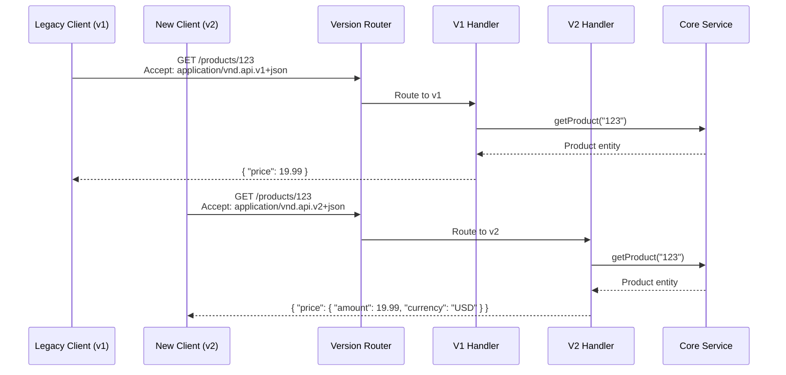

# API Versioning

## 1. The Problem

Your e-commerce API has been running for two years. The `GET /products/:id` response includes a `price` field:

```json
{ "id": "prod-123", "name": "Widget", "price": 19.99 }
```

Now the business expands internationally. You need to support multiple currencies. The obvious change:

```json
{
  "id": "prod-123",
  "name": "Widget",
  "price": { "amount": 19.99, "currency": "USD" }
}
```

You deploy it on Tuesday at 2 PM.

By 2:15 PM, 43 partner integrations are broken. Their code does `product.price * quantity` — but `product.price` is now an object, not a number. JavaScript silently returns `NaN`. Java throws `ClassCastException`. Python throws `TypeError`.

Your support queue fills with "your API broke our billing system" tickets. You roll back the change. Now you're stuck: you can't evolve your API without breaking existing clients, and you can't NOT evolve it.

**Without versioning, every API change is a potential outage for every consumer.**

---

## 2. Naïve Solutions (and Why They Fail)

### Attempt 1: Just Add New Fields, Never Remove Old Ones

```json
{
  "price": 19.99,
  "priceV2": { "amount": 19.99, "currency": "USD" },
  "priceDetails": { "amount": 19.99, "currency": "USD", "tax": 3.00 }
}
```

**Why it creates a mess:**
- After three iterations, you have `price`, `priceV2`, `priceDetails`, `priceInfo`. Nobody knows which to use.
- You can never clean up. The response payload grows forever. New developers can't tell which fields are current.
- Behavioral changes (different rounding rules, different tax inclusion) can't be expressed by adding fields.

### Attempt 2: Version in the Path

```
GET /v1/products/123   → { "price": 19.99 }
GET /v2/products/123   → { "price": { "amount": 19.99, "currency": "USD" } }
```

**Why it seems right but has hidden costs:**
- Caching is separate per path — `/v1/products/123` and `/v2/products/123` are different cache keys, even though the underlying product is the same.
- Clients bookmark or hardcode URLs. Moving from v1 to v2 means changing every URL in every consumer application.
- It implies the entire API changed. Did the Users API change too? Or just Products? Path versioning is too coarse.

### Attempt 3: Never Version — Just Make Breaking Changes

"Our clients should keep up."

**Why it's hostile:**
- Enterprise clients have quarterly release cycles. They can't update code weekly to track your API changes.
- You lose trust. After the second unannounced breaking change, partners stop integrating with you.
- Even internal teams become afraid to use your API because it might change under them.

---

## 3. The Insight

**Versioning is a backwards-compatibility contract: old clients continue working while new clients opt in to new behavior. The versioning strategy you choose determines your maintenance burden — there is no zero-cost option.**

---

## 4. The Pattern

### API Versioning

**Definition:** A strategy for managing breaking changes in an API by maintaining multiple versions simultaneously, allowing consumers to migrate at their own pace while giving producers a path to evolve.

**The three major strategies:**

| Strategy | Mechanism | Best For |
|---|---|---|
| **URL Path** | `/v1/products` | Public APIs, clear separation |
| **Header** | `Accept: application/vnd.api.v2+json` | Internal APIs, same URL |
| **Query Param** | `?version=2` | Simple, visible, easy testing |

**Guarantees:**
- Existing consumers are not broken by new API releases.
- Each version has a defined contract that doesn't change after publication.
- Consumers control their migration timeline.

**Non-guarantees:**
- NOT free to maintain — every live version must be tested, documented, and kept running.
- NOT infinite — you must eventually sunset old versions.
- Does NOT prevent the need for careful API design upfront.

---

## 5. Mental Model

**A building's elevator system.** When the building installs new high-speed elevators, they don't rip out the old ones immediately. Both run simultaneously — old tenants keep using the familiar one, new tenants use the faster one. After a transition period with clear signage, the old elevator gets scheduled for decommission. Everyone is notified months in advance, and no one is trapped mid-floor.

---

## 6. Structure



---

## 7. Code Example

### TypeScript

```typescript
import express, { Request, Response, NextFunction } from "express";

// ========== VERSION DETECTION ==========
type ApiVersion = "v1" | "v2";

function detectVersion(req: Request): ApiVersion {
  // Strategy 1: Accept header
  const accept = req.headers["accept"] || "";
  const headerMatch = accept.match(/application\/vnd\.myapi\.v(\d+)\+json/);
  if (headerMatch) return `v${headerMatch[1]}` as ApiVersion;

  // Strategy 2: Custom header
  const versionHeader = req.headers["api-version"];
  if (versionHeader === "2") return "v2";

  // Strategy 3: Query param (useful for testing)
  if (req.query.version === "2") return "v2";

  // Default: latest stable version
  return "v1";
}

function versionMiddleware(req: Request, _res: Response, next: NextFunction) {
  (req as any).apiVersion = detectVersion(req);
  next();
}

// ========== CORE SERVICE (version-agnostic) ==========
interface Product {
  id: string;
  name: string;
  priceAmount: number;
  currency: string;
  taxAmount: number;
  description: string;
  createdAt: Date;
}

async function getProduct(id: string): Promise<Product> {
  return {
    id,
    name: "Wireless Headphones",
    priceAmount: 79.99,
    currency: "USD",
    taxAmount: 6.40,
    description: "Premium wireless headphones",
    createdAt: new Date("2024-01-15"),
  };
}

// ========== VERSION-SPECIFIC RESPONSE TRANSFORMERS ==========
function toV1Response(product: Product) {
  return {
    id: product.id,
    name: product.name,
    price: product.priceAmount,            // number (original contract)
    description: product.description,
    created_at: product.createdAt.toISOString(),
  };
}

function toV2Response(product: Product) {
  return {
    id: product.id,
    name: product.name,
    price: {                                 // object (new contract)
      amount: product.priceAmount,
      currency: product.currency,
      tax: product.taxAmount,
      total: product.priceAmount + product.taxAmount,
    },
    description: product.description,
    createdAt: product.createdAt.toISOString(), // camelCase in v2
  };
}

// ========== VERSIONED ROUTE ==========
const app = express();
app.use(versionMiddleware);

app.get("/products/:id", async (req: Request, res: Response) => {
  const product = await getProduct(req.params.id);
  const version = (req as any).apiVersion as ApiVersion;

  const transformers: Record<ApiVersion, (p: Product) => any> = {
    v1: toV1Response,
    v2: toV2Response,
  };

  const transformer = transformers[version];
  if (!transformer) {
    res.status(400).json({ error: `Unsupported version: ${version}` });
    return;
  }

  // Add deprecation warning for old versions
  if (version === "v1") {
    res.setHeader("Deprecation", "true");
    res.setHeader("Sunset", "2025-06-01T00:00:00Z");
    res.setHeader("Link", '<https://docs.myapi.com/migration-v2>; rel="deprecation"');
  }

  res.json(transformer(product));
});

// ========== SUNSET ENFORCEMENT ==========
function sunsetEnforcement(req: Request, res: Response, next: NextFunction) {
  const version = (req as any).apiVersion as ApiVersion;

  const sunsetDates: Partial<Record<ApiVersion, Date>> = {
    v1: new Date("2025-06-01"),
  };

  const sunset = sunsetDates[version];
  if (sunset && new Date() > sunset) {
    res.status(410).json({
      error: "API_VERSION_SUNSET",
      message: `API version ${version} was sunset on ${sunset.toISOString()}`,
      migrationGuide: "https://docs.myapi.com/migration-v2",
    });
    return;
  }

  next();
}

app.use(sunsetEnforcement);
app.listen(3000, () => console.log("Versioned API on :3000"));
```

### Go

```go
package main

import (
	"encoding/json"
	"fmt"
	"net/http"
	"regexp"
	"time"
)

// ========== CORE DOMAIN (unversioned) ==========
type Product struct {
	ID          string
	Name        string
	PriceAmount float64
	Currency    string
	TaxAmount   float64
	Description string
	CreatedAt   time.Time
}

func getProduct(id string) Product {
	return Product{
		ID: id, Name: "Wireless Headphones",
		PriceAmount: 79.99, Currency: "USD", TaxAmount: 6.40,
		Description: "Premium wireless headphones",
		CreatedAt:   time.Date(2024, 1, 15, 0, 0, 0, 0, time.UTC),
	}
}

// ========== V1 RESPONSE ==========
type ProductV1 struct {
	ID          string  `json:"id"`
	Name        string  `json:"name"`
	Price       float64 `json:"price"` // flat number
	Description string  `json:"description"`
	CreatedAt   string  `json:"created_at"` // snake_case
}

func toV1(p Product) ProductV1 {
	return ProductV1{
		ID: p.ID, Name: p.Name,
		Price:       p.PriceAmount,
		Description: p.Description,
		CreatedAt:   p.CreatedAt.Format(time.RFC3339),
	}
}

// ========== V2 RESPONSE ==========
type PriceV2 struct {
	Amount   float64 `json:"amount"`
	Currency string  `json:"currency"`
	Tax      float64 `json:"tax"`
	Total    float64 `json:"total"`
}

type ProductV2 struct {
	ID          string  `json:"id"`
	Name        string  `json:"name"`
	Price       PriceV2 `json:"price"` // structured object
	Description string  `json:"description"`
	CreatedAt   string  `json:"createdAt"` // camelCase
}

func toV2(p Product) ProductV2 {
	return ProductV2{
		ID: p.ID, Name: p.Name,
		Price: PriceV2{
			Amount: p.PriceAmount, Currency: p.Currency,
			Tax: p.TaxAmount, Total: p.PriceAmount + p.TaxAmount,
		},
		Description: p.Description,
		CreatedAt:   p.CreatedAt.Format(time.RFC3339),
	}
}

// ========== VERSION DETECTION ==========
var vndRegex = regexp.MustCompile(`application/vnd\.myapi\.v(\d+)\+json`)

func detectVersion(r *http.Request) string {
	// Header-based
	if m := vndRegex.FindStringSubmatch(r.Header.Get("Accept")); m != nil {
		return "v" + m[1]
	}
	if v := r.Header.Get("Api-Version"); v != "" {
		return "v" + v
	}
	// Query-based
	if v := r.URL.Query().Get("version"); v != "" {
		return "v" + v
	}
	return "v1" // default
}

// ========== HANDLER ==========
func productHandler(w http.ResponseWriter, r *http.Request) {
	id := r.URL.Query().Get("id")
	product := getProduct(id)
	version := detectVersion(r)

	w.Header().Set("Content-Type", "application/json")

	switch version {
	case "v1":
		// Mark as deprecated
		w.Header().Set("Deprecation", "true")
		w.Header().Set("Sunset", "2025-06-01T00:00:00Z")
		json.NewEncoder(w).Encode(toV1(product))

	case "v2":
		json.NewEncoder(w).Encode(toV2(product))

	default:
		w.WriteHeader(http.StatusBadRequest)
		json.NewEncoder(w).Encode(map[string]string{
			"error": fmt.Sprintf("Unsupported version: %s", version),
		})
	}
}

func main() {
	http.HandleFunc("/products", productHandler)
	fmt.Println("Versioned API on :3000")
	http.ListenAndServe(":3000", nil)
}
```

---

## 8. Gotchas & Beginner Mistakes

| Mistake | Why It Hurts |
|---|---|
| **Versioning too aggressively** | Creating v3, v4, v5 for every minor change. Most changes are additive and non-breaking (new optional fields). Only version for actual breaking changes — restructured responses, removed fields, changed behavior. |
| **Maintaining too many versions** | Three versions running means three versions to test, document, and patch for security. Set a strict sunset policy: maximum 2 active versions. |
| **No deprecation warnings** | Sunsetting a version without warning. Use `Deprecation` and `Sunset` headers. Notify consumers 6+ months in advance. |
| **Internal and external APIs versioned identically** | Internal APIs between your own services shouldn't need formal versioning — coordinated deploys are fine. Reserve versioning for APIs consumed by external teams. |
| **Major version per resource inconsistency** | Products API is v3, Users API is v1, Orders API is v2. Consumers don't know which version goes with which. Either version the whole API together or use per-resource versioning consistently. |

---

## 9. Related & Confusable Patterns

| Pattern | How It Differs |
|---|---|
| **Backend for Frontend** | Creates separate APIs per client type. Different problem — BFF is about client-specific data shaping, versioning is about evolving one API over time. |
| **Feature Flags** | Toggles behavior for specific users or environments. Versioning changes contracts; feature flags change behavior within the same contract. |
| **Content Negotiation** | HTTP mechanism for requesting different representations (JSON vs XML). Versioning uses the same mechanism but for contract evolution. |
| **Strangler Fig** | Gradually replaces old system with new. API versioning can be the mechanism — v2 routes to new service, v1 to legacy. |
| **Adapter** | Translates between interfaces. V1-to-V2 migration shims are essentially adapters. |

---

## 10. When This Pattern Is the WRONG Choice

- **Internal APIs with coordinated deploys** — If you control both producer and consumer and deploy them together, versioning adds ceremony for no benefit. Just update both sides simultaneously.
- **Rapidly iterating APIs** — During early development when the API changes daily, formal versioning creates overhead. Use versioning when the API stabilizes and has external consumers.
- **GraphQL APIs** — GraphQL is inherently version-free. Clients query specific fields; adding fields never breaks existing queries. Deprecate individual fields instead.

**Symptoms you should reconsider:**
- You have 4+ active versions. Your maintenance burden outweighs the migration pain. Force sunset old versions.
- No consumer has migrated in 6 months. You're maintaining dead versions. Check consumer analytics; sunset unused versions.
- Every release requires a new version. Your changes might not actually be breaking — adding optional fields is backwards-compatible.

**How to back out:** Consolidate to a single version. Communicate a sunset timeline for all older versions. Help consumers migrate with detailed guides and helper libraries. Adopt an API-first design process to minimize future breaking changes.
