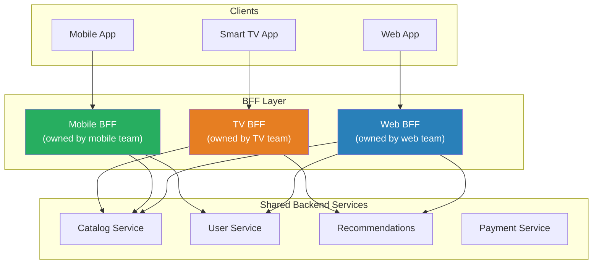

# Backend for Frontend (BFF)

## 1. The Problem

Your API team built one REST API to serve all clients: web, iOS, Android, and third-party integrations. The product listing endpoint returns everything:

```json
{
  "id": "prod-123",
  "name": "Wireless Headphones",
  "description": "...",
  "longDescription": "...(2KB of HTML)...",
  "price": 79.99,
  "originalPrice": 99.99,
  "variants": [ /* 15 color/size combos */ ],
  "specifications": { /* 30 key-value pairs */ },
  "relatedProducts": [ /* 8 products with full details */ ],
  "reviews": [ /* 50 reviews */ ],
  "qaPairs": [ /* 20 Q&A entries */ ],
  "sellerInfo": { /* full seller profile */ },
  "shippingOptions": [ /* 5 options */ ]
}
```

The **web** app uses all of it — it renders a full product page.

The **mobile** app only needs name, price, one image, and stock status. It's downloading 15KB of data it throws away. On a 3G connection, this adds 2 seconds to every product view.

The **third-party integration** only needs ID, name, price, and stock. It's processing 10,000 products/hour and paying for bandwidth it doesn't use.

When the mobile team asks for a smaller response, the API team says: "We can't break the web app's response format." When the web team wants a new field, they add it — making mobile's over-fetching worse.

**One API trying to serve all clients serves none of them well.**

---

## 2. Naïve Solutions (and Why They Fail)

### Attempt 1: Field Selection via Query Params

```
GET /products/123?fields=name,price,image
```

**Why it's limited:**
- Works for flat objects, but how do you express "give me only the first 3 reviews with just the rating and author, and only 2 related products with just their names"?
- The query string becomes a complex DSL. You've reinvented GraphQL, poorly.
- Each client still calls the same endpoint — cross-cutting concerns (caching, rate limiting) can't be tuned per client type.

### Attempt 2: Separate Endpoints per Client

```
GET /web/products/123      → Full response
GET /mobile/products/123   → Slim response
GET /api/products/123      → Third-party response
```

**Why it multiplies the backend team's work:**
- The backend team now maintains 3 versions of every endpoint. Three sets of tests, three response schemas, three documentation pages.
- Mobile and web product requirements diverge weekly. The backend team becomes the bottleneck for every frontend ticket.

### Attempt 3: GraphQL for Everything

```graphql
query { product(id: "123") { name, price, image } }
```

**Why it's not always the answer:**
- GraphQL requires every client to build and manage queries. The third-party integration just wants a simple REST endpoint, not a query language.
- GraphQL doesn't solve orchestration — if the product page needs data from 5 services, someone still has to stitch it together. Where does that code live?

---

## 3. The Insight

**Each client type has fundamentally different data needs, network constraints, and interaction patterns. Instead of one API that compromises for all, create a thin translation layer per client type that calls shared backend services and returns exactly what that specific client needs.**

---

## 4. The Pattern

### Backend for Frontend (BFF)

**Definition:** A pattern where each client type (web, mobile, TV, third-party) gets its own dedicated API layer that acts as an intermediary between the client and shared backend services. Each BFF is owned by the frontend team that consumes it, tailored to that client's specific data needs, aggregation requirements, and interaction patterns.

**Guarantees:**
- Each client gets exactly the data shape it needs — no over-fetching.
- Frontend teams can evolve their BFF independently without coordinating with other teams.
- Client-specific optimizations (caching, response size, protocol) are isolated.

**Non-guarantees:**
- Does NOT eliminate backend services — BFFs call the same shared services.
- Does NOT prevent code duplication — similar logic may exist across BFFs.
- Increases the number of deployed services (one BFF per client type).

---

## 5. Mental Model

**A personal assistant for each executive.** The CEO, CFO, and CTO all need information from the same departments (sales, engineering, finance). But the CEO wants a high-level dashboard, the CFO wants detailed financial breakdowns, and the CTO wants technical metrics. Instead of one report that sort-of works for everyone, each executive has a personal assistant who knows exactly what their boss needs and prepares a customized briefing from the shared raw data.

---

## 6. Structure



---

## 7. Code Example

### TypeScript

```typescript
// ========== WEB BFF — Full data, rich responses ==========
// Owned by the web frontend team

import express from "express";

const webBff = express();

webBff.get("/product/:id", async (req, res) => {
  const productId = req.params.id;

  // Web needs everything — full parallel fetch
  const [catalog, pricing, reviews, recommendations, qa] =
    await Promise.allSettled([
      callService("catalog", `/products/${productId}`),
      callService("pricing", `/prices/${productId}`),
      callService("reviews", `/products/${productId}/reviews?limit=50`),
      callService("recommendations", `/suggest?productId=${productId}&count=8`),
      callService("catalog", `/products/${productId}/qa`),
    ]);

  const product = unwrap(catalog);
  const price = unwrap(pricing);

  res.json({
    // Web gets the full, rich response
    product: {
      id: product.id,
      name: product.name,
      description: product.longDescription, // HTML content
      images: product.images,               // All images
      specifications: product.specifications,
      variants: product.variants,
    },
    pricing: {
      current: price.amount,
      original: price.originalAmount,
      discount: price.discountPercent,
      currency: price.currency,
    },
    reviews: unwrapOr(reviews, []),
    recommendations: unwrapOr(recommendations, []),
    qa: unwrapOr(qa, []),
  });
});

webBff.listen(3001, () => console.log("Web BFF on :3001"));


// ========== MOBILE BFF — Slim data, bandwidth-conscious ==========
// Owned by the mobile team

const mobileBff = express();

mobileBff.get("/product/:id", async (req, res) => {
  const productId = req.params.id;

  // Mobile only needs core product + price
  const [catalog, pricing] = await Promise.all([
    callService("catalog", `/products/${productId}`),
    callService("pricing", `/prices/${productId}`),
  ]);

  res.json({
    // Mobile gets a slim, bandwidth-efficient response
    id: catalog.id,
    name: catalog.name,
    description: catalog.shortDescription, // Plain text, trimmed
    image: catalog.images[0]?.thumbnail,   // Single thumbnail
    price: pricing.amount,
    inStock: catalog.stockCount > 0,
  });
});

// Mobile-specific: batch endpoint for list views
mobileBff.post("/products/batch", async (req, res) => {
  const { ids } = req.body as { ids: string[] };

  const products = await Promise.all(
    ids.slice(0, 20).map(async (id) => {
      const catalog = await callService("catalog", `/products/${id}`);
      return {
        id: catalog.id,
        name: catalog.name,
        thumbnail: catalog.images[0]?.thumbnail,
        price: catalog.price,
      };
    })
  );

  res.json({ products });
});

mobileBff.listen(3002, () => console.log("Mobile BFF on :3002"));


// ========== SHARED UTILITIES ==========
async function callService(service: string, path: string): Promise<any> {
  const hosts: Record<string, string> = {
    catalog: "http://catalog:8080",
    pricing: "http://pricing:8080",
    reviews: "http://reviews:8080",
    recommendations: "http://recommendations:8080",
  };
  const resp = await fetch(`${hosts[service]}${path}`, {
    signal: AbortSignal.timeout(3000),
  });
  if (!resp.ok) throw new Error(`${service}: HTTP ${resp.status}`);
  return resp.json();
}

function unwrap(result: PromiseSettledResult<any>): any {
  if (result.status === "rejected") throw result.reason;
  return result.value;
}

function unwrapOr(result: PromiseSettledResult<any>, fallback: any): any {
  return result.status === "fulfilled" ? result.value : fallback;
}
```

### Go

```go
package main

import (
	"context"
	"encoding/json"
	"fmt"
	"net/http"
	"time"
)

// ========== SHARED SERVICE CALLER ==========
var client = &http.Client{Timeout: 3 * time.Second}

var serviceHosts = map[string]string{
	"catalog": "http://catalog:8080",
	"pricing": "http://pricing:8080",
	"reviews": "http://reviews:8080",
}

func callService(ctx context.Context, service, path string) (json.RawMessage, error) {
	url := serviceHosts[service] + path
	req, err := http.NewRequestWithContext(ctx, http.MethodGet, url, nil)
	if err != nil {
		return nil, err
	}
	resp, err := client.Do(req)
	if err != nil {
		return nil, err
	}
	defer resp.Body.Close()
	var data json.RawMessage
	json.NewDecoder(resp.Body).Decode(&data)
	return data, nil
}

// ========== WEB BFF ==========
func webProductHandler(w http.ResponseWriter, r *http.Request) {
	productID := r.URL.Query().Get("id")
	ctx := r.Context()

	type result struct {
		key  string
		data json.RawMessage
	}

	ch := make(chan result, 3)

	// Web BFF: fetch everything
	go func() {
		d, _ := callService(ctx, "catalog", "/products/"+productID)
		ch <- result{"product", d}
	}()
	go func() {
		d, _ := callService(ctx, "pricing", "/prices/"+productID)
		ch <- result{"pricing", d}
	}()
	go func() {
		d, _ := callService(ctx, "reviews", "/products/"+productID+"/reviews?limit=50")
		ch <- result{"reviews", d}
	}()

	response := map[string]json.RawMessage{}
	for i := 0; i < 3; i++ {
		r := <-ch
		response[r.key] = r.data
	}

	w.Header().Set("Content-Type", "application/json")
	json.NewEncoder(w).Encode(response)
}

// ========== MOBILE BFF ==========
type MobileProduct struct {
	ID      string  `json:"id"`
	Name    string  `json:"name"`
	Image   string  `json:"image"`
	Price   float64 `json:"price"`
	InStock bool    `json:"inStock"`
}

func mobileProductHandler(w http.ResponseWriter, r *http.Request) {
	productID := r.URL.Query().Get("id")
	ctx := r.Context()

	// Mobile BFF: only fetch what's needed
	catalogData, err := callService(ctx, "catalog", "/products/"+productID)
	if err != nil {
		http.Error(w, "Catalog unavailable", http.StatusBadGateway)
		return
	}

	// Extract only the fields mobile needs
	var full struct {
		ID         string  `json:"id"`
		Name       string  `json:"name"`
		ShortDesc  string  `json:"shortDescription"`
		Price      float64 `json:"price"`
		StockCount int     `json:"stockCount"`
		Images     []struct {
			Thumbnail string `json:"thumbnail"`
		} `json:"images"`
	}
	json.Unmarshal(catalogData, &full)

	thumbnail := ""
	if len(full.Images) > 0 {
		thumbnail = full.Images[0].Thumbnail
	}

	mobile := MobileProduct{
		ID:      full.ID,
		Name:    full.Name,
		Image:   thumbnail,
		Price:   full.Price,
		InStock: full.StockCount > 0,
	}

	w.Header().Set("Content-Type", "application/json")
	json.NewEncoder(w).Encode(mobile)
}

func main() {
	// In production, these would be separate deployments
	webMux := http.NewServeMux()
	webMux.HandleFunc("/product", webProductHandler)

	mobileMux := http.NewServeMux()
	mobileMux.HandleFunc("/product", mobileProductHandler)

	go func() {
		fmt.Println("Web BFF on :3001")
		http.ListenAndServe(":3001", webMux)
	}()

	fmt.Println("Mobile BFF on :3002")
	http.ListenAndServe(":3002", mobileMux)
}
```

---

## 8. Gotchas & Beginner Mistakes

| Mistake | Why It Hurts |
|---|---|
| **BFF becomes a monolith** | The BFF starts with simple aggregation, then accumulates business logic (validation, computation, state management). Keep BFFs thin — they translate and aggregate, not compute. |
| **Too many BFFs** | One BFF per page, per feature, per screen. Now you have 20 BFFs to deploy and monitor. One per client platform (web, mobile, TV) is the sweet spot. |
| **Backend team owns the BFF** | The entire point is that the frontend team owns its BFF. If the backend team maintains it, you've just added an extra hop without organizational benefit. |
| **Duplicated business logic** | The same price calculation exists in web BFF and mobile BFF. Move shared logic to a backend service. BFFs should only contain client-specific transformation and aggregation. |
| **No shared client library** | Each BFF reimplements HTTP calls, error handling, and retry logic for backend services. Extract a shared service client library used by all BFFs. |

---

## 9. Related & Confusable Patterns

| Pattern | How It Differs |
|---|---|
| **API Gateway** | Single gateway for all clients. BFF is multiple gateways, one per client type. Gateway handles cross-cutting; BFF handles client-specific shaping. |
| **GraphQL** | Lets each client query exactly what it needs from one endpoint. BFF achieves the same with dedicated REST APIs. GraphQL uses client-side queries; BFF uses server-side customization. |
| **Adapter (ACL)** | Translates one API's concepts to another. BFF translates backend data to UI-specific shapes. Similar mechanism, different scope (integration vs. UI). |
| **Aggregation Service** | Combines data from multiple services. A BFF IS an aggregation service that's client-specific. Generic aggregation serves all; BFF serves one client type. |
| **API Versioning** | Manages API evolution over time. BFF avoids versioning problems because each client evolves its own API independently. |

---

## 10. When This Pattern Is the WRONG Choice

- **Single client type** — If you only serve a web app, a BFF is just an unnecessary layer between your frontend and backend. Call the backend directly.
- **Clients have identical needs** — If web and mobile show the exact same data, you don't need separate BFFs. Use one API with field selection.
- **Small team** — If 3 developers build everything (frontend + backend), the organizational benefit (team autonomy) doesn't exist. The communication overhead of separate BFFs outweighs the benefit.

**Symptoms you should reconsider:**
- The BFFs are identical — web BFF and mobile BFF have 90% the same code. Merge them into one API with client-specific response transformations.
- Frontend teams don't actually own the BFF — the backend team makes all changes. You've added a layer without the organizational model. Either restructure teams or remove the BFF.
- BFFs duplicate significant business logic — pricing calculations, authorization rules. Move this to backend services; keep BFFs thin.

**How to back out:** Merge BFFs into a single API gateway. Add field selection or GraphQL for client-specific data needs. Frontend teams communicate requirements to the backend team.
