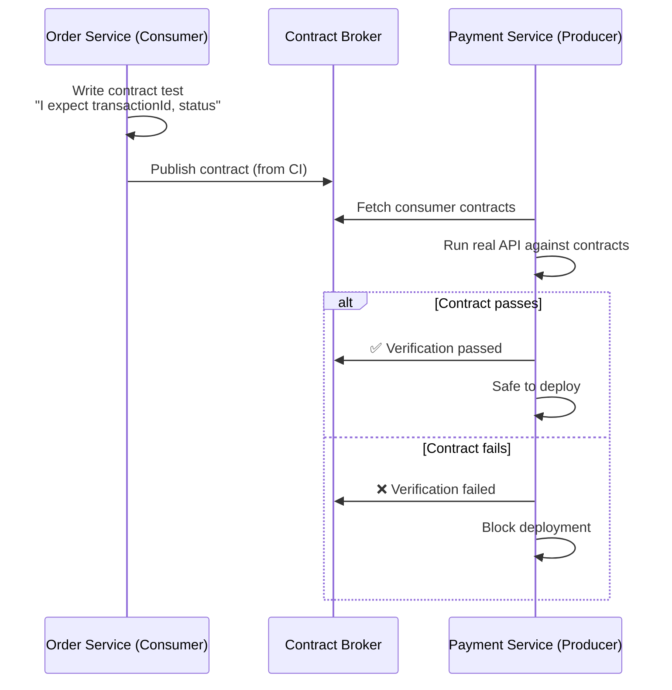

# Contract Testing

## 1. The Problem

Your order service depends on the payment service's API. In integration tests, everything works:

```typescript
// order-service test
const payment = await paymentService.charge({ amount: 99.99, currency: "USD" });
expect(payment.status).toBe("success");
expect(payment.transactionId).toBeDefined();
```

Both teams ship on Friday. The payment team renamed `transactionId` to `transaction_id` in their response. Their unit tests pass (they updated their tests). Your unit tests pass (they mock the payment service). Integration tests pass in your CI (they run against a mock). **No test catches the mismatch.**

Saturday morning, 100% of orders fail with `undefined transactionId`. The field exists — it's just spelled differently now. Your order service reads `response.transactionId` and gets `undefined`. The error cascades into creating orders with null payment references.

```
Payment team's response:  { "transaction_id": "tx-123", "status": "success" }
Order team expects:        { "transactionId": "tx-123", "status": "success" }
```

End-to-end tests would catch this, but they take 45 minutes to run, require all 12 services running simultaneously, and fail 30% of the time due to test environment flakiness. Nobody runs them before merging.

**You need a fast, reliable test that catches API contract mismatches before deployment — without requiring live services.**

---

## 2. Naïve Solutions (and Why They Fail)

### Attempt 1: End-to-End Tests

Spin up all services, run the full flow: create order → charge payment → verify result.

**Why they're unreliable:**
- Slow (10-45 minutes), flaky (network issues, data setup), and expensive (full environment).
- A failure doesn't tell you WHICH service broke the contract. Was it the payment service? The order service? A network timeout?
- Teams skip them because they're slow, defeating the purpose.

### Attempt 2: Shared Type Definitions

Both teams import types from a shared package:

```typescript
// @company/api-types
interface PaymentResponse {
  transactionId: string;
  status: string;
}
```

**Why it creates coupling:**
- Both services must use the same language. If payment is Go and orders is TypeScript, shared types don't work.
- Version management becomes a nightmare. Which version of `@company/api-types` does each service use? Upgrading one service to the latest types might require upgrading all.
- TypeScript types are build-time only — they don't catch runtime mismatches (Go sends `transaction_id`, TypeScript expects `transactionId`).

### Attempt 3: API Documentation as Contract

"We documented the API in Swagger/OpenAPI. Both teams should follow it."

**Why documentation drifts:**
- Documentation is aspirational, not enforceable. The code does what the code does, not what the docs say.
- No one updates the docs when they make a "small" change. The docs show `transactionId` while the code returns `transaction_id`.
- Even if docs are accurate, nobody runs an automated check: "does this response actually match the documented schema?"

---

## 3. The Insight

**A contract test turns the API agreement between producer and consumer into an executable specification. The consumer writes what it expects. The producer verifies it can fulfill those expectations. Both sides run independently, and both fail if the contract is violated — before code reaches production.**

---

## 4. The Pattern

### Contract Testing (Consumer-Driven)

**Definition:** A testing methodology where the consumer of an API defines a contract — the minimum set of fields, types, and behaviors it depends on — and the producer verifies that it satisfies all consumer contracts. Both consumer and producer tests run independently in their own CI pipelines. The contract acts as a shared specification that's code-verified, not just documented.

**Key workflow:**
| Step | Who | What |
|---|---|---|
| 1. Write contract | Consumer | Defines expected request/response pairs |
| 2. Publish contract | Consumer CI | Stores contract in a broker or repository |
| 3. Verify contract | Producer CI | Runs its real code against consumer expectations |
| 4. Can I Deploy? | Either | Checks all contracts pass before deploying |

**Guarantees:**
- API mismatches are caught before deployment, not after.
- Consumer declares minimum needs — producer can add fields freely without breaking contracts.
- Both sides test independently — no shared test environment needed.

**Non-guarantees:**
- Does NOT test business logic — only request/response shapes and status codes.
- Does NOT replace integration tests entirely — contracts verify structure, not system behavior.
- Requires discipline — both teams must run contract tests in CI and not skip failures.

---

## 5. Mental Model

**A construction specification sheet.** When a plumber and an electrician work on the same house, they don't wait until the house is built to check if the pipes and wires fit. They agree on a specification: "Pipe X will be at position Y with a 2-inch diameter." Both work independently using the spec. The plumber installs the pipe at the right position; the electrician plans around it. If either violates the spec, their own inspection catches it — before the walls go up.

---

## 6. Structure



---

## 7. Code Example

### TypeScript

```typescript
// ================================================
// CONSUMER SIDE: Order Service defines what it needs
// ================================================

// order-service/tests/contracts/payment-service.pact.ts
import { PactV3, MatchersV3 } from "@pact-foundation/pact";
import path from "path";

const { like, string, integer, eachLike } = MatchersV3;

const provider = new PactV3({
  consumer: "OrderService",
  provider: "PaymentService",
  dir: path.resolve(__dirname, "../pacts"), // Where contract files are written
});

describe("Payment Service Contract", () => {
  // Contract 1: Successful payment
  it("returns a transaction when payment succeeds", async () => {
    provider
      .given("a valid payment method exists")
      .uponReceiving("a request to charge a payment")
      .withRequest({
        method: "POST",
        path: "/payments",
        headers: { "Content-Type": "application/json" },
        body: {
          amount: like(99.99),
          currency: string("USD"),
          orderId: string("order-123"),
        },
      })
      .willRespondWith({
        status: 201,
        headers: { "Content-Type": "application/json" },
        body: {
          // This is what Order Service DEPENDS ON
          // If payment service changes these, the contract breaks
          transactionId: string("tx-abc-123"),
          status: string("success"),
          amount: like(99.99),
          currency: string("USD"),
        },
      });

    await provider.executeTest(async (mockServer) => {
      // Test your REAL consumer code against the mock
      const client = new PaymentClient(mockServer.url);
      const result = await client.charge({
        amount: 99.99,
        currency: "USD",
        orderId: "order-123",
      });

      expect(result.transactionId).toBeDefined();
      expect(result.status).toBe("success");
    });
  });

  // Contract 2: Failed payment
  it("returns an error when card is declined", async () => {
    provider
      .given("the card will be declined")
      .uponReceiving("a request to charge a declined card")
      .withRequest({
        method: "POST",
        path: "/payments",
        body: {
          amount: like(99.99),
          currency: string("USD"),
          orderId: string("order-456"),
        },
      })
      .willRespondWith({
        status: 402,
        body: {
          error: string("CARD_DECLINED"),
          message: string("The card was declined"),
        },
      });

    await provider.executeTest(async (mockServer) => {
      const client = new PaymentClient(mockServer.url);
      try {
        await client.charge({
          amount: 99.99,
          currency: "USD",
          orderId: "order-456",
        });
        fail("Should have thrown");
      } catch (err: any) {
        expect(err.code).toBe("CARD_DECLINED");
      }
    });
  });
});

// The REAL consumer code being tested:
class PaymentClient {
  constructor(private baseUrl: string) {}

  async charge(params: {
    amount: number;
    currency: string;
    orderId: string;
  }): Promise<{ transactionId: string; status: string; amount: number }> {
    const response = await fetch(`${this.baseUrl}/payments`, {
      method: "POST",
      headers: { "Content-Type": "application/json" },
      body: JSON.stringify(params),
    });

    const data = await response.json();

    if (!response.ok) {
      const err = new Error(data.message);
      (err as any).code = data.error;
      throw err;
    }

    return {
      transactionId: data.transactionId,  // ← THIS field name is the contract
      status: data.status,
      amount: data.amount,
    };
  }
}


// ================================================
// PRODUCER SIDE: Payment Service verifies contracts
// ================================================

// payment-service/tests/contracts/verify.test.ts
import { Verifier } from "@pact-foundation/pact";
import path from "path";
import { startApp } from "../../src/app"; // Your real app

describe("Payment Service Provider Verification", () => {
  let server: any;

  beforeAll(async () => {
    server = await startApp(3456); // Start your real service
  });

  afterAll(() => server.close());

  it("satisfies all consumer contracts", async () => {
    const verifier = new Verifier({
      providerBaseUrl: "http://localhost:3456",
      // Contracts from the broker (or local files in development)
      pactBrokerUrl: process.env.PACT_BROKER_URL,
      provider: "PaymentService",
      providerVersion: process.env.GIT_SHA || "dev",

      // Map contract "given" states to test setup
      stateHandlers: {
        "a valid payment method exists": async () => {
          // Seed test database with valid payment method
          await seedTestPaymentMethod();
        },
        "the card will be declined": async () => {
          // Configure test payment processor to decline
          await configureDeclinedCard();
        },
      },
    });

    await verifier.verifyProvider();
  });
});

async function seedTestPaymentMethod(): Promise<void> {
  // Insert test data into the provider's database
}

async function configureDeclinedCard(): Promise<void> {
  // Set up the test scenario
}
```

### Go

```go
package main

// ================================================
// PRODUCER SIDE (Go): Verify consumer contracts
// ================================================

import (
	"fmt"
	"net/http"
	"os"
	"testing"

	"github.com/pact-foundation/pact-go/v2/provider"
)

// Your real payment handler
func paymentHandler(w http.ResponseWriter, r *http.Request) {
	w.Header().Set("Content-Type", "application/json")

	// Real business logic...
	w.WriteHeader(http.StatusCreated)
	fmt.Fprintf(w, `{
		"transactionId": "tx-abc-123",
		"status": "success",
		"amount": 99.99,
		"currency": "USD"
	}`)
}

func TestProviderPact(t *testing.T) {
	// Start real server
	mux := http.NewServeMux()
	mux.HandleFunc("/payments", paymentHandler)

	go http.ListenAndServe(":3456", mux)

	verifier := provider.NewVerifier()

	err := verifier.VerifyProvider(t, provider.VerifyRequest{
		Provider:        "PaymentService",
		ProviderBaseURL: "http://localhost:3456",

		// Where to find consumer contracts
		PactFiles: []string{
			"../order-service/tests/pacts/OrderService-PaymentService.json",
		},

		// OR from a broker:
		// BrokerURL: os.Getenv("PACT_BROKER_URL"),

		ProviderVersion: os.Getenv("GIT_SHA"),

		// Map consumer's "given" states to test setup
		StateHandlers: map[string]provider.StateHandlerFunc{
			"a valid payment method exists": func(setup bool, state provider.ProviderState) (provider.ProviderStateResponse, error) {
				if setup {
					// Seed database with valid payment method
					seedTestData()
				}
				return nil, nil
			},
			"the card will be declined": func(setup bool, state provider.ProviderState) (provider.ProviderStateResponse, error) {
				if setup {
					configureDecline()
				}
				return nil, nil
			},
		},
	})

	if err != nil {
		t.Fatal("Contract verification failed:", err)
	}
}

func seedTestData()      {}
func configureDecline()   {}

// ================================================
// What happens when the contract breaks:
// ================================================
//
// 1. Payment team renames transactionId → transaction_id
// 2. Payment team runs: go test ./contracts/...
// 3. Test FAILS:
//    "Expected response body to contain 'transactionId'
//     but got 'transaction_id'"
// 4. Payment team knows BEFORE merging that this change
//    will break the Order Service.
// 5. Options:
//    a) Don't rename (backward compatible)
//    b) Return BOTH fields during migration period
//    c) Coordinate with Order team to update simultaneously
```

---

## 8. Gotchas & Beginner Mistakes

| Mistake | Why It Hurts |
|---|---|
| **Over-specifying the contract** | Consumer requires `{ name: "Wireless Headphones", price: 79.99 }` — exact values. The test breaks when test data changes. Use matchers: `like(79.99)` matches any number, `string("abc")` matches any string. |
| **Testing business logic in contracts** | "When I charge $100, the response should be $100 minus 2.5% fee = $97.50." That's business logic testing, not contract testing. Contracts verify structure and types, not calculations. |
| **No provider states** | The consumer expects a "declined card" scenario, but the provider has no way to set up that state. State handlers are essential — they let the provider prepare the right test conditions. |
| **Not running in CI** | Contracts exist but aren't enforced. Neither team runs them before merging. Contract tests must be mandatory in CI — just like unit tests. |
| **Contract tests replace all other tests** | "We have contracts, so we don't need unit tests or integration tests." Contracts test API shape. Unit tests test logic. Integration tests test system behavior. All three serve different purposes. |

---

## 9. Related & Confusable Patterns

| Pattern | How It Differs |
|---|---|
| **Integration Testing** | Tests the ACTUAL interaction between two live services. Contract testing tests each side independently against a shared specification. Integration tests are slower but test real behavior. |
| **Schema Validation** | OpenAPI/JSON Schema validates response structure at runtime. Contract tests validate at build time in CI. Schema validation catches runtime errors; contracts prevent them from reaching runtime. |
| **API Versioning** | Manages breaking changes over time. Contract tests DETECT breaking changes before they ship. Versioning is the management strategy; contracts are the detection mechanism. |
| **Mocking / Stubbing** | Replaces dependencies in tests. Consumer-side contract tests USE a mock (Pact mock server), but the mock is generated from the contract — not hand-written. The mock is guaranteed to match the real service. |
| **End-to-End Testing** | Tests the full system flow. Contract tests verify individual integration points. E2E is comprehensive but slow; contracts are fast and targeted. |

---

## 10. When This Pattern Is the WRONG Choice

- **Monolith** — If both producer and consumer are in the same codebase, compiled together, the compiler catches type mismatches. Contract tests are for separate deployment units.
- **Third-party APIs you don't control** — You can't make Stripe run your contract tests. For external APIs, use "provider-verified" schema testing (validate their responses against your expected schema), not consumer-driven contracts.
- **Rapidly prototyping** — When the API changes daily and both teams sit together, the overhead of maintaining contracts exceeds the benefit. Contract tests pay off when teams deploy independently.

**Symptoms you should reconsider:**
- Contracts break on every commit because the API is unstable. Stabilize the API first; then add contracts to prevent regression.
- You spend more time debugging contract test failures than production issues. Your contracts may be too strict — use flexible matchers.
- Only one team writes and maintains contracts. Both sides must be invested. If the producer ignores contract test failures, the entire system is meaningless.

**How to back out:** Remove contract tests and rely on: (1) OpenAPI schema validation in CI, (2) mandatory end-to-end tests for critical paths, and (3) canary deployments to detect breaks in production before full rollout. Accept slower feedback and higher risk of contract mismatches.
