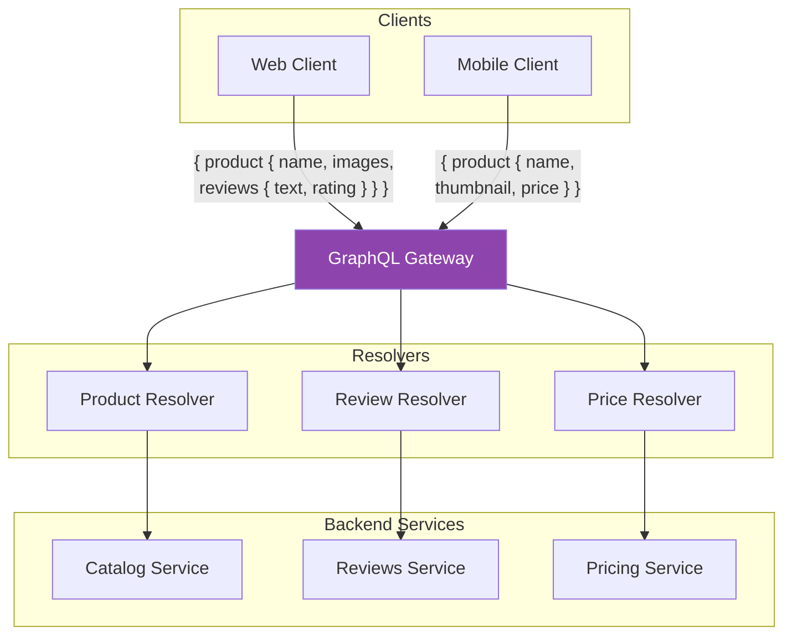

# GraphQL Gateway

## 1. The Problem

Your product page needs data from five microservices:

```
GET /products/123          → Catalog Service
GET /products/123/price    → Pricing Service
GET /products/123/reviews  → Reviews Service
GET /products/123/stock    → Inventory Service
GET /users/456/wishlist    → User Service
```

The mobile app makes 5 sequential HTTP requests. On a 150ms latency connection, that's 750ms of network time alone — before any server processing.

But the mobile product card only needs: name, thumbnail, price, and average rating. The 5 responses collectively return 15KB of JSON. The mobile app uses 400 bytes.

The web app, on the other hand, needs everything: full descriptions, all images, 20 reviews with author details, detailed pricing with tax breakdown, related products. It could use even more data than the current 5 endpoints return.

You've built REST Resource Modeling correctly. Each endpoint is well-designed. **The problem isn't any individual endpoint — it's that clients have wildly different data needs across multiple resources, and REST forces them to either over-fetch or make too many requests.**

---

## 2. Naïve Solutions (and Why They Fail)

### Attempt 1: Giant Composite Endpoint

```
GET /products/123/everything → Returns all data from all services
```

**Why it's wasteful:**
- Mobile downloads 15KB to use 400 bytes. Every request pays the "everything tax."
- The composite endpoint is a maintenance nightmare — it changes whenever any backend service changes.
- Caching is impossible to tune — the composite response has the shortest TTL of all its parts.

### Attempt 2: Backend for Frontend per View

One BFF per screen: product page BFF, search results BFF, cart BFF, wishlist BFF…

**Why it scales poorly for complex UIs:**
- A single-page app has 30+ unique views. That's 30 BFF endpoints — each maintained and tested separately.
- When the product card component appears on 8 different screens, you repeat the aggregation logic 8 times.
- BFF works for 2-3 client types (web/mobile). It doesn't work for the per-component data fetching that modern UIs need.

### Attempt 3: Client-Side Joining

```typescript
const product = await fetch("/products/123");
const price = await fetch(`/pricing/${product.id}`);
const reviews = await fetch(`/reviews/${product.id}`);
// Client stitches these together
```

**Why it hurts on mobile:**
- Sequential requests multiply latency. Parallel requests require the client to manage concurrent state.
- The client becomes tightly coupled to the microservice topology. If you split Catalog into Product + Media, every client changes.
- Error handling combinations explode: what if pricing succeeds but reviews fails?

---

## 3. The Insight

**The client knows exactly what data it needs — let it express that in a structured query, and let the server handle the complexity of fetching from multiple sources. Instead of many small endpoints or one gigantic one, provide a single flexible endpoint where the client's query IS the contract.**

---

## 4. The Pattern

### GraphQL Gateway

**Definition:** A single API endpoint that accepts structured queries specifying exactly which fields and relationships the client needs. A schema defines what data is available; resolvers fetch from backend services and compose the response. Clients get precisely what they ask for — nothing more, nothing less.

**Key components:**
| Component | Role |
|---|---|
| **Schema** | Defines types, fields, and relationships available to clients |
| **Resolvers** | Functions that fetch data for each field, calling backend services |
| **Gateway** | The entry point that parses queries, executes resolvers, and assembles responses |
| **DataLoader** | Batches and caches resolver calls to prevent the N+1 problem |

**Guarantees:**
- No over-fetching — the response contains only requested fields.
- No under-fetching — one query can traverse relationships across services.
- Strongly typed — the schema validates queries before execution.

**Non-guarantees:**
- Does NOT prevent expensive queries — a client can request deeply nested data.
- Does NOT replace backend services — resolvers still call REST/gRPC backends.
- Caching is harder — every query is unique, making HTTP caching less effective.

---

## 5. Mental Model

**A restaurant menu with à la carte ordering.** REST is like a prix fixe menu — you get the set meal, whether you eat the salad or not. GraphQL is à la carte — you order exactly the dishes you want, no more, no less. The kitchen (resolvers) prepares only what was ordered, from the same ingredients (backend services), but assembled per customer's request.

---

## 6. Structure



---

## 7. Code Example

### TypeScript

```typescript
import { ApolloServer } from "@apollo/server";
import { startStandaloneServer } from "@apollo/server/standalone";
import DataLoader from "dataloader";

// ========== SCHEMA ==========
const typeDefs = `#graphql
  type Product {
    id: ID!
    name: String!
    description: String!
    thumbnail: String!
    images: [String!]!
    price: Price!
    reviews(limit: Int = 10): [Review!]!
    reviewSummary: ReviewSummary!
    inStock: Boolean!
  }

  type Price {
    amount: Float!
    currency: String!
    discount: Float
    originalAmount: Float
  }

  type Review {
    id: ID!
    author: User!
    rating: Int!
    text: String!
    createdAt: String!
  }

  type ReviewSummary {
    averageRating: Float!
    totalCount: Int!
  }

  type User {
    id: ID!
    name: String!
    avatar: String
  }

  type Query {
    product(id: ID!): Product
    products(ids: [ID!]!): [Product!]!
  }
`;

// ========== SERVICE CLIENTS ==========
async function fetchFromService(service: string, path: string): Promise<any> {
  const hosts: Record<string, string> = {
    catalog: "http://catalog:8080",
    pricing: "http://pricing:8080",
    reviews: "http://reviews:8080",
    users: "http://users:8080",
  };
  const res = await fetch(`${hosts[service]}${path}`, {
    signal: AbortSignal.timeout(3000),
  });
  if (!res.ok) throw new Error(`${service}: ${res.status}`);
  return res.json();
}

// ========== DATALOADERS (prevent N+1) ==========
function createLoaders() {
  return {
    // Batches: instead of 10 individual user fetches,
    // one call: GET /users?ids=1,2,3,...
    userLoader: new DataLoader<string, any>(async (ids) => {
      const users = await fetchFromService(
        "users",
        `/users?ids=${ids.join(",")}`
      );
      const userMap = new Map(users.map((u: any) => [u.id, u]));
      return ids.map((id) => userMap.get(id) || null);
    }),

    productLoader: new DataLoader<string, any>(async (ids) => {
      const products = await fetchFromService(
        "catalog",
        `/products?ids=${ids.join(",")}`
      );
      const map = new Map(products.map((p: any) => [p.id, p]));
      return ids.map((id) => map.get(id) || null);
    }),
  };
}

// ========== RESOLVERS ==========
const resolvers = {
  Query: {
    product: async (_: any, { id }: { id: string }, ctx: any) => {
      return ctx.loaders.productLoader.load(id);
    },
    products: async (_: any, { ids }: { ids: string[] }, ctx: any) => {
      return ctx.loaders.productLoader.loadMany(ids);
    },
  },

  Product: {
    // Resolved lazily — only called if the client requests this field
    price: async (product: any) => {
      return fetchFromService("pricing", `/prices/${product.id}`);
    },

    reviews: async (product: any, { limit }: { limit: number }) => {
      return fetchFromService(
        "reviews",
        `/products/${product.id}/reviews?limit=${limit}`
      );
    },

    reviewSummary: async (product: any) => {
      return fetchFromService(
        "reviews",
        `/products/${product.id}/summary`
      );
    },

    thumbnail: (product: any) => product.images?.[0] || "",
    inStock: (product: any) => (product.stockCount ?? 0) > 0,
  },

  Review: {
    // DataLoader batches user lookups across all reviews
    author: async (review: any, _: any, ctx: any) => {
      return ctx.loaders.userLoader.load(review.authorId);
    },
  },
};

// ========== SERVER ==========
const server = new ApolloServer({ typeDefs, resolvers });

const { url } = await startStandaloneServer(server, {
  listen: { port: 4000 },
  context: async () => ({
    loaders: createLoaders(), // Fresh loaders per request
  }),
});

console.log(`GraphQL Gateway at ${url}`);

// ========== EXAMPLE QUERIES ==========
// Mobile: 1 request, ~400 bytes response
// query { product(id: "123") { name, thumbnail, price { amount } } }

// Web: 1 request, full response
// query {
//   product(id: "123") {
//     name, description, images
//     price { amount, currency, discount, originalAmount }
//     reviews(limit: 20) { rating, text, author { name, avatar } }
//     reviewSummary { averageRating, totalCount }
//     inStock
//   }
// }
```

### Go

```go
package main

import (
	"context"
	"encoding/json"
	"fmt"
	"net/http"
	"strings"
	"sync"

	"github.com/graphql-go/graphql"
)

// ========== SERVICE CLIENT ==========
var serviceHosts = map[string]string{
	"catalog": "http://catalog:8080",
	"pricing": "http://pricing:8080",
	"reviews": "http://reviews:8080",
}

func callService(ctx context.Context, svc, path string) (map[string]any, error) {
	url := serviceHosts[svc] + path
	req, _ := http.NewRequestWithContext(ctx, "GET", url, nil)
	resp, err := http.DefaultClient.Do(req)
	if err != nil {
		return nil, err
	}
	defer resp.Body.Close()
	var data map[string]any
	json.NewDecoder(resp.Body).Decode(&data)
	return data, nil
}

// ========== SIMPLE DATALOADER ==========
type DataLoader struct {
	mu    sync.Mutex
	cache map[string]any
	fetch func(ctx context.Context, id string) (any, error)
}

func NewDataLoader(fetch func(ctx context.Context, id string) (any, error)) *DataLoader {
	return &DataLoader{cache: make(map[string]any), fetch: fetch}
}

func (dl *DataLoader) Load(ctx context.Context, id string) (any, error) {
	dl.mu.Lock()
	if v, ok := dl.cache[id]; ok {
		dl.mu.Unlock()
		return v, nil
	}
	dl.mu.Unlock()

	v, err := dl.fetch(ctx, id)
	if err != nil {
		return nil, err
	}

	dl.mu.Lock()
	dl.cache[id] = v
	dl.mu.Unlock()
	return v, nil
}

// ========== SCHEMA DEFINITION ==========
var priceType = graphql.NewObject(graphql.ObjectConfig{
	Name: "Price",
	Fields: graphql.Fields{
		"amount":   &graphql.Field{Type: graphql.Float},
		"currency": &graphql.Field{Type: graphql.String},
	},
})

var reviewType = graphql.NewObject(graphql.ObjectConfig{
	Name: "Review",
	Fields: graphql.Fields{
		"rating": &graphql.Field{Type: graphql.Int},
		"text":   &graphql.Field{Type: graphql.String},
	},
})

var productType = graphql.NewObject(graphql.ObjectConfig{
	Name: "Product",
	Fields: graphql.Fields{
		"id":   &graphql.Field{Type: graphql.ID},
		"name": &graphql.Field{Type: graphql.String},
		"thumbnail": &graphql.Field{
			Type: graphql.String,
			Resolve: func(p graphql.ResolveParams) (any, error) {
				product := p.Source.(map[string]any)
				images, _ := product["images"].([]any)
				if len(images) > 0 {
					return images[0], nil
				}
				return "", nil
			},
		},
		"price": &graphql.Field{
			Type: priceType,
			Resolve: func(p graphql.ResolveParams) (any, error) {
				product := p.Source.(map[string]any)
				id := fmt.Sprintf("%v", product["id"])
				return callService(p.Context, "pricing", "/prices/"+id)
			},
		},
		"reviews": &graphql.Field{
			Type: graphql.NewList(reviewType),
			Args: graphql.FieldConfigArgument{
				"limit": &graphql.ArgumentConfig{
					Type:         graphql.Int,
					DefaultValue: 10,
				},
			},
			Resolve: func(p graphql.ResolveParams) (any, error) {
				product := p.Source.(map[string]any)
				id := fmt.Sprintf("%v", product["id"])
				limit := p.Args["limit"].(int)
				data, err := callService(p.Context, "reviews",
					fmt.Sprintf("/products/%s/reviews?limit=%d", id, limit))
				if err != nil {
					return nil, err
				}
				return data["reviews"], nil
			},
		},
	},
})

func main() {
	schema, _ := graphql.NewSchema(graphql.SchemaConfig{
		Query: graphql.NewObject(graphql.ObjectConfig{
			Name: "Query",
			Fields: graphql.Fields{
				"product": &graphql.Field{
					Type: productType,
					Args: graphql.FieldConfigArgument{
						"id": &graphql.ArgumentConfig{Type: graphql.NewNonNull(graphql.ID)},
					},
					Resolve: func(p graphql.ResolveParams) (any, error) {
						id := p.Args["id"].(string)
						return callService(p.Context, "catalog", "/products/"+id)
					},
				},
			},
		}),
	})

	http.HandleFunc("/graphql", func(w http.ResponseWriter, r *http.Request) {
		var req struct {
			Query     string         `json:"query"`
			Variables map[string]any `json:"variables"`
		}
		json.NewDecoder(r.Body).Decode(&req)

		result := graphql.Do(graphql.Params{
			Schema:         schema,
			RequestString:  req.Query,
			VariableValues: req.Variables,
			Context:        r.Context(),
		})

		w.Header().Set("Content-Type", "application/json")
		json.NewEncoder(w).Encode(result)
	})

	fmt.Println("GraphQL Gateway on :4000")
	http.ListenAndServe(":4000", nil)
}

// Example queries — same endpoint, different data:
// Mobile: { product(id:"123") { name, thumbnail, price { amount } } }
// Web:    { product(id:"123") { name, price { amount, currency }, reviews(limit:20) { rating, text } } }
_ = strings.Join // suppress import
```

---

## 8. Gotchas & Beginner Mistakes

| Mistake | Why It Hurts |
|---|---|
| **No query depth/complexity limits** | A client queries `{ product { reviews { author { reviews { author { ... } } } } } }` — infinite nesting that melts your servers. Set max depth (e.g., 5) and query complexity limits. |
| **No DataLoader** | Each review's `author` field triggers a separate HTTP call. 20 reviews = 20 calls. DataLoader batches them into one. Always use DataLoader for relationship resolution. |
| **Exposing internal service topology** | The schema mirrors your microservice boundaries (`CatalogProduct`, `PricingData`). Clients shouldn't know your architecture. Design the schema from the client's perspective. |
| **GraphQL for everything** | CRUD admin panels, file uploads, real-time streams — not everything fits GraphQL well. REST works fine for simple resources. Use GraphQL where the over/under-fetching problem actually exists. |
| **No persisted queries** | Every request sends the full query string (potentially KB of text). Use persisted queries in production — clients send a hash, the server looks up the pre-registered query. |

---

## 9. Related & Confusable Patterns

| Pattern | How It Differs |
|---|---|
| **REST Resource Modeling** | Fixed endpoints with fixed response shapes. GraphQL provides flexible queries against a typed schema. REST is simpler when data needs are uniform. |
| **Backend for Frontend** | One API per client type, server-shaped. GraphQL achieves the same flexibility with one endpoint and client-shaped queries. |
| **API Gateway** | Routes and aggregates REST calls. GraphQL Gateway resolves typed queries. A GraphQL server can sit behind an API Gateway. |
| **CQRS** | Separates read and write models. GraphQL naturally maps: Queries = read model, Mutations = write model. |
| **Facade** | Provides a simplified interface to complex subsystems. A GraphQL Gateway IS a facade — it hides microservice complexity behind a unified schema. |

---

## 10. When This Pattern Is the WRONG Choice

- **Simple CRUD APIs** — If every endpoint returns exactly what clients need, GraphQL's flexibility has no benefit. It adds schema maintenance, resolver complexity, and tooling requirements.
- **File uploads and downloads** — GraphQL handles structured data, not binary streams. Use REST for file operations.
- **Strong HTTP caching needs** — REST responses are cacheable by URL. GraphQL POST requests with unique query bodies defeat HTTP caching. You need application-level caching (Apollo cache, persisted queries with GET).

**Symptoms you should reconsider:**
- Every resolver calls exactly one service with no transformation — you've added a layer of indirection with no aggregation benefit. REST was fine.
- Your schema is 1:1 with your database schema — you're exposing your data model, not a client-focused API. GraphQL should model the client's domain, not your tables.
- You disabled introspection, have no schema documentation, and clients guess at field names — you've stripped the main DX benefit of GraphQL (self-documenting schema).

**How to back out:** Keep the GraphQL server but add REST endpoints for high-traffic, stable queries. Use REST for simple reads, GraphQL for complex aggregation. Eventually, if all queries are simple, sunset the GraphQL layer and use REST directly.
