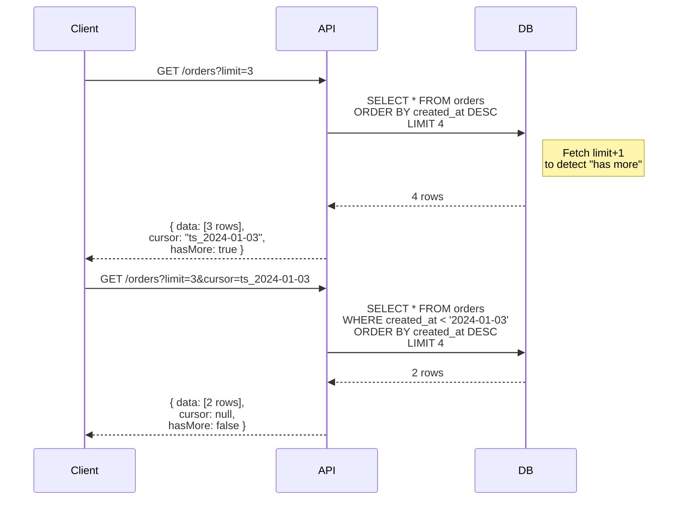

# Pagination

## 1. The Problem

Your e-commerce admin panel has a "List All Orders" page. The backend query is simple:

```sql
SELECT * FROM orders ORDER BY created_at DESC;
```

It returns everything. In development with 50 orders, it works fine. In production with 2.3 million orders, the response is 1.8 GB of JSON. The server runs out of memory serializing it. The network times out transferring it. The browser crashes parsing it.

Even if you add `LIMIT 100`, you immediately face the next problem: how does the client get the next 100? And the 100 after that? And how does the UI show "Page 3 of 23,412"?

You try the obvious approach:

```
GET /orders?page=5&pageSize=100
→ SELECT * FROM orders ORDER BY created_at DESC LIMIT 100 OFFSET 400
```

It works until a customer service agent is browsing page 500. The database has to scan and discard 50,000 rows to get to the 100 it actually returns. The query takes 8 seconds. On page 23,000, it takes 45 seconds. The database CPU pins at 100%.

**Unbounded queries are a ticking time bomb. But naive pagination is just a slow-motion version of the same explosion.**

---

## 2. Naïve Solutions (and Why They Fail)

### Attempt 1: Just Use OFFSET

```sql
SELECT * FROM orders ORDER BY created_at DESC LIMIT 100 OFFSET 50000
```

**Why it degrades:**
- The database must read and discard `OFFSET` rows before returning `LIMIT` rows. At offset 50,000, the query scans 50,100 rows.
- Performance degrades linearly with page number. Page 1 is instant; page 500 takes seconds.
- If a new order is created while someone paginates, rows shift — page 6 shows a duplicate from page 5, or skips an order entirely.

### Attempt 2: Fetch All, Paginate Client-Side

```typescript
const allOrders = await fetch("/orders"); // 2.3M rows
const page = allOrders.slice(400, 500);   // 100 rows shown
```

**Why it's absurd:**
- Downloads gigabytes of data to show 100 rows. Mobile users on data plans will hate you.
- The server has to serialize millions of records, allocating memory proportional to the full dataset.
- Not an exaggeration — this pattern appears in production codebases more than you'd think.

### Attempt 3: Arbitrary Hard Limit

```
GET /orders → Returns first 1000 orders max, no next page link
```

**Why it's incomplete:**
- What if the user needs order #1,001? They can't access it.
- No mechanism to get "the next batch." The API is lying — it claims to return "all orders" but silently truncates.
- Sorting changes which 1,000 you get. Adding `?sort=amount` returns completely different records with no warning.

---

## 3. The Insight

**Pagination is a streaming problem in disguise. The key is never resuming by position ("give me row 5001"), but by value ("give me the next row after this timestamp"). Position changes when data changes. Values don't.**

---

## 4. The Pattern

### Pagination (Cursor-Based)

**Definition:** A strategy to divide large result sets into manageable pages, where each response includes a pointer (cursor) to the position in the dataset. Cursor-based pagination uses a value from the last returned record as the starting point for the next query, enabling consistent O(1) page retrieval regardless of position.

**Two strategies compared:**

| Property | Offset-Based | Cursor-Based |
|---|---|---|
| URL | `?page=5&pageSize=20` | `?cursor=abc123&limit=20` |
| DB query | `OFFSET 80 LIMIT 20` | `WHERE id < 'abc123' LIMIT 20` |
| Deep page performance | O(offset) — degrades | O(1) — constant |
| Jump to page N | ✅ Easy | ❌ Not direct |
| Stable under inserts | ❌ Rows shift | ✅ Stable |
| Total count | ✅ Cheap-ish | ❌ Requires separate query |

**Guarantees:**
- Cursor-based: No duplicates or skips when data changes between page fetches.
- Bounded memory — only `limit` rows loaded at a time.
- Consistent performance for any page depth.

**Non-guarantees:**
- Cannot jump to arbitrary page N with cursor-based.
- Total count requires a separate (potentially expensive) query.
- Cursor must be opaque to clients — they cannot construct cursors.

---

## 5. Mental Model

**A bookmark in a book.** Offset pagination is like saying "I was on sentence 5,000" — if someone adds a page, you end up at the wrong sentence. Cursor pagination is like putting a sticky note on the last sentence you read — no matter how many pages are added, you pick up right where you left off.

---

## 6. Structure



---

## 7. Code Example

### TypeScript

```typescript
import express, { Request, Response } from "express";
import { Pool } from "pg";

const pool = new Pool({ connectionString: process.env.DATABASE_URL });
const app = express();

// ========== CURSOR ENCODING ==========
// Cursors are opaque to clients — encode internal state

interface CursorPayload {
  createdAt: string;
  id: string; // tie-breaker for same-timestamp records
}

function encodeCursor(payload: CursorPayload): string {
  return Buffer.from(JSON.stringify(payload)).toString("base64url");
}

function decodeCursor(cursor: string): CursorPayload {
  return JSON.parse(Buffer.from(cursor, "base64url").toString());
}

// ========== PAGINATED RESPONSE TYPE ==========
interface PaginatedResponse<T> {
  data: T[];
  pagination: {
    cursor: string | null;    // null = no more pages
    hasMore: boolean;
    limit: number;
  };
}

// ========== CURSOR-BASED PAGINATION ==========
app.get("/orders", async (req: Request, res: Response) => {
  const limit = Math.min(parseInt(req.query.limit as string) || 20, 100);
  const cursor = req.query.cursor as string | undefined;

  let query: string;
  let params: any[];

  if (cursor) {
    const { createdAt, id } = decodeCursor(cursor);
    // Fetch limit + 1 to know if there are more pages
    query = `
      SELECT id, customer_id, total, status, created_at
      FROM orders
      WHERE (created_at, id) < ($1, $2)
      ORDER BY created_at DESC, id DESC
      LIMIT $3
    `;
    params = [createdAt, id, limit + 1];
  } else {
    query = `
      SELECT id, customer_id, total, status, created_at
      FROM orders
      ORDER BY created_at DESC, id DESC
      LIMIT $1
    `;
    params = [limit + 1];
  }

  const result = await pool.query(query, params);
  const hasMore = result.rows.length > limit;
  const data = hasMore ? result.rows.slice(0, limit) : result.rows;

  const lastItem = data[data.length - 1];
  const nextCursor = hasMore && lastItem
    ? encodeCursor({ createdAt: lastItem.created_at, id: lastItem.id })
    : null;

  const response: PaginatedResponse<any> = {
    data,
    pagination: {
      cursor: nextCursor,
      hasMore,
      limit,
    },
  };

  res.json(response);
});

// ========== OFFSET-BASED (for comparison / when needed) ==========
app.get("/products", async (req: Request, res: Response) => {
  const page = Math.max(parseInt(req.query.page as string) || 1, 1);
  const pageSize = Math.min(parseInt(req.query.pageSize as string) || 20, 100);
  const offset = (page - 1) * pageSize;

  const [dataResult, countResult] = await Promise.all([
    pool.query(
      `SELECT id, name, price FROM products ORDER BY name LIMIT $1 OFFSET $2`,
      [pageSize, offset]
    ),
    pool.query(`SELECT count(*) FROM products`),
  ]);

  const total = parseInt(countResult.rows[0].count);
  const totalPages = Math.ceil(total / pageSize);

  res.json({
    data: dataResult.rows,
    pagination: {
      page,
      pageSize,
      total,
      totalPages,
      hasNext: page < totalPages,
      hasPrev: page > 1,
    },
  });
});

app.listen(3000, () => console.log("API on :3000"));
```

### Go

```go
package main

import (
	"context"
	"encoding/base64"
	"encoding/json"
	"fmt"
	"net/http"
	"strconv"

	"github.com/jackc/pgx/v5/pgxpool"
)

// ========== CURSOR ENCODING ==========
type CursorPayload struct {
	CreatedAt string `json:"createdAt"`
	ID        string `json:"id"`
}

func encodeCursor(c CursorPayload) string {
	b, _ := json.Marshal(c)
	return base64.RawURLEncoding.EncodeToString(b)
}

func decodeCursor(s string) (CursorPayload, error) {
	b, err := base64.RawURLEncoding.DecodeString(s)
	if err != nil {
		return CursorPayload{}, err
	}
	var c CursorPayload
	err = json.Unmarshal(b, &c)
	return c, err
}

// ========== RESPONSE TYPE ==========
type Pagination struct {
	Cursor  *string `json:"cursor"`  // nil = last page
	HasMore bool    `json:"hasMore"`
	Limit   int     `json:"limit"`
}

type PaginatedResponse struct {
	Data       []map[string]any `json:"data"`
	Pagination Pagination       `json:"pagination"`
}

// ========== HANDLER ==========
func ordersHandler(pool *pgxpool.Pool) http.HandlerFunc {
	return func(w http.ResponseWriter, r *http.Request) {
		ctx := r.Context()

		limit := 20
		if l, err := strconv.Atoi(r.URL.Query().Get("limit")); err == nil && l > 0 && l <= 100 {
			limit = l
		}

		cursorStr := r.URL.Query().Get("cursor")

		var rows []map[string]any
		var err error

		if cursorStr != "" {
			cursor, cerr := decodeCursor(cursorStr)
			if cerr != nil {
				http.Error(w, "invalid cursor", http.StatusBadRequest)
				return
			}
			rows, err = queryOrders(ctx, pool,
				`SELECT id, customer_id, total, status, created_at
				 FROM orders
				 WHERE (created_at, id) < ($1, $2)
				 ORDER BY created_at DESC, id DESC
				 LIMIT $3`,
				cursor.CreatedAt, cursor.ID, limit+1)
		} else {
			rows, err = queryOrders(ctx, pool,
				`SELECT id, customer_id, total, status, created_at
				 FROM orders
				 ORDER BY created_at DESC, id DESC
				 LIMIT $1`, limit+1)
		}

		if err != nil {
			http.Error(w, "query failed", http.StatusInternalServerError)
			return
		}

		hasMore := len(rows) > limit
		if hasMore {
			rows = rows[:limit]
		}

		var nextCursor *string
		if hasMore && len(rows) > 0 {
			last := rows[len(rows)-1]
			c := encodeCursor(CursorPayload{
				CreatedAt: fmt.Sprintf("%v", last["created_at"]),
				ID:        fmt.Sprintf("%v", last["id"]),
			})
			nextCursor = &c
		}

		resp := PaginatedResponse{
			Data: rows,
			Pagination: Pagination{
				Cursor:  nextCursor,
				HasMore: hasMore,
				Limit:   limit,
			},
		}

		w.Header().Set("Content-Type", "application/json")
		json.NewEncoder(w).Encode(resp)
	}
}

func queryOrders(ctx context.Context, pool *pgxpool.Pool, query string, args ...any) ([]map[string]any, error) {
	pgRows, err := pool.Query(ctx, query, args...)
	if err != nil {
		return nil, err
	}
	defer pgRows.Close()

	var results []map[string]any
	cols := pgRows.FieldDescriptions()

	for pgRows.Next() {
		vals, _ := pgRows.Values()
		row := make(map[string]any, len(cols))
		for i, col := range cols {
			row[string(col.Name)] = vals[i]
		}
		results = append(results, row)
	}
	return results, nil
}

func main() {
	pool, err := pgxpool.New(context.Background(), "postgres://localhost/mydb")
	if err != nil {
		panic(err)
	}
	defer pool.Close()

	http.HandleFunc("/orders", ordersHandler(pool))
	fmt.Println("API on :3000")
	http.ListenAndServe(":3000", nil)
}
```

---

## 8. Gotchas & Beginner Mistakes

| Mistake | Why It Hurts |
|---|---|
| **Exposing raw database IDs as cursors** | `?cursor=12345` lets clients construct cursors, skip pages, or probe your database. Use opaque, encoded cursors (Base64). |
| **Single-column cursors** | `WHERE created_at < $1` fails when two rows have the same timestamp — you skip one. Always use a tie-breaker: `WHERE (created_at, id) < ($1, $2)`. |
| **No LIMIT enforcement** | `?limit=1000000` returns a million rows. Always enforce a maximum (e.g., 100). Silently cap it. |
| **Counting total rows on every request** | `SELECT count(*) FROM orders` on 10M rows takes seconds. If you need counts, cache them. For cursor-based pagination, consider dropping total counts entirely. |
| **No index on sort columns** | `ORDER BY created_at DESC` without an index forces a full table scan. Pagination requires indexes on the columns you sort and filter by. Create: `CREATE INDEX idx_orders_cursor ON orders(created_at DESC, id DESC)`. |

---

## 9. Related & Confusable Patterns

| Pattern | How It Differs |
|---|---|
| **Event Streaming** | Also processes data in batches, but as a push model (producer sends events). Pagination is pull (client requests pages). |
| **Lazy Loading** | Defers data loading until accessed. Pagination defers loading until requested, but at a coarser (page) granularity. |
| **Infinite Scroll** | A UI pattern that uses cursor-based pagination underneath. The UI auto-fetches the next page on scroll. |
| **Batch Processing** | Processes large datasets in chunks. Similar to pagination but for background processing, not API responses. |
| **GraphQL Connections** | GraphQL's standard cursor-based pagination (Relay specification). Uses `edges`, `nodes`, `pageInfo` — same concept, formalized schema. |

---

## 10. When This Pattern Is the WRONG Choice

- **Small, bounded datasets** — A list of 50 US states doesn't need pagination. If the full dataset fits comfortably in a single response (<100 items), return it all.
- **Real-time data** — A live dashboard showing the last 10 events doesn't need pagination. Use WebSocket or SSE to push updates.
- **Full-text search results** — Search engines rank by relevance. Users rarely go past page 3. Offset-based with a hard depth limit (e.g., max 1000 results) is fine.

**Symptoms you should reconsider:**
- Users need to jump to page 500 — cursor-based can't do this cheaply. Consider offset with a depth limit, or filters that reduce the result set.
- Every response includes a total count — if count(*) is slow, you might be computing it unnecessarily. Ask if users really need the exact total or if "1000+ results" is sufficient.
- The cursor format keeps changing — your cursor is encoding too much state. Keep cursors simple: sort value + tie-breaker ID.

**How to back out:** For offset-based, the "back out" is adding cursor support as an alternative. For cursor-based, add offset support for use cases that genuinely need page jumping (admin tools, reports). You can support both strategies on the same endpoint.
