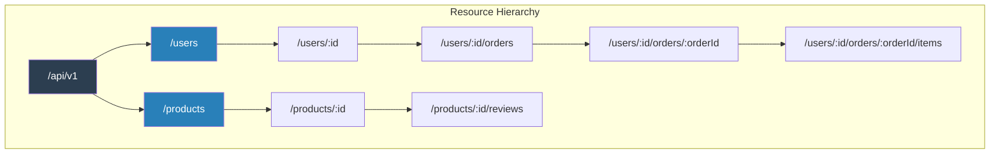

# REST Resource Modeling

## 1. The Problem

Your team builds an e-commerce API. Different developers design endpoints independently. After 6 months, the API looks like this:

```
POST /getProducts          — fetches product list
POST /createNewProduct     — creates a product
GET  /product_details/123  — gets one product
POST /updateProductInfo    — updates a product (ID in request body)
GET  /deleteProduct/123    — deletes a product
POST /searchProducts       — searches with filters
POST /placeOrder           — creates an order
GET  /getOrderStatus/456   — gets order status
POST /cancelOrderAction    — cancels an order
```

Every endpoint uses a different naming convention. Some use GET for mutations (delete), some use POST for reads (getProducts). Caching is impossible because GET requests have side effects. Error responses use ad-hoc formats. Frontend developers spend more time reading API documentation than writing code.

A new developer joins and asks: "How do I update an order's shipping address?" Nobody knows — is it `POST /updateOrderShipping`? `POST /modifyOrder`? `POST /orderShippingUpdate`?

---

## 2. Naïve Solutions (and Why They Fail)

### Attempt 1: RPC-Style Naming (verb-first)

```
POST /getUser
POST /createUser
POST /deleteUser
POST /getUserOrders
POST /createUserOrder
POST /cancelUserOrder
POST /getUserOrderItems
```

**Why it's problematic:**
- Every operation is POST with a verb in the URL. HTTP caches, CDNs, and browser caches can't help — they rely on GET semantics to cache safely.
- The endpoint list grows linearly with features. 50 entities × 5 operations = 250 unique endpoint names.
- No discoverability — you must read docs to know every action.

### Attempt 2: Entity-Based but Inconsistent

```
GET  /users
POST /users
GET  /users/123
POST /users/123/update    # Why not PUT /users/123?
GET  /users/123/delete    # GET with side effects
POST /users/123/orders    # Is this creating or listing?
```

**Why it's confusing:**
- Mixing paradigms: some endpoints use HTTP verbs correctly, others embed verbs in the URL.
- `GET /users/123/delete` violates HTTP safety — GET requests should not modify state. Crawlers and prefetch tools will trigger deletions.

### Attempt 3: Everything Under One Endpoint

```
POST /api
{
  "action": "getUser",
  "params": { "id": 123 }
}
```

**Why it defeats the ecosystem:**
- Every HTTP tool (caching, logging, monitoring, rate limiting) groups by URL + method. With one endpoint, all analytics show "POST /api" with no breakdown.
- Loses status code semantics — a 404 on a user should mean "user not found," not "endpoint not found."

---

## 3. The Insight

**Model your API around resources (nouns), not actions (verbs). Let HTTP methods (GET, POST, PUT, DELETE) express the action. Combine resources and methods uniformly, and the API becomes predictable, cacheable, and self-documenting: `GET /users/123/orders` is obviously "list user 123's orders" without reading any docs.**

---

## 4. The Pattern

### REST Resource Modeling

**Definition:** A design approach for HTTP APIs where every entity in the domain is modeled as a **resource** identified by a URL. Standard HTTP methods convey the operation, status codes convey the result, and URL paths express the resource hierarchy. The API's structure mirrors the domain model, making it predictable.

| HTTP Method | Meaning | Idempotent? | Safe? |
|---|---|---|---|
| GET | Read resource(s) | Yes | Yes |
| POST | Create new resource | No | No |
| PUT | Replace resource entirely | Yes | No |
| PATCH | Partial update | No* | No |
| DELETE | Remove resource | Yes | No |

**Guarantees:**
- Predictable URL structure: knowing the domain gives you the endpoints.
- HTTP caching works correctly (GET is safe to cache, POST is not).
- Standard error semantics (404 = not found, 409 = conflict, 422 = validation error).

**Non-guarantees:**
- Does NOT handle all operations naturally. "Transfer money from A to B" doesn't map cleanly to CRUD on a single resource.
- Does NOT prevent over-fetching or under-fetching — the resource shape is fixed.

---

## 5. Mental Model

**A library catalog.** Books are resources (`/books/978-0-123`). You ask the librarian (HTTP method) what you want to do: "Show me" (GET), "Add this" (POST), "Replace with new edition" (PUT), "Remove from shelf" (DELETE). You don't say "doBookLookup" — the catalog structure and the action are separate concerns.

---

## 6. Structure



```
GET    /users                 → List users (paginated)
POST   /users                 → Create user
GET    /users/123             → Get user 123
PUT    /users/123             → Replace user 123
PATCH  /users/123             → Partial update user 123
DELETE /users/123             → Delete user 123

GET    /users/123/orders      → List user 123's orders
POST   /users/123/orders      → Create order for user 123
GET    /users/123/orders/456  → Get specific order
```

---

## 7. Code Example

### TypeScript

```typescript
import express, { Request, Response, Router } from "express";

const app = express();
app.use(express.json());

// ========== RESOURCE: /products ==========
const products = Router();

// GET /products — List with pagination, filtering, sorting
products.get("/", async (req: Request, res: Response) => {
  const page = parseInt(req.query.page as string) || 1;
  const limit = Math.min(parseInt(req.query.limit as string) || 20, 100);
  const category = req.query.category as string | undefined;

  const items = await db.products.findMany({
    where: category ? { category } : undefined,
    skip: (page - 1) * limit,
    take: limit,
  });

  const total = await db.products.count({
    where: category ? { category } : undefined,
  });

  res.json({
    data: items,
    meta: {
      page,
      limit,
      total,
      totalPages: Math.ceil(total / limit),
    },
    links: {
      self: `/products?page=${page}&limit=${limit}`,
      next: page * limit < total ? `/products?page=${page + 1}&limit=${limit}` : null,
      prev: page > 1 ? `/products?page=${page - 1}&limit=${limit}` : null,
    },
  });
});

// POST /products — Create
products.post("/", async (req: Request, res: Response) => {
  const { name, price, category } = req.body;

  if (!name || price == null) {
    res.status(422).json({
      error: "Validation failed",
      details: [
        ...(!name ? [{ field: "name", message: "required" }] : []),
        ...(price == null ? [{ field: "price", message: "required" }] : []),
      ],
    });
    return;
  }

  const product = await db.products.create({ data: { name, price, category } });

  res.status(201)
    .header("Location", `/products/${product.id}`)
    .json({ data: product });
});

// GET /products/:id — Read single
products.get("/:id", async (req: Request, res: Response) => {
  const product = await db.products.findUnique({ where: { id: req.params.id } });

  if (!product) {
    res.status(404).json({ error: "Product not found" });
    return;
  }

  res.json({ data: product });
});

// PUT /products/:id — Full replace
products.put("/:id", async (req: Request, res: Response) => {
  const { name, price, category } = req.body;

  const product = await db.products.update({
    where: { id: req.params.id },
    data: { name, price, category },
  });

  res.json({ data: product });
});

// PATCH /products/:id — Partial update
products.patch("/:id", async (req: Request, res: Response) => {
  const updates: Record<string, unknown> = {};
  if (req.body.name !== undefined) updates.name = req.body.name;
  if (req.body.price !== undefined) updates.price = req.body.price;

  const product = await db.products.update({
    where: { id: req.params.id },
    data: updates,
  });

  res.json({ data: product });
});

// DELETE /products/:id — Remove
products.delete("/:id", async (req: Request, res: Response) => {
  await db.products.delete({ where: { id: req.params.id } });
  res.status(204).send();
});

// ========== SUB-RESOURCE: /products/:id/reviews ==========
products.get("/:id/reviews", async (req: Request, res: Response) => {
  const reviews = await db.reviews.findMany({
    where: { productId: req.params.id },
  });
  res.json({ data: reviews });
});

products.post("/:id/reviews", async (req: Request, res: Response) => {
  const review = await db.reviews.create({
    data: {
      productId: req.params.id,
      rating: req.body.rating,
      comment: req.body.comment,
      userId: req.body.userId,
    },
  });
  res.status(201).json({ data: review });
});

app.use("/api/v1/products", products);

// Pseudo DB (replace with real ORM)
const db = {
  products: {
    findMany: async (q: any) => [],
    count: async (q: any) => 0,
    create: async (q: any) => ({ id: "123", ...q.data }),
    findUnique: async (q: any) => ({ id: q.where.id, name: "Widget", price: 9.99 }),
    update: async (q: any) => ({ id: q.where.id, ...q.data }),
    delete: async (q: any) => {},
  },
  reviews: {
    findMany: async (q: any) => [],
    create: async (q: any) => ({ id: "r1", ...q.data }),
  },
};
```

### Go

```go
package main

import (
	"encoding/json"
	"fmt"
	"net/http"
	"strconv"
	"strings"
)

// ========== DOMAIN ==========
type Product struct {
	ID       string  `json:"id"`
	Name     string  `json:"name"`
	Price    float64 `json:"price"`
	Category string  `json:"category"`
}

type APIResponse struct {
	Data  interface{} `json:"data,omitempty"`
	Error string      `json:"error,omitempty"`
	Meta  *Meta       `json:"meta,omitempty"`
}

type Meta struct {
	Page       int `json:"page"`
	Limit      int `json:"limit"`
	Total      int `json:"total"`
	TotalPages int `json:"totalPages"`
}

// ========== RESOURCE HANDLER ==========
type ProductHandler struct {
	products map[string]Product
}

func (h *ProductHandler) ServeHTTP(w http.ResponseWriter, r *http.Request) {
	w.Header().Set("Content-Type", "application/json")

	// Route: /products or /products/{id}
	path := strings.TrimPrefix(r.URL.Path, "/api/v1/products")
	id := strings.TrimPrefix(path, "/")

	if id == "" || id == "/" {
		// Collection resource
		switch r.Method {
		case http.MethodGet:
			h.list(w, r)
		case http.MethodPost:
			h.create(w, r)
		default:
			w.WriteHeader(http.StatusMethodNotAllowed)
		}
	} else {
		// Instance resource
		switch r.Method {
		case http.MethodGet:
			h.get(w, r, id)
		case http.MethodPut:
			h.replace(w, r, id)
		case http.MethodDelete:
			h.remove(w, r, id)
		default:
			w.WriteHeader(http.StatusMethodNotAllowed)
		}
	}
}

func (h *ProductHandler) list(w http.ResponseWriter, r *http.Request) {
	page, _ := strconv.Atoi(r.URL.Query().Get("page"))
	if page < 1 { page = 1 }
	limit, _ := strconv.Atoi(r.URL.Query().Get("limit"))
	if limit < 1 { limit = 20 }
	if limit > 100 { limit = 100 }

	all := make([]Product, 0, len(h.products))
	for _, p := range h.products {
		all = append(all, p)
	}

	total := len(all)
	start := (page - 1) * limit
	end := start + limit
	if start > total { start = total }
	if end > total { end = total }

	json.NewEncoder(w).Encode(APIResponse{
		Data: all[start:end],
		Meta: &Meta{
			Page: page, Limit: limit,
			Total: total, TotalPages: (total + limit - 1) / limit,
		},
	})
}

func (h *ProductHandler) create(w http.ResponseWriter, r *http.Request) {
	var p Product
	if err := json.NewDecoder(r.Body).Decode(&p); err != nil {
		w.WriteHeader(http.StatusBadRequest)
		json.NewEncoder(w).Encode(APIResponse{Error: "Invalid JSON"})
		return
	}

	if p.Name == "" || p.Price <= 0 {
		w.WriteHeader(http.StatusUnprocessableEntity)
		json.NewEncoder(w).Encode(APIResponse{Error: "name and price required"})
		return
	}

	p.ID = fmt.Sprintf("prod_%d", len(h.products)+1)
	h.products[p.ID] = p

	w.Header().Set("Location", "/api/v1/products/"+p.ID)
	w.WriteHeader(http.StatusCreated)
	json.NewEncoder(w).Encode(APIResponse{Data: p})
}

func (h *ProductHandler) get(w http.ResponseWriter, r *http.Request, id string) {
	p, ok := h.products[id]
	if !ok {
		w.WriteHeader(http.StatusNotFound)
		json.NewEncoder(w).Encode(APIResponse{Error: "Product not found"})
		return
	}
	json.NewEncoder(w).Encode(APIResponse{Data: p})
}

func (h *ProductHandler) replace(w http.ResponseWriter, r *http.Request, id string) {
	if _, ok := h.products[id]; !ok {
		w.WriteHeader(http.StatusNotFound)
		json.NewEncoder(w).Encode(APIResponse{Error: "Product not found"})
		return
	}

	var p Product
	json.NewDecoder(r.Body).Decode(&p)
	p.ID = id
	h.products[id] = p

	json.NewEncoder(w).Encode(APIResponse{Data: p})
}

func (h *ProductHandler) remove(w http.ResponseWriter, r *http.Request, id string) {
	if _, ok := h.products[id]; !ok {
		w.WriteHeader(http.StatusNotFound)
		return
	}
	delete(h.products, id)
	w.WriteHeader(http.StatusNoContent)
}

func main() {
	handler := &ProductHandler{
		products: map[string]Product{
			"prod_1": {ID: "prod_1", Name: "Widget", Price: 9.99, Category: "tools"},
			"prod_2": {ID: "prod_2", Name: "Gadget", Price: 24.99, Category: "electronics"},
		},
	}

	http.Handle("/api/v1/products/", handler)
	http.Handle("/api/v1/products", handler)
	fmt.Println("Server on :8080")
	http.ListenAndServe(":8080", nil)
}
```

---

## 8. Gotchas & Beginner Mistakes

| Mistake | Why It Hurts |
|---|---|
| **Verbs in URLs** | `/getUser`, `/deleteProduct` — these are RPC, not REST. The HTTP method IS the verb. Use `GET /users/123`, `DELETE /products/456`. |
| **GET with side effects** | `GET /users/123/activate` changes state. Browsers, crawlers, and CDNs assume GET is safe. Prefetch plugins will randomly activate users. Use `POST /users/123/activation`. |
| **Deeply nested URLs** | `/users/1/orders/2/items/3/reviews/4/replies/5` — too deep. Flatten after 2-3 levels. Use top-level `/reviews/4` with a `productId` filter instead of nesting 4 levels deep. |
| **Using 200 for everything** | `200 OK { "error": "not found" }` — why? Use `404 Not Found`. Clients parse status codes for routing, retry decisions, and error handling. |
| **Ignoring `Location` header** | After `POST /products`, return `201 Created` with `Location: /products/new-id`. Clients need to know the URL of the newly created resource. |

---

## 9. Related & Confusable Patterns

| Pattern | How It Differs |
|---|---|
| **GraphQL** | GraphQL exposes a single endpoint with flexible queries. REST exposes fixed resource endpoints. GraphQL solves over/under-fetching; REST is simpler and cacheable at the HTTP level. |
| **RPC** | RPC names the action (`createUser`). REST names the resource (`POST /users`). RPC is action-oriented; REST is resource-oriented. Both are valid; REST leverages HTTP semantics better. |
| **HATEOAS** | REST + hypermedia links that let clients discover actions dynamically. "Full REST" but rarely implemented in practice. Most APIs use REST resource modeling without HATEOAS. |
| **API Gateway** | Sits in front of REST APIs, handling cross-cutting concerns. REST defines the API shape; the gateway handles auth, rate limiting, routing. |
| **CQRS** | Separates read and write models. REST's resource model maps naturally to CQRS: GET endpoints return the read model, POST/PUT endpoints modify the write model. |

---

## 10. When This Pattern Is the WRONG Choice

- **Real-time bidirectional communication** — Chat, gaming, live collaboration. REST's request-response model is too chatty. Use WebSockets or gRPC streaming.
- **Operations that don't map to resources** — "Send a batch of analytics events" or "Run a report with 15 parameters." These are actions, not CRUD on resources. Use RPC-style endpoints for complex actions.
- **Internal microservice communication** — REST over HTTP adds serialization, network hops, and parsing overhead. gRPC with Protocol Buffers is more efficient for service-to-service calls.

**Symptoms you should reconsider:**
- Your API has 20 custom actions that don't map to any resource (all `POST /actions/do-something`). You're fighting the REST model — consider RPC for those endpoints.
- Clients need to make 5 API calls to render one page. Over-fetching/under-fetching is killing performance. Consider GraphQL or BFF.
- You're debating PUT vs. PATCH for 30 minutes. REST's value is in predictability, not theological purity.

**How to back out:** REST resource modeling applies at the URL and method level. You can incrementally add RPC-style endpoints for operations that don't fit, or layer GraphQL on top of existing REST endpoints.
