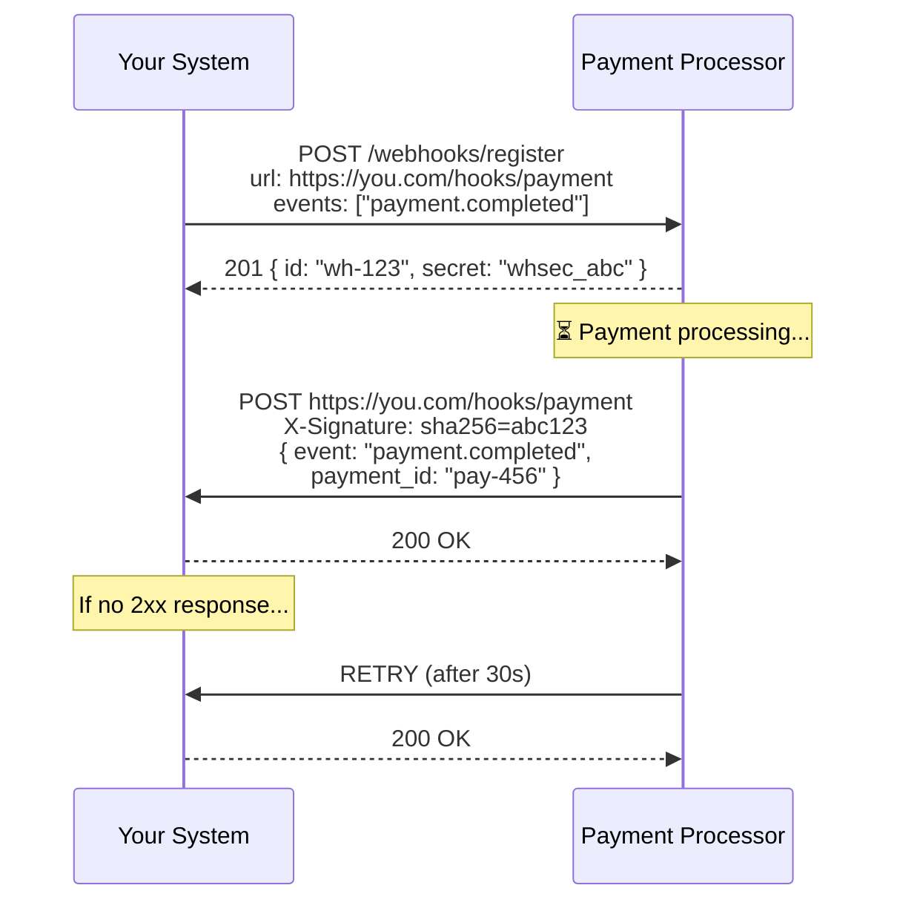

# Webhook

## 1. The Problem

Your e-commerce platform integrates with a payment processor. After a customer pays, you need to know the payment status to fulfill the order. The payment takes 5-30 seconds to process (fraud checks, bank authorization).

Your first attempt: poll.

```typescript
async function waitForPayment(paymentId: string): Promise<string> {
  while (true) {
    const status = await fetch(`/payments/${paymentId}`);
    const data = await status.json();
    if (data.status !== "pending") return data.status;
    await sleep(2000); // Check every 2 seconds
  }
}
```

It works for one payment. But your platform processes 50,000 payments per hour. Each payment takes ~15 seconds to resolve. That's:
- 50,000 payments × 7 polls each = **350,000 API calls per hour** to the payment processor.
- 95% of those calls return `"pending"` — they carry no information.
- The payment processor rate-limits you at 100,000 calls/hour. You're 3.5x over.

You reduce polling frequency to every 10 seconds. Now some payments take 30 seconds longer to detect as completed. Customers see "Processing..." for 40 seconds and refresh the page, creating another payment. Duplicate charges. Chargebacks.

**Polling is asking "are we there yet?" every 2 seconds on a 15-second journey. The system needs to call YOU when it's ready.**

---

## 2. Naïve Solutions (and Why They Fail)

### Attempt 1: Polling with Exponential Backoff

```typescript
// 1s, 2s, 4s, 8s, 16s, 32s, 60s...
const delay = Math.min(1000 * Math.pow(2, attempt), 60000);
```

**Why it still wastes resources:**
- Better than fixed-interval polling, but you're still making thousands of calls that return "pending."
- At 60-second intervals, you detect events up to 60 seconds late. Unacceptable for payment confirmation.
- The payment processor still sees you hammering their API.

### Attempt 2: Long Polling

```
GET /payments/123/status → hangs for 30 seconds until status changes
```

**Why it's fragile:**
- Holds an HTTP connection open for 30 seconds. Your server's connection pool fills up.
- Load balancers and proxies typically timeout at 30-60 seconds. The connection drops, and you reconnect — essentially polling with extra steps.
- If the payment takes 5 minutes (manual review), you've held a connection for 5 minutes doing nothing.

### Attempt 3: WebSocket

```
ws://payments.example.com/stream/123
```

**Why it's overkill for notifications:**
- WebSockets are bidirectional, persistent connections. For a one-time notification ("payment succeeded"), that's a permanent connection waiting for a single message.
- WebSocket infrastructure (keep-alive, reconnection, state management) is complex. You're building a real-time system for a notification problem.
- The payment processor probably doesn't offer WebSocket. You'd need to build it yourself on top of their polling API.

---

## 3. The Insight

**Instead of pulling data FROM the source, let the source push data TO you. The source knows exactly when the event happens — it should tell you immediately, exactly once, through a simple HTTP callback. This inverts the communication direction: don't call us, we'll call you.**

---

## 4. The Pattern

### Webhook

**Definition:** An HTTP callback mechanism where a source system makes an HTTP POST request to a pre-registered URL on the consumer system when an event occurs. The consumer receives the event payload in near-real-time without polling. The consumer is responsible for handling the request quickly and processing the event reliably.

**Key components:**
| Component | Role |
|---|---|
| **Registration** | Consumer provides a URL; producer stores it |
| **Event** | The trigger that causes the producer to send a callback |
| **Delivery** | HTTP POST with event payload to the registered URL |
| **Verification** | Signature validation proving the webhook is authentic |
| **Retry** | Producer retries delivery on failure (with backoff) |

**Guarantees:**
- Near-real-time notification — no polling delay.
- Eliminates wasted API calls — you're only contacted when something happens.
- Simple protocol — standard HTTP POST, no special infrastructure.

**Non-guarantees:**
- NOT exactly-once delivery — webhooks can be sent multiple times (retries). Your handler must be idempotent.
- NOT ordered — events may arrive out of order.
- NOT guaranteed to arrive — if your server is down during all retry attempts, the event is lost. Have a reconciliation mechanism.

---

## 5. Mental Model

**A restaurant buzzer.** When you order food, the restaurant doesn't send someone to your table every 30 seconds to say "not ready yet." They give you a buzzer. When your food IS ready, the buzzer goes off. You go to the counter exactly once, at exactly the right time. Zero wasted trips. The buzzer is the webhook.

---

## 6. Structure



---

## 7. Code Example

### TypeScript

```typescript
import express, { Request, Response } from "express";
import crypto from "crypto";

const app = express();

// ========== RAW BODY FOR SIGNATURE VERIFICATION ==========
// Must parse raw body BEFORE json middleware for webhook routes
app.use("/hooks", express.raw({ type: "application/json" }));
app.use(express.json());

// ========== SIGNATURE VERIFICATION ==========
const WEBHOOK_SECRET = process.env.WEBHOOK_SECRET!;

function verifySignature(payload: Buffer, signature: string): boolean {
  const expected = crypto
    .createHmac("sha256", WEBHOOK_SECRET)
    .update(payload)
    .digest("hex");
  const provided = signature.replace("sha256=", "");

  // Timing-safe comparison to prevent timing attacks
  return crypto.timingSafeEqual(
    Buffer.from(expected, "hex"),
    Buffer.from(provided, "hex")
  );
}

// ========== IDEMPOTENCY STORE ==========
const processedEvents = new Set<string>(); // Use Redis in production

function isAlreadyProcessed(eventId: string): boolean {
  return processedEvents.has(eventId);
}

function markProcessed(eventId: string): void {
  processedEvents.add(eventId);
}

// ========== WEBHOOK RECEIVER ==========
app.post("/hooks/payment", async (req: Request, res: Response) => {
  const rawBody = req.body as Buffer;
  const signature = req.headers["x-webhook-signature"] as string;

  // 1. Verify authenticity
  if (!signature || !verifySignature(rawBody, signature)) {
    console.error("Invalid webhook signature");
    res.status(401).json({ error: "Invalid signature" });
    return;
  }

  const event = JSON.parse(rawBody.toString());

  // 2. Idempotency — handle duplicate deliveries
  if (isAlreadyProcessed(event.id)) {
    console.log(`Duplicate event: ${event.id}, skipping`);
    res.status(200).json({ status: "already_processed" });
    return;
  }

  // 3. Respond quickly — acknowledge receipt BEFORE processing
  //    This prevents the producer from timing out and retrying
  res.status(200).json({ received: true });

  // 4. Process asynchronously
  try {
    await processWebhookEvent(event);
    markProcessed(event.id);
  } catch (err) {
    console.error(`Failed to process event ${event.id}:`, err);
    // Event will be retried by producer, or handled by reconciliation
  }
});

// ========== EVENT HANDLERS ==========
async function processWebhookEvent(event: any): Promise<void> {
  switch (event.type) {
    case "payment.completed":
      await handlePaymentCompleted(event.data);
      break;
    case "payment.failed":
      await handlePaymentFailed(event.data);
      break;
    case "refund.created":
      await handleRefundCreated(event.data);
      break;
    default:
      console.log(`Unhandled event type: ${event.type}`);
  }
}

async function handlePaymentCompleted(data: any): Promise<void> {
  const { payment_id, amount, currency, order_id } = data;
  console.log(`Payment ${payment_id} completed: ${amount} ${currency}`);
  // Update order status, send confirmation email, etc.
}

async function handlePaymentFailed(data: any): Promise<void> {
  console.log(`Payment ${data.payment_id} failed: ${data.reason}`);
}

async function handleRefundCreated(data: any): Promise<void> {
  console.log(`Refund ${data.refund_id} for payment ${data.payment_id}`);
}

// ========== WEBHOOK REGISTRATION (calling the producer's API) ==========
async function registerWebhook(): Promise<void> {
  const response = await fetch("https://payments.example.com/webhooks", {
    method: "POST",
    headers: {
      "Content-Type": "application/json",
      Authorization: `Bearer ${process.env.PAYMENT_API_KEY}`,
    },
    body: JSON.stringify({
      url: "https://yoursystem.com/hooks/payment",
      events: ["payment.completed", "payment.failed", "refund.created"],
    }),
  });

  const webhook = await response.json();
  console.log(`Webhook registered: ${webhook.id}`);
  // Store webhook.secret as WEBHOOK_SECRET
}

// ========== RECONCILIATION (safety net) ==========
// Run periodically to catch events missed during downtime
async function reconcile(): Promise<void> {
  const pendingOrders = await getPendingOrders();
  for (const order of pendingOrders) {
    const payment = await fetch(
      `https://payments.example.com/payments/${order.paymentId}`,
      { headers: { Authorization: `Bearer ${process.env.PAYMENT_API_KEY}` } }
    );
    const data = await payment.json();
    if (data.status !== "pending") {
      await processWebhookEvent({
        id: `reconcile-${order.paymentId}`,
        type: `payment.${data.status}`,
        data: { payment_id: order.paymentId, order_id: order.id },
      });
    }
  }
}

async function getPendingOrders(): Promise<any[]> { return []; }

app.listen(3000, () => console.log("Webhook receiver on :3000"));
```

### Go

```go
package main

import (
	"crypto/hmac"
	"crypto/sha256"
	"encoding/hex"
	"encoding/json"
	"fmt"
	"io"
	"log"
	"net/http"
	"os"
	"strings"
	"sync"
)

// ========== WEBHOOK EVENT ==========
type WebhookEvent struct {
	ID   string          `json:"id"`
	Type string          `json:"type"`
	Data json.RawMessage `json:"data"`
}

// ========== SIGNATURE VERIFICATION ==========
func verifySignature(payload []byte, signature, secret string) bool {
	mac := hmac.New(sha256.New, []byte(secret))
	mac.Write(payload)
	expected := hex.EncodeToString(mac.Sum(nil))
	provided := strings.TrimPrefix(signature, "sha256=")
	return hmac.Equal([]byte(expected), []byte(provided))
}

// ========== IDEMPOTENCY ==========
type IdempotencyStore struct {
	mu        sync.RWMutex
	processed map[string]bool
}

func NewIdempotencyStore() *IdempotencyStore {
	return &IdempotencyStore{processed: make(map[string]bool)}
}

func (s *IdempotencyStore) IsProcessed(id string) bool {
	s.mu.RLock()
	defer s.mu.RUnlock()
	return s.processed[id]
}

func (s *IdempotencyStore) MarkProcessed(id string) {
	s.mu.Lock()
	defer s.mu.Unlock()
	s.processed[id] = true
}

// ========== HANDLER ==========
type WebhookHandler struct {
	secret string
	store  *IdempotencyStore
}

func (h *WebhookHandler) ServeHTTP(w http.ResponseWriter, r *http.Request) {
	if r.Method != http.MethodPost {
		http.Error(w, "Method not allowed", http.StatusMethodNotAllowed)
		return
	}

	// Read raw body
	body, err := io.ReadAll(r.Body)
	if err != nil {
		http.Error(w, "Bad request", http.StatusBadRequest)
		return
	}

	// Verify signature
	sig := r.Header.Get("X-Webhook-Signature")
	if !verifySignature(body, sig, h.secret) {
		log.Println("Invalid webhook signature")
		http.Error(w, "Unauthorized", http.StatusUnauthorized)
		return
	}

	// Parse event
	var event WebhookEvent
	if err := json.Unmarshal(body, &event); err != nil {
		http.Error(w, "Bad request", http.StatusBadRequest)
		return
	}

	// Idempotency check
	if h.store.IsProcessed(event.ID) {
		log.Printf("Duplicate event: %s, skipping", event.ID)
		w.WriteHeader(http.StatusOK)
		json.NewEncoder(w).Encode(map[string]string{"status": "already_processed"})
		return
	}

	// Respond immediately
	w.WriteHeader(http.StatusOK)
	json.NewEncoder(w).Encode(map[string]bool{"received": true})

	// Process async
	go func() {
		if err := h.processEvent(event); err != nil {
			log.Printf("Failed to process %s: %v", event.ID, err)
			return
		}
		h.store.MarkProcessed(event.ID)
	}()
}

func (h *WebhookHandler) processEvent(event WebhookEvent) error {
	switch event.Type {
	case "payment.completed":
		var data struct {
			PaymentID string  `json:"payment_id"`
			Amount    float64 `json:"amount"`
			OrderID   string  `json:"order_id"`
		}
		json.Unmarshal(event.Data, &data)
		log.Printf("Payment %s completed: %.2f for order %s",
			data.PaymentID, data.Amount, data.OrderID)
		// Update order status...

	case "payment.failed":
		log.Printf("Payment failed: %s", string(event.Data))

	default:
		log.Printf("Unhandled event type: %s", event.Type)
	}
	return nil
}

func main() {
	secret := os.Getenv("WEBHOOK_SECRET")
	if secret == "" {
		secret = "whsec_development_secret"
	}

	handler := &WebhookHandler{
		secret: secret,
		store:  NewIdempotencyStore(),
	}

	http.Handle("/hooks/payment", handler)
	fmt.Println("Webhook receiver on :3000")
	log.Fatal(http.ListenAndServe(":3000", nil))
}
```

---

## 8. Gotchas & Beginner Mistakes

| Mistake | Why It Hurts |
|---|---|
| **No signature verification** | Anyone can POST to your webhook URL. Without signature checking, attackers can forge events ("payment.completed" for orders they didn't pay for). Always verify HMAC signatures. |
| **Slow synchronous processing** | Your handler takes 30 seconds to send emails, update databases, and call APIs. The producer times out and retries, causing duplicate processing. Acknowledge immediately (200 OK), process asynchronously. |
| **No idempotency** | The producer retries delivery, sending the same event twice. Your handler ships the order twice. Check event IDs against a processed-events store. |
| **Parsing body after middleware** | Express `express.json()` middleware parses the body. But signature verification needs the RAW bytes. Once parsed, the original bytes are gone. Use `express.raw()` for webhook routes. |
| **No reconciliation** | Your server was down for 2 hours. The producer exhausted retries. Those events are lost forever. Run a periodic reconciliation job that polls for any events you missed. |

---

## 9. Related & Confusable Patterns

| Pattern | How It Differs |
|---|---|
| **Publish-Subscribe** | Internal messaging between components via a broker. Webhooks are external, point-to-point HTTP callbacks. Pub-Sub uses message brokers; webhooks use HTTP. |
| **Event Streaming** | Continuous event log (Kafka). Consumers pull events at their own pace. Webhooks push events immediately. Streaming provides replay; webhooks don't. |
| **Polling** | Consumer repeatedly asks "any updates?" Webhook inverts this — producer says "here's an update." Webhook eliminates wasted poll calls. |
| **Server-Sent Events** | Server pushes events over a persistent HTTP connection. Webhooks use independent HTTP POST calls. SSE requires a persistent connection; webhooks don't. |
| **Callback** | General programming pattern (pass a function). Webhook IS a callback — but over HTTP, between separate systems. |

---

## 10. When This Pattern Is the WRONG Choice

- **High-frequency events** — If the source generates 1,000 events per second, 1,000 HTTP POST requests per second is expensive. Use event streaming (Kafka, RabbitMQ) for high-throughput.
- **Ordering matters** — Webhooks can arrive out of order. If event sequence is critical (state machine transitions), use a message queue with ordering guarantees.
- **Consumer needs event replay** — Webhooks are fire-and-forget (with retries). If the consumer needs to replay last week's events ("what payments happened Tuesday?"), use event sourcing or streaming.

**Symptoms you should reconsider:**
- You're receiving more webhook events than you can process — the producer overwhelms your server. Add a message queue between webhook receipt and processing. The webhook handler enqueues; a worker dequeues.
- Events arrive out of order and cause bugs — payment.refunded arrives before payment.completed. Your handler needs to be order-independent or use event timestamps to sequence.
- Webhook failures cause data loss — your reconciliation job reveals dozens of missed events weekly. Your server availability or webhook handling latency needs improvement.

**How to back out:** Replace webhook callbacks with polling at a reasonable interval. For high-reliability needs, replace with a message queue that both systems connect to. Keep the webhook endpoint but also poll periodically as a safety net.
