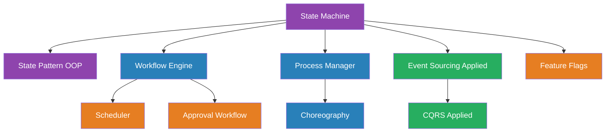

# Module 07 — State & Workflow Patterns

> How to model state transitions and multi-step processes without spaghetti conditionals.

## Why This Module Exists

Every system has state. Orders go from "created" to "paid" to "shipped." Users go from "registered" to "verified" to "active." Workflows span hours, days, or weeks — approval chains, multi-step onboarding, payment processing.

The problem isn't that state exists. The problem is how engineers manage it:
- Boolean flags that multiply: `isPaid`, `isShipped`, `isReturned`, `isRefunded`, `isCancelled` — what does `isPaid=true, isReturned=true, isRefunded=false` mean?
- Giant switch statements that grow with every new state.
- Multi-step processes where step 3 fails and nobody knows how to resume.

This module teaches the patterns that make state changes explicit, transitions safe, and workflows resumable.

## Prerequisites

Before starting this module:
- **Module 03 (Data Management)** — Event Sourcing and Saga patterns model state through events and multi-step transactions
- **Module 05 (Reliability & Resilience)** — Retry, idempotency, and graceful degradation handle failures in long-running workflows
- **Module 06 (API & Integration)** — Webhooks and adapters bridge between systems in multi-service workflows

## Patterns in This Module

| # | Pattern | Core Problem |
|---|---|---|
| 1 | [State Machine](state-machine.md) | Scattered boolean flags create impossible states |
| 2 | [State Pattern (OOP)](state-pattern-oop.md) | Giant switch statements grow with every state |
| 3 | [Workflow Engine](workflow-engine.md) | Multi-step processes fail and can't resume |
| 4 | [Process Manager](process-manager.md) | Cross-service sagas need central coordination |
| 5 | [Choreography](choreography.md) | Central coordinators become bottlenecks |
| 6 | [Event Sourcing (Applied)](event-sourcing-applied.md) | State changes must be auditable and replayable |
| 7 | [CQRS (Applied)](cqrs-applied.md) | Read-heavy UIs stall on write-optimized models |
| 8 | [Feature Flags](feature-flags.md) | Deploying code must be separated from releasing features |
| 9 | [Scheduler](scheduler.md) | Deferred and recurring work needs reliable execution |
| 10 | [Approval Workflow](approval-workflow.md) | Human decisions must gate automated processes |

## Dependency Graph

## Suggested Reading Order

1. **State Machine** → **State Pattern (OOP)** — from data-driven to behavior-driven state modeling
2. **Workflow Engine** → **Scheduler** → **Approval Workflow** — multi-step process execution
3. **Process Manager** → **Choreography** — centralized vs. decentralized coordination
4. **Event Sourcing (Applied)** → **CQRS (Applied)** — event-driven state + read optimization
5. **Feature Flags** — orthogonal concept, read anytime

## Key Concept

> **If your state is modeled correctly, invalid transitions are impossible — not just handled, but structurally unrepresentable.**
