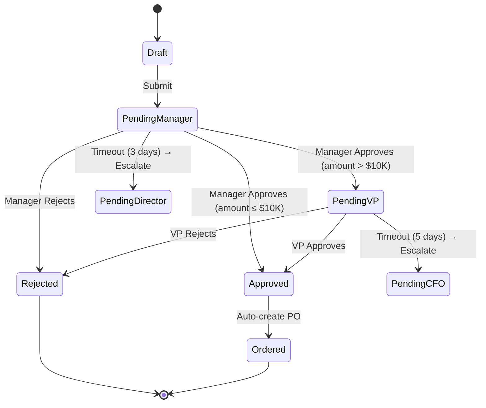
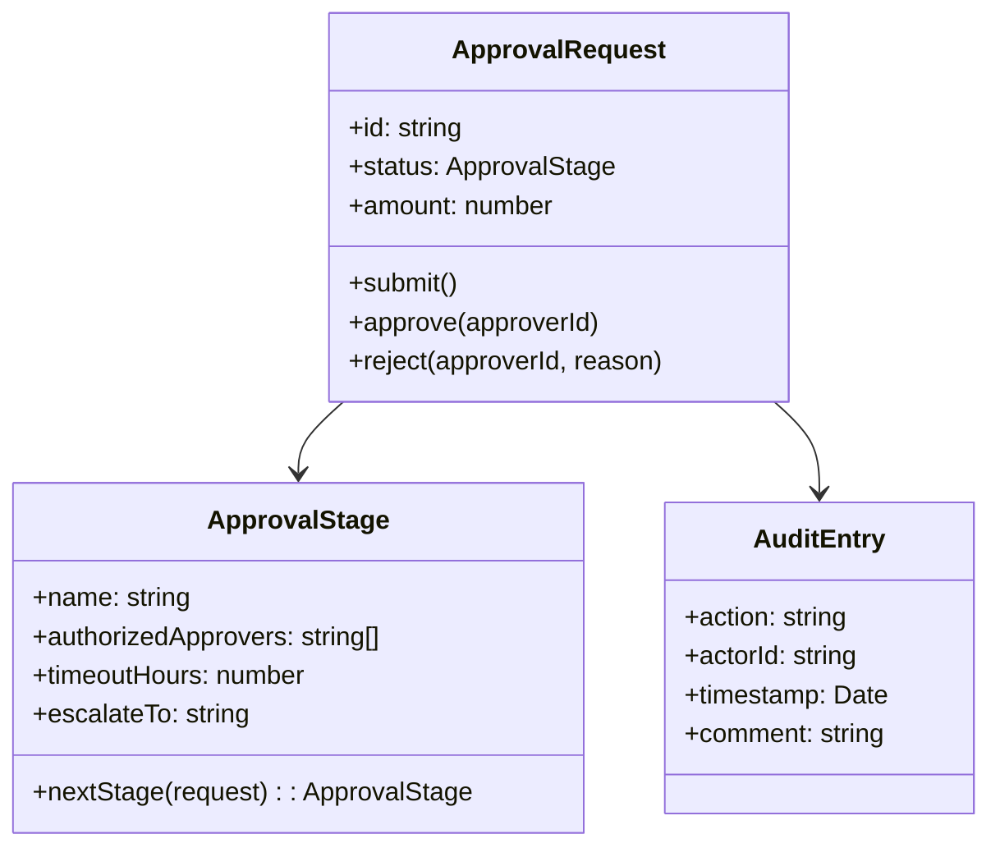

# Approval Workflow

## 1. The Problem

Your company's procurement process is managed by email:

1. An engineer requests a $15,000 software license.
2. They email their manager: "Please approve this purchase."
3. Manager replies "approved" — but the finance policy says purchases over $10,000 need VP approval too.
4. Nobody tells the engineer to get VP approval. The purchase order sits for 2 weeks.
5. When someone finally notices, the VP is on vacation. The engineer escalates to the CFO directly. The CFO approves without reading the details.
6. Accounting receives a $15,000 invoice with no audit trail. Who approved this? Was budget checked? Was the vendor vetted?

The problems:

- **No enforced approval chain.** The policy says "manager → VP for purchases over $10K" but nothing enforces it. People skip steps, approve things they shouldn't, or forward to the wrong person.
- **No visibility.** "Where is my purchase request?" The engineer checks their email, asks around. Nobody knows if it's sitting in a manager's inbox, waiting for VP approval, or lost in spam.
- **No delegation.** The VP is out for a week. Their 30 pending approvals sit idle. There's no "delegate to 2IC" mechanism — someone eventually forwards the emails manually.
- **No timeout or escalation.** An approval request sits in someone's inbox for 3 weeks. Nobody escalates. The SLA for procurement is 5 business days, but there's no enforcement.
- **No audit trail.** Compliance asks: "Show me every purchase over $10K and who approved each." The answer involves searching 18 months of email threads across 50 people's inboxes.

```typescript
// What the code looks like
async function requestPurchase(request: PurchaseRequest) {
  // Send email to manager
  await sendEmail(request.managerEmail, "Please approve", request);
  // Then... wait? For how long? What if they say no? What if the amount
  // requires VP approval? We don't even track this.
}
```

---

## 2. Naïve Solutions (and Why They Fail)

### Attempt 1: Status Field with Manual Checks

```typescript
// Purchase request table
interface PurchaseRequest {
  id: string;
  status: "pending_manager" | "pending_vp" | "approved" | "rejected";
  approvedBy: string[];
}

async function approve(requestId: string, approverId: string) {
  const request = await db.get(requestId);
  if (request.status === "pending_manager") {
    request.approvedBy.push(approverId);
    request.status = request.amount > 10000 ? "pending_vp" : "approved";
  } else if (request.status === "pending_vp") {
    request.approvedBy.push(approverId);
    request.status = "approved";
  }
  await db.update(request);
}
```

**Why it's insufficient:**
- No validation of WHO is approving. Anyone can call `approve("REQ-123", "random-person")`. There's no check that the approver is actually the requester's manager, or a VP.
- Adding a new approval level (legal review for software licenses over $50K) requires modifying the status enum, the approval function, and every UI that shows approval status.
- No timeout, no escalation, no delegation, no comments, no attachment handling.

### Attempt 2: Email-Based with Tracking

Move from informal email to structured email with tracking:

```typescript
await sendEmail(manager.email, {
  subject: `[APPROVAL-REQ-123] Purchase request: ${request.title}`,
  body: `Reply APPROVE or REJECT`,
});
// Parse manager's reply email for "APPROVE" or "REJECT"
```

**Why it's fragile:**
- Email parsing is unreliable. "Approved" vs "APPROVE" vs "Sounds good, approve" vs "I approve (but check with finance first)." Natural language isn't structured data.
- Forwarding the email to someone else breaks the reply-to tracking.
- No way to enforce multi-level approval chains. If the manager approves, the system needs to automatically route to the VP — but "routing" via email means sending another email and hoping.

### Attempt 3: Jira/Ticketing Workflow

Create a Jira ticket with workflow states:

```
Created → Pending Manager → Pending VP → Approved → Ordered → Delivered
```

**Why it's a square peg:**
- Jira workflows aren't programmable. You can't automatically route to a different approver based on the purchase amount, department, or vendor. Custom scripts in Jira are maintenance nightmares.
- No integration with other systems. After approval, you need to create a PO in the finance system, notify the vendor, and deduct from the department budget. Jira doesn't do this without plugins.
- Jira is designed for task tracking, not for enforcing business rules with delegations, escalations, and time-based SLAs.

---

## 3. The Insight

**An approval workflow is a state machine with rules for who can transition each state, timeouts that escalate stuck states, and an immutable audit log. The system — not the participants — decides who needs to approve next, based on configurable policies. Each approval step knows its authorized approvers, its deadline, and its escalation path. The workflow enforces the rules; humans just make decisions.**

---

## 4. The Pattern

### Approval Workflow

**Definition:** A structured process where a request moves through a series of approval stages, each with defined approvers, policies, timeouts, and escalation paths. The system enforces who can approve at each stage, routes the request to the next stage based on rules (amount thresholds, department policies), and maintains a complete audit trail of every action.

**Key properties:**
| Property | Description |
|---|---|
| **Rule-based routing** | The next approver is determined by business rules, not manual forwarding |
| **Authorization enforcement** | Only designated approvers can approve at each stage |
| **Timeout & escalation** | Stuck requests automatically escalate after SLA breach |
| **Delegation** | Approvers can delegate authority to alternates |
| **Audit trail** | Every action (approve, reject, comment, delegate) is immutably recorded |
| **Conditional stages** | Some stages only activate based on request attributes |

**Guarantees:**
- Every request follows the defined approval chain — no skipping steps.
- Complete audit trail with timestamps, approver identity, and comments.
- Timeouts trigger escalation — nothing sits forever.

**Non-guarantees:**
- Correct approval decisions (the system enforces process, not judgment).
- Instant approval — human decisions inherently take time.
- Prevention of policy circumvention outside the system (approvers can still be socially pressured).

---

## 5. Mental Model

**A passport control line at an international airport.** You (the request) go through a series of checkpoints. At immigration (manager approval), only the immigration officer can stamp your passport. For certain nationalities (purchase amount thresholds), you're routed to a secondary inspection (VP approval). If the officer takes too long (timeout), a supervisor (escalation) steps in. Every stamp and check is recorded. You can't skip checkpoints, and you can't stamp your own passport.

---

## 6. Structure





---

## 7. Code Example

### TypeScript

```typescript
// ========== TYPES ==========

interface ApprovalStageConfig {
  name: string;
  getApprovers: (request: ApprovalRequest) => string[];
  timeoutHours: number;
  escalateTo?: (request: ApprovalRequest) => string[];
  condition?: (request: ApprovalRequest) => boolean; // Skip stage if false
}

interface AuditEntry {
  action: "submitted" | "approved" | "rejected" | "escalated" | "delegated" | "commented";
  actorId: string;
  timestamp: Date;
  comment?: string;
  stage: string;
}

interface ApprovalRequest {
  id: string;
  title: string;
  description: string;
  amount: number;
  requesterId: string;
  department: string;
  currentStageIndex: number;
  status: "draft" | "in_review" | "approved" | "rejected";
  auditTrail: AuditEntry[];
  delegations: Map<string, string>; // originalApprover → delegate
  createdAt: Date;
  metadata: Record<string, any>;
}

// ========== APPROVAL ENGINE ==========

class ApprovalEngine {
  private stages: ApprovalStageConfig[];
  private requests = new Map<string, ApprovalRequest>();

  constructor(stages: ApprovalStageConfig[]) {
    this.stages = stages;
  }

  // ---- Submit a new request ----

  submit(
    title: string,
    description: string,
    amount: number,
    requesterId: string,
    department: string
  ): ApprovalRequest {
    const request: ApprovalRequest = {
      id: `REQ-${Date.now().toString(36).toUpperCase()}`,
      title,
      description,
      amount,
      requesterId,
      department,
      currentStageIndex: -1,
      status: "draft",
      auditTrail: [],
      delegations: new Map(),
      createdAt: new Date(),
      metadata: {},
    };

    this.requests.set(request.id, request);
    this.addAudit(request, "submitted", requesterId, "Request submitted");
    this.advanceToNextStage(request);

    return request;
  }

  // ---- Approve ----

  approve(requestId: string, approverId: string, comment?: string): void {
    const request = this.requests.get(requestId);
    if (!request) throw new Error(`Request ${requestId} not found`);
    if (request.status !== "in_review") throw new Error("Request not in review");

    this.assertAuthorized(request, approverId);

    this.addAudit(request, "approved", approverId, comment || "Approved");
    console.log(`[Approval] ${approverId} approved ${requestId} at stage "${this.currentStage(request)!.name}"`);

    this.advanceToNextStage(request);
  }

  // ---- Reject ----

  reject(requestId: string, approverId: string, reason: string): void {
    const request = this.requests.get(requestId);
    if (!request) throw new Error(`Request ${requestId} not found`);
    if (request.status !== "in_review") throw new Error("Request not in review");

    this.assertAuthorized(request, approverId);

    request.status = "rejected";
    this.addAudit(request, "rejected", approverId, reason);
    console.log(`[Approval] ${approverId} rejected ${requestId}: ${reason}`);
  }

  // ---- Delegate ----

  delegate(requestId: string, fromApproverId: string, toApproverId: string): void {
    const request = this.requests.get(requestId);
    if (!request) throw new Error(`Request ${requestId} not found`);

    this.assertAuthorized(request, fromApproverId);

    request.delegations.set(fromApproverId, toApproverId);
    this.addAudit(
      request,
      "delegated",
      fromApproverId,
      `Delegated to ${toApproverId}`
    );
    console.log(`[Approval] ${fromApproverId} delegated ${requestId} to ${toApproverId}`);
  }

  // ---- Escalation (called by scheduler on timeout) ----

  escalate(requestId: string): void {
    const request = this.requests.get(requestId);
    if (!request || request.status !== "in_review") return;

    const stage = this.currentStage(request);
    if (!stage?.escalateTo) {
      console.log(`[Approval] No escalation path for ${requestId}`);
      return;
    }

    const escalationApprovers = stage.escalateTo(request);
    this.addAudit(
      request,
      "escalated",
      "system",
      `Escalated to ${escalationApprovers.join(", ")} (timeout: ${stage.timeoutHours}h)`
    );
    console.log(`[Approval] ${requestId} escalated at stage "${stage.name}"`);
  }

  // ---- Helpers ----

  private advanceToNextStage(request: ApprovalRequest): void {
    request.currentStageIndex++;

    // Skip stages whose conditions aren't met
    while (request.currentStageIndex < this.stages.length) {
      const stage = this.stages[request.currentStageIndex];
      if (!stage.condition || stage.condition(request)) {
        break; // This stage applies
      }
      console.log(`[Approval] Skipping stage "${stage.name}" (condition not met)`);
      request.currentStageIndex++;
    }

    if (request.currentStageIndex >= this.stages.length) {
      request.status = "approved";
      console.log(`[Approval] ${request.id} fully approved ✓`);
      return;
    }

    request.status = "in_review";
    const stage = this.stages[request.currentStageIndex];
    const approvers = stage.getApprovers(request);
    console.log(`[Approval] ${request.id} → stage "${stage.name}" (approvers: ${approvers.join(", ")})`);
  }

  private currentStage(request: ApprovalRequest): ApprovalStageConfig | undefined {
    return this.stages[request.currentStageIndex];
  }

  private assertAuthorized(request: ApprovalRequest, actorId: string): void {
    const stage = this.currentStage(request);
    if (!stage) throw new Error("No current stage");

    const approvers = stage.getApprovers(request);

    // Check if the actor is a direct approver or a delegate
    const isAuthorized = approvers.some(
      (a) => a === actorId || request.delegations.get(a) === actorId
    );

    if (!isAuthorized) {
      throw new Error(
        `${actorId} is not authorized to approve at stage "${stage.name}". ` +
        `Authorized: ${approvers.join(", ")}`
      );
    }
  }

  private addAudit(
    request: ApprovalRequest,
    action: AuditEntry["action"],
    actorId: string,
    comment?: string
  ): void {
    request.auditTrail.push({
      action,
      actorId,
      timestamp: new Date(),
      comment,
      stage: this.currentStage(request)?.name || "submission",
    });
  }

  getRequest(id: string): ApprovalRequest | undefined {
    return this.requests.get(id);
  }

  getAuditTrail(id: string): AuditEntry[] {
    return this.requests.get(id)?.auditTrail || [];
  }
}

// ========== ORGANIZATION HIERARCHY ==========

const orgChart: Record<string, { manager: string; vp: string; director: string }> = {
  "eng-alice":  { manager: "mgr-bob",   vp: "vp-carol",   director: "dir-dave" },
  "eng-frank":  { manager: "mgr-bob",   vp: "vp-carol",   director: "dir-dave" },
  "mkt-grace":  { manager: "mgr-henry", vp: "vp-irene",   director: "dir-dave" },
};

// ========== DEFINE APPROVAL CHAIN ==========

const engine = new ApprovalEngine([
  {
    name: "manager_approval",
    getApprovers: (req) => [orgChart[req.requesterId]?.manager].filter(Boolean),
    timeoutHours: 72,
    escalateTo: (req) => [orgChart[req.requesterId]?.director].filter(Boolean),
  },
  {
    name: "vp_approval",
    getApprovers: (req) => [orgChart[req.requesterId]?.vp].filter(Boolean),
    condition: (req) => req.amount > 10_000, // Only for purchases > $10K
    timeoutHours: 120,
    escalateTo: () => ["cfo-jane"],
  },
  {
    name: "finance_review",
    getApprovers: () => ["fin-karen", "fin-larry"], // Any finance team member
    condition: (req) => req.amount > 25_000, // Only for purchases > $25K
    timeoutHours: 48,
    escalateTo: () => ["cfo-jane"],
  },
]);

// ========== USAGE ==========

// Engineer submits a $15K request
const req = engine.submit(
  "DataDog License",
  "Annual monitoring license for production environment",
  15_000,
  "eng-alice",
  "engineering"
);
// → stage "manager_approval" (approvers: mgr-bob)

// Manager approves
engine.approve(req.id, "mgr-bob", "Looks good, we need this.");
// → stage "vp_approval" (approvers: vp-carol) — triggered because $15K > $10K

// VP is on vacation — delegates to director
engine.delegate(req.id, "vp-carol", "dir-dave");

// Director approves on VP's behalf
engine.approve(req.id, "dir-dave", "Approved as VP delegate.");
// → stage "finance_review" skipped (condition: amount > $25K → false)
// → Request fully approved ✓

// Print audit trail
console.log("\nAudit Trail:");
for (const entry of engine.getAuditTrail(req.id)) {
  console.log(`  [${entry.timestamp.toISOString()}] ${entry.action} by ${entry.actorId} at "${entry.stage}": ${entry.comment}`);
}
```

### Go

```go
package main

import (
	"fmt"
	"strings"
	"time"
)

// ========== TYPES ==========

type StageConfig struct {
	Name         string
	GetApprovers func(req *Request) []string
	Condition    func(req *Request) bool // nil = always applies
	TimeoutHours int
}

type AuditEntry struct {
	Action    string
	ActorID   string
	Timestamp time.Time
	Comment   string
	Stage     string
}

type Request struct {
	ID          string
	Title       string
	Amount      float64
	RequesterID string
	StageIndex  int
	Status      string // "in_review", "approved", "rejected"
	AuditTrail  []AuditEntry
	Delegations map[string]string
}

// ========== ENGINE ==========

type ApprovalEngine struct {
	stages   []StageConfig
	requests map[string]*Request
}

func NewApprovalEngine(stages []StageConfig) *ApprovalEngine {
	return &ApprovalEngine{
		stages:   stages,
		requests: make(map[string]*Request),
	}
}

func (e *ApprovalEngine) Submit(title string, amount float64, requesterID string) *Request {
	req := &Request{
		ID: fmt.Sprintf("REQ-%d", time.Now().UnixMilli()),
		Title: title, Amount: amount, RequesterID: requesterID,
		StageIndex: -1, Status: "draft",
		Delegations: make(map[string]string),
	}
	e.requests[req.ID] = req
	req.AuditTrail = append(req.AuditTrail, AuditEntry{
		Action: "submitted", ActorID: requesterID,
		Timestamp: time.Now(), Stage: "submission",
	})
	e.advance(req)
	return req
}

func (e *ApprovalEngine) Approve(reqID, approverID, comment string) error {
	req := e.requests[reqID]
	if req == nil || req.Status != "in_review" {
		return fmt.Errorf("request not found or not in review")
	}
	if err := e.checkAuth(req, approverID); err != nil {
		return err
	}

	stage := e.stages[req.StageIndex]
	req.AuditTrail = append(req.AuditTrail, AuditEntry{
		Action: "approved", ActorID: approverID,
		Timestamp: time.Now(), Comment: comment, Stage: stage.Name,
	})
	fmt.Printf("[Approval] %s approved by %s at \"%s\"\n", reqID, approverID, stage.Name)
	e.advance(req)
	return nil
}

func (e *ApprovalEngine) Reject(reqID, approverID, reason string) error {
	req := e.requests[reqID]
	if req == nil || req.Status != "in_review" {
		return fmt.Errorf("not found or not in review")
	}
	if err := e.checkAuth(req, approverID); err != nil {
		return err
	}

	stage := e.stages[req.StageIndex]
	req.Status = "rejected"
	req.AuditTrail = append(req.AuditTrail, AuditEntry{
		Action: "rejected", ActorID: approverID,
		Timestamp: time.Now(), Comment: reason, Stage: stage.Name,
	})
	fmt.Printf("[Approval] %s rejected by %s: %s\n", reqID, approverID, reason)
	return nil
}

func (e *ApprovalEngine) Delegate(reqID, from, to string) {
	req := e.requests[reqID]
	if req == nil {
		return
	}
	req.Delegations[from] = to
	fmt.Printf("[Approval] %s delegated from %s to %s\n", reqID, from, to)
}

func (e *ApprovalEngine) advance(req *Request) {
	req.StageIndex++
	for req.StageIndex < len(e.stages) {
		stage := e.stages[req.StageIndex]
		if stage.Condition == nil || stage.Condition(req) {
			break
		}
		fmt.Printf("[Approval] Skipping \"%s\"\n", stage.Name)
		req.StageIndex++
	}

	if req.StageIndex >= len(e.stages) {
		req.Status = "approved"
		fmt.Printf("[Approval] %s fully approved ✓\n", req.ID)
		return
	}

	req.Status = "in_review"
	stage := e.stages[req.StageIndex]
	approvers := stage.GetApprovers(req)
	fmt.Printf("[Approval] %s → \"%s\" (approvers: %s)\n",
		req.ID, stage.Name, strings.Join(approvers, ", "))
}

func (e *ApprovalEngine) checkAuth(req *Request, actorID string) error {
	stage := e.stages[req.StageIndex]
	approvers := stage.GetApprovers(req)
	for _, a := range approvers {
		if a == actorID {
			return nil
		}
		if delegate, ok := req.Delegations[a]; ok && delegate == actorID {
			return nil
		}
	}
	return fmt.Errorf("%s not authorized at stage \"%s\"", actorID, stage.Name)
}

// ========== ORG CHART ==========

var managers = map[string]string{
	"eng-alice": "mgr-bob",
	"eng-frank": "mgr-bob",
}
var vps = map[string]string{
	"eng-alice": "vp-carol",
	"eng-frank": "vp-carol",
}

func main() {
	engine := NewApprovalEngine([]StageConfig{
		{
			Name:         "manager_approval",
			GetApprovers: func(r *Request) []string { return []string{managers[r.RequesterID]} },
			TimeoutHours: 72,
		},
		{
			Name:         "vp_approval",
			GetApprovers: func(r *Request) []string { return []string{vps[r.RequesterID]} },
			Condition:    func(r *Request) bool { return r.Amount > 10000 },
			TimeoutHours: 120,
		},
		{
			Name:         "finance_review",
			GetApprovers: func(r *Request) []string { return []string{"fin-karen", "fin-larry"} },
			Condition:    func(r *Request) bool { return r.Amount > 25000 },
			TimeoutHours: 48,
		},
	})

	// $15K request
	req := engine.Submit("DataDog License", 15000, "eng-alice")

	// Manager approves
	engine.Approve(req.ID, "mgr-bob", "We need monitoring")

	// VP delegates
	engine.Delegate(req.ID, "vp-carol", "dir-dave")
	engine.Approve(req.ID, "dir-dave", "Approved as delegate")
	// finance_review skipped (< $25K)

	fmt.Println("\nAudit Trail:")
	for _, entry := range req.AuditTrail {
		fmt.Printf("  [%s] %s by %s @ \"%s\": %s\n",
			entry.Timestamp.Format("15:04:05"),
			entry.Action, entry.ActorID, entry.Stage, entry.Comment)
	}
}
```

---

## 8. Gotchas & Beginner Mistakes

| Mistake | Why It Hurts |
|---|---|
| **Hardcoding approval chains in code** | Adding a new approval level requires a code deploy. Store the approval chain configuration in a database or config file so business users (finance, compliance) can modify it without engineering involvement. |
| **No "return to requester" action** | Approver sees a mistake in the description. They can only approve or reject. Add a "request changes" action that sends the request back to the requester for amendment, preserving the audit trail. |
| **Self-approval** | The system allows requesters to approve their own requests. This violates segregation of duties. Always check `request.requesterId !== approverId`. |
| **No parallel approval support** | "Both Legal AND Finance must approve" — but the system only supports sequential stages. Support parallel stages where multiple groups must approve in any order. |
| **Forgetting bulk operations** | An admin needs to approve 50 small purchases. One-by-one approval through a UI is tedious. Provide batch approval with individual audit entries. |

---

## 9. Related & Confusable Patterns

| Pattern | How It Differs |
|---|---|
| **Workflow Engine** | A general-purpose system for multi-step processes. An Approval Workflow is a specific APPLICATION of workflow concepts, tailored for human decision-making with authorization, delegation, and escalation. |
| **State Machine** | An approval workflow IS a state machine with specific semantics: each transition is an authorized human decision. State machines are the mechanism; approval workflows add authorization, SLAs, and audit. |
| **Process Manager** | Coordinates automated services through messages. Approval Workflows coordinate human decisions through notifications. The "messages" are approval requests; the "services" are people. |
| **Chain of Responsibility (GoF)** | Each handler in a chain either handles the request or passes it to the next. Similar to sequential approvals, but Chain of Responsibility is about finding the RIGHT handler, not requiring ALL handlers to approve. |
| **Access Control (RBAC/ABAC)** | Determines if a user CAN perform an action. Approval Workflows determine if a user SHOULD be ALLOWED to proceed with a business action, adding temporal and contextual rules beyond static permissions. |

---

## 10. When This Pattern Is the WRONG Choice

- **Fully automated decisions** — If approval can be determined by business rules alone (credit score > 700 → auto-approve), use a rules engine, not a human workflow. Approval workflows are for decisions that require human judgment.
- **Real-time decisions** — "Should we serve this ad?" needs a sub-millisecond answer. Approval workflows are for decisions measured in hours or days.
- **Low-risk, high-volume actions** — Approving every line of code in a PR, every support ticket response, every email sent. The overhead of formal approval slows the team to a crawl. Use post-hoc auditing instead of pre-authentication for low-risk actions.

**Symptoms you should reconsider:**
- 95% of requests are auto-approved by the first approver without reading. The approval step adds delay without adding value. Consider raising the threshold or using auto-approval with spot auditing.
- Approvers routinely skip the system and approve via Slack/email. The workflow is too cumbersome. Simplify — reduce the number of stages, add Slack integration for one-click approval.
- The approval chain has 7 stages and average completion time is 3 weeks. The process itself is the bottleneck. Reduce stages, add parallel approvals, and increase individual authority limits.

**How to back out:** Replace with automated rules for low-risk decisions. For high-risk decisions, use a lightweight process — a Slack message to a #approvals channel with emoji reactions. Keep the audit trail requirement — log decisions regardless of the mechanism.
