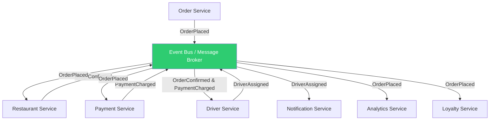
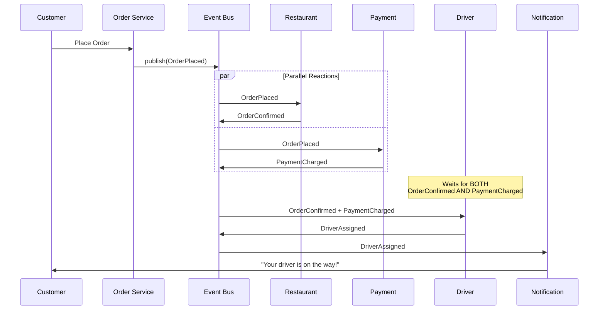

# Choreography

## 1. The Problem

Your food delivery platform has grown from a monolith to microservices. The Order Service is the central orchestrator — it coordinates everything:

```typescript
class OrderService {
  async placeOrder(order: Order) {
    await this.restaurantService.confirmOrder(order);     // Step 1
    await this.paymentService.charge(order);              // Step 2
    await this.driverService.assignDriver(order);         // Step 3
    await this.notificationService.notifyCustomer(order); // Step 4
    await this.analyticsService.trackOrder(order);        // Step 5
    await this.loyaltyService.awardPoints(order);         // Step 6
  }
}
```

The Order Service depends on 6 other services. Every new feature adds another `await` call:

- **Marketing wants to send a promotion after first orders.** Order Service now depends on Marketing Service.
- **Accounting needs a webhook for tax compliance.** Order Service now depends on Accounting Service.
- **The driver dispatch algorithm changes from "nearest" to "route-optimized."** Order Service must be redeployed because it calls `driverService.assignDriver()` directly.

The Order Service has become a **god service** — it knows about every other service, changes constantly, and is the single point of failure. If the Loyalty Service is down for maintenance, order placement fails entirely. If the Analytics Service is slow (200ms latency), every order is 200ms slower.

Six months in, the dependency graph looks like a star with Order Service at the center:

```
Restaurant ← OrderService → Payment
Notification ← OrderService → Driver
Analytics ← OrderService → Loyalty
```

Every edge is a synchronous HTTP call. Every call is a potential failure point. The team that owns Order Service deploys 3× more often than any other team — because they're the bottleneck for everyone's features.

---

## 2. Naïve Solutions (and Why They Fail)

### Attempt 1: Async Commands (Still Orchestrated)

Replace HTTP calls with async messages, but keep the Order Service as coordinator:

```typescript
class OrderService {
  async placeOrder(order: Order) {
    await messageQueue.send("restaurant.confirm", order);
    await messageQueue.send("payment.charge", order);
    await messageQueue.send("driver.assign", order);
    // ... still 6 sends, still knows about everyone
  }
}
```

**Why it's the same problem with different syntax:**
- The Order Service still knows about every downstream service. Adding Accounting means adding another `send()` call.
- Commands create coupling — the sender knows the receiver. If `driver.assign` is renamed to `logistics.dispatch`, the Order Service must change.

### Attempt 2: Service Registry Pattern

The Order Service looks up services dynamically:

```typescript
const services = await registry.getSubscribers("order.placed");
for (const service of services) {
  await service.notify(order);
}
```

**Why it's fragile:**
- The Order Service still sends and waits. If any subscriber is slow or down, the order is delayed.
- The registry becomes a critical dependency. Registry goes down → no services can be discovered → all orders fail.
- Ordering matters — payment must happen before driver assignment. The registry doesn't encode ordering dependencies.

### Attempt 3: Shared Database

All services read from and write to a shared `orders` table:

```
Restaurant Service polls: SELECT * FROM orders WHERE status = 'new'
Payment Service polls:    SELECT * FROM orders WHERE status = 'confirmed'
Driver Service polls:     SELECT * FROM orders WHERE status = 'paid'
```

**Why it creates worse coupling:**
- Every service is coupled to the shared schema. Change a column → break 6 services.
- Polling wastes resources. 6 services × 1 query/second = 6 queries/second for a table that gets new rows every few seconds.
- Services compete for rows. Two Driver Service instances both pick up the same order.

---

## 3. The Insight

**Instead of one service telling everyone what to do, each service announces what happened. Other services listen for the announcements they care about and react independently. No service knows about any other service — they only know about events. The process emerges from the collective behavior of independent reactors, not from a central plan.**

---

## 4. The Pattern

### Choreography

**Definition:** A coordination strategy where services communicate by publishing domain events to a shared event bus. Each service independently subscribes to the events it cares about and performs its own work in response, potentially publishing new events. No single service coordinates the overall flow — the process emerges from the interaction of autonomous services.

**Key properties:**
| Property | Description |
|---|---|
| **No coordinator** | No service knows the full process flow |
| **Event-driven** | Services publish facts ("OrderPlaced"), not commands ("ChargePayment") |
| **Loose coupling** | Publisher doesn't know or care who subscribes |
| **Autonomous services** | Each service decides what to do with events it receives |
| **Emergent flow** | The business process results from individual service reactions |

**Guarantees:**
- Services can be added/removed without changing existing services.
- Each service evolves independently.
- No single point of coordination failure.

**Non-guarantees:**
- No global view of the process (nobody sees the "big picture").
- No guaranteed ordering across independent subscribers.
- Distributed debugging across many services is harder.

---

## 5. Mental Model

**A jazz ensemble.** There's no conductor. Each musician listens to the others and plays their part when it fits. The drummer lays down a beat (event: "rhythm started"), the bassist hears it and starts a walking line (event: "bass joined"), the pianist hears both and starts comping (event: "harmony added"). Nobody told the pianist when to play — she listened and reacted. The music emerges from the collective behavior, not from a score or a conductor. Add a saxophone player tomorrow — nobody else changes how they play.

---

## 6. Structure





---

## 7. Code Example

### TypeScript

```typescript
// ========== EVENT BUS ==========

type EventHandler = (event: DomainEvent) => Promise<void>;

interface DomainEvent {
  type: string;
  aggregateId: string;
  data: Record<string, any>;
  timestamp: Date;
  source: string;
}

class EventBus {
  private subscribers = new Map<string, EventHandler[]>();

  subscribe(eventType: string, handler: EventHandler): void {
    const handlers = this.subscribers.get(eventType) || [];
    handlers.push(handler);
    this.subscribers.set(eventType, handlers);
  }

  async publish(event: DomainEvent): Promise<void> {
    console.log(`📢 [${event.source}] ${event.type} (${event.aggregateId})`);
    const handlers = this.subscribers.get(event.type) || [];

    // Handlers run independently — one failure doesn't block others
    await Promise.allSettled(
      handlers.map((handler) => handler(event))
    );
  }
}

// ========== ORDER SERVICE ==========
// Responsibility: Accept orders, publish OrderPlaced. That's it.

class OrderService {
  constructor(private eventBus: EventBus) {}

  async placeOrder(customerId: string, restaurantId: string, items: string[]): Promise<string> {
    const orderId = `ORD-${Date.now()}`;

    // Save to own database
    console.log(`  [Order] Created ${orderId}`);

    // Publish what happened — NOT commands to other services
    await this.eventBus.publish({
      type: "order.placed",
      aggregateId: orderId,
      data: { customerId, restaurantId, items, total: 2500 },
      timestamp: new Date(),
      source: "OrderService",
    });

    return orderId;
  }
}

// ========== RESTAURANT SERVICE ==========
// Listens for: order.placed → confirms or rejects

class RestaurantService {
  constructor(private eventBus: EventBus) {
    eventBus.subscribe("order.placed", this.onOrderPlaced.bind(this));
  }

  private async onOrderPlaced(event: DomainEvent): Promise<void> {
    const { restaurantId, items } = event.data;
    console.log(`  [Restaurant] Checking availability at ${restaurantId}`);

    // Simulate restaurant confirming
    const canFulfill = true; // Check kitchen capacity, ingredient stock

    if (canFulfill) {
      const estimatedMinutes = 15 + Math.floor(Math.random() * 20);
      await this.eventBus.publish({
        type: "order.confirmed_by_restaurant",
        aggregateId: event.aggregateId,
        data: { restaurantId, estimatedMinutes },
        timestamp: new Date(),
        source: "RestaurantService",
      });
    } else {
      await this.eventBus.publish({
        type: "order.rejected_by_restaurant",
        aggregateId: event.aggregateId,
        data: { restaurantId, reason: "Kitchen closed" },
        timestamp: new Date(),
        source: "RestaurantService",
      });
    }
  }
}

// ========== PAYMENT SERVICE ==========
// Listens for: order.placed → charges customer

class PaymentService {
  constructor(private eventBus: EventBus) {
    eventBus.subscribe("order.placed", this.onOrderPlaced.bind(this));
  }

  private async onOrderPlaced(event: DomainEvent): Promise<void> {
    const { customerId, total } = event.data;
    console.log(`  [Payment] Charging ${customerId} $${total / 100}`);

    // Charge payment
    await this.eventBus.publish({
      type: "payment.charged",
      aggregateId: event.aggregateId,
      data: { customerId, amount: total, paymentId: `PAY-${Date.now()}` },
      timestamp: new Date(),
      source: "PaymentService",
    });
  }
}

// ========== DRIVER SERVICE ==========
// Listens for: order.confirmed_by_restaurant AND payment.charged
// Only assigns driver when BOTH have occurred

class DriverService {
  private pendingOrders = new Map<string, { confirmed: boolean; paid: boolean }>();

  constructor(private eventBus: EventBus) {
    eventBus.subscribe("order.confirmed_by_restaurant", this.onConfirmed.bind(this));
    eventBus.subscribe("payment.charged", this.onPaid.bind(this));
  }

  private async onConfirmed(event: DomainEvent): Promise<void> {
    const state = this.getOrCreate(event.aggregateId);
    state.confirmed = true;
    await this.tryAssign(event.aggregateId);
  }

  private async onPaid(event: DomainEvent): Promise<void> {
    const state = this.getOrCreate(event.aggregateId);
    state.paid = true;
    await this.tryAssign(event.aggregateId);
  }

  private async tryAssign(orderId: string): Promise<void> {
    const state = this.pendingOrders.get(orderId);
    if (!state?.confirmed || !state?.paid) return;

    // Both conditions met — assign a driver
    this.pendingOrders.delete(orderId);
    const driverId = `DRV-${Math.floor(Math.random() * 100)}`;
    console.log(`  [Driver] Assigned ${driverId} to ${orderId}`);

    await this.eventBus.publish({
      type: "driver.assigned",
      aggregateId: orderId,
      data: { driverId, estimatedArrival: "12 min" },
      timestamp: new Date(),
      source: "DriverService",
    });
  }

  private getOrCreate(orderId: string): { confirmed: boolean; paid: boolean } {
    if (!this.pendingOrders.has(orderId)) {
      this.pendingOrders.set(orderId, { confirmed: false, paid: false });
    }
    return this.pendingOrders.get(orderId)!;
  }
}

// ========== NOTIFICATION SERVICE ==========

class NotificationService {
  constructor(eventBus: EventBus) {
    eventBus.subscribe("driver.assigned", async (event) => {
      console.log(`  [Notification] SMS: Driver ${event.data.driverId} arriving in ${event.data.estimatedArrival}`);
    });

    eventBus.subscribe("order.rejected_by_restaurant", async (event) => {
      console.log(`  [Notification] SMS: Sorry, ${event.data.restaurantId} cannot fulfill your order`);
    });
  }
}

// ========== LOYALTY SERVICE (added later — zero changes to existing services) ==========

class LoyaltyService {
  constructor(eventBus: EventBus) {
    eventBus.subscribe("payment.charged", async (event) => {
      const points = Math.floor(event.data.amount / 100);
      console.log(`  [Loyalty] Awarded ${points} points to ${event.data.customerId}`);
    });
  }
}

// ========== WIRE IT UP ==========

const bus = new EventBus();

const orderService       = new OrderService(bus);
const restaurantService  = new RestaurantService(bus);
const paymentService     = new PaymentService(bus);
const driverService      = new DriverService(bus);
const notificationService = new NotificationService(bus);
const loyaltyService     = new LoyaltyService(bus); // Added 6 months later, zero code changes elsewhere

// Place an order — the process emerges from the service reactions
await orderService.placeOrder("cust-alice", "restaurant-pizza-palace", ["margherita", "tiramisu"]);
```

### Go

```go
package main

import (
	"fmt"
	"sync"
	"time"
)

// ========== EVENT BUS ==========

type DomainEvent struct {
	Type        string
	AggregateID string
	Data        map[string]any
	Source      string
	Timestamp   time.Time
}

type Handler func(event DomainEvent)

type EventBus struct {
	mu          sync.RWMutex
	subscribers map[string][]Handler
}

func NewEventBus() *EventBus {
	return &EventBus{subscribers: make(map[string][]Handler)}
}

func (eb *EventBus) Subscribe(eventType string, handler Handler) {
	eb.mu.Lock()
	defer eb.mu.Unlock()
	eb.subscribers[eventType] = append(eb.subscribers[eventType], handler)
}

func (eb *EventBus) Publish(event DomainEvent) {
	fmt.Printf("📢 [%s] %s (%s)\n", event.Source, event.Type, event.AggregateID)

	eb.mu.RLock()
	handlers := eb.subscribers[event.Type]
	eb.mu.RUnlock()

	var wg sync.WaitGroup
	for _, h := range handlers {
		wg.Add(1)
		go func(handler Handler) {
			defer wg.Done()
			handler(event)
		}(h)
	}
	wg.Wait()
}

// ========== DRIVER SERVICE (join pattern) ==========

type DriverService struct {
	bus     *EventBus
	mu      sync.Mutex
	pending map[string]*orderReadiness
}

type orderReadiness struct {
	confirmed bool
	paid      bool
}

func NewDriverService(bus *EventBus) *DriverService {
	ds := &DriverService{
		bus:     bus,
		pending: make(map[string]*orderReadiness),
	}

	bus.Subscribe("order.confirmed", func(evt DomainEvent) {
		ds.mu.Lock()
		r := ds.getOrCreate(evt.AggregateID)
		r.confirmed = true
		ready := r.confirmed && r.paid
		ds.mu.Unlock()

		if ready {
			ds.assignDriver(evt.AggregateID)
		}
	})

	bus.Subscribe("payment.charged", func(evt DomainEvent) {
		ds.mu.Lock()
		r := ds.getOrCreate(evt.AggregateID)
		r.paid = true
		ready := r.confirmed && r.paid
		ds.mu.Unlock()

		if ready {
			ds.assignDriver(evt.AggregateID)
		}
	})

	return ds
}

func (ds *DriverService) getOrCreate(orderID string) *orderReadiness {
	if _, ok := ds.pending[orderID]; !ok {
		ds.pending[orderID] = &orderReadiness{}
	}
	return ds.pending[orderID]
}

func (ds *DriverService) assignDriver(orderID string) {
	ds.mu.Lock()
	delete(ds.pending, orderID)
	ds.mu.Unlock()

	fmt.Printf("  [Driver] Assigned DRV-42 to %s\n", orderID)

	ds.bus.Publish(DomainEvent{
		Type: "driver.assigned", AggregateID: orderID,
		Data: map[string]any{"driverId": "DRV-42", "eta": "12 min"},
		Source: "DriverService", Timestamp: time.Now(),
	})
}

// ========== MAIN ==========

func main() {
	bus := NewEventBus()

	// Restaurant: reacts to order.placed
	bus.Subscribe("order.placed", func(evt DomainEvent) {
		fmt.Printf("  [Restaurant] Confirming %s\n", evt.AggregateID)
		bus.Publish(DomainEvent{
			Type: "order.confirmed", AggregateID: evt.AggregateID,
			Data: map[string]any{"estimatedMinutes": 25},
			Source: "RestaurantService", Timestamp: time.Now(),
		})
	})

	// Payment: reacts to order.placed
	bus.Subscribe("order.placed", func(evt DomainEvent) {
		fmt.Printf("  [Payment] Charging for %s\n", evt.AggregateID)
		bus.Publish(DomainEvent{
			Type: "payment.charged", AggregateID: evt.AggregateID,
			Data: map[string]any{"amount": 2500, "paymentId": "PAY-789"},
			Source: "PaymentService", Timestamp: time.Now(),
		})
	})

	// Driver: waits for BOTH confirmed + paid
	_ = NewDriverService(bus)

	// Notification: reacts to driver.assigned
	bus.Subscribe("driver.assigned", func(evt DomainEvent) {
		fmt.Printf("  [Notification] Driver %s arriving in %s\n",
			evt.Data["driverId"], evt.Data["eta"])
	})

	// Loyalty: added later — zero changes to existing code
	bus.Subscribe("payment.charged", func(evt DomainEvent) {
		amount := evt.Data["amount"].(int)
		fmt.Printf("  [Loyalty] Awarded %d points\n", amount/100)
	})

	// Place order — process emerges from reactions
	bus.Publish(DomainEvent{
		Type: "order.placed", AggregateID: "ORD-001",
		Data: map[string]any{
			"customerId":   "cust-alice",
			"restaurantId": "pizza-palace",
			"items":        []string{"margherita", "tiramisu"},
			"total":        2500,
		},
		Source: "OrderService", Timestamp: time.Now(),
	})
}
```

---

## 8. Gotchas & Beginner Mistakes

| Mistake | Why It Hurts |
|---|---|
| **Publishing commands disguised as events** | `"ChargePayment"` is a command (imperative). `"OrderPlaced"` is an event (past tense fact). Events describe what happened; commands tell someone what to do. Using commands couples publisher to subscriber. |
| **No dead letter handling** | A subscriber throws an exception processing an event. The event disappears. Use DLQs (dead letter queues) to capture and replay failed events. |
| **Implicit ordering assumptions** | DriverService assumes `order.confirmed` always arrives before `payment.charged`. In practice, message ordering is NOT guaranteed across different event types. Always use a join pattern (wait for both). |
| **Event schema coupling** | PaymentService includes 20 fields in `payment.charged` because "someone might need them." Now changing PaymentService's internal data model breaks 8 subscribers. Publish minimal events; let subscribers query if they need more. |
| **No event versioning** | You add a field to `order.placed` and deploy OrderService first. RestaurantService receives events with an unknown field and crashes. Use schema evolution strategies (additive-only changes, version header). |

---

## 9. Related & Confusable Patterns

| Pattern | How It Differs |
|---|---|
| **Orchestration / Process Manager** | A central coordinator that knows the full process and sends commands. Choreography has NO coordinator. Trade-off: orchestration gives visibility, choreography gives autonomy. |
| **Publish-Subscribe** | A messaging pattern where publishers send to topics and subscribers receive. Choreography USES pub-sub as its communication mechanism. Pub-sub is the transport; choreography is the coordination strategy. |
| **Event-Driven Architecture** | A broader architectural style. Choreography is a specific coordination approach WITHIN an event-driven architecture. You can have event-driven systems with orchestration. |
| **SAGA** | A SAGA can be implemented with either choreography (each service reacts and emits the next event) or orchestration (a coordinator manages steps). Choreographed sagas are harder to debug but more autonomous. |
| **Mediator** | A central object that encapsulates communication. Choreography is anti-mediator — there is no center, only a shared bus. |

---

## 10. When This Pattern Is the WRONG Choice

- **Processes requiring guaranteed step ordering** — If step B must happen exactly after step A (not concurrently, not before), choreography makes this hard to guarantee. Use orchestration.
- **Processes requiring a global view** — If you need a dashboard showing "order is on step 4 of 7," choreography scatters this state across services. Nobody has the big picture.
- **Teams not ready for distributed debugging** — Choreographed flows are traced through log correlation IDs across 6 services. If your team struggles to debug 2-service interactions, adding 4 more services to the mix will make it worse.

**Symptoms you should reconsider:**
- Services have become "event spaghetti" — 30 event types, each triggering cascades across 10 services. Nobody can draw the process flow on a whiteboard. You've traded one god service for distributed god complexity.
- You need compensation (rollback) across multiple services, and the compensation logic is spread across 6 event handlers in 6 repositories. A Process Manager centralizes compensation logic in one place.
- Events arrive out of order and you're adding retry/reorder logic in every subscriber. This per-subscriber complexity suggests a central coordinator would be simpler.

**How to back out:** Introduce a lightweight Process Manager that subscribes to the same events and coordinates the critical path. Let non-critical subscribers (analytics, loyalty) remain choreographed. This hybrid approach gives visibility for the core process and flexibility for optional reactions.
