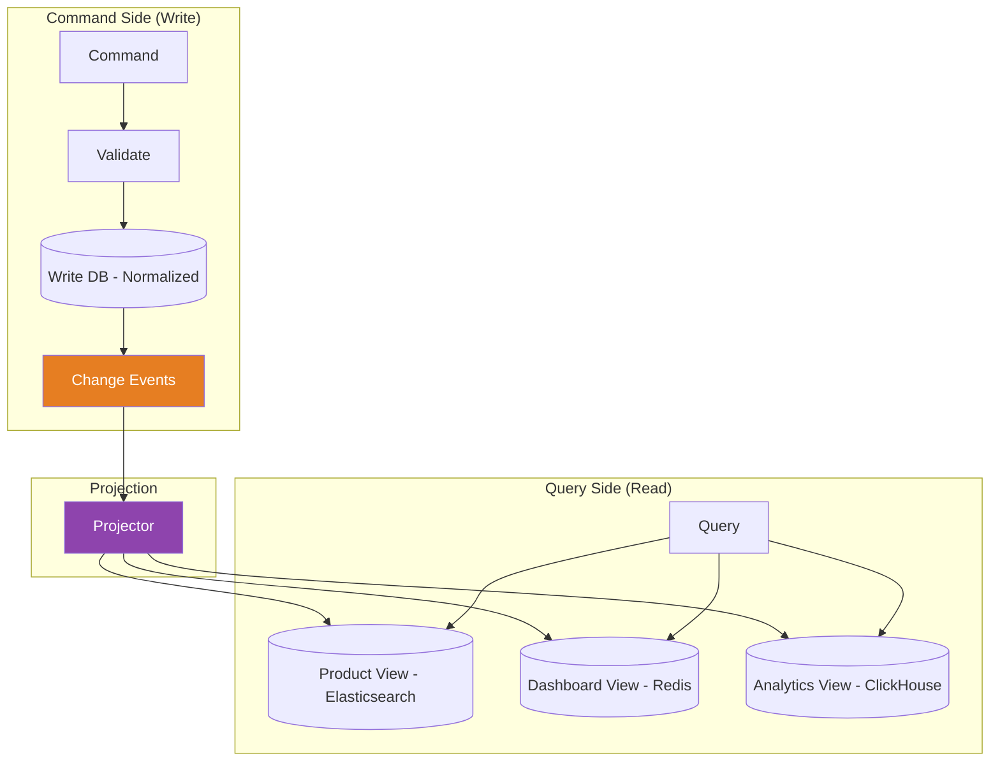

# CQRS (Applied)

## 1. The Problem

Your e-commerce platform has a Product Service. The `products` table serves both:

**Writes** — Sellers update inventory counts, prices, and descriptions 50 times/minute across 100K products.

**Reads** — Customers browse the catalog 12,000 requests/second. Each product page joins `products`, `reviews`, `seller_ratings`, `shipping_options`, and `price_history` — a 5-table JOIN.

```sql
-- The read query every product page executes:
SELECT p.*, 
       AVG(r.rating) as avg_rating, 
       COUNT(r.id) as review_count,
       s.name as seller_name, s.rating as seller_rating,
       GROUP_CONCAT(sh.method) as shipping_methods,
       ph.price_30d_ago, ph.price_90d_ago
FROM products p
JOIN reviews r ON r.product_id = p.id
JOIN sellers s ON s.id = p.seller_id
LEFT JOIN shipping_options sh ON sh.product_id = p.id
LEFT JOIN price_history ph ON ph.product_id = p.id
WHERE p.id = ?
GROUP BY p.id;
```

The problems:

- **Read contention blocks writes.** The massive read query holds shared locks on the `products` table. When a seller updates inventory (`UPDATE products SET stock = stock - 1`), it waits for the read lock to release. At 12K reads/second, writes queue up. Seller inventory updates are delayed by 2-3 seconds during peak hours.

- **Write schema != read schema.** The database is normalized for writes (3NF — separate tables for products, reviews, sellers). But reads need denormalized data (one flat document with embedded reviews, seller info, shipping options). You can't optimize for both in one schema.

- **Scaling reads scales writes too.** You add read replicas to handle 12K reads/second. But the replication lag means customers see stale inventory. A product shows "In Stock" but when they add to cart, it's actually out of stock.

- **Query complexity grows.** The product team wants "personalized pricing" (different prices per customer tier), "trending" badges, and "compare to similar" widgets. Each feature adds another JOIN or subquery to the already-slow read path. The write side doesn't need any of this.

```
Writes: Simple INSERT/UPDATE on normalized tables (fast)
Reads:  5-table JOIN + aggregation + personalization (slow, getting slower)
```

Both use the same model. Optimizing for one degrades the other.

---

## 2. Naïve Solutions (and Why They Fail)

### Attempt 1: Cache Everything

Put a Redis cache in front of the database:

```typescript
async function getProduct(id: string): Promise<Product> {
  const cached = await redis.get(`product:${id}`);
  if (cached) return JSON.parse(cached);

  const product = await db.query(COMPLEX_JOIN_QUERY, [id]);
  await redis.setex(`product:${id}`, 300, JSON.stringify(product));
  return product;
}
```

**Why it's a band-aid:**
- Cache invalidation is hard. When a seller updates the price, you must invalidate the product cache. But the read query also includes `avg_rating` from `reviews` — do you invalidate on every new review too? Every seller rating change? You end up invalidating constantly, defeating the cache.
- The 5-second TTL means customers see prices up to 5 seconds stale. For flash sales with limited inventory, 5 seconds of stale data means overselling.
- The underlying problem remains — the 5-table JOIN still runs on every cache miss. During cache stampedes (popular product cache expires → 1000 simultaneous misses), the database is hammered.

### Attempt 2: Materialized Views

Use database materialized views:

```sql
CREATE MATERIALIZED VIEW product_details AS
SELECT p.*, AVG(r.rating) as avg_rating, ...
FROM products p JOIN reviews r ON ...;

REFRESH MATERIALIZED VIEW product_details; -- When?
```

**Why it's limited:**
- Refresh is expensive. Refreshing a materialized view over 100K products with JOINs takes 30+ seconds. During refresh, reads see stale data or the refresh blocks writes.
- `REFRESH MATERIALIZED VIEW` is all-or-nothing — you can't refresh a single product. Even `REFRESH MATERIALIZED VIEW CONCURRENTLY` requires a unique index and is still slow.
- Materialized views are still in the same database. They share resources (CPU, memory, I/O) with the write path. Heavy refreshes during write-heavy periods cause contention.

### Attempt 3: Denormalized Write Table

Store the read-optimized document directly:

```sql
-- On every inventory update:
UPDATE products SET stock = ?, price = ?, avg_rating = ?, review_count = ?, 
       seller_name = ?, shipping_methods = ? WHERE id = ?;
```

**Why it creates update anomalies:**
- When a seller changes their name, you must update every product they sell. With 10K products per seller, that's 10K row updates for one name change.
- `avg_rating` is stored but also derived from `reviews`. A new review must update `avg_rating` in `products` — but what if two reviews are submitted simultaneously? One update overwrites the other.

---

## 3. The Insight

**Reads and writes are fundamentally different operations with different performance characteristics, different scaling requirements, and different data shapes. Stop forcing them through the same model. Use one model optimized for validating and accepting writes (commands), and a separate model optimized for serving reads (queries). The read model is a projection — built from events or changes emitted by the write model — and can be stored in whatever format serves queries fastest.**

---

## 4. The Pattern

### CQRS (Command Query Responsibility Segregation)

**Definition:** Separate the data model into two sides: a **Command side** (write model) that validates and processes state changes, and a **Query side** (read model) that serves pre-computed, denormalized data optimized for specific read use cases. The write model emits events or change notifications that update the read model asynchronously.

**Key properties:**
| Property | Description |
|---|---|
| **Separate models** | Write model is normalized for consistency; read model is denormalized for performance |
| **Independent scaling** | Read side can scale to 1000x the write side's capacity |
| **Optimized storage** | Read model can use a different database (e.g., Elasticsearch, Redis, MongoDB) |
| **Eventual consistency** | Read model may lag behind the write model by milliseconds to seconds |
| **Multiple read models** | Different queries can have different read models, each optimized for its use case |

**Guarantees:**
- Write model maintains full consistency and validation.
- Read model is always eventually consistent with the write model.
- Reads never block writes and vice versa.

**Non-guarantees:**
- Read-after-write consistency (you write, then immediately read — the read model may not reflect your write yet).
- Automatic synchronization — you must build the projection/sync mechanism.
- Simpler architecture — CQRS adds operational complexity (two models, sync pipeline, eventual consistency handling).

---

## 5. Mental Model

**A restaurant kitchen and menu.**  The kitchen (write side) has a normalized system — recipes, ingredient lists, prep procedures, inventory tracking. This is optimized for accurate cooking and inventory management. The menu (read side) is completely different — it shows photos, descriptions, prices, "Chef's Pick" badges, and dietary labels. The menu is a denormalized projection of the kitchen's data, optimized for customer decision-making. When the chef creates a new dish (write), the menu is eventually updated (projection). Nobody asks the chef to serve customers, and nobody asks the waiter to manage inventory.

---

## 6. Structure



---

## 7. Code Example

### TypeScript

```typescript
// ========== COMMAND SIDE (Write Model) ==========

interface UpdateProductCommand {
  type: "UpdateProduct";
  productId: string;
  fields: {
    price?: number;
    stock?: number;
    title?: string;
    description?: string;
  };
  sellerId: string;
}

interface SubmitReviewCommand {
  type: "SubmitReview";
  productId: string;
  customerId: string;
  rating: number;
  comment: string;
}

// Normalized write model — optimized for consistency
interface ProductWriteModel {
  id: string;
  sellerId: string;
  title: string;
  description: string;
  price: number;
  stock: number;
  updatedAt: Date;
}

interface ReviewWriteModel {
  id: string;
  productId: string;
  customerId: string;
  rating: number;
  comment: string;
  createdAt: Date;
}

// Change events emitted by write side
interface ProductUpdatedEvent {
  type: "ProductUpdated";
  productId: string;
  fields: Record<string, any>;
  timestamp: Date;
}

interface ReviewSubmittedEvent {
  type: "ReviewSubmitted";
  productId: string;
  reviewId: string;
  rating: number;
  comment: string;
  customerId: string;
  timestamp: Date;
}

type DomainEvent = ProductUpdatedEvent | ReviewSubmittedEvent;

// ========== COMMAND HANDLER ==========

class ProductCommandHandler {
  private products = new Map<string, ProductWriteModel>();
  private reviews = new Map<string, ReviewWriteModel[]>();
  private eventHandlers: ((event: DomainEvent) => void)[] = [];

  onEvent(handler: (event: DomainEvent) => void): void {
    this.eventHandlers.push(handler);
  }

  handleUpdateProduct(cmd: UpdateProductCommand): void {
    const product = this.products.get(cmd.productId);
    if (!product) throw new Error(`Product ${cmd.productId} not found`);
    if (product.sellerId !== cmd.sellerId) throw new Error("Not your product");

    // Validate
    if (cmd.fields.price !== undefined && cmd.fields.price < 0) {
      throw new Error("Price cannot be negative");
    }
    if (cmd.fields.stock !== undefined && cmd.fields.stock < 0) {
      throw new Error("Stock cannot be negative");
    }

    // Apply to write model
    Object.assign(product, cmd.fields, { updatedAt: new Date() });

    // Emit event
    this.emit({
      type: "ProductUpdated",
      productId: cmd.productId,
      fields: cmd.fields,
      timestamp: new Date(),
    });
  }

  handleSubmitReview(cmd: SubmitReviewCommand): void {
    if (cmd.rating < 1 || cmd.rating > 5) throw new Error("Rating must be 1-5");

    const reviewId = `rev-${Date.now()}`;
    const review: ReviewWriteModel = {
      id: reviewId,
      productId: cmd.productId,
      customerId: cmd.customerId,
      rating: cmd.rating,
      comment: cmd.comment,
      createdAt: new Date(),
    };

    // Store in write model
    const reviews = this.reviews.get(cmd.productId) || [];
    reviews.push(review);
    this.reviews.set(cmd.productId, reviews);

    // Emit event
    this.emit({
      type: "ReviewSubmitted",
      productId: cmd.productId,
      reviewId,
      rating: cmd.rating,
      comment: cmd.comment,
      customerId: cmd.customerId,
      timestamp: new Date(),
    });
  }

  // Seed data
  seedProduct(product: ProductWriteModel): void {
    this.products.set(product.id, product);
  }

  private emit(event: DomainEvent): void {
    this.eventHandlers.forEach((h) => h(event));
  }
}

// ========== QUERY SIDE (Read Model) ==========

// Denormalized read model — optimized for fast queries
interface ProductReadModel {
  id: string;
  title: string;
  description: string;
  price: number;
  stock: number;
  inStock: boolean;           // Pre-computed
  avgRating: number;          // Pre-computed aggregate
  reviewCount: number;        // Pre-computed aggregate
  recentReviews: {            // Embedded, not JOINed
    rating: number;
    comment: string;
    date: string;
  }[];
  priceDropped: boolean;      // Pre-computed comparison
  previousPrice?: number;
  lastUpdated: Date;
}

// ========== PROJECTOR ==========

class ProductProjector {
  private readModels = new Map<string, ProductReadModel>();
  private ratingAccumulator = new Map<string, { sum: number; count: number }>();

  handleEvent(event: DomainEvent): void {
    switch (event.type) {
      case "ProductUpdated":
        this.onProductUpdated(event);
        break;
      case "ReviewSubmitted":
        this.onReviewSubmitted(event);
        break;
    }
  }

  private onProductUpdated(event: ProductUpdatedEvent): void {
    const model = this.getOrCreate(event.productId);

    if (event.fields.price !== undefined) {
      model.previousPrice = model.price;
      model.price = event.fields.price;
      model.priceDropped = model.previousPrice > model.price;
    }
    if (event.fields.stock !== undefined) {
      model.stock = event.fields.stock;
      model.inStock = event.fields.stock > 0;
    }
    if (event.fields.title) model.title = event.fields.title;
    if (event.fields.description) model.description = event.fields.description;

    model.lastUpdated = event.timestamp;
  }

  private onReviewSubmitted(event: ReviewSubmittedEvent): void {
    const model = this.getOrCreate(event.productId);

    // Update aggregate
    const acc = this.ratingAccumulator.get(event.productId) || { sum: 0, count: 0 };
    acc.sum += event.rating;
    acc.count += 1;
    this.ratingAccumulator.set(event.productId, acc);

    model.avgRating = Math.round((acc.sum / acc.count) * 10) / 10;
    model.reviewCount = acc.count;

    // Keep last 5 reviews embedded
    model.recentReviews.unshift({
      rating: event.rating,
      comment: event.comment,
      date: event.timestamp.toISOString(),
    });
    if (model.recentReviews.length > 5) {
      model.recentReviews = model.recentReviews.slice(0, 5);
    }

    model.lastUpdated = event.timestamp;
  }

  // ---- Query API ----

  getProduct(id: string): ProductReadModel | undefined {
    return this.readModels.get(id);
  }

  getInStockProducts(): ProductReadModel[] {
    return [...this.readModels.values()].filter((p) => p.inStock);
  }

  getTopRated(limit: number): ProductReadModel[] {
    return [...this.readModels.values()]
      .filter((p) => p.reviewCount >= 3) // Minimum reviews
      .sort((a, b) => b.avgRating - a.avgRating)
      .slice(0, limit);
  }

  private getOrCreate(id: string): ProductReadModel {
    if (!this.readModels.has(id)) {
      this.readModels.set(id, {
        id,
        title: "",
        description: "",
        price: 0,
        stock: 0,
        inStock: false,
        avgRating: 0,
        reviewCount: 0,
        recentReviews: [],
        priceDropped: false,
        lastUpdated: new Date(),
      });
    }
    return this.readModels.get(id)!;
  }
}

// ========== WIRE IT UP ==========

const commandHandler = new ProductCommandHandler();
const projector = new ProductProjector();

// Connect write side to read side via events
commandHandler.onEvent((event) => projector.handleEvent(event));

// Seed a product
commandHandler.seedProduct({
  id: "prod-1",
  sellerId: "seller-a",
  title: "Wireless Mouse",
  description: "Ergonomic wireless mouse",
  price: 29_99,
  stock: 150,
  updatedAt: new Date(),
});

// Emit initial state as event
projector.handleEvent({
  type: "ProductUpdated",
  productId: "prod-1",
  fields: { title: "Wireless Mouse", price: 29_99, stock: 150 },
  timestamp: new Date(),
});

// Write: seller updates price
commandHandler.handleUpdateProduct({
  type: "UpdateProduct",
  productId: "prod-1",
  fields: { price: 24_99 }, // Price drop!
  sellerId: "seller-a",
});

// Write: customer submits review
commandHandler.handleSubmitReview({
  type: "SubmitReview",
  productId: "prod-1",
  customerId: "cust-1",
  rating: 5,
  comment: "Best mouse ever!",
});

// Read: query the pre-computed read model (no JOINs!)
const product = projector.getProduct("prod-1");
console.log(product);
// {
//   id: "prod-1", title: "Wireless Mouse", price: 2499,
//   inStock: true, avgRating: 5, reviewCount: 1,
//   priceDropped: true, previousPrice: 2999,
//   recentReviews: [{ rating: 5, comment: "Best mouse ever!", ... }]
// }
```

### Go

```go
package main

import (
	"fmt"
	"sort"
	"sync"
	"time"
)

// ========== EVENTS ==========

type Event struct {
	Type      string
	ProductID string
	Fields    map[string]any
	Timestamp time.Time
}

// ========== READ MODEL ==========

type ProductView struct {
	ID          string
	Title       string
	Price       int
	Stock       int
	InStock     bool
	AvgRating   float64
	ReviewCount int
	PriceDropped bool
	PrevPrice   int
	UpdatedAt   time.Time
}

// ========== PROJECTOR ==========

type Projector struct {
	mu      sync.RWMutex
	views   map[string]*ProductView
	ratings map[string]*ratingAcc
}

type ratingAcc struct {
	sum   int
	count int
}

func NewProjector() *Projector {
	return &Projector{
		views:   make(map[string]*ProductView),
		ratings: make(map[string]*ratingAcc),
	}
}

func (p *Projector) Handle(evt Event) {
	p.mu.Lock()
	defer p.mu.Unlock()

	v := p.getOrCreate(evt.ProductID)

	switch evt.Type {
	case "ProductUpdated":
		if price, ok := evt.Fields["price"].(int); ok {
			v.PrevPrice = v.Price
			v.Price = price
			v.PriceDropped = v.PrevPrice > v.Price && v.PrevPrice > 0
		}
		if stock, ok := evt.Fields["stock"].(int); ok {
			v.Stock = stock
			v.InStock = stock > 0
		}
		if title, ok := evt.Fields["title"].(string); ok {
			v.Title = title
		}

	case "ReviewSubmitted":
		rating := evt.Fields["rating"].(int)
		acc := p.ratings[evt.ProductID]
		if acc == nil {
			acc = &ratingAcc{}
			p.ratings[evt.ProductID] = acc
		}
		acc.sum += rating
		acc.count++
		v.AvgRating = float64(acc.sum) / float64(acc.count)
		v.ReviewCount = acc.count
	}

	v.UpdatedAt = evt.Timestamp
}

func (p *Projector) GetProduct(id string) *ProductView {
	p.mu.RLock()
	defer p.mu.RUnlock()
	return p.views[id]
}

func (p *Projector) TopRated(limit int) []*ProductView {
	p.mu.RLock()
	defer p.mu.RUnlock()

	var eligible []*ProductView
	for _, v := range p.views {
		if v.ReviewCount >= 3 {
			eligible = append(eligible, v)
		}
	}
	sort.Slice(eligible, func(i, j int) bool {
		return eligible[i].AvgRating > eligible[j].AvgRating
	})
	if len(eligible) > limit {
		eligible = eligible[:limit]
	}
	return eligible
}

func (p *Projector) getOrCreate(id string) *ProductView {
	if _, ok := p.views[id]; !ok {
		p.views[id] = &ProductView{ID: id}
	}
	return p.views[id]
}

// ========== COMMAND HANDLER ==========

type CommandHandler struct {
	listeners []func(Event)
}

func (ch *CommandHandler) OnEvent(fn func(Event)) {
	ch.listeners = append(ch.listeners, fn)
}

func (ch *CommandHandler) UpdatePrice(productID string, newPrice int) {
	// Validate (write-side business rules)
	if newPrice < 0 {
		panic("price cannot be negative")
	}

	evt := Event{
		Type: "ProductUpdated", ProductID: productID,
		Fields:    map[string]any{"price": newPrice},
		Timestamp: time.Now(),
	}
	for _, fn := range ch.listeners {
		fn(evt)
	}
}

func (ch *CommandHandler) SubmitReview(productID string, rating int) {
	if rating < 1 || rating > 5 {
		panic("rating must be 1-5")
	}

	evt := Event{
		Type: "ReviewSubmitted", ProductID: productID,
		Fields:    map[string]any{"rating": rating},
		Timestamp: time.Now(),
	}
	for _, fn := range ch.listeners {
		fn(evt)
	}
}

func main() {
	proj := NewProjector()
	cmd := &CommandHandler{}
	cmd.OnEvent(proj.Handle)

	// Initial product
	proj.Handle(Event{
		Type: "ProductUpdated", ProductID: "prod-1",
		Fields:    map[string]any{"title": "Wireless Mouse", "price": 2999, "stock": 150},
		Timestamp: time.Now(),
	})

	// Seller drops price
	cmd.UpdatePrice("prod-1", 2499)

	// Customers review
	cmd.SubmitReview("prod-1", 5)
	cmd.SubmitReview("prod-1", 4)
	cmd.SubmitReview("prod-1", 5)

	// Query read model — no JOINs, instant
	v := proj.GetProduct("prod-1")
	fmt.Printf("Product: %s\n", v.Title)
	fmt.Printf("Price: $%.2f (was $%.2f, dropped: %v)\n",
		float64(v.Price)/100, float64(v.PrevPrice)/100, v.PriceDropped)
	fmt.Printf("Rating: %.1f (%d reviews)\n", v.AvgRating, v.ReviewCount)
	fmt.Printf("In Stock: %v (%d units)\n", v.InStock, v.Stock)
}
```

---

## 8. Gotchas & Beginner Mistakes

| Mistake | Why It Hurts |
|---|---|
| **Read-after-write confusion** | User updates their profile, refreshes the page, sees the old data. The read model hasn't caught up yet. Solutions: read from write model for the user's own data, or use sticky reads with a "last-write" token. |
| **Too many read models** | Creating a separate read model for every API endpoint. You end up with 40 projections, each requiring its own event handler and storage. Group related queries into shared read models. |
| **Projector failures silently skip events** | An event handler throws an exception. The event is lost and the read model diverges from the write model forever. Use persistent event processing with acknowledgment (e.g., Kafka consumer groups). |
| **Applying CQRS to every service** | CQRS adds significant complexity. For services with balanced read/write ratios and simple queries, a single model with caching is better. Apply CQRS surgically to the hot spots. |
| **Shared database for both models** | The write model and read model share a PostgreSQL instance. Under load, the projector's writes to the read model compete with the command handler's writes. Use separate databases. |

---

## 9. Related & Confusable Patterns

| Pattern | How It Differs |
|---|---|
| **Event Sourcing** | Stores events as the source of truth. CQRS separates read and write models. They're complementary but independent — you can use CQRS with a traditional write database (no event sourcing), and event sourcing without separate read models. |
| **Materialized View** | A database-level denormalized view. A CQRS read model is an application-level materialized view, often in a different storage system. Materialized views are limited to SQL; CQRS projections can build any data structure. |
| **Cache** | A temporary copy of the source data, invalidated over time. A CQRS read model is a persistent, event-updated representation that IS the query data — not a temporary copy. It doesn't expire; it's updated by events. |
| **API Gateway / BFF** | Aggregates data from multiple services at the API layer. CQRS stores pre-aggregated data in the read model. The gateway computes on every request; the CQRS projection computes once per event. |
| **Database Replication** | Read replicas serve the same schema with replication lag. CQRS uses a DIFFERENT schema for reads, optimized for query patterns. Replicas replicate structure; CQRS transforms structure. |

---

## 10. When This Pattern Is the WRONG Choice

- **Balanced read/write ratios** — If reads and writes are equally frequent and use similar data shapes, the overhead of maintaining two models isn't justified. A single well-indexed table with caching works fine.
- **Simple domains** — A settings service, a feature flag service, a user preferences API. These have simple schemas and low throughput. CQRS adds infrastructure (event bus, projections, two databases) for negligible benefit.
- **Strong consistency requirements** — Banking ledgers, inventory counts for flash sales. If users MUST see their writes immediately and consistently, eventual consistency between write and read models is unacceptable.

**Symptoms you should reconsider:**
- The projector crashes and you have no replay mechanism. The read model is now stale and can't recover. You've built CQRS without the infrastructure to support it (durable events, replay capability, monitoring).
- Read-after-write bugs dominate your support tickets. Users are confused by stale data. The eventual consistency lag is too visible for your use case.
- Write and read models are nearly identical. You're maintaining two copies of the same schema with a sync pipeline between them. This is complexity for complexity's sake.

**How to back out:** Merge the read model back into the write database. Replace projections with indexed views or cached queries. Remove the event pipeline. The primary risk is performance regression on reads — mitigate with database indexes, read replicas, and application-level caching.
