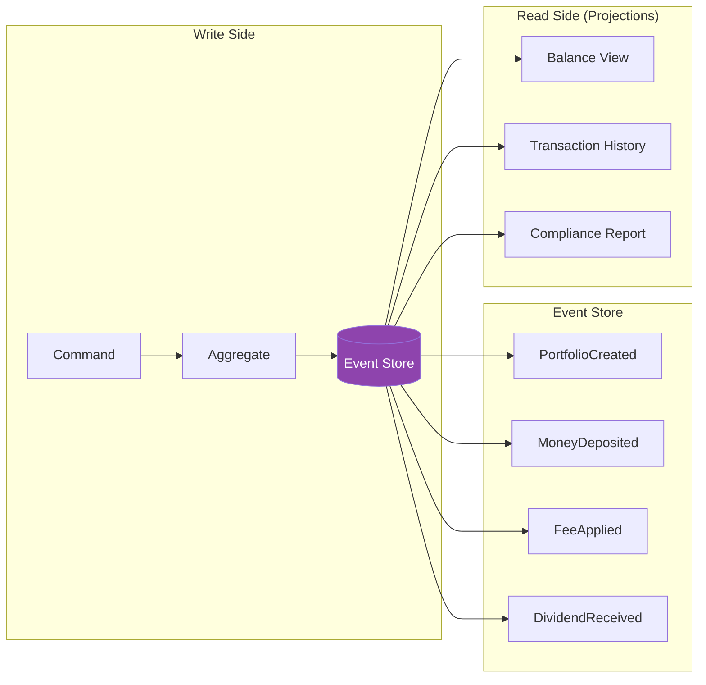
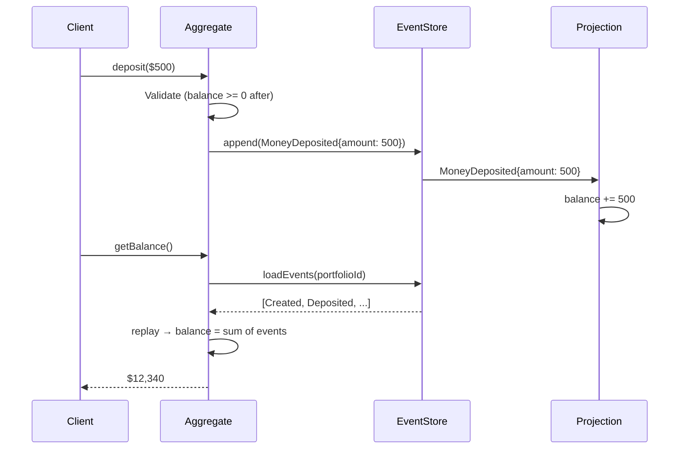

# Event Sourcing (Applied)

## 1. The Problem

Your fintech platform manages investment portfolios. Each portfolio has a `balance` field in a PostgreSQL table:

```sql
UPDATE portfolios SET balance = balance + 500.00 WHERE id = 'port-123';
```

An investor calls: "My portfolio shows $12,340, but I calculated $12,840 based on my deposits and the returns you advertised. There's $500 missing."

Your support team queries the database. They see the current balance: $12,340. They check the audit log — but the audit log only has entries for the last 30 days (it's auto-pruned). They check the transaction table — but the transaction table shows debits and credits, not the business context of WHY each change happened. Was the -$500 a fee? A correction? A bug?

```
// Transaction log shows:
2024-01-15  +1000.00  (okay, that's a deposit)
2024-02-01   -500.00  (what was this? A fee? A withdrawal? A bug fix?)
2024-02-15   +200.00  (dividend? manual correction? refund?)
```

The problems multiply:

- **No business context.** The database stores `balance = 12340`, not "how it got there." You can't reconstruct the sequence of events that produced this number.
- **Regulatory audit failure.** The SEC requires you to show exactly what happened to every account, step by step, with timestamps and the identity of who initiated each action. `UPDATE SET balance = X` doesn't capture that.
- **Bug investigation is forensics.** A bug in yesterday's fee calculation overcharged 200 accounts. To find which ones, you'd need to know: which accounts were active yesterday, what fee should have been applied, and what fee WAS applied. The current balance tells you nothing about yesterday's fee calculation.
- **Time-travel queries impossible.** "What was the portfolio value on March 15th at 4:00 PM?" — No idea. You only have the current balance. Historical snapshots don't exist.

You store the RESULT of every business decision, but not the decisions themselves. You've thrown away the receipts and kept only the bank statement.

---

## 2. Naïve Solutions (and Why They Fail)

### Attempt 1: Separate Audit Table

Trigger-based logging:

```sql
CREATE TRIGGER portfolio_audit AFTER UPDATE ON portfolios
FOR EACH ROW INSERT INTO audit_log (table_name, record_id, old_value, new_value, changed_at)
VALUES ('portfolios', OLD.id, OLD.balance, NEW.balance, NOW());
```

**Why it's insufficient:**
- The audit log captures WHAT changed (balance: 12840 → 12340), not WHY (fee applied: annual management fee of $500).
- The audit log is a secondary artifact derived from the update, not the source of truth. If the trigger fails, the update succeeds but the audit is lost.
- Querying "all fee events for this portfolio" requires parsing audit log entries and guessing which $500 decrements were fees vs. withdrawals.

### Attempt 2: Change Data Capture (CDC)

Use Debezium or similar to stream database changes to Kafka:

```
portfolios.update → {"before": {"balance": 12840}, "after": {"balance": 12340}}
```

**Why it still misses the context:**
- CDC captures row-level changes. It tells you the balance went from 12840 to 12340, but not "because annual management fee of $500 was applied based on 0.5% AUM."
- CDC is an infrastructure concern, not a domain model. The downstream consumer receives generic database changes, not business events.
- If you need to replay events to fix a bug, CDC gives you data diffs, not executable domain events.

### Attempt 3: Fat Transaction Table

Log everything in a transaction table with context:

```sql
INSERT INTO transactions (portfolio_id, type, amount, description, metadata)
VALUES ('port-123', 'FEE', -500, 'Annual management fee', '{"rate": 0.005}');

-- Then update the balance
UPDATE portfolios SET balance = balance - 500 WHERE id = 'port-123';
```

**Why it diverges:**
- Two sources of truth: the `portfolios.balance` column AND the `SUM(amount)` from `transactions`. They inevitably drift. A manual correction updates `balance` but forgets to insert a transaction. Now they disagree.
- Which one is right? If `balance` says $12,340 but `SUM(transactions)` says $12,840, which do you trust? You have no definitive answer.

---

## 3. The Insight

**Stop storing state. Store the sequence of events that produced the state. The current balance is just the SUM of all deposit, withdrawal, fee, and dividend events. When you need the balance, replay the events. When you need the history, the events ARE the history. When you need to debug, replay up to the problematic event and inspect. The events are the single source of truth — everything else is a derived view.**

---

## 4. The Pattern

### Event Sourcing (Applied)

**Definition:** Instead of storing the current state of an entity, persist an immutable, append-only sequence of domain events that describe every state change. The current state is derived by replaying (folding/reducing) all events from the beginning. The event log is the authoritative source of truth; any materialized state is a cached projection.

**Key properties:**
| Property | Description |
|---|---|
| **Append-only** | Events are never updated or deleted |
| **Immutable** | Each event is a fact that happened — can't be undone, only compensated with a new event |
| **Self-describing** | Each event carries the full business context (who, what, why, when) |
| **Replayable** | Current state can be rebuilt from events at any time |
| **Projectable** | Different views (read models) can be derived from the same event stream |

**Guarantees:**
- Complete audit trail with full business context, forever.
- Ability to reconstruct state at any point in time.
- Events can be replayed to build new read models retroactively.

**Non-guarantees:**
- Delivering events to external systems exactly once (at-least-once delivery is typical).
- Automatic schema evolution of old events (requires explicit migration strategies).
- Performance isn't free — replaying millions of events per entity is slow without snapshots.

---

## 5. Mental Model

**An accounting ledger.** An accountant doesn't erase and rewrite the account balance. They add a new line entry: "+$500 deposit from client check #4521." The current balance is always the sum of all entries. To audit, you read the ledger top to bottom. To find an error, you check each entry. To correct a mistake, you add a new entry: "Correction: reverse erroneous fee of $500." The original erroneous entry remains — it's part of the historical record.

---

## 6. Structure





---

## 7. Code Example

### TypeScript

```typescript
// ========== EVENTS ==========

interface BaseEvent {
  eventId: string;
  aggregateId: string;
  version: number;     // Sequence number within the aggregate
  timestamp: Date;
  userId: string;      // Who initiated this
}

interface PortfolioCreated extends BaseEvent {
  type: "PortfolioCreated";
  data: { ownerName: string; accountType: "individual" | "joint" };
}

interface MoneyDeposited extends BaseEvent {
  type: "MoneyDeposited";
  data: { amount: number; source: string; referenceId: string };
}

interface MoneyWithdrawn extends BaseEvent {
  type: "MoneyWithdrawn";
  data: { amount: number; destination: string; referenceId: string };
}

interface FeeApplied extends BaseEvent {
  type: "FeeApplied";
  data: { amount: number; feeType: string; rate: number; calculationBasis: number };
}

interface DividendReceived extends BaseEvent {
  type: "DividendReceived";
  data: { amount: number; ticker: string; sharesHeld: number; perShareAmount: number };
}

interface CorrectionApplied extends BaseEvent {
  type: "CorrectionApplied";
  data: { amount: number; reason: string; originalEventId: string };
}

type PortfolioEvent =
  | PortfolioCreated | MoneyDeposited | MoneyWithdrawn
  | FeeApplied | DividendReceived | CorrectionApplied;

// ========== EVENT STORE ==========

class EventStore {
  private streams = new Map<string, PortfolioEvent[]>();
  private subscribers: ((event: PortfolioEvent) => void)[] = [];

  async append(aggregateId: string, events: PortfolioEvent[], expectedVersion: number): Promise<void> {
    const stream = this.streams.get(aggregateId) || [];
    const currentVersion = stream.length;

    // Optimistic concurrency check
    if (currentVersion !== expectedVersion) {
      throw new Error(
        `Concurrency conflict: expected version ${expectedVersion}, got ${currentVersion}`
      );
    }

    stream.push(...events);
    this.streams.set(aggregateId, stream);

    // Notify projections
    for (const event of events) {
      this.subscribers.forEach((sub) => sub(event));
    }
  }

  async loadEvents(aggregateId: string): Promise<PortfolioEvent[]> {
    return this.streams.get(aggregateId) || [];
  }

  // Load events up to a specific point in time
  async loadEventsUntil(aggregateId: string, until: Date): Promise<PortfolioEvent[]> {
    const all = this.streams.get(aggregateId) || [];
    return all.filter((e) => e.timestamp <= until);
  }

  onEvent(subscriber: (event: PortfolioEvent) => void): void {
    this.subscribers.push(subscriber);
  }
}

// ========== AGGREGATE ==========

interface PortfolioState {
  id: string;
  ownerName: string;
  balance: number;
  isActive: boolean;
  version: number;
}

class Portfolio {
  private state: PortfolioState;
  private uncommittedEvents: PortfolioEvent[] = [];

  constructor(private id: string) {
    this.state = { id, ownerName: "", balance: 0, isActive: false, version: 0 };
  }

  // ---- Rebuild from events ----

  static fromEvents(id: string, events: PortfolioEvent[]): Portfolio {
    const portfolio = new Portfolio(id);
    for (const event of events) {
      portfolio.apply(event);
    }
    return portfolio;
  }

  private apply(event: PortfolioEvent): void {
    switch (event.type) {
      case "PortfolioCreated":
        this.state.ownerName = event.data.ownerName;
        this.state.isActive = true;
        break;
      case "MoneyDeposited":
        this.state.balance += event.data.amount;
        break;
      case "MoneyWithdrawn":
        this.state.balance -= event.data.amount;
        break;
      case "FeeApplied":
        this.state.balance -= event.data.amount;
        break;
      case "DividendReceived":
        this.state.balance += event.data.amount;
        break;
      case "CorrectionApplied":
        this.state.balance += event.data.amount; // Can be negative
        break;
    }
    this.state.version = event.version;
  }

  // ---- Commands (produce events) ----

  create(ownerName: string, accountType: "individual" | "joint", userId: string): void {
    if (this.state.isActive) throw new Error("Portfolio already created");

    this.raiseEvent({
      type: "PortfolioCreated",
      data: { ownerName, accountType },
    } as any, userId);
  }

  deposit(amount: number, source: string, referenceId: string, userId: string): void {
    if (amount <= 0) throw new Error("Deposit must be positive");
    if (!this.state.isActive) throw new Error("Portfolio not active");

    this.raiseEvent({
      type: "MoneyDeposited",
      data: { amount, source, referenceId },
    } as any, userId);
  }

  withdraw(amount: number, destination: string, referenceId: string, userId: string): void {
    if (amount <= 0) throw new Error("Withdrawal must be positive");
    if (this.state.balance < amount) throw new Error("Insufficient funds");

    this.raiseEvent({
      type: "MoneyWithdrawn",
      data: { amount, destination, referenceId },
    } as any, userId);
  }

  applyFee(feeType: string, rate: number, userId: string): void {
    const amount = Math.round(this.state.balance * rate * 100) / 100;
    if (amount <= 0) return; // No fee on zero balance

    this.raiseEvent({
      type: "FeeApplied",
      data: { amount, feeType, rate, calculationBasis: this.state.balance },
    } as any, userId);
  }

  private raiseEvent(partial: Partial<PortfolioEvent>, userId: string): void {
    const nextVersion = this.state.version + 1;
    const event = {
      ...partial,
      eventId: `evt-${Date.now()}-${Math.random().toString(36).slice(2)}`,
      aggregateId: this.id,
      version: nextVersion,
      timestamp: new Date(),
      userId,
    } as PortfolioEvent;

    this.apply(event);
    this.uncommittedEvents.push(event);
  }

  getBalance(): number { return this.state.balance; }
  getVersion(): number { return this.state.version; }
  getUncommittedEvents(): PortfolioEvent[] { return [...this.uncommittedEvents]; }
  clearUncommittedEvents(): void { this.uncommittedEvents = []; }
}

// ========== REPOSITORY ==========

class PortfolioRepository {
  constructor(private store: EventStore) {}

  async load(id: string): Promise<Portfolio> {
    const events = await this.store.loadEvents(id);
    return Portfolio.fromEvents(id, events);
  }

  async save(portfolio: Portfolio): Promise<void> {
    const events = portfolio.getUncommittedEvents();
    if (events.length === 0) return;

    const expectedVersion = portfolio.getVersion() - events.length;
    await this.store.append(portfolio.id, events, expectedVersion);
    portfolio.clearUncommittedEvents();
  }

  // Time-travel: get state at a past date
  async loadAt(id: string, atDate: Date): Promise<Portfolio> {
    const events = await this.store.loadEventsUntil(id, atDate);
    return Portfolio.fromEvents(id, events);
  }
}

// ========== PROJECTION (Read Model) ==========

interface BalanceView {
  portfolioId: string;
  ownerName: string;
  currentBalance: number;
  totalDeposits: number;
  totalWithdrawals: number;
  totalFees: number;
  lastUpdated: Date;
}

class BalanceProjection {
  private views = new Map<string, BalanceView>();

  constructor(store: EventStore) {
    store.onEvent((event) => this.handle(event));
  }

  private handle(event: PortfolioEvent): void {
    let view = this.views.get(event.aggregateId);
    if (!view) {
      view = {
        portfolioId: event.aggregateId,
        ownerName: "",
        currentBalance: 0,
        totalDeposits: 0,
        totalWithdrawals: 0,
        totalFees: 0,
        lastUpdated: event.timestamp,
      };
      this.views.set(event.aggregateId, view);
    }

    switch (event.type) {
      case "PortfolioCreated":
        view.ownerName = event.data.ownerName;
        break;
      case "MoneyDeposited":
        view.currentBalance += event.data.amount;
        view.totalDeposits += event.data.amount;
        break;
      case "MoneyWithdrawn":
        view.currentBalance -= event.data.amount;
        view.totalWithdrawals += event.data.amount;
        break;
      case "FeeApplied":
        view.currentBalance -= event.data.amount;
        view.totalFees += event.data.amount;
        break;
    }
    view.lastUpdated = event.timestamp;
  }

  getBalance(portfolioId: string): BalanceView | undefined {
    return this.views.get(portfolioId);
  }
}

// ========== USAGE ==========

const store = new EventStore();
const repo = new PortfolioRepository(store);
const balances = new BalanceProjection(store);

// Create and operate on a portfolio
const portfolio = new Portfolio("port-123");
portfolio.create("Alice Johnson", "individual", "admin-01");
portfolio.deposit(10000, "wire_transfer", "REF-001", "admin-01");
portfolio.deposit(3340, "ach_transfer", "REF-002", "admin-01");
portfolio.applyFee("management_fee", 0.005, "system");
await repo.save(portfolio);

console.log("Balance:", portfolio.getBalance());      // 13273.30
console.log("View:", balances.getBalance("port-123")); // Full view with totals

// Time travel: what was the balance before the fee?
const beforeFee = await repo.loadAt("port-123", new Date("2024-02-14"));
console.log("Balance before fee:", beforeFee.getBalance());
```

### Go

```go
package main

import (
	"encoding/json"
	"fmt"
	"time"
)

// ========== EVENTS ==========

type EventType string

const (
	PortfolioCreatedType EventType = "PortfolioCreated"
	MoneyDepositedType   EventType = "MoneyDeposited"
	MoneyWithdrawnType   EventType = "MoneyWithdrawn"
	FeeAppliedType       EventType = "FeeApplied"
)

type StoredEvent struct {
	EventID     string
	AggregateID string
	Type        EventType
	Version     int
	Data        json.RawMessage
	UserID      string
	Timestamp   time.Time
}

type DepositData struct {
	Amount      float64 `json:"amount"`
	Source      string  `json:"source"`
	ReferenceID string  `json:"referenceId"`
}

type FeeData struct {
	Amount          float64 `json:"amount"`
	FeeType         string  `json:"feeType"`
	Rate            float64 `json:"rate"`
	CalculationBasis float64 `json:"calculationBasis"`
}

// ========== AGGREGATE ==========

type Portfolio struct {
	ID        string
	OwnerName string
	Balance   float64
	IsActive  bool
	Version   int
	uncommitted []StoredEvent
}

func NewPortfolio(id string) *Portfolio {
	return &Portfolio{ID: id}
}

func LoadFromEvents(id string, events []StoredEvent) *Portfolio {
	p := NewPortfolio(id)
	for _, e := range events {
		p.apply(e)
	}
	return p
}

func (p *Portfolio) apply(evt StoredEvent) {
	switch evt.Type {
	case PortfolioCreatedType:
		var d struct{ OwnerName string }
		json.Unmarshal(evt.Data, &d)
		p.OwnerName = d.OwnerName
		p.IsActive = true

	case MoneyDepositedType:
		var d DepositData
		json.Unmarshal(evt.Data, &d)
		p.Balance += d.Amount

	case MoneyWithdrawnType:
		var d struct{ Amount float64 }
		json.Unmarshal(evt.Data, &d)
		p.Balance -= d.Amount

	case FeeAppliedType:
		var d FeeData
		json.Unmarshal(evt.Data, &d)
		p.Balance -= d.Amount
	}
	p.Version = evt.Version
}

func (p *Portfolio) Deposit(amount float64, source, ref, userId string) error {
	if amount <= 0 {
		return fmt.Errorf("deposit must be positive")
	}
	if !p.IsActive {
		return fmt.Errorf("portfolio not active")
	}

	data, _ := json.Marshal(DepositData{Amount: amount, Source: source, ReferenceID: ref})
	p.raise(MoneyDepositedType, data, userId)
	return nil
}

func (p *Portfolio) ApplyFee(feeType string, rate float64, userId string) {
	amount := p.Balance * rate
	if amount <= 0 {
		return
	}
	data, _ := json.Marshal(FeeData{
		Amount: amount, FeeType: feeType,
		Rate: rate, CalculationBasis: p.Balance,
	})
	p.raise(FeeAppliedType, data, userId)
}

func (p *Portfolio) raise(t EventType, data json.RawMessage, userId string) {
	nextVersion := p.Version + 1
	evt := StoredEvent{
		EventID:     fmt.Sprintf("evt-%d", time.Now().UnixNano()),
		AggregateID: p.ID,
		Type:        t,
		Version:     nextVersion,
		Data:        data,
		UserID:      userId,
		Timestamp:   time.Now(),
	}
	p.apply(evt)
	p.uncommitted = append(p.uncommitted, evt)
}

func (p *Portfolio) Uncommitted() []StoredEvent    { return p.uncommitted }
func (p *Portfolio) ClearUncommitted()             { p.uncommitted = nil }

// ========== EVENT STORE ==========

type EventStore struct {
	streams map[string][]StoredEvent
}

func NewEventStore() *EventStore {
	return &EventStore{streams: make(map[string][]StoredEvent)}
}

func (es *EventStore) Append(aggID string, events []StoredEvent, expectedVersion int) error {
	stream := es.streams[aggID]
	if len(stream) != expectedVersion {
		return fmt.Errorf("concurrency conflict: expected %d, got %d",
			expectedVersion, len(stream))
	}
	es.streams[aggID] = append(stream, events...)
	return nil
}

func (es *EventStore) Load(aggID string) []StoredEvent {
	return es.streams[aggID]
}

func main() {
	store := NewEventStore()

	// Create portfolio and add events
	p := NewPortfolio("port-123")

	createData, _ := json.Marshal(map[string]string{"ownerName": "Alice Johnson"})
	p.raise(PortfolioCreatedType, createData, "admin")
	p.Deposit(10000, "wire", "REF-001", "admin")
	p.Deposit(3340, "ach", "REF-002", "admin")
	p.ApplyFee("management_fee", 0.005, "system")

	// Save
	expectedVersion := p.Version - len(p.Uncommitted())
	if err := store.Append(p.ID, p.Uncommitted(), expectedVersion); err != nil {
		panic(err)
	}
	p.ClearUncommitted()

	fmt.Printf("Balance: $%.2f\n", p.Balance)
	fmt.Printf("Events stored: %d\n", len(store.Load("port-123")))

	// Rebuild from events (proof of replay)
	rebuilt := LoadFromEvents("port-123", store.Load("port-123"))
	fmt.Printf("Rebuilt balance: $%.2f\n", rebuilt.Balance)
	fmt.Printf("Match: %v\n", p.Balance == rebuilt.Balance)
}
```

---

## 8. Gotchas & Beginner Mistakes

| Mistake | Why It Hurts |
|---|---|
| **No snapshots for large event streams** | Replaying 500,000 events to get the current portfolio balance takes 2 seconds. Take periodic snapshots (e.g., every 100 events) and replay only from the latest snapshot. |
| **Mutating events** | "We can just update the old event to fix the data." No! Events are immutable facts. To correct, append a new `CorrectionApplied` event. Mutating events breaks audit integrity. |
| **Coupling projections to event schema** | A projection breaks because an event field was renamed. Version your events. Support old formats in projections forever, or run a one-time migration that re-writes old events (with extreme care). |
| **No concurrency control** | Two users deposit simultaneously. Both read version 5, both try to append at version 6. Without optimistic concurrency checks, one deposit is silently lost. Always check expected version on append. |
| **Storing derived data in events** | An event includes `newBalance: 12340` alongside `amount: 500`. Now the balance is in two places — the event data and the derived state. If a replay changes the calculation, the stored balance conflicts with the computed one. Events should store the input, not the output. |

---

## 9. Related & Confusable Patterns

| Pattern | How It Differs |
|---|---|
| **CQRS** | Separates read and write models. Often used WITH event sourcing (events on the write side, projections on the read side), but neither requires the other. You can do CQRS without event sourcing and event sourcing without CQRS. |
| **Change Data Capture (CDC)** | Captures infrastructure-level changes (row updates). Event Sourcing captures domain-level events (business facts). CDC doesn't know why a row changed; event sourcing records the business reason. |
| **Audit Log** | A secondary record of changes. In Event Sourcing, the events ARE the primary data — the audit log is not a side effect, it's the system of record. |
| **Transaction Log (WAL)** | A database-internal mechanism for crash recovery. Conceptually similar (append-only log), but WAL is infrastructure-level and pruned after checkpointing. Event sourcing logs are permanent business records. |
| **Temporal Tables** | SQL tables that track row history (valid_from, valid_to). Captures state snapshots at each change but not the business reason. Event Sourcing captures the reason and derives the state. |

---

## 10. When This Pattern Is the WRONG Choice

- **Simple CRUD applications** — A blog, a todo list, a settings page. The overhead of event sourcing (event store, projections, eventual consistency) is massive for entities with simple state and no audit requirements.
- **High-write, low-read, no-audit entities** — Sensor data, click tracking, session logs. These are naturally append-only but don't need replay, projections, or domain aggregates.
- **Teams without event-driven experience** — Event sourcing fundamentally changes how you think about data. Teams accustomed to "UPDATE SET" will struggle with eventual consistency, projection lag, and the prohibition on deleting data.

**Symptoms you should reconsider:**
- Every query requires a custom projection, and you have 30 projections for 5 aggregates. You're over-projecting. Consider whether a traditional read-through cache would be simpler.
- Events are schema-less JSON blobs with no validation. Old events have different structures that break new projections. You've replicated the "schemaless database" anti-pattern inside your event store.
- Debugging requires correlating events across 10 streams. The conceptual model is too fragmented — consider fewer, coarser aggregates.

**How to back out:** Materialize your projections into a traditional database as the source of truth. Stop writing new events. The projections become your tables, and you switch to CRUD. Keep the event store read-only for historical queries during the transition.
