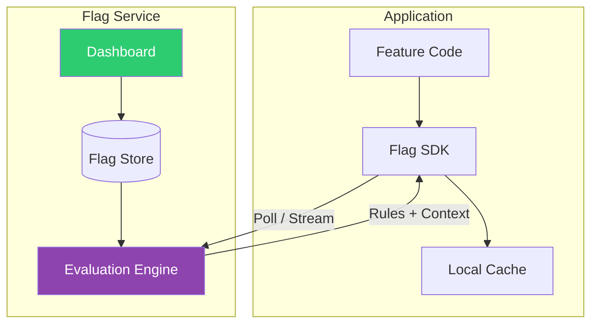
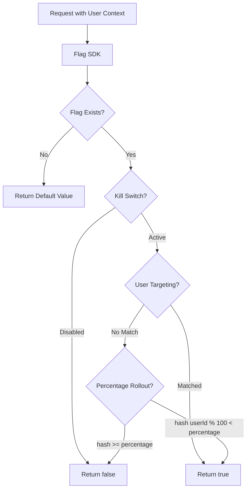

# Feature Flags

## 1. The Problem

Your team ships a new checkout redesign. The deploy goes out Friday at 4 PM. By 4:15 PM, conversion rate drops 23%. The on-call engineer reverts the deploy — but the revert takes 12 minutes (CI pipeline, build, deploy, pod rollout). During those 12 minutes, the company loses $47,000 in abandoned carts.

Post-mortem reveals deeper issues:

- **Deploy = Release.** Every `git merge` to `main` immediately exposes the new feature to 100% of users. There's no way to ship code to production without users seeing it.
- **Gradual rollout impossible.** The PM wants to test the new checkout with 5% of users first. The current system is all-or-nothing — deploy means everyone gets it.
- **A/B testing requires code branches.** Marketing wants to test two different CTA buttons. The engineering team creates a `feature/cta-variant-a` and `feature/cta-variant-b` branch. Both diverge from `main` for 3 weeks. The merge is a nightmare.
- **Long-lived branches for incomplete features.** The new recommendation engine is 60% done. It lives in a separate branch for 2 months, accumulating merge conflicts. When it finally merges, it conflicts with 140 files.
- **Ops needs an emergency kill switch.** During Black Friday, the recommendation engine's ML model is consuming too much CPU. Ops needs to disable it immediately — but the only way is to deploy a code change that removes the feature. That takes 12 minutes and requires the feature team's involvement.

```typescript
// Current state: code IS the config
function Checkout() {
  return <NewCheckoutFlow />;  // 100% of users see this. Always.
  // Can't partially enable, can't A/B test, can't kill without redeploy
}
```

**Deployment and feature release are coupled. You can't deploy code without releasing features, and you can't release features without deploying code.**

---

## 2. Naïve Solutions (and Why They Fail)

### Attempt 1: Environment Variables

```typescript
const USE_NEW_CHECKOUT = process.env.NEW_CHECKOUT === "true";

function Checkout() {
  if (USE_NEW_CHECKOUT) return <NewCheckoutFlow />;
  return <OldCheckoutFlow />;
}
```

**Why it's too coarse:**
- Environment variables are set at deploy time and require a restart to change. "Disable new checkout" still means editing the env var and restarting all pods — a 5-minute operation with rolling restarts.
- No gradual rollout. It's `true` or `false` for ALL users. You can't enable for 5% of users or for internal employees only.
- No audit trail. Who changed `NEW_CHECKOUT` from `true` to `false`? When? Environment variables don't have change history.

### Attempt 2: Database Config Table

```sql
CREATE TABLE feature_config (
  feature_name VARCHAR PRIMARY KEY,
  enabled BOOLEAN
);
```

```typescript
async function isEnabled(feature: string): Promise<boolean> {
  const row = await db.query("SELECT enabled FROM feature_config WHERE feature_name = $1", [feature]);
  return row?.enabled ?? false;
}
```

**Why it's too simple:**
- No targeting. It's still all-or-nothing. You can't enable for specific users, segments, or percentages.
- Database query per feature check. A page that checks 8 features makes 8 DB queries. Under load, this adds latency and database pressure.
- No flag lifecycle management. Who created this flag? Is it temporary (should be cleaned up) or permanent (operational toggle)? The table doesn't capture intent.

### Attempt 3: Hardcoded Percentages

```typescript
function isEnabled(feature: string, userId: string): boolean {
  const hash = hashCode(`${feature}:${userId}`) % 100;
  if (feature === "new_checkout") return hash < 5; // 5% rollout
  if (feature === "rec_engine") return hash < 100;  // 100%
  return false;
}
```

**Why it degrades quickly:**
- Percentages are hardcoded. Changing from 5% to 10% requires a code change and deploy.
- No way to target specific users. You want all internal employees to see the feature for testing before the 5% rollout. You can't express "employees OR 5% of external users" in a hash function.
- No way to add complex rules later — "enable for users in the US with accounts older than 30 days" requires rewriting the function.

---

## 3. The Insight

**Wrap features in conditional checks whose evaluation is controlled externally — a flag management system that supports boolean toggles, percentage rollouts, user targeting, and real-time updates without deploys. The code always contains both the old and new paths. The flag decides which path executes at runtime, per-request, based on configurable rules. Deploy code anytime; release features independently.**

---

## 4. The Pattern

### Feature Flags (Feature Toggles)

**Definition:** A technique that uses conditional logic to control which features are visible or active at runtime, controlled by an external configuration system. Flags decouple deployment (shipping code to production) from release (exposing features to users). Flags can be simple booleans, percentage-based rollouts, or complex targeting rules based on user attributes.

**Flag categories:**
| Category | Purpose | Lifetime | Example |
|---|---|---|---|
| **Release Toggle** | Gradual rollout of new features | Days to weeks | "New checkout: 5% → 25% → 100%" |
| **Experiment Toggle** | A/B testing | Weeks | "CTA button: 'Buy Now' vs 'Add to Cart'" |
| **Ops Toggle** | Emergency kill switch | Permanent | "Disable recommendation engine" |
| **Permission Toggle** | Feature access by user segment | Permanent | "Premium users see advanced analytics" |

**Guarantees:**
- Features can be enabled/disabled without deploy.
- Changes take effect in seconds (not minutes for a deploy).
- Consistent experience per user (same user always sees the same variant via sticky bucketing).

**Non-guarantees:**
- Technical debt accumulates if flags aren't cleaned up (dead code paths remain).
- Testing complexity grows combinatorially (N flags = 2^N possible states).
- Stale flags can cause "flag debt" — nobody knows if a flag is still needed.

---

## 5. Mental Model

**A lighting control panel.** Each room (feature) has a dimmer switch (flag) on a centralized panel. The electrician (developer) installs the wiring (deploys the code). The building manager (PM/ops) controls which lights are on, how bright (percentage), and on what schedule — all from the panel, without calling the electrician. If a light causes problems (feature bug), flip the switch off instantly. Different rooms can have different settings — the lobby is always lit, but the conference room is only lit during business hours.

---

## 6. Structure





---

## 7. Code Example

### TypeScript

```typescript
// ========== FLAG DEFINITION ==========

interface FlagRule {
  type: "user_list" | "percentage" | "attribute";
  userIds?: string[];
  percentage?: number;
  attribute?: string;
  attributeValues?: string[];
}

interface FlagDefinition {
  name: string;
  description: string;
  enabled: boolean;            // Global kill switch
  rules: FlagRule[];           // Evaluated in order, first match wins
  defaultValue: boolean;       // If no rules match
  category: "release" | "experiment" | "ops" | "permission";
  owner: string;               // Team responsible for cleanup
  createdAt: Date;
  expiresAt?: Date;            // Reminder to clean up
}

interface UserContext {
  userId: string;
  email?: string;
  country?: string;
  plan?: string;
  attributes?: Record<string, string>;
}

// ========== FLAG STORE ==========

class FlagStore {
  private flags = new Map<string, FlagDefinition>();

  define(flag: FlagDefinition): void {
    this.flags.set(flag.name, flag);
  }

  get(name: string): FlagDefinition | undefined {
    return this.flags.get(name);
  }

  update(name: string, updates: Partial<FlagDefinition>): void {
    const flag = this.flags.get(name);
    if (!flag) throw new Error(`Flag ${name} not found`);
    Object.assign(flag, updates);
    console.log(`[FlagStore] Updated "${name}":`, updates);
  }

  all(): FlagDefinition[] {
    return [...this.flags.values()];
  }
}

// ========== FLAG EVALUATOR ==========

class FlagEvaluator {
  constructor(private store: FlagStore) {}

  isEnabled(flagName: string, context: UserContext): boolean {
    const flag = this.store.get(flagName);

    // Unknown flag → false (safe default)
    if (!flag) return false;

    // Global kill switch
    if (!flag.enabled) return false;

    // Evaluate rules in order
    for (const rule of flag.rules) {
      const result = this.evaluateRule(rule, context);
      if (result !== null) return result;
    }

    return flag.defaultValue;
  }

  private evaluateRule(rule: FlagRule, context: UserContext): boolean | null {
    switch (rule.type) {
      case "user_list":
        // Explicit user targeting
        if (rule.userIds?.includes(context.userId)) return true;
        return null; // Not matched, try next rule

      case "percentage":
        // Consistent hashing — same user always gets same result
        const hash = this.consistentHash(context.userId, rule.percentage!);
        return hash;

      case "attribute":
        // Attribute-based targeting
        if (rule.attribute && rule.attributeValues) {
          const userValue =
            (context as any)[rule.attribute] ||
            context.attributes?.[rule.attribute];
          if (rule.attributeValues.includes(userValue)) return true;
        }
        return null;

      default:
        return null;
    }
  }

  private consistentHash(userId: string, percentage: number): boolean {
    // Simple but deterministic hash
    let hash = 0;
    for (let i = 0; i < userId.length; i++) {
      hash = ((hash << 5) - hash + userId.charCodeAt(i)) | 0;
    }
    const bucket = Math.abs(hash) % 100;
    return bucket < percentage;
  }
}

// ========== SDK (Application Interface) ==========

class FeatureFlagSDK {
  private evaluator: FlagEvaluator;
  private store: FlagStore;

  constructor(store: FlagStore) {
    this.store = store;
    this.evaluator = new FlagEvaluator(store);
  }

  isEnabled(flag: string, context: UserContext): boolean {
    return this.evaluator.isEnabled(flag, context);
  }

  // Get variant for A/B tests
  getVariant(flag: string, context: UserContext, variants: string[]): string {
    if (!this.isEnabled(flag, context)) return variants[0]; // Control

    let hash = 0;
    const key = `${flag}:${context.userId}`;
    for (let i = 0; i < key.length; i++) {
      hash = ((hash << 5) - hash + key.charCodeAt(i)) | 0;
    }
    const index = Math.abs(hash) % variants.length;
    return variants[index];
  }
}

// ========== USAGE ==========

const store = new FlagStore();
const sdk = new FeatureFlagSDK(store);

// Define flags
store.define({
  name: "new_checkout",
  description: "Redesigned checkout flow with one-page form",
  enabled: true,
  rules: [
    // Rule 1: Always enable for internal team
    { type: "user_list", userIds: ["emp-alice", "emp-bob", "emp-carol"] },
    // Rule 2: Enable for 10% of all other users
    { type: "percentage", percentage: 10 },
  ],
  defaultValue: false,
  category: "release",
  owner: "checkout-team",
  createdAt: new Date(),
  expiresAt: new Date("2025-03-01"), // Clean up by March
});

store.define({
  name: "rec_engine",
  description: "ML-powered product recommendations",
  enabled: true,
  rules: [
    // Only for US users on paid plans
    { type: "attribute", attribute: "country", attributeValues: ["US"] },
    { type: "attribute", attribute: "plan", attributeValues: ["pro", "enterprise"] },
  ],
  defaultValue: false,
  category: "permission",
  owner: "ml-team",
  createdAt: new Date(),
});

// Application code
function renderCheckout(user: UserContext) {
  if (sdk.isEnabled("new_checkout", user)) {
    console.log(`[${user.userId}] → New Checkout ✓`);
  } else {
    console.log(`[${user.userId}] → Old Checkout`);
  }
}

// Internal employee — always sees new checkout
renderCheckout({ userId: "emp-alice", country: "US", plan: "enterprise" });
// → New Checkout ✓

// External user in the 10% bucket
renderCheckout({ userId: "user-42", country: "UK", plan: "free" });
// → Depends on hash — deterministic per user

// A/B test: CTA button text
const cta = sdk.getVariant(
  "new_checkout",
  { userId: "user-42" },
  ["Buy Now", "Add to Cart", "Get It"]
);
console.log(`CTA: ${cta}`); // Consistently the same for user-42

// 🚨 EMERGENCY: Disable during incident
store.update("rec_engine", { enabled: false });
// → Instantly disabled for ALL users, no deploy needed

// Later: Gradually increase rollout
store.update("new_checkout", {
  rules: [
    { type: "user_list", userIds: ["emp-alice", "emp-bob", "emp-carol"] },
    { type: "percentage", percentage: 50 }, // Bump from 10% to 50%
  ],
});
```

### Go

```go
package main

import (
	"fmt"
	"hash/fnv"
	"sync"
)

// ========== FLAG TYPES ==========

type RuleType string

const (
	UserListRule    RuleType = "user_list"
	PercentageRule  RuleType = "percentage"
	AttributeRule   RuleType = "attribute"
)

type Rule struct {
	Type            RuleType
	UserIDs         []string
	Percentage      int
	Attribute       string
	AttributeValues []string
}

type Flag struct {
	Name         string
	Enabled      bool
	Rules        []Rule
	DefaultValue bool
}

type UserContext struct {
	UserID     string
	Country    string
	Plan       string
	Attributes map[string]string
}

// ========== FLAG STORE ==========

type FlagStore struct {
	mu    sync.RWMutex
	flags map[string]*Flag
}

func NewFlagStore() *FlagStore {
	return &FlagStore{flags: make(map[string]*Flag)}
}

func (s *FlagStore) Define(f Flag) {
	s.mu.Lock()
	defer s.mu.Unlock()
	s.flags[f.Name] = &f
}

func (s *FlagStore) Get(name string) *Flag {
	s.mu.RLock()
	defer s.mu.RUnlock()
	return s.flags[name]
}

func (s *FlagStore) SetEnabled(name string, enabled bool) {
	s.mu.Lock()
	defer s.mu.Unlock()
	if f, ok := s.flags[name]; ok {
		f.Enabled = enabled
		fmt.Printf("[FlagStore] %s → enabled=%v\n", name, enabled)
	}
}

// ========== EVALUATOR ==========

func IsEnabled(store *FlagStore, name string, ctx UserContext) bool {
	flag := store.Get(name)
	if flag == nil || !flag.Enabled {
		return false
	}

	for _, rule := range flag.Rules {
		result := evaluateRule(rule, ctx)
		if result != nil {
			return *result
		}
	}
	return flag.DefaultValue
}

func evaluateRule(rule Rule, ctx UserContext) *bool {
	t, f := true, false

	switch rule.Type {
	case UserListRule:
		for _, id := range rule.UserIDs {
			if id == ctx.UserID {
				return &t
			}
		}
		return nil

	case PercentageRule:
		h := fnv.New32a()
		h.Write([]byte(ctx.UserID))
		bucket := int(h.Sum32()) % 100
		if bucket < 0 {
			bucket = -bucket
		}
		if bucket < rule.Percentage {
			return &t
		}
		return &f

	case AttributeRule:
		val := ctx.Attributes[rule.Attribute]
		if val == "" {
			switch rule.Attribute {
			case "country":
				val = ctx.Country
			case "plan":
				val = ctx.Plan
			}
		}
		for _, av := range rule.AttributeValues {
			if av == val {
				return &t
			}
		}
		return nil
	}
	return nil
}

func main() {
	store := NewFlagStore()

	store.Define(Flag{
		Name: "new_checkout", Enabled: true,
		Rules: []Rule{
			{Type: UserListRule, UserIDs: []string{"emp-alice", "emp-bob"}},
			{Type: PercentageRule, Percentage: 10},
		},
		DefaultValue: false,
	})

	store.Define(Flag{
		Name: "rec_engine", Enabled: true,
		Rules: []Rule{
			{Type: AttributeRule, Attribute: "country", AttributeValues: []string{"US"}},
		},
		DefaultValue: false,
	})

	// Internal user — always enabled
	fmt.Println("emp-alice new_checkout:",
		IsEnabled(store, "new_checkout", UserContext{UserID: "emp-alice"}))
	// → true

	// External user — depends on hash
	fmt.Println("user-42 new_checkout:",
		IsEnabled(store, "new_checkout", UserContext{UserID: "user-42"}))

	// US user — rec engine enabled
	fmt.Println("user-42 rec_engine:",
		IsEnabled(store, "rec_engine", UserContext{UserID: "user-42", Country: "US"}))
	// → true

	// UK user — rec engine disabled
	fmt.Println("user-99 rec_engine:",
		IsEnabled(store, "rec_engine", UserContext{UserID: "user-99", Country: "UK"}))
	// → false

	// Emergency kill switch
	store.SetEnabled("rec_engine", false)
	fmt.Println("After kill switch:",
		IsEnabled(store, "rec_engine", UserContext{UserID: "user-42", Country: "US"}))
	// → false
}
```

---

## 8. Gotchas & Beginner Mistakes

| Mistake | Why It Hurts |
|---|---|
| **Never cleaning up flags** | 200 flags, 80 are "fully rolled out" but the `if` checks remain in code. Dead branches accumulate, confusing new engineers. Set expiration dates and enforce cleanup sprints. |
| **Testing only the "on" path** | Tests pass with the flag enabled. Nobody tested the "off" path. When the flag is disabled during an incident, the old code path crashes because it hasn't been maintained. Test both paths. |
| **Flags controlling too much** | One flag controls the checkout page, the order API, the email templates, and the analytics schema. Disabling it partially is impossible. Make flags granular — one flag per feature surface. |
| **Nested flag dependencies** | Flag B only makes sense when Flag A is enabled. `if (flagA && flagB)` creates invisible coupling. Document dependencies, or restructure so B inherits A's state. |
| **No audit log** | Someone disabled `new_checkout` at 3 AM. Who? Why? Without an audit log, you can't reconstruct decisions. Log every flag change with user, timestamp, and reason. |

---

## 9. Related & Confusable Patterns

| Pattern | How It Differs |
|---|---|
| **A/B Testing** | A specific USE of feature flags for experimentation. Feature flags provide the mechanism; A/B testing provides the methodology (hypothesis, metrics, statistical significance). Not all flags are A/B tests. |
| **Canary Deployment** | Gradually routes traffic to new infrastructure. Feature flags operate at the application level — same infrastructure, different code paths. Canary = new code for X% of traffic. Feature flag = same code, different behavior for X% of users. |
| **Blue-Green Deployment** | Switches 100% of traffic between two environments. Feature flags allow per-feature, per-user granularity. Blue-green is all-or-nothing; feature flags are surgical. |
| **Configuration Management** | General application config (database URLs, timeouts). Feature flags are a specific type of runtime configuration focused on feature availability, with targeting, rollout, and lifecycle management. |
| **Strategy Pattern (GoF)** | Selects behavior at runtime via polymorphic objects. Feature flags select behavior at runtime via external configuration. The mechanism is simpler (boolean check vs. object swapping) but the intent is similar. |

---

## 10. When This Pattern Is the WRONG Choice

- **One-time migrations** — Migrating from PostgreSQL to MySQL. This isn't a "feature" — it's an infrastructure change. Use blue-green deployments or canary releases at the infrastructure level.
- **Regulatory compliance** — "Users in the EU must see GDPR consent." This isn't an optional feature — it's a legal requirement. Hardcode it as business logic, not a flag that someone could accidentally disable.
- **Extremely latency-sensitive paths** — Flag evaluation adds microseconds per check. In a hot loop (1M iterations/second), even fast flag checks add measurable latency. Keep flags out of tight loops; evaluate once and cache.

**Symptoms you should reconsider:**
- You have 500 flags and nobody knows which are active. Flag management has become its own operational burden. You need flag hygiene practices more than more flags.
- Every feature requires 3 flags (front-end, API, worker). The flag explosion is because features span too many surfaces. Consider coarser flags that control a "feature" holistically.
- The "default off" behavior breaks the application. Flags should degrade gracefully — if the flag service is unreachable, the application should work with defaults. If defaults cause failures, your flags are too deeply embedded.

**How to back out:** Remove the conditional checks and keep only the winning code path (usually "flag on"). Delete the flag definition. Do this as a scheduled cleanup — not ad hoc — to prevent code-rot from accumulating.
