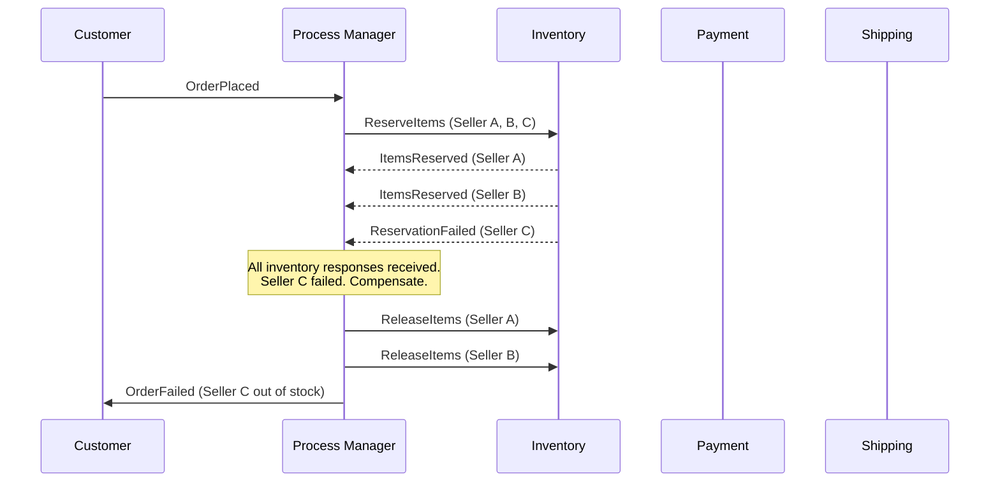
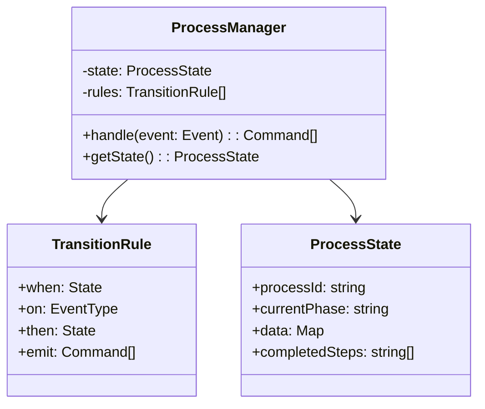

# Process Manager

## 1. The Problem

Your e-commerce platform sells products from 200 independent sellers. When a customer places an order with items from 3 different sellers, the system must:

1. Reserve inventory at Seller A, Seller B, Seller C (3 different inventory services).
2. Charge the customer's payment method.
3. Create shipping labels for each seller.
4. Notify each seller to pack their items.

This is managed by an Order Service that subscribes to events:

```typescript
// OrderService event handler — handles EVERYTHING

eventBus.on("order.placed", async (order) => {
  for (const item of order.items) {
    await inventoryService.reserve(item.sellerId, item.sku, item.qty);
  }
  await paymentService.charge(order.customerId, order.total);
  for (const item of order.items) {
    await shippingService.createLabel(item.sellerId, order.shippingAddress);
  }
  for (const item of order.items) {
    await sellerService.notifyPackItem(item.sellerId, item);
  }
});
```

The problems compound at scale:

- **Seller B's inventory service is slow** (3-second timeout). The entire order blocks. Seller A's inventory was already reserved — now what? Release it? What if Seller B comes back right after you release?
- **Payment succeeds, but Seller C has no stock.** The customer was charged $89 but can't receive 1 of 3 items. Manual refund. Angry customer. Support ticket.
- **Seller A ships, Seller B hasn't.** One order, three independent fulfillment timelines. The customer gets tracking for item 1 but not items 2 and 3. "Where's my order?" — which one?
- **The Order Service knows too much.** It's coupled to inventory, payment, shipping, and seller notification. Change any one, and the Order Service must be redeployed.

The cross-service coordination has no memory. If the Order Service crashes between step 2 and step 3, there's no record of what's been done. Payment was taken but shipping labels were never created.

---

## 2. Naïve Solutions (and Why They Fail)

### Attempt 1: Fire-and-Forget Events

Publish events and let each service figure it out:

```
order.placed → [InventoryService reserves] 
             → [PaymentService charges]
             → [ShippingService creates labels]
```

**Why it fractures:**
- Services run independently with no coordination. Payment might charge before inventory confirms availability.
- If Seller B's reservation fails, who tells PaymentService to refund? PaymentService doesn't even know about Seller B.
- Nobody tracks the overall process state. Is the order "partially fulfilled"? Nobody knows unless a human checks three systems.

### Attempt 2: Distributed Transaction (2PC)

Lock all resources across all services, then commit atomically:

```
BEGIN DISTRIBUTED TRANSACTION
  inventory_a.reserve()
  inventory_b.reserve()
  inventory_c.reserve()
  payment.charge()
COMMIT
```

**Why it doesn't work in practice:**
- 2-phase commit requires all participants to hold locks during the prepare phase. Seller B's inventory service holding a lock for 3 seconds blocks ALL other orders touching Seller B.
- Your payment provider (Stripe) doesn't participate in distributed transactions. Neither does your 3PL shipping API.
- If any participant crashes between PREPARE and COMMIT, all participants remain locked until recovery. One slow seller can freeze the entire order pipeline.

### Attempt 3: Retry Lambda

A catch-all retry function that checks what's done and does what's missing:

```typescript
async function fixOrder(orderId: string) {
  const order = await getOrder(orderId);
  if (!order.inventoryReserved) await reserveInventory(order);
  if (!order.paymentCharged)    await chargePayment(order);
  if (!order.labelsCreated)     await createLabels(order);
  if (!order.sellersNotified)   await notifySellers(order);
}
```

**Why it becomes unmaintainable:**
- Every new step adds another `if (!done) doIt()` check. With 12 steps and branching logic (partial fulfillment, seller cancellation, customer refund), this function becomes a 400-line imperative nightmare.
- No separation between "what do I do" and "what's already happened." The repair function intermixes state tracking with business logic.

---

## 3. The Insight

**Cross-service processes need a dedicated coordinator that reacts to events, maintains process state, and knows what to do next — without any service knowing about the other services. The coordinator receives events ("inventory reserved"), updates its internal state, and sends commands ("charge payment") based on transition rules. Each service stays decoupled; only the coordinator understands the full flow.**

---

## 4. The Pattern

### Process Manager

**Definition:** A stateful message-routing component that receives events from multiple services, maintains the state of a long-running process, and issues commands to services based on the current state and the received event. The Process Manager is the only component that understands the full process flow.

**Key properties:**
| Property | Description |
|---|---|
| **Stateful** | Persists which steps are complete, which are pending, and what data has been collected |
| **Reactive** | Driven by incoming events, not polling |
| **Command-issuing** | Sends commands to services ("reserve inventory"), doesn't call them directly |
| **Compensating** | Knows how to undo completed steps when later steps fail |
| **Single responsibility** | Only coordinates — no business logic |

**Guarantees:**
- Complete visibility into process state at any point.
- Deterministic next action based on current state + received event.
- Compensation of completed steps when the process must abort.

**Non-guarantees:**
- Does NOT guarantee atomicity — each step is still an independent operation.
- Does NOT remove the need for idempotent services (events/commands may be delivered more than once).
- Becomes a single point that must be highly available.

---

## 5. Mental Model

**An air traffic controller.** Each plane (service) operates independently — pilots fly their own aircraft. But the controller (Process Manager) tracks all planes on the radar, knows who's landing, who's taking off, and who's holding. When a runway clears (event: "landing complete"), the controller tells the next plane to approach (command: "cleared for landing"). Planes don't talk to each other — they only talk to the controller.

---

## 6. Structure





---

## 7. Code Example

### TypeScript

```typescript
// ========== MESSAGES ==========

interface Event {
  type: string;
  processId: string;
  data: Record<string, any>;
  timestamp: Date;
}

interface Command {
  type: string;
  processId: string;
  data: Record<string, any>;
}

// ========== PROCESS STATE ==========

interface SellerFulfillment {
  sellerId: string;
  inventoryReserved: boolean;
  paymentCaptured: boolean;
  labelCreated: boolean;
  shipped: boolean;
}

interface OrderProcessState {
  processId: string;
  orderId: string;
  phase: "reserving" | "charging" | "labeling" | "compensating" | "completed" | "failed";
  sellers: SellerFulfillment[];
  totalAmount: number;
  paymentIntentId?: string;
  failureReason?: string;
}

// ========== PROCESS MANAGER ==========

class OrderProcessManager {
  private states = new Map<string, OrderProcessState>(); // Production: database

  handle(event: Event): Command[] {
    let state = this.states.get(event.processId);

    // Initialize on first event
    if (!state && event.type === "order.placed") {
      state = this.initializeState(event);
      this.states.set(event.processId, state);
    }

    if (!state) {
      console.warn(`No process found for ${event.processId}`);
      return [];
    }

    const commands = this.route(state, event);
    this.persist(state);
    return commands;
  }

  private initializeState(event: Event): OrderProcessState {
    const { orderId, items, totalAmount } = event.data;
    const sellerIds = [...new Set<string>(items.map((i: any) => i.sellerId))];

    return {
      processId: event.processId,
      orderId,
      phase: "reserving",
      sellers: sellerIds.map((id) => ({
        sellerId: id,
        inventoryReserved: false,
        paymentCaptured: false,
        labelCreated: false,
        shipped: false,
      })),
      totalAmount,
    };
  }

  private route(state: OrderProcessState, event: Event): Command[] {
    switch (state.phase) {
      case "reserving":  return this.handleReservingPhase(state, event);
      case "charging":   return this.handleChargingPhase(state, event);
      case "labeling":   return this.handleLabelingPhase(state, event);
      case "compensating": return this.handleCompensatingPhase(state, event);
      default: return [];
    }
  }

  // ---- Phase: Reserving Inventory ----

  private handleReservingPhase(state: OrderProcessState, event: Event): Command[] {
    if (event.type === "order.placed") {
      // Send reserve commands for ALL sellers in parallel
      return state.sellers.map((s) => ({
        type: "inventory.reserve",
        processId: state.processId,
        data: { sellerId: s.sellerId, orderId: state.orderId },
      }));
    }

    if (event.type === "inventory.reserved") {
      const seller = state.sellers.find((s) => s.sellerId === event.data.sellerId);
      if (seller) seller.inventoryReserved = true;

      // Check if ALL sellers have reserved
      if (state.sellers.every((s) => s.inventoryReserved)) {
        state.phase = "charging";
        return [{
          type: "payment.charge",
          processId: state.processId,
          data: { amount: state.totalAmount, orderId: state.orderId },
        }];
      }
      return []; // Still waiting for other sellers
    }

    if (event.type === "inventory.reservation_failed") {
      state.phase = "compensating";
      state.failureReason = `Seller ${event.data.sellerId} out of stock`;

      // Release all already-reserved inventory
      return state.sellers
        .filter((s) => s.inventoryReserved)
        .map((s) => ({
          type: "inventory.release",
          processId: state.processId,
          data: { sellerId: s.sellerId, orderId: state.orderId },
        }));
    }

    return [];
  }

  // ---- Phase: Charging Payment ----

  private handleChargingPhase(state: OrderProcessState, event: Event): Command[] {
    if (event.type === "payment.charged") {
      state.paymentIntentId = event.data.paymentIntentId;
      state.phase = "labeling";

      // Create shipping labels for all sellers in parallel
      return state.sellers.map((s) => ({
        type: "shipping.create_label",
        processId: state.processId,
        data: { sellerId: s.sellerId, orderId: state.orderId },
      }));
    }

    if (event.type === "payment.failed") {
      state.phase = "compensating";
      state.failureReason = "Payment failed";

      // Release ALL reserved inventory
      return state.sellers.map((s) => ({
        type: "inventory.release",
        processId: state.processId,
        data: { sellerId: s.sellerId, orderId: state.orderId },
      }));
    }

    return [];
  }

  // ---- Phase: Creating Labels ----

  private handleLabelingPhase(state: OrderProcessState, event: Event): Command[] {
    if (event.type === "shipping.label_created") {
      const seller = state.sellers.find((s) => s.sellerId === event.data.sellerId);
      if (seller) seller.labelCreated = true;

      if (state.sellers.every((s) => s.labelCreated)) {
        state.phase = "completed";
        return [
          {
            type: "notification.order_confirmed",
            processId: state.processId,
            data: { orderId: state.orderId },
          },
          ...state.sellers.map((s) => ({
            type: "seller.notify_pack",
            processId: state.processId,
            data: { sellerId: s.sellerId, orderId: state.orderId },
          })),
        ];
      }
    }
    return [];
  }

  // ---- Phase: Compensating ----

  private handleCompensatingPhase(state: OrderProcessState, event: Event): Command[] {
    if (event.type === "inventory.released") {
      const seller = state.sellers.find((s) => s.sellerId === event.data.sellerId);
      if (seller) seller.inventoryReserved = false;

      const allReleased = state.sellers.every((s) => !s.inventoryReserved);
      if (allReleased) {
        const commands: Command[] = [{
          type: "notification.order_failed",
          processId: state.processId,
          data: { orderId: state.orderId, reason: state.failureReason },
        }];

        // Refund if payment was taken
        if (state.paymentIntentId) {
          commands.push({
            type: "payment.refund",
            processId: state.processId,
            data: { paymentIntentId: state.paymentIntentId },
          });
        }

        state.phase = "failed";
        return commands;
      }
    }
    return [];
  }

  getState(processId: string): OrderProcessState | undefined {
    return this.states.get(processId);
  }

  private persist(state: OrderProcessState): void {
    // In production: save to database
    this.states.set(state.processId, state);
  }
}

// ========== USAGE ==========

const pm = new OrderProcessManager();

// 1. Order placed
const cmds1 = pm.handle({
  type: "order.placed",
  processId: "proc-001",
  data: {
    orderId: "ORD-555",
    items: [
      { sellerId: "seller-a", sku: "WIDGET-1", qty: 2 },
      { sellerId: "seller-b", sku: "GADGET-3", qty: 1 },
    ],
    totalAmount: 89_00,
  },
  timestamp: new Date(),
});
console.log("Commands:", cmds1.map((c) => c.type));
// → ["inventory.reserve", "inventory.reserve"]

// 2. Seller A reserves successfully
const cmds2 = pm.handle({
  type: "inventory.reserved",
  processId: "proc-001",
  data: { sellerId: "seller-a" },
  timestamp: new Date(),
});
// → []  (still waiting for seller-b)

// 3. Seller B reserves successfully
const cmds3 = pm.handle({
  type: "inventory.reserved",
  processId: "proc-001",
  data: { sellerId: "seller-b" },
  timestamp: new Date(),
});
// → ["payment.charge"]  (all reserved, move to charging)

// 4. Payment succeeds
const cmds4 = pm.handle({
  type: "payment.charged",
  processId: "proc-001",
  data: { paymentIntentId: "pi_abc123" },
  timestamp: new Date(),
});
// → ["shipping.create_label", "shipping.create_label"]
```

### Go

```go
package main

import (
	"fmt"
	"time"
)

// ========== MESSAGES ==========

type Event struct {
	Type      string
	ProcessID string
	Data      map[string]any
	Timestamp time.Time
}

type Command struct {
	Type      string
	ProcessID string
	Data      map[string]any
}

// ========== PROCESS STATE ==========

type Phase string

const (
	Reserving    Phase = "reserving"
	Charging     Phase = "charging"
	Labeling     Phase = "labeling"
	Compensating Phase = "compensating"
	PCompleted   Phase = "completed"
	PFailed      Phase = "failed"
)

type SellerState struct {
	SellerID  string
	Reserved  bool
	Labeled   bool
}

type OrderProcess struct {
	ProcessID     string
	OrderID       string
	Phase         Phase
	Sellers       []SellerState
	TotalAmount   int
	PaymentIntent string
	FailureReason string
}

// ========== PROCESS MANAGER ==========

type ProcessManager struct {
	states map[string]*OrderProcess
}

func NewProcessManager() *ProcessManager {
	return &ProcessManager{states: make(map[string]*OrderProcess)}
}

func (pm *ProcessManager) Handle(evt Event) []Command {
	state, exists := pm.states[evt.ProcessID]

	if !exists && evt.Type == "order.placed" {
		state = pm.initialize(evt)
		pm.states[evt.ProcessID] = state
	}
	if state == nil {
		return nil
	}

	cmds := pm.route(state, evt)
	return cmds
}

func (pm *ProcessManager) initialize(evt Event) *OrderProcess {
	items := evt.Data["items"].([]map[string]any)
	seen := map[string]bool{}
	var sellers []SellerState
	for _, item := range items {
		sid := item["sellerId"].(string)
		if !seen[sid] {
			sellers = append(sellers, SellerState{SellerID: sid})
			seen[sid] = true
		}
	}
	return &OrderProcess{
		ProcessID:   evt.ProcessID,
		OrderID:     evt.Data["orderId"].(string),
		Phase:       Reserving,
		Sellers:     sellers,
		TotalAmount: evt.Data["totalAmount"].(int),
	}
}

func (pm *ProcessManager) route(s *OrderProcess, evt Event) []Command {
	switch s.Phase {
	case Reserving:
		return pm.onReserving(s, evt)
	case Charging:
		return pm.onCharging(s, evt)
	case Labeling:
		return pm.onLabeling(s, evt)
	case Compensating:
		return pm.onCompensating(s, evt)
	default:
		return nil
	}
}

func (pm *ProcessManager) onReserving(s *OrderProcess, evt Event) []Command {
	switch evt.Type {
	case "order.placed":
		cmds := make([]Command, len(s.Sellers))
		for i, sel := range s.Sellers {
			cmds[i] = Command{
				Type: "inventory.reserve", ProcessID: s.ProcessID,
				Data: map[string]any{"sellerId": sel.SellerID, "orderId": s.OrderID},
			}
		}
		return cmds

	case "inventory.reserved":
		sid := evt.Data["sellerId"].(string)
		for i := range s.Sellers {
			if s.Sellers[i].SellerID == sid {
				s.Sellers[i].Reserved = true
			}
		}
		allReserved := true
		for _, sel := range s.Sellers {
			if !sel.Reserved { allReserved = false; break }
		}
		if allReserved {
			s.Phase = Charging
			return []Command{{
				Type: "payment.charge", ProcessID: s.ProcessID,
				Data: map[string]any{"amount": s.TotalAmount, "orderId": s.OrderID},
			}}
		}
		return nil

	case "inventory.reservation_failed":
		s.Phase = Compensating
		s.FailureReason = fmt.Sprintf("Seller %s out of stock", evt.Data["sellerId"])
		var cmds []Command
		for _, sel := range s.Sellers {
			if sel.Reserved {
				cmds = append(cmds, Command{
					Type: "inventory.release", ProcessID: s.ProcessID,
					Data: map[string]any{"sellerId": sel.SellerID, "orderId": s.OrderID},
				})
			}
		}
		return cmds
	}
	return nil
}

func (pm *ProcessManager) onCharging(s *OrderProcess, evt Event) []Command {
	switch evt.Type {
	case "payment.charged":
		s.PaymentIntent = evt.Data["paymentIntentId"].(string)
		s.Phase = Labeling
		cmds := make([]Command, len(s.Sellers))
		for i, sel := range s.Sellers {
			cmds[i] = Command{
				Type: "shipping.create_label", ProcessID: s.ProcessID,
				Data: map[string]any{"sellerId": sel.SellerID},
			}
		}
		return cmds

	case "payment.failed":
		s.Phase = Compensating
		s.FailureReason = "Payment failed"
		cmds := make([]Command, len(s.Sellers))
		for i, sel := range s.Sellers {
			cmds[i] = Command{
				Type: "inventory.release", ProcessID: s.ProcessID,
				Data: map[string]any{"sellerId": sel.SellerID},
			}
		}
		return cmds
	}
	return nil
}

func (pm *ProcessManager) onLabeling(s *OrderProcess, evt Event) []Command {
	if evt.Type == "shipping.label_created" {
		sid := evt.Data["sellerId"].(string)
		for i := range s.Sellers {
			if s.Sellers[i].SellerID == sid {
				s.Sellers[i].Labeled = true
			}
		}
		allLabeled := true
		for _, sel := range s.Sellers {
			if !sel.Labeled { allLabeled = false; break }
		}
		if allLabeled {
			s.Phase = PCompleted
			return []Command{{
				Type: "notification.order_confirmed", ProcessID: s.ProcessID,
				Data: map[string]any{"orderId": s.OrderID},
			}}
		}
	}
	return nil
}

func (pm *ProcessManager) onCompensating(s *OrderProcess, evt Event) []Command {
	if evt.Type == "inventory.released" {
		sid := evt.Data["sellerId"].(string)
		for i := range s.Sellers {
			if s.Sellers[i].SellerID == sid {
				s.Sellers[i].Reserved = false
			}
		}
		allReleased := true
		for _, sel := range s.Sellers {
			if sel.Reserved { allReleased = false; break }
		}
		if allReleased {
			s.Phase = PFailed
			cmds := []Command{{
				Type: "notification.order_failed", ProcessID: s.ProcessID,
				Data: map[string]any{"orderId": s.OrderID, "reason": s.FailureReason},
			}}
			if s.PaymentIntent != "" {
				cmds = append(cmds, Command{
					Type: "payment.refund", ProcessID: s.ProcessID,
					Data: map[string]any{"paymentIntentId": s.PaymentIntent},
				})
			}
			return cmds
		}
	}
	return nil
}

func main() {
	pm := NewProcessManager()

	cmds := pm.Handle(Event{
		Type: "order.placed", ProcessID: "proc-001",
		Data: map[string]any{
			"orderId":     "ORD-555",
			"totalAmount": 8900,
			"items": []map[string]any{
				{"sellerId": "seller-a", "sku": "WIDGET-1"},
				{"sellerId": "seller-b", "sku": "GADGET-3"},
			},
		},
		Timestamp: time.Now(),
	})
	for _, c := range cmds {
		fmt.Printf("→ %s (%v)\n", c.Type, c.Data)
	}
	// → inventory.reserve (seller-a)
	// → inventory.reserve (seller-b)
}
```

---

## 8. Gotchas & Beginner Mistakes

| Mistake | Why It Hurts |
|---|---|
| **Putting business logic in the Process Manager** | The PM validates order totals, checks seller ratings, applies discounts. Now it's coupled to everything. The PM should only coordinate — delegate business decisions to the services. |
| **No timeout for pending phases** | Seller B never responds to the reserve command. The process hangs forever in "reserving" phase. Add deadline timers that move the process to compensation after N minutes. |
| **Not persisting state after each event** | The PM crashes between updating state and emitting commands. On restart, it re-processes the event and emits duplicate commands. Persist state and outgoing commands atomically. |
| **Forgetting compensation for early steps** | Payment succeeds but labeling fails. The PM aborts but never refunds the payment. Every successful step needs a corresponding compensation command. |
| **Single-threaded event processing** | All processes are handled by one event handler. 1,000 concurrent orders compete for CPU. Use partitioned event processing — partition by processId so each instance handles distinct processes. |

---

## 9. Related & Confusable Patterns

| Pattern | How It Differs |
|---|---|
| **Saga** | A saga is a specific type of process — a sequence of steps with compensating actions. A Process Manager is the component that executes sagas, but it can also handle non-compensatable processes, conditional branching, and parallel coordination. |
| **Workflow Engine** | A workflow engine defines steps declaratively (graph of tasks). A Process Manager reacts to events and issues commands. Workflow engines are often more general-purpose; Process Managers are tailored to a specific business process. |
| **Choreography** | No central coordinator — services react to each other's events. Process Manager is the opposite: a central coordinator that routes all messages. Trade-off: visibility vs. autonomy. |
| **State Machine** | A state machine models transitions of ONE entity. A Process Manager tracks a PROCESS that spans multiple entities and services. The PM may use a state machine internally. |
| **Mediator (GoF)** | The Mediator pattern from object-oriented design. Process Manager is the distributed-systems equivalent — a mediator between services communicating through messages. |

---

## 10. When This Pattern Is the WRONG Choice

- **Single-service operations** — If all steps are within one service and one database, use a local transaction or a simple state machine. The overhead of messages, event persistence, and compensation logic is unnecessary.
- **Highly dynamic processes** — If the step sequence changes daily (A/B testing different onboarding flows), a declarative workflow engine with a UI is better than coded Process Manager classes.
- **Fire-and-forget events with no coordination** — If services truly are independent (logging, analytics), choreography is simpler. Process Managers add value when services must coordinate.

**Symptoms you should reconsider:**
- The Process Manager handles 50+ event types and has become the biggest, most frequently changed service. You've centralized too much — split into multiple smaller Process Managers, one per domain process.
- Every service change requires a corresponding Process Manager update. You haven't truly decoupled — the PM is acting as an orchestrating god service.
- The compensation logic is more complex than the happy path. Consider whether eventual consistency with manual intervention is acceptable for rare failure cases.

**How to back out:** Extract the core event-reaction logic into individual event handlers (choreography). Use a shared database view or dashboard to recover end-to-end visibility. For compensation, implement a reconciliation job that periodically checks for inconsistencies.
