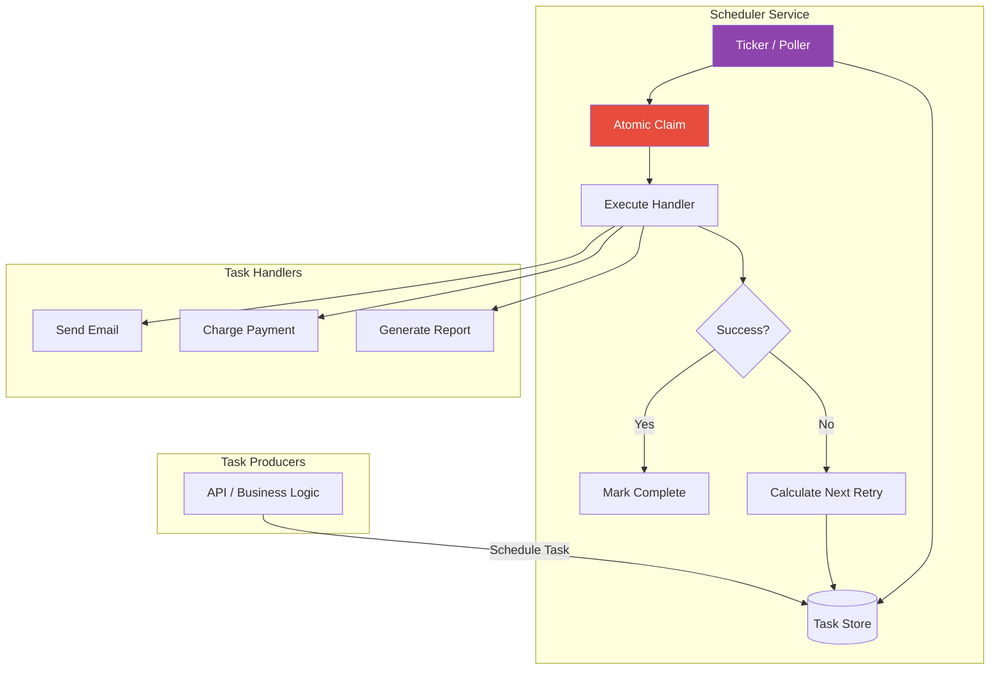

# Scheduler

## 1. The Problem

Your SaaS platform has dozens of time-based tasks:

- **Trial expirations:** "Send warning email 3 days before trial ends. Disable account on expiration day."
- **Subscription renewals:** "Charge customer on the 1st of every month."
- **Report generation:** "Run analytics report every Monday at 6 AM UTC."
- **Webhook retries:** "If delivery fails, retry in 1 minute, then 5 minutes, then 30 minutes."
- **Scheduled promotions:** "Start Black Friday sale at midnight EST on November 29."

Currently these are implemented as cron jobs:

```
# crontab
0 * * * *  node /app/scripts/check-trial-expirations.js
0 0 1 * *  node /app/scripts/charge-subscriptions.js
0 6 * * 1  node /app/scripts/generate-reports.js
* * * * *  node /app/scripts/retry-failed-webhooks.js
```

The problems:

- **Cron has no state.** If the trial expiration script crashes halfway through processing 500 accounts, it has no record of which accounts were processed. On the next run, it re-processes all 500 — sending duplicate emails to the first 250.
- **No visibility.** "Did the subscription renewal run last night?" Check the server logs. "Which customers were charged?" Grep through log files. There's no dashboard, no status tracking.
- **Scaling breaks cron.** You scale to 3 app servers. Now each cron job runs on ALL 3 servers simultaneously. Three copies of `charge-subscriptions.js` charge the same customer 3 times.
- **No dynamic scheduling.** A customer signs up on March 15 with a 14-day trial. You need to schedule a task for March 29. Cron doesn't support "run this once on March 29 for customer X." You'd need a polling loop: every hour, query all customers for approaching trial expiry.
- **Retry is ad-hoc.** The webhook retry script runs every minute, queries ALL failed webhooks, and retries them. With 10,000 failed webhooks (some from weeks ago), every minute it attempts 10,000 requests — most of which are dead endpoints.

```typescript
// The polling-everything approach
setInterval(async () => {
  const expiring = await db.query(
    "SELECT * FROM trials WHERE expires_at < NOW() + INTERVAL '3 days'"
  );
  for (const trial of expiring) {
    await sendExpirationWarning(trial); // Idempotent? Who knows.
  }
}, 60 * 60 * 1000); // Every hour
```

---

## 2. Naïve Solutions (and Why They Fail)

### Attempt 1: `setTimeout` / `setInterval`

```typescript
// Schedule trial expiration
setTimeout(() => {
  disableAccount(customerId);
}, trialEndDate - Date.now());
```

**Why it's volatile:**
- If the server restarts, all scheduled timeouts are lost. The customer's trial never expires.
- At 100K active trials, that's 100K in-memory timers. Memory usage grows linearly with scheduled work.
- No way to cancel or modify a scheduled task ("customer upgraded to paid — cancel the trial expiration").

### Attempt 2: Database Polling

```typescript
// Every minute, scan for due tasks
setInterval(async () => {
  const tasks = await db.query(
    "SELECT * FROM scheduled_tasks WHERE due_at <= NOW() AND status = 'pending'"
  );
  for (const task of tasks) {
    await executeTask(task);
    await db.update(task.id, { status: "completed" });
  }
}, 60_000);
```

**Why it's wasteful and racy:**
- Polling every minute means tasks can be delayed up to 59 seconds. For webhook retries that need sub-second precision, this is too coarse.
- Two worker instances both query at the same time. Both get the same 50 tasks. Both execute them. You get double-charging, double-emails.
- As the task table grows (millions of past tasks), the query `WHERE due_at <= NOW()` scans an increasingly large table, even with indexes on `due_at`.

### Attempt 3: Distributed Cron (Kubernetes CronJob)

```yaml
apiVersion: batch/v1
kind: CronJob
metadata:
  name: charge-subscriptions
spec:
  schedule: "0 0 1 * *"
  jobTemplate:
    spec:
      template:
        spec:
          containers:
          - name: charger
            image: my-app:latest
            command: ["node", "scripts/charge-subscriptions.js"]
```

**Why it's insufficient for dynamic scheduling:**
- CronJobs are statically defined. You can't dynamically create "charge customer X on March 15" from application code. You'd need to create Kubernetes resources at runtime.
- CronJobs run at-least-once — if the job takes longer than the interval, two instances overlap. Built-in `concurrencyPolicy: Forbid` prevents overlap but drops the second invocation entirely.
- No built-in retry with backoff, no dead-letter for failed tasks, no task chaining.

---

## 3. The Insight

**Treat scheduled work as durable, first-class entities — not timers or cron expressions. Each task is a persistent record with a due time, payload, retry policy, and status. A scheduler service owns the clock — it watches for due tasks, claims them atomically (preventing duplicates), executes them, and handles retries with backoff. Tasks can be created, modified, and cancelled through an API.**

---

## 4. The Pattern

### Scheduler

**Definition:** A system that accepts tasks scheduled for future execution (one-time or recurring), persists them durably, and executes them at the specified time. The scheduler handles concurrent workers (at-most-once claiming), retry with backoff on failure, and provides visibility into task history and status.

**Key capabilities:**
| Capability | Description |
|---|---|
| **Deferred execution** | Run a task at a specific future timestamp |
| **Recurring tasks** | Run a task on a schedule (every hour, every Monday) |
| **At-most-once claiming** | Only one worker executes a task, even with N workers |
| **Retry with backoff** | Failed tasks are retried with configurable delays |
| **Cancellation** | Tasks can be cancelled before execution |
| **Visibility** | Dashboard showing pending, running, completed, failed tasks |

**Guarantees:**
- Tasks are executed at-least-once (with proper retry, a task will eventually run if the handler succeeds).
- Tasks survive server restarts (persistent storage).
- Duplicate execution is minimized (atomic claiming).

**Non-guarantees:**
- Exact-time execution — the scheduler checks for due tasks periodically (e.g., every second), so tasks may execute 0-N seconds late.
- Exactly-once execution — at-most-once claiming prevents most duplicates, but network partitions can cause rare double-execution. Task handlers should be idempotent.
- Ordering — two tasks due at the same time may execute in any order.

---

## 5. Mental Model

**An alarm clock with a snooze button and a logbook.** You set alarms (schedule tasks) for specific times. When the alarm goes off, you perform the action. If you can't complete it (failure), you hit snooze (retry with backoff). Every alarm and its outcome is recorded in a logbook (audit trail). You can cancel future alarms. Multiple people sharing the alarm clock (distributed workers) can't both respond to the same alarm — one person acknowledges it, and the alarm stops for everyone else.

---

## 6. Structure



---

## 7. Code Example

### TypeScript

```typescript
// ========== TASK DEFINITION ==========

type TaskStatus = "pending" | "claimed" | "running" | "completed" | "failed" | "cancelled";

interface ScheduledTask {
  id: string;
  type: string;
  payload: Record<string, any>;
  dueAt: Date;
  status: TaskStatus;
  retries: number;
  maxRetries: number;
  lastError?: string;
  claimedBy?: string;
  createdAt: Date;
  completedAt?: Date;
  // For recurring tasks
  cronExpression?: string;
}

interface TaskHandler {
  (payload: Record<string, any>): Promise<void>;
}

// ========== SCHEDULER ==========

class Scheduler {
  private tasks = new Map<string, ScheduledTask>();
  private handlers = new Map<string, TaskHandler>();
  private workerId: string;
  private tickInterval?: ReturnType<typeof setInterval>;

  constructor(workerId: string) {
    this.workerId = workerId;
  }

  // ---- Register task handlers ----

  registerHandler(taskType: string, handler: TaskHandler): void {
    this.handlers.set(taskType, handler);
  }

  // ---- Schedule tasks ----

  scheduleOnce(
    type: string,
    payload: Record<string, any>,
    dueAt: Date,
    maxRetries = 3
  ): string {
    const id = `task-${Date.now()}-${Math.random().toString(36).slice(2, 8)}`;
    const task: ScheduledTask = {
      id,
      type,
      payload,
      dueAt,
      status: "pending",
      retries: 0,
      maxRetries,
      createdAt: new Date(),
    };
    this.tasks.set(id, task);
    console.log(`[Scheduler] Scheduled "${type}" for ${dueAt.toISOString()} (${id})`);
    return id;
  }

  scheduleRecurring(
    type: string,
    payload: Record<string, any>,
    cronExpression: string,
    firstDue: Date
  ): string {
    const id = `task-${Date.now()}-${Math.random().toString(36).slice(2, 8)}`;
    const task: ScheduledTask = {
      id,
      type,
      payload,
      dueAt: firstDue,
      status: "pending",
      retries: 0,
      maxRetries: 3,
      cronExpression,
      createdAt: new Date(),
    };
    this.tasks.set(id, task);
    console.log(`[Scheduler] Recurring "${type}" (${cronExpression}), first: ${firstDue.toISOString()}`);
    return id;
  }

  scheduleWithDelay(type: string, payload: Record<string, any>, delayMs: number): string {
    return this.scheduleOnce(type, payload, new Date(Date.now() + delayMs));
  }

  // ---- Cancel ----

  cancel(taskId: string): boolean {
    const task = this.tasks.get(taskId);
    if (!task || task.status !== "pending") return false;
    task.status = "cancelled";
    console.log(`[Scheduler] Cancelled ${taskId}`);
    return true;
  }

  // ---- Core loop ----

  start(intervalMs = 1000): void {
    console.log(`[Scheduler] Worker ${this.workerId} started (interval: ${intervalMs}ms)`);
    this.tickInterval = setInterval(() => this.tick(), intervalMs);
  }

  stop(): void {
    if (this.tickInterval) clearInterval(this.tickInterval);
    console.log(`[Scheduler] Worker ${this.workerId} stopped`);
  }

  private async tick(): Promise<void> {
    const now = new Date();
    const dueTasks = this.getDueTasks(now);

    for (const task of dueTasks) {
      // Atomic claim — in production, use FOR UPDATE SKIP LOCKED
      if (!this.claim(task)) continue;
      await this.execute(task);
    }
  }

  private getDueTasks(now: Date): ScheduledTask[] {
    return [...this.tasks.values()]
      .filter((t) => t.status === "pending" && t.dueAt <= now)
      .sort((a, b) => a.dueAt.getTime() - b.dueAt.getTime());
  }

  private claim(task: ScheduledTask): boolean {
    // In production: UPDATE tasks SET status='claimed', claimed_by=?
    // WHERE id=? AND status='pending'
    // (atomic compare-and-swap)
    if (task.status !== "pending") return false;
    task.status = "claimed";
    task.claimedBy = this.workerId;
    return true;
  }

  private async execute(task: ScheduledTask): Promise<void> {
    const handler = this.handlers.get(task.type);
    if (!handler) {
      console.error(`[Scheduler] No handler for type "${task.type}"`);
      task.status = "failed";
      task.lastError = "No handler registered";
      return;
    }

    task.status = "running";
    console.log(`[Scheduler] Executing ${task.id} (${task.type})`);

    try {
      await handler(task.payload);

      task.status = "completed";
      task.completedAt = new Date();
      console.log(`[Scheduler] ✓ ${task.id} completed`);

      // If recurring, schedule next occurrence
      if (task.cronExpression) {
        this.scheduleNextOccurrence(task);
      }
    } catch (err: any) {
      task.retries++;
      task.lastError = err.message;

      if (task.retries < task.maxRetries) {
        // Exponential backoff: 1s, 4s, 16s, 64s...
        const backoffMs = Math.pow(4, task.retries) * 1000;
        task.dueAt = new Date(Date.now() + backoffMs);
        task.status = "pending";
        console.log(`[Scheduler] ↻ ${task.id} retry ${task.retries} in ${backoffMs}ms`);
      } else {
        task.status = "failed";
        console.log(`[Scheduler] ✗ ${task.id} failed permanently: ${err.message}`);
      }
    }
  }

  private scheduleNextOccurrence(task: ScheduledTask): void {
    // Simplified: add 1 hour for "0 * * * *" style cron
    // In production: use a cron expression parser (e.g., cron-parser)
    const nextDue = new Date(task.dueAt.getTime() + 60 * 60 * 1000);
    this.scheduleOnce(task.type, task.payload, nextDue, task.maxRetries);
  }

  // ---- Visibility ----

  getStatus(taskId: string): ScheduledTask | undefined {
    return this.tasks.get(taskId);
  }

  getPending(): ScheduledTask[] {
    return [...this.tasks.values()].filter((t) => t.status === "pending");
  }

  getFailed(): ScheduledTask[] {
    return [...this.tasks.values()].filter((t) => t.status === "failed");
  }
}

// ========== USAGE ==========

const scheduler = new Scheduler("worker-1");

// Register handlers
scheduler.registerHandler("send_trial_warning", async (payload) => {
  console.log(`  📧 Sending trial warning to ${payload.email}`);
  // await emailService.send(payload.email, "trial-warning", payload);
});

scheduler.registerHandler("charge_subscription", async (payload) => {
  console.log(`  💳 Charging ${payload.customerId} $${payload.amount}`);
  // await paymentService.charge(payload.customerId, payload.amount);
});

scheduler.registerHandler("retry_webhook", async (payload) => {
  console.log(`  🔁 Retrying webhook to ${payload.url}`);
  const response = await fetch(payload.url, {
    method: "POST",
    body: JSON.stringify(payload.body),
    headers: { "Content-Type": "application/json" },
  });
  if (!response.ok) throw new Error(`HTTP ${response.status}`);
});

// Schedule tasks
scheduler.scheduleOnce(
  "send_trial_warning",
  { email: "alice@example.com", customerId: "cust-1", trialEndsAt: "2025-03-01" },
  new Date("2025-02-26")  // 3 days before trial end
);

scheduler.scheduleOnce(
  "charge_subscription",
  { customerId: "cust-2", amount: 49.99 },
  new Date("2025-03-01")
);

// Webhook retry with backoff — due in 1 minute
scheduler.scheduleWithDelay(
  "retry_webhook",
  { url: "https://partner.com/webhook", body: { event: "order.created" } },
  60_000
);

// Start processing
scheduler.start(1000); // Check every second
```

### Go

```go
package main

import (
	"fmt"
	"math"
	"sync"
	"time"
)

// ========== TYPES ==========

type TaskStatus string

const (
	TaskPending   TaskStatus = "pending"
	TaskClaimed   TaskStatus = "claimed"
	TaskRunning   TaskStatus = "running"
	TaskCompleted TaskStatus = "completed"
	TaskFailed    TaskStatus = "failed"
)

type Task struct {
	ID         string
	Type       string
	Payload    map[string]any
	DueAt      time.Time
	Status     TaskStatus
	Retries    int
	MaxRetries int
	LastError  string
	CreatedAt  time.Time
}

type TaskHandler func(payload map[string]any) error

// ========== SCHEDULER ==========

type Scheduler struct {
	mu       sync.Mutex
	tasks    map[string]*Task
	handlers map[string]TaskHandler
	workerID string
	stopCh   chan struct{}
}

func NewScheduler(workerID string) *Scheduler {
	return &Scheduler{
		tasks:    make(map[string]*Task),
		handlers: make(map[string]TaskHandler),
		workerID: workerID,
		stopCh:   make(chan struct{}),
	}
}

func (s *Scheduler) RegisterHandler(taskType string, handler TaskHandler) {
	s.handlers[taskType] = handler
}

func (s *Scheduler) Schedule(taskType string, payload map[string]any, dueAt time.Time) string {
	s.mu.Lock()
	defer s.mu.Unlock()

	id := fmt.Sprintf("task-%d", time.Now().UnixNano())
	s.tasks[id] = &Task{
		ID: id, Type: taskType, Payload: payload,
		DueAt: dueAt, Status: TaskPending,
		MaxRetries: 3, CreatedAt: time.Now(),
	}
	fmt.Printf("[Scheduler] Scheduled %s (%s) for %s\n", taskType, id, dueAt.Format(time.RFC3339))
	return id
}

func (s *Scheduler) ScheduleDelay(taskType string, payload map[string]any, delay time.Duration) string {
	return s.Schedule(taskType, payload, time.Now().Add(delay))
}

func (s *Scheduler) Cancel(taskID string) bool {
	s.mu.Lock()
	defer s.mu.Unlock()
	task, ok := s.tasks[taskID]
	if !ok || task.Status != TaskPending {
		return false
	}
	task.Status = "cancelled"
	return true
}

func (s *Scheduler) Start(interval time.Duration) {
	fmt.Printf("[Scheduler] Worker %s started\n", s.workerID)
	ticker := time.NewTicker(interval)
	defer ticker.Stop()

	for {
		select {
		case <-ticker.C:
			s.tick()
		case <-s.stopCh:
			return
		}
	}
}

func (s *Scheduler) Stop() {
	close(s.stopCh)
}

func (s *Scheduler) tick() {
	s.mu.Lock()
	now := time.Now()
	var due []*Task
	for _, t := range s.tasks {
		if t.Status == TaskPending && !t.DueAt.After(now) {
			due = append(due, t)
		}
	}
	s.mu.Unlock()

	for _, task := range due {
		s.mu.Lock()
		if task.Status != TaskPending {
			s.mu.Unlock()
			continue
		}
		task.Status = TaskClaimed
		s.mu.Unlock()

		s.execute(task)
	}
}

func (s *Scheduler) execute(task *Task) {
	handler, ok := s.handlers[task.Type]
	if !ok {
		s.mu.Lock()
		task.Status = TaskFailed
		task.LastError = "no handler"
		s.mu.Unlock()
		return
	}

	s.mu.Lock()
	task.Status = TaskRunning
	s.mu.Unlock()

	fmt.Printf("[Scheduler] ▶ %s (%s)\n", task.Type, task.ID)
	err := handler(task.Payload)

	s.mu.Lock()
	defer s.mu.Unlock()

	if err != nil {
		task.Retries++
		task.LastError = err.Error()
		if task.Retries < task.MaxRetries {
			backoff := time.Duration(math.Pow(4, float64(task.Retries))) * time.Second
			task.DueAt = time.Now().Add(backoff)
			task.Status = TaskPending
			fmt.Printf("[Scheduler] ↻ %s retry %d in %s\n", task.ID, task.Retries, backoff)
		} else {
			task.Status = TaskFailed
			fmt.Printf("[Scheduler] ✗ %s failed: %s\n", task.ID, err)
		}
	} else {
		task.Status = TaskCompleted
		fmt.Printf("[Scheduler] ✓ %s completed\n", task.ID)
	}
}

func main() {
	sched := NewScheduler("worker-1")

	sched.RegisterHandler("trial_warning", func(p map[string]any) error {
		fmt.Printf("  📧 Trial warning to %s\n", p["email"])
		return nil
	})

	sched.RegisterHandler("charge", func(p map[string]any) error {
		fmt.Printf("  💳 Charging %s $%.2f\n", p["customerId"], p["amount"])
		return nil
	})

	// Schedule tasks
	sched.Schedule("trial_warning",
		map[string]any{"email": "alice@example.com"},
		time.Now().Add(2*time.Second),
	)

	sched.Schedule("charge",
		map[string]any{"customerId": "cust-1", "amount": 49.99},
		time.Now().Add(3*time.Second),
	)

	// Run for 5 seconds then stop
	go func() {
		time.Sleep(5 * time.Second)
		sched.Stop()
	}()

	sched.Start(500 * time.Millisecond)
}
```

---

## 8. Gotchas & Beginner Mistakes

| Mistake | Why It Hurts |
|---|---|
| **Non-idempotent handlers** | The scheduler retries a `charge_subscription` handler. The customer is charged twice. Every handler must check if the work was already done (e.g., check payment status before charging). |
| **No claiming mechanism** | Two workers both pick up the same task. Use `SELECT FOR UPDATE SKIP LOCKED` in PostgreSQL, or `SETNX` in Redis, to ensure atomic claiming. |
| **Unbounded retry** | A broken webhook endpoint is retried forever. Set `maxRetries` and move permanently failed tasks to a dead-letter queue for manual inspection. |
| **Clock skew across workers** | Worker A's clock is 2 seconds ahead of Worker B's. Worker A claims tasks before they're "really" due. Use NTP synchronization and design for small clock drift tolerance. |
| **Polling too frequently** | Polling the task table every 100ms generates 10 queries/second per worker. With 5 workers, that's 50 queries/second on the task table. Use reasonable intervals (1-5 seconds) and batch claiming. |

---

## 9. Related & Confusable Patterns

| Pattern | How It Differs |
|---|---|
| **Cron** | OS-level periodic execution. No persistence, no retry, no dynamic scheduling, no multi-instance coordination. A scheduler is a durable, application-level cron with all the missing features. |
| **Message Queue with Delay** | RabbitMQ delayed messages or SQS delay queues can defer processing. Scheduler provides more control: cancellation, status visibility, recurring schedules. Use delayed messages for simple one-shot delays. |
| **Workflow Engine** | Executes multi-step processes. A scheduler executes individual tasks at specific times. A workflow engine might use a scheduler internally to handle step timeouts and deadlines. |
| **Event-Driven Timer** | Timer events (e.g., Temporal's `workflow.Sleep()`) are embedded in workflow frameworks. A scheduler is standalone — not tied to a specific workflow runtime. |
| **Job Queue** | Processes tasks as fast as possible (FIFO). A scheduler processes tasks at a specific FUTURE TIME. Job queues focus on throughput; schedulers focus on timing. |

---

## 10. When This Pattern Is the WRONG Choice

- **Real-time processing** — If tasks must execute within milliseconds of being created, use a message queue + worker pool, not a polling scheduler. Schedulers have inherent latency (up to 1 polling interval).
- **Simple periodic batch jobs** — If you have 3 cron jobs that run once a day and never fail, the operational overhead of a scheduler service (database, monitoring, API) isn't justified. Kubernetes CronJob is simpler.
- **Sub-second scheduling precision** — Schedulers poll at intervals (typically 1-5 seconds). If you need microsecond-precision execution, use OS-level timers or hardware interrupts, not a polling scheduler.

**Symptoms you should reconsider:**
- The scheduler is processing 10,000 tasks per second. It's become a real-time processing system, not a futured task system. Use a proper message queue (Kafka, SQS) for high-throughput work.
- Every task has `maxRetries: 1000` and retry delays of 100ms. You're using the scheduler as a retry mechanism when you should fix the underlying reliability issue.
- The task table has 50 million rows and queries are slow. Archive completed tasks aggressively, or use a dedicated time-series database for task storage.

**How to back out:** Replace one-time scheduled tasks with delayed messages (SQS delay, RabbitMQ TTL). Replace recurring tasks with Kubernetes CronJobs. Replace retry logic with message queue dead-letter handling.
