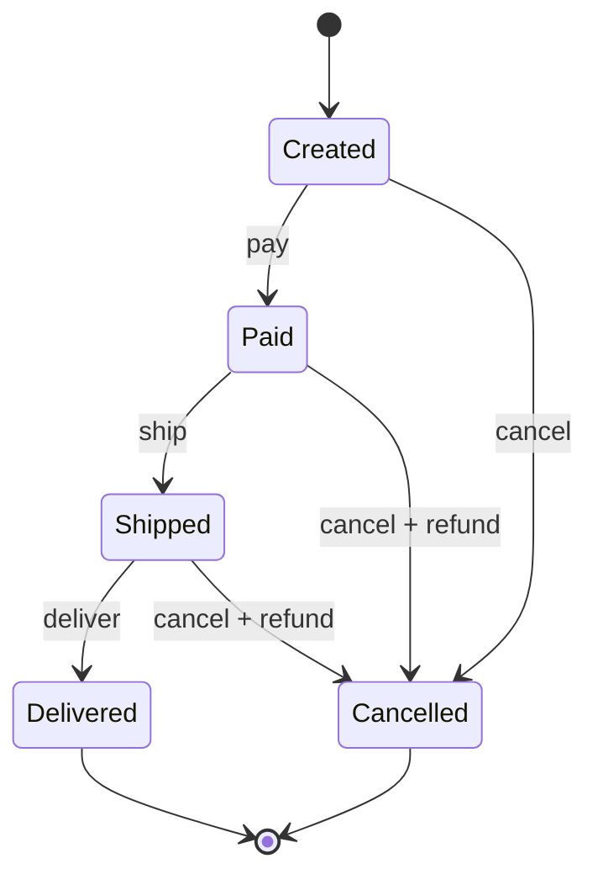

# State Machine

## 1. The Problem

You're building an order management system. An order goes through several stages: created, payment pending, paid, shipped, delivered, or cancelled. Each stage determines what actions are allowed.

Your first implementation uses boolean flags:

```typescript
class Order {
  isPaid = false;
  isShipped = false;
  isDelivered = false;
  isCancelled = false;
  isRefunded = false;

  ship() {
    if (!this.isPaid) throw new Error("Can't ship unpaid order");
    if (this.isCancelled) throw new Error("Order is cancelled");
    if (this.isShipped) throw new Error("Already shipped");
    this.isShipped = true;
  }

  cancel() {
    if (this.isDelivered) throw new Error("Can't cancel delivered order");
    if (this.isCancelled) throw new Error("Already cancelled");
    this.isCancelled = true;
    if (this.isPaid) this.isRefunded = true;
  }

  refund() {
    if (!this.isPaid) throw new Error("Nothing to refund");
    if (this.isRefunded) throw new Error("Already refunded");
    if (!this.isCancelled && !this.isDelivered) throw new Error("Can complete only after delivery or cancel");
    this.isRefunded = true;
  }
}
```

Five booleans create $2^5 = 32$ possible combinations. Of those 32, only 6 are valid. What does `isPaid=true, isShipped=true, isCancelled=true, isDelivered=false, isRefunded=false` mean? A shipped order that was cancelled but not refunded? Is that even possible?

Every new method starts with 5 lines of guard clauses. Each guard checks a different subset of flags. You miss one combination, and an order ends up in an impossible state. The bug report says: "Customer received a refund for an order that was delivered and not cancelled."

**Boolean flags don't model state. They model chaos.**

---

## 2. Naïve Solutions (and Why They Fail)

### Attempt 1: String Status Field

```typescript
class Order {
  status: string = "created";

  ship() {
    if (this.status !== "paid") throw new Error("Can't ship");
    this.status = "shipped";
  }
}
```

**Why it's fragile:**
- Typos: `"shiped"` instead of `"shipped"` — no compiler error, just a bug.
- No enforcement of valid transitions. Nothing prevents `status = "delivered"` immediately after `"created"`, skipping payment.
- Every method still needs an if-chain checking the current string value. The guard clauses are the same; you've just swapped booleans for strings.

### Attempt 2: Enum + Switch Statements

```typescript
enum OrderStatus { Created, Paid, Shipped, Delivered, Cancelled }

function handleAction(order: Order, action: string) {
  switch (order.status) {
    case OrderStatus.Created:
      if (action === "pay") order.status = OrderStatus.Paid;
      else if (action === "cancel") order.status = OrderStatus.Cancelled;
      else throw new Error("Invalid action");
      break;
    case OrderStatus.Paid:
      if (action === "ship") order.status = OrderStatus.Shipped;
      // ... 10 more cases
  }
}
```

**Why it doesn't scale:**
- The switch grows with `states × actions` branches. 6 states × 5 actions = 30 branches.
- Adding a new state (e.g., "on hold") requires modifying every switch statement that handles transitions.
- The transition rules are buried in imperative code. You can't easily answer: "Which states can transition to 'shipped'?"

### Attempt 3: Nested If Chains

```typescript
function canShip(order: Order): boolean {
  if (order.isPaid && !order.isCancelled && !order.isShipped && !order.isDelivered) return true;
  if (order.isPaid && order.isOnHold && order.holdReleasedAt) return true;
  return false;
}
```

**Why it's unverifiable:**
- You can't visualize the lifecycle. Try drawing a diagram from these if-chains — you'll miss transitions.
- Testing requires checking every boolean combination. That's exponential test cases.
- New developers can't understand the system without reading every function.

---

## 3. The Insight

**An order doesn't have 5 independent boolean properties. It has ONE state at any moment, and it can only move to specific next states through specific actions. Model the states explicitly, model the transitions explicitly, and make everything else impossible.**

---

## 4. The Pattern

### State Machine (Finite State Machine / FSM)

**Definition:** A computational model where a system exists in exactly one of a finite set of states at any time. Transitions between states are triggered by events (actions) and are governed by a transition table that explicitly defines which (state, event) pairs produce which next state. Any (state, event) pair not in the table is invalid by definition.

**Formal components:**
| Component | Example |
|---|---|
| **States** | `created`, `paid`, `shipped`, `delivered`, `cancelled` |
| **Events** | `pay`, `ship`, `deliver`, `cancel`, `refund` |
| **Transition Table** | `(created, pay) → paid`, `(paid, ship) → shipped` |
| **Initial State** | `created` |
| **Final States** | `delivered`, `cancelled` |

**Guarantees:**
- The system is in exactly one state at all times — no contradictory flags.
- Only transitions defined in the table are allowed — invalid transitions are structurally impossible.
- The complete behavior is visible in the transition table — no hidden logic.

**Non-guarantees:**
- Does NOT handle parallel states (use Statechart / hierarchical state machine for that).
- Does NOT model time delays or conditional transitions inherently (those are extensions).
- The transition table must be maintained — it doesn't self-update.

---

## 5. Mental Model

**A board game.** Your piece sits on one square at a time. The rules say which squares you can move to from each position. You can't teleport to any square — you follow valid moves. The board IS the state machine: squares are states, valid moves are transitions, rolling the dice is the event. The rules booklet is the transition table.

---

## 6. Structure



---

## 7. Code Example

### TypeScript

```typescript
// ========== GENERIC STATE MACHINE ==========

type TransitionMap<State extends string, Event extends string> = {
  [S in State]?: {
    [E in Event]?: {
      target: State;
      action?: (context: any) => void | Promise<void>;
      guard?: (context: any) => boolean;
    };
  };
};

class StateMachine<State extends string, Event extends string> {
  private state: State;

  constructor(
    private readonly initialState: State,
    private readonly transitions: TransitionMap<State, Event>,
    private context: any = {}
  ) {
    this.state = initialState;
  }

  getState(): State {
    return this.state;
  }

  canTransition(event: Event): boolean {
    const stateTransitions = this.transitions[this.state];
    if (!stateTransitions) return false;
    const transition = stateTransitions[event];
    if (!transition) return false;
    if (transition.guard && !transition.guard(this.context)) return false;
    return true;
  }

  async send(event: Event): Promise<State> {
    const stateTransitions = this.transitions[this.state];
    if (!stateTransitions) {
      throw new Error(`No transitions from state "${this.state}"`);
    }

    const transition = stateTransitions[event];
    if (!transition) {
      throw new Error(
        `Invalid transition: "${this.state}" + "${event}". ` +
        `Valid events: ${Object.keys(stateTransitions).join(", ")}`
      );
    }

    if (transition.guard && !transition.guard(this.context)) {
      throw new Error(
        `Guard rejected transition: "${this.state}" + "${event}"`
      );
    }

    const previousState = this.state;
    this.state = transition.target;

    if (transition.action) {
      await transition.action(this.context);
    }

    console.log(`${previousState} --[${event}]--> ${this.state}`);
    return this.state;
  }

  // Useful for UIs: what actions are available right now?
  getAvailableEvents(): Event[] {
    const stateTransitions = this.transitions[this.state];
    if (!stateTransitions) return [];
    return Object.entries(stateTransitions)
      .filter(([_, t]) => {
        const transition = t as any;
        return !transition.guard || transition.guard(this.context);
      })
      .map(([event]) => event as Event);
  }
}

// ========== ORDER STATE MACHINE ==========

type OrderState =
  | "created"
  | "payment_pending"
  | "paid"
  | "shipped"
  | "delivered"
  | "cancelled";

type OrderEvent =
  | "submit_payment"
  | "payment_success"
  | "payment_failure"
  | "ship"
  | "deliver"
  | "cancel";

interface OrderContext {
  orderId: string;
  customerId: string;
  total: number;
  paidAt?: Date;
  shippedAt?: Date;
  cancelledAt?: Date;
}

const orderTransitions: TransitionMap<OrderState, OrderEvent> = {
  created: {
    submit_payment: {
      target: "payment_pending",
      action: (ctx) => console.log(`Processing payment for ${ctx.orderId}`),
    },
    cancel: {
      target: "cancelled",
      action: (ctx) => { ctx.cancelledAt = new Date(); },
    },
  },
  payment_pending: {
    payment_success: {
      target: "paid",
      action: (ctx) => { ctx.paidAt = new Date(); },
    },
    payment_failure: {
      target: "created", // Back to created — can retry
    },
    cancel: {
      target: "cancelled",
      action: (ctx) => { ctx.cancelledAt = new Date(); },
    },
  },
  paid: {
    ship: {
      target: "shipped",
      action: (ctx) => { ctx.shippedAt = new Date(); },
    },
    cancel: {
      target: "cancelled",
      action: (ctx) => {
        ctx.cancelledAt = new Date();
        console.log(`Refunding ${ctx.total} for ${ctx.orderId}`);
      },
    },
  },
  shipped: {
    deliver: {
      target: "delivered",
    },
    // Can't cancel after shipping
  },
  delivered: {
    // Terminal state — no transitions out
  },
  cancelled: {
    // Terminal state
  },
};

// ========== USAGE ==========
async function demo() {
  const order = new StateMachine<OrderState, OrderEvent>("created", orderTransitions, {
    orderId: "ORD-001",
    customerId: "CUST-42",
    total: 99.99,
  });

  console.log("State:", order.getState());            // "created"
  console.log("Available:", order.getAvailableEvents()); // ["submit_payment", "cancel"]

  await order.send("submit_payment");  // created → payment_pending
  await order.send("payment_success"); // payment_pending → paid
  await order.send("ship");            // paid → shipped
  await order.send("deliver");         // shipped → delivered

  // This throws: no transitions from "delivered"
  // await order.send("cancel");
}

demo();
```

### Go

```go
package main

import (
	"errors"
	"fmt"
	"strings"
	"time"
)

// ========== GENERIC STATE MACHINE ==========

type State string
type Event string

type Transition struct {
	Target State
	Action func(ctx any) error
	Guard  func(ctx any) bool
}

type StateMachine struct {
	current     State
	transitions map[State]map[Event]Transition
	context     any
}

func NewStateMachine(initial State, transitions map[State]map[Event]Transition, ctx any) *StateMachine {
	return &StateMachine{
		current:     initial,
		transitions: transitions,
		context:     ctx,
	}
}

func (sm *StateMachine) Current() State { return sm.current }

func (sm *StateMachine) Send(event Event) error {
	stateTransitions, ok := sm.transitions[sm.current]
	if !ok {
		return fmt.Errorf("no transitions from state %q", sm.current)
	}

	transition, ok := stateTransitions[event]
	if !ok {
		valid := make([]string, 0, len(stateTransitions))
		for e := range stateTransitions {
			valid = append(valid, string(e))
		}
		return fmt.Errorf("invalid transition: %q + %q. Valid: [%s]",
			sm.current, event, strings.Join(valid, ", "))
	}

	if transition.Guard != nil && !transition.Guard(sm.context) {
		return fmt.Errorf("guard rejected: %q + %q", sm.current, event)
	}

	prev := sm.current
	sm.current = transition.Target

	if transition.Action != nil {
		if err := transition.Action(sm.context); err != nil {
			sm.current = prev // Rollback on action failure
			return fmt.Errorf("action failed: %w", err)
		}
	}

	fmt.Printf("%s --[%s]--> %s\n", prev, event, sm.current)
	return nil
}

func (sm *StateMachine) AvailableEvents() []Event {
	events := []Event{}
	stateTransitions, ok := sm.transitions[sm.current]
	if !ok {
		return events
	}
	for event, t := range stateTransitions {
		if t.Guard == nil || t.Guard(sm.context) {
			events = append(events, event)
		}
	}
	return events
}

// ========== ORDER STATE MACHINE ==========

const (
	Created        State = "created"
	PaymentPending State = "payment_pending"
	Paid           State = "paid"
	Shipped        State = "shipped"
	Delivered      State = "delivered"
	Cancelled      State = "cancelled"
)

const (
	SubmitPayment Event = "submit_payment"
	PaymentOK     Event = "payment_success"
	PaymentFail   Event = "payment_failure"
	Ship          Event = "ship"
	Deliver       Event = "deliver"
	Cancel        Event = "cancel"
)

type OrderContext struct {
	OrderID     string
	Total       float64
	PaidAt      *time.Time
	ShippedAt   *time.Time
	CancelledAt *time.Time
}

func NewOrderStateMachine(ctx *OrderContext) *StateMachine {
	transitions := map[State]map[Event]Transition{
		Created: {
			SubmitPayment: {Target: PaymentPending},
			Cancel: {
				Target: Cancelled,
				Action: func(c any) error {
					now := time.Now()
					c.(*OrderContext).CancelledAt = &now
					return nil
				},
			},
		},
		PaymentPending: {
			PaymentOK: {
				Target: Paid,
				Action: func(c any) error {
					now := time.Now()
					c.(*OrderContext).PaidAt = &now
					return nil
				},
			},
			PaymentFail: {Target: Created},
			Cancel:      {Target: Cancelled},
		},
		Paid: {
			Ship: {
				Target: Shipped,
				Action: func(c any) error {
					now := time.Now()
					c.(*OrderContext).ShippedAt = &now
					return nil
				},
			},
			Cancel: {
				Target: Cancelled,
				Action: func(c any) error {
					oc := c.(*OrderContext)
					now := time.Now()
					oc.CancelledAt = &now
					fmt.Printf("Refunding %.2f for %s\n", oc.Total, oc.OrderID)
					return nil
				},
			},
		},
		Shipped:   {Deliver: {Target: Delivered}},
		Delivered: {},
		Cancelled: {},
	}

	return NewStateMachine(Created, transitions, ctx)
}

func main() {
	ctx := &OrderContext{OrderID: "ORD-001", Total: 99.99}
	order := NewOrderStateMachine(ctx)

	fmt.Println("State:", order.Current())
	fmt.Println("Available:", order.AvailableEvents())

	order.Send(SubmitPayment)
	order.Send(PaymentOK)
	order.Send(Ship)
	order.Send(Deliver)

	// This fails: no transitions from "delivered"
	err := order.Send(Cancel)
	if err != nil {
		fmt.Println("Error:", err)
	}

	var e *errors.ErrUnsupported
	_ = e // suppress
}
```

---

## 8. Gotchas & Beginner Mistakes

| Mistake | Why It Hurts |
|---|---|
| **States are verbs, not nouns** | `"shipping"` vs `"shipped"` — one is a process, one is a state. States should be stable conditions, not ongoing activities. Use `"shipping_in_progress"` if the process matters. |
| **Missing history / audit trail** | The state machine knows the current state but not how it got there. Log every transition with timestamp, actor, and reason. This is essential for debugging and compliance. |
| **Too many states** | 30+ states make the diagram unreadable. If you have that many, you probably need hierarchical states (statecharts) or separate state machines for orthogonal concerns. |
| **State stored only in memory** | When the server restarts, all in-progress orders lose their state. Persist the current state. On restart, reload and resume. |
| **Side effects in guards** | Guards should be pure predicates (`return balance > amount`). If a guard sends an email or charges a card, you've broken the model — guards run during validation, not execution. |

---

## 9. Related & Confusable Patterns

| Pattern | How It Differs |
|---|---|
| **State Pattern (OOP)** | An OOP implementation where each state is a class. The FSM is data-driven (transition table); State Pattern is behavior-driven (polymorphic methods). |
| **Workflow Engine** | Manages multi-step processes across services with persistence and human tasks. A state machine models one entity's lifecycle; a workflow engine orchestrates processes. |
| **Event Sourcing** | Records every event that changed state. A state machine defines which transitions are valid; event sourcing records what actually happened. Often combined. |
| **Strategy Pattern** | Swaps algorithms. State Pattern swaps behavior based on state. Strategy is chosen externally; state changes are driven by events. |
| **Saga** | A sequence of compensatable transactions across services. A saga can be modeled AS a state machine, where each step is a state and failure triggers compensation transitions. |

---

## 10. When This Pattern Is the WRONG Choice

- **Simple boolean toggles** — On/off, enabled/disabled. Two states with one transition don't need a state machine framework. A boolean is fine.
- **Continuous values** — Temperature, percentage completion, or scores. These aren't discrete states. A state machine works with finite, named states, not continuous ranges.
- **Highly dynamic rules** — If transitions change based on business rules that are reconfigured hourly, a hardcoded transition table requires redeployment. Consider a rule engine instead.

**Symptoms you should reconsider:**
- Your transition table has 100+ entries and you can't visualize it. You may need hierarchical states (statecharts) that nest sub-machines.
- You have two state machines for the same entity that need to synchronize. Consider merging them or using a process manager to coordinate.
- Every transition has a complex guard with external API calls. The state machine is acquiring too much responsibility. Keep guards simple; move complex validation to the action layer.

**How to back out:** Replace the state machine with a status string field and explicit validation in business methods. Accept the risk of invalid transitions and mitigate with integration tests. For simple entities with 2-3 states, this is perfectly acceptable.
