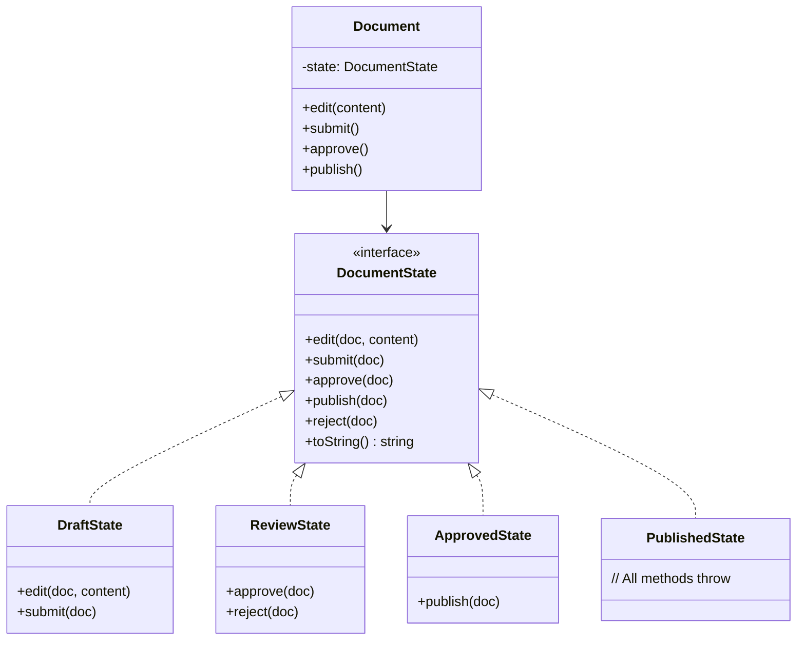

# State Pattern (OOP)

## 1. The Problem

Your Document class models a document lifecycle: Draft → Under Review → Approved → Published. Every method checks the current state:

```typescript
class Document {
  status: "draft" | "review" | "approved" | "published" = "draft";

  edit(content: string) {
    if (this.status === "published") throw new Error("Can't edit published doc");
    if (this.status === "approved") throw new Error("Can't edit approved doc");
    if (this.status === "review") throw new Error("Can't edit during review");
    this.content = content;
  }

  submit() {
    if (this.status !== "draft") throw new Error("Can only submit drafts");
    this.status = "review";
  }

  approve() {
    if (this.status !== "review") throw new Error("Can only approve under review");
    this.status = "approved";
  }

  publish() {
    if (this.status !== "approved") throw new Error("Can only publish approved");
    this.status = "published";
  }

  reject() {
    if (this.status !== "review") throw new Error("Can only reject under review");
    this.status = "draft";
  }
}
```

Four states, five methods. That's 20 status-check branches. Now the product team adds "Archived" and "Expired" states, with "Revert to Draft" and "Extend Deadline" actions. Every method gains more if-else branches. The Document class balloons to 400 lines. A new developer trying to understand "what can I do with an approved document?" has to read every method and trace every branch.

**The behavior you get depends on the state, but the state-checking logic is scattered across every method instead of being organized BY state.**

---

## 2. Naïve Solutions (and Why They Fail)

### Attempt 1: Lookup Table for Allowed Actions

```typescript
const allowedActions: Record<string, string[]> = {
  draft: ["edit", "submit"],
  review: ["approve", "reject"],
  approved: ["publish"],
  published: [],
};
```

**Why it's incomplete:**
- The table tells you WHICH actions are allowed, but not WHAT each action does in each state. `edit()` in draft saves locally; `edit()` in review might need re-approval. The behavior varies by state, not just the permission.
- You still need the switch statement inside each method to implement state-specific behavior.

### Attempt 2: Strategy Per Action

```typescript
const editStrategies = {
  draft: (doc: Document, content: string) => { doc.content = content; },
  review: (_doc: Document) => { throw new Error("Can't edit"); },
  // ...
};

function edit(doc: Document, content: string) {
  editStrategies[doc.status](doc, content);
}
```

**Why it fragments state behavior:**
- All behaviors for "draft" are scattered across `editStrategies`, `submitStrategies`, `approveStrategies`. To understand "what can a draft do?", you check 5 different maps.
- Adding a new state means adding an entry to every strategy map. Miss one and you get a runtime error.

### Attempt 3: Subclasses Per State

```typescript
class DraftDocument extends Document { ... }
class ReviewDocument extends Document { ... }
```

**Why identity changes are awkward:**
- When a draft is submitted for review, it doesn't become a new object — it's the same document. Replacing `draftDoc` with `new ReviewDocument(draftDoc)` breaks references. The database ORM doesn't understand your class hierarchy.

---

## 3. The Insight

**Instead of the object checking ITS state to decide behavior, delegate to a state object that embodies the behavior FOR that state. Each state knows what actions it supports and how to execute them. Transitioning states means swapping the state object, not changing a flag.**

---

## 4. The Pattern

### State Pattern

**Definition:** An object-oriented behavioral pattern where an object (the context) delegates state-specific behavior to state objects. Each state is a class that implements a common interface defining all possible actions. The context holds a reference to the current state object and forwards method calls to it. State transitions are performed by replacing the state object.

**Participants:**
| Participant | Role |
|---|---|
| **Context** | The object whose behavior changes (Document) |
| **State Interface** | Defines all actions (edit, submit, approve, reject, publish) |
| **Concrete States** | One class per state, implements the interface |

**Guarantees:**
- All behavior for a given state is in one class — easy to understand and modify.
- Adding a new state means adding a new class, not modifying existing code (Open/Closed Principle).
- Invalid operations are rejected at the state level — no scattered if-checks.

**Non-guarantees:**
- Does NOT reduce the number of state classes — one class per state.
- Does NOT visualize transitions like a data-driven state machine — the transitions are in code.
- Can be overkill for 2-3 simple states with uniform behavior.

---

## 5. Mental Model

**A mood ring.** The ring changes color based on your state. Each color (state) has its own meaning (behavior). You don't check a table to see "if ring is blue, then calm" — the blue state inherently MEANS calm. The ring's observable behavior (color, meaning) changes with state, but it's always the same ring.

---

## 6. Structure



---

## 7. Code Example

### TypeScript

```typescript
// ========== STATE INTERFACE ==========
interface DocumentState {
  edit(doc: Document, content: string): void;
  submit(doc: Document): void;
  approve(doc: Document, approver: string): void;
  reject(doc: Document, reason: string): void;
  publish(doc: Document): void;
  toString(): string;
}

// ========== BASE STATE (default: reject everything) ==========
class BaseDocumentState implements DocumentState {
  edit(_doc: Document, _content: string): void {
    throw new Error(`Cannot edit in ${this} state`);
  }
  submit(_doc: Document): void {
    throw new Error(`Cannot submit in ${this} state`);
  }
  approve(_doc: Document, _approver: string): void {
    throw new Error(`Cannot approve in ${this} state`);
  }
  reject(_doc: Document, _reason: string): void {
    throw new Error(`Cannot reject in ${this} state`);
  }
  publish(_doc: Document): void {
    throw new Error(`Cannot publish in ${this} state`);
  }
  toString(): string {
    return this.constructor.name;
  }
}

// ========== CONCRETE STATES ==========

class DraftState extends BaseDocumentState {
  edit(doc: Document, content: string): void {
    doc.content = content;
    doc.updatedAt = new Date();
    console.log("Content updated in draft");
  }

  submit(doc: Document): void {
    if (!doc.content || doc.content.trim().length === 0) {
      throw new Error("Cannot submit empty document");
    }
    doc.submittedAt = new Date();
    doc.transitionTo(new ReviewState());
    console.log("Document submitted for review");
  }

  toString() { return "Draft"; }
}

class ReviewState extends BaseDocumentState {
  approve(doc: Document, approver: string): void {
    doc.approvedBy = approver;
    doc.approvedAt = new Date();
    doc.transitionTo(new ApprovedState());
    console.log(`Document approved by ${approver}`);
  }

  reject(doc: Document, reason: string): void {
    doc.rejectionReason = reason;
    doc.transitionTo(new DraftState());
    console.log(`Document rejected: ${reason}`);
  }

  toString() { return "Under Review"; }
}

class ApprovedState extends BaseDocumentState {
  publish(doc: Document): void {
    doc.publishedAt = new Date();
    doc.transitionTo(new PublishedState());
    console.log("Document published");
  }

  // Special: approved docs can be sent back to draft
  reject(doc: Document, reason: string): void {
    doc.rejectionReason = reason;
    doc.approvedBy = undefined;
    doc.transitionTo(new DraftState());
    console.log(`Approval revoked: ${reason}`);
  }

  toString() { return "Approved"; }
}

class PublishedState extends BaseDocumentState {
  // All actions are invalid — document is immutable once published
  // BaseDocumentState throws for everything

  toString() { return "Published"; }
}

// ========== CONTEXT ==========
class Document {
  content: string = "";
  updatedAt?: Date;
  submittedAt?: Date;
  approvedBy?: string;
  approvedAt?: Date;
  publishedAt?: Date;
  rejectionReason?: string;

  private state: DocumentState;

  constructor(private readonly id: string) {
    this.state = new DraftState();
  }

  // Delegate all actions to current state
  edit(content: string): void { this.state.edit(this, content); }
  submit(): void { this.state.submit(this); }
  approve(approver: string): void { this.state.approve(this, approver); }
  reject(reason: string): void { this.state.reject(this, reason); }
  publish(): void { this.state.publish(this); }

  transitionTo(newState: DocumentState): void {
    console.log(`  [${this.state}] → [${newState}]`);
    this.state = newState;
  }

  getStatus(): string {
    return this.state.toString();
  }
}

// ========== USAGE ==========
const doc = new Document("DOC-001");

doc.edit("First draft content");      // Works
doc.submit();                         // Draft → Review

// doc.edit("change during review");  // Throws: Cannot edit in ReviewState

doc.approve("alice@company.com");     // Review → Approved
doc.publish();                        // Approved → Published

// doc.edit("modify published doc");  // Throws: Cannot edit in PublishedState
```

### Go

```go
package main

import (
	"errors"
	"fmt"
	"time"
)

// ========== STATE INTERFACE ==========
type DocumentState interface {
	Edit(doc *Document, content string) error
	Submit(doc *Document) error
	Approve(doc *Document, approver string) error
	Reject(doc *Document, reason string) error
	Publish(doc *Document) error
	String() string
}

// ========== BASE STATE ==========
type baseState struct{ name string }

func (b baseState) Edit(*Document, string) error       { return fmt.Errorf("cannot edit in %s", b.name) }
func (b baseState) Submit(*Document) error              { return fmt.Errorf("cannot submit in %s", b.name) }
func (b baseState) Approve(*Document, string) error     { return fmt.Errorf("cannot approve in %s", b.name) }
func (b baseState) Reject(*Document, string) error      { return fmt.Errorf("cannot reject in %s", b.name) }
func (b baseState) Publish(*Document) error             { return fmt.Errorf("cannot publish in %s", b.name) }
func (b baseState) String() string                      { return b.name }

// ========== CONCRETE STATES ==========

type DraftState struct{ baseState }

func NewDraftState() *DraftState { return &DraftState{baseState{"Draft"}} }

func (d *DraftState) Edit(doc *Document, content string) error {
	doc.Content = content
	now := time.Now()
	doc.UpdatedAt = &now
	fmt.Println("Content updated in draft")
	return nil
}

func (d *DraftState) Submit(doc *Document) error {
	if doc.Content == "" {
		return errors.New("cannot submit empty document")
	}
	now := time.Now()
	doc.SubmittedAt = &now
	doc.TransitionTo(NewReviewState())
	fmt.Println("Document submitted for review")
	return nil
}

type ReviewState struct{ baseState }

func NewReviewState() *ReviewState { return &ReviewState{baseState{"Review"}} }

func (r *ReviewState) Approve(doc *Document, approver string) error {
	doc.ApprovedBy = approver
	now := time.Now()
	doc.ApprovedAt = &now
	doc.TransitionTo(NewApprovedState())
	fmt.Printf("Document approved by %s\n", approver)
	return nil
}

func (r *ReviewState) Reject(doc *Document, reason string) error {
	doc.RejectionReason = reason
	doc.TransitionTo(NewDraftState())
	fmt.Printf("Document rejected: %s\n", reason)
	return nil
}

type ApprovedState struct{ baseState }

func NewApprovedState() *ApprovedState { return &ApprovedState{baseState{"Approved"}} }

func (a *ApprovedState) Publish(doc *Document) error {
	now := time.Now()
	doc.PublishedAt = &now
	doc.TransitionTo(&PublishedState{baseState{"Published"}})
	fmt.Println("Document published")
	return nil
}

type PublishedState struct{ baseState }
// All methods inherited from baseState — all return errors

// ========== CONTEXT ==========
type Document struct {
	ID              string
	Content         string
	UpdatedAt       *time.Time
	SubmittedAt     *time.Time
	ApprovedBy      string
	ApprovedAt      *time.Time
	PublishedAt     *time.Time
	RejectionReason string
	state           DocumentState
}

func NewDocument(id string) *Document {
	return &Document{ID: id, state: NewDraftState()}
}

func (d *Document) Edit(content string) error    { return d.state.Edit(d, content) }
func (d *Document) Submit() error                 { return d.state.Submit(d) }
func (d *Document) Approve(approver string) error { return d.state.Approve(d, approver) }
func (d *Document) Reject(reason string) error    { return d.state.Reject(d, reason) }
func (d *Document) Publish() error                { return d.state.Publish(d) }
func (d *Document) Status() string                { return d.state.String() }

func (d *Document) TransitionTo(newState DocumentState) {
	fmt.Printf("  [%s] → [%s]\n", d.state, newState)
	d.state = newState
}

func main() {
	doc := NewDocument("DOC-001")

	doc.Edit("First draft content")
	doc.Submit()

	if err := doc.Edit("change during review"); err != nil {
		fmt.Println("Error:", err) // "cannot edit in Review"
	}

	doc.Approve("alice@company.com")
	doc.Publish()

	if err := doc.Edit("modify published doc"); err != nil {
		fmt.Println("Error:", err) // "cannot edit in Published"
	}
}
```

---

## 8. Gotchas & Beginner Mistakes

| Mistake | Why It Hurts |
|---|---|
| **State classes know too much about the context** | State classes that directly modify 10 context fields become tightly coupled. Pass only necessary data, or use the context's public API. |
| **Creating new state objects on every transition** | `new DraftState()` every time — fine if states are stateless. But if states carry data, you might want singletons or pooled states. |
| **State transition logic in the context** | If `Document.submit()` checks `if (this.state instanceof DraftState)` before calling `this.state.submit()`, you've defeated the pattern. The state object decides; the context delegates. |
| **Too few states to justify the pattern** | An on/off toggle with two states and one transition doesn't need four classes. Use a boolean. The pattern pays off at 3+ states with differing behavior. |
| **Not serializable** | Persisting `Document` requires converting the state class reference to a string. Implement `fromString()` factory: `"draft" → new DraftState()`. |

---

## 9. Related & Confusable Patterns

| Pattern | How It Differs |
|---|---|
| **State Machine (data-driven)** | Uses a transition table (data structure) to define states and transitions. State Pattern uses classes and polymorphism. FSMs are easier to visualize; State Pattern is easier to add complex behavior per state. |
| **Strategy Pattern** | Externally selects an algorithm. State Pattern internally transitions between behaviors based on events. Strategy is chosen BY the client; state changes are driven BY events. |
| **Command Pattern** | Encapsulates actions as objects. State Pattern encapsulates state + behavior. Commands are performed; states are transitioned to. |
| **Visitor Pattern** | Adds operations across a class hierarchy without modifying it. Similar structure (double dispatch) but different intent — Visitor adds operations; State changes behavior. |

---

## 10. When This Pattern Is the WRONG Choice

- **Fewer than 3 states** — Two states (open/closed) don't justify 4 classes (interface + 2 states + context). Use a simple boolean or enum with an if-check.
- **States with identical behavior** — If every state handles `edit()`, `submit()`, and `approve()` the same way, you don't have state-dependent behavior. A simple status field suffices.
- **Functional codebase** — In functional programming, discriminated unions with pattern matching achieve the same goal with less ceremony. The State Pattern is specifically an OOP solution.

**Symptoms you should reconsider:**
- Your state classes are mostly empty (just delegate to BaseState). The states don't have distinct behavior — collapse them.
- The context class is doing all the work and states just return booleans. You haven't actually delegated behavior.
- You're creating state classes for states that only exist for milliseconds (e.g., "Initializing"). Transient states that immediately transition don't need their own class.

**How to back out:** Inline state-specific logic back into the context class with switch/if statements. Replace state objects with a string/enum status field. For simple lifecycles, this is perfectly readable.
