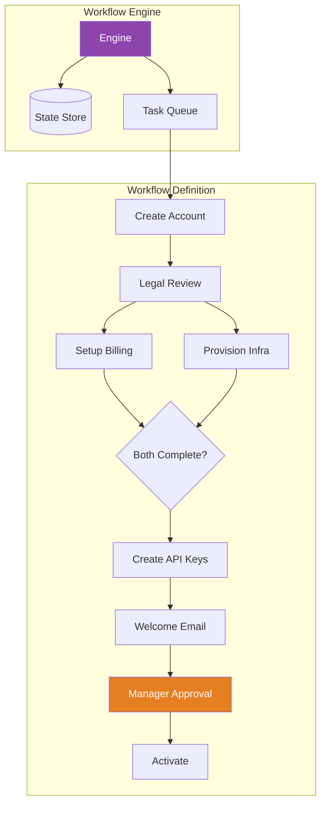

# Workflow Engine

## 1. The Problem

Your company onboards new enterprise customers. The process has 8 steps:

1. Sales creates account → 2. Legal reviews contract → 3. Finance sets up billing → 4. Ops provisions infrastructure → 5. Engineering creates API keys → 6. Success sends welcome email → 7. Manager approves go-live → 8. System activates account.

Currently this is managed by a shared spreadsheet. Sales fills in row 1, emails Legal. Legal reviews, emails Finance. Each handoff is a Slack message, an email, and a prayer that someone notices.

The problems:
- **Step 3 fails silently** — Finance was on vacation for 2 weeks. Nobody noticed until the customer complained.
- **No visibility** — "Where is the Acme Corp onboarding?" requires 4 Slack messages to 4 teams.
- **Can't resume** — Step 5 failed because the API key service was down. The engineer manually retried, but step 4 never ran because nobody told Ops.
- **No parallelism** — Steps 3 and 4 are independent but run sequentially because the spreadsheet is linear.

You try coding it:

```typescript
async function onboardCustomer(customer: Customer) {
  await createAccount(customer);
  await reviewContract(customer);      // How long does this take? Days?
  await setupBilling(customer);        // What if this fails?
  await provisionInfra(customer);      // Can this run in parallel with billing?
  await createApiKeys(customer);
  await sendWelcomeEmail(customer);
  await approveGoLive(customer);       // This is a human decision. await??
  await activateAccount(customer);
}
```

One function, 8 awaits. If the server restarts at step 5, all progress is lost. If step 3 takes 2 weeks (legal review), the function holds a connection open for 2 weeks. Steps 3 and 4 run sequentially when they could run in parallel.

**Long-running, multi-step, multi-team processes can't be modeled as a single function call.**

---

## 2. Naïve Solutions (and Why They Fail)

### Attempt 1: Cron Job Polling

Check the database every minute for work to do:

```typescript
// Every 60 seconds
const pending = await db.query("SELECT * FROM onboardings WHERE status = 'pending_billing'");
for (const customer of pending) {
  await setupBilling(customer);
  await db.update(customer.id, { status: "pending_infra" });
}
```

**Why it's fragile:**
- One cron job per step × 8 steps = 8 cron jobs, each polling every minute. That's 480 unnecessary queries per hour.
- If two cron instances run, they process the same customer twice.
- Error handling per step is independently coded — each cron has its own retry logic.

### Attempt 2: Event-Driven Chain

Each step publishes an event that triggers the next:

```
account.created → [Legal] → contract.approved → [Finance] → billing.ready → ...
```

**Why it loses the big picture:**
- No single place shows "where is this onboarding?" You have to trace events through 8 different logs.
- Parallel steps (billing + infra) require a "join" event — both must complete before proceeding. This coordination logic is scattered across event handlers.
- If you need to add step 2.5, you modify the event chain — which is distributed across services.

### Attempt 3: Status Field with Giant Switch

```typescript
switch (onboarding.status) {
  case "created":      return stepReviewContract(onboarding);
  case "contract_ok":  return stepSetupBilling(onboarding);
  case "billing_ok":   return stepProvisionInfra(onboarding);
  // ... 8 more cases
}
```

**Why it's a fragile monolith:**
- The switch grows linearly. Parallel steps, conditional branches, and timeout deadlines make it exponentially complex.
- The entire workflow is a single function with hardcoded step ordering. Changing the order requires rewriting the function.

---

## 3. The Insight

**A workflow is a directed graph of steps, not a linear function. Each step has inputs, outputs, a completion condition, and error handling. The workflow engine's job is to persist the current position, execute the next step, handle failures with retries, and resume after restarts — separating the workflow DEFINITION from the workflow EXECUTION.**

---

## 4. The Pattern

### Workflow Engine

**Definition:** A system that executes multi-step processes defined as a graph of steps (tasks). The engine persists the state of each workflow instance, determines which steps are ready to execute, dispatches them, handles failures with configurable retry policies, and supports human tasks that pause workflow execution until resolved.

**Key capabilities:**
| Capability | What It Means |
|---|---|
| **Persistence** | Workflow state survives server restarts |
| **Parallelism** | Independent steps run simultaneously |
| **Human Tasks** | Workflow pauses until a person approves |
| **Retry** | Failed steps are retried with backoff |
| **Timeout** | Steps that exceed deadlines trigger escalation |
| **Visibility** | Current step, history, and estimated completion visible |

**Guarantees:**
- No step is skipped or run out of order (unless explicitly parallel).
- Workflow resumes from last completed step after failures.
- Complete audit trail of who did what and when.

**Non-guarantees:**
- Steps must be idempotent (the engine may retry them).
- Does NOT handle data transformation — steps carry data through a shared context.
- Complex enough to be its own operational burden.

---

## 5. Mental Model

**An assembly line with a foreman.** Each station (step) does one thing. The foreman (engine) knows which station is next, moves the workpiece (context) forward, handles breakdowns (retries), and can run parallel stations. If the factory shuts down (restart), the foreman knows exactly which station each item was at and resumes.

---

## 6. Structure



---

## 7. Code Example

### TypeScript

```typescript
// ========== WORKFLOW DEFINITION ==========

type StepStatus = "pending" | "running" | "completed" | "failed" | "waiting_human";

interface StepDefinition {
  name: string;
  dependsOn: string[];         // Steps that must complete first
  execute: (ctx: WorkflowContext) => Promise<void>;
  onFailure?: "retry" | "skip" | "abort";
  maxRetries?: number;
  timeoutMs?: number;
  isHumanTask?: boolean;
}

interface WorkflowContext {
  workflowId: string;
  data: Record<string, any>;
  setData(key: string, value: any): void;
  getData(key: string): any;
}

interface StepState {
  name: string;
  status: StepStatus;
  retries: number;
  startedAt?: Date;
  completedAt?: Date;
  error?: string;
}

interface WorkflowInstance {
  id: string;
  name: string;
  steps: StepState[];
  context: Record<string, any>;
  status: "running" | "completed" | "failed" | "paused";
  createdAt: Date;
  updatedAt: Date;
}

// ========== WORKFLOW ENGINE ==========

class WorkflowEngine {
  private definitions = new Map<string, StepDefinition[]>();
  private instances = new Map<string, WorkflowInstance>(); // In production: database

  defineWorkflow(name: string, steps: StepDefinition[]): void {
    this.definitions.set(name, steps);
  }

  async startWorkflow(name: string, data: Record<string, any>): Promise<string> {
    const steps = this.definitions.get(name);
    if (!steps) throw new Error(`Unknown workflow: ${name}`);

    const id = `wf-${Date.now()}-${Math.random().toString(36).slice(2)}`;
    const instance: WorkflowInstance = {
      id,
      name,
      steps: steps.map((s) => ({
        name: s.name,
        status: "pending",
        retries: 0,
      })),
      context: data,
      status: "running",
      createdAt: new Date(),
      updatedAt: new Date(),
    };

    this.instances.set(id, instance);
    console.log(`Workflow ${id} started: ${name}`);

    await this.advance(id);
    return id;
  }

  private async advance(workflowId: string): Promise<void> {
    const instance = this.instances.get(workflowId)!;
    const definitions = this.definitions.get(instance.name)!;

    while (instance.status === "running") {
      const readySteps = this.getReadySteps(instance, definitions);

      if (readySteps.length === 0) {
        // Check if we're done or stuck
        const allDone = instance.steps.every(
          (s) => s.status === "completed" || s.status === "failed"
        );
        if (allDone) {
          instance.status = "completed";
          console.log(`Workflow ${workflowId} completed`);
        }
        break;
      }

      // Execute ready steps in parallel
      await Promise.all(
        readySteps.map((step) => this.executeStep(instance, step, definitions))
      );

      // Check if any human tasks are blocking
      const waitingHuman = instance.steps.some(
        (s) => s.status === "waiting_human"
      );
      if (waitingHuman) {
        instance.status = "paused";
        console.log(`Workflow ${workflowId} paused (waiting for human task)`);
        break;
      }

      instance.updatedAt = new Date();
    }
  }

  private getReadySteps(
    instance: WorkflowInstance,
    definitions: StepDefinition[]
  ): StepDefinition[] {
    return definitions.filter((def) => {
      const state = instance.steps.find((s) => s.name === def.name)!;
      if (state.status !== "pending") return false;

      // All dependencies completed?
      return def.dependsOn.every((dep) => {
        const depState = instance.steps.find((s) => s.name === dep);
        return depState?.status === "completed";
      });
    });
  }

  private async executeStep(
    instance: WorkflowInstance,
    def: StepDefinition,
    _defs: StepDefinition[]
  ): Promise<void> {
    const state = instance.steps.find((s) => s.name === def.name)!;

    if (def.isHumanTask) {
      state.status = "waiting_human";
      console.log(`  ⏸ [${def.name}] waiting for human input`);
      return;
    }

    state.status = "running";
    state.startedAt = new Date();
    console.log(`  ▶ [${def.name}] executing...`);

    const ctx: WorkflowContext = {
      workflowId: instance.id,
      data: instance.context,
      setData: (key, value) => { instance.context[key] = value; },
      getData: (key) => instance.context[key],
    };

    try {
      await Promise.race([
        def.execute(ctx),
        def.timeoutMs
          ? new Promise((_, reject) =>
              setTimeout(() => reject(new Error("Step timeout")), def.timeoutMs)
            )
          : new Promise(() => {}), // Never resolves
      ]);

      state.status = "completed";
      state.completedAt = new Date();
      console.log(`  ✓ [${def.name}] completed`);
    } catch (err: any) {
      state.retries++;
      state.error = err.message;

      if (def.onFailure === "skip") {
        state.status = "completed";
        console.log(`  ⚠ [${def.name}] failed, skipping`);
      } else if (state.retries < (def.maxRetries || 3)) {
        state.status = "pending"; // Will be retried on next advance
        console.log(`  ↻ [${def.name}] failed, retry ${state.retries}`);
      } else {
        state.status = "failed";
        if (def.onFailure === "abort") {
          instance.status = "failed";
        }
        console.log(`  ✗ [${def.name}] failed permanently: ${err.message}`);
      }
    }
  }

  // Called when a human completes their task
  async completeHumanTask(workflowId: string, stepName: string): Promise<void> {
    const instance = this.instances.get(workflowId)!;
    const step = instance.steps.find((s) => s.name === stepName)!;

    step.status = "completed";
    step.completedAt = new Date();
    instance.status = "running";

    console.log(`  ✓ [${stepName}] human task completed`);
    await this.advance(workflowId);
  }

  getStatus(workflowId: string): WorkflowInstance | undefined {
    return this.instances.get(workflowId);
  }
}

// ========== USAGE: ONBOARDING WORKFLOW ==========

const engine = new WorkflowEngine();

engine.defineWorkflow("customer-onboarding", [
  {
    name: "create_account",
    dependsOn: [],
    execute: async (ctx) => {
      ctx.setData("accountId", `ACC-${Date.now()}`);
    },
  },
  {
    name: "legal_review",
    dependsOn: ["create_account"],
    isHumanTask: true,
    execute: async () => {},
  },
  {
    name: "setup_billing",
    dependsOn: ["legal_review"],
    maxRetries: 5,
    execute: async (ctx) => {
      ctx.setData("billingId", `BILL-${Date.now()}`);
    },
  },
  {
    name: "provision_infra",
    dependsOn: ["legal_review"], // Parallel with billing!
    timeoutMs: 60000,
    execute: async (ctx) => {
      ctx.setData("infraId", `INFRA-${Date.now()}`);
    },
  },
  {
    name: "create_api_keys",
    dependsOn: ["setup_billing", "provision_infra"], // Waits for BOTH
    execute: async (ctx) => {
      ctx.setData("apiKey", "sk-live-xxx");
    },
  },
  {
    name: "send_welcome_email",
    dependsOn: ["create_api_keys"],
    onFailure: "skip", // Non-critical step
    execute: async (ctx) => {
      console.log(`    Sending welcome to ${ctx.getData("customerEmail")}`);
    },
  },
  {
    name: "manager_approval",
    dependsOn: ["send_welcome_email"],
    isHumanTask: true,
    execute: async () => {},
  },
  {
    name: "activate_account",
    dependsOn: ["manager_approval"],
    execute: async (ctx) => {
      console.log(`    Account ${ctx.getData("accountId")} activated!`);
    },
  },
]);

// Start the workflow
const wfId = await engine.startWorkflow("customer-onboarding", {
  customerName: "Acme Corp",
  customerEmail: "admin@acme.com",
});

// Later: Legal completes their review
await engine.completeHumanTask(wfId, "legal_review");

// Much later: Manager approves
await engine.completeHumanTask(wfId, "manager_approval");
```

### Go

```go
package main

import (
	"context"
	"fmt"
	"sync"
	"time"
)

// ========== TYPES ==========
type StepStatus string

const (
	Pending      StepStatus = "pending"
	Running      StepStatus = "running"
	Completed    StepStatus = "completed"
	Failed       StepStatus = "failed"
	WaitingHuman StepStatus = "waiting_human"
)

type StepDefinition struct {
	Name       string
	DependsOn  []string
	Execute    func(ctx context.Context, data map[string]any) error
	IsHuman    bool
	MaxRetries int
}

type StepState struct {
	Name        string
	Status      StepStatus
	Retries     int
	CompletedAt *time.Time
	Error       string
}

type WorkflowInstance struct {
	ID     string
	Name   string
	Steps  []StepState
	Data   map[string]any
	Status string // "running", "completed", "paused", "failed"
	mu     sync.Mutex
}

// ========== ENGINE ==========
type WorkflowEngine struct {
	definitions map[string][]StepDefinition
	instances   map[string]*WorkflowInstance
	mu          sync.RWMutex
}

func NewEngine() *WorkflowEngine {
	return &WorkflowEngine{
		definitions: make(map[string][]StepDefinition),
		instances:   make(map[string]*WorkflowInstance),
	}
}

func (e *WorkflowEngine) Define(name string, steps []StepDefinition) {
	e.definitions[name] = steps
}

func (e *WorkflowEngine) Start(name string, data map[string]any) (string, error) {
	defs, ok := e.definitions[name]
	if !ok {
		return "", fmt.Errorf("unknown workflow: %s", name)
	}

	id := fmt.Sprintf("wf-%d", time.Now().UnixNano())
	instance := &WorkflowInstance{
		ID: id, Name: name, Data: data, Status: "running",
	}
	for _, d := range defs {
		instance.Steps = append(instance.Steps, StepState{
			Name: d.Name, Status: Pending,
		})
	}

	e.mu.Lock()
	e.instances[id] = instance
	e.mu.Unlock()

	fmt.Printf("Workflow %s started\n", id)
	e.advance(instance)
	return id, nil
}

func (e *WorkflowEngine) advance(inst *WorkflowInstance) {
	defs := e.definitions[inst.Name]

	for inst.Status == "running" {
		ready := e.readySteps(inst, defs)
		if len(ready) == 0 {
			allDone := true
			for _, s := range inst.Steps {
				if s.Status != Completed && s.Status != Failed {
					allDone = false
					break
				}
			}
			if allDone {
				inst.Status = "completed"
				fmt.Printf("Workflow %s completed\n", inst.ID)
			}
			return
		}

		var wg sync.WaitGroup
		for _, def := range ready {
			wg.Add(1)
			go func(d StepDefinition) {
				defer wg.Done()
				e.executeStep(inst, d)
			}(def)
		}
		wg.Wait()

		// Check for human tasks
		for _, s := range inst.Steps {
			if s.Status == WaitingHuman {
				inst.Status = "paused"
				fmt.Printf("Workflow %s paused\n", inst.ID)
				return
			}
		}
	}
}

func (e *WorkflowEngine) readySteps(inst *WorkflowInstance, defs []StepDefinition) []StepDefinition {
	var ready []StepDefinition
	for _, def := range defs {
		state := e.findStep(inst, def.Name)
		if state.Status != Pending {
			continue
		}
		allDepsDone := true
		for _, dep := range def.DependsOn {
			ds := e.findStep(inst, dep)
			if ds.Status != Completed {
				allDepsDone = false
				break
			}
		}
		if allDepsDone {
			ready = append(ready, def)
		}
	}
	return ready
}

func (e *WorkflowEngine) executeStep(inst *WorkflowInstance, def StepDefinition) {
	inst.mu.Lock()
	state := e.findStepMut(inst, def.Name)

	if def.IsHuman {
		state.Status = WaitingHuman
		inst.mu.Unlock()
		fmt.Printf("  ⏸ [%s] waiting for human\n", def.Name)
		return
	}

	state.Status = Running
	inst.mu.Unlock()

	fmt.Printf("  ▶ [%s] executing\n", def.Name)
	err := def.Execute(context.Background(), inst.Data)

	inst.mu.Lock()
	defer inst.mu.Unlock()
	state = e.findStepMut(inst, def.Name)

	if err != nil {
		state.Retries++
		state.Error = err.Error()
		maxRetries := def.MaxRetries
		if maxRetries == 0 {
			maxRetries = 3
		}
		if state.Retries < maxRetries {
			state.Status = Pending
			fmt.Printf("  ↻ [%s] retry %d\n", def.Name, state.Retries)
		} else {
			state.Status = Failed
			fmt.Printf("  ✗ [%s] failed: %s\n", def.Name, err)
		}
	} else {
		now := time.Now()
		state.Status = Completed
		state.CompletedAt = &now
		fmt.Printf("  ✓ [%s] completed\n", def.Name)
	}
}

func (e *WorkflowEngine) CompleteHumanTask(workflowID, stepName string) {
	e.mu.RLock()
	inst := e.instances[workflowID]
	e.mu.RUnlock()

	inst.mu.Lock()
	state := e.findStepMut(inst, stepName)
	now := time.Now()
	state.Status = Completed
	state.CompletedAt = &now
	inst.Status = "running"
	inst.mu.Unlock()

	fmt.Printf("  ✓ [%s] human task completed\n", stepName)
	e.advance(inst)
}

func (e *WorkflowEngine) findStep(inst *WorkflowInstance, name string) StepState {
	for _, s := range inst.Steps {
		if s.Name == name {
			return s
		}
	}
	return StepState{}
}

func (e *WorkflowEngine) findStepMut(inst *WorkflowInstance, name string) *StepState {
	for i := range inst.Steps {
		if inst.Steps[i].Name == name {
			return &inst.Steps[i]
		}
	}
	return nil
}

func main() {
	engine := NewEngine()

	engine.Define("onboarding", []StepDefinition{
		{Name: "create_account", Execute: func(_ context.Context, data map[string]any) error {
			data["accountId"] = "ACC-123"
			return nil
		}},
		{Name: "legal_review", DependsOn: []string{"create_account"}, IsHuman: true},
		{Name: "setup_billing", DependsOn: []string{"legal_review"}, Execute: func(_ context.Context, data map[string]any) error {
			data["billingId"] = "BILL-456"
			return nil
		}},
		{Name: "provision_infra", DependsOn: []string{"legal_review"}, Execute: func(_ context.Context, data map[string]any) error {
			data["infraId"] = "INFRA-789"
			return nil
		}},
		{Name: "activate", DependsOn: []string{"setup_billing", "provision_infra"}, Execute: func(_ context.Context, data map[string]any) error {
			fmt.Printf("    Account %s activated!\n", data["accountId"])
			return nil
		}},
	})

	id, _ := engine.Start("onboarding", map[string]any{"customer": "Acme"})
	engine.CompleteHumanTask(id, "legal_review")
}
```

---

## 8. Gotchas & Beginner Mistakes

| Mistake | Why It Hurts |
|---|---|
| **Non-idempotent steps** | The engine retries a failed "create account" step — now there are two accounts. Every step must handle being called multiple times safely. |
| **Too much data in workflow context** | The context carries 50MB of order data through 12 steps. Store references (IDs), not full data. Fetch data in the step that needs it. |
| **Mixing workflow logic and business logic** | Step definitions contain database queries, API calls, and email sending. Keep step implementations thin — delegate to domain services. |
| **No timeout on human tasks** | "Manager approval" waits forever. After 3 business days, escalate to VP. After 5, auto-approve with a compliance flag. |
| **Tightly coupled step order** | Changing step 3 requires modifying step 4's dependency list. Use dependency graphs, not sequential arrays, so inserting steps is a local change. |

---

## 9. Related & Confusable Patterns

| Pattern | How It Differs |
|---|---|
| **State Machine** | Models one entity's lifecycle. Workflow Engine orchestrates multi-step processes potentially spanning many entities and services. A state machine answers "what state is this order in?"; a workflow engine answers "what step is this process at?" |
| **Saga** | A sequence of compensatable transactions. A saga IS a workflow with compensation. Workflow engines can implement sagas as one use case. |
| **Process Manager** | Coordinates messages between services, maintaining process state. Very similar to a workflow engine — often the same thing with different emphasis (messaging vs. step execution). |
| **Choreography** | Decentralized process coordination through events. Workflow Engine is centralized. Choreography has no single point that knows the whole process. |
| **Job Queue** | Executes independent jobs. A workflow engine manages dependent steps. Job queues don't know about step ordering or process state. |

---

## 10. When This Pattern Is the WRONG Choice

- **3 or fewer sequential steps** — A simple function with error handling works. The overhead of a workflow engine (persistence, UI, monitoring) isn't justified.
- **Sub-second processes** — If the entire workflow takes 200ms, the engine's overhead (state persistence, step dispatch) dominates execution time. Use a direct function call.
- **Purely event-driven systems** — If your services already communicate through events and each service handles its own state, choreography might be simpler than a central engine.

**Symptoms you should reconsider:**
- The workflow engine is slower than direct execution and your process never fails, never has human steps, and completes in seconds. You've added infrastructure for reliability you don't need.
- Every workflow has one step. You're using a workflow engine as a job queue. Use a job queue.
- The workflow definition changes weekly. Your process isn't stable enough to formalize. Stabilize the process manually first, then automate.

**How to back out:** Replace with direct function calls for simple flows. Use a message queue with manual tracking for multi-service coordination. For human tasks, use a ticket system (Jira, Linear) instead of a custom workflow UI.
