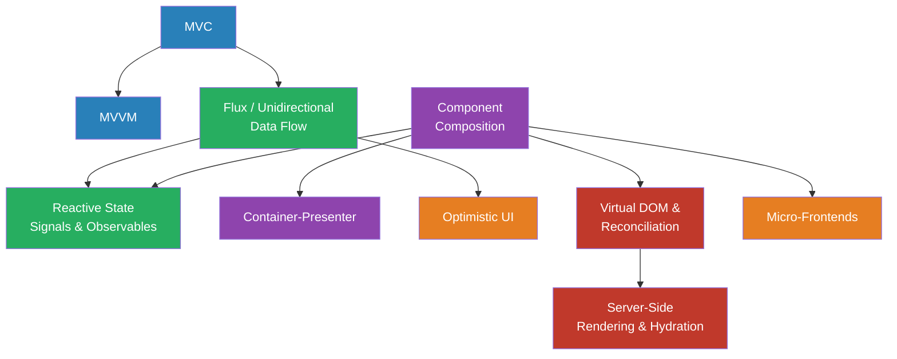

# Module 08 — Frontend & UI Patterns

> How UIs are structured, how state is managed, and how rendering is made efficient.

## Why This Module Exists

Backend engineers often treat the frontend as "just a view layer." But frontend code faces unique pressures: user interactions are unpredictable, rendering must be fast, state lives in multiple places simultaneously (server, memory, URL, local storage, DOM), and the user can see every bug. These patterns aren't cosmetic — they determine whether your UI is maintainable or a tangled mess of `if` statements and `useEffect` calls.

## Prerequisites

- [Module 02 — Architectural Patterns](../02-architectural-patterns/README.md) — Separation of concerns at the system level
- [Module 07 — State & Workflow](../07-state-workflow/README.md) — State machines and event-driven state

## Pattern Dependency Graph

## Reading Order

| # | Pattern | File | Core Question |
|---|---------|------|---------------|
| 1 | MVC | [mvc.md](mvc.md) | How do I separate what the user sees from what the app knows? |
| 2 | MVVM | [mvvm.md](mvvm.md) | How do I keep the view automatically in sync with the model? |
| 3 | Flux / Unidirectional Data Flow | [flux-unidirectional.md](flux-unidirectional.md) | How do I make state changes predictable and debuggable? |
| 4 | Component Composition | [component-composition.md](component-composition.md) | How do I build complex UIs from small, reusable pieces? |
| 5 | Container-Presenter | [container-presenter.md](container-presenter.md) | How do I separate data-fetching logic from rendering? |
| 6 | Reactive State (Signals & Observables) | [reactive-state.md](reactive-state.md) | How do I update only the parts of the UI that actually changed? |
| 7 | Optimistic UI | [optimistic-ui.md](optimistic-ui.md) | How do I make the app feel instant even with slow backends? |
| 8 | Virtual DOM & Reconciliation | [virtual-dom.md](virtual-dom.md) | How do I efficiently update the real DOM without layout thrash? |
| 9 | Server-Side Rendering & Hydration | [server-side-rendering.md](server-side-rendering.md) | How do I get fast first paint and SEO without losing interactivity? |
| 10 | Micro-Frontends | [micro-frontends.md](micro-frontends.md) | How do I let multiple teams own independent parts of the UI? |

## How These Patterns Connect

**Separation of concerns** (patterns 1-2): MVC introduced the fundamental split between model, view, and controller. MVVM refined it with automatic data binding, eliminating manual view-update code.

**State management** (patterns 3, 6): Flux replaced MVC's bidirectional data flow with strict unidirectional flow — actions → dispatcher → store → view. Reactive state (signals/observables) pushes this further with fine-grained subscriptions that skip the diffing step entirely.

**Component architecture** (patterns 4-5): Component composition shows how to build UIs from a tree of small pieces. Container-Presenter separates *what data to show* from *how to show it*, making components testable without a backend.

**Rendering & performance** (patterns 7-9): Optimistic UI addresses perceived speed. Virtual DOM solves the "how do I update the DOM efficiently" problem. Server-side rendering solves "how do I get content to the user before JavaScript loads."

**Scale** (pattern 10): Micro-frontends apply service decomposition to the frontend, letting independent teams deploy independently.

## Key Tensions in Frontend

| Tension | Pull A | Pull B |
|---------|--------|--------|
| Reactivity | Simple (manual DOM updates) | Automatic (framework-managed) |
| State location | Local (component state) | Global (centralized store) |
| Rendering | Client-side (SPA) | Server-side (SSR/SSG) |
| Coupling | Monolithic frontend | Micro-frontend composition |
| Updates | Wait for server (safe) | Optimistic (fast, risky) |
| Abstraction | Direct DOM (fast, verbose) | Virtual DOM (convenient, overhead) |
