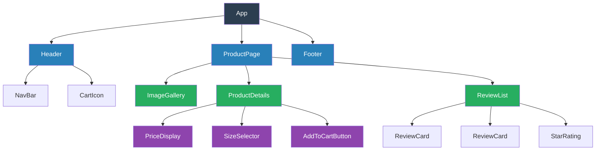
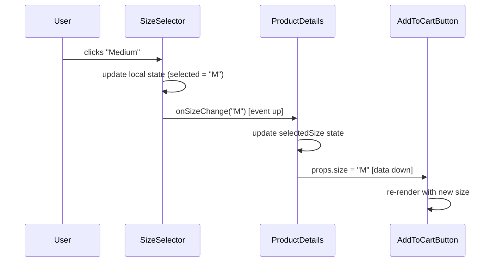

# Component Composition

## 1. The Problem (Story)

You're building an e-commerce product page. It has a header with navigation and cart icon, a product image gallery, a product title, a price (with sale price and discount badge), a size selector, an "Add to Cart" button, customer reviews with star ratings, a "Customers also bought" carousel, and a footer.

Your first version is a single `renderProductPage()` function — 600 lines. It builds the entire page as one HTML string:

```typescript
function renderProductPage(product: Product, reviews: Review[], recommendations: Product[]) {
  let html = '<div class="page">';
  
  // Header (lines 1-45)
  html += '<header>'; 
  html += `<nav>...${cartCount} items...</nav>`;
  html += '</header>';
  
  // Gallery (lines 46-120) — carousel with thumbnails
  html += '<div class="gallery">';
  for (const img of product.images) {
    html += ``;
  }
  html += '</div>';
  
  // Price section (lines 121-155)
  if (product.salePrice) {
    html += `<span class="original">${product.price}</span>`;
    html += `<span class="sale">${product.salePrice}</span>`;
    html += `<span class="badge">${Math.round((1 - product.salePrice / product.price) * 100)}% OFF</span>`;
  } else {
    html += `<span>${product.price}</span>`;
  }
  
  // ... 400 more lines for reviews, recommendations, footer
  html += '</div>';
  return html;
}
```

A designer asks: "Can we use the same star rating on the restaurant listing page?" You copy-paste 30 lines of star-rendering code. A week later, the designer changes the star icon from ★ to a custom SVG. You update it on the product page. The restaurant page still shows the old icon. Nobody notices for a month.

Another request: "Add the same price component to the search results page." More copy-paste. Now the discount percentage calculation exists in three files. A PM asks to change the rounding from `Math.round` to `Math.floor`. One developer updates two of the three copies.

**The UI is a monolith. You cannot reuse, test, or update any piece independently.**

## 2. The Naïve Solutions

### Attempt 1: "Helper functions"

Extract rendering into functions:

```typescript
function renderStars(rating: number): string { /* ... */ }
function renderPrice(price: number, salePrice?: number): string { /* ... */ }
function renderGallery(images: string[]): string { /* ... */ }
```

Functions eliminate duplication, but they're stateless. The gallery needs to track which image is selected. The size selector needs to track the chosen size. Where does that state live? Back in the parent function — which is still managing 10 pieces of state for 10 different UI regions.

### Attempt 2: "Template partials"

Use a template engine with includes:

```
{{> header }}
{{> gallery images=product.images }}
{{> price product=product }}
{{> reviews reviews=reviews }}
```

Better separation, but partials can't have their own state or lifecycle. You can't say "when the gallery mounts, start an animation" or "when the price changes, flash a highlight." The template engine doesn't know about events or updates.

### Attempt 3: "Widgets"

Build standalone widgets with state:

```typescript
class GalleryWidget {
  private selectedIndex = 0;
  render(images: string[]): string { /* ... */ }
  onImageClick(index: number): void { /* ... */ }
}
```

Now each widget manages its own state, but how do widgets communicate? The "Add to Cart" widget needs to know the selected size from the "Size Selector" widget. You end up with `widget.getState()` calls between widgets — spaghetti dependencies.

## 3. The Insight

**Build the UI as a tree of self-contained components, each with its own input (props), internal state, and rendering logic.** Components don't reach into each other — they communicate through well-defined inputs (data flows down) and events (notifications flow up). A component doesn't know or care who its parent is. It doesn't know or care what its children do internally.

## 4. The Pattern

**Component Composition** structures a UI as a tree of composable, reusable building blocks.

- **Component**: A unit with defined inputs (props), optional local state, a render method, and lifecycle hooks.
- **Props**: Immutable data passed from parent to child. The child never modifies props.
- **Children**: Components can contain other components. The parent decides *which* children to render — children decide *how* they render.
- **Composition**: Complex UIs are built by assembling small components, not by writing large ones.

### Guarantees
- Each component can be developed, tested, and reasoned about in isolation
- Changing the internals of a component doesn't affect its consumers (if the props interface is stable)
- Props flow down, events flow up — data flow is predictable
- Components are reusable across pages, projects, and even frameworks (if props-only)

### Non-Guarantees
- Doesn't solve cross-cutting state (auth, theme, locale) — that needs additional patterns (context, stores)
- Doesn't prevent deep nesting (prop drilling)
- Doesn't prescribe how state is managed within a component

## 5. Mental Model

**LEGO bricks.** Each brick has a defined shape (props interface) and standard connectors (child slots). You don't modify a brick to use it — you snap it together with others. A 2x4 brick doesn't know if it's part of a spaceship or a house. Complex models are built from simple, standard pieces. If a brick breaks, you replace just that brick.

## 6. Structure





## 7. Code Example

### TypeScript — Component tree with props and events

```typescript
// ─── COMPONENT BASE ──────────────────────────────────

interface ComponentOutput {
  html: string;
  handlers: Map<string, Function>;
}

type EventHandler = (...args: any[]) => void;

abstract class Component<P = {}, S = {}> {
  protected props: P;
  protected state: S;
  private mounted = false;
  private eventHandlers: Map<string, Function> = new Map();

  constructor(props: P, initialState: S) {
    this.props = props;
    this.state = initialState;
  }

  protected setState(partial: Partial<S>): void {
    this.state = { ...this.state, ...partial };
    // In a real framework, this triggers re-render
  }

  protected on(event: string, handler: Function): void {
    this.eventHandlers.set(event, handler);
  }

  abstract render(): string;

  mount(): ComponentOutput {
    this.mounted = true;
    this.onMount();
    return { html: this.render(), handlers: this.eventHandlers };
  }

  protected onMount(): void {}
  protected onUnmount(): void {}
}

// ─── LEAF COMPONENTS (reusable atoms) ────────────────

interface StarRatingProps {
  rating: number;
  maxStars?: number;
}

class StarRating extends Component<StarRatingProps> {
  constructor(props: StarRatingProps) {
    super({ maxStars: 5, ...props }, {});
  }

  render(): string {
    const full = Math.floor(this.props.rating);
    const half = this.props.rating % 1 >= 0.5 ? 1 : 0;
    const empty = (this.props.maxStars ?? 5) - full - half;
    return '★'.repeat(full) + (half ? '½' : '') + '☆'.repeat(empty);
  }
}

// Same StarRating used on product page, restaurant page, review page
const productStars = new StarRating({ rating: 4.5 });
const restaurantStars = new StarRating({ rating: 3.2, maxStars: 5 });

interface PriceDisplayProps {
  price: number;
  salePrice?: number;
  currency?: string;
}

class PriceDisplay extends Component<PriceDisplayProps> {
  constructor(props: PriceDisplayProps) {
    super({ currency: 'USD', ...props }, {});
  }

  private format(amount: number): string {
    return new Intl.NumberFormat('en-US', {
      style: 'currency',
      currency: this.props.currency ?? 'USD',
    }).format(amount);
  }

  private getDiscount(): number | null {
    if (!this.props.salePrice) return null;
    return Math.floor((1 - this.props.salePrice / this.props.price) * 100);
  }

  render(): string {
    const discount = this.getDiscount();
    if (discount !== null) {
      return [
        `<s>${this.format(this.props.price)}</s>`,
        `<strong>${this.format(this.props.salePrice!)}</strong>`,
        `<span class="badge">${discount}% OFF</span>`,
      ].join(' ');
    }
    return this.format(this.props.price);
  }
}

// ─── STATEFUL COMPONENT ──────────────────────────────

interface SizeSelectorProps {
  sizes: string[];
  onSizeChange: (size: string) => void;
}

interface SizeSelectorState {
  selected: string | null;
}

class SizeSelector extends Component<SizeSelectorProps, SizeSelectorState> {
  constructor(props: SizeSelectorProps) {
    super(props, { selected: null });
  }

  select(size: string): void {
    this.setState({ selected: size });
    this.props.onSizeChange(size);  // Notify parent via callback prop
  }

  render(): string {
    return this.props.sizes
      .map(size => {
        const active = size === this.state.selected ? ' [selected]' : '';
        return `<button${active}>${size}</button>`;
      })
      .join(' ');
  }
}

// ─── COMPOSITE COMPONENT ─────────────────────────────
// Composes children — doesn't know their implementation details.

interface ProductDetailsProps {
  name: string;
  price: number;
  salePrice?: number;
  sizes: string[];
  rating: number;
  reviewCount: number;
  onAddToCart: (product: { name: string; size: string }) => void;
}

interface ProductDetailsState {
  selectedSize: string | null;
}

class ProductDetails extends Component<ProductDetailsProps, ProductDetailsState> {
  private priceDisplay: PriceDisplay;
  private stars: StarRating;
  private sizeSelector: SizeSelector;

  constructor(props: ProductDetailsProps) {
    super(props, { selectedSize: null });

    // Compose children — pass data DOWN via props
    this.priceDisplay = new PriceDisplay({
      price: props.price,
      salePrice: props.salePrice,
    });

    this.stars = new StarRating({
      rating: props.rating,
    });

    // Receive events UP via callback props
    this.sizeSelector = new SizeSelector({
      sizes: props.sizes,
      onSizeChange: (size) => {
        this.setState({ selectedSize: size });
      },
    });
  }

  handleAddToCart(): void {
    if (!this.state.selectedSize) return;
    this.props.onAddToCart({
      name: this.props.name,
      size: this.state.selectedSize,
    });
  }

  render(): string {
    return [
      `<h1>${this.props.name}</h1>`,
      this.priceDisplay.render(),
      `${this.stars.render()} (${this.props.reviewCount} reviews)`,
      `Sizes: ${this.sizeSelector.render()}`,
      `<button ${!this.state.selectedSize ? 'disabled' : ''}>Add to Cart</button>`,
    ].join('\n');
  }
}

// ─── LIST COMPOSITION ────────────────────────────────
// Render a dynamic list of the same component

interface ReviewCardProps {
  author: string;
  rating: number;
  text: string;
  date: string;
}

class ReviewCard extends Component<ReviewCardProps> {
  private stars: StarRating;

  constructor(props: ReviewCardProps) {
    super(props, {});
    this.stars = new StarRating({ rating: props.rating });
  }

  render(): string {
    return [
      `<div class="review">`,
      `  <strong>${this.props.author}</strong> — ${this.stars.render()}`,
      `  <p>${this.props.text}</p>`,
      `  <small>${this.props.date}</small>`,
      `</div>`,
    ].join('\n');
  }
}

class ReviewList extends Component<{ reviews: ReviewCardProps[] }> {
  constructor(props: { reviews: ReviewCardProps[] }) {
    super(props, {});
  }

  render(): string {
    if (this.props.reviews.length === 0) {
      return '<p>No reviews yet.</p>';
    }
    // Each item is a composed ReviewCard — same component, different data.
    return this.props.reviews
      .map(r => new ReviewCard(r).render())
      .join('\n');
  }
}

// ─── USAGE: compose the full page ────────────────────
const cartItems: Array<{ name: string; size: string }> = [];

const details = new ProductDetails({
  name: 'Running Shoes X500',
  price: 149.99,
  salePrice: 119.99,
  sizes: ['S', 'M', 'L', 'XL'],
  rating: 4.5,
  reviewCount: 237,
  onAddToCart: (item) => {
    cartItems.push(item);
    console.log(`Added to cart: ${item.name} (${item.size})`);
  },
});

const reviews = new ReviewList({
  reviews: [
    { author: 'Alice', rating: 5, text: 'Amazing fit!', date: '2024-01-15' },
    { author: 'Bob', rating: 4, text: 'Good but runs small', date: '2024-01-10' },
  ],
});

console.log(details.render());
console.log(reviews.render());

// Reuse anywhere: the same StarRating appears in ProductDetails AND ReviewCard
// Change the star rendering once → updates everywhere.
```

### Go — Component tree with interfaces

```go
package main

import (
	"fmt"
	"strings"
)

// ─── COMPONENT INTERFACE ─────────────────────────────

type Component interface {
	Render() string
}

// ─── LEAF COMPONENTS ─────────────────────────────────

type StarRating struct {
	Rating   float64
	MaxStars int
}

func NewStarRating(rating float64) *StarRating {
	return &StarRating{Rating: rating, MaxStars: 5}
}

func (s *StarRating) Render() string {
	full := int(s.Rating)
	hasHalf := (s.Rating - float64(full)) >= 0.5
	empty := s.MaxStars - full
	if hasHalf {
		empty--
	}

	result := strings.Repeat("★", full)
	if hasHalf {
		result += "½"
	}
	result += strings.Repeat("☆", empty)
	return result
}

type PriceDisplay struct {
	Price     float64
	SalePrice float64 // 0 means no sale
}

func (p *PriceDisplay) Render() string {
	if p.SalePrice > 0 {
		discount := int((1 - p.SalePrice/p.Price) * 100)
		return fmt.Sprintf("$%.2f → $%.2f (%d%% OFF)", p.Price, p.SalePrice, discount)
	}
	return fmt.Sprintf("$%.2f", p.Price)
}

// ─── COMPOSITE COMPONENT ─────────────────────────────

type ProductCard struct {
	Name     string
	Price    *PriceDisplay
	Stars    *StarRating
	Reviews  int
	Children []Component // slot for additional content
}

func (pc *ProductCard) Render() string {
	lines := []string{
		fmt.Sprintf("=== %s ===", pc.Name),
		pc.Price.Render(),
		fmt.Sprintf("%s (%d reviews)", pc.Stars.Render(), pc.Reviews),
	}
	for _, child := range pc.Children {
		lines = append(lines, child.Render())
	}
	return strings.Join(lines, "\n")
}

// ─── LIST COMPOSITION ────────────────────────────────

type ReviewCard struct {
	Author string
	Rating float64
	Text   string
}

func (r *ReviewCard) Render() string {
	stars := NewStarRating(r.Rating)
	return fmt.Sprintf("  %s — %s\n  %s", r.Author, stars.Render(), r.Text)
}

type ReviewList struct {
	Reviews []*ReviewCard
}

func (rl *ReviewList) Render() string {
	if len(rl.Reviews) == 0 {
		return "No reviews yet."
	}
	lines := make([]string, len(rl.Reviews))
	for i, r := range rl.Reviews {
		lines[i] = r.Render()
	}
	return strings.Join(lines, "\n---\n")
}

// ─── COMPOSE THE TREE ────────────────────────────────

func main() {
	reviews := &ReviewList{
		Reviews: []*ReviewCard{
			{Author: "Alice", Rating: 5, Text: "Amazing fit!"},
			{Author: "Bob", Rating: 4, Text: "Good but runs small"},
		},
	}

	card := &ProductCard{
		Name:    "Running Shoes X500",
		Price:   &PriceDisplay{Price: 149.99, SalePrice: 119.99},
		Stars:   NewStarRating(4.5),
		Reviews: 237,
		Children: []Component{
			reviews,
		},
	}

	fmt.Println(card.Render())

	// Reuse: same StarRating in product card AND inside each review card
	// Change StarRating.Render() once → updates everywhere
}
```

## 8. Gotchas & Beginner Mistakes

| Mistake | Why It Happens | Fix |
|---------|---------------|-----|
| One mega-component per page | "Everything on this page is related" | If a component has >200 lines, it's doing too much. Extract sub-components. |
| Components that know their siblings | `this.parent.getChild('SizeSelector').getState()` | Components communicate through props (down) and events (up). Never reach sideways. |
| Prop drilling through 5+ levels | Great-grandchild needs auth data from the root | Use context/providers for cross-cutting concerns (auth, theme, locale). |
| Modifying props inside the component | `this.props.items.push(newItem)` | Props are **read-only**. If a child needs to change data, it calls a callback prop. |
| Premature component extraction | Making every `<span>` a separate component | Extract only when you need **reuse** or **isolation**. Not every element is a component. |
| Ignoring component keys in lists | Rendering a list without stable identifiers | Dynamic lists need unique keys for efficient reconciliation. Without keys, the framework can't tell which items moved. |

## 9. Related & Confusable Patterns

| Pattern | Relationship | Key Difference |
|---------|-------------|----------------|
| **Composite (GoF)** | Structural inspiration | GoF Composite treats leaf and composite nodes uniformly. UI components do the same — a Button and a Form are both Components. |
| **Strategy** | Complementary | Components accept behavior via props (functions), which is the Strategy pattern: inject different algorithms at runtime. |
| **Container-Presenter** | Specialization | Container-Presenter is a *rule* for how to split components: containers fetch data, presenters render it. |
| **Template Method** | Lifecycle hooks | Component lifecycle (`onMount`, `onUnmount`) is Template Method — the framework calls your hooks at defined points. |
| **Decorator** | HOCs and wrappers | Higher-order components (HOCs) wrap a component to add behavior — this is the Decorator pattern. |
| **Micro-Frontends** | Scale-up | Micro-frontends apply component composition at the *team/deployment* boundary, not just the UI tree. |

## 10. When This Pattern Is the WRONG Choice

| Scenario | Why Composition Hurts | Better Alternative |
|----------|----------------------|-------------------|
| Static marketing pages | Component overhead for content that never changes | Static HTML + CSS, maybe a static site generator |
| Highly coupled, single-purpose UIs | Dashboard where every element depends on every other element — props flow everywhere | Monolithic component with shared state is simpler |
| Backend-rendered pages with sprinkles of JS | Component framework for 3 interactive widgets is overkill | jQuery or vanilla JS for small interactions |
| Canvas/WebGL-based UIs | Games and visualizations don't use DOM components | Scene graph, entity-component-system (ECS) |

**Symptom you need component composition**: You're copy-pasting rendering code between pages. Two "price displays" exist with slightly different discount calculations. A bug fix in one doesn't reach the other.

**Back-out strategy**: If the component tree has become too deep (>8 levels) with excessive prop drilling, flatten the hierarchy. Use context/providers for widely-needed data. Consolidate overly-granular components back into medium-sized ones. The sweet spot is 3-5 levels of nesting.
