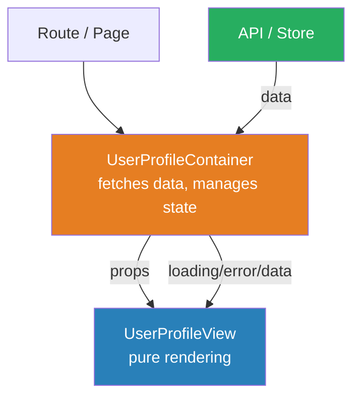
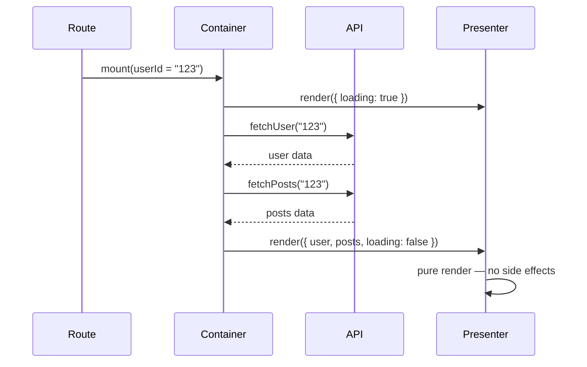
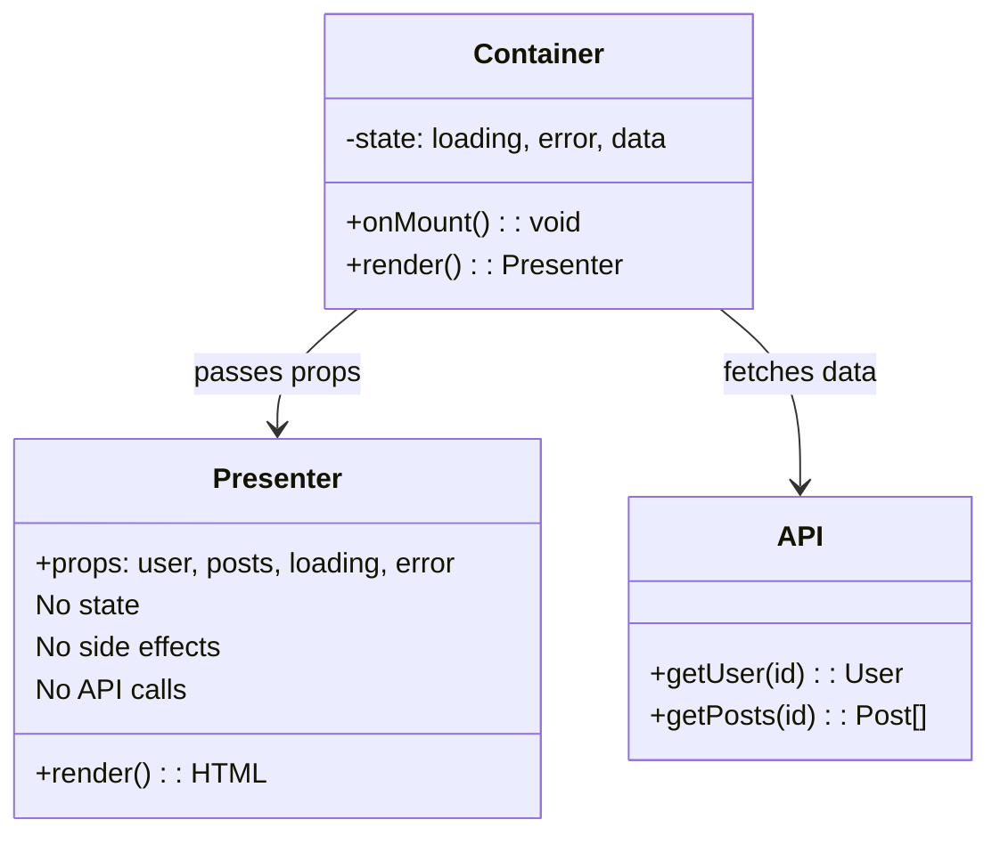

# Container-Presenter (Smart/Dumb Components)

## 1. The Problem (Story)

Your team has 30 React-style components. You need to write tests. You open `UserProfile`:

```typescript
class UserProfile extends Component {
  private user: User | null = null;
  private posts: Post[] = [];
  private loading = true;
  private error: string | null = null;

  async onMount() {
    try {
      const userId = this.getRouteParam('id');
      this.user = await fetch(`/api/users/${userId}`).then(r => r.json());
      this.posts = await fetch(`/api/users/${userId}/posts`).then(r => r.json());
      this.loading = false;
    } catch (e) {
      this.error = 'Failed to load user';
      this.loading = false;
    }
  }

  render(): string {
    if (this.loading) return '<div class="spinner">Loading...</div>';
    if (this.error) return `<div class="error">${this.error}</div>`;
    if (!this.user) return '<div>User not found</div>';

    return `
      <div class="profile">
        
        <h1>${this.user.name}</h1>
        <p>${this.user.bio}</p>
        <div class="posts">
          ${this.posts.map(p => `
            <article>
              <h2>${p.title}</h2>
              <p>${p.excerpt}</p>
              <span>${new Date(p.date).toLocaleDateString()}</span>
            </article>
          `).join('')}
        </div>
      </div>
    `;
  }
}
```

To test this component, you need:
1. A mock HTTP server (it calls `fetch` on mount)
2. A mock router (it reads route params)
3. Wait for async operations to complete
4. Then check the rendered HTML

A simple test — "does it show the user's name?" — requires 40 lines of setup. Want to see this component in Storybook with different states? You can't — it always fetches from the API. Want to reuse the profile card on a different page where the user data comes from a WebSocket? You can't — the `fetch` URL is hardcoded.

The designer asks: "Can I work on the profile styling without setting up the API?" No. Every change requires running the backend.

**The component has two responsibilities glued together: getting data and showing data.**

## 2. The Naïve Solutions

### Attempt 1: "Extract the fetch into a service"

```typescript
class UserService {
  async getUser(id: string): Promise<User> { /* fetch */ }
  async getPosts(id: string): Promise<Post[]> { /* fetch */ }
}
```

The component still calls the service in `onMount`. Testing still requires mocking the service. The component still can't render without a running service. You moved *where* the data comes from but didn't change *who* is responsible for getting it.

### Attempt 2: "Pass data via props sometimes"

```typescript
class UserProfile extends Component<{ user?: User }> {
  async onMount() {
    if (!this.props.user) {
      this.user = await fetchUser(this.getRouteParam('id'));
    } else {
      this.user = this.props.user;
    }
  }
}
```

Now the component has two modes: "I fetch data myself" and "someone gives me data." The `if/else` in `onMount` makes the component harder to reason about, not easier. Every new consumer must know which mode to use.

### Attempt 3: "Mock everything in tests"

Accept the monolithic component and write elaborate test fixtures:

```typescript
// 45 lines of mock setup for one test
beforeEach(() => {
  mockFetch('/api/users/123', { id: '123', name: 'Alice' });
  mockFetch('/api/users/123/posts', [{ title: 'Hello' }]);
  mockRouter({ params: { id: '123' } });
});
```

Tests work but are brittle. Change the API endpoint? Update 30 test files. Change from REST to GraphQL? Rewrite every mock. The test complexity is a symptom, not the disease.

## 3. The Insight

**Split every component into two: one that knows *where to get data* (Container) and one that knows *how to display data* (Presenter).** The Container handles state, side effects, and business logic. The Presenter is a pure function of its props — given the same inputs, it renders the same output. The Presenter is trivially testable, reusable, and Storybook-friendly. The Container is thin glue.

## 4. The Pattern

**Container-Presenter** (also called Smart/Dumb Components, or Stateful/Stateless) separates components by responsibility:

- **Container** (Smart): Knows the data source (API, store, WebSocket). Manages state. Handles loading/error states. Passes data to the Presenter via props. Contains *no rendering logic*.
- **Presenter** (Dumb): Receives all data via props. Contains *no side effects*. Pure rendering. Easily testable. Portable across pages and contexts.

### Guarantees
- Presenters are testable with zero setup — just pass props and check output
- Presenters work in Storybook, design tools, and snapshot tests without mocks
- Changing data sources (REST→GraphQL, API→cache) requires changing only the Container
- Multiple Containers can use the same Presenter with different data sources

### Non-Guarantees
- Doesn't eliminate all state — Containers still manage loading/error/data
- Doesn't prescribe how the Container gets data (hooks, services, stores — up to you)
- Can lead to prop explosion if the Presenter needs many pieces of data

## 5. Mental Model

**A television and its cable box.** The cable box (Container) is connected to the cable company, handles tuning, signal decoding, and buffering. It outputs a clean video signal. The TV (Presenter) takes that signal and displays it beautifully. The TV doesn't know or care whether the signal comes from cable, satellite, a Blu-ray player, or a gaming console. Swap the cable box for a streaming stick — the TV works exactly the same.

## 6. Structure







## 7. Code Example

### TypeScript — Container/Presenter split

```typescript
// ─── DOMAIN TYPES ────────────────────────────────────
interface User {
  id: string;
  name: string;
  avatar: string;
  bio: string;
  joinedAt: string;
}

interface Post {
  id: string;
  title: string;
  excerpt: string;
  date: string;
  likes: number;
}

// ─── PRESENTER (pure, testable, reusable) ────────────
// This component knows NOTHING about APIs, databases, or routing.
// It takes props, returns output. Period.

interface UserProfileViewProps {
  user: User;
  posts: Post[];
  totalLikes: number;
  memberSince: string;     // pre-formatted
  onPostClick?: (postId: string) => void;
}

class UserProfileView {
  constructor(private props: UserProfileViewProps) {}

  render(): string {
    const { user, posts, totalLikes, memberSince } = this.props;
    
    const postList = posts
      .map(p => [
        `  <article data-id="${p.id}">`,
        `    <h2>${p.title}</h2>`,
        `    <p>${p.excerpt}</p>`,
        `    <span>♥ ${p.likes}</span>`,
        `  </article>`,
      ].join('\n'))
      .join('\n');

    return [
      `<div class="profile">`,
      `  `,
      `  <h1>${user.name}</h1>`,
      `  <p class="bio">${user.bio}</p>`,
      `  <div class="stats">`,
      `    <span>Member since ${memberSince}</span>`,
      `    <span>${posts.length} posts</span>`,
      `    <span>${totalLikes} total likes</span>`,
      `  </div>`,
      `  <div class="posts">${postList}</div>`,
      `</div>`,
    ].join('\n');
  }
}

// Separate presenters for loading and error states
class LoadingView {
  render(): string {
    return '<div class="spinner" aria-label="Loading">Loading...</div>';
  }
}

class ErrorView {
  constructor(private props: { message: string; onRetry?: () => void }) {}

  render(): string {
    return [
      `<div class="error" role="alert">`,
      `  <p>${this.props.message}</p>`,
      this.props.onRetry ? `  <button>Retry</button>` : '',
      `</div>`,
    ].join('\n');
  }
}

// ─── CONTAINER (data fetching, state management) ─────
// This component knows WHERE data comes from.
// It renders NO UI of its own — it delegates to Presenters.

interface DataSource {
  getUser(id: string): Promise<User>;
  getPosts(userId: string): Promise<Post[]>;
}

class ApiDataSource implements DataSource {
  constructor(private baseUrl: string) {}

  async getUser(id: string): Promise<User> {
    const res = await fetch(`${this.baseUrl}/users/${id}`);
    if (!res.ok) throw new Error(`User not found: ${id}`);
    return res.json();
  }

  async getPosts(userId: string): Promise<Post[]> {
    const res = await fetch(`${this.baseUrl}/users/${userId}/posts`);
    if (!res.ok) throw new Error('Failed to load posts');
    return res.json();
  }
}

type ContainerState =
  | { phase: 'loading' }
  | { phase: 'error'; message: string }
  | { phase: 'loaded'; user: User; posts: Post[] };

class UserProfileContainer {
  private state: ContainerState = { phase: 'loading' };

  constructor(
    private userId: string,
    private dataSource: DataSource,
  ) {}

  async load(): Promise<void> {
    this.state = { phase: 'loading' };
    try {
      const [user, posts] = await Promise.all([
        this.dataSource.getUser(this.userId),
        this.dataSource.getPosts(this.userId),
      ]);
      this.state = { phase: 'loaded', user, posts };
    } catch (e) {
      this.state = { phase: 'error', message: (e as Error).message };
    }
  }

  render(): string {
    switch (this.state.phase) {
      case 'loading':
        return new LoadingView().render();

      case 'error':
        return new ErrorView({
          message: this.state.message,
          onRetry: () => this.load(),
        }).render();

      case 'loaded': {
        const { user, posts } = this.state;

        // Container does the TRANSFORMATION — presenter gets clean data
        const totalLikes = posts.reduce((sum, p) => sum + p.likes, 0);
        const memberSince = new Date(user.joinedAt).toLocaleDateString('en-US', {
          year: 'numeric',
          month: 'long',
        });

        return new UserProfileView({
          user,
          posts,
          totalLikes,
          memberSince,
          onPostClick: (id) => console.log(`Navigate to post ${id}`),
        }).render();
      }
    }
  }
}

// ─── TESTING THE PRESENTER (zero setup!) ─────────────
// No mocks, no API, no async. Just props → output.

function testPresenter(): void {
  const view = new UserProfileView({
    user: {
      id: '1',
      name: 'Alice',
      avatar: '/alice.jpg',
      bio: 'Software engineer',
      joinedAt: '2020-01-15',
    },
    posts: [
      { id: 'p1', title: 'Hello World', excerpt: 'My first post', date: '2024-01-01', likes: 42 },
    ],
    totalLikes: 42,
    memberSince: 'January 2020',
  });

  const html = view.render();
  console.assert(html.includes('Alice'), 'Should show user name');
  console.assert(html.includes('January 2020'), 'Should show formatted date');
  console.assert(html.includes('42 total likes'), 'Should show computed likes');
  console.assert(html.includes('Hello World'), 'Should show post title');
  console.log('All presenter tests pass ✓');
}

testPresenter();

// ─── TESTING THE CONTAINER (with mock data source) ───
async function testContainer(): Promise<void> {
  const mockSource: DataSource = {
    async getUser() {
      return {
        id: '1', name: 'Bob', avatar: '/bob.jpg',
        bio: 'Designer', joinedAt: '2023-06-01',
      };
    },
    async getPosts() {
      return [
        { id: 'p1', title: 'Design Tips', excerpt: '...', date: '2024-01-01', likes: 10 },
      ];
    },
  };

  const container = new UserProfileContainer('1', mockSource);
  
  // Before load → loading state
  console.assert(container.render().includes('Loading'), 'Should show loading');
  
  await container.load();
  
  // After load → shows user data
  const html = container.render();
  console.assert(html.includes('Bob'), 'Should show loaded user');
  console.log('All container tests pass ✓');
}

testContainer();

// ─── REUSE: same Presenter, different Container ──────
// E.g., on a "Featured User" sidebar that gets data from a cache

class FeaturedUserContainer {
  private user: User;
  private posts: Post[];

  constructor(cachedUser: User, cachedPosts: Post[]) {
    this.user = cachedUser;
    this.posts = cachedPosts;
  }

  render(): string {
    // SAME presenter, completely different data source
    return new UserProfileView({
      user: this.user,
      posts: this.posts.slice(0, 3), // Only show top 3
      totalLikes: this.posts.reduce((s, p) => s + p.likes, 0),
      memberSince: 'N/A',
    }).render();
  }
}
```

### Go — Container/Presenter with interfaces

```go
package main

import (
	"context"
	"fmt"
	"strings"
	"time"
)

// ─── DOMAIN ──────────────────────────────────────────

type User struct {
	ID       string
	Name     string
	Avatar   string
	Bio      string
	JoinedAt time.Time
}

type Post struct {
	ID    string
	Title string
	Likes int
}

// ─── PRESENTER (pure, no side effects) ───────────────

type ProfileViewProps struct {
	Name        string
	Bio         string
	MemberSince string // pre-formatted
	Posts       []PostViewProps
	TotalLikes  int
}

type PostViewProps struct {
	Title string
	Likes int
}

func RenderProfile(props ProfileViewProps) string {
	var b strings.Builder
	fmt.Fprintf(&b, "=== %s ===\n", props.Name)
	fmt.Fprintf(&b, "%s\n", props.Bio)
	fmt.Fprintf(&b, "Member since: %s | %d posts | %d likes\n",
		props.MemberSince, len(props.Posts), props.TotalLikes)

	for _, p := range props.Posts {
		fmt.Fprintf(&b, "  - %s (♥ %d)\n", p.Title, p.Likes)
	}
	return b.String()
}

func RenderLoading() string {
	return "Loading..."
}

func RenderError(message string) string {
	return fmt.Sprintf("Error: %s", message)
}

// ─── DATA SOURCE INTERFACE ───────────────────────────

type UserDataSource interface {
	GetUser(ctx context.Context, id string) (User, error)
	GetPosts(ctx context.Context, userID string) ([]Post, error)
}

// ─── CONTAINER ───────────────────────────────────────

type ProfileContainer struct {
	userID string
	source UserDataSource

	// State
	user  *User
	posts []Post
	err   error
}

func NewProfileContainer(userID string, source UserDataSource) *ProfileContainer {
	return &ProfileContainer{userID: userID, source: source}
}

func (c *ProfileContainer) Load(ctx context.Context) error {
	user, err := c.source.GetUser(ctx, c.userID)
	if err != nil {
		c.err = err
		return err
	}
	posts, err := c.source.GetPosts(ctx, c.userID)
	if err != nil {
		c.err = err
		return err
	}
	c.user = &user
	c.posts = posts
	return nil
}

func (c *ProfileContainer) Render() string {
	if c.err != nil {
		return RenderError(c.err.Error())
	}
	if c.user == nil {
		return RenderLoading()
	}

	// Container transforms data into presenter-friendly format
	totalLikes := 0
	postViews := make([]PostViewProps, len(c.posts))
	for i, p := range c.posts {
		totalLikes += p.Likes
		postViews[i] = PostViewProps{Title: p.Title, Likes: p.Likes}
	}

	return RenderProfile(ProfileViewProps{
		Name:        c.user.Name,
		Bio:         c.user.Bio,
		MemberSince: c.user.JoinedAt.Format("January 2006"),
		Posts:        postViews,
		TotalLikes:  totalLikes,
	})
}

// ─── MOCK DATA SOURCE (for tests) ────────────────────

type MockDataSource struct {
	Users map[string]User
	Posts map[string][]Post
}

func (m *MockDataSource) GetUser(_ context.Context, id string) (User, error) {
	u, ok := m.Users[id]
	if !ok {
		return User{}, fmt.Errorf("user %s not found", id)
	}
	return u, nil
}

func (m *MockDataSource) GetPosts(_ context.Context, userID string) ([]Post, error) {
	return m.Posts[userID], nil
}

// ─── MAIN ────────────────────────────────────────────

func main() {
	// Test presenter in isolation — zero dependencies
	output := RenderProfile(ProfileViewProps{
		Name:        "Alice",
		Bio:         "Engineer",
		MemberSince: "January 2020",
		Posts:        []PostViewProps{{Title: "Hello", Likes: 42}},
		TotalLikes:  42,
	})
	fmt.Println(output)

	// Test container with mock source
	mock := &MockDataSource{
		Users: map[string]User{
			"1": {ID: "1", Name: "Bob", Bio: "Designer", JoinedAt: time.Date(2023, 6, 1, 0, 0, 0, 0, time.UTC)},
		},
		Posts: map[string][]Post{
			"1": {{ID: "p1", Title: "Design Tips", Likes: 10}},
		},
	}

	container := NewProfileContainer("1", mock)

	fmt.Println(container.Render()) // "Loading..."

	container.Load(context.Background())
	fmt.Println(container.Render()) // Full profile
}
```

## 8. Gotchas & Beginner Mistakes

| Mistake | Why It Happens | Fix |
|---------|---------------|-----|
| "Smart" presenters with `fetch()` calls | "I'll just add one API call to this display component" | **Zero side effects in presenters**. If it fetches, it's a container. |
| Containers with rendering logic | "I'll just add a `<div>` wrapper in the container" | Containers return ONLY a presenter instance with props. No HTML, no styling. |
| Passing raw API responses to presenters | `<UserProfile user={apiResponse} />` | Container should transform data. Presenter shouldn't know about `snake_case` API fields or nested response structures. |
| One container per presenter | Rigid 1:1 mapping | Multiple containers can use the same presenter. One container can use multiple presenters (tabs, conditional rendering). |
| Over-splitting simple components | A button component split into ButtonContainer + ButtonPresenter | Apply this pattern where data-fetching or complex state exists. Simple, stateless components don't need splitting. |
| Props explosion | Presenter has 25 props because all data flows through it | Group related props into objects. Consider splitting the presenter into smaller presenters. |

## 9. Related & Confusable Patterns

| Pattern | Relationship | Key Difference |
|---------|-------------|----------------|
| **MVC** | Ancestor | MVC's controller is broader — it handles input, routing, and view selection. Container only manages data flow to one presenter. |
| **MVVM** | Similar split | ViewModel exposes bindable properties. Container passes props imperatively. ViewModel is bidirectional; Container→Presenter is unidirectional. |
| **Component Composition** | Prerequisite | Composition is about *building a tree*. Container-Presenter is about *splitting nodes* in that tree by responsibility. |
| **Adapter** | Similar role | Container adapts external data (API shape) to presenter expectations (view shape). It IS an adapter. |
| **Facade** | Container as facade | Container hides the complexity of multiple data sources behind a simple props interface for the presenter. |
| **Repository** | Backend equivalent | Just as Repository abstracts data access from the domain, Container abstracts data access from the UI. |

## 10. When This Pattern Is the WRONG Choice

| Scenario | Why It Hurts | Better Alternative |
|----------|-------------|-------------------|
| Components with no data fetching | Pure UI widgets (buttons, inputs) don't need a container | Just use a simple component with props |
| Rapid prototyping | Splitting every component in half doubles the file count | Build monolithic, refactor later |
| Very simple CRUD pages | Form → API → display result doesn't benefit from split | Single component with a service |
| Server-rendered pages where data is always available | Container's async loading logic is unnecessary when the server already fetched everything | Server component / template with passed data |

**Symptom you need this split**: A component is hard to test because it requires mocking APIs, routers, or global state. A designer can't use the component in a design tool because it crashes without a backend.

**Back-out strategy**: If the Container/Presenter split is creating excessive files and the overhead isn't worth it, merge them back into a single component. Keep the data-fetching abstraction (the `DataSource` interface) — it's valuable regardless of component structure.
