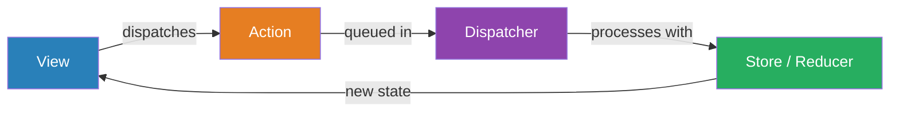
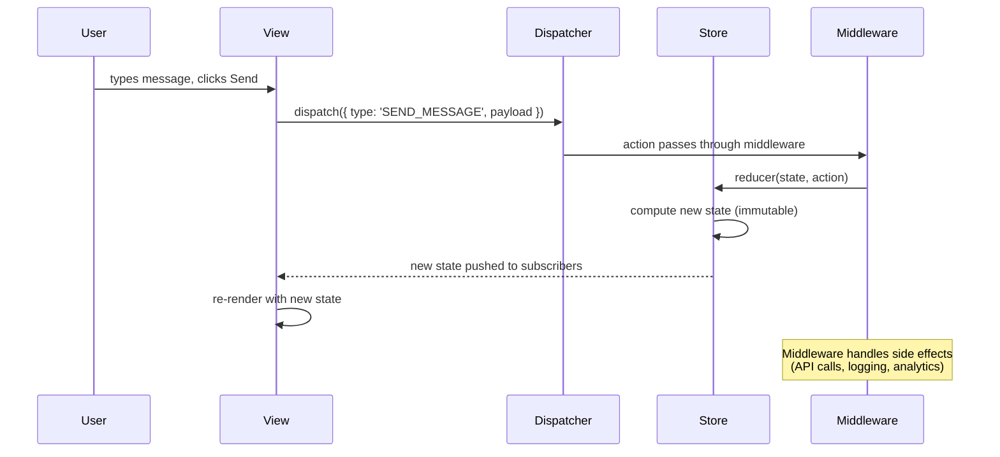
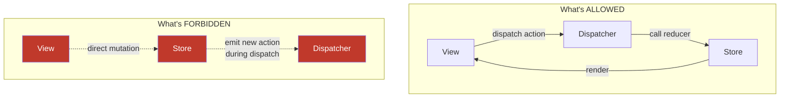

# Flux / Unidirectional Data Flow

## 1. The Problem (Story)

You're building a messaging app — think Slack. The UI has a sidebar with channel list (unread counts), a main chat area, a notification badge in the header, and a thread panel that can be open simultaneously.

Your MVC architecture has a `MessageModel` with observers:

```typescript
// The nightmare: multiple views observing multiple models
channelListView.observe(messageModel);
chatAreaView.observe(messageModel);
headerBadgeView.observe(messageModel);
threadPanelView.observe(messageModel);
channelListView.observe(channelModel);
headerBadgeView.observe(notificationModel);
```

When a new message arrives:
1. `messageModel` updates → `chatAreaView` re-renders ✓
2. `chatAreaView` marks message as read → `messageModel` updates → `channelListView` re-renders (decrement unread count)
3. `channelListView` checks if ALL messages are read → `notificationModel` updates → `headerBadgeView` re-renders
4. But wait — `threadPanelView` also observed the same `messageModel` change, and it updates the thread count, which triggers ANOTHER model update...

The bug report: "Sometimes the unread count shows 3 when there are actually 2 unread messages. Refreshing the page fixes it."

You spend two days debugging. The root cause: when two messages arrive within 50ms, the cascading model→view→model→view updates interleave. View B reads model state that View A hasn't finished updating yet. The unread count becomes stale by 1.

**With bidirectional data flow between models and views, you cannot predict the order of updates. State becomes inconsistent during cascading changes.**

## 2. The Naïve Solutions

### Attempt 1: "Batch updates"

Debounce model notifications so all changes in a tick are applied together:

```typescript
messageModel.batchUpdate(() => {
  addMessage(msg);
  updateUnreadCount(channelId);
  updateNotification();
});
```

This helps for changes you control, but incoming WebSocket messages trigger model updates asynchronously. You can't batch events you don't control. And the real problem — views updating models mid-render — remains.

### Attempt 2: "Single source of truth"

Merge all models into one big AppModel:

```typescript
const appState = { messages: [], channels: [], notifications: [], threads: [] };
```

Better — one object to manage. But views still directly modify it: `appState.notifications.count--` from the header view, while the sidebar view is reading `appState.notifications.count` to decide what to display. Same interleaving problem.

### Attempt 3: "Event bus"

Route all changes through a central event bus:

```typescript
eventBus.emit('message-received', msg);
eventBus.emit('unread-updated', { channelId, count });
```

Now changes are centralized, but any listener can emit more events, creating cascading chains just like MVC. You've renamed the problem from "cascading model updates" to "cascading event emissions." No ordering guarantee.

## 3. The Insight

**Make state changes flow in one direction only: Action → Dispatcher → Store → View → (user interaction) → Action.** Views NEVER modify the store directly. They dispatch actions — plain data objects describing what happened. The dispatcher ensures actions are processed one at a time, serially. No cascading. No interleaving. State transitions become predictable and debuggable. 

## 4. The Pattern

**Flux** (and its popular descendant Redux) enforces **unidirectional data flow**:

- **Action**: A plain object describing what happened: `{ type: 'MESSAGE_RECEIVED', payload: { channelId, text } }`
- **Dispatcher**: A single-threaded queue that processes actions one at a time. No action can be dispatched while another is being processed.
- **Store**: Holds the application state. The ONLY way to change state is to process an action through a reducer/handler. Pure functions: `(state, action) => newState`.
- **View**: Reads from the store. When it needs to change something, it dispatches an action. It never writes to the store.

### Guarantees
- State changes are serialized — no concurrent mutation, no interleaving
- Every state transition is traceable: who dispatched what action, what the state was before and after
- Time-travel debugging: replay actions to reproduce any state
- Views are a pure function of state — given the same store state, the view renders identically

### Non-Guarantees
- Doesn't prevent actions from being dispatched in response to other actions (middleware can still create chains)
- Doesn't solve async complexity (side effects like API calls need separate patterns like thunks or sagas)
- Doesn't guarantee performance — every action triggers a full state recalculation

## 5. Mental Model

**A bank.** You don't walk into the vault and move money between accounts yourself. You fill out a **deposit slip** (Action) with the amount and account number. You hand it to the **teller** (Dispatcher), who processes one slip at a time — no jumping the queue. The teller updates the **ledger** (Store). The account balance shown on your **statement** (View) reflects the ledger's current state. You can't modify the ledger directly — you can only submit slips.

## 6. Structure







## 7. Code Example

### TypeScript — Redux-style store with middleware

```typescript
// ─── ACTIONS ─────────────────────────────────────────
// Actions are plain objects. No classes, no methods. Just data.

interface Action {
  type: string;
  payload?: unknown;
}

interface MessageReceivedAction extends Action {
  type: 'MESSAGE_RECEIVED';
  payload: { channelId: string; text: string; author: string; timestamp: number };
}

interface ChannelSelectedAction extends Action {
  type: 'CHANNEL_SELECTED';
  payload: { channelId: string };
}

interface MessageReadAction extends Action {
  type: 'MESSAGES_READ';
  payload: { channelId: string };
}

type AppAction = MessageReceivedAction | ChannelSelectedAction | MessageReadAction;

// ─── STATE ───────────────────────────────────────────
interface Message {
  id: string;
  channelId: string;
  text: string;
  author: string;
  timestamp: number;
  read: boolean;
}

interface AppState {
  messages: Message[];
  channels: { id: string; name: string }[];
  activeChannelId: string | null;
  unreadCounts: Record<string, number>;  // channelId → count
}

const initialState: AppState = {
  messages: [],
  channels: [
    { id: 'general', name: 'general' },
    { id: 'random', name: 'random' },
  ],
  activeChannelId: null,
  unreadCounts: {},
};

// ─── REDUCER ─────────────────────────────────────────
// Pure function. No side effects. No API calls. No DOM access.
// Given the current state and an action, returns the NEXT state.

let messageCounter = 0;

function appReducer(state: AppState, action: AppAction): AppState {
  switch (action.type) {
    case 'MESSAGE_RECEIVED': {
      const { channelId, text, author, timestamp } = action.payload;
      const isActiveChannel = state.activeChannelId === channelId;
      const newMessage: Message = {
        id: `msg-${++messageCounter}`,
        channelId,
        text,
        author,
        timestamp,
        read: isActiveChannel, // Auto-read if channel is active
      };

      const newUnread = { ...state.unreadCounts };
      if (!isActiveChannel) {
        newUnread[channelId] = (newUnread[channelId] || 0) + 1;
      }

      return {
        ...state,
        messages: [...state.messages, newMessage],
        unreadCounts: newUnread,
      };
    }

    case 'CHANNEL_SELECTED': {
      const { channelId } = action.payload;
      // Mark all messages in this channel as read
      const updatedMessages = state.messages.map(m =>
        m.channelId === channelId ? { ...m, read: true } : m,
      );

      return {
        ...state,
        activeChannelId: channelId,
        messages: updatedMessages,
        unreadCounts: { ...state.unreadCounts, [channelId]: 0 },
      };
    }

    case 'MESSAGES_READ': {
      const { channelId } = action.payload;
      const updatedMessages = state.messages.map(m =>
        m.channelId === channelId ? { ...m, read: true } : m,
      );
      return {
        ...state,
        messages: updatedMessages,
        unreadCounts: { ...state.unreadCounts, [channelId]: 0 },
      };
    }

    default:
      return state;
  }
}

// ─── STORE ───────────────────────────────────────────
type Middleware = (
  store: Store,
  action: Action,
  next: (action: Action) => void,
) => void;

class Store {
  private state: AppState;
  private listeners: Set<(state: AppState) => void> = new Set();
  private reducer: (state: AppState, action: AppAction) => AppState;
  private middleware: Middleware[];
  private isDispatching = false;

  constructor(
    reducer: (state: AppState, action: AppAction) => AppState,
    initialState: AppState,
    middleware: Middleware[] = [],
  ) {
    this.reducer = reducer;
    this.state = initialState;
    this.middleware = middleware;
  }

  getState(): AppState {
    return this.state;
  }

  dispatch(action: AppAction): void {
    if (this.isDispatching) {
      throw new Error(
        `Cannot dispatch "${action.type}" while dispatching. ` +
        'This prevents cascading updates.',
      );
    }

    // Run through middleware chain
    const chain = this.middleware.reduceRight(
      (next: (action: Action) => void, mw: Middleware) =>
        (action: Action) => mw(this, action, next),
      (action: Action) => this.processAction(action as AppAction),
    );

    chain(action);
  }

  private processAction(action: AppAction): void {
    this.isDispatching = true;
    try {
      const prevState = this.state;
      this.state = this.reducer(this.state, action);

      // Only notify if state actually changed
      if (this.state !== prevState) {
        this.listeners.forEach(fn => fn(this.state));
      }
    } finally {
      this.isDispatching = false;
    }
  }

  subscribe(listener: (state: AppState) => void): () => void {
    this.listeners.add(listener);
    return () => this.listeners.delete(listener);
  }
}

// ─── MIDDLEWARE ───────────────────────────────────────
// Middleware handles side effects — the store stays pure.

const loggingMiddleware: Middleware = (store, action, next) => {
  const prevState = store.getState();
  console.log(`[ACTION] ${action.type}`, action.payload ?? '');
  next(action);
  const nextState = store.getState();
  console.log(`[STATE]  unread:`, nextState.unreadCounts);
};

const notificationMiddleware: Middleware = (store, action, next) => {
  next(action);  // Let the reducer run first
  if (action.type === 'MESSAGE_RECEIVED') {
    const state = store.getState();
    const totalUnread = Object.values(state.unreadCounts)
      .reduce((sum, n) => sum + n, 0);
    if (totalUnread > 0) {
      console.log(`🔔 ${totalUnread} unread messages`);
    }
  }
};

// ─── SELECTORS ───────────────────────────────────────
// Functions that compute derived data from state.
// Keep these outside the store — they're just functions.

function selectActiveMessages(state: AppState): Message[] {
  if (!state.activeChannelId) return [];
  return state.messages.filter(m => m.channelId === state.activeChannelId);
}

function selectTotalUnread(state: AppState): number {
  return Object.values(state.unreadCounts).reduce((sum, n) => sum + n, 0);
}

function selectChannelsWithUnread(state: AppState) {
  return state.channels.map(ch => ({
    ...ch,
    unreadCount: state.unreadCounts[ch.id] || 0,
  }));
}

// ─── USAGE ───────────────────────────────────────────
const store = new Store(
  appReducer,
  initialState,
  [loggingMiddleware, notificationMiddleware],
);

// Views subscribe to state changes
store.subscribe((state) => {
  // Sidebar re-renders
  const channels = selectChannelsWithUnread(state);
  console.log('Sidebar:', channels.map(c => `${c.name}(${c.unreadCount})`).join(', '));
});

// Simulate: User selects #general
store.dispatch({ type: 'CHANNEL_SELECTED', payload: { channelId: 'general' } });

// Simulate: Messages arrive
store.dispatch({
  type: 'MESSAGE_RECEIVED',
  payload: { channelId: 'general', text: 'Hello!', author: 'Alice', timestamp: Date.now() },
});

store.dispatch({
  type: 'MESSAGE_RECEIVED',
  payload: { channelId: 'random', text: 'Hey there', author: 'Bob', timestamp: Date.now() },
});

// random has 1 unread, general has 0 (it's active)
console.log('Total unread:', selectTotalUnread(store.getState()));

// Time-travel debugging: replay the same actions on a fresh store → identical state
const replayStore = new Store(appReducer, initialState);
replayStore.dispatch({ type: 'CHANNEL_SELECTED', payload: { channelId: 'general' } });
replayStore.dispatch({
  type: 'MESSAGE_RECEIVED',
  payload: { channelId: 'random', text: 'Hey there', author: 'Bob', timestamp: Date.now() },
});
console.assert(
  selectTotalUnread(replayStore.getState()) === 1,
  'Replayed state should match',
);
```

### Go — Unidirectional store with serial dispatch

```go
package main

import (
	"fmt"
	"sync"
)

// ─── ACTIONS ─────────────────────────────────────────

type Action struct {
	Type    string
	Payload map[string]interface{}
}

// ─── STATE ───────────────────────────────────────────

type Message struct {
	ID        string
	ChannelID string
	Text      string
	Author    string
	Read      bool
}

type AppState struct {
	Messages       []Message
	ActiveChannel  string
	UnreadCounts   map[string]int
}

func NewAppState() AppState {
	return AppState{
		UnreadCounts: make(map[string]int),
	}
}

// ─── REDUCER ─────────────────────────────────────────

var msgCounter int

func appReducer(state AppState, action Action) AppState {
	switch action.Type {
	case "MESSAGE_RECEIVED":
		channelID := action.Payload["channelId"].(string)
		text := action.Payload["text"].(string)
		author := action.Payload["author"].(string)

		msgCounter++
		msg := Message{
			ID:        fmt.Sprintf("msg-%d", msgCounter),
			ChannelID: channelID,
			Text:      text,
			Author:    author,
			Read:      state.ActiveChannel == channelID,
		}

		newMessages := make([]Message, len(state.Messages)+1)
		copy(newMessages, state.Messages)
		newMessages[len(state.Messages)] = msg

		newUnread := copyMap(state.UnreadCounts)
		if state.ActiveChannel != channelID {
			newUnread[channelID]++
		}

		return AppState{
			Messages:      newMessages,
			ActiveChannel: state.ActiveChannel,
			UnreadCounts:  newUnread,
		}

	case "CHANNEL_SELECTED":
		channelID := action.Payload["channelId"].(string)
		newUnread := copyMap(state.UnreadCounts)
		newUnread[channelID] = 0

		return AppState{
			Messages:      state.Messages,
			ActiveChannel: channelID,
			UnreadCounts:  newUnread,
		}

	default:
		return state
	}
}

func copyMap(m map[string]int) map[string]int {
	cp := make(map[string]int, len(m))
	for k, v := range m {
		cp[k] = v
	}
	return cp
}

// ─── STORE ───────────────────────────────────────────

type Store struct {
	mu          sync.Mutex
	state       AppState
	reducer     func(AppState, Action) AppState
	subscribers []func(AppState)
}

func NewStore(reducer func(AppState, Action) AppState, initial AppState) *Store {
	return &Store{
		state:   initial,
		reducer: reducer,
	}
}

func (s *Store) Dispatch(action Action) {
	s.mu.Lock()
	defer s.mu.Unlock()

	s.state = s.reducer(s.state, action)
	for _, fn := range s.subscribers {
		fn(s.state)
	}
}

func (s *Store) GetState() AppState {
	s.mu.Lock()
	defer s.mu.Unlock()
	return s.state
}

func (s *Store) Subscribe(fn func(AppState)) {
	s.mu.Lock()
	defer s.mu.Unlock()
	s.subscribers = append(s.subscribers, fn)
}

// ─── SELECTORS ───────────────────────────────────────

func selectTotalUnread(state AppState) int {
	total := 0
	for _, count := range state.UnreadCounts {
		total += count
	}
	return total
}

// ─── MAIN ────────────────────────────────────────────

func main() {
	store := NewStore(appReducer, NewAppState())

	store.Subscribe(func(state AppState) {
		fmt.Printf("State updated: %d messages, %d unread\n",
			len(state.Messages), selectTotalUnread(state))
	})

	store.Dispatch(Action{
		Type:    "CHANNEL_SELECTED",
		Payload: map[string]interface{}{"channelId": "general"},
	})

	store.Dispatch(Action{
		Type: "MESSAGE_RECEIVED",
		Payload: map[string]interface{}{
			"channelId": "general",
			"text":      "Hello!",
			"author":    "Alice",
		},
	})

	store.Dispatch(Action{
		Type: "MESSAGE_RECEIVED",
		Payload: map[string]interface{}{
			"channelId": "random",
			"text":      "Hey there",
			"author":    "Bob",
		},
	})

	state := store.GetState()
	fmt.Printf("Total unread: %d\n", selectTotalUnread(state))
	// general: 0 (active), random: 1
}
```

## 8. Gotchas & Beginner Mistakes

| Mistake | Why It Happens | Fix |
|---------|---------------|-----|
| Dispatching actions inside reducers | "When X happens, I need to also do Y" | Reducers must be pure. Handle multi-step flows in middleware/thunks. |
| Mutable state updates | `state.messages.push(msg)` instead of spread | Always return new objects. Use spread operator or immer for immutable updates. |
| One giant reducer | "All state logic in one function" | Split into sub-reducers by domain: `messagesReducer`, `channelsReducer`, combine them. |
| Too many actions | An action for every pixel change (`MOUSE_MOVED_1PX`) | Actions represent *meaningful* state transitions, not UI micro-events. |
| Storing derived data in the store | `totalUnread` as a store field alongside `unreadCounts` | Derived data belongs in selectors. Store holds only *source* data. |
| Async logic in reducers | Calling `fetch()` inside the reducer | Reducers are synchronous and pure. Async goes in middleware (thunks, sagas, epics). |

## 9. Related & Confusable Patterns

| Pattern | Relationship | Key Difference |
|---------|-------------|----------------|
| **MVC** | Predecessor | MVC allows bidirectional model↔view flow. Flux enforces unidirectional only. |
| **MVVM** | Alternative | MVVM uses two-way binding. Flux explicitly rejects two-way binding. |
| **Event Sourcing** | Conceptual cousin | Both model state as a sequence of events/actions. Event Sourcing is for persistence; Flux is for UI state. |
| **CQRS** | Complementary | CQRS separates read/write models at the backend. Flux separates dispatch/render at the frontend. |
| **Observer** | Used internally | Store→View notification is Observer. Flux constrains *when* and *how* observers are notified. |
| **Command Pattern** | Actions ARE commands | Flux actions are serializable command objects with type and payload. |

## 10. When This Pattern Is the WRONG Choice

| Scenario | Why Flux Hurts | Better Alternative |
|----------|---------------|-------------------|
| Simple forms with local state | Dispatching an action to update a text field is absurd ceremony | Component-local state (`useState`) |
| Prototypes and MVPs | Action types, reducers, middleware — too much scaffolding for throwaway code | Direct state mutation, refactor later |
| Highly localized interactions | A draggable component doesn't need global state | Local state + event handlers |
| Real-time collaborative editing | Flux assumes a single state owner. Collaborative editing needs CRDTs or OT. | CRDT-based state (Yjs, Automerge) |

**Symptom you've outgrown local state and need Flux**: Multiple components need to react to the same state change, and passing props through 5 levels of nesting has become untenable. You have "prop drilling" and "callback hell" across unrelated components.

**Back-out strategy**: If the store has grown unwieldy, identify which slices of state are truly global (auth, notifications) vs. local (form input, UI toggles). Move local state back to components. Keep Flux only for shared, cross-component state.
