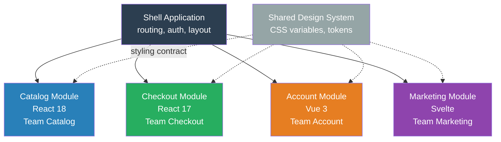
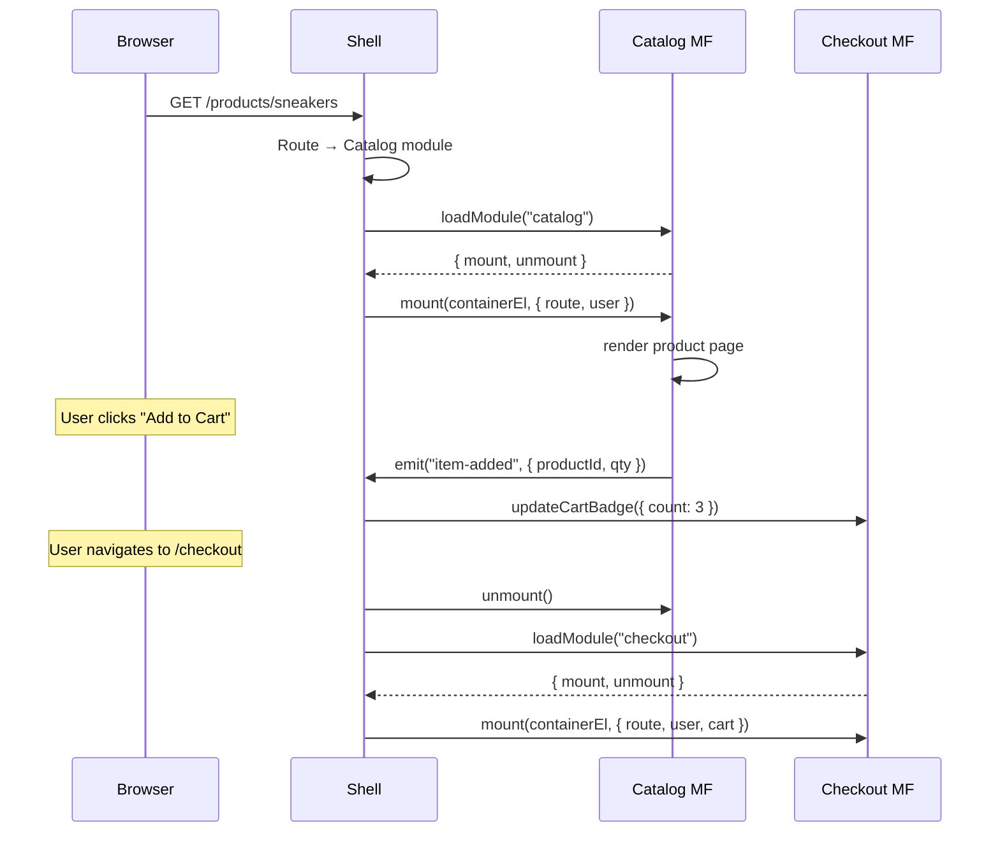
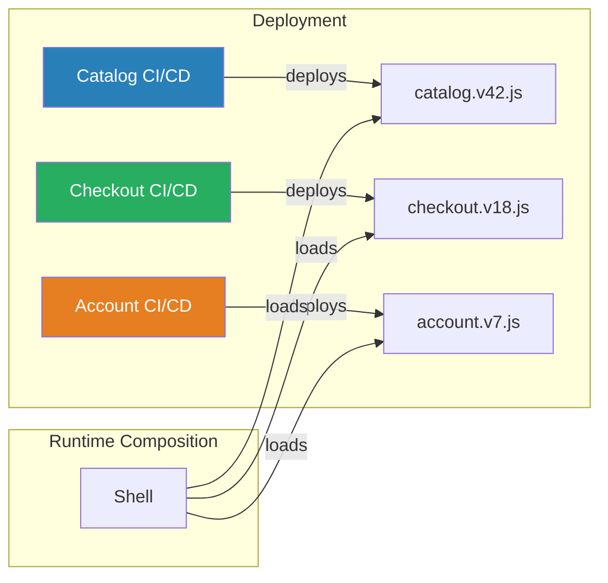

# Micro-Frontends

## 1. The Problem (Story)

Your company's e-commerce platform started as a monolithic React app. 4 teams of engineers work on it:

- **Team Catalog**: Product listing, search, filters
- **Team Checkout**: Cart, payment, order confirmation
- **Team Account**: Profile, orders history, settings
- **Team Marketing**: Landing pages, promotions, banners

All 4 teams commit to the same repository. The CI pipeline takes 45 minutes because it builds everything. Team Catalog needs to upgrade to React 18 for concurrent features. Team Checkout can't — their payment widget depends on a library that only works with React 17. The upgrade is blocked for 3 months until Team Checkout migrates.

Every Friday is deploy day. All 4 teams merge to `main`, run the full test suite, and deploy together. Last Friday, Team Marketing's banner animation broke Team Checkout's payment form — a CSS class name collision. The entire deploy was rolled back. Three features from three teams went unreleased because of one team's bug.

Team Account wants to try Vue for their settings page — it's a better fit for their form-heavy UI. Impossible. The entire app is React. Every component shares React's version, the global CSS, the Webpack config, the state store.

**The frontend monolith forces all teams to move at the speed of the slowest team, share all dependencies, deploy all-or-nothing, and use the same technology forever.**

## 2. The Naïve Solutions

### Attempt 1: "Separate pages, shared header"

Each team owns separate URLs:

```
/products/*   → Team Catalog's React app
/checkout/*   → Team Checkout's React app
/account/*    → Team Account's React app
```

Full page reloads between sections. The header/footer is copy-pasted across apps (or loaded from a CDN). State (cart items, auth) is passed via cookies or localStorage. Works, but:
- Navigation between sections is jarring (full page reload)
- The shared header gets out of sync across apps
- No shared runtime — each app re-downloads React separately (3x bundle)
- Cart state management across apps via localStorage is fragile

### Attempt 2: "npm packages"

Extract shared components into npm packages:

```bash
npm install @company/header @company/footer @company/design-system
```

Each team installs and uses the packages. But:
- Publishing and versioning is slow — Team Catalog needs a header fix, but `@company/header@2.1.4` is in Team Account's backlog to update
- Diamond dependency: Team A uses `@company/ui@3.0`, Team B uses `@company/ui@2.0`, and they both appear on the same page
- Doesn't solve the deploy coupling — each team still deploys their whole app

### Attempt 3: "iframes"

Embed each team's app in an iframe:

```html
<iframe src="https://checkout.internal/cart-widget"></iframe>
```

True isolation — each iframe is a separate browsing context. But:
- They can't share styles (each iframe has its own CSS)
- Communication between iframes is clunky (`postMessage` with serialization)
- Accessibility is broken (screen readers can't see across iframe boundaries)
- Responsive layout is a nightmare (iframes don't auto-resize)

## 3. The Insight

**Apply the same principle that microservices use on the backend: let each team independently develop, test, deploy, and run their portion of the UI.** Compose these independently deployed frontend modules into a single cohesive user experience at runtime. Each team owns a vertical slice — from component to deployment pipeline — and the shell application orchestrates composition.

## 4. The Pattern

**Micro-Frontends** decompose a frontend monolith into smaller, independently deployable applications, each owned by a separate team:

- **Shell (Host/Container)**: The outer application that handles routing, authentication, and layout. It loads and composes micro-frontends at runtime.
- **Micro-Frontend (Remote/Module)**: An independently developed and deployed feature module. It registers itself with the shell and renders into a designated area.
- **Shared Contract**: A minimal API between the shell and each micro-frontend: how to mount, what props to receive, how to communicate.

### Guarantees
- Independent deployment: Team Checkout can deploy without waiting for Team Catalog
- Technology freedom: each micro-frontend can use different frameworks or framework versions
- Failure isolation: if the marketing banner crashes, the checkout flow still works
- Team autonomy: each team owns their CI/CD pipeline, dependencies, and release cadence

### Non-Guarantees
- Doesn't eliminate all coupling (shared auth, shared design system, routing)
- Doesn't prevent bundle size bloat if multiple frameworks are loaded
- Doesn't automatically solve cross-module state sharing
- Doesn't guarantee consistent UX unless a shared design system is enforced

## 5. Mental Model

**A shopping mall.** The mall (Shell) provides the building, hallways, entrances, and directory sign. Each store (Micro-Frontend) is independently operated — different owners, different inventory systems, different interior designs. One store can renovate without closing the mall. A new store can open without affecting existing ones. The mall provides shared infrastructure (electricity, HVAC, parking), but each store controls its own space. Customers walk between stores seamlessly.

## 6. Structure







## 7. Code Example

### TypeScript — Shell with dynamic module loading

```typescript
// ─── MICRO-FRONTEND CONTRACT ─────────────────────────
// Every micro-frontend must implement this interface.
// This is the ENTIRE API between the shell and the module.

interface MicroFrontend {
  name: string;

  /** Mount the module into the given container */
  mount(container: HTMLElement | any, props: MountProps): void;

  /** Clean up everything — DOM, timers, subscriptions */
  unmount(): void;

  /** Optional: receive updates without full remount */
  update?(props: Partial<MountProps>): void;
}

interface MountProps {
  route: string;
  basePath: string;
  user: { id: string; name: string; role: string } | null;
  onNavigate: (path: string) => void;
  onEvent: (event: ShellEvent) => void;
}

interface ShellEvent {
  type: string;
  source: string;
  payload: unknown;
}

// ─── MODULE REGISTRY ─────────────────────────────────
// Maps routes to module loaders. Modules are loaded lazily.

interface ModuleConfig {
  name: string;
  activeWhen: (path: string) => boolean;
  load: () => Promise<MicroFrontend>;
}

class ModuleRegistry {
  private configs: ModuleConfig[] = [];
  private loadedModules: Map<string, MicroFrontend> = new Map();

  register(config: ModuleConfig): void {
    this.configs.push(config);
    console.log(`[Registry] Registered: ${config.name}`);
  }

  getModuleForRoute(path: string): ModuleConfig | undefined {
    return this.configs.find(c => c.activeWhen(path));
  }

  async loadModule(name: string): Promise<MicroFrontend> {
    if (this.loadedModules.has(name)) {
      return this.loadedModules.get(name)!;
    }

    const config = this.configs.find(c => c.name === name);
    if (!config) throw new Error(`Unknown module: ${name}`);

    console.log(`[Registry] Loading module: ${name}...`);
    const module = await config.load();
    this.loadedModules.set(name, module);
    console.log(`[Registry] Loaded: ${name}`);
    return module;
  }
}

// ─── EVENT BUS (cross-module communication) ──────────
// Modules never call each other directly. They communicate
// through the shell's event bus.

class EventBus {
  private handlers: Map<string, Set<(event: ShellEvent) => void>> = new Map();

  on(eventType: string, handler: (event: ShellEvent) => void): () => void {
    if (!this.handlers.has(eventType)) {
      this.handlers.set(eventType, new Set());
    }
    this.handlers.get(eventType)!.add(handler);
    return () => this.handlers.get(eventType)?.delete(handler);
  }

  emit(event: ShellEvent): void {
    console.log(`[EventBus] ${event.source} → ${event.type}`, event.payload);
    this.handlers.get(event.type)?.forEach(fn => fn(event));
    this.handlers.get('*')?.forEach(fn => fn(event)); // Wildcard listeners
  }
}

// ─── SHELL APPLICATION ───────────────────────────────

class ShellApplication {
  private registry = new ModuleRegistry();
  private eventBus = new EventBus();
  private currentModule: MicroFrontend | null = null;
  private currentRoute = '/';
  private user: MountProps['user'] = null;

  // Simulated container element
  private container: any = { id: 'app-container' };

  constructor() {
    this.registerModules();
    this.setupEventHandlers();
  }

  private registerModules(): void {
    // Each module is loaded from a separate URL (independently deployed)
    this.registry.register({
      name: 'catalog',
      activeWhen: (path) => path.startsWith('/products'),
      load: async () => {
        // In production: await import('https://cdn.example.com/catalog/v42/index.js')
        return new CatalogModule();
      },
    });

    this.registry.register({
      name: 'checkout',
      activeWhen: (path) => path.startsWith('/checkout') || path.startsWith('/cart'),
      load: async () => {
        return new CheckoutModule();
      },
    });

    this.registry.register({
      name: 'account',
      activeWhen: (path) => path.startsWith('/account'),
      load: async () => {
        return new AccountModule();
      },
    });
  }

  private setupEventHandlers(): void {
    // Cross-module event handling
    this.eventBus.on('item-added-to-cart', (event) => {
      console.log(`[Shell] Cart updated from ${event.source}`);
      // Notify checkout module to update badge
      if (this.currentModule) {
        this.currentModule.update?.({ route: this.currentRoute });
      }
    });
  }

  async navigate(path: string): Promise<void> {
    console.log(`\n[Shell] Navigating to: ${path}`);

    // Unmount current module
    if (this.currentModule) {
      console.log(`[Shell] Unmounting: ${this.currentModule.name}`);
      this.currentModule.unmount();
      this.currentModule = null;
    }

    // Find and load the module for this route
    const config = this.registry.getModuleForRoute(path);
    if (!config) {
      console.log(`[Shell] No module found for: ${path}`);
      return;
    }

    const module = await this.registry.loadModule(config.name);
    this.currentRoute = path;

    // Mount with shell-provided props
    module.mount(this.container, {
      route: path,
      basePath: path.split('/').slice(0, 2).join('/'),
      user: this.user,
      onNavigate: (newPath) => this.navigate(newPath),
      onEvent: (event) => this.eventBus.emit(event),
    });

    this.currentModule = module;
  }

  setUser(user: MountProps['user']): void {
    this.user = user;
    this.currentModule?.update?.({ user });
  }
}

// ─── MICRO-FRONTENDS (each independently developed) ──

class CatalogModule implements MicroFrontend {
  name = 'catalog';
  private container: any;
  private props!: MountProps;

  mount(container: any, props: MountProps): void {
    this.container = container;
    this.props = props;
    console.log(`[Catalog] Mounted at ${props.route}`);
    console.log(`[Catalog] Rendering product list...`);
  }

  unmount(): void {
    console.log(`[Catalog] Unmounted — cleaning up subscriptions`);
    this.container = null;
  }

  update(props: Partial<MountProps>): void {
    if (props.route) {
      console.log(`[Catalog] Route updated to ${props.route}`);
    }
  }

  // Called by a button in the catalog UI
  addToCart(productId: string): void {
    this.props.onEvent({
      type: 'item-added-to-cart',
      source: 'catalog',
      payload: { productId, quantity: 1 },
    });
    // Navigate to cart
    this.props.onNavigate('/cart');
  }
}

class CheckoutModule implements MicroFrontend {
  name = 'checkout';
  private container: any;

  mount(container: any, props: MountProps): void {
    this.container = container;
    console.log(`[Checkout] Mounted at ${props.route}`);
    console.log(`[Checkout] User: ${props.user?.name ?? 'guest'}`);
  }

  unmount(): void {
    console.log(`[Checkout] Unmounted`);
    this.container = null;
  }
}

class AccountModule implements MicroFrontend {
  name = 'account';
  private container: any;

  mount(container: any, props: MountProps): void {
    this.container = container;
    console.log(`[Account] Mounted at ${props.route}`);
  }

  unmount(): void {
    console.log(`[Account] Unmounted`);
    this.container = null;
  }

  update(props: Partial<MountProps>): void {
    if (props.user) {
      console.log(`[Account] User context updated: ${props.user.name}`);
    }
  }
}

// ─── USAGE ───────────────────────────────────────────

async function demo() {
  const shell = new ShellApplication();

  // Set user context (shared across all modules)
  shell.setUser({ id: 'u1', name: 'Alice', role: 'customer' });

  // Navigate to catalog
  await shell.navigate('/products/sneakers');

  // Navigate to checkout (catalog unmounts, checkout mounts)
  await shell.navigate('/checkout');

  // Navigate to account (checkout unmounts, account mounts)
  await shell.navigate('/account/settings');
}

demo();
```

### Go — Shell with module registration

```go
package main

import "fmt"

// ─── CONTRACT ────────────────────────────────────────

type MountProps struct {
	Route     string
	User      *User
	OnNavigate func(path string)
	OnEvent   func(event Event)
}

type User struct {
	ID   string
	Name string
}

type Event struct {
	Type    string
	Source  string
	Payload interface{}
}

type MicroFrontend interface {
	Name() string
	Mount(props MountProps)
	Unmount()
}

// ─── SHELL ───────────────────────────────────────────

type RouteConfig struct {
	Name      string
	Match     func(path string) bool
	Factory   func() MicroFrontend
}

type Shell struct {
	routes  []RouteConfig
	current MicroFrontend
	user    *User
}

func NewShell() *Shell {
	return &Shell{}
}

func (s *Shell) Register(config RouteConfig) {
	s.routes = append(s.routes, config)
	fmt.Printf("[Shell] Registered: %s\n", config.Name)
}

func (s *Shell) Navigate(path string) {
	fmt.Printf("\n[Shell] Navigating to: %s\n", path)

	if s.current != nil {
		fmt.Printf("[Shell] Unmounting: %s\n", s.current.Name())
		s.current.Unmount()
	}

	for _, route := range s.routes {
		if route.Match(path) {
			mf := route.Factory()
			mf.Mount(MountProps{
				Route: path,
				User:  s.user,
				OnNavigate: func(p string) { s.Navigate(p) },
				OnEvent: func(e Event) {
					fmt.Printf("[Shell] Event: %s from %s\n", e.Type, e.Source)
				},
			})
			s.current = mf
			return
		}
	}
	fmt.Printf("[Shell] No module for: %s\n", path)
}

// ─── MICRO-FRONTENDS ─────────────────────────────────

type CatalogModule struct{}

func (m *CatalogModule) Name() string { return "catalog" }
func (m *CatalogModule) Mount(props MountProps) {
	fmt.Printf("[Catalog] Mounted at %s (user: %s)\n", props.Route, props.User.Name)
}
func (m *CatalogModule) Unmount() {
	fmt.Println("[Catalog] Unmounted")
}

type CheckoutModule struct{}

func (m *CheckoutModule) Name() string { return "checkout" }
func (m *CheckoutModule) Mount(props MountProps) {
	fmt.Printf("[Checkout] Mounted at %s\n", props.Route)
}
func (m *CheckoutModule) Unmount() {
	fmt.Println("[Checkout] Unmounted")
}

// ─── MAIN ────────────────────────────────────────────

func main() {
	shell := NewShell()
	shell.user = &User{ID: "u1", Name: "Alice"}

	shell.Register(RouteConfig{
		Name:    "catalog",
		Match:   func(p string) bool { return len(p) >= 9 && p[:9] == "/products" },
		Factory: func() MicroFrontend { return &CatalogModule{} },
	})

	shell.Register(RouteConfig{
		Name:    "checkout",
		Match:   func(p string) bool { return len(p) >= 9 && p[:9] == "/checkout" },
		Factory: func() MicroFrontend { return &CheckoutModule{} },
	})

	shell.Navigate("/products/sneakers")
	shell.Navigate("/checkout")
}
```

## 8. Gotchas & Beginner Mistakes

| Mistake | Why It Happens | Fix |
|---------|---------------|-----|
| Shared global state | Modules write to `window.appState` or a shared Redux store | Each module owns its state. Cross-module communication goes through the shell's event bus. |
| CSS collisions | `.button { color: red }` from Module A overrides Module B | Use CSS Modules, Shadow DOM, BEM with module prefix, or CSS-in-JS scoping |
| Version conflicts | Module A loads React 17, Module B loads React 18 — both on the same page | Share a single version of major dependencies (React) through shell, or use Module Federation's shared scope |
| No shared design system | Each team builds their own buttons, inputs, cards | Publish a versioned design system as CSS variables + web components. All modules consume it. |
| Over-decomposition | 15 micro-frontends for 15 UI sections | Align modules with team boundaries, not UI sections. One team = one micro-frontend (usually). |
| Synchronous module loading | Loading all micro-frontends upfront on page load | Lazy-load modules per route. Only load checkout when the user navigates to checkout. |

## 9. Related & Confusable Patterns

| Pattern | Relationship | Key Difference |
|---------|-------------|----------------|
| **Microservices** | Backend equivalent | Microservices decompose the backend by domain. Micro-frontends decompose the frontend by team/domain. |
| **Component Composition** | Finer-grained | Components compose within a single app. Micro-frontends compose independently deployed apps. |
| **Module Federation** | Implementation | Webpack Module Federation is one way to implement micro-frontends (share at runtime, not build time). |
| **Backend-for-Frontend (BFF)** | Complementary | Each micro-frontend can have its own BFF that aggregates backend APIs specific to its needs. |
| **Plugin Architecture** | Similar loading model | Plugins extend a host app. Micro-frontends are more about team independence than extensibility. |
| **Web Components** | Integration technology | Web Components (Custom Elements, Shadow DOM) can be used as the integration boundary between micro-frontends. |

## 10. When This Pattern Is the WRONG Choice

| Scenario | Why Micro-Frontends Hurt | Better Alternative |
|----------|-------------------------|-------------------|
| Small team (< 8 developers) | Coordination overhead exceeds overhead of the monolith | Monolithic frontend with module structure |
| Highly coupled UI (every section depends on every other) | Modules can't be independent if they share 80% of their state | Monolith with good state management |
| Early-stage product | Architecture astronautics for an MVP that might pivot | Single app, extract modules when team size demands it |
| Performance-critical apps | Multiple framework runtimes increase bundle size | Single framework, code-split aggressively |
| Consistent UX is paramount | Ensuring pixel-perfect consistency across independently deployed modules is hard | Monolith with a shared component library |

**Symptom you need micro-frontends**: Deploy queues. Team A blocks Team B's release. Merge conflicts across teams are a daily occurrence. The CI pipeline takes >30 minutes. A one-line CSS change requires coordinating with 3 teams.

**Back-out strategy**: Merge micro-frontends back into a monolith by keeping the module structure but removing the independent deployment. Each "module" becomes a lazy-loaded chunk in a single build. You lose independent deployment but gain simpler infrastructure. This is often the right move when team boundaries shift.
