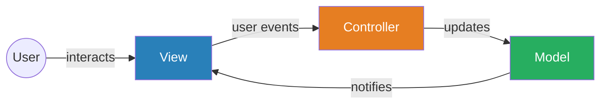
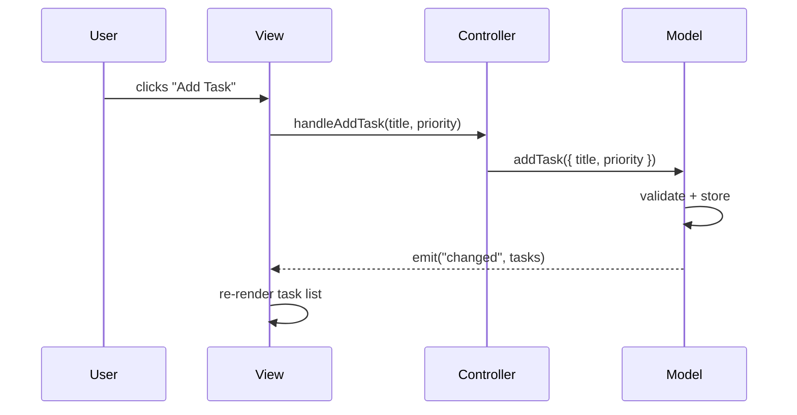
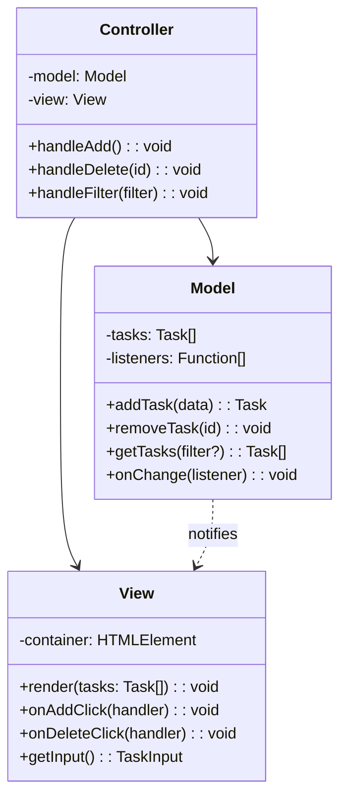

# MVC — Model-View-Controller

## 1. The Problem (Story)

You're building a task management web app. The first version is a single file — 800 lines of jQuery. Click handlers directly modify the DOM, read values from input fields, make AJAX calls to the server, and update multiple parts of the page:

```typescript
// The horror show
$('#add-task-btn').click(() => {
  const title = $('#task-input').val();
  const priority = $('#priority-select').val();
  
  // Validate
  if (!title) {
    $('#error-msg').text('Title required').show();
    return;
  }
  
  // Save to server
  $.post('/api/tasks', { title, priority }, (task) => {
    // Update task list
    $('#task-list').append(`<li id="task-${task.id}">${task.title}</li>`);
    // Update counter
    const count = parseInt($('#task-count').text()) + 1;
    $('#task-count').text(count);
    // Update chart
    updatePriorityChart();
    // Clear input
    $('#task-input').val('');
    // Update sidebar stats
    refreshSidebar();
  });
});
```

Every click handler touches everything. Adding a new feature (say, task filtering) means reading and modifying 15 click handlers because the task list, the counter, the chart, and the sidebar all need to agree. Two developers can't work on the same page because every function reaches into every DOM element.

A junior developer adds a "due date" feature. It works — except now the sidebar shows the wrong count, because she updated the task list rendering but missed the sidebar's count logic. The bug takes 3 hours to find because the sidebar code is inside the "delete task" handler, 400 lines away from the "add task" handler.

**The codebase has no concept of where data lives versus how it's displayed.**

## 2. The Naïve Solutions

### Attempt 1: "Organize by feature"

Group all task-related code together:

```typescript
// tasks.ts — all task stuff here
function addTask() { /* DOM + data + AJAX */ }
function deleteTask() { /* DOM + data + AJAX */ }
function filterTasks() { /* DOM + data + AJAX */ }
```

Better file organization, but each function still mixes data manipulation, server calls, and DOM updates. Change the task list HTML structure? You still touch every function.

### Attempt 2: "Helper functions"

Extract repeated DOM operations:

```typescript
function updateTaskCount(delta: number) { /* ... */ }
function renderTask(task: Task) { /* ... */ }
function showError(msg: string) { /* ... */ }
```

Reduces duplication, but there's no structure. Who calls whom? The render function reads from the server. The update function modifies the DOM. Data flows in every direction. When something goes wrong, you can't tell whether it's a data bug or a display bug.

### Attempt 3: "God object"

Put all state in one big object:

```typescript
const appState = { tasks: [], filter: 'all', user: null };
```

Now you know where the data is, but every part of the code still reaches into `appState` and the DOM directly. There's no rule about *when* or *how* the view should update after state changes.

## 3. The Insight

**Separate what the application *knows* (data + business rules) from what the user *sees* (display) from what the user *does* (input handling).** The model doesn't know about buttons. The view doesn't know about databases. The controller translates user gestures into model operations and tells the view to refresh.

## 4. The Pattern

**Model-View-Controller (MVC)** divides an application into three interconnected responsibilities:

- **Model**: Owns the data and business logic. Notifies observers when state changes. Knows nothing about the UI.
- **View**: Renders data to the user. Reads from the model but never writes to it directly. Reports user actions.
- **Controller**: Receives user input from the view, translates it into operations on the model, and may select which view to display.

### Guarantees
- Business logic is testable without a UI
- Views can be swapped without changing the model
- Multiple views can observe the same model simultaneously
- Clear ownership: data bugs → model, display bugs → view, flow bugs → controller

### Non-Guarantees
- Doesn't prevent complex view-to-view dependencies
- Doesn't prescribe how the model notifies the view (varies by framework)
- Doesn't eliminate all coupling — the controller must know both model and view interfaces

## 5. Mental Model

**A restaurant.** The kitchen (Model) prepares food based on orders. It doesn't know table 5 has a birthday — it just makes dishes. The waiter (Controller) takes orders from the diner, translates "I'll have the special" into a kitchen ticket, and carries finished plates to the table. The table setting and plate presentation (View) shows the food. The diner never walks into the kitchen. The kitchen never walks to the table. The waiter bridges both worlds.

## 6. Structure







## 7. Code Example

### TypeScript — Task manager with MVC

```typescript
// ─── MODEL ───────────────────────────────────────────
interface Task {
  id: string;
  title: string;
  priority: 'low' | 'medium' | 'high';
  completed: boolean;
  createdAt: Date;
}

type ModelEvent = 'tasks-changed' | 'error';

class TaskModel {
  private tasks: Map<string, Task> = new Map();
  private listeners: Map<ModelEvent, Set<Function>> = new Map();
  private nextId = 1;

  on(event: ModelEvent, listener: Function): void {
    if (!this.listeners.has(event)) {
      this.listeners.set(event, new Set());
    }
    this.listeners.get(event)!.add(listener);
  }

  private emit(event: ModelEvent, data?: unknown): void {
    this.listeners.get(event)?.forEach(fn => fn(data));
  }

  addTask(title: string, priority: Task['priority']): Task {
    if (!title.trim()) {
      this.emit('error', 'Title cannot be empty');
      throw new Error('Title cannot be empty');
    }

    const task: Task = {
      id: String(this.nextId++),
      title: title.trim(),
      priority,
      completed: false,
      createdAt: new Date(),
    };

    this.tasks.set(task.id, task);
    this.emit('tasks-changed', this.getAllTasks());
    return task;
  }

  toggleTask(id: string): void {
    const task = this.tasks.get(id);
    if (!task) {
      this.emit('error', `Task ${id} not found`);
      return;
    }
    task.completed = !task.completed;
    this.emit('tasks-changed', this.getAllTasks());
  }

  removeTask(id: string): void {
    if (!this.tasks.delete(id)) {
      this.emit('error', `Task ${id} not found`);
      return;
    }
    this.emit('tasks-changed', this.getAllTasks());
  }

  getAllTasks(): Task[] {
    return Array.from(this.tasks.values());
  }

  getByPriority(priority: Task['priority']): Task[] {
    return this.getAllTasks().filter(t => t.priority === priority);
  }

  getStats(): { total: number; completed: number; byPriority: Record<string, number> } {
    const tasks = this.getAllTasks();
    return {
      total: tasks.length,
      completed: tasks.filter(t => t.completed).length,
      byPriority: {
        high: tasks.filter(t => t.priority === 'high').length,
        medium: tasks.filter(t => t.priority === 'medium').length,
        low: tasks.filter(t => t.priority === 'low').length,
      },
    };
  }
}

// ─── VIEW ────────────────────────────────────────────
// The view knows about the DOM, but not about business logic.
// It exposes methods for rendering and for binding event handlers.

interface TaskViewHandlers {
  onAdd: (title: string, priority: Task['priority']) => void;
  onToggle: (id: string) => void;
  onDelete: (id: string) => void;
}

class TaskView {
  private handlers!: TaskViewHandlers;

  // In a real app, this would manipulate the DOM.
  // Here we model it as string output for testability.
  private rendered: string[] = [];

  bind(handlers: TaskViewHandlers): void {
    this.handlers = handlers;
  }

  renderTasks(tasks: Task[]): void {
    this.rendered = tasks.map(t => {
      const status = t.completed ? '✓' : '○';
      return `[${status}] (${t.priority}) ${t.title}`;
    });
  }

  renderError(message: string): void {
    this.rendered = [`ERROR: ${message}`];
  }

  renderStats(stats: { total: number; completed: number }): void {
    // Sidebar/footer stats rendering
  }

  getRendered(): string[] {
    return [...this.rendered];
  }

  // Simulate user interactions (called by tests or actual DOM event listeners)
  simulateAdd(title: string, priority: Task['priority']): void {
    this.handlers.onAdd(title, priority);
  }

  simulateToggle(id: string): void {
    this.handlers.onToggle(id);
  }

  simulateDelete(id: string): void {
    this.handlers.onDelete(id);
  }
}

// ─── CONTROLLER ──────────────────────────────────────
// The controller is the glue. It wires model events to view updates,
// and view events to model mutations. It contains NO business logic.

class TaskController {
  constructor(
    private model: TaskModel,
    private view: TaskView,
  ) {
    // Wire view events → model operations
    this.view.bind({
      onAdd: (title, priority) => this.handleAdd(title, priority),
      onToggle: (id) => this.handleToggle(id),
      onDelete: (id) => this.handleDelete(id),
    });

    // Wire model events → view updates
    this.model.on('tasks-changed', (tasks: Task[]) => {
      this.view.renderTasks(tasks);
      this.view.renderStats(this.model.getStats());
    });

    this.model.on('error', (message: string) => {
      this.view.renderError(message);
    });
  }

  private handleAdd(title: string, priority: Task['priority']): void {
    try {
      this.model.addTask(title, priority);
    } catch {
      // Model already emits error event
    }
  }

  private handleToggle(id: string): void {
    this.model.toggleTask(id);
  }

  private handleDelete(id: string): void {
    this.model.removeTask(id);
  }
}

// ─── USAGE ───────────────────────────────────────────
const model = new TaskModel();
const view = new TaskView();
const controller = new TaskController(model, view);

// User adds tasks
view.simulateAdd('Write MVC pattern document', 'high');
view.simulateAdd('Review pull request', 'medium');
view.simulateAdd('Update dependencies', 'low');

console.log(view.getRendered());
// ['[○] (high) Write MVC pattern document',
//  '[○] (medium) Review pull request',
//  '[○] (low) Update dependencies']

// User completes a task
view.simulateToggle('1');

console.log(view.getRendered());
// ['[✓] (high) Write MVC pattern document',
//  '[○] (medium) Review pull request',
//  '[○] (low) Update dependencies']

// Test the model independently — no view needed
const testModel = new TaskModel();
testModel.addTask('Test task', 'high');
console.assert(testModel.getAllTasks().length === 1);
console.assert(testModel.getByPriority('high').length === 1);
console.assert(testModel.getByPriority('low').length === 0);
```

### Go — MVC with interfaces and observer

```go
package main

import (
	"fmt"
	"strings"
	"sync"
)

// ─── MODEL ───────────────────────────────────────────

type Task struct {
	ID        int
	Title     string
	Priority  string
	Completed bool
}

type ModelObserver interface {
	OnTasksChanged(tasks []Task)
	OnError(message string)
}

type TaskModel struct {
	mu        sync.RWMutex
	tasks     map[int]*Task
	nextID    int
	observers []ModelObserver
}

func NewTaskModel() *TaskModel {
	return &TaskModel{tasks: make(map[int]*Task), nextID: 1}
}

func (m *TaskModel) AddObserver(obs ModelObserver) {
	m.observers = append(m.observers, obs)
}

func (m *TaskModel) notify() {
	tasks := m.GetAll()
	for _, obs := range m.observers {
		obs.OnTasksChanged(tasks)
	}
}

func (m *TaskModel) notifyError(msg string) {
	for _, obs := range m.observers {
		obs.OnError(msg)
	}
}

func (m *TaskModel) AddTask(title, priority string) (Task, error) {
	m.mu.Lock()
	defer m.mu.Unlock()

	if strings.TrimSpace(title) == "" {
		m.notifyError("title cannot be empty")
		return Task{}, fmt.Errorf("title cannot be empty")
	}

	task := &Task{
		ID:       m.nextID,
		Title:    strings.TrimSpace(title),
		Priority: priority,
	}
	m.nextID++
	m.tasks[task.ID] = task
	m.notify()
	return *task, nil
}

func (m *TaskModel) ToggleTask(id int) {
	m.mu.Lock()
	defer m.mu.Unlock()

	task, ok := m.tasks[id]
	if !ok {
		m.notifyError(fmt.Sprintf("task %d not found", id))
		return
	}
	task.Completed = !task.Completed
	m.notify()
}

func (m *TaskModel) GetAll() []Task {
	m.mu.RLock()
	defer m.mu.RUnlock()

	result := make([]Task, 0, len(m.tasks))
	for _, t := range m.tasks {
		result = append(result, *t)
	}
	return result
}

// ─── VIEW ────────────────────────────────────────────

type TaskView struct {
	rendered []string
}

func (v *TaskView) OnTasksChanged(tasks []Task) {
	v.rendered = make([]string, len(tasks))
	for i, t := range tasks {
		status := "○"
		if t.Completed {
			status = "✓"
		}
		v.rendered[i] = fmt.Sprintf("[%s] (%s) %s", status, t.Priority, t.Title)
	}
}

func (v *TaskView) OnError(message string) {
	v.rendered = []string{fmt.Sprintf("ERROR: %s", message)}
}

func (v *TaskView) GetRendered() []string {
	return v.rendered
}

// ─── CONTROLLER ──────────────────────────────────────

type TaskController struct {
	model *TaskModel
	view  *TaskView
}

func NewTaskController(model *TaskModel, view *TaskView) *TaskController {
	model.AddObserver(view) // View observes Model
	return &TaskController{model: model, view: view}
}

func (c *TaskController) HandleAdd(title, priority string) {
	c.model.AddTask(title, priority)
}

func (c *TaskController) HandleToggle(id int) {
	c.model.ToggleTask(id)
}

func main() {
	model := NewTaskModel()
	view := &TaskView{}
	ctrl := NewTaskController(model, view)

	ctrl.HandleAdd("Write MVC doc", "high")
	ctrl.HandleAdd("Review PR", "medium")

	for _, line := range view.GetRendered() {
		fmt.Println(line)
	}

	ctrl.HandleToggle(1)
	fmt.Println("--- after toggle ---")
	for _, line := range view.GetRendered() {
		fmt.Println(line)
	}
}
```

## 8. Gotchas & Beginner Mistakes

| Mistake | Why It Happens | Fix |
|---------|---------------|-----|
| Business logic in the controller | Controller is the first code you write, so logic accumulates there | Controller should only translate events into model calls — zero `if` logic about domain rules |
| View reads from the database | "The view needs data, so let me query directly" | View reads **only** from model. Model handles persistence. |
| Fat models with rendering code | "The model knows the data, so it should format it" | Model knows nothing about HTML, CSS, or display format |
| Circular updates | Model change → view update → triggers another model change → infinite loop | Views should never modify the model during a render cycle |
| Skipping the controller for "simple" updates | "I'll just update the model from the view this one time" | Once you skip the controller, every developer does. Discipline collapses. |
| One model per view | Creating separate models for each view component | Models represent domain concepts, not screens. Multiple views can share one model. |

## 9. Related & Confusable Patterns

| Pattern | Relationship | Key Difference |
|---------|-------------|----------------|
| **MVVM** | Evolution of MVC | Replaces controller with ViewModel + data binding. View never calls methods — it binds to properties. |
| **Flux** | Reaction against MVC | Enforces strict unidirectional flow. In MVC, the model can notify the view directly (bidirectional). |
| **Observer** | Used inside MVC | The model→view notification IS the Observer pattern. MVC uses it, doesn't replace it. |
| **Mediator** | Similar role to controller | Controller mediates between model and view, but it's domain-specific, not a generic mediator. |
| **Repository** | Complements MVC | The model may use Repository internally for data access, but Repository isn't part of MVC itself. |
| **Component Composition** | Finer-grained | MVC divides by responsibility. Components divide by UI region. Modern apps often use both. |

## 10. When This Pattern Is the WRONG Choice

| Scenario | Why MVC Hurts | Better Alternative |
|----------|--------------|-------------------|
| Simple static pages | Three classes for a page that never changes is over-engineering | Plain HTML/CSS templates |
| Highly interactive UIs with many state dependencies | Model→view notification becomes a web of callbacks as state grows | Flux/Redux with unidirectional data flow |
| Fine-grained reactivity (spreadsheet-like) | MVC re-renders the whole view on any model change | Reactive state (Signals/Observables) for cell-level updates |
| Server-rendered apps with minimal client logic | MVC implies a rich client — server templates are simpler | Server-side rendering with thin client sprinkles |

**Symptom you've outgrown MVC**: Multiple views listening to the same model start conflicting. View A updates the model, which notifies View B, which updates the model again, which notifies View A. You have cascading update loops and can't trace which change caused which re-render.

**Back-out strategy**: Extract the model layer (keep it!), replace the controller + notification system with a unidirectional store (Flux/Redux). The model's business logic survives; only the wiring changes.
