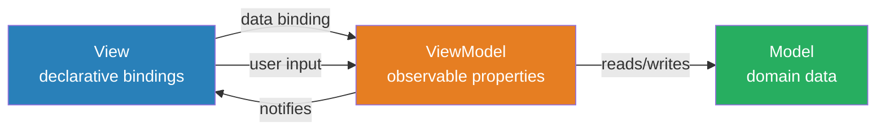
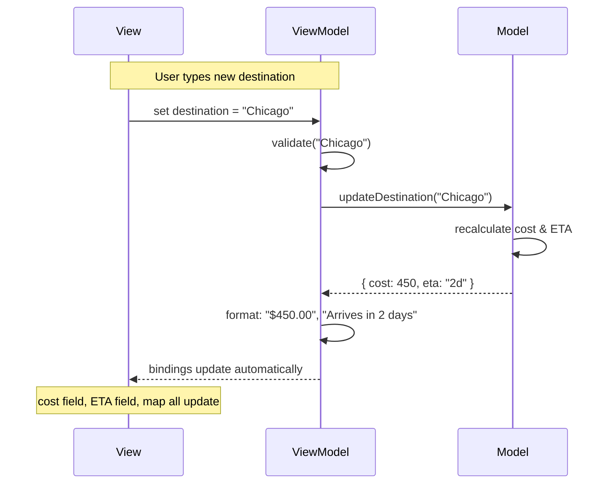
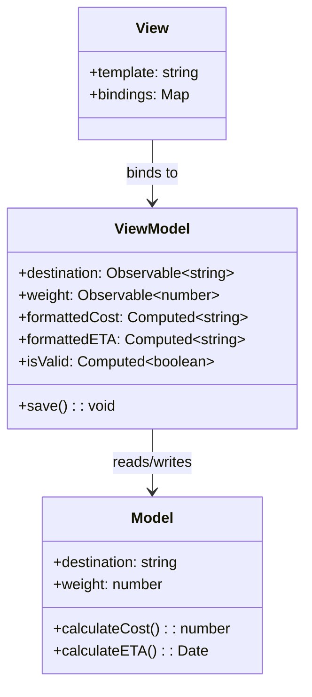

# MVVM — Model-View-ViewModel

## 1. The Problem (Story)

You're building a real-time dashboard for a logistics company. The dashboard shows shipment details — origin, destination, status, estimated arrival, weight, cost. Every time a field changes on the server, the UI must update. Every time the user edits a field (like rerouting a shipment), the model must update.

Your MVC implementation has a controller with 47 methods. Each one:
1. Reads a value from the model
2. Finds the correct DOM element
3. Sets the element's value
4. Attaches an event listener for user edits
5. In the listener, reads the DOM element, validates, and writes back to the model

```typescript
// Controller method #23 of 47
handleDestinationChange(): void {
  // Model → View
  const dest = this.model.getShipment().destination;
  document.getElementById('dest-input')!.value = dest;
  
  // View → Model
  document.getElementById('dest-input')!.addEventListener('input', (e) => {
    const newDest = (e.target as HTMLInputElement).value;
    if (this.validateDestination(newDest)) {
      this.model.updateDestination(newDest);
      // Also update the map widget
      this.view.updateMap(newDest);
      // Also update the cost estimate
      this.view.updateCost(this.model.calculateCost());
      // Also update the ETA
      this.view.updateETA(this.model.calculateETA());
    }
  });
}
```

Every field has the same pattern: read from model, write to DOM, listen for changes, write back to model, update dependent fields. The controller is 1,200 lines of mechanical plumbing. When you add a new field, you write the same boilerplate. When you rename a DOM element, you break three controller methods. When the model emits a change event, you manually identify which of 23 DOM elements need updating.

**The controller has become a manual synchronization layer between the model and the view.** You're writing the same bidirectional binding code 47 times.

## 2. The Naïve Solutions

### Attempt 1: "Generate bindings"

Write a utility that auto-generates controller methods from a config:

```typescript
const bindings = [
  { model: 'destination', element: '#dest-input', type: 'input' },
  { model: 'weight', element: '#weight-input', type: 'number' },
  // ... 45 more
];
```

This reduces boilerplate for simple fields, but complex fields (destination → map + cost + ETA) still need custom logic. You end up with a config for simple cases and a controller for complex ones — two systems to maintain.

### Attempt 2: "Dirty checking"

Poll the model and the DOM on a timer, detect changes, and sync:

```typescript
setInterval(() => {
  for (const field of fields) {
    const modelVal = model[field];
    const domVal = document.getElementById(field).value;
    if (modelVal !== domVal) { /* sync */ }
  }
}, 100);
```

Works for small forms, but performance degrades with hundreds of fields. Worse: it can't tell *which direction* the change came from. User types "Chicago" and the timer sees a mismatch — but did the user change the DOM, or did the server change the model?

### Attempt 3: "Two-way binding library bolt-on"

Add a third-party binding library to MVC:

```typescript
bind(model, 'destination', '#dest-input');
```

This works for direct field↔element mapping. But what about computed properties? The cost depends on weight, destination, and shipment type. The ETA depends on destination and carrier. You need a way to express *derived* values, not just direct bindings.

## 3. The Insight

**The controller in MVC is doing two things: translating user intent into model operations, and synchronizing model state with view state.** These are different jobs. Extract the synchronization into a dedicated object — the **ViewModel** — that exposes bindable properties. The view declares *what* it binds to, not *how* to sync. Computed properties derive automatically from other properties.

## 4. The Pattern

**Model-View-ViewModel (MVVM)** replaces the controller with a ViewModel that serves as an abstraction of the view's state. The view binds declaratively to ViewModel properties. Changes flow automatically in both directions.

- **Model**: Domain data and business logic (same as MVC).
- **View**: Declarative template that binds to ViewModel properties. Contains zero logic.
- **ViewModel**: Exposes observable properties and commands. Transforms model data into view-friendly form. Contains presentation logic (formatting, validation feedback, computed properties).

### Guarantees
- Adding a new field requires adding a ViewModel property and a view binding — no plumbing code
- Computed properties update automatically when their dependencies change
- The ViewModel is testable without a UI — just check property values
- Presentation logic (formatting, enabled/disabled states) lives in one place

### Non-Guarantees
- Doesn't prevent memory leaks from subscriptions (must clean up)
- Doesn't solve the "which fields to update" efficiency problem (that's the framework's job)
- Large ViewModels can become god objects

## 5. Mental Model

**A scoreboard at a sports stadium.** The game (Model) produces events — goals, fouls, time changes. The scoreboard controller (ViewModel) takes those raw events and transforms them into display-ready data: "HOME 3 – AWAY 1", "42:17", "⚽ GOAL! Player #7". The scoreboard display (View) just shows whatever the controller puts up. The scoreboard controller doesn't play the game, and the display doesn't calculate scores — each has one job.

## 6. Structure







## 7. Code Example

### TypeScript — Observable ViewModel with computed properties

```typescript
// ─── OBSERVABLE INFRASTRUCTURE ───────────────────────
type Subscriber<T> = (value: T) => void;

class Observable<T> {
  private subscribers: Set<Subscriber<T>> = new Set();
  private _value: T;

  constructor(initialValue: T) {
    this._value = initialValue;
  }

  get value(): T {
    // Track dependency if inside a computed evaluation
    Computed.trackDependency(this);
    return this._value;
  }

  set value(newValue: T) {
    if (this._value === newValue) return;
    this._value = newValue;
    this.notify();
  }

  subscribe(fn: Subscriber<T>): () => void {
    this.subscribers.add(fn);
    fn(this._value); // Emit current value immediately
    return () => this.subscribers.delete(fn);
  }

  notify(): void {
    this.subscribers.forEach(fn => fn(this._value));
  }
}

class Computed<T> {
  private static tracking: Set<Observable<any>> | null = null;
  private observable: Observable<T>;
  private dependencies: Set<Observable<any>> = new Set();
  private computeFn: () => T;

  static trackDependency(obs: Observable<any>): void {
    if (Computed.tracking) {
      Computed.tracking.add(obs);
    }
  }

  constructor(computeFn: () => T) {
    this.computeFn = computeFn;
    this.observable = new Observable<T>(undefined as T);
    this.recompute();
  }

  private recompute(): void {
    // Unsubscribe from old dependencies
    this.dependencies.clear();

    // Track which observables are read during computation
    Computed.tracking = new Set();
    const newValue = this.computeFn();
    const deps = Computed.tracking;
    Computed.tracking = null;

    // Subscribe to new dependencies
    this.dependencies = deps;
    for (const dep of deps) {
      dep.subscribe(() => this.recompute());
    }

    this.observable.value = newValue;
  }

  get value(): T {
    return this.observable.value;
  }

  subscribe(fn: Subscriber<T>): () => void {
    return this.observable.subscribe(fn);
  }
}

// ─── MODEL (domain logic — no UI knowledge) ─────────
interface Shipment {
  id: string;
  origin: string;
  destination: string;
  weight: number; // kg
  carrier: string;
}

class ShipmentModel {
  private data: Shipment;

  constructor(data: Shipment) {
    this.data = { ...data };
  }

  getShipment(): Shipment {
    return { ...this.data };
  }

  updateDestination(dest: string): void {
    this.data.destination = dest;
  }

  updateWeight(weight: number): void {
    this.data.weight = weight;
  }

  calculateCost(): number {
    const distanceFactor = this.data.destination.length * 10; // simplified
    return this.data.weight * 2.5 + distanceFactor;
  }

  calculateETA(): number {
    // Days until arrival (simplified)
    return Math.ceil(this.data.destination.length / 3);
  }
}

// ─── VIEWMODEL (presentation logic + bindable state) ─
class ShipmentViewModel {
  readonly destination: Observable<string>;
  readonly weight: Observable<number>;
  readonly carrier: Observable<string>;

  readonly formattedCost: Computed<string>;
  readonly formattedETA: Computed<string>;
  readonly isValid: Computed<boolean>;
  readonly canSave: Computed<boolean>;

  private isDirty = new Observable(false);

  constructor(private model: ShipmentModel) {
    const shipment = model.getShipment();

    // Bindable properties — initialized from model
    this.destination = new Observable(shipment.destination);
    this.weight = new Observable(shipment.weight);
    this.carrier = new Observable(shipment.carrier);

    // Computed properties — update automatically
    this.formattedCost = new Computed(() => {
      // Trigger recalc when weight or destination changes
      this.model.updateDestination(this.destination.value);
      this.model.updateWeight(this.weight.value);
      const cost = this.model.calculateCost();
      return `$${cost.toFixed(2)}`;
    });

    this.formattedETA = new Computed(() => {
      this.model.updateDestination(this.destination.value);
      const days = this.model.calculateETA();
      if (days === 1) return 'Arrives tomorrow';
      return `Arrives in ${days} days`;
    });

    this.isValid = new Computed(() => {
      return (
        this.destination.value.trim().length > 0 &&
        this.weight.value > 0 &&
        this.weight.value <= 50000
      );
    });

    this.canSave = new Computed(() => {
      return this.isValid.value && this.isDirty.value;
    });

    // Track dirty state
    this.destination.subscribe(() => { this.isDirty.value = true; });
    this.weight.subscribe(() => { this.isDirty.value = true; });
  }

  save(): void {
    if (!this.isValid.value) return;
    this.model.updateDestination(this.destination.value);
    this.model.updateWeight(this.weight.value);
    this.isDirty.value = false;
    console.log('Saved:', this.model.getShipment());
  }
}

// ─── VIEW (declarative bindings — no logic) ──────────
// In a real framework, this would be a template:
//   <input bind:value="destination" />
//   <span>{{ formattedCost }}</span>
//   <button disabled="{{ !canSave }}" click="save">Save</button>

class ShipmentView {
  private display: Record<string, string> = {};

  constructor(private vm: ShipmentViewModel) {
    // Declarative bindings — view subscribes to ViewModel properties
    vm.destination.subscribe(v => { this.display['destination'] = v; });
    vm.formattedCost.subscribe(v => { this.display['cost'] = v; });
    vm.formattedETA.subscribe(v => { this.display['eta'] = v; });
    vm.isValid.subscribe(v => { this.display['valid'] = String(v); });
    vm.canSave.subscribe(v => { this.display['canSave'] = String(v); });
  }

  getDisplay(): Record<string, string> {
    return { ...this.display };
  }

  // Simulates user typing in the destination field
  userTypesDestination(value: string): void {
    this.vm.destination.value = value;
  }

  userTypesWeight(value: number): void {
    this.vm.weight.value = value;
  }

  userClicksSave(): void {
    this.vm.save();
  }
}

// ─── USAGE ───────────────────────────────────────────
const shipmentModel = new ShipmentModel({
  id: 'SHP-001',
  origin: 'New York',
  destination: 'Boston',
  weight: 500,
  carrier: 'FedEx',
});

const vm = new ShipmentViewModel(shipmentModel);
const view = new ShipmentView(vm);

console.log(view.getDisplay());
// { destination: 'Boston', cost: '$1,310.00', eta: 'Arrives in 2 days', ... }

// User changes destination → cost and ETA update automatically
view.userTypesDestination('San Francisco');
console.log(view.getDisplay());
// { destination: 'San Francisco', cost: '$1,380.00', eta: 'Arrives in 5 days', ... }

// ViewModel is testable without any view
const testVm = new ShipmentViewModel(shipmentModel);
testVm.destination.value = '';
console.assert(testVm.isValid.value === false); // empty destination = invalid
testVm.destination.value = 'Chicago';
testVm.weight.value = 100;
console.assert(testVm.isValid.value === true);
```

### Go — ViewModel with observable properties

```go
package main

import (
	"fmt"
	"strings"
	"sync"
)

// ─── OBSERVABLE ──────────────────────────────────────

type Observable[T comparable] struct {
	mu          sync.RWMutex
	value       T
	subscribers []func(T)
}

func NewObservable[T comparable](initial T) *Observable[T] {
	return &Observable[T]{value: initial}
}

func (o *Observable[T]) Get() T {
	o.mu.RLock()
	defer o.mu.RUnlock()
	return o.value
}

func (o *Observable[T]) Set(v T) {
	o.mu.Lock()
	defer o.mu.Unlock()
	if o.value == v {
		return
	}
	o.value = v
	for _, fn := range o.subscribers {
		fn(v)
	}
}

func (o *Observable[T]) Subscribe(fn func(T)) {
	o.mu.Lock()
	defer o.mu.Unlock()
	o.subscribers = append(o.subscribers, fn)
	fn(o.value) // emit current value
}

// ─── MODEL ───────────────────────────────────────────

type Shipment struct {
	ID          string
	Origin      string
	Destination string
	Weight      float64
}

func (s *Shipment) CalculateCost() float64 {
	return s.Weight*2.5 + float64(len(s.Destination))*10
}

func (s *Shipment) CalculateETA() int {
	return (len(s.Destination) + 2) / 3
}

// ─── VIEWMODEL ───────────────────────────────────────

type ShipmentViewModel struct {
	Destination *Observable[string]
	Weight      *Observable[float64]

	FormattedCost string
	FormattedETA  string
	IsValid       bool

	model *Shipment
}

func NewShipmentViewModel(model *Shipment) *ShipmentViewModel {
	vm := &ShipmentViewModel{
		Destination: NewObservable(model.Destination),
		Weight:      NewObservable(model.Weight),
		model:       model,
	}

	// Recompute derived values when dependencies change
	vm.Destination.Subscribe(func(dest string) {
		model.Destination = dest
		vm.recompute()
	})

	vm.Weight.Subscribe(func(w float64) {
		model.Weight = w
		vm.recompute()
	})

	return vm
}

func (vm *ShipmentViewModel) recompute() {
	vm.FormattedCost = fmt.Sprintf("$%.2f", vm.model.CalculateCost())
	days := vm.model.CalculateETA()
	if days == 1 {
		vm.FormattedETA = "Arrives tomorrow"
	} else {
		vm.FormattedETA = fmt.Sprintf("Arrives in %d days", days)
	}
	vm.IsValid = strings.TrimSpace(vm.Destination.Get()) != "" && vm.Weight.Get() > 0
}

func main() {
	model := &Shipment{
		ID:          "SHP-001",
		Origin:      "New York",
		Destination: "Boston",
		Weight:      500,
	}

	vm := NewShipmentViewModel(model)

	fmt.Printf("Dest: %s, Cost: %s, ETA: %s\n",
		vm.Destination.Get(), vm.FormattedCost, vm.FormattedETA)

	// User changes destination — derived values update automatically
	vm.Destination.Set("San Francisco")
	fmt.Printf("Dest: %s, Cost: %s, ETA: %s\n",
		vm.Destination.Get(), vm.FormattedCost, vm.FormattedETA)

	// Test validity
	vm.Destination.Set("")
	fmt.Printf("Valid: %v\n", vm.IsValid) // false

	vm.Destination.Set("Chicago")
	fmt.Printf("Valid: %v\n", vm.IsValid) // true
}
```

## 8. Gotchas & Beginner Mistakes

| Mistake | Why It Happens | Fix |
|---------|---------------|-----|
| God ViewModel | Stuffing all page logic into one ViewModel | One ViewModel per logical component, not per page |
| Business logic in ViewModel | "It's close to the model, I'll put validation here" | ViewModel contains *presentation* logic (formatting, visibility). *Domain* validation belongs in the Model. |
| Memory leaks from subscriptions | Subscribe in constructor, never unsubscribe | Every subscribe() call must have a corresponding cleanup. Track disposables. |
| Circular bindings | Property A computed from B, B computed from A | Computed properties must form a DAG (directed acyclic graph). No cycles. |
| Two-way binding everything | "Bind all the things!" | Two-way bind only editable fields. Labels, computed displays, and status indicators should be one-way (ViewModel → View). |
| Exposing the model directly | `viewModel.model.shipment.destination` from the view | View should never reach through the ViewModel to the Model. ViewModel is the API. |

## 9. Related & Confusable Patterns

| Pattern | Relationship | Key Difference |
|---------|-------------|----------------|
| **MVC** | Predecessor | MVC has a controller that manually syncs model↔view. MVVM replaces it with automatic data binding. |
| **Flux/Redux** | Alternative state management | Flux enforces unidirectional flow. MVVM allows bidirectional binding. Flux is better when state is shared across many components. |
| **Observer** | Implementation detail | MVVM's binding *is* Observer. The ViewModel is the subject, the View is the observer. |
| **Reactive State (Signals)** | Modern evolution | Signals are a more fine-grained, framework-agnostic version of MVVM's observables. Same idea, better ergonomics. |
| **Presenter (MVP)** | Similar to ViewModel | In MVP, the Presenter explicitly updates the View via an interface. In MVVM, the View updates itself via bindings. |
| **Container-Presenter** | Complementary | Container-Presenter splits components by role. MVVM splits the data synchronization layer. You can use both. |

## 10. When This Pattern Is the WRONG Choice

| Scenario | Why MVVM Hurts | Better Alternative |
|----------|---------------|-------------------|
| Simple display-only pages | Full observable infrastructure for read-only content is waste | Server-rendered templates or simple MVC |
| Very large state graphs (100+ observables) | Cascading computed property updates become hard to debug | Flux/Redux with explicit actions for traceability |
| Performance-critical lists (10K+ items) | Two-way binding every item creates thousands of subscriptions | Virtual list + one-way binding with manual update |
| Teams unfamiliar with reactive programming | Observable chains create "magic" — changes happen with no visible call site | MVC where data flow is explicit, or Flux with action logs |

**Symptom you've outgrown MVVM**: You can't figure out *why* a value changed. A computed property updated, but which of its 5 dependencies triggered it? You add console.log to every subscriber and see cascading updates — A changed B, B changed C, C changed D. The binding graph has become undebuggable.

**Back-out strategy**: Keep the Model layer. Migrate ViewModels to a Flux store with explicit actions. Each action has a name and payload, so you can trace exactly what caused each state change. Convert computed properties to store selectors.
