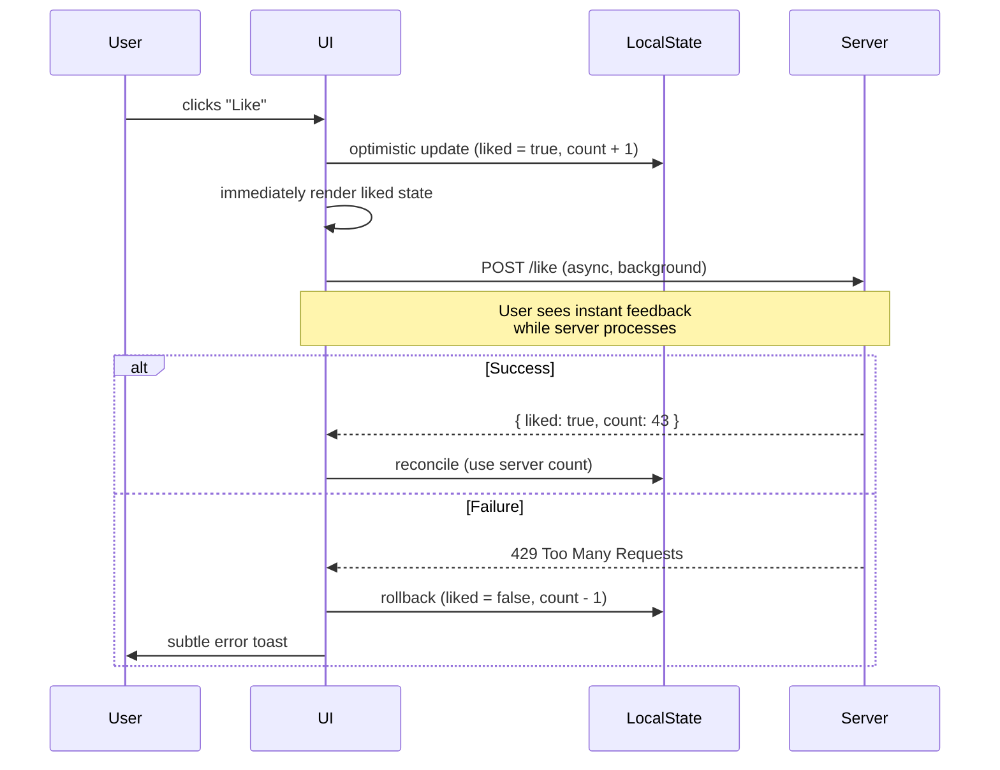
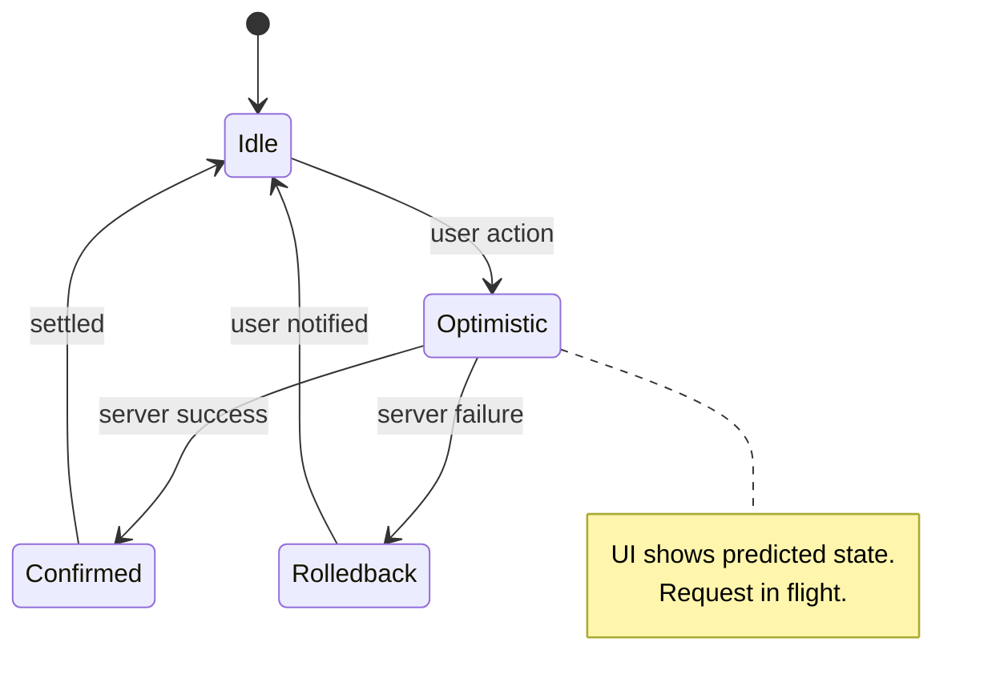
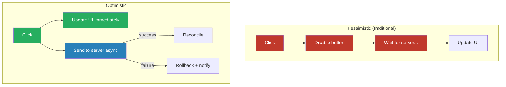

# Optimistic UI

## 1. The Problem (Story)

You're building a social media app. The user clicks the "Like" button on a post. Your implementation:

```typescript
async function handleLike(postId: string) {
  likeButton.disabled = true;
  likeButton.textContent = '...';
  
  try {
    const response = await fetch(`/api/posts/${postId}/like`, { method: 'POST' });
    const data = await response.json();
    likeButton.textContent = `♥ ${data.likeCount}`;
    likeButton.classList.add('liked');
  } catch {
    likeButton.textContent = '♥ Like';
    showToast('Failed to like. Try again.');
  } finally {
    likeButton.disabled = false;
  }
}
```

The API takes 200-800ms to respond. During that time:
- The button shows "..." — the user doesn't know if their click registered
- The button is disabled — they can't interact with it
- If they're on a slow connection (3G, train), it takes 2+ seconds
- If they quickly scroll past and like 5 posts, they're waiting for 5 sequential round-trips

Users complain: "The app feels slow." A competitor's like button responds *instantly*. Same server, same API speed — but their UI feels 10x faster.

The difference? The competitor shows the liked state immediately, before the server responds. If the server fails (rare — likes succeed 99.9% of the time), they quietly undo it.

**The problem: every interaction waits for the network round-trip before showing feedback, making the app feel sluggish even though the operations almost always succeed.**

## 2. The Naïve Solutions

### Attempt 1: "Just make the API faster"

Optimize the backend to respond in <50ms. Works for simple operations, but:
- Network latency adds 30-300ms regardless of server speed
- Mobile networks add another 100-500ms
- You can't control the user's connection quality
- Complex operations (create, update with validation) genuinely take time

### Attempt 2: "Show a spinner"

Replace blocking disables with animated spinners:

```typescript
likeButton.innerHTML = '<span class="spinner"></span>';
```

The spinner tells the user "something's happening," but it still says "wait." The user is still blocked. Spinners for sub-second operations feel like the app is struggling.

### Attempt 3: "Queue actions and batch-send"

Queue all user actions and send them periodically:

```typescript
actionQueue.push({ type: 'like', postId });
// Flush every 2 seconds
```

This hides latency by batching, but creates worse problems: the user sees stale data for 2 seconds, actions feel delayed, and failure handling becomes complex — "Your like from 4 seconds ago failed."

## 3. The Insight

**For operations that succeed almost always (>95%), show the expected result immediately and reconcile with the server in the background.** The UI becomes a *prediction* of the server's response. If the prediction is wrong (server rejects it), roll back. This trades consistency (temporary) for perceived speed (permanent).

## 4. The Pattern

**Optimistic UI** updates the user interface as if the server operation has already succeeded, before the round-trip completes.

- **Immediate update**: Apply the expected state change to the UI instantly
- **Background request**: Send the actual request to the server
- **Reconcile on success**: Merge the server's authoritative response (which may differ slightly)
- **Rollback on failure**: Revert the UI to the previous state and notify the user

### Guarantees
- UI feels instantaneous regardless of network speed
- User can continue interacting without waiting
- The server remains the source of truth — optimistic state is temporary

### Non-Guarantees
- Doesn't guarantee the operation will succeed (must handle rollback)
- Doesn't handle conflicts (two users editing the same item simultaneously)
- Brief inconsistency is expected and visible if the server rejects the operation
- Doesn't work for operations with unpredictable outcomes

## 5. Mental Model

**Sending a text message.** When you hit Send, the message appears instantly in the chat bubble (blue/green). The app hasn't confirmed delivery yet — it just shows it. A small clock icon says "sending..." and then a checkmark appears when the server confirms. If it fails (airplane mode), the message turns red with "Failed — tap to retry." You're not blocked from typing the next message. The UI predicts success and handles the rare failure gracefully.

## 6. Structure







## 7. Code Example

### TypeScript — Optimistic state manager with rollback

```typescript
// ─── OPTIMISTIC STATE MANAGER ────────────────────────

interface OptimisticUpdate<T> {
  id: string;
  previousState: T;
  optimisticState: T;
  request: Promise<T>;  // The actual server request
  timestamp: number;
}

class OptimisticStore<T> {
  private state: T;
  private pendingUpdates: Map<string, OptimisticUpdate<T>> = new Map();
  private listeners: Set<(state: T) => void> = new Set();
  private updateCounter = 0;

  constructor(initialState: T) {
    this.state = initialState;
  }

  getState(): T {
    return this.state;
  }

  subscribe(listener: (state: T) => void): () => void {
    this.listeners.add(listener);
    return () => this.listeners.delete(listener);
  }

  private notify(): void {
    this.listeners.forEach(fn => fn(this.state));
  }

  /**
   * Apply an optimistic update immediately, then reconcile with the server.
   * 
   * @param optimisticUpdate - Function that produces the optimistic state
   * @param serverRequest - The actual async server operation
   * @param reconcile - Optional: merge server response into state
   */
  async apply(
    optimisticUpdate: (current: T) => T,
    serverRequest: () => Promise<T>,
    reconcile?: (serverState: T, currentState: T) => T,
  ): Promise<void> {
    const updateId = `update-${++this.updateCounter}`;
    const previousState = this.state;

    // Step 1: Apply optimistic state IMMEDIATELY
    const optimisticState = optimisticUpdate(this.state);
    this.state = optimisticState;
    this.notify(); // UI updates instantly

    const pending: OptimisticUpdate<T> = {
      id: updateId,
      previousState,
      optimisticState,
      request: serverRequest(),
      timestamp: Date.now(),
    };
    this.pendingUpdates.set(updateId, pending);

    try {
      // Step 2: Wait for server
      const serverState = await pending.request;

      // Step 3: Reconcile — server is authoritative
      this.pendingUpdates.delete(updateId);
      if (reconcile) {
        this.state = reconcile(serverState, this.state);
      } else {
        this.state = serverState;
      }
      this.notify();
    } catch (error) {
      // Step 4: Rollback on failure
      this.pendingUpdates.delete(updateId);
      this.state = previousState;
      this.notify();
      throw error; // Let the caller handle the error (show toast, etc.)
    }
  }

  getPendingCount(): number {
    return this.pendingUpdates.size;
  }

  hasPending(): boolean {
    return this.pendingUpdates.size > 0;
  }
}

// ─── DOMAIN: Social media post with likes ────────────

interface PostState {
  posts: Array<{
    id: string;
    text: string;
    likeCount: number;
    likedByMe: boolean;
    comments: string[];
  }>;
}

// Simulate server API
const fakeApi = {
  async likePost(postId: string): Promise<PostState['posts'][0]> {
    await new Promise(r => setTimeout(r, 500)); // 500ms latency
    // Server might return a slightly different count
    // (another user liked it simultaneously)
    return {
      id: postId,
      text: 'Original post',
      likeCount: 43, // Authoritative count from server
      likedByMe: true,
      comments: [],
    };
  },

  async addComment(postId: string, text: string): Promise<PostState['posts'][0]> {
    await new Promise(r => setTimeout(r, 800));
    if (text.includes('spam')) {
      throw new Error('Comment rejected: spam detected');
    }
    return {
      id: postId,
      text: 'Original post',
      likeCount: 42,
      likedByMe: false,
      comments: ['existing comment', text], // server includes all comments
    };
  },
};

// ─── USAGE ───────────────────────────────────────────

async function demo() {
  const store = new OptimisticStore<PostState>({
    posts: [
      { id: 'p1', text: 'Hello world!', likeCount: 42, likedByMe: false, comments: ['existing comment'] },
    ],
  });

  // Render function — called on every state change
  store.subscribe((state) => {
    const post = state.posts[0];
    const heart = post.likedByMe ? '♥' : '♡';
    const pending = store.hasPending() ? ' (syncing...)' : '';
    console.log(`${heart} ${post.likeCount} likes${pending} | ${post.comments.length} comments`);
  });

  // ── LIKE: high confidence, optimistic ──────────────
  console.log('--- User clicks Like ---');

  try {
    await store.apply(
      // Optimistic: immediately show liked state
      (state) => ({
        ...state,
        posts: state.posts.map(p =>
          p.id === 'p1'
            ? { ...p, likedByMe: true, likeCount: p.likeCount + 1 }
            : p,
        ),
      }),

      // Server request (runs in background)
      () => fakeApi.likePost('p1'),

      // Reconcile: use server's authoritative like count
      // (another user might have liked it too)
      (serverPost, currentState) => ({
        ...currentState,
        posts: currentState.posts.map(p =>
          p.id === serverPost.id
            ? { ...p, likeCount: serverPost.likeCount, likedByMe: serverPost.likedByMe }
            : p,
        ),
      }),
    );
  } catch (e) {
    console.log('Like failed, rolled back');
  }

  // Output sequence:
  // ♥ 43 likes (syncing...) | 1 comments  ← instant optimistic update
  // ♥ 43 likes | 1 comments              ← server confirmed (count = 43)

  // ── COMMENT: might fail, still optimistic ──────────
  console.log('\n--- User adds comment ---');

  try {
    await store.apply(
      (state) => ({
        ...state,
        posts: state.posts.map(p =>
          p.id === 'p1'
            ? { ...p, comments: [...p.comments, 'Nice post!'] }
            : p,
        ),
      }),
      () => fakeApi.addComment('p1', 'Nice post!'),
    );
  } catch (e) {
    console.log('Comment failed, UI rolled back');
  }

  // ── SPAM COMMENT: will be rejected → rollback ──────
  console.log('\n--- User adds spam comment ---');

  try {
    await store.apply(
      (state) => ({
        ...state,
        posts: state.posts.map(p =>
          p.id === 'p1'
            ? { ...p, comments: [...p.comments, 'buy spam now'] }
            : p,
        ),
      }),
      () => fakeApi.addComment('p1', 'buy spam now'),
    );
  } catch (e) {
    console.log(`Rolled back: ${(e as Error).message}`);
  }

  // Output: "buy spam now" appears instantly, then disappears after 800ms
  // User sees: comment appears → brief pause → comment vanishes → toast: "spam detected"
}

demo();

// ─── QUEUE: for rapid sequential actions ─────────────

class OptimisticQueue<A> {
  private queue: Array<{
    action: A;
    request: () => Promise<void>;
  }> = [];
  private processing = false;

  async enqueue(action: A, request: () => Promise<void>): Promise<void> {
    this.queue.push({ action, request });
    if (!this.processing) {
      this.process();
    }
  }

  private async process(): Promise<void> {
    this.processing = true;
    while (this.queue.length > 0) {
      const item = this.queue.shift()!;
      try {
        await item.request();
      } catch (e) {
        console.error('Queue item failed:', item.action, e);
        // Remaining items may depend on this — consider aborting queue
      }
    }
    this.processing = false;
  }
}

// User rapidly likes 5 posts — all appear liked instantly
// Server requests are queued and processed sequentially
const likeQueue = new OptimisticQueue<string>();
// likeQueue.enqueue('p1', () => fakeApi.likePost('p1'));
// likeQueue.enqueue('p2', () => fakeApi.likePost('p2'));
// likeQueue.enqueue('p3', () => fakeApi.likePost('p3'));
```

### Go — Optimistic update with rollback

```go
package main

import (
	"errors"
	"fmt"
	"sync"
	"time"
)

// ─── OPTIMISTIC STORE ────────────────────────────────

type OptimisticStore[T any] struct {
	mu        sync.RWMutex
	state     T
	listeners []func(T)
}

func NewOptimisticStore[T any](initial T) *OptimisticStore[T] {
	return &OptimisticStore[T]{state: initial}
}

func (s *OptimisticStore[T]) GetState() T {
	s.mu.RLock()
	defer s.mu.RUnlock()
	return s.state
}

func (s *OptimisticStore[T]) Subscribe(fn func(T)) {
	s.mu.Lock()
	defer s.mu.Unlock()
	s.listeners = append(s.listeners, fn)
}

func (s *OptimisticStore[T]) notify() {
	for _, fn := range s.listeners {
		fn(s.state)
	}
}

// Apply performs an optimistic update, then reconciles or rolls back.
func (s *OptimisticStore[T]) Apply(
	optimistic func(T) T,
	serverCall func() (T, error),
) error {
	s.mu.Lock()
	previous := s.state

	// Step 1: Optimistic update — immediate
	s.state = optimistic(s.state)
	s.notify()
	s.mu.Unlock()

	// Step 2: Server call (potentially slow)
	serverState, err := serverCall()

	s.mu.Lock()
	defer s.mu.Unlock()

	if err != nil {
		// Step 3a: Rollback
		s.state = previous
		s.notify()
		return err
	}

	// Step 3b: Reconcile with server's authoritative state
	s.state = serverState
	s.notify()
	return nil
}

// ─── DOMAIN ──────────────────────────────────────────

type Post struct {
	ID        string
	LikeCount int
	Liked     bool
}

func main() {
	store := NewOptimisticStore(Post{
		ID:        "p1",
		LikeCount: 42,
		Liked:     false,
	})

	store.Subscribe(func(p Post) {
		heart := "♡"
		if p.Liked {
			heart = "♥"
		}
		fmt.Printf("%s %d likes\n", heart, p.LikeCount)
	})

	// Optimistic like
	err := store.Apply(
		// Optimistic: instant
		func(p Post) Post {
			p.Liked = true
			p.LikeCount++
			return p
		},
		// Server: slow but authoritative
		func() (Post, error) {
			time.Sleep(200 * time.Millisecond)
			return Post{ID: "p1", LikeCount: 44, Liked: true}, nil
		},
	)
	if err != nil {
		fmt.Println("Like failed, rolled back")
	}

	// Simulate server rejection
	fmt.Println("\n--- Server rejects ---")
	err = store.Apply(
		func(p Post) Post {
			p.Liked = false
			p.LikeCount--
			return p
		},
		func() (Post, error) {
			time.Sleep(200 * time.Millisecond)
			return Post{}, errors.New("rate limited")
		},
	)
	if err != nil {
		fmt.Printf("Rolled back: %v\n", err)
	}

	fmt.Printf("Final state: %+v\n", store.GetState())
}
```

## 8. Gotchas & Beginner Mistakes

| Mistake | Why It Happens | Fix |
|---------|---------------|-----|
| Optimistic for high-failure operations | Using optimistic UI for payment processing (30% payment failure rate) | Only use optimistic for operations with >95% success rate. Payments should be pessimistic. |
| No rollback UI | Optimistic update succeeds, server fails, UI silently reverts | Always show a toast/notification on rollback so the user knows their action didn't persist |
| Stale optimistic state on reconcile | Server returns updated data, but other optimistic updates are in flight | If multiple updates are pending, replay them on top of the server's state |
| No loading indicator for pending | User can't tell if the action is confirmed or still pending | Show subtle indicator (e.g., reduced opacity, small spinner) while the request is in flight |
| Race conditions with rapid actions | Like → Unlike → Like: three requests in flight, responses arrive out of order | Use an optimistic queue or abort previous requests (AbortController) |
| Optimistic for operations with visible side effects | Optimistic "send email" — you can't unsend an email | Only use for reversible operations where rollback is safe |

## 9. Related & Confusable Patterns

| Pattern | Relationship | Key Difference |
|---------|-------------|----------------|
| **Offline-first** | Extends optimistic | Offline-first queues all operations for later sync. Optimistic UI assumes connectivity but doesn't wait for it. |
| **CQRS** | Complementary | In CQRS, the write model confirms, and the read model eventually updates. Optimistic UI bridges the gap between write and read. |
| **Event Sourcing** | Enables rollback | If state is event-sourced, rolling back is just removing the last event. Optimistic UI benefits from event sourcing's undo capability. |
| **Retry** | Used with optimistic | On server failure, retry before rolling back. If retry succeeds, the user never sees the failure. |
| **Idempotency** | Prerequisite | If a like request is sent twice (retry + original), the server must handle it idempotently to avoid double-counting. |
| **Conflict Resolution** | Advanced case | When two users optimistically edit the same item, you need CRDTs, last-write-wins, or manual conflict resolution. |

## 10. When This Pattern Is the WRONG Choice

| Scenario | Why Optimistic Hurts | Better Alternative |
|----------|---------------------|-------------------|
| Financial transactions | Showing "$500 transferred!" then rolling back is dangerous UX | Pessimistic with clear progress indication |
| Destructive operations | "File deleted!" then rollback → user already celebrated | Confirmation dialog → pessimistic delete |
| Operations with server-side validation | Optimistic "username changed!" but server rejects (taken) | Pessimistic with inline validation before submit |
| High-failure-rate operations (>5%) | Frequent rollbacks erode user trust more than waiting | Pessimistic with fast feedback |
| Operations with irreversible side effects | Optimistic "email sent!" — can't unsend | Pessimistic — wait for confirmation |

**Symptom you need optimistic UI**: Users complain the app "feels slow" even though server response times are fine. Click handlers disable buttons and show spinners for sub-second operations. The app feels notably worse on mobile networks.

**Back-out strategy**: Replace optimistic updates with a good loading state design (micro-spinners inline, skeleton screens). Many apps feel fast enough with well-designed pessimistic UI — the spinner doesn't have to be ugly. Only invest in optimistic UI where the perceived speed gain justifies the rollback complexity.
