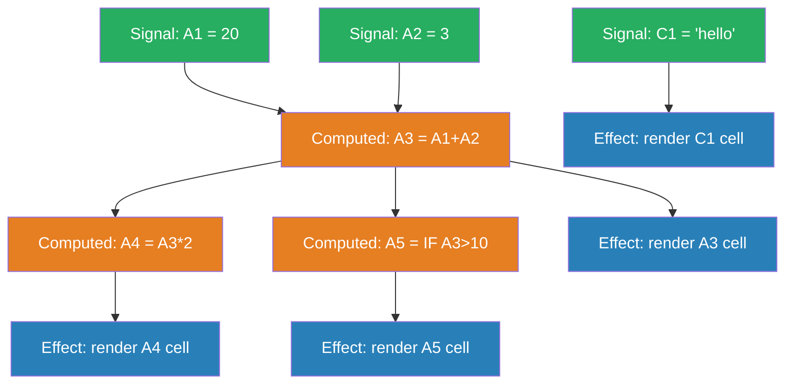
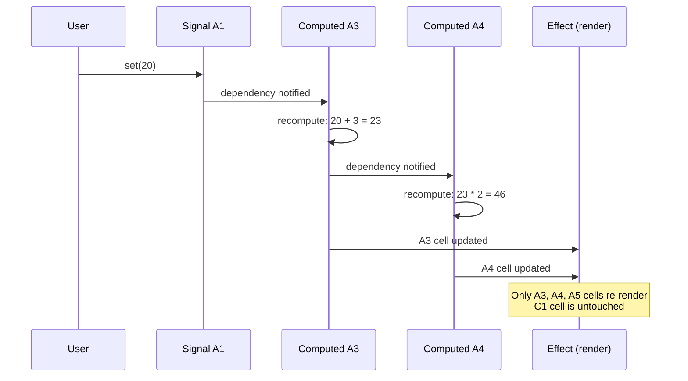

# Reactive State — Signals & Observables

## 1. The Problem (Story)

You're building a spreadsheet app. Cell A1 contains `5`. Cell A2 contains `3`. Cell A3 has the formula `=A1+A2`, so it shows `8`. Cell A4 has `=A3*2`, showing `16`. Cell A5 has `=IF(A3>10, "HIGH", "LOW")`, showing `"LOW"`.

The user changes A1 from `5` to `20`. Now:
- A3 should update to `23` (20+3)
- A4 should update to `46` (23*2)
- A5 should update to `"HIGH"` (23>10)
- Cell B7, which has `=SUM(A1:A5)`, should update too
- But cell C1 (`="hello"`) should NOT re-render — it has no dependency on A1

Your Redux-style implementation dispatches `CELL_CHANGED` → runs the entire reducer → recomputes ALL cells → diffs the old and new state → re-renders everything that changed:

```typescript
function cellReducer(state: SpreadsheetState, action: CellAction): SpreadsheetState {
  // Recalculate EVERY formula cell on every change
  const newCells = { ...state.cells };
  for (const [key, cell] of Object.entries(newCells)) {
    if (cell.formula) {
      newCells[key] = { ...cell, value: evaluate(cell.formula, newCells) };
    }
  }
  return { ...state, cells: newCells };
}
```

With 10,000 cells and 3,000 formulas, changing one cell recalculates 3,000 formulas even though only 4 depend on the changed cell. The spreadsheet lags on every keystroke. The virtual DOM diffs 10,000 cell renders even though 9,996 haven't changed.

**The problem: you need fine-grained reactivity — update ONLY what depends on what changed, with zero diffing overhead.**

## 2. The Naïve Solutions

### Attempt 1: "Manual dependency tracking"

Keep a map of which cells depend on which:

```typescript
const dependents: Record<string, string[]> = {
  'A1': ['A3', 'B7'],
  'A2': ['A3'],
  'A3': ['A4', 'A5', 'B7'],
};
```

When A1 changes, walk its dependents and recalculate only those. But who builds this map? You'd need to parse every formula, extract cell references, and maintain the graph as formulas change. Insert a row? Every reference shifts. It works, but you're building a reactive system from scratch.

### Attempt 2: "Memoization"

Cache formula results and invalidate when inputs change:

```typescript
const cache = new Map<string, { deps: string[]; value: any }>();

function getValue(cellId: string): any {
  const cached = cache.get(cellId);
  if (cached && cached.deps.every(d => !isDirty(d))) {
    return cached.value;
  }
  // Recalculate...
}
```

The dirty bit has to propagate transitively — if A1 is dirty, A3 is dirty, therefore A4 is dirty. You need topological sorting to recalculate in the right order (A3 before A4). You're reimplementing a reactive graph... again.

### Attempt 3: "Re-render everything, use Virtual DOM to diff"

Let the framework figure out what actually changed:

```typescript
function renderSpreadsheet(state: SpreadsheetState): VNode {
  return grid(Object.entries(state.cells).map(([id, cell]) =>
    cellComponent({ key: id, value: cell.value })
  ));
}
```

The virtual DOM diffs 10,000 nodes and finds 4 changes. That's a lot of work to discover that 99.96% of the UI is unchanged. For a spreadsheet with rapid edits, even the diffing cost is too high.

## 3. The Insight

**Let values declare their dependencies automatically.** When you read a value inside a computation, the system records that dependency. When the source value changes, the system knows exactly which computations to re-run — no diffing, no manual tracking, no global recalculation. **The dependency graph builds itself at runtime by observing which values are accessed during each computation.**

## 4. The Pattern

**Reactive State (Signals & Observables)** is a fine-grained reactivity system with three primitives:

- **Signal** (Observable/Atom): A reactive value. Reading it inside a reactive context registers a dependency. Writing to it triggers dependents.
- **Computed** (Derived/Memo): A value derived from signals and other computeds. Re-evaluates only when its dependencies change.
- **Effect** (Reaction/Autorun): A side effect that runs when its dependencies change. Used for DOM updates, logging, network calls.

### Guarantees
- Changes propagate only to actual dependents — no wasted computation
- Dependency graph is built automatically — no manual subscription management
- Computed values are lazy: they don't recalculate until someone reads them
- Glitch-free: intermediate states are never observed (all dependents update atomically)

### Non-Guarantees
- Doesn't prevent circular dependencies (those are runtime errors)
- Doesn't guarantee execution order among unrelated effects
- Doesn't handle async reactivity (async computeds require additional patterns)

## 5. Mental Model

**A water pipe system.** Signals are faucets (sources). Computed values are pipe junctions that combine, filter, or transform water from multiple sources. Effects are the endpoints — sprinklers, fountains, faucets. When you open a source faucet, water flows only through connected pipes to the specific endpoints that depend on it. Pipes with no connection to that source remain dry. You don't flood the entire system — water flows exactly where the plumbing directs it.

## 6. Structure





## 7. Code Example

### TypeScript — Signals, Computed, and Effects from scratch

```typescript
// ─── REACTIVE CORE ───────────────────────────────────

type Subscriber = () => void;

// Global tracking: which computed/effect is currently evaluating?
let activeObserver: Subscriber | null = null;

class Signal<T> {
  private _value: T;
  private subscribers: Set<Subscriber> = new Set();

  constructor(initialValue: T) {
    this._value = initialValue;
  }

  get value(): T {
    // If something is evaluating (a Computed or Effect),
    // register it as a dependency automatically.
    if (activeObserver) {
      this.subscribers.add(activeObserver);
    }
    return this._value;
  }

  set value(newValue: T) {
    if (Object.is(this._value, newValue)) return;
    this._value = newValue;
    // Notify all dependents
    const toRun = [...this.subscribers];
    toRun.forEach(fn => fn());
  }

  peek(): T {
    // Read without tracking — for use in effects that
    // shouldn't create a dependency
    return this._value;
  }
}

class ComputedSignal<T> {
  private _value: T;
  private dirty = true;
  private computeFn: () => T;
  private subscribers: Set<Subscriber> = new Set();

  constructor(computeFn: () => T) {
    this.computeFn = computeFn;
    this._value = undefined as T;
    this.recompute();
  }

  get value(): T {
    if (activeObserver) {
      this.subscribers.add(activeObserver);
    }
    if (this.dirty) {
      this.recompute();
    }
    return this._value;
  }

  private recompute(): void {
    const prevObserver = activeObserver;
    activeObserver = () => {
      this.dirty = true;
      // Propagate: notify our own subscribers that we changed
      [...this.subscribers].forEach(fn => fn());
    };

    this._value = this.computeFn();
    this.dirty = false;
    activeObserver = prevObserver;
  }
}

function effect(fn: () => void): () => void {
  let cleanup: (() => void) | undefined;

  const run = () => {
    if (cleanup) cleanup();
    const prevObserver = activeObserver;
    activeObserver = run;
    fn();
    activeObserver = prevObserver;
  };

  run(); // Run immediately to capture dependencies

  // Return a dispose function
  return () => { cleanup?.(); };
}

// Convenience constructors
function signal<T>(value: T): Signal<T> {
  return new Signal(value);
}

function computed<T>(fn: () => T): ComputedSignal<T> {
  return new ComputedSignal(fn);
}

// ─── SPREADSHEET EXAMPLE ─────────────────────────────

// Raw cell values (signals)
const a1 = signal(5);
const a2 = signal(3);
const c1 = signal('hello');

// Formula cells (computed — dependencies tracked automatically)
const a3 = computed(() => a1.value + a2.value);
const a4 = computed(() => a3.value * 2);
const a5 = computed(() => a3.value > 10 ? 'HIGH' : 'LOW');

// Track which cells actually re-rendered
const renderLog: string[] = [];

// Effects: side effects that run when dependencies change
effect(() => {
  renderLog.push(`A3 rendered: ${a3.value}`);
});

effect(() => {
  renderLog.push(`A4 rendered: ${a4.value}`);
});

effect(() => {
  renderLog.push(`A5 rendered: ${a5.value}`);
});

effect(() => {
  renderLog.push(`C1 rendered: ${c1.value}`);
});

console.log('Initial renders:', renderLog);
// ['A3 rendered: 8', 'A4 rendered: 16', 'A5 rendered: LOW', 'C1 rendered: hello']

renderLog.length = 0;

// User changes A1 from 5 to 20
a1.value = 20;

console.log('After A1 change:', renderLog);
// ['A3 rendered: 23', 'A4 rendered: 46', 'A5 rendered: HIGH']
// Note: C1 did NOT re-render — it has no dependency on A1!

renderLog.length = 0;

// Change C1 — only C1 re-renders
c1.value = 'world';
console.log('After C1 change:', renderLog);
// ['C1 rendered: world']
// A3, A4, A5 are untouched

// ─── REAL WORLD: shopping cart ───────────────────────
const cartItems = signal<Array<{ name: string; price: number; qty: number }>>([
  { name: 'Shirt', price: 29.99, qty: 2 },
  { name: 'Pants', price: 49.99, qty: 1 },
]);

const subtotal = computed(() =>
  cartItems.value.reduce((sum, item) => sum + item.price * item.qty, 0),
);

const taxRate = signal(0.08);
const tax = computed(() => subtotal.value * taxRate.value);
const total = computed(() => subtotal.value + tax.value);

const freeShipping = computed(() => subtotal.value > 100);
const shippingMessage = computed(() =>
  freeShipping.value
    ? '🎉 Free shipping!'
    : `$${(100 - subtotal.value).toFixed(2)} more for free shipping`,
);

effect(() => {
  console.log(`Subtotal: $${subtotal.value.toFixed(2)}`);
  console.log(`Tax: $${tax.value.toFixed(2)}`);
  console.log(`Total: $${total.value.toFixed(2)}`);
  console.log(shippingMessage.value);
});

// Add an item → only cart-related computeds update
cartItems.value = [
  ...cartItems.value,
  { name: 'Shoes', price: 89.99, qty: 1 },
];
// Subtotal, tax, total, shippingMessage all update.
// Spreadsheet cells? Untouched.
```

### Go — Reactive signals with automatic dependency tracking

```go
package main

import (
	"fmt"
	"sync"
)

// ─── REACTIVE CORE ───────────────────────────────────

// Global observer stack for automatic dependency tracking
var (
	observerMu    sync.Mutex
	activeTracker *tracker
)

type tracker struct {
	deps   []*SignalBase
	notify func()
}

type SignalBase struct {
	mu          sync.RWMutex
	subscribers []func()
}

func (s *SignalBase) track() {
	observerMu.Lock()
	defer observerMu.Unlock()
	if activeTracker != nil {
		activeTracker.deps = append(activeTracker.deps, s)
	}
}

func (s *SignalBase) addSubscriber(fn func()) {
	s.mu.Lock()
	defer s.mu.Unlock()
	s.subscribers = append(s.subscribers, fn)
}

func (s *SignalBase) notify() {
	s.mu.RLock()
	subs := make([]func(), len(s.subscribers))
	copy(subs, s.subscribers)
	s.mu.RUnlock()

	for _, fn := range subs {
		fn()
	}
}

// ─── SIGNAL ──────────────────────────────────────────

type Signal[T comparable] struct {
	SignalBase
	value T
}

func NewSignal[T comparable](initial T) *Signal[T] {
	return &Signal[T]{value: initial}
}

func (s *Signal[T]) Get() T {
	s.track()
	return s.value
}

func (s *Signal[T]) Set(v T) {
	if s.value == v {
		return
	}
	s.value = v
	s.SignalBase.notify()
}

// ─── COMPUTED ────────────────────────────────────────

type Computed[T comparable] struct {
	SignalBase
	computeFn func() T
	value     T
}

func NewComputed[T comparable](fn func() T) *Computed[T] {
	c := &Computed[T]{computeFn: fn}
	c.recompute()
	return c
}

func (c *Computed[T]) Get() T {
	c.track()
	return c.value
}

func (c *Computed[T]) recompute() {
	// Set up tracking
	observerMu.Lock()
	prev := activeTracker
	t := &tracker{}
	activeTracker = t
	observerMu.Unlock()

	// Evaluate — any signal.Get() calls will register in tracker
	newVal := c.computeFn()

	// Restore previous tracker
	observerMu.Lock()
	activeTracker = prev
	observerMu.Unlock()

	// Subscribe to dependencies
	for _, dep := range t.deps {
		dep.addSubscriber(func() {
			oldVal := c.value
			c.value = c.computeFn()
			if c.value != oldVal {
				c.SignalBase.notify()
			}
		})
	}

	c.value = newVal
}

// ─── EFFECT ──────────────────────────────────────────

func Effect(fn func()) {
	observerMu.Lock()
	prev := activeTracker
	t := &tracker{}
	activeTracker = t
	observerMu.Unlock()

	fn() // Run and track dependencies

	observerMu.Lock()
	activeTracker = prev
	observerMu.Unlock()

	for _, dep := range t.deps {
		dep.addSubscriber(fn)
	}
}

// ─── USAGE ───────────────────────────────────────────

func main() {
	a1 := NewSignal(5)
	a2 := NewSignal(3)

	a3 := NewComputed(func() int { return a1.Get() + a2.Get() })
	a4 := NewComputed(func() int { return a3.Get() * 2 })

	renderCount := 0

	Effect(func() {
		renderCount++
		fmt.Printf("A3=%d, A4=%d (render #%d)\n", a3.Get(), a4.Get(), renderCount)
	})
	// Output: A3=8, A4=16 (render #1)

	a1.Set(20)
	// Output: A3=23, A4=46 (render #2)
	// Only cells that depend on A1 recalculate

	a2.Set(7)
	// Output: A3=27, A4=54 (render #3)

	fmt.Printf("Total renders: %d\n", renderCount)
}
```

## 8. Gotchas & Beginner Mistakes

| Mistake | Why It Happens | Fix |
|---------|---------------|-----|
| Creating signals in render loops | `items.map(i => signal(i))` creates new signals every render | Create signals once (initialization), update them on change |
| Unintentional dependency tracking | Reading a signal in a callback creates a dependency on it | Use `peek()` or read the value outside the reactive context when you don't want tracking |
| Circular dependencies | Computed A depends on Computed B depends on Computed A | Reactive graphs must be DAGs. Restructure to break the cycle. |
| Memory leaks from effects | `effect(() => { ... })` subscribes forever | Store the dispose function and call it on cleanup/unmount |
| Synchronous side effects in computed | `computed(() => { fetch(...); return ... })` | Computed must be pure. Side effects belong in `effect()`. |
| Signal for every primitive | 50 signals for 50 form fields | Group related state into one signal with an object value, or use a reactive store/proxy |

## 9. Related & Confusable Patterns

| Pattern | Relationship | Key Difference |
|---------|-------------|----------------|
| **Observer** | Foundation | Signals ARE observers, but with automatic subscription via dependency tracking. No manual `subscribe()`. |
| **MVVM** | Uses reactivity | MVVM's observable properties use the same mechanism. Reactive state is the underlying primitive. |
| **Flux/Redux** | Alternative approach | Redux recalculates everything and diffs. Signals update only dependents. Redux is coarse-grained; signals are fine-grained. |
| **Pub-Sub** | Looser coupling | Pub-Sub requires explicit subscribe/publish. Signals auto-subscribe by reading a value. |
| **Virtual DOM** | Competing approach | Virtual DOM diffs the entire tree to find changes. Signals know exactly what changed — no diffing needed. |
| **Memoization** | Related optimization | Computed signals are memoized by dependencies. Memoization caches by arguments. Both avoid recomputation. |

## 10. When This Pattern Is the WRONG Choice

| Scenario | Why Signals Hurt | Better Alternative |
|----------|-----------------|-------------------|
| Simple request→render pages | No ongoing reactivity needed — data loads once and renders | Server rendering or simple component state |
| State shared across many components | Fine-grained signals everywhere can create a web of hidden dependencies | Centralized store (Redux) with explicit actions |
| Debugging complex state flows | Dependencies are invisible — you can't see "why did this update?" without tooling | Redux DevTools (actions are explicit and logged) |
| Large teams with junior developers | Implicit dependency tracking is "magic" — hard to reason about without understanding the model | Explicit state management where you can grep for all state changes |

**Symptom you need reactive state**: You're manually calling `setState()` in 15 places because one value changed and you need to update all derived values. You're implementing a custom dependency graph. You're fighting the virtual DOM because re-rendering 10,000 nodes to update 3 is too slow.

**Back-out strategy**: Wrap signals in a Redux-like store interface. Each signal becomes a store slice, each `signal.value = x` becomes a dispatched action. You keep the signals internally for performance but expose an explicit action-based API for traceability.
