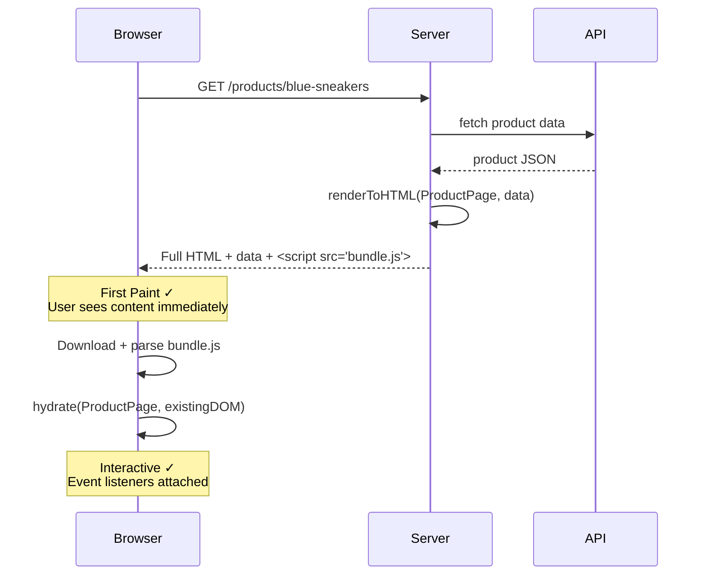
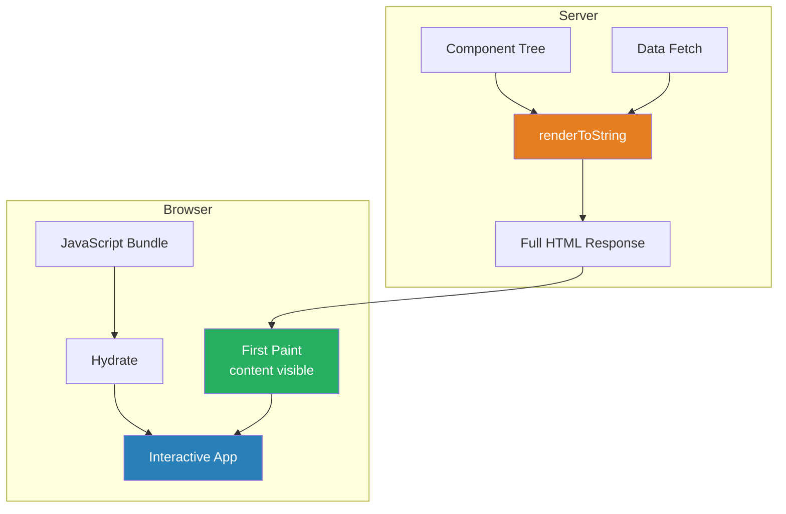

# Server-Side Rendering & Hydration

## 1. The Problem (Story)

Your e-commerce site is a React SPA. When a user visits `yourstore.com/products/blue-sneakers`:

1. Browser downloads `index.html` — it contains `<div id="root"></div>` and a `<script>` tag
2. Browser downloads `bundle.js` (487 KB gzipped)
3. JavaScript parses and executes (1.2 seconds on a mid-range phone)
4. React mounts, reads the URL, sees `/products/blue-sneakers`
5. React calls `fetch('/api/products/blue-sneakers')` — another round-trip
6. API responds with product data (200ms)
7. React renders the product page

**Total time before the user sees anything: 3.2 seconds on 4G.** The screen is blank white for the entire duration. Google's Lighthouse gives you a 38 performance score. Your competitor's product page loads in 800ms.

The SEO team reports: Google's crawler sees `<div id="root"></div>` — an empty page. Despite Google saying they execute JavaScript, your product pages aren't being indexed consistently. Social media preview cards show a blank thumbnail because Open Graph meta tags are set client-side after JavaScript runs.

A PM runs an A/B test: adding a 1-second delay to page load drops conversions by 7%.

**The problem: Single-page apps send an empty HTML shell and require JavaScript execution + API calls before the user sees any content.**

## 2. The Naïve Solutions

### Attempt 1: "Prerender static HTML"

Generate HTML at build time for every product page:

```bash
# Build step: render 50,000 products to HTML
for each product:
  renderToHTML(ProductPage, product) → dist/products/${slug}.html
```

Works for static content, but:
- 50,000 product pages take 45 minutes to build
- Price changes don't reflect until the next build
- Personalized content (user's cart, recently viewed) can't be pre-rendered
- Adding a new product requires a full rebuild

### Attempt 2: "CDN edge caching"

Cache the SPA shell aggressively:

```
Cache-Control: max-age=86400
```

The HTML arrives faster, but it's still empty — `<div id="root"></div>`. The user still stares at a blank page while JavaScript loads. Caching makes the *transport* faster, not the *rendering*.

### Attempt 3: "Add a loading skeleton"

Show a skeleton screen while JavaScript loads:

```html
<div id="root">
  <div class="skeleton-title"></div>
  <div class="skeleton-image"></div>
  <div class="skeleton-price"></div>
</div>
```

Better than a blank page — the user sees *something* immediately. But the skeleton is pure CSS layout, no real content. Google's crawler still sees no text. Social previews still show nothing. And the user can't interact with a skeleton.

## 3. The Insight

**Render the same components on the server that you render on the client.** The server runs the React/Vue/Svelte component tree, produces full HTML with real data, and sends it to the browser. The user sees complete content immediately — no JavaScript required for the first paint. Then the client-side JavaScript loads, "hydrates" the HTML (attaches event listeners), and the page becomes interactive. Same components. Two render passes: one for appearance (server), one for interactivity (client).

## 4. The Pattern

**Server-Side Rendering (SSR)** renders the initial HTML on the server using the same components the client would render. **Hydration** is the client-side process of attaching JavaScript event listeners and state to the server-rendered HTML.

- **Server Render**: Execute component code on the server, produce HTML string with real data. Send to browser.
- **First Paint**: Browser renders the HTML immediately — no JavaScript needed. Content is visible and crawlable.
- **Hydration**: Client-side JavaScript loads, walks the existing DOM, attaches event listeners and state. The page becomes interactive.
- **Client Takeover**: After hydration, the app behaves like a regular SPA. Navigation, state management, and rendering happen client-side.

### Guarantees
- Fastest possible first paint — HTML arrives with content already rendered
- SEO-friendly — crawlers see complete HTML, not empty shells
- Social previews work — Open Graph meta tags are in the initial HTML response
- Progressive enhancement — content is readable even if JavaScript fails

### Non-Guarantees
- Doesn't eliminate JavaScript download/parse time (still needed for interactivity)
- Doesn't guarantee instant interactivity — there's a gap between first paint and hydration ("uncanny valley")
- Doesn't reduce server load — in fact, increases it (server now renders UI)
- Doesn't solve all caching problems — personalized pages can't be CDN-cached as easily

## 5. Mental Model

**A restaurant with a display window.** The chef (server) prepares a beautiful sample plate and places it in the window (first paint). Passersby see real food immediately — they know exactly what they'll get. When they walk in and sit down (hydration), the waiter hands them a menu and takes orders — the food becomes *interactive* (can be customized). Without the display window (SPA), the customer walks into a dark restaurant, sits down, waits for the lights to turn on, reads the menu, and only then sees what's available.

## 6. Structure

```mermaid
gantt
    title Page Load Timeline
    dateFormat X
    axisFormat %L ms
    
    section SPA (Client-Only)
    Download HTML (empty)     : 0, 100
    Download JS Bundle        : 100, 600
    Parse + Execute JS         : 600, 1200
    Fetch API Data            : 1200, 1500
    Render Content            : 1500, 1600
    
    section SSR + Hydration
    Server Render + HTML      : 0, 300
    First Paint (content)     : milestone, 300, 0
    Download JS Bundle        : 300, 800
    Hydrate                   : 800, 1000
    Interactive               : milestone, 1000, 0
```







## 7. Code Example

### TypeScript — SSR with Hydration

```typescript
// ─── SHARED COMPONENTS (run on BOTH server and client) ───

interface Product {
  id: string;
  name: string;
  price: number;
  description: string;
  imageUrl: string;
  inStock: boolean;
}

// Component renders to HTML string (server) or DOM (client).
// Same logic, different renderers.

interface Component {
  renderToString(): string;
  hydrate(element: any): void;
}

class ProductPage implements Component {
  private product: Product;
  private quantity: number = 1;

  constructor(product: Product) {
    this.product = product;
  }

  renderToString(): string {
    const { product } = this;
    return `
      <div class="product-page" data-product-id="${product.id}">
        
        <h1>${escapeHtml(product.name)}</h1>
        <p class="price">$${product.price.toFixed(2)}</p>
        <p class="description">${escapeHtml(product.description)}</p>
        <div class="purchase">
          <select class="quantity">
            ${[1, 2, 3, 4, 5].map(n =>
              `<option value="${n}"${n === 1 ? ' selected' : ''}>${n}</option>`,
            ).join('')}
          </select>
          <button class="add-to-cart" ${!product.inStock ? 'disabled' : ''}>
            ${product.inStock ? 'Add to Cart' : 'Out of Stock'}
          </button>
        </div>
        <p class="stock-status">
          ${product.inStock ? '✓ In stock' : '✗ Out of stock'}
        </p>
      </div>
    `;
  }

  hydrate(element: any): void {
    // In a real app, this attaches event listeners to existing DOM
    console.log(`[Hydration] Attaching handlers to product ${this.product.id}`);

    // The button already exists in the HTML — we just add the click handler
    // element.querySelector('.add-to-cart').addEventListener('click', () => { ... })
    // element.querySelector('.quantity').addEventListener('change', (e) => { ... })
  }
}

function escapeHtml(str: string): string {
  return str.replace(/[&<>"']/g, (ch) => {
    const map: Record<string, string> = { '&': '&amp;', '<': '&lt;', '>': '&gt;', '"': '&quot;', "'": '&#39;' };
    return map[ch];
  });
}

// ─── SERVER-SIDE RENDERING ───────────────────────────

interface SSRResult {
  html: string;
  serializedData: string;  // State embedded in HTML for client to pick up
  statusCode: number;
  headers: Record<string, string>;
}

async function handleProductRequest(slug: string): Promise<SSRResult> {
  // 1. Fetch data on the server (no round-trip from browser)
  const product = await fetchProduct(slug);

  if (!product) {
    return {
      html: '<h1>Product not found</h1>',
      serializedData: '{}',
      statusCode: 404,
      headers: {},
    };
  }

  // 2. Render component to HTML string
  const page = new ProductPage(product);
  const contentHtml = page.renderToString();

  // 3. Serialize data so the client can hydrate without re-fetching
  const serializedData = JSON.stringify(product);

  // 4. Build complete HTML document
  const html = `
    <!DOCTYPE html>
    <html>
    <head>
      <title>${escapeHtml(product.name)} — MyStore</title>
      <meta property="og:title" content="${escapeHtml(product.name)}" />
      <meta property="og:image" content="${product.imageUrl}" />
      <meta property="og:description" content="${escapeHtml(product.description)}" />
      <meta name="description" content="${escapeHtml(product.description)}" />
      <link rel="stylesheet" href="/styles.css" />
    </head>
    <body>
      <div id="app">${contentHtml}</div>
      
      <!-- Embed data for hydration — client doesn't re-fetch -->
      <script>
        window.__INITIAL_DATA__ = ${serializedData};
      </script>
      <script src="/bundle.js" defer></script>
    </body>
    </html>
  `;

  return {
    html,
    serializedData,
    statusCode: 200,
    headers: {
      'Content-Type': 'text/html',
      'Cache-Control': 'public, max-age=60, stale-while-revalidate=300',
    },
  };
}

// Simulated data fetch (on server, this hits the database directly)
async function fetchProduct(slug: string): Promise<Product | null> {
  const products: Record<string, Product> = {
    'blue-sneakers': {
      id: 'prod-1',
      name: 'Blue Sneakers',
      price: 89.99,
      description: 'Lightweight running shoes with breathable mesh.',
      imageUrl: '/images/blue-sneakers.jpg',
      inStock: true,
    },
  };
  return products[slug] ?? null;
}

// ─── CLIENT-SIDE HYDRATION ───────────────────────────

function hydrateOnClient(): void {
  // The HTML is already rendered — user is seeing content.
  // Now we make it interactive.

  const initialData = (globalThis as any).__INITIAL_DATA__ as Product;
  if (!initialData) {
    console.error('No initial data found — falling back to client render');
    return;
  }

  // Create component with same data (NO re-fetch!)
  const page = new ProductPage(initialData);

  // Hydrate: attach event listeners to existing DOM
  // The DOM already matches what renderToString produced,
  // so we don't need to re-render — just attach handlers.
  const appElement = {} /* document.getElementById('app') */;
  page.hydrate(appElement);

  console.log('[Client] Hydration complete — page is now interactive');
}

// ─── STREAMING SSR ───────────────────────────────────
// For large pages, stream HTML chunks as they become ready.

async function* streamProductPage(slug: string): AsyncGenerator<string> {
  // Send the head immediately — browser starts loading CSS
  yield `<!DOCTYPE html><html><head>
    <link rel="stylesheet" href="/styles.css" />
  </head><body><div id="app">`;

  // Fetch and render header (instant)
  yield `<header><nav>MyStore</nav></header>`;

  // Fetch product data (may take time)
  const product = await fetchProduct(slug);
  if (!product) {
    yield `<h1>Not Found</h1></div></body></html>`;
    return;
  }

  // Stream product content
  const page = new ProductPage(product);
  yield page.renderToString();

  // Send closing tags + hydration script
  yield `</div>
    <script>window.__INITIAL_DATA__ = ${JSON.stringify(product)};</script>
    <script src="/bundle.js" defer></script>
  </body></html>`;
}

// ─── DEMO ────────────────────────────────────────────

async function demo() {
  // Server-side
  const result = await handleProductRequest('blue-sneakers');
  console.log(`Status: ${result.statusCode}`);
  console.log('HTML length:', result.html.length, 'chars');
  console.log('Contains product name:', result.html.includes('Blue Sneakers'));
  console.log('Contains OG tags:', result.html.includes('og:title'));
  console.log('Contains initial data:', result.html.includes('__INITIAL_DATA__'));

  // Client-side (after HTML is rendered and JS loads)
  (globalThis as any).__INITIAL_DATA__ = JSON.parse(result.serializedData);
  hydrateOnClient();

  // Streaming
  console.log('\n--- Streaming SSR ---');
  let totalSize = 0;
  for await (const chunk of streamProductPage('blue-sneakers')) {
    totalSize += chunk.length;
    console.log(`Streamed ${chunk.length} chars (total: ${totalSize})`);
  }
}

demo();
```

### Go — Server-side rendering with template + hydration data

```go
package main

import (
	"encoding/json"
	"fmt"
	"html/template"
	"strings"
)

// ─── DOMAIN ──────────────────────────────────────────

type Product struct {
	ID          string  `json:"id"`
	Name        string  `json:"name"`
	Price       float64 `json:"price"`
	Description string  `json:"description"`
	ImageURL    string  `json:"imageUrl"`
	InStock     bool    `json:"inStock"`
}

// ─── SERVER-SIDE RENDERER ────────────────────────────

const pageTemplate = `<!DOCTYPE html>
<html>
<head>
  <title>{{.Product.Name}} — MyStore</title>
  <meta property="og:title" content="{{.Product.Name}}" />
  <meta property="og:image" content="{{.Product.ImageURL}}" />
</head>
<body>
  <div id="app">
    <div class="product-page" data-product-id="{{.Product.ID}}">
      
      <h1>{{.Product.Name}}</h1>
      <p class="price">${{printf "%.2f" .Product.Price}}</p>
      <p>{{.Product.Description}}</p>
      {{if .Product.InStock}}
        <button class="add-to-cart">Add to Cart</button>
        <p>✓ In stock</p>
      {{else}}
        <button class="add-to-cart" disabled>Out of Stock</button>
        <p>✗ Out of stock</p>
      {{end}}
    </div>
  </div>
  <script>
    window.__INITIAL_DATA__ = {{.SerializedData}};
  </script>
  <script src="/bundle.js" defer></script>
</body>
</html>`

type PageData struct {
	Product        Product
	SerializedData template.JS // Safe JSON for embedding in <script>
}

func RenderProductPage(product Product) (string, error) {
	tmpl, err := template.New("page").Parse(pageTemplate)
	if err != nil {
		return "", err
	}

	jsonData, err := json.Marshal(product)
	if err != nil {
		return "", err
	}

	data := PageData{
		Product:        product,
		SerializedData: template.JS(jsonData),
	}

	var buf strings.Builder
	if err := tmpl.Execute(&buf, data); err != nil {
		return "", err
	}

	return buf.String(), nil
}

// ─── HANDLER ─────────────────────────────────────────

func main() {
	product := Product{
		ID:          "prod-1",
		Name:        "Blue Sneakers",
		Price:       89.99,
		Description: "Lightweight running shoes.",
		ImageURL:    "/images/blue-sneakers.jpg",
		InStock:     true,
	}

	html, err := RenderProductPage(product)
	if err != nil {
		fmt.Printf("Render error: %v\n", err)
		return
	}

	fmt.Printf("HTML length: %d chars\n", len(html))
	fmt.Printf("Contains product: %v\n", strings.Contains(html, "Blue Sneakers"))
	fmt.Printf("Contains OG tags: %v\n", strings.Contains(html, "og:title"))
	fmt.Printf("Contains hydration data: %v\n", strings.Contains(html, "__INITIAL_DATA__"))

	// In production:
	// http.HandleFunc("/products/", func(w http.ResponseWriter, r *http.Request) {
	//     slug := extractSlug(r.URL.Path)
	//     product := fetchFromDB(slug)
	//     html, _ := RenderProductPage(product)
	//     w.Header().Set("Content-Type", "text/html")
	//     w.Write([]byte(html))
	// })
}
```

## 8. Gotchas & Beginner Mistakes

| Mistake | Why It Happens | Fix |
|---------|---------------|-----|
| Hydration mismatch | Server renders "Jan 1" (UTC), client renders "Dec 31" (local timezone) | Ensure server and client produce identical output. Use consistent timezones, locale, and random values. |
| Fetching data again on the client | Component calls `fetch()` on mount, ignoring the embedded `__INITIAL_DATA__` | Serialize state into the HTML. Client reads it during hydration — no re-fetch. |
| Browser APIs in server code | `window.innerWidth`, `localStorage`, `document.cookie` in component that runs on server | Guard browser-only code: `if (typeof window !== 'undefined') { ... }`. Or use `onMount` lifecycle. |
| Giant serialized state | Embedding 500KB of JSON in the HTML negates the speed benefit | Serialize only what's needed for initial render. Lazy-load additional data. |
| No streaming | Waiting for all data before sending any HTML | Use streaming SSR: send `<head>` immediately (so CSS loads), then stream content as data arrives. |
| Ignoring cache headers | SSR page regenerated on every request → server overwhelmed | Cache HTML at the CDN/edge. Use `stale-while-revalidate` for dynamic content. |

## 9. Related & Confusable Patterns

| Pattern | Relationship | Key Difference |
|---------|-------------|----------------|
| **Static Site Generation (SSG)** | Build-time SSR | SSR renders per-request. SSG renders at build time. SSG is faster but stale. |
| **Incremental Static Regeneration (ISR)** | Hybrid | Regenerates static pages in the background on a timer or on-demand. Combines SSG's speed with SSR's freshness. |
| **Client-Side Rendering (CSR/SPA)** | What SSR replaces | CSR sends empty HTML + JS bundle. SSR sends full HTML. CSR has slower first paint, simpler server. |
| **Islands Architecture** | Partial hydration | Only hydrate interactive "islands." Static content stays as server HTML with zero JS. |
| **Micro-Frontends** | Complementary | SSR can render micro-frontend shells, with each team's component hydrating independently. |
| **Progressive Enhancement** | Philosophy | SSR is progressive enhancement: the page works without JS (content visible), JS enhances it (interactivity). |

## 10. When This Pattern Is the WRONG Choice

| Scenario | Why SSR Hurts | Better Alternative |
|----------|--------------|-------------------|
| Internal dashboards (no SEO needed) | SSR complexity for an app behind a login with no crawlers | Client-side SPA with loading states |
| Highly personalized pages | Every user sees different content → can't CDN cache → server load explodes | Client-side rendering with API calls, or edge SSR (serverless functions) |
| Real-time interactive apps (games, editors) | SSR's benefit is first paint; real-time apps need instant interactivity, not content | Client-side with WebSocket |
| Very simple static content | SSR infrastructure for a marketing page that never changes | Static HTML or SSG (Astro, Hugo, 11ty) |
| Small team, tight deadlines | SSR adds complexity: hydration mismatches, server/client code isomorphism, caching | Start with CSR, add SSR later if SEO/performance metrics demand it |

**Symptom you need SSR**: Your Lighthouse performance score is below 50. Google Search Console shows "JS rendering" issues. Social media shares show blank previews. Users on slow networks see a white screen for 3+ seconds.

**Back-out strategy**: If SSR complexity is unsustainable, adopt Islands Architecture — keep 90% as static server-rendered HTML, hydrate only interactive components. This gives most of SSR's benefits with far less complexity. If you need full SPA behavior, ensure you have good loading skeletons, `<meta>` tags via a prerender service (for SEO), and code-splitting to reduce initial JS bundle size.
