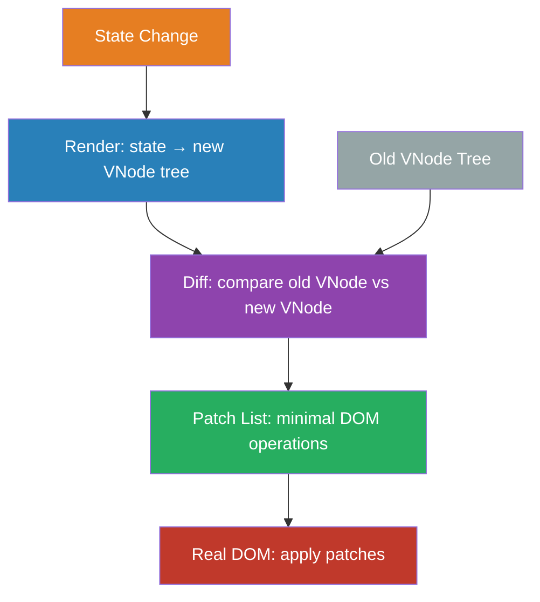
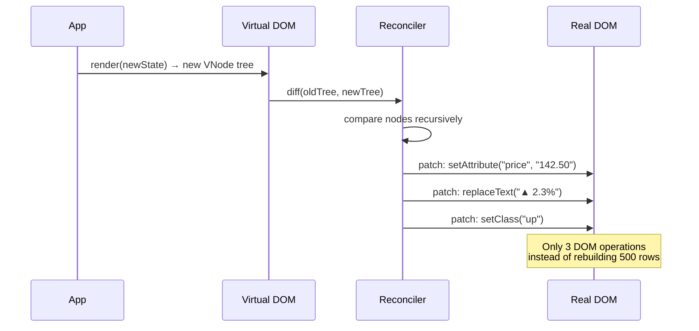

# Virtual DOM & Reconciliation

## 1. The Problem (Story)

You're building a real-time stock ticker. It shows 500 stocks, each with a name, price, change percentage, and a color-coded arrow (green up, red down). Prices update every 100ms via WebSocket — but only 5-10 stocks change per tick.

Your first implementation directly manipulates the DOM:

```typescript
function updateStocks(stocks: Stock[]) {
  const container = document.getElementById('stock-list')!;
  container.innerHTML = ''; // Nuclear option: destroy everything
  
  for (const stock of stocks) {
    const row = document.createElement('div');
    row.className = 'stock-row';
    row.innerHTML = `
      <span class="name">${stock.name}</span>
      <span class="price">${stock.price.toFixed(2)}</span>
      <span class="change ${stock.change > 0 ? 'up' : 'down'}">
        ${stock.change > 0 ? '▲' : '▼'} ${Math.abs(stock.change).toFixed(2)}%
      </span>
    `;
    container.appendChild(row);
  }
}
```

Every 100ms, this:
1. **Destroys** 500 DOM nodes (innerHTML = '')
2. **Creates** 500 new DOM nodes
3. **Triggers layout recalculation** for 500 rows
4. **Repaints** the entire list

The browser drops to 15 FPS. Scrolling stutters. CSS animations restart on every update because the elements are new. The scroll position resets. Input fields in the stock row (for alerts) lose focus and user-typed content.

Profiling reveals: **90% of the time is spent in DOM operations**. The actual computation (building HTML strings) takes <1ms. The DOM is 100x slower than JavaScript.

## 2. The Naïve Solutions

### Attempt 1: "Only update changed rows"

Track which stocks changed and update only those DOM nodes:

```typescript
function updateStock(stock: Stock) {
  const row = document.getElementById(`stock-${stock.id}`);
  if (!row) return;
  row.querySelector('.price')!.textContent = stock.price.toFixed(2);
  row.querySelector('.change')!.textContent = `${Math.abs(stock.change).toFixed(2)}%`;
  row.querySelector('.change')!.className = `change ${stock.change > 0 ? 'up' : 'down'}`;
}
```

This works for updates, but what about:
- Adding a new stock to the list? Where in the DOM does it go?
- Removing a stock that was delisted? Which DOM node to remove?
- Reordering by price? Which nodes to move?
- The stock row has nested components (sparkline chart, alert form) — do you update those manually too?

You end up with 200 lines of DOM manipulation code per component, handling every possible state transition manually. Add a new field to the stock row? Touch 5 functions.

### Attempt 2: "Template diffing with strings"

Compare the old HTML string with the new one and find changed parts:

```typescript
const oldHTML = container.innerHTML;
const newHTML = renderStocks(stocks);
// Diff strings... somehow?
```

HTML string diffing is extremely hard. `<div class="a b">` and `<div class="b a">` are semantically identical but string-different. Attributes can be in any order. Self-closing tags, whitespace, encoding — the problem is enormous. And even if you find the diff, you'd need to map string positions back to DOM nodes.

### Attempt 3: "DOM diffing directly"

Compare the live DOM tree with the desired state:

```typescript
function diffDOM(oldNode: Element, newNode: Element) {
  // Compare attributes, children, text content...
}
```

Closer to the right idea, but diffing the actual DOM is slow because *reading* DOM properties triggers layout calculations. Every `.className`, `.style`, `.textContent` access can force the browser to recalculate layout. You're trying to avoid DOM operations, but the diffing itself causes them.

## 3. The Insight

**Don't compare DOM to DOM. Compare a lightweight JavaScript representation of the UI to another lightweight JavaScript representation.** Build a "virtual" tree of plain objects describing what the DOM should look like. When state changes, build a new virtual tree, diff the two JavaScript trees (fast — no layout, no painting, no browser APIs), compute the minimal set of actual DOM operations needed, and apply only those.

## 4. The Pattern

**Virtual DOM & Reconciliation** interposes a lightweight in-memory representation between application state and the real DOM:

- **Virtual DOM (VNode)**: A plain JavaScript object tree describing what the UI should look like. No browser APIs, no performance cost to create.
- **Render**: A pure function that takes state and returns a new VNode tree.
- **Diffing (Reconciliation)**: Compares the old VNode tree with the new one to compute the minimal set of changes.
- **Patching**: Applies only the necessary operations to the real DOM.

### Guarantees
- DOM operations are minimized — only changed attributes/nodes are touched
- The developer writes declarative render functions, not imperative DOM manipulation
- State → UI mapping is predictable: given the same state, the same VNode tree is produced
- Batching: multiple state changes within a tick produce one diff, one patch

### Non-Guarantees
- Virtual DOM is NOT zero-cost — diffing takes O(n) time proportional to tree size
- Doesn't guarantee optimal DOM operations — the diff algorithm uses heuristics
- Doesn't solve the "re-render the world" problem for very large trees (10K+ nodes — use virtualization)
- Framework overhead exists — sometimes direct DOM manipulation is genuinely faster

## 5. Mental Model

**Blueprints vs. the building.** You don't renovate a house by demolishing it and rebuilding from scratch. Instead, you draw two blueprints — the current layout and the desired layout. You compare the two blueprints on paper (fast, cheap). You find the differences: "move this wall, add a window here, repaint that room." Then you make only those specific changes to the real building. The blueprints (Virtual DOM) are cheap to create and compare. The real construction (DOM operations) is expensive, so you minimize it.

## 6. Structure





## 7. Code Example

### TypeScript — Virtual DOM with diff and patch

```typescript
// ─── VNODE: lightweight representation ───────────────

interface VNode {
  tag: string;
  props: Record<string, string | number | boolean | Function>;
  children: Array<VNode | string>;
  key?: string; // For list reconciliation
}

function h(
  tag: string,
  props: Record<string, any> = {},
  ...children: Array<VNode | string>
): VNode {
  const { key, ...restProps } = props;
  return { tag, props: restProps, children, key };
}

// ─── DIFF: compare two VNode trees ───────────────────

type Patch =
  | { type: 'CREATE'; node: VNode | string }
  | { type: 'REMOVE' }
  | { type: 'REPLACE'; node: VNode | string }
  | { type: 'UPDATE'; propPatches: PropPatch[]; childPatches: Array<Patch | null> }
  | null; // No change

interface PropPatch {
  key: string;
  value: string | number | boolean | Function | null; // null = remove
}

function diff(oldNode: VNode | string | undefined, newNode: VNode | string | undefined): Patch {
  // Case 1: Node was added
  if (oldNode === undefined) {
    return newNode !== undefined ? { type: 'CREATE', node: newNode } : null;
  }

  // Case 2: Node was removed
  if (newNode === undefined) {
    return { type: 'REMOVE' };
  }

  // Case 3: Text nodes
  if (typeof oldNode === 'string' || typeof newNode === 'string') {
    if (oldNode !== newNode) {
      return { type: 'REPLACE', node: newNode };
    }
    return null;
  }

  // Case 4: Different tag → full replace
  if (oldNode.tag !== newNode.tag) {
    return { type: 'REPLACE', node: newNode };
  }

  // Case 5: Same tag → diff props and children
  const propPatches = diffProps(oldNode.props, newNode.props);
  const childPatches = diffChildren(oldNode.children, newNode.children);

  if (propPatches.length === 0 && childPatches.every(p => p === null)) {
    return null; // No changes
  }

  return { type: 'UPDATE', propPatches, childPatches };
}

function diffProps(
  oldProps: Record<string, any>,
  newProps: Record<string, any>,
): PropPatch[] {
  const patches: PropPatch[] = [];

  // Changed or added props
  for (const [key, value] of Object.entries(newProps)) {
    if (oldProps[key] !== value) {
      patches.push({ key, value });
    }
  }

  // Removed props
  for (const key of Object.keys(oldProps)) {
    if (!(key in newProps)) {
      patches.push({ key, value: null });
    }
  }

  return patches;
}

function diffChildren(
  oldChildren: Array<VNode | string>,
  newChildren: Array<VNode | string>,
): Array<Patch | null> {
  const patches: Array<Patch | null> = [];
  const maxLen = Math.max(oldChildren.length, newChildren.length);

  for (let i = 0; i < maxLen; i++) {
    patches.push(diff(oldChildren[i], newChildren[i]));
  }

  return patches;
}

// ─── PATCH: apply minimal changes to real DOM ────────

function patch(parent: any, patches: Patch, index: number = 0): void {
  if (!patches) return;

  // In a real implementation, this would call DOM APIs:
  // document.createElement, setAttribute, removeChild, etc.
  // Here we log the operations for clarity.

  switch (patches.type) {
    case 'CREATE':
      console.log(`  CREATE node at index ${index}`);
      break;
    case 'REMOVE':
      console.log(`  REMOVE node at index ${index}`);
      break;
    case 'REPLACE':
      console.log(`  REPLACE node at index ${index}`);
      break;
    case 'UPDATE':
      for (const prop of patches.propPatches) {
        if (prop.value === null) {
          console.log(`  REMOVE prop "${prop.key}" at index ${index}`);
        } else {
          console.log(`  SET prop "${prop.key}" = "${prop.value}" at index ${index}`);
        }
      }
      patches.childPatches.forEach((childPatch, i) => {
        patch(parent, childPatch, i);
      });
      break;
  }
}

// ─── STOCK TICKER EXAMPLE ────────────────────────────

interface Stock {
  id: string;
  name: string;
  price: number;
  change: number;
}

function renderStock(stock: Stock): VNode {
  const direction = stock.change > 0 ? 'up' : 'down';
  const arrow = stock.change > 0 ? '▲' : '▼';

  return h('div', { class: `stock-row ${direction}`, key: stock.id },
    h('span', { class: 'name' }, stock.name),
    h('span', { class: 'price' }, stock.price.toFixed(2)),
    h('span', { class: `change ${direction}` },
      `${arrow} ${Math.abs(stock.change).toFixed(2)}%`,
    ),
  );
}

function renderTicker(stocks: Stock[]): VNode {
  return h('div', { class: 'ticker' },
    ...stocks.map(s => renderStock(s)),
  );
}

// ─── DEMO: minimal updates ──────────────────────────

const oldStocks: Stock[] = [
  { id: 'AAPL', name: 'Apple',     price: 150.00, change: 1.2 },
  { id: 'GOOG', name: 'Google',    price: 140.00, change: -0.5 },
  { id: 'MSFT', name: 'Microsoft', price: 380.00, change: 0.8 },
];

// Only AAPL's price changed (150 → 152), others are identical
const newStocks: Stock[] = [
  { id: 'AAPL', name: 'Apple',     price: 152.00, change: 2.5 },  // changed!
  { id: 'GOOG', name: 'Google',    price: 140.00, change: -0.5 }, // same
  { id: 'MSFT', name: 'Microsoft', price: 380.00, change: 0.8 },  // same
];

const oldTree = renderTicker(oldStocks);
const newTree = renderTicker(newStocks);

console.log('Diffing stock ticker...');
const patches = diff(oldTree, newTree);
console.log('Patches to apply:');
patch(null, patches);

// Output: Only AAPL's price and change text are patched.
// GOOG and MSFT rows are untouched — zero DOM operations for unchanged rows.

// ─── KEY-BASED LIST RECONCILIATION ───────────────────
// When items are reordered, keys prevent unnecessary recreations.

function diffKeyedChildren(
  oldChildren: VNode[],
  newChildren: VNode[],
): { moves: string[] } {
  const oldKeyMap = new Map(oldChildren.map((c, i) => [c.key, i]));
  const moves: string[] = [];

  for (let newIdx = 0; newIdx < newChildren.length; newIdx++) {
    const newChild = newChildren[newIdx];
    const oldIdx = oldKeyMap.get(newChild.key!);

    if (oldIdx === undefined) {
      moves.push(`INSERT ${newChild.key} at ${newIdx}`);
    } else if (oldIdx !== newIdx) {
      moves.push(`MOVE ${newChild.key} from ${oldIdx} to ${newIdx}`);
    }
    // else: same position, just diff props
  }

  for (const [key] of oldKeyMap) {
    if (!newChildren.find(c => c.key === key)) {
      moves.push(`REMOVE ${key}`);
    }
  }

  return { moves };
}

// Example: stocks reordered by price (no recreations, just moves)
const reordered: VNode[] = [
  h('div', { key: 'MSFT' }, 'Microsoft $380'),
  h('div', { key: 'AAPL' }, 'Apple $152'),
  h('div', { key: 'GOOG' }, 'Google $140'),
];

const original: VNode[] = [
  h('div', { key: 'AAPL' }, 'Apple $152'),
  h('div', { key: 'GOOG' }, 'Google $140'),
  h('div', { key: 'MSFT' }, 'Microsoft $380'),
];

console.log('\nKey-based reorder:');
console.log(diffKeyedChildren(original, reordered));
// MOVE MSFT from 2 to 0, MOVE AAPL from 0 to 1, MOVE GOOG from 1 to 2
// No create or destroy — just DOM node moves
```

### Go — Virtual DOM diffing

```go
package main

import (
	"fmt"
	"strings"
)

// ─── VNODE ───────────────────────────────────────────

type VNode struct {
	Tag      string
	Props    map[string]string
	Children []*VNode
	Text     string // leaf text node
	Key      string
}

func H(tag string, props map[string]string, children ...*VNode) *VNode {
	return &VNode{Tag: tag, Props: props, Children: children}
}

func Text(s string) *VNode {
	return &VNode{Text: s}
}

// ─── DIFF ────────────────────────────────────────────

type PatchOp struct {
	Type string // CREATE, REMOVE, REPLACE, SET_PROP, REMOVE_PROP
	Path string
	Key  string
	Val  string
}

func Diff(old, new *VNode, path string) []PatchOp {
	var ops []PatchOp

	if old == nil && new != nil {
		ops = append(ops, PatchOp{Type: "CREATE", Path: path})
		return ops
	}
	if old != nil && new == nil {
		ops = append(ops, PatchOp{Type: "REMOVE", Path: path})
		return ops
	}
	if old == nil && new == nil {
		return ops
	}

	// Text nodes
	if old.Text != "" || new.Text != "" {
		if old.Text != new.Text {
			ops = append(ops, PatchOp{Type: "REPLACE", Path: path, Val: new.Text})
		}
		return ops
	}

	// Different tags → full replace
	if old.Tag != new.Tag {
		ops = append(ops, PatchOp{Type: "REPLACE", Path: path})
		return ops
	}

	// Diff props
	for k, v := range new.Props {
		if old.Props[k] != v {
			ops = append(ops, PatchOp{Type: "SET_PROP", Path: path, Key: k, Val: v})
		}
	}
	for k := range old.Props {
		if _, ok := new.Props[k]; !ok {
			ops = append(ops, PatchOp{Type: "REMOVE_PROP", Path: path, Key: k})
		}
	}

	// Diff children
	maxLen := len(old.Children)
	if len(new.Children) > maxLen {
		maxLen = len(new.Children)
	}
	for i := 0; i < maxLen; i++ {
		var oldChild, newChild *VNode
		if i < len(old.Children) {
			oldChild = old.Children[i]
		}
		if i < len(new.Children) {
			newChild = new.Children[i]
		}
		childPath := fmt.Sprintf("%s/%s[%d]", path, old.Tag, i)
		ops = append(ops, Diff(oldChild, newChild, childPath)...)
	}

	return ops
}

// ─── EXAMPLE ─────────────────────────────────────────

func main() {
	old := H("div", map[string]string{"class": "ticker"},
		H("div", map[string]string{"class": "stock-row up"},
			Text("AAPL $150.00 ▲ 1.2%"),
		),
		H("div", map[string]string{"class": "stock-row down"},
			Text("GOOG $140.00 ▼ 0.5%"),
		),
	)

	// Only AAPL changed
	new := H("div", map[string]string{"class": "ticker"},
		H("div", map[string]string{"class": "stock-row up"},
			Text("AAPL $152.00 ▲ 2.5%"), // changed
		),
		H("div", map[string]string{"class": "stock-row down"},
			Text("GOOG $140.00 ▼ 0.5%"), // same
		),
	)

	ops := Diff(old, new, "root")

	fmt.Println("Patches:")
	for _, op := range ops {
		parts := []string{op.Type, op.Path}
		if op.Key != "" {
			parts = append(parts, op.Key+"="+op.Val)
		} else if op.Val != "" {
			parts = append(parts, op.Val)
		}
		fmt.Println(" ", strings.Join(parts, " | "))
	}
	// Only the AAPL text node is replaced. GOOG is untouched.
}
```

## 8. Gotchas & Beginner Mistakes

| Mistake | Why It Happens | Fix |
|---------|---------------|-----|
| Missing keys in lists | `items.map(i => <Item />)` without `key` prop | Without keys, reordering a list recreates all nodes. Always use stable, unique keys (NOT array indices). |
| Using array index as key | `items.map((i, idx) => <Item key={idx} />)` | Index keys break on reorder/insert/delete. Use domain IDs: `key={item.id}` |
| Creating objects in render | `<Item style={{ color: 'red' }} />` creates a new object every render → always "changed" | Hoist static objects outside render, or use memoization |
| Premature optimization | Building a custom Virtual DOM for a CRUD app | Real Virtual DOM implementations (React, Vue) are heavily optimized. Use the framework's. |
| Assuming Virtual DOM is always faster | "Virtual DOM = fast, direct DOM = slow" | For small, targeted updates, direct DOM manipulation is faster. Virtual DOM pays overhead for convenience. |
| Over-rendering large trees | Rendering 10,000 VNodes even though only 50 are visible | Use windowed/virtual list (react-window, Tanstack Virtual) to render only visible items |

## 9. Related & Confusable Patterns

| Pattern | Relationship | Key Difference |
|---------|-------------|----------------|
| **Reactive State (Signals)** | Alternative | Signals skip the diff step entirely — they know exactly what changed. Virtual DOM diffs to *discover* what changed. |
| **Incremental DOM** | Alternative | Incremental DOM (Google's approach) diffs against the real DOM during render, using less memory (no virtual tree) but more CPU per diff. |
| **Component Composition** | Complementary | Components define the tree structure. Virtual DOM handles the rendering and updating of that tree. |
| **Flyweight** | Structural parallel | VNodes are lightweight representations of heavier DOM nodes — similar to Flyweight's shared data approach. |
| **Double Buffering** | Conceptual cousin | Like video double-buffering (render to off-screen buffer, then swap), VDOM renders to an off-screen tree then patches the real DOM. |
| **Server-Side Rendering** | Complementary | SSR generates the initial HTML. Virtual DOM takes over after hydration for client-side updates. |

## 10. When This Pattern Is the WRONG Choice

| Scenario | Why Virtual DOM Hurts | Better Alternative |
|----------|----------------------|-------------------|
| Static sites with no interactivity | Diffing overhead for content that never changes | Static HTML generation (Astro, 11ty) |
| Canvas/WebGL rendering | Games and visualizations don't use DOM nodes | Direct rendering API, scene graph, requestAnimationFrame |
| Extremely large lists (10K+ items) | Diffing 10K VNodes is expensive even in JS | Virtual (windowed) list: only render visible items |
| Fine-grained reactive apps (spreadsheets) | VDOM diffs the whole tree; signals update exact cells | Reactive state (Signals/Observables) |
| Performance-critical animations | VDOM batches updates per frame; animations need per-pixel control | CSS animations, Web Animations API, direct DOM manipulation |

**Symptom you need Virtual DOM**: You're writing imperative DOM manipulation code (`createElement`, `setAttribute`, `removeChild`) and it's becoming unmanageable. You have bugs where the DOM doesn't match the application state because you forgot to update one element.

**Back-out strategy**: If Virtual DOM overhead is a bottleneck (profiled, not assumed), consider: (1) windowed rendering for large lists, (2) `shouldComponentUpdate`/`memo` to skip subtrees, (3) moving hot paths to signals/direct DOM, (4) Web Workers for expensive computations outside the main thread.
