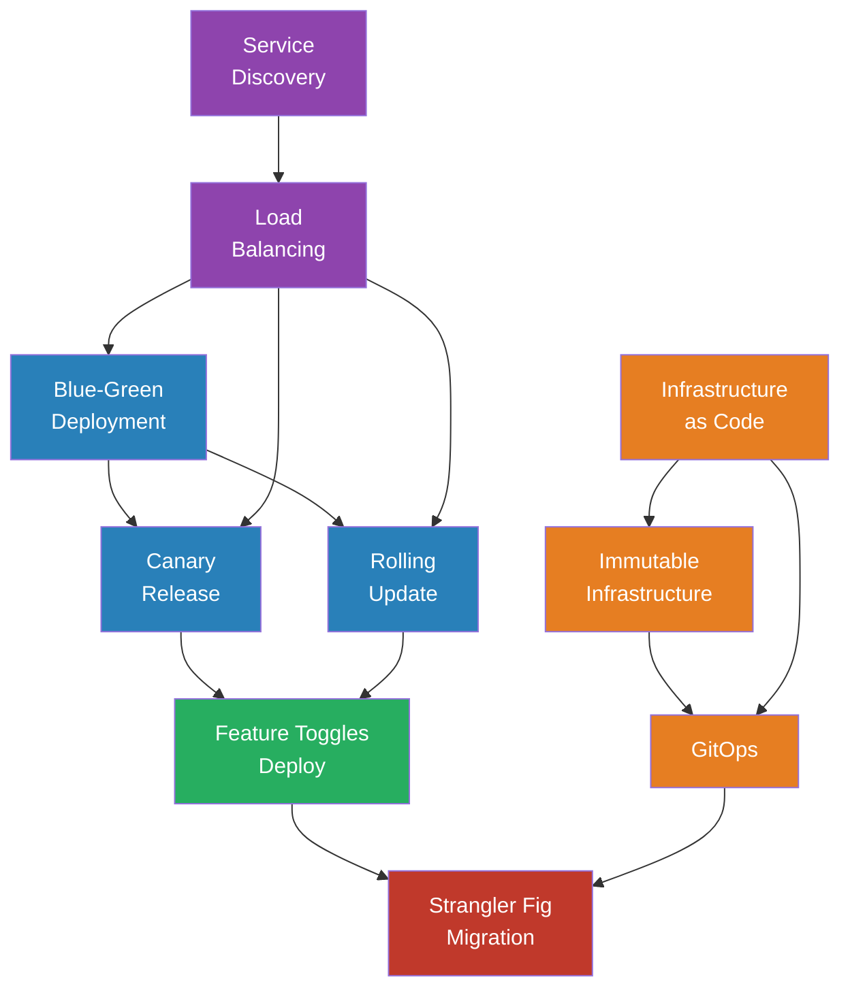

# Module 09 — Deployment & Infrastructure

> How code gets to production safely — and stays there.

## Why This Module Exists

You can build the most elegant code in the world, but if you can't deploy it reliably, roll it back when it breaks, and scale it under load, none of that elegance matters. Deployment patterns sit at the boundary between "it works on my machine" and "it works for 10 million users."

This module covers the recurring patterns for getting software from a developer's branch to production, managing infrastructure as code, routing traffic safely, and handling the inevitable failures that occur at scale.

## Pattern Index

| # | Pattern | File | One-Line Summary |
|---|---------|------|------------------|
| 1 | Blue-Green Deployment | [blue-green-deployment.md](blue-green-deployment.md) | Run two identical environments; switch traffic atomically |
| 2 | Canary Release | [canary-release.md](canary-release.md) | Route a small percentage of traffic to the new version first |
| 3 | Rolling Update | [rolling-update.md](rolling-update.md) | Replace instances one at a time, keeping the service available |
| 4 | Feature Toggles (Deploy) | [feature-toggles-deploy.md](feature-toggles-deploy.md) | Decouple deployment from release with runtime flags |
| 5 | Infrastructure as Code | [infrastructure-as-code.md](infrastructure-as-code.md) | Define infrastructure in version-controlled declarative files |
| 6 | Immutable Infrastructure | [immutable-infrastructure.md](immutable-infrastructure.md) | Never patch servers — replace them entirely |
| 7 | GitOps | [gitops.md](gitops.md) | Git as the single source of truth for infrastructure state |
| 8 | Service Discovery | [service-discovery.md](service-discovery.md) | Let services find each other dynamically at runtime |
| 9 | Load Balancing | [load-balancing.md](load-balancing.md) | Distribute traffic across multiple instances |
| 10 | Strangler Fig Migration | [strangler-fig.md](strangler-fig.md) | Incrementally replace a legacy system without a big-bang rewrite |

## Dependency Graph

## Reading Order

| Phase | Patterns | Why This Order |
|-------|----------|---------------|
| **Traffic Routing** | Service Discovery → Load Balancing | You need to find services and distribute traffic before deploying |
| **Deploy Strategies** | Blue-Green → Canary → Rolling Update | From simplest (switch all) to most gradual (one by one) |
| **Release Control** | Feature Toggles (Deploy) | Decouple deploy from release — builds on deploy strategies |
| **Infrastructure** | IaC → Immutable Infrastructure → GitOps | From defining infra to never mutating it to automating it |
| **Migration** | Strangler Fig | Uses everything above to safely replace legacy systems |

## Connection to Other Modules

- **Module 05 (Reliability)**: Circuit breakers and retries protect services during rolling updates. Health checks drive load balancer decisions.
- **Module 06 (API)**: API versioning works hand-in-hand with canary releases to manage breaking changes.
- **Module 07 (State & Workflow)**: Feature flags (Module 07's version) focus on business logic; this module's feature toggles focus on deployment mechanics.
- **Module 08 (Frontend)**: Micro-frontends require independent deployment pipelines — the patterns here make that possible.

## Key Tensions

| Tension | Pull A | Pull B |
|---------|--------|--------|
| Speed vs. Safety | Deploy faster to ship value | Deploy carefully to avoid outages |
| Simplicity vs. Control | One deploy target, one config | Fine-grained traffic routing per environment |
| Mutable vs. Immutable | Patch in place (fast, cheap) | Replace entirely (reliable, reproducible) |
| Manual vs. Automated | Human judgment for critical deploys | Full automation for speed and consistency |
