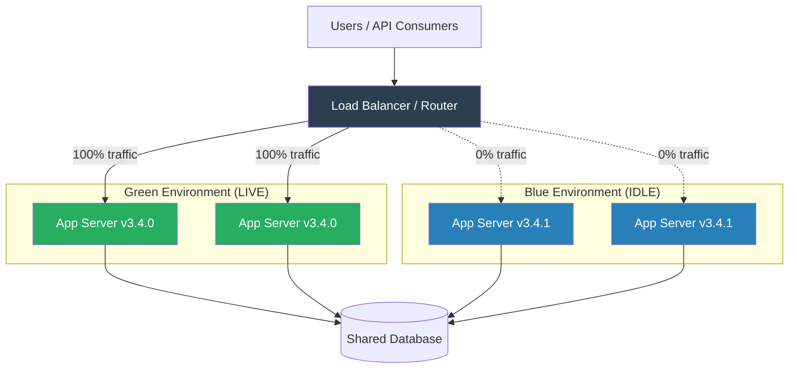
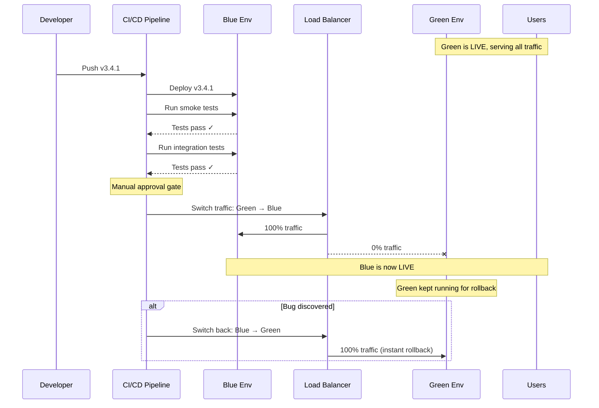

# Blue-Green Deployment

## 1. The Problem (Story)

Your SaaS billing platform processes $2.3M in transactions daily. Every time you deploy, there's a maintenance window: 2 AM Saturday, 15 minutes downtime, "We'll be right back" page. During that window, customers can't pay invoices. Subscription renewals fail. API consumers get 503 errors.

Last month, you deployed version 3.4.1 at 2 AM. The new invoice rendering code had a bug — invoices showed $0.00 for all line items. By the time QA noticed at 2:47 AM, 340 invoices had been emailed to customers. Rolling back took another 12 minutes because the database migration had to be reversed manually. Two engineers were on call until 4 AM.

The team is growing. You need to deploy daily, not weekly. But every deployment is a high-stress event with downtime, risk, and 2 AM wake-up calls.

**The core tension: deploying new code requires downtime, and rolling back is slow and manual.**

## 2. The Naïve Solutions

### Attempt 1: "Deploy in place"

Stop the server, copy new files, start the server:

```typescript
// deploy.sh (conceptual)
async function deployInPlace(server: string, newVersion: string): Promise<void> {
  console.log(`Stopping server ${server}...`);
  // Server is DOWN from this point
  await stopService(server);

  console.log(`Deploying ${newVersion}...`);
  await copyFiles(newVersion, server);
  await runMigrations(server);

  console.log(`Starting server...`);
  await startService(server);
  // Server is UP again — but what if startup fails?

  const healthy = await healthCheck(server);
  if (!healthy) {
    // Panic. Server is down. Old version is gone.
    console.error('DEPLOYMENT FAILED. MANUAL INTERVENTION REQUIRED.');
  }
}
```

Works for toy projects. Problems at scale:
- Downtime between stop and start (30 seconds to 5 minutes)
- If the new version fails to start, you have nothing running
- Rolling back means re-deploying the old version — which takes another downtime window
- No way to test the new version with production traffic before switching

### Attempt 2: "Deploy to half the servers"

With 4 servers, deploy to servers 3 and 4 first, then 1 and 2:

```typescript
// This is a rolling update — covered in its own pattern.
// The problem: during deployment, BOTH versions serve traffic simultaneously.
async function halfAndHalf(servers: string[], newVersion: string): Promise<void> {
  const firstHalf = servers.slice(0, 2);
  const secondHalf = servers.slice(2);

  for (const server of firstHalf) {
    await deployInPlace(server, newVersion);
  }
  // Users hitting server 1-2 get v3.4.1
  // Users hitting server 3-4 get v3.4.0
  // If v3.4.1 has different API responses... inconsistent behavior!

  for (const server of secondHalf) {
    await deployInPlace(server, newVersion);
  }
}
```

Mixed versions cause problems: session affinity breaks, API consumers get inconsistent responses, database schema changes can't be applied until all servers are updated.

### Attempt 3: "DNS switch"

Point `app.example.com` to new servers via DNS:

```
app.example.com → 10.0.1.50 (old server)
# Change DNS:
app.example.com → 10.0.2.50 (new server)
```

DNS propagation takes minutes to hours. During propagation, some users hit old servers, some hit new. You can't control the timing. Rollback is equally slow.

## 3. The Insight

**Maintain two identical production environments. One serves live traffic ("green"), one is idle ("blue"). Deploy to the idle environment, verify it works, then switch all traffic instantly.** The switch is a single load balancer configuration change — not a DNS change, not a file copy. The old environment remains running and unchanged, so rollback is the same instant switch in reverse.

## 4. The Pattern

**Blue-Green Deployment** eliminates downtime and risk by maintaining two production environments:

- **Green Environment**: Currently serving live traffic. Untouched during deployment.
- **Blue Environment**: Idle. Receives the new version, gets validated, then becomes the new "green" when the router switches.
- **Router/Load Balancer**: The single point that controls which environment receives traffic. The switch is atomic.

### Guarantees
- Zero downtime: green serves traffic the entire time blue is being prepared
- Instant rollback: switch the router back to green (seconds, not minutes)
- Full production validation: blue can be tested with the exact production configuration before receiving traffic
- Atomic cutover: all traffic switches at once — no mixed versions

### Non-Guarantees
- Does not handle database schema migrations that are backward-incompatible
- Does not protect against bugs that only appear under real user load (use canary for that)
- Does not reduce infrastructure costs (you need 2x capacity)
- Does not solve configuration drift between environments (that's IaC's job)

## 5. Mental Model

**A theater with two stages.** While the audience watches the play on Stage A (green), the crew sets up the next act on Stage B (blue) — new props, new lighting, new backdrops. When everything is ready and rehearsed, the curtain drops on Stage A and rises on Stage B. If something goes wrong on Stage B, you drop the curtain and immediately re-open Stage A. The audience never sees the setup work, and the transition is near-instant.

## 6. Structure

```mermaid
gantt
    title Blue-Green Deployment Timeline
    dateFormat X
    axisFormat %s

    section Green (Live)
    Serving traffic     :active, g1, 0, 60
    Available for rollback :g2, 60, 90

    section Blue (Idle → Live)
    Deploy new version  :b1, 10, 25
    Run tests           :b2, 25, 40
    Approval gate       :b3, 40, 50
    Switch traffic      :crit, b4, 50, 52
    Serving traffic     :active, b5, 52, 90

    section Downtime
    None                :done, d1, 0, 0
```







## 7. Code Example

### TypeScript — Blue-Green deployment orchestrator

```typescript
// ─── ENVIRONMENT MODEL ───────────────────────────────

type EnvironmentColor = 'blue' | 'green';
type EnvironmentStatus = 'idle' | 'deploying' | 'testing' | 'live' | 'draining';

interface Environment {
  color: EnvironmentColor;
  status: EnvironmentStatus;
  version: string;
  instances: string[];
  healthEndpoint: string;
}

interface DeployResult {
  success: boolean;
  version: string;
  activeColor: EnvironmentColor;
  rollbackAvailable: boolean;
  error?: string;
}

// ─── ROUTER (Load Balancer abstraction) ──────────────

class Router {
  private activeColor: EnvironmentColor = 'green';
  private environments: Map<EnvironmentColor, Environment> = new Map();

  registerEnvironment(env: Environment): void {
    this.environments.set(env.color, env);
  }

  getActive(): Environment {
    return this.environments.get(this.activeColor)!;
  }

  getIdle(): Environment {
    const idleColor: EnvironmentColor = this.activeColor === 'green' ? 'blue' : 'green';
    return this.environments.get(idleColor)!;
  }

  switchTraffic(): EnvironmentColor {
    const previousActive = this.activeColor;
    this.activeColor = this.activeColor === 'green' ? 'blue' : 'green';
    console.log(`[Router] Traffic switched: ${previousActive} → ${this.activeColor}`);
    return this.activeColor;
  }

  getActiveColor(): EnvironmentColor {
    return this.activeColor;
  }
}

// ─── HEALTH CHECKER ──────────────────────────────────

async function checkHealth(env: Environment): Promise<boolean> {
  // Simulate health check — in production, hit the /health endpoint
  console.log(`[Health] Checking ${env.color} (${env.version})...`);
  await delay(200);

  // Simulate: if version contains "bad", it's unhealthy
  const healthy = !env.version.includes('bad');
  console.log(`[Health] ${env.color}: ${healthy ? 'HEALTHY ✓' : 'UNHEALTHY ✗'}`);
  return healthy;
}

async function runSmokeTests(env: Environment): Promise<boolean> {
  console.log(`[Tests] Running smoke tests on ${env.color} (${env.version})...`);
  await delay(500);

  const passed = !env.version.includes('bad');
  console.log(`[Tests] Smoke tests: ${passed ? 'PASSED ✓' : 'FAILED ✗'}`);
  return passed;
}

// ─── BLUE-GREEN ORCHESTRATOR ─────────────────────────

class BlueGreenDeployer {
  private router: Router;
  private deployHistory: { version: string; color: EnvironmentColor; timestamp: number }[] = [];

  constructor(router: Router) {
    this.router = router;
  }

  async deploy(newVersion: string): Promise<DeployResult> {
    const idle = this.router.getIdle();
    const active = this.router.getActive();
    console.log(`\n${'='.repeat(50)}`);
    console.log(`[Deploy] Starting blue-green deployment`);
    console.log(`[Deploy] Current live: ${active.color} (${active.version})`);
    console.log(`[Deploy] Target:       ${idle.color} (will become ${newVersion})`);
    console.log('='.repeat(50));

    // Step 1: Deploy to idle environment
    console.log(`\n[Step 1] Deploying ${newVersion} to ${idle.color}...`);
    idle.status = 'deploying';
    idle.version = newVersion;
    await delay(300); // Simulate deployment
    console.log(`[Step 1] Deployment complete.`);

    // Step 2: Health check
    console.log(`\n[Step 2] Health check...`);
    idle.status = 'testing';
    const healthy = await checkHealth(idle);
    if (!healthy) {
      idle.status = 'idle';
      return {
        success: false,
        version: newVersion,
        activeColor: this.router.getActiveColor(),
        rollbackAvailable: false,
        error: 'Health check failed. Deployment aborted. No traffic switched.',
      };
    }

    // Step 3: Smoke tests
    console.log(`\n[Step 3] Smoke tests...`);
    const passed = await runSmokeTests(idle);
    if (!passed) {
      idle.status = 'idle';
      return {
        success: false,
        version: newVersion,
        activeColor: this.router.getActiveColor(),
        rollbackAvailable: false,
        error: 'Smoke tests failed. Deployment aborted. No traffic switched.',
      };
    }

    // Step 4: Switch traffic
    console.log(`\n[Step 4] Switching traffic...`);
    active.status = 'draining';
    idle.status = 'live';
    const newActive = this.router.switchTraffic();

    // Step 5: Keep old environment for rollback
    console.log(`\n[Step 5] ${active.color} kept running for rollback.`);
    active.status = 'idle'; // Still running, just not receiving traffic

    this.deployHistory.push({
      version: newVersion,
      color: newActive,
      timestamp: Date.now(),
    });

    return {
      success: true,
      version: newVersion,
      activeColor: newActive,
      rollbackAvailable: true,
    };
  }

  async rollback(): Promise<DeployResult> {
    const active = this.router.getActive();
    const idle = this.router.getIdle();

    console.log(`\n[Rollback] Rolling back from ${active.color} (${active.version})`);
    console.log(`[Rollback] Switching to ${idle.color} (${idle.version})`);

    // The magic: rollback is just another traffic switch
    active.status = 'idle';
    idle.status = 'live';
    const newActive = this.router.switchTraffic();

    console.log(`[Rollback] Complete. Active: ${newActive}`);

    return {
      success: true,
      version: idle.version,
      activeColor: newActive,
      rollbackAvailable: true,
    };
  }

  getStatus(): void {
    const active = this.router.getActive();
    const idle = this.router.getIdle();
    console.log(`\n[Status] Active: ${active.color} (${active.version}) [${active.status}]`);
    console.log(`[Status] Idle:   ${idle.color} (${idle.version}) [${idle.status}]`);
  }
}

// ─── HELPERS ─────────────────────────────────────────

function delay(ms: number): Promise<void> {
  return new Promise(resolve => setTimeout(resolve, ms));
}

// ─── SCENARIO ────────────────────────────────────────

async function demo() {
  // Set up two environments
  const router = new Router();
  router.registerEnvironment({
    color: 'green',
    status: 'live',
    version: 'v3.4.0',
    instances: ['green-1', 'green-2'],
    healthEndpoint: '/health',
  });
  router.registerEnvironment({
    color: 'blue',
    status: 'idle',
    version: 'v3.3.0', // Previous version still on blue
    instances: ['blue-1', 'blue-2'],
    healthEndpoint: '/health',
  });

  const deployer = new BlueGreenDeployer(router);
  deployer.getStatus();

  // Deploy v3.4.1 (success)
  const result1 = await deployer.deploy('v3.4.1');
  console.log('\nResult:', result1);
  deployer.getStatus();

  // Deploy v3.5.0-bad (failure — aborted before traffic switch)
  const result2 = await deployer.deploy('v3.5.0-bad');
  console.log('\nResult:', result2);
  deployer.getStatus();

  // Deploy v3.5.0 (success)
  const result3 = await deployer.deploy('v3.5.0');
  console.log('\nResult:', result3);
  deployer.getStatus();

  // Oh no, a bug! Rollback instantly
  const rollbackResult = await deployer.rollback();
  console.log('\nRollback result:', rollbackResult);
  deployer.getStatus();
}

demo();
```

### Go — Blue-Green orchestrator

```go
package main

import (
	"fmt"
	"strings"
	"time"
)

// ─── TYPES ───────────────────────────────────────────

type Color string

const (
	Blue  Color = "blue"
	Green Color = "green"
)

type Environment struct {
	Color   Color
	Version string
	Status  string // idle, deploying, testing, live
}

type Router struct {
	active Color
	envs   map[Color]*Environment
}

func NewRouter() *Router {
	return &Router{
		active: Green,
		envs:   make(map[Color]*Environment),
	}
}

func (r *Router) Register(env *Environment) {
	r.envs[env.Color] = env
}

func (r *Router) Active() *Environment  { return r.envs[r.active] }

func (r *Router) Idle() *Environment {
	if r.active == Green {
		return r.envs[Blue]
	}
	return r.envs[Green]
}

func (r *Router) Switch() Color {
	prev := r.active
	if r.active == Green {
		r.active = Blue
	} else {
		r.active = Green
	}
	fmt.Printf("[Router] Traffic: %s → %s\n", prev, r.active)
	return r.active
}

// ─── DEPLOYER ────────────────────────────────────────

type Deployer struct {
	router *Router
}

func (d *Deployer) Deploy(version string) error {
	idle := d.router.Idle()
	active := d.router.Active()
	fmt.Printf("\n[Deploy] Live: %s (%s) → Deploying %s to %s\n",
		active.Color, active.Version, version, idle.Color)

	// Deploy
	idle.Status = "deploying"
	idle.Version = version
	time.Sleep(100 * time.Millisecond)

	// Health check
	idle.Status = "testing"
	if strings.Contains(version, "bad") {
		idle.Status = "idle"
		return fmt.Errorf("health check failed for %s", version)
	}
	fmt.Printf("[Deploy] Health check passed ✓\n")

	// Switch
	active.Status = "idle"
	idle.Status = "live"
	d.router.Switch()
	return nil
}

func (d *Deployer) Rollback() {
	fmt.Printf("[Rollback] Switching back...\n")
	d.router.Active().Status = "idle"
	d.router.Idle().Status = "live"
	d.router.Switch()
}

func (d *Deployer) Status() {
	a := d.router.Active()
	i := d.router.Idle()
	fmt.Printf("[Status] Active: %s (%s)  Idle: %s (%s)\n",
		a.Color, a.Version, i.Color, i.Version)
}

// ─── MAIN ────────────────────────────────────────────

func main() {
	router := NewRouter()
	router.Register(&Environment{Color: Green, Version: "v3.4.0", Status: "live"})
	router.Register(&Environment{Color: Blue, Version: "v3.3.0", Status: "idle"})

	d := &Deployer{router: router}
	d.Status()

	// Successful deploy
	if err := d.Deploy("v3.4.1"); err != nil {
		fmt.Println("Error:", err)
	}
	d.Status()

	// Failed deploy (aborted before switch)
	if err := d.Deploy("v3.5.0-bad"); err != nil {
		fmt.Println("Error:", err)
	}
	d.Status()

	// Successful deploy, then rollback
	if err := d.Deploy("v3.5.0"); err != nil {
		fmt.Println("Error:", err)
	}
	d.Status()

	d.Rollback()
	d.Status()
}
```

## 8. Gotchas & Beginner Mistakes

| Mistake | Why It Happens | Fix |
|---------|---------------|-----|
| Environments drift apart | Blue and green have different OS patches, configs | Use IaC (Terraform, Ansible) to define both from the same template |
| Backward-incompatible DB migrations | New schema breaks old version, so rollback is impossible | Use expand-contract migrations: add column first, migrate data, then remove old column |
| Long-lived connections after switch | WebSocket connections stay connected to old environment | Implement connection draining with a timeout (30-60 seconds) |
| No smoke tests before switch | "It deployed, must be fine" — switch immediately | Always run health checks + integration tests on the idle environment before switching |
| Cost concerns (2x infrastructure) | Two environments = double the servers = double the bill | Use auto-scaling: idle environment can run minimal instances until it becomes active |
| Shared database state mismatch | Blue writes data that green doesn't understand | Keep DB schema backward-compatible for at least one version |

## 9. Related & Confusable Patterns

| Pattern | Relationship | Key Difference |
|---------|-------------|----------------|
| **Canary Release** | More gradual | Canary routes a percentage of traffic to the new version. Blue-green is all-or-nothing. |
| **Rolling Update** | Instance-by-instance | Rolling replaces instances one at a time. Blue-green replaces the entire environment at once. |
| **Feature Toggles** | Complementary | Feature toggles control feature visibility. Blue-green controls which environment is active. |
| **Immutable Infrastructure** | Complementary | Immutable infra ensures blue and green are built from identical images — reducing drift. |
| **A/B Testing** | Different purpose | A/B testing routes traffic to test UX hypotheses. Blue-green routes traffic for deployment safety. |

## 10. When This Pattern Is the WRONG Choice

| Scenario | Why Blue-Green Hurts | Better Alternative |
|----------|---------------------|-------------------|
| Tight budget, can't afford 2x capacity | Idle environment costs money even when unused | Rolling updates (use existing capacity) |
| Complex database migrations that can't be backward compatible | Can't run two app versions against one DB if the schema is incompatible | Maintenance window deploys with expand-contract migrations |
| Very frequent deploys (50+ per day) | Managing two full environments for each deploy adds overhead | Canary or progressive delivery with feature flags |
| Stateful applications with local storage | In-memory sessions, local files — state doesn't transfer between environments | Externalize state first (Redis, S3), then use blue-green |
| Simple static sites | Two environments for HTML/CSS/JS is overkill | CDN deployment with versioned assets |

**Symptom you need blue-green**: Your deploys have downtime windows. Your rollbacks take longer than 5 minutes. Engineers dread deploy day.

**Back-out strategy**: If blue-green is too expensive, move to rolling updates with health checks. You lose instant atomic rollback but gain cost efficiency by not maintaining a fully idle environment.
