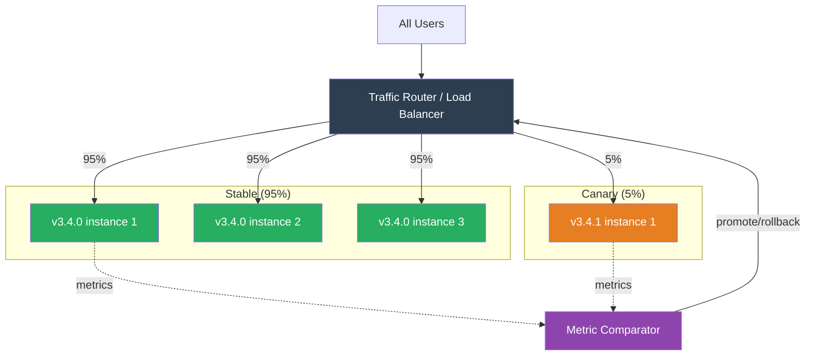
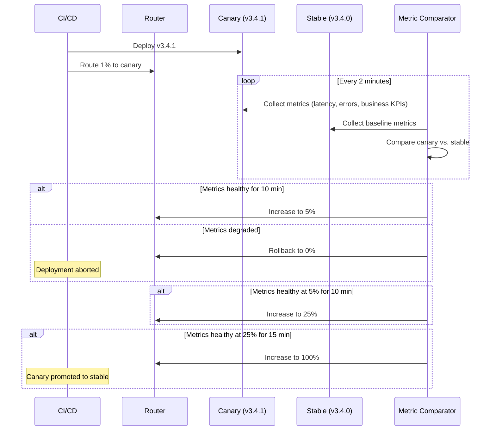

# Canary Release

## 1. The Problem (Story)

Your ride-sharing platform serves 8 million active users across 40 cities. The team just built a new surge-pricing algorithm that promises 15% better driver utilization. The old version is well-tested and trusted. The new version? It looks great in staging, the math checks out, simulations show improved outcomes, but staging has 1,000 test rides — production has 800,000 rides per day.

Last quarter, the team deployed a new ETA algorithm with a blue-green switch. All traffic moved to the new version at once. The algorithm worked perfectly in cities with grid layouts (New York, Chicago) — but catastrophically miscalculated ETAs in cities with rivers and one-way streets (Pittsburgh, Boston). By the time engineers noticed, 47,000 riders had received wrong ETAs over 3 hours. Customer support was overwhelmed. The PR team sent apologetic tweets.

The problem wasn't the algorithm — it was the blast radius. **Switching 100% of traffic to untested-in-production code is a gamble. You can't simulate 40 cities, 8 million users, and every edge case in staging.**

## 2. The Naïve Solutions

### Attempt 1: "More staging tests"

Add 500 more test scenarios to staging:

```typescript
// Exhaustive staging tests
const testCities = ['new-york', 'chicago', 'boston', 'pittsburgh', /* 36 more */];
const testScenarios = ['rush-hour', 'late-night', 'rain', 'snow', 'event'];

for (const city of testCities) {
  for (const scenario of testScenarios) {
    const eta = newAlgorithm.calculate(city, scenario);
    assert(eta.accuracy > 0.85, `${city}/${scenario} failed`);
  }
}
// But staging has synthetic data, no real traffic patterns,
// no real GPS variability, no real driver behavior.
```

You can't replicate production. Synthetic data misses the long tail. The test passes for "Pittsburgh, rush-hour" with synthetic data but fails with real GPS traces.

### Attempt 2: "Blue-green with monitoring"

Deploy with blue-green, watch dashboards closely:

```typescript
await deployer.switchToBlue(); // 100% traffic moves
// Engineer stares at Grafana for 30 minutes...
// "ETA accuracy looks fine overall"
// But the problem only affects 3 cities that represent 12% of traffic
// It takes 2 hours for the city-level dashboards to aggregate enough data
```

Blue-green is all-or-nothing. Even with monitoring, the entire user base is affected while you wait for metrics to accumulate. The blast radius is always 100%.

### Attempt 3: "Feature flag with manual percentage"

```typescript
function calculateETA(ride: Ride): number {
  if (Math.random() < 0.1) { // 10% get new algorithm
    return newAlgorithm.calculate(ride);
  }
  return oldAlgorithm.calculate(ride);
}
```

This mixes both algorithms in the same process. You can't independently scale, monitor, or roll back the new version. Metrics are entangled — you see aggregate numbers, not a clean comparison. If the new code has a memory leak, it affects the entire process.

## 3. The Insight

**Route a small, controlled percentage of production traffic to the new version running in isolation.** Compare its behavior against the stable version using real production load. If metrics are healthy, gradually increase the percentage: 1% → 5% → 25% → 50% → 100%. If anything degrades, route all traffic back to the stable version. The blast radius at each step is bounded — 1% of users affected at worst, not 100%.

## 4. The Pattern

**Canary Release** deploys the new version alongside the stable version and gradually shifts traffic to it while monitoring key metrics:

- **Stable Version**: The current production version serving the majority of traffic
- **Canary Version**: The new version receiving a small percentage of traffic
- **Traffic Router**: Controls the percentage split between stable and canary
- **Metric Comparison**: Automated comparison of canary metrics vs. stable baseline
- **Promotion/Rollback**: If canary metrics are healthy, promote to 100%. If degraded, roll back to 0%.

### Guarantees
- Bounded blast radius: at most X% of traffic is affected by a bad release
- Real production validation: the canary processes actual user traffic
- Gradual confidence building: each step confirms behavior before expanding
- Automatic rollback: metric-driven rollback without human intervention

### Non-Guarantees
- Doesn't catch bugs that only appear at 100% traffic (e.g., global resource contention)
- Doesn't eliminate risk for writes (1% of users may write bad data before rollback)
- Doesn't work well for stateful systems where canary users create incompatible state
- Doesn't ensure consistency between canary and stable during the rollout

## 5. Mental Model

**A coal mine canary.** Miners sent a canary bird into the mine before entering. If the canary kept singing, the air was safe. If it stopped, the miners stayed out. The canary's small size meant it was affected by toxic gas faster than humans. Similarly, a small percentage of production traffic "tests the air" for the new version. If metrics stay healthy (the canary sings), send more traffic. If metrics degrade (the canary stops), pull back.

## 6. Structure

```mermaid
gantt
    title Canary Rollout Timeline
    dateFormat X
    axisFormat %s

    section Traffic %
    1% canary      :c1, 0, 10
    5% canary      :c2, 10, 20
    25% canary     :c3, 20, 35
    50% canary     :c4, 35, 50
    100% promoted  :crit, c5, 50, 60

    section Monitoring
    Compare metrics  :active, m1, 0, 50
    Bake time        :m2, 50, 60
```







## 7. Code Example

### TypeScript — Canary release with metric-driven promotion

```typescript
// ─── TYPES ───────────────────────────────────────────

interface CanaryConfig {
  steps: number[];         // e.g., [1, 5, 25, 50, 100]
  stepDurationMs: number;  // How long to observe each step
  metrics: MetricCheck[];  // What to measure
}

interface MetricCheck {
  name: string;
  compare: (canary: number, stable: number) => boolean;
  // Returns true if canary is acceptable
}

interface MetricSnapshot {
  latencyP50: number;
  latencyP99: number;
  errorRate: number;
  successRate: number;
}

type RolloutStatus =
  | { phase: 'rolling-out'; step: number; percentage: number }
  | { phase: 'promoted'; version: string }
  | { phase: 'rolled-back'; reason: string }
  | { phase: 'paused'; step: number; reason: string };

// ─── METRIC COLLECTOR (simulated) ────────────────────

class MetricCollector {
  // Simulate metric collection from a real monitoring system
  collect(version: string): MetricSnapshot {
    const isBad = version.includes('bad');
    return {
      latencyP50: isBad ? 250 : 45 + Math.random() * 10,
      latencyP99: isBad ? 1200 : 180 + Math.random() * 30,
      errorRate: isBad ? 0.08 : 0.001 + Math.random() * 0.002,
      successRate: isBad ? 0.92 : 0.997 + Math.random() * 0.003,
    };
  }
}

// ─── CANARY MANAGER ──────────────────────────────────

class CanaryManager {
  private stableVersion: string;
  private canaryVersion: string | null = null;
  private currentStep = -1;
  private config: CanaryConfig;
  private collector = new MetricCollector();
  private status: RolloutStatus = { phase: 'promoted', version: '' };

  constructor(stableVersion: string, config: CanaryConfig) {
    this.stableVersion = stableVersion;
    this.status = { phase: 'promoted', version: stableVersion };
    this.config = config;
  }

  async startCanary(canaryVersion: string): Promise<RolloutStatus> {
    this.canaryVersion = canaryVersion;
    this.currentStep = 0;

    console.log(`\n${'='.repeat(50)}`);
    console.log(`[Canary] Starting rollout: ${this.stableVersion} → ${canaryVersion}`);
    console.log(`[Canary] Steps: ${this.config.steps.join('% → ')}%`);
    console.log('='.repeat(50));

    for (let i = 0; i < this.config.steps.length; i++) {
      this.currentStep = i;
      const percentage = this.config.steps[i];

      this.status = { phase: 'rolling-out', step: i, percentage };
      console.log(`\n[Canary] Step ${i + 1}/${this.config.steps.length}: ${percentage}% traffic to canary`);

      // Simulate the observation period
      const healthy = await this.observeStep(percentage);

      if (!healthy) {
        const reason = `Metrics degraded at ${percentage}% traffic`;
        this.status = { phase: 'rolled-back', reason };
        console.log(`[Canary] ✗ ROLLED BACK: ${reason}`);
        this.canaryVersion = null;
        return this.status;
      }

      console.log(`[Canary] ✓ Step ${i + 1} passed`);
    }

    // All steps passed — promote
    this.stableVersion = canaryVersion;
    this.canaryVersion = null;
    this.status = { phase: 'promoted', version: canaryVersion };
    console.log(`\n[Canary] ✓ PROMOTED: ${canaryVersion} is now stable`);
    return this.status;
  }

  private async observeStep(percentage: number): Promise<boolean> {
    // In production, this runs for config.stepDurationMs
    // Here we simulate a few observation cycles
    const cycles = 3;

    for (let c = 0; c < cycles; c++) {
      await delay(100); // Simulate time passing

      const stableMetrics = this.collector.collect(this.stableVersion);
      const canaryMetrics = this.collector.collect(this.canaryVersion!);

      console.log(`  [Observe] Cycle ${c + 1}/${cycles}:`);
      console.log(`    Stable:  p50=${stableMetrics.latencyP50.toFixed(0)}ms, ` +
        `p99=${stableMetrics.latencyP99.toFixed(0)}ms, ` +
        `err=${(stableMetrics.errorRate * 100).toFixed(2)}%`);
      console.log(`    Canary:  p50=${canaryMetrics.latencyP50.toFixed(0)}ms, ` +
        `p99=${canaryMetrics.latencyP99.toFixed(0)}ms, ` +
        `err=${(canaryMetrics.errorRate * 100).toFixed(2)}%`);

      // Check all metric conditions
      for (const check of this.config.metrics) {
        const canaryVal = (canaryMetrics as any)[check.name];
        const stableVal = (stableMetrics as any)[check.name];

        if (!check.compare(canaryVal, stableVal)) {
          console.log(`    ✗ FAILED: ${check.name} ` +
            `(canary=${canaryVal.toFixed(3)}, stable=${stableVal.toFixed(3)})`);
          return false;
        }
      }
    }

    return true;
  }

  getStatus(): RolloutStatus {
    return this.status;
  }
}

// ─── HELPERS ─────────────────────────────────────────

function delay(ms: number): Promise<void> {
  return new Promise(resolve => setTimeout(resolve, ms));
}

// ─── SCENARIO ────────────────────────────────────────

async function demo() {
  const config: CanaryConfig = {
    steps: [1, 5, 25, 50, 100],
    stepDurationMs: 60_000, // 1 minute per step in production
    metrics: [
      {
        name: 'latencyP99',
        compare: (canary, stable) => canary < stable * 1.5,
        // Canary p99 must be < 150% of stable p99
      },
      {
        name: 'errorRate',
        compare: (canary, stable) => canary < stable * 2,
        // Canary error rate must be < 200% of stable
      },
    ],
  };

  const manager = new CanaryManager('v3.4.0', config);

  // Successful canary
  console.log('\n╔══════════════════════════════════╗');
  console.log('║  SCENARIO 1: Successful release  ║');
  console.log('╚══════════════════════════════════╝');
  await manager.startCanary('v3.4.1');

  // Failed canary (rolled back automatically)
  console.log('\n╔══════════════════════════════════╗');
  console.log('║  SCENARIO 2: Bad release         ║');
  console.log('╚══════════════════════════════════╝');
  const manager2 = new CanaryManager('v3.4.1', config);
  await manager2.startCanary('v3.5.0-bad');
}

demo();
```

### Go — Canary manager with metric comparison

```go
package main

import (
	"fmt"
	"math/rand"
	"strings"
)

// ─── TYPES ───────────────────────────────────────────

type Metrics struct {
	LatencyP99 float64
	ErrorRate  float64
}

type MetricCheck struct {
	Name    string
	Compare func(canary, stable float64) bool
}

type CanaryConfig struct {
	Steps   []int // percentage steps: [1, 5, 25, 50, 100]
	Checks  []MetricCheck
}

// ─── CANARY MANAGER ──────────────────────────────────

type CanaryManager struct {
	stable  string
	config  CanaryConfig
}

func NewCanaryManager(stable string, config CanaryConfig) *CanaryManager {
	return &CanaryManager{stable: stable, config: config}
}

func (cm *CanaryManager) collectMetrics(version string) Metrics {
	isBad := strings.Contains(version, "bad")
	if isBad {
		return Metrics{
			LatencyP99: 1200 + rand.Float64()*200,
			ErrorRate:  0.08 + rand.Float64()*0.02,
		}
	}
	return Metrics{
		LatencyP99: 180 + rand.Float64()*30,
		ErrorRate:  0.001 + rand.Float64()*0.002,
	}
}

func (cm *CanaryManager) Rollout(canaryVersion string) bool {
	fmt.Printf("\n[Canary] %s → %s\n", cm.stable, canaryVersion)

	for i, pct := range cm.config.Steps {
		fmt.Printf("\n[Step %d] %d%% traffic to canary\n", i+1, pct)

		stableM := cm.collectMetrics(cm.stable)
		canaryM := cm.collectMetrics(canaryVersion)

		fmt.Printf("  Stable:  p99=%.0fms, err=%.3f%%\n",
			stableM.LatencyP99, stableM.ErrorRate*100)
		fmt.Printf("  Canary:  p99=%.0fms, err=%.3f%%\n",
			canaryM.LatencyP99, canaryM.ErrorRate*100)

		for _, check := range cm.config.Checks {
			var canaryVal, stableVal float64
			switch check.Name {
			case "LatencyP99":
				canaryVal, stableVal = canaryM.LatencyP99, stableM.LatencyP99
			case "ErrorRate":
				canaryVal, stableVal = canaryM.ErrorRate, stableM.ErrorRate
			}
			if !check.Compare(canaryVal, stableVal) {
				fmt.Printf("  ✗ FAILED: %s (canary=%.3f, stable=%.3f)\n",
					check.Name, canaryVal, stableVal)
				fmt.Printf("[Canary] ROLLED BACK at %d%%\n", pct)
				return false
			}
		}
		fmt.Printf("  ✓ Passed\n")
	}

	cm.stable = canaryVersion
	fmt.Printf("[Canary] PROMOTED: %s\n", canaryVersion)
	return true
}

// ─── MAIN ────────────────────────────────────────────

func main() {
	config := CanaryConfig{
		Steps: []int{1, 5, 25, 50, 100},
		Checks: []MetricCheck{
			{Name: "LatencyP99", Compare: func(c, s float64) bool { return c < s*1.5 }},
			{Name: "ErrorRate", Compare: func(c, s float64) bool { return c < s*2 }},
		},
	}

	cm := NewCanaryManager("v3.4.0", config)
	cm.Rollout("v3.4.1")        // success
	cm.Rollout("v3.5.0-bad")    // failure → rollback
}
```

## 8. Gotchas & Beginner Mistakes

| Mistake | Why It Happens | Fix |
|---------|---------------|-----|
| Wrong metrics | Monitoring infra metrics (CPU) instead of business metrics (conversion rate) | Track business KPIs: error rate, latency, revenue, user engagement |
| Too short observation windows | "Looks good after 2 minutes, ship it" | Observe each step for at least 10 minutes. Some bugs only appear under sustained load. |
| Sticky sessions break canary | User always hits stable or always hits canary — no gradual exposure | Use header-based or user-ID-based routing, not session cookies |
| Not enough canary traffic to be statistically significant | 1% of 100 daily users = 1 user. Not meaningful. | Make sure each step has enough traffic volume for statistical significance |
| Canary and stable share a database | Canary writes data that stable can't read (schema mismatch) | Keep DB changes backward-compatible. Run canary on the same schema as stable. |
| Manual promotion | "I'll check the dashboard after lunch" | Automate promotion/rollback based on metric thresholds. Humans forget. |

## 9. Related & Confusable Patterns

| Pattern | Relationship | Key Difference |
|---------|-------------|----------------|
| **Blue-Green Deployment** | Simpler, all-or-nothing | Blue-green switches 100% at once. Canary is gradual. |
| **Rolling Update** | Gradual but not by percentage | Rolling replaces instances sequentially. Canary controls traffic percentage. |
| **A/B Testing** | Similar routing, different purpose | A/B tests UX hypotheses. Canary validates release safety. |
| **Feature Toggles** | Code-level vs. traffic-level | Feature toggles control code paths. Canary controls traffic routing to separate deployments. |
| **Progressive Delivery** | Umbrella concept | Canary is one technique within progressive delivery (which also includes feature flags, A/B, etc.) |

## 10. When This Pattern Is the WRONG Choice

| Scenario | Why Canary Hurts | Better Alternative |
|----------|-----------------|-------------------|
| Low traffic volumes (< 1,000 req/day) | Not enough traffic at 1% for meaningful metrics | Blue-green with manual smoke testing |
| Database schema changes | Canary can't run a different DB schema than stable simultaneously | Blue-green with expand-contract migrations |
| Binary features (new payment provider) | Can't route 5% of payments to a new provider — it's all or nothing (contractual) | Feature toggle with targeted rollout by geography |
| Short-lived batch jobs | No sustained traffic to monitor metrics | Blue-green with rollback plan |
| Emergency hotfixes | No time for gradual rollout — every second counts | Blue-green (instant switch) |

**Symptom you need canary**: Your last 3 incidents were caused by releases that "looked fine in staging." You catch bugs via user complaints, not monitoring.

**Back-out strategy**: If canary infrastructure is too complex, use blue-green deployment with automated smoke tests. You lose the gradual validation but gain operational simplicity. Add feature toggles for in-code gradual rollout as a complementary approach.
