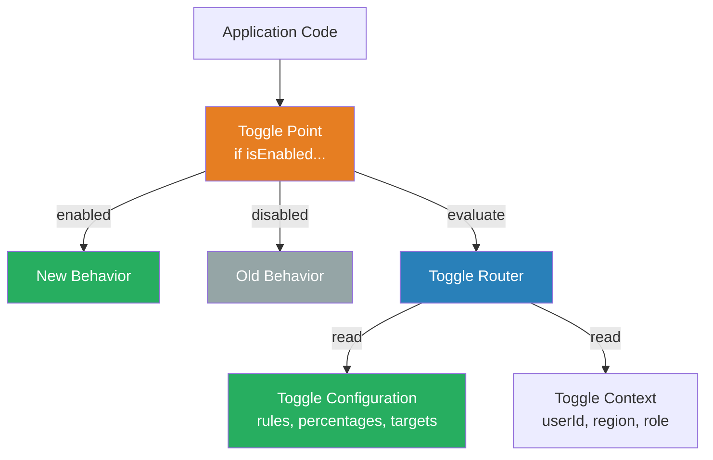
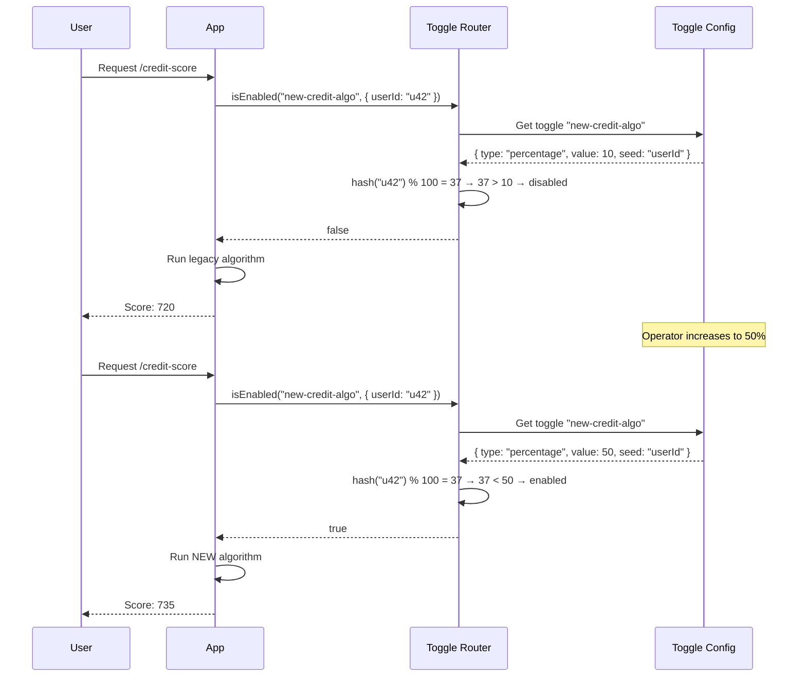

# Feature Toggles (Deployment)

## 1. The Problem (Story)

Your fintech team is building a new credit scoring algorithm. It's a 6-week project. The old algorithm runs in `calculateCreditScore()` — a function called 200,000 times per day. The team works on a feature branch.

Week 3: the feature branch is 47 commits behind `main`. Merge conflicts in 12 files. Two engineers spend a full day resolving conflicts. After merging, the CI pipeline discovers the new algorithm breaks 4 integration tests because `main` changed the input data format.

Week 5: another painful merge. The branch has diverged so far that the team can't confidently merge without a manual regression test. They schedule a "merge day" — an entire sprint day dedicated to integration.

Week 6: the feature is code-complete. But the product team says: "We can't release this to all users on Monday. We need to test it with 5 internal users first, then 100 beta users, then general availability." The team's options: maintain the feature branch for 3 more weeks of staged rollout, or deploy it all-at-once and hope for the best.

**Long-lived branches, merge hell, and coupling deployment to release. The code is ready but can't be safely exposed to users.**

## 2. The Naïve Solutions

### Attempt 1: "Feature branch until it's ready"

Keep the feature on its own branch until the product team says "go":

```
main:     ──A──B──C──D──E──F──G──H──I──J──K──
feature:  ──A──────X──Y──Z──────W──────V──────
```

6 weeks of divergence. Every day the merge gets harder. CI only runs on `main`, so the feature branch has untested interactions with recent changes.

### Attempt 2: "Merge to main with `if/else`"

```typescript
function calculateCreditScore(applicant: Applicant): number {
  if (process.env.USE_NEW_ALGORITHM === 'true') {
    return newCreditScoreAlgorithm(applicant);
  }
  return legacyCreditScoreAlgorithm(applicant);
}
```

This works for one feature. But:
- The environment variable requires a full redeploy to change
- Can't target specific users — it's all-or-nothing per environment
- What happens when you have 8 features with `if/else` blocks? Combinatorial explosion.
- The `if/else` is scattered across 20 files with no central registry

### Attempt 3: "Configuration file"

```json
{
  "features": {
    "newCreditScore": true,
    "darkMode": false,
    "newCheckout": true
  }
}
```

Better than env vars, but:
- Still requires restart or file watch mechanism
- No user targeting (internal-only, beta, percentage rollout)
- No audit trail — who changed it, when, why?
- No fallback — if the feature causes errors, someone has to manually edit the config

## 3. The Insight

**Decouple deployment from release.** Deploy code to production continuously (even incomplete features), but wrap new behavior behind toggles that are evaluated at runtime. The toggle system controls who sees what, when. Engineers merge to `main` daily. The code is always deployed. But the feature is "dark" (hidden) until the toggle is activated. Activation can be instant, targeted (specific users), percentage-based, or time-based — all without redeploying.

## 4. The Pattern

**Feature Toggles** (also called feature flags) are runtime decision points that control whether a feature is active:

- **Toggle Point**: The place in code where behavior branches based on the toggle state
- **Toggle Configuration**: The data source that determines whether a toggle is on/off, and for whom
- **Toggle Context**: Runtime information used to evaluate the toggle (user ID, region, device, role)
- **Toggle Router**: The logic that evaluates a toggle given its configuration and the context

### Guarantees
- Code merges to `main` daily — no long-lived branches
- Features can be activated/deactivated without deployment
- Targeted rollout: internal users → beta → percentage → general availability
- Instant kill switch: if a feature causes problems, turn it off in seconds

### Non-Guarantees
- Does not eliminate the need for testing (untested code behind a toggle still causes bugs)
- Does not prevent toggle debt (old toggles accumulate if not cleaned up)
- Does not replace proper deployment strategies (toggles are in-code, deployments are infrastructure)
- Does not solve backward-incompatible database changes

## 5. Mental Model

**Light switches in a house.** The electrical wiring (deployment) is installed once and connects every room. The light switches (toggles) control which rooms are illuminated. You can turn on the kitchen light without rewiring the house. You can install a dimmer switch to control brightness (percentage rollout). You can put a timer on the porch light (scheduled activation). The wiring and the switches are independent concerns.

## 6. Structure





## 7. Code Example

### TypeScript — Feature toggle system with targeting

```typescript
// ─── TOGGLE TYPES ────────────────────────────────────

type ToggleState =
  | { type: 'boolean'; enabled: boolean }
  | { type: 'percentage'; value: number; seed: string }
  | { type: 'userList'; users: Set<string> }
  | { type: 'gradual'; stages: GradualStage[]; currentStage: number };

interface GradualStage {
  name: string;
  rule: ToggleState;
}

interface ToggleContext {
  userId?: string;
  region?: string;
  role?: string;
  environment?: string;
  [key: string]: string | undefined;
}

interface Toggle {
  name: string;
  description: string;
  state: ToggleState;
  createdAt: Date;
  owner: string;
  killSwitchEnabled: boolean; // If true, toggle is force-disabled
}

// ─── TOGGLE ROUTER ───────────────────────────────────

class ToggleRouter {
  private toggles: Map<string, Toggle> = new Map();
  private evaluationLog: { toggle: string; context: ToggleContext; result: boolean; timestamp: Date }[] = [];

  register(toggle: Toggle): void {
    this.toggles.set(toggle.name, toggle);
    console.log(`[Toggle] Registered: ${toggle.name} (${toggle.state.type})`);
  }

  isEnabled(name: string, context: ToggleContext = {}): boolean {
    const toggle = this.toggles.get(name);

    if (!toggle) {
      console.log(`[Toggle] Unknown: ${name} → false`);
      return false; // Unknown toggles default to off
    }

    // Kill switch overrides everything
    if (toggle.killSwitchEnabled) {
      this.log(name, context, false);
      return false;
    }

    const result = this.evaluate(toggle.state, context);
    this.log(name, context, result);
    return result;
  }

  private evaluate(state: ToggleState, context: ToggleContext): boolean {
    switch (state.type) {
      case 'boolean':
        return state.enabled;

      case 'percentage': {
        const seed = context[state.seed] ?? 'default';
        const hash = this.hashCode(seed);
        return (hash % 100) < state.value;
      }

      case 'userList':
        return context.userId ? state.users.has(context.userId) : false;

      case 'gradual': {
        // Evaluate stages in order — first matching stage wins
        const currentStage = state.stages[state.currentStage];
        return currentStage ? this.evaluate(currentStage.rule, context) : false;
      }

      default:
        return false;
    }
  }

  private hashCode(str: string): number {
    let hash = 0;
    for (let i = 0; i < str.length; i++) {
      const char = str.charCodeAt(i);
      hash = ((hash << 5) - hash) + char;
      hash = hash & hash; // Convert to 32-bit integer
    }
    return Math.abs(hash);
  }

  private log(toggle: string, context: ToggleContext, result: boolean): void {
    this.evaluationLog.push({
      toggle,
      context: { ...context },
      result,
      timestamp: new Date(),
    });
  }

  // ─── MANAGEMENT OPERATIONS ─────────────────────────

  updateState(name: string, newState: ToggleState): void {
    const toggle = this.toggles.get(name);
    if (!toggle) throw new Error(`Toggle not found: ${name}`);
    const oldState = toggle.state;
    toggle.state = newState;
    console.log(`[Toggle] Updated ${name}: ${oldState.type} → ${newState.type}`);
  }

  killSwitch(name: string, enabled: boolean): void {
    const toggle = this.toggles.get(name);
    if (!toggle) throw new Error(`Toggle not found: ${name}`);
    toggle.killSwitchEnabled = enabled;
    console.log(`[Toggle] Kill switch ${name}: ${enabled ? 'ACTIVATED' : 'deactivated'}`);
  }

  promoteGradual(name: string): void {
    const toggle = this.toggles.get(name);
    if (!toggle || toggle.state.type !== 'gradual') return;
    const state = toggle.state;
    if (state.currentStage < state.stages.length - 1) {
      state.currentStage++;
      console.log(`[Toggle] ${name} promoted to stage: ${state.stages[state.currentStage].name}`);
    }
  }

  getReport(): void {
    console.log('\n[Toggle Report]');
    for (const [name, toggle] of this.toggles) {
      const evals = this.evaluationLog.filter(e => e.toggle === name);
      const enabled = evals.filter(e => e.result).length;
      console.log(`  ${name}: ${enabled}/${evals.length} evaluations returned true ` +
        `(kill=${toggle.killSwitchEnabled})`);
    }
  }
}

// ─── APPLICATION CODE ────────────────────────────────

const router = new ToggleRouter();

// Register toggles
router.register({
  name: 'new-credit-algo',
  description: 'New credit scoring algorithm v2',
  state: {
    type: 'gradual',
    currentStage: 0,
    stages: [
      { name: 'internal', rule: { type: 'userList', users: new Set(['admin-1', 'admin-2']) } },
      { name: 'beta', rule: { type: 'percentage', value: 10, seed: 'userId' } },
      { name: 'ga', rule: { type: 'boolean', enabled: true } },
    ],
  },
  createdAt: new Date(),
  owner: 'team-risk',
  killSwitchEnabled: false,
});

router.register({
  name: 'dark-mode',
  description: 'Dark mode UI toggle',
  state: { type: 'percentage', value: 25, seed: 'userId' },
  createdAt: new Date(),
  owner: 'team-frontend',
  killSwitchEnabled: false,
});

// ─── SIMULATED APPLICATION ───────────────────────────

function calculateCreditScore(userId: string): number {
  const context: ToggleContext = { userId, role: 'customer' };

  if (router.isEnabled('new-credit-algo', context)) {
    console.log(`  → Using NEW algorithm for ${userId}`);
    return 735; // New algorithm result
  }

  console.log(`  → Using LEGACY algorithm for ${userId}`);
  return 720; // Legacy algorithm result
}

function renderDashboard(userId: string): string {
  const context: ToggleContext = { userId };

  if (router.isEnabled('dark-mode', context)) {
    return `Dark mode dashboard for ${userId}`;
  }
  return `Light mode dashboard for ${userId}`;
}

// ─── SCENARIO ────────────────────────────────────────

console.log('\n=== Stage 1: Internal Only ===');
calculateCreditScore('admin-1');   // NEW (in user list)
calculateCreditScore('admin-2');   // NEW (in user list)
calculateCreditScore('user-42');   // LEGACY (not in list)
calculateCreditScore('user-100');  // LEGACY (not in list)

console.log('\n=== Stage 2: Beta (10%) ===');
router.promoteGradual('new-credit-algo');
calculateCreditScore('user-42');   // Depends on hash
calculateCreditScore('user-100');  // Depends on hash
calculateCreditScore('user-200');  // Depends on hash

console.log('\n=== Stage 3: GA ===');
router.promoteGradual('new-credit-algo');
calculateCreditScore('user-42');   // NEW (all users)
calculateCreditScore('user-100');  // NEW (all users)

console.log('\n=== Bug found! Kill switch! ===');
router.killSwitch('new-credit-algo', true);
calculateCreditScore('user-42');   // LEGACY (kill switch active)
calculateCreditScore('admin-1');   // LEGACY (kill switch overrides all)

console.log('\n=== Dark mode ===');
renderDashboard('user-1');
renderDashboard('user-2');
renderDashboard('user-3');

router.getReport();
```

### Go — Feature toggle with context-based evaluation

```go
package main

import (
	"fmt"
	"hash/fnv"
	"math"
)

// ─── TYPES ───────────────────────────────────────────

type ToggleType int

const (
	BooleanToggle    ToggleType = iota
	PercentageToggle
	UserListToggle
)

type Toggle struct {
	Name        string
	Type        ToggleType
	Enabled     bool            // For Boolean
	Percentage  int             // For Percentage
	Seed        string          // For Percentage (context field to hash)
	Users       map[string]bool // For UserList
	KillSwitch  bool
}

type Context map[string]string

// ─── ROUTER ──────────────────────────────────────────

type Router struct {
	toggles map[string]*Toggle
}

func NewRouter() *Router {
	return &Router{toggles: make(map[string]*Toggle)}
}

func (r *Router) Register(t *Toggle) {
	r.toggles[t.Name] = t
	fmt.Printf("[Toggle] Registered: %s\n", t.Name)
}

func (r *Router) IsEnabled(name string, ctx Context) bool {
	t, ok := r.toggles[name]
	if !ok || t.KillSwitch {
		return false
	}

	switch t.Type {
	case BooleanToggle:
		return t.Enabled
	case PercentageToggle:
		seed := ctx[t.Seed]
		h := fnv.New32a()
		h.Write([]byte(seed))
		bucket := int(h.Sum32()) % 100
		return int(math.Abs(float64(bucket))) < t.Percentage
	case UserListToggle:
		uid := ctx["userId"]
		return t.Users[uid]
	}
	return false
}

func (r *Router) KillSwitch(name string, active bool) {
	if t, ok := r.toggles[name]; ok {
		t.KillSwitch = active
		fmt.Printf("[Toggle] Kill switch %s: %v\n", name, active)
	}
}

// ─── MAIN ────────────────────────────────────────────

func main() {
	router := NewRouter()

	router.Register(&Toggle{
		Name: "new-credit-algo",
		Type: UserListToggle,
		Users: map[string]bool{"admin-1": true, "admin-2": true},
	})

	router.Register(&Toggle{
		Name:       "dark-mode",
		Type:       PercentageToggle,
		Percentage: 25,
		Seed:       "userId",
	})

	// Evaluate
	users := []string{"admin-1", "user-42", "user-100"}
	for _, u := range users {
		ctx := Context{"userId": u}
		credit := router.IsEnabled("new-credit-algo", ctx)
		dark := router.IsEnabled("dark-mode", ctx)
		fmt.Printf("  %s: credit=%v, dark=%v\n", u, credit, dark)
	}

	// Kill switch
	router.KillSwitch("new-credit-algo", true)
	fmt.Printf("  admin-1 after kill: %v\n",
		router.IsEnabled("new-credit-algo", Context{"userId": "admin-1"}))
}
```

## 8. Gotchas & Beginner Mistakes

| Mistake | Why It Happens | Fix |
|---------|---------------|-----|
| Toggle debt | Old toggles never removed after GA rollout | Set an expiration date on every toggle. Review and remove monthly. |
| Testing combinatorial explosion | 8 toggles = 256 possible states | Test the "all on" and "all off" states. Test individual toggles in isolation. |
| Toggle in the wrong layer | Toggle controls a DB schema change (can't un-migrate) | Only use toggles for behavior changes in application code, not infrastructure |
| No default for unknown toggles | `isEnabled("typo")` returns `undefined`, truthy in some languages | Return `false` for unknown toggles. Log a warning to catch typos. |
| Toggles as permanent architecture | "We'll keep the toggle forever so we can switch back" | Toggles are temporary. If you need permanent configuration, use a config system. |
| Performance overhead | Evaluating toggles in a hot loop (100K calls/sec) | Cache toggle evaluation per request. Toggles shouldn't change mid-request. |

## 9. Related & Confusable Patterns

| Pattern | Relationship | Key Difference |
|---------|-------------|----------------|
| **Canary Release** | Complementary | Canary routes traffic at the infrastructure level. Feature toggles branch at the code level. |
| **A/B Testing** | Similar mechanism | A/B testing measures user behavior to make product decisions. Feature toggles control release safety. |
| **Strategy Pattern** | Structural similarity | Strategy pattern swaps algorithms at runtime via polymorphism. Feature toggles swap behavior via external configuration. |
| **Blue-Green Deployment** | Different layer | Blue-green swaps environments. Feature toggles swap code paths within the same environment. |
| **Feature Flags (Module 07)** | Same concept, different context | Module 07 covers feature flags for business logic (A/B tests, entitlements). This pattern covers deployment-focused toggles. |

## 10. When This Pattern Is the WRONG Choice

| Scenario | Why Feature Toggles Hurt | Better Alternative |
|----------|-------------------------|-------------------|
| Database schema changes | Can't toggle a column addition on/off at runtime | Expand-contract migrations with blue-green deployment |
| Full UI redesign | Toggling between two complete UIs doubles maintenance | Blue-green deployment with user migration |
| Regulatory compliance features | "Sometimes applies GDPR, sometimes doesn't" is not legal | Deploy and activate atomically — no toggle |
| Simple, low-risk changes | Adding a toggle for a typo fix adds needless complexity | Just deploy it |
| Infrastructure changes (new DB, new queue) | Can't toggle infrastructure at the code level | Blue-green or canary at the infrastructure level |

**Symptom you need feature toggles**: Merge day is a dreaded event. Feature branches live for weeks. Product wants staged rollouts. You've had incidents that could have been resolved by "just turning it off."

**Back-out strategy**: If toggle debt becomes unmanageable, adopt a strict toggle lifecycle: every toggle has an owner, a creation date, and an expiration date. Remove toggles within 2 sprints of GA. Use linting rules to flag toggles older than 30 days.
