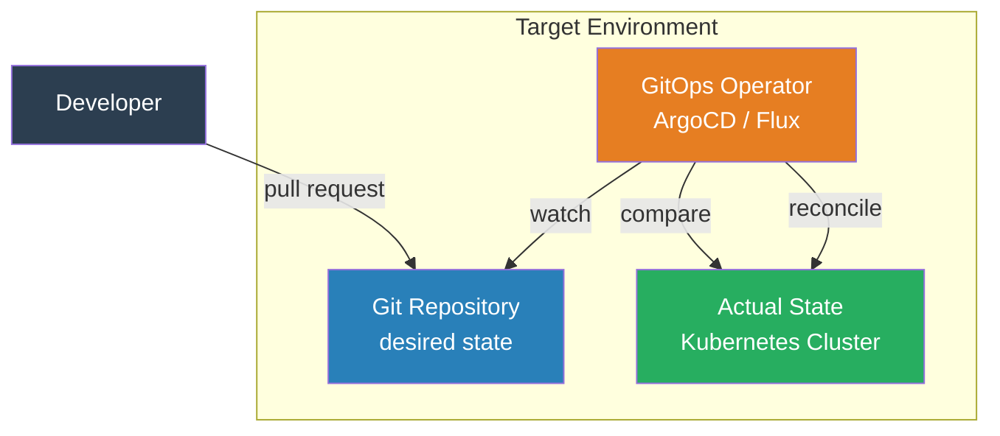
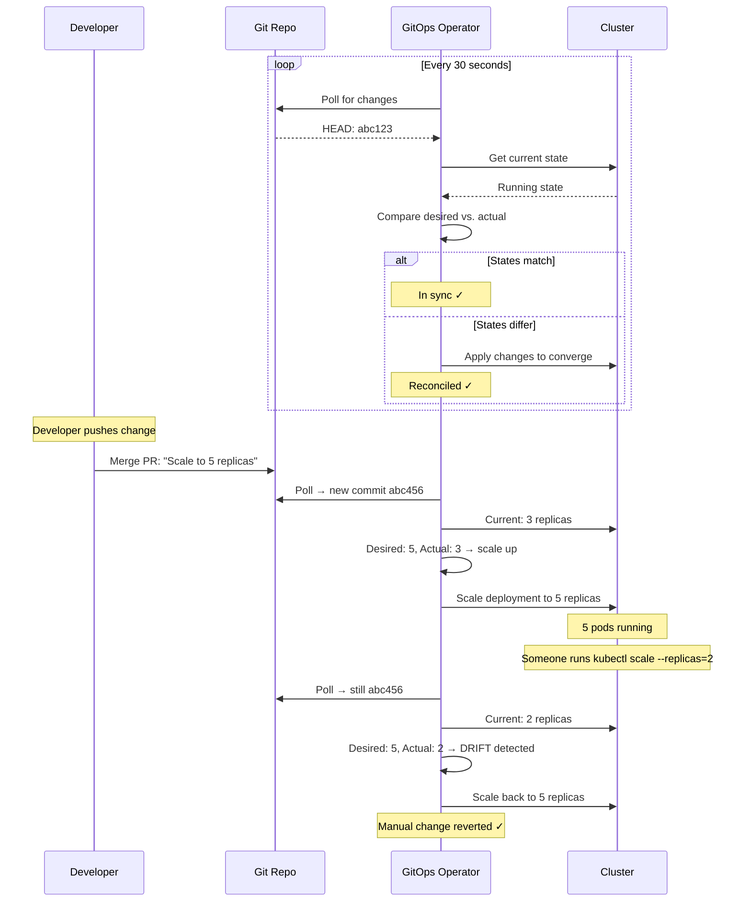
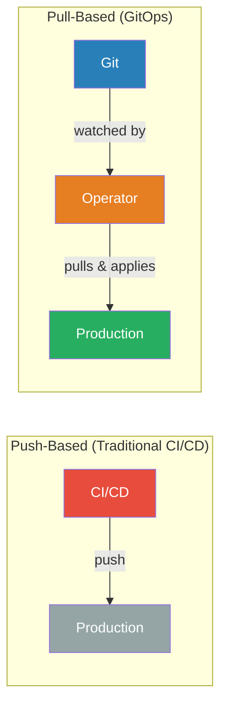

# GitOps

## 1. The Problem (Story)

Your team has embraced Infrastructure as Code — Terraform files for cloud resources, Kubernetes YAML for application deployments. The code lives in Git. So far, so good.

But the *process* of applying changes is chaos:

- Engineer A runs `terraform apply` from their laptop for the networking changes
- Engineer B runs `kubectl apply -f deployment.yaml` from their laptop for the app update
- Engineer C uses the CI pipeline to build containers, but manually SSHs to the bastion host to run Helm
- The platform team has a Jenkins job that handles database provisioning, requiring 3 manual approval clicks

Last Thursday, Engineer A ran `terraform apply` against production from a stale local branch. They forgot to `git pull`. The apply reverted a security group change that Engineer B had deployed 2 hours earlier. A port was re-opened that should have been closed. It took 6 hours to notice.

The audit request: "What changed in production between 2 PM and 5 PM last Thursday?" Nobody knows. `terraform apply` ran from A's laptop — no centralized log. `kubectl apply` ran from B's laptop — no centralized log. The Jenkins job logged the database change, but in a different system from everything else. There's no single source of truth for "what is the desired state of production right now?"

**Infrastructure as code solved the "what" (declarative definitions). GitOps solves the "how" (automated, auditable delivery from Git as the single source of truth).**

## 2. The Naïve Solutions

### Attempt 1: "CI/CD pipeline runs terraform apply"

```yaml
# Jenkinsfile / GitHub Actions
on:
  push:
    branches: [main]

jobs:
  deploy:
    steps:
      - checkout
      - run: terraform init
      - run: terraform plan -out=plan.tfplan
      - run: terraform apply plan.tfplan
```

Push-based: the CI system pushes changes to the cluster/cloud. Problems:
- CI needs production credentials (blast radius if CI is compromised)
- The CI system knows what was *pushed* but doesn't know if the actual state matches the desired state
- If someone runs `kubectl edit` manually, the CI pipeline doesn't know — drift goes undetected
- No self-healing: if someone deletes a resource manually, it's gone until the next CI run

### Attempt 2: "Manual approval gates everywhere"

```
Push → Build → Test → Plan → APPROVE → Apply → APPROVE → Smoke Test → APPROVE → Done
```

Three approval gates. Each requires a human. Deploys take 2 hours because someone is in a meeting and doesn't click "approve" until they're back. The approval is a checkbox, not a meaningful review — people click approve without reading the plan.

### Attempt 3: "Shared credentials in a vault"

Give everyone access to production credentials through HashiCorp Vault:

```bash
export AWS_ACCESS_KEY_ID=$(vault read -field=key secret/aws/prod)
terraform apply
```

Now 8 engineers can run `terraform apply` against production from their laptops. Everyone has the power to change production. Nobody knows who changed what. The audit log is "who requested credentials" — not "what they did with them."

## 3. The Insight

**Make Git the single source of truth for the desired state of infrastructure and applications.** An automated agent (the GitOps operator) runs in the target environment, continuously compares the desired state (Git) to the actual state (cluster/cloud), and reconciles any differences. Changes go through pull requests. The operator pulls from Git — nobody pushes to production. If someone makes a manual change, the operator detects the drift and reverts it.

## 4. The Pattern

**GitOps** uses Git as the declarative source of truth and an automated operator to synchronize desired state to actual state:

- **Git Repository**: Contains all configuration files (Kubernetes manifests, Terraform, Helm charts). This is the desired state.
- **GitOps Operator**: An agent running in the target environment that watches the Git repository and applies changes automatically.
- **Pull-Based Model**: The operator pulls changes from Git. Nobody pushes directly to the environment.
- **Continuous Reconciliation**: The operator continuously compares desired state (Git) to actual state (cluster) and fixes drift.

### Guarantees
- Single source of truth: Git is the only way to change infrastructure
- Full audit trail: every change is a Git commit with author, timestamp, and diff
- Automatic drift detection and correction: manual changes are reverted
- Declarative and reproducible: any environment can be recreated from the Git history

### Non-Guarantees
- Does not prevent bad configurations from being committed (still need code review)
- Does not eliminate the need for secrets management
- Does not solve initial cluster bootstrapping (the operator needs a cluster to run in)
- Does not make rollbacks instant (Git revert + reconciliation loop still takes time)

## 5. Mental Model

**A thermostat.** You set the desired temperature (Git commit: "I want 72°F"). The thermostat (GitOps operator) continuously measures the actual temperature (cluster state) and turns the AC on/off to converge. If someone opens a window (manual change), the thermostat detects the drift and compensates. You don't tell the thermostat *how* to cool — you tell it the desired state, and it figures out the actions.

## 6. Structure







## 7. Code Example

### TypeScript — GitOps operator with reconciliation loop

```typescript
// ─── TYPES ───────────────────────────────────────────

interface ResourceSpec {
  kind: string;
  name: string;
  replicas?: number;
  image?: string;
  config?: Record<string, string>;
}

interface GitState {
  commitHash: string;
  resources: ResourceSpec[];
}

interface ClusterResource {
  kind: string;
  name: string;
  replicas?: number;
  image?: string;
  config?: Record<string, string>;
  managedBy: string; // "gitops" or "manual"
}

type ReconcileAction =
  | { type: 'create'; resource: ResourceSpec }
  | { type: 'update'; resource: ResourceSpec; diff: string }
  | { type: 'delete'; name: string; reason: string }
  | { type: 'revert-drift'; name: string; field: string; desired: unknown; actual: unknown };

// ─── SIMULATED GIT REPO ──────────────────────────────

class GitRepo {
  private commits: GitState[] = [];

  push(state: GitState): void {
    this.commits.push(state);
    console.log(`[Git] New commit: ${state.commitHash}`);
  }

  getHead(): GitState {
    return this.commits[this.commits.length - 1];
  }

  getCommitCount(): number {
    return this.commits.length;
  }
}

// ─── SIMULATED CLUSTER ───────────────────────────────

class Cluster {
  private resources: Map<string, ClusterResource> = new Map();

  get(name: string): ClusterResource | undefined {
    return this.resources.get(name);
  }

  getAll(): ClusterResource[] {
    return Array.from(this.resources.values());
  }

  apply(spec: ResourceSpec): void {
    this.resources.set(spec.name, {
      ...spec,
      managedBy: 'gitops',
    });
  }

  delete(name: string): void {
    this.resources.delete(name);
  }

  // Simulate manual change (drift)
  manualChange(name: string, field: string, value: unknown): void {
    const resource = this.resources.get(name);
    if (resource) {
      (resource as any)[field] = value;
      resource.managedBy = 'manual';
      console.log(`[Cluster] ⚠ Manual change: ${name}.${field} = ${value}`);
    }
  }
}

// ─── GITOPS OPERATOR ─────────────────────────────────

class GitOpsOperator {
  private git: GitRepo;
  private cluster: Cluster;
  private lastAppliedCommit: string | null = null;
  private syncCount = 0;

  constructor(git: GitRepo, cluster: Cluster) {
    this.git = git;
    this.cluster = cluster;
  }

  reconcile(): ReconcileAction[] {
    this.syncCount++;
    const desired = this.git.getHead();
    const actions: ReconcileAction[] = [];

    console.log(`\n[Operator] Reconcile #${this.syncCount} (commit: ${desired.commitHash})`);

    // Desired resources
    const desiredNames = new Set(desired.resources.map(r => r.name));

    // Check each desired resource
    for (const spec of desired.resources) {
      const actual = this.cluster.get(spec.name);

      if (!actual) {
        // Resource doesn't exist — create it
        actions.push({ type: 'create', resource: spec });
      } else {
        // Resource exists — check for drift
        if (spec.replicas !== undefined && actual.replicas !== spec.replicas) {
          actions.push({
            type: 'revert-drift',
            name: spec.name,
            field: 'replicas',
            desired: spec.replicas,
            actual: actual.replicas,
          });
        }
        if (spec.image && actual.image !== spec.image) {
          actions.push({
            type: 'update',
            resource: spec,
            diff: `image: ${actual.image} → ${spec.image}`,
          });
        }
      }
    }

    // Check for resources in cluster but not in Git (should be deleted)
    for (const actual of this.cluster.getAll()) {
      if (!desiredNames.has(actual.name)) {
        actions.push({
          type: 'delete',
          name: actual.name,
          reason: 'Not in Git — removing',
        });
      }
    }

    // Apply actions
    this.applyActions(actions);
    this.lastAppliedCommit = desired.commitHash;

    return actions;
  }

  private applyActions(actions: ReconcileAction[]): void {
    if (actions.length === 0) {
      console.log('[Operator] ✓ In sync — no changes needed');
      return;
    }

    for (const action of actions) {
      switch (action.type) {
        case 'create':
          console.log(`  + CREATE ${action.resource.name}`);
          this.cluster.apply(action.resource);
          break;
        case 'update':
          console.log(`  ~ UPDATE ${action.resource.name}: ${action.diff}`);
          this.cluster.apply(action.resource);
          break;
        case 'delete':
          console.log(`  - DELETE ${action.name}: ${action.reason}`);
          this.cluster.delete(action.name);
          break;
        case 'revert-drift':
          console.log(`  ⟲ REVERT DRIFT ${action.name}.${action.field}: ` +
            `${action.actual} → ${action.desired}`);
          const spec = this.git.getHead().resources.find(r => r.name === action.name)!;
          this.cluster.apply(spec);
          break;
      }
    }
  }

  printStatus(): void {
    console.log(`\n[Status] Last applied: ${this.lastAppliedCommit}`);
    console.log('[Status] Cluster resources:');
    for (const r of this.cluster.getAll()) {
      const icon = r.managedBy === 'gitops' ? '🔒' : '⚠️';
      console.log(`  ${icon} ${r.kind}/${r.name}: replicas=${r.replicas}, image=${r.image}`);
    }
  }
}

// ─── SCENARIO ────────────────────────────────────────

function demo() {
  const git = new GitRepo();
  const cluster = new Cluster();
  const operator = new GitOpsOperator(git, cluster);

  // Initial commit — desired state
  console.log('╔══════════════════════════════╗');
  console.log('║  Phase 1: Initial Deploy     ║');
  console.log('╚══════════════════════════════╝');
  git.push({
    commitHash: 'abc123',
    resources: [
      { kind: 'Deployment', name: 'api-server', replicas: 3, image: 'api:v1.0' },
      { kind: 'Deployment', name: 'worker', replicas: 2, image: 'worker:v1.0' },
      { kind: 'Service', name: 'api-svc', config: { port: '8080' } },
    ],
  });
  operator.reconcile(); // Creates everything
  operator.printStatus();

  // Second reconcile — should be in sync
  console.log('\n╔══════════════════════════════╗');
  console.log('║  Phase 2: No changes         ║');
  console.log('╚══════════════════════════════╝');
  operator.reconcile(); // No-op

  // Someone manually scales replicas
  console.log('\n╔══════════════════════════════╗');
  console.log('║  Phase 3: Manual Drift       ║');
  console.log('╚══════════════════════════════╝');
  cluster.manualChange('api-server', 'replicas', 1); // Someone ran "kubectl scale --replicas=1"
  operator.reconcile(); // Detects drift, reverts to 3
  operator.printStatus();

  // Developer pushes a new version
  console.log('\n╔══════════════════════════════╗');
  console.log('║  Phase 4: New Version via PR ║');
  console.log('╚══════════════════════════════╝');
  git.push({
    commitHash: 'def456',
    resources: [
      { kind: 'Deployment', name: 'api-server', replicas: 5, image: 'api:v2.0' }, // Scaled + updated
      { kind: 'Deployment', name: 'worker', replicas: 2, image: 'worker:v1.0' },
      { kind: 'Service', name: 'api-svc', config: { port: '8080' } },
      // Note: if we removed a resource from Git, the operator would delete it from the cluster
    ],
  });
  operator.reconcile();
  operator.printStatus();

  // Rollback: revert the Git commit
  console.log('\n╔══════════════════════════════╗');
  console.log('║  Phase 5: Rollback via Git   ║');
  console.log('╚══════════════════════════════╝');
  git.push({
    commitHash: 'abc123-revert',
    resources: [
      { kind: 'Deployment', name: 'api-server', replicas: 3, image: 'api:v1.0' }, // Back to v1
      { kind: 'Deployment', name: 'worker', replicas: 2, image: 'worker:v1.0' },
      { kind: 'Service', name: 'api-svc', config: { port: '8080' } },
    ],
  });
  operator.reconcile();
  operator.printStatus();
}

demo();
```

### Go — GitOps reconciliation loop

```go
package main

import "fmt"

type Resource struct {
	Kind     string
	Name     string
	Replicas int
	Image    string
}

type Commit struct {
	Hash      string
	Resources []Resource
}

type Operator struct {
	desiredCommit *Commit
	actual        map[string]Resource
}

func NewOperator() *Operator {
	return &Operator{actual: make(map[string]Resource)}
}

func (o *Operator) SetDesired(commit *Commit) {
	o.desiredCommit = commit
	fmt.Printf("[Git] Commit: %s\n", commit.Hash)
}

func (o *Operator) Reconcile() {
	fmt.Printf("\n[Reconcile] commit=%s\n", o.desiredCommit.Hash)
	desired := make(map[string]Resource)
	for _, r := range o.desiredCommit.Resources {
		desired[r.Name] = r
	}

	// Create/Update
	for name, d := range desired {
		actual, exists := o.actual[name]
		if !exists {
			fmt.Printf("  + CREATE %s/%s (replicas=%d, image=%s)\n",
				d.Kind, d.Name, d.Replicas, d.Image)
			o.actual[name] = d
		} else if actual.Replicas != d.Replicas || actual.Image != d.Image {
			fmt.Printf("  ~ UPDATE %s/%s (replicas=%d→%d, image=%s→%s)\n",
				d.Kind, d.Name, actual.Replicas, d.Replicas, actual.Image, d.Image)
			o.actual[name] = d
		}
	}

	// Delete
	for name := range o.actual {
		if _, wanted := desired[name]; !wanted {
			fmt.Printf("  - DELETE %s\n", name)
			delete(o.actual, name)
		}
	}

	fmt.Println("  ✓ Reconciled")
}

func (o *Operator) SimulateDrift(name string, replicas int) {
	if r, ok := o.actual[name]; ok {
		r.Replicas = replicas
		o.actual[name] = r
		fmt.Printf("[Drift] %s.replicas manually set to %d\n", name, replicas)
	}
}

func main() {
	op := NewOperator()

	// Initial deploy
	op.SetDesired(&Commit{
		Hash: "abc123",
		Resources: []Resource{
			{Kind: "Deployment", Name: "api", Replicas: 3, Image: "api:v1"},
			{Kind: "Deployment", Name: "worker", Replicas: 2, Image: "worker:v1"},
		},
	})
	op.Reconcile()

	// Manual drift
	op.SimulateDrift("api", 1)
	op.Reconcile() // Reverts to 3

	// New version via Git
	op.SetDesired(&Commit{
		Hash: "def456",
		Resources: []Resource{
			{Kind: "Deployment", Name: "api", Replicas: 5, Image: "api:v2"},
			{Kind: "Deployment", Name: "worker", Replicas: 2, Image: "worker:v1"},
		},
	})
	op.Reconcile()
}
```

## 8. Gotchas & Beginner Mistakes

| Mistake | Why It Happens | Fix |
|---------|---------------|-----|
| Secrets in Git | "Everything in Git" includes passwords | Use sealed-secrets, external-secrets-operator, or SOPS. Secrets are referenced, not stored. |
| Monorepo for apps + infra | App code changes trigger infra reconciliation | Separate repos: one for app code (CI builds images), one for infrastructure (GitOps reconciles). |
| No branch protection | Anyone pushes to main → auto-deploys to production | Require pull request reviews. Main branch = production state. |
| Ignoring reconciliation failures | Operator can't apply a change, but nobody notices | Set up alerts on reconciliation failures. The operator should report sync status. |
| Alert fatigue from constant reconciliation | Operator reconciles 100 times/day, generates noise | Configure reconciliation interval. Use health metrics, not per-sync notifications. |
| Manual changes "just this once" | Emergency fix needs to bypass Git | Allow emergency changes with mandatory follow-up: commit to Git within 1 hour, or the operator reverts it. |

## 9. Related & Confusable Patterns

| Pattern | Relationship | Key Difference |
|---------|-------------|----------------|
| **Infrastructure as Code** | Foundation | IaC defines the "what" (declarative configs). GitOps defines the "how" (automated apply from Git). |
| **CI/CD Pipelines** | Push vs. pull | Traditional CI/CD pushes changes out. GitOps operators pull changes in. |
| **Immutable Infrastructure** | Complementary | Immutable infra says "never modify." GitOps ensures modifications are reverted if they happen. |
| **Desired State Configuration** | Similar concept | DSC (PowerShell, Puppet) converges to desired state. GitOps uses Git as the state source and Kubernetes as the runtime. |
| **ChatOps** | Different trigger | ChatOps triggers deploys from Slack commands. GitOps triggers deploys from Git commits. |

## 10. When This Pattern Is the WRONG Choice

| Scenario | Why GitOps Hurts | Better Alternative |
|----------|-----------------|-------------------|
| Non-declarative infrastructure | Legacy systems configured with imperative scripts | Adopt IaC first, then GitOps |
| Rapid experimentation | Committing to Git for every tweak is too slow during active exploration | Use a staging environment without GitOps. Apply GitOps to production only. |
| Small team, few changes | Setting up ArgoCD/Flux for 1 deploy per week is over-engineering | Simple CI/CD pipeline with `kubectl apply` |
| Multi-cloud with different tools | Terraform for AWS, Pulumi for GCP, ARM for Azure — no unified operator | Platform-specific CI/CD pipelines until tooling matures |
| Emergency break-glass scenarios | "The operator is reconciling the broken config faster than I can fix it" | Have a pause/disable mechanism for the operator during emergencies |

**Symptom you need GitOps**: "Who changed production?" has no answer. Manual `kubectl` commands cause incidents. Drift between desired and actual state is a recurring problem.

**Back-out strategy**: If GitOps is too rigid, keep the Git repo as the source of truth but use a push-based CI/CD pipeline instead of a pull-based operator. You lose automatic drift detection but gain simplicity and control.
