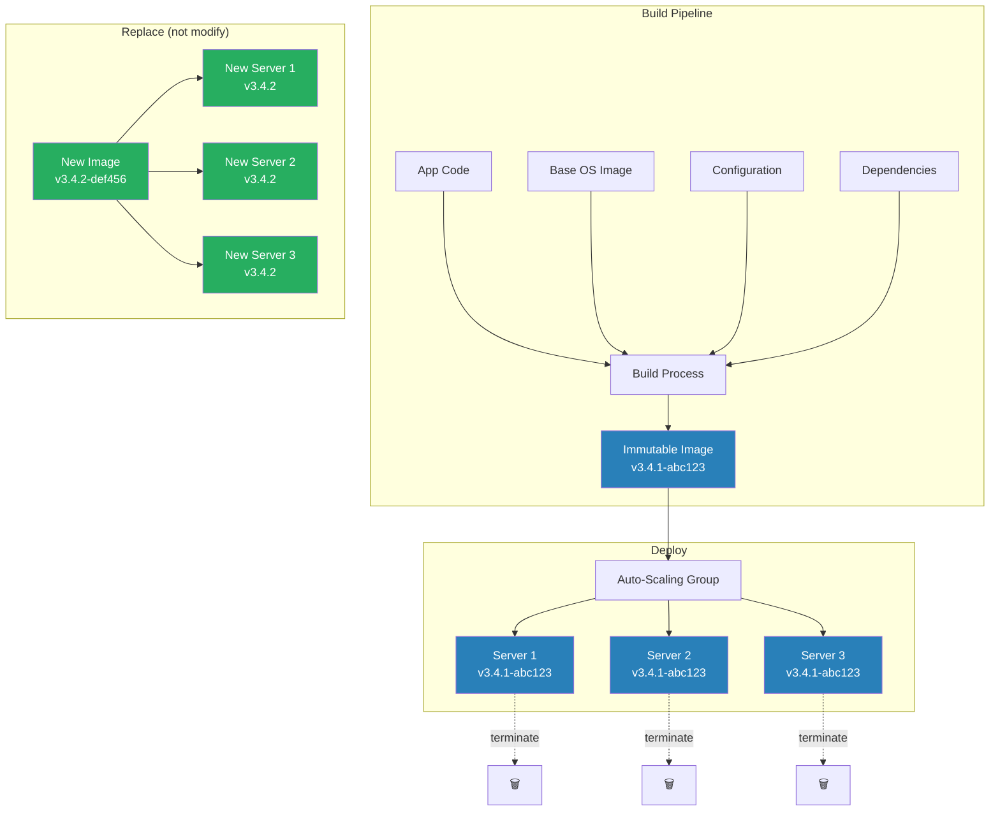
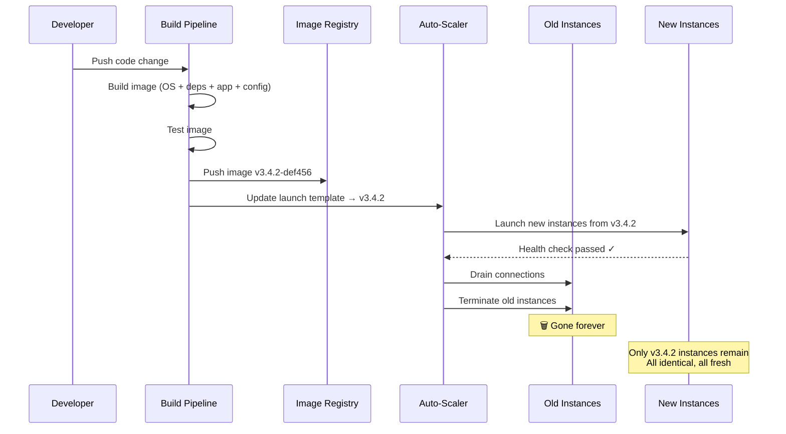

# Immutable Infrastructure

## 1. The Problem (Story)

Your team manages 30 production servers running a Node.js application. Over 18 months, these servers have been patched, updated, and hotfixed hundreds of times:

- Server 1-10: provisioned January 2023, Node 18.12, Ubuntu 22.04
- Server 11-20: provisioned May 2023, Node 18.16, Ubuntu 22.04 (different patch level)
- Server 21-30: provisioned November 2023, Node 20.9, Ubuntu 22.04

Along the way, engineers SSH'd into individual servers to:
- Fix a memory leak on server 7 by adjusting a kernel parameter
- Install a debugging tool on server 15 that was never removed
- Patch OpenSSL on servers 1-20 but miss servers 21-30
- Add a cron job on server 12 to rotate logs (never applied to the others)

Now every server has a slightly different configuration. This is called **configuration drift**. Server 7 behaves differently from server 28 under the same load. A bug that reproduces on server 15 doesn't reproduce on server 22 because server 15 has the debugging tool installed that changes thread scheduling.

Last week, the team tried to roll out a security patch. They ran `apt upgrade openssl` on all 30 servers. Server 7 failed because its kernel parameter change from 6 months ago conflicted with the upgrade. Server 15 failed because the debugging tool depended on the old OpenSSL. The patch worked on 28 servers, failed on 2. Nobody knows why, because nobody knows the exact state of those 2 servers.

**Servers that have been mutated over time become "snowflakes" — unique, irreplaceable, and unknowable.**

## 2. The Naïve Solutions

### Attempt 1: "Configuration management"

Use Ansible/Chef/Puppet to enforce a desired state:

```yaml
# ansible playbook
- name: Ensure Node.js version
  apt:
    name: nodejs=20.9.0-1nodesource1
    state: present

- name: Ensure OpenSSL patched
  apt:
    name: openssl=3.0.11-1ubuntu1
    state: present

- name: Remove debugging tools
  apt:
    name: strace
    state: absent
```

This helps, but:
- It's convergent, not identical. Running the playbook drives servers *toward* the desired state but doesn't guarantee they're identical. State accumulated over months may not be fully captured.
- Order of operations matters: if someone installed a package that conflicts, the playbook might fail on that server
- You can't know what *isn't* in the playbook. Unknown state is still unknown.

### Attempt 2: "Regular rebuild schedule"

Rebuild all servers from scratch every month:

```bash
# Monthly: terminate and recreate all 30 servers
for i in $(seq 1 30); do
  aws ec2 terminate-instances --instance-ids $i
  aws ec2 run-instances --image-id ami-base --count 1
  deploy_app_to $new_instance
done
```

Downtime during rebuild. The base AMI still needs manual configuration after launch. If the rebuild script has a bug, all 30 servers are broken simultaneously. And you still need to do something about configuration drift between monthly rebuilds.

### Attempt 3: "Document every SSH session"

Policy: "Every time you SSH into a server, document what you changed."

Engineers forget. Engineers fix something at 2 AM and don't document it. The documentation is in Confluence, which nobody reads. Six months later, nobody remembers why server 7 has that kernel parameter.

## 3. The Insight

**Never modify a running server. Never SSH in to fix things. Never patch in place.** Instead, build a new server image with the change baked in, deploy new servers from that image, and terminate the old ones. Servers are cattle, not pets — interchangeable, disposable, identical. If a server has a problem, you don't diagnose it — you terminate it and let the auto-scaler launch a fresh one from the known-good image.

## 4. The Pattern

**Immutable Infrastructure** treats servers (and their images) as immutable artifacts:

- **Build Phase**: Create a complete machine image (AMI, Docker image, VM image) with the OS, dependencies, application, and configuration baked in
- **Deploy Phase**: Launch new instances from the image. Don't modify them.
- **Replace Phase**: When something needs to change (new code, OS patch, config change), build a new image and replace all instances
- **No SSH**: Nobody logs into production servers. Ever. If you need to debug, add logging or use observability tools.

### Guarantees
- Every server is identical — no drift, no snowflakes
- Any server can be terminated and replaced with an identical copy
- The exact state of production is recorded as an image version
- Rollback is launching instances from the previous image

### Non-Guarantees
- Does not eliminate build-time bugs (bad images affect all new servers)
- Does not solve persistent data management (databases are still mutable)
- Does not make builds instant (image creation takes minutes)
- Does not solve secret distribution (secrets still need runtime injection)

## 5. Mental Model

**Disposable contact lenses vs. repairable glasses.** Glasses (mutable servers) accumulate scratches, need adjustments, require repairs — each pair becomes unique. Contact lenses (immutable servers) come from a factory in sealed packages — every lens is identical. When a lens gets dirty, you don't clean it — you throw it away and open a new sealed package. You never worry about a lens being in an "unknown state" because every lens is fresh from the factory.

## 6. Structure





## 7. Code Example

### TypeScript — Immutable image builder and deployer

```typescript
// ─── IMAGE MODEL ─────────────────────────────────────

interface ImageSpec {
  baseOS: string;
  packages: string[];
  appVersion: string;
  configHash: string;
}

interface Image {
  id: string;
  spec: ImageSpec;
  builtAt: Date;
  hash: string; // Content-addressable: same spec → same hash
}

interface Instance {
  id: string;
  imageId: string;
  status: 'running' | 'draining' | 'terminated';
  launchedAt: Date;
}

// ─── IMAGE BUILDER ───────────────────────────────────

class ImageBuilder {
  private imageRegistry: Map<string, Image> = new Map();
  private nextId = 0;

  async build(spec: ImageSpec): Promise<Image> {
    const hash = this.hashSpec(spec);

    // Content-addressable: if we already built this exact spec, reuse it
    for (const image of this.imageRegistry.values()) {
      if (image.hash === hash) {
        console.log(`[Builder] Image already exists for this spec: ${image.id}`);
        return image;
      }
    }

    console.log(`[Builder] Building new image...`);
    console.log(`  Base OS:    ${spec.baseOS}`);
    console.log(`  Packages:   ${spec.packages.join(', ')}`);
    console.log(`  App:        ${spec.appVersion}`);
    console.log(`  Config:     ${spec.configHash}`);

    // Simulate build time
    await delay(200);

    const image: Image = {
      id: `img-${++this.nextId}`,
      spec: { ...spec },
      builtAt: new Date(),
      hash,
    };

    this.imageRegistry.set(image.id, image);
    console.log(`[Builder] Built: ${image.id} (hash: ${hash.slice(0, 8)})`);
    return image;
  }

  private hashSpec(spec: ImageSpec): string {
    const content = JSON.stringify(spec);
    let hash = 0;
    for (let i = 0; i < content.length; i++) {
      hash = ((hash << 5) - hash) + content.charCodeAt(i);
      hash = hash & hash;
    }
    return Math.abs(hash).toString(16).padStart(8, '0');
  }
}

// ─── FLEET MANAGER ───────────────────────────────────

class FleetManager {
  private instances: Map<string, Instance> = new Map();
  private nextInstanceId = 0;
  private desiredCount: number;
  private currentImageId: string | null = null;

  constructor(desiredCount: number) {
    this.desiredCount = desiredCount;
  }

  async deploy(image: Image): Promise<void> {
    console.log(`\n[Fleet] Deploying image ${image.id} to ${this.desiredCount} instances`);
    const oldInstances = Array.from(this.instances.values())
      .filter(i => i.status === 'running');

    // Step 1: Launch new instances from the new image
    const newInstances: Instance[] = [];
    for (let i = 0; i < this.desiredCount; i++) {
      const instance = await this.launchInstance(image.id);
      newInstances.push(instance);
    }

    // Step 2: Verify all new instances are healthy
    console.log(`[Fleet] Health checking ${newInstances.length} new instances...`);
    for (const instance of newInstances) {
      const healthy = await this.healthCheck(instance);
      if (!healthy) {
        console.log(`[Fleet] ✗ Instance ${instance.id} unhealthy — aborting deploy`);
        // Terminate all new instances
        for (const ni of newInstances) {
          await this.terminateInstance(ni.id);
        }
        return;
      }
    }
    console.log(`[Fleet] All new instances healthy ✓`);

    // Step 3: Drain and terminate old instances
    // Key: we NEVER modify old instances — we replace them
    for (const old of oldInstances) {
      await this.drainAndTerminate(old.id);
    }

    this.currentImageId = image.id;
    console.log(`[Fleet] Deploy complete. All instances on ${image.id}`);
    this.printStatus();
  }

  private async launchInstance(imageId: string): Promise<Instance> {
    const instance: Instance = {
      id: `inst-${++this.nextInstanceId}`,
      imageId,
      status: 'running',
      launchedAt: new Date(),
    };
    this.instances.set(instance.id, instance);
    console.log(`  [Launch] ${instance.id} from ${imageId}`);
    return instance;
  }

  private async healthCheck(instance: Instance): Promise<boolean> {
    await delay(50);
    return true; // Simulated
  }

  private async drainAndTerminate(id: string): Promise<void> {
    const instance = this.instances.get(id)!;
    instance.status = 'draining';
    await delay(50);
    instance.status = 'terminated';
    console.log(`  [Terminate] ${id} (was ${instance.imageId})`);
    this.instances.delete(id);
  }

  async terminateInstance(id: string): Promise<void> {
    this.instances.delete(id);
    console.log(`  [Terminate] ${id}`);
  }

  replaceUnhealthy(): void {
    // In immutable infra, you don't fix a bad server — you replace it
    for (const [id, instance] of this.instances) {
      // Simulated: detect unhealthy instance
      if (instance.id === 'inst-3' && this.currentImageId) {
        console.log(`\n[Fleet] Instance ${id} unhealthy — replacing (NOT fixing)`);
        this.instances.delete(id);
        this.launchInstance(this.currentImageId);
      }
    }
  }

  printStatus(): void {
    console.log('\n[Fleet Status]');
    for (const [id, instance] of this.instances) {
      console.log(`  ${instance.status === 'running' ? '🟢' : '🔴'} ${id}: ` +
        `image=${instance.imageId} [${instance.status}]`);
    }
  }
}

// ─── HELPERS ─────────────────────────────────────────

function delay(ms: number): Promise<void> {
  return new Promise(r => setTimeout(r, ms));
}

// ─── SCENARIO ────────────────────────────────────────

async function demo() {
  const builder = new ImageBuilder();
  const fleet = new FleetManager(3);

  // Build v1 image
  const v1Image = await builder.build({
    baseOS: 'ubuntu-22.04',
    packages: ['nodejs-20.9', 'openssl-3.0.11'],
    appVersion: 'v3.4.0',
    configHash: 'abc123',
  });

  // Deploy v1
  await fleet.deploy(v1Image);

  // Need to change something? Build a NEW image, replace ALL instances
  console.log('\n╔══════════════════════════════════╗');
  console.log('║  Change needed: upgrade OpenSSL  ║');
  console.log('║  NOT patching — building new img ║');
  console.log('╚══════════════════════════════════╝');

  const v2Image = await builder.build({
    baseOS: 'ubuntu-22.04',
    packages: ['nodejs-20.9', 'openssl-3.0.12'], // Patched
    appVersion: 'v3.4.0',
    configHash: 'abc123',
  });

  await fleet.deploy(v2Image);

  // Same spec → same image (content-addressable)
  console.log('\n[Demo] Building same spec again...');
  const v2Again = await builder.build({
    baseOS: 'ubuntu-22.04',
    packages: ['nodejs-20.9', 'openssl-3.0.12'],
    appVersion: 'v3.4.0',
    configHash: 'abc123',
  });
  console.log(`Same image? ${v2Again.id === v2Image.id}`);
}

demo();
```

### Go — Immutable fleet manager

```go
package main

import (
	"crypto/sha256"
	"encoding/json"
	"fmt"
)

type ImageSpec struct {
	BaseOS     string   `json:"baseOS"`
	Packages   []string `json:"packages"`
	AppVersion string   `json:"appVersion"`
}

type Image struct {
	ID   string
	Spec ImageSpec
	Hash string
}

type Instance struct {
	ID      string
	ImageID string
	Status  string
}

// ─── BUILDER ─────────────────────────────────────────

type Builder struct {
	images map[string]*Image
	nextID int
}

func NewBuilder() *Builder {
	return &Builder{images: make(map[string]*Image)}
}

func (b *Builder) Build(spec ImageSpec) *Image {
	hash := hashSpec(spec)

	for _, img := range b.images {
		if img.Hash == hash {
			fmt.Printf("[Builder] Cached: %s\n", img.ID)
			return img
		}
	}

	b.nextID++
	img := &Image{
		ID:   fmt.Sprintf("img-%d", b.nextID),
		Spec: spec,
		Hash: hash,
	}
	b.images[img.ID] = img
	fmt.Printf("[Builder] Built: %s (app=%s)\n", img.ID, spec.AppVersion)
	return img
}

func hashSpec(spec ImageSpec) string {
	data, _ := json.Marshal(spec)
	h := sha256.Sum256(data)
	return fmt.Sprintf("%x", h[:4])
}

// ─── FLEET ───────────────────────────────────────────

type Fleet struct {
	instances []*Instance
	desired   int
	nextID    int
}

func NewFleet(desired int) *Fleet {
	return &Fleet{desired: desired}
}

func (f *Fleet) Deploy(img *Image) {
	fmt.Printf("\n[Fleet] Deploying %s (%d instances)\n", img.ID, f.desired)

	// Terminate old
	for _, inst := range f.instances {
		fmt.Printf("  [Terminate] %s (image=%s)\n", inst.ID, inst.ImageID)
	}

	// Launch new
	f.instances = make([]*Instance, f.desired)
	for i := 0; i < f.desired; i++ {
		f.nextID++
		f.instances[i] = &Instance{
			ID:      fmt.Sprintf("inst-%d", f.nextID),
			ImageID: img.ID,
			Status:  "running",
		}
		fmt.Printf("  [Launch] %s from %s\n", f.instances[i].ID, img.ID)
	}
}

func (f *Fleet) Status() {
	fmt.Println("\n[Status]")
	for _, inst := range f.instances {
		fmt.Printf("  🟢 %s: %s [%s]\n", inst.ID, inst.ImageID, inst.Status)
	}
}

// ─── MAIN ────────────────────────────────────────────

func main() {
	builder := NewBuilder()
	fleet := NewFleet(3)

	v1 := builder.Build(ImageSpec{
		BaseOS:     "ubuntu-22.04",
		Packages:   []string{"nodejs-20.9", "openssl-3.0.11"},
		AppVersion: "v3.4.0",
	})
	fleet.Deploy(v1)
	fleet.Status()

	// Need OpenSSL patch? Build NEW image, replace ALL instances
	v2 := builder.Build(ImageSpec{
		BaseOS:     "ubuntu-22.04",
		Packages:   []string{"nodejs-20.9", "openssl-3.0.12"},
		AppVersion: "v3.4.0",
	})
	fleet.Deploy(v2)
	fleet.Status()

	// Same spec → same image
	v2Again := builder.Build(ImageSpec{
		BaseOS:     "ubuntu-22.04",
		Packages:   []string{"nodejs-20.9", "openssl-3.0.12"},
		AppVersion: "v3.4.0",
	})
	fmt.Printf("\nSame image? %v\n", v2.ID == v2Again.ID)
}
```

## 8. Gotchas & Beginner Mistakes

| Mistake | Why It Happens | Fix |
|---------|---------------|-----|
| SSH "just this once" | Production is on fire, need to fix it now | Add the fix to the image build, build a new image, deploy it. The 5-minute image build time is faster than debugging a snowflake server at 3 AM. |
| Slow image builds | Building from scratch takes 20 minutes | Use layered images (Docker) or cached base images. Only rebuild layers that changed. |
| Not handling persistent data | Replacing the server deletes its local data | Externalize all state: databases, object storage, shared filesystems. Servers should be stateless. |
| Secrets baked into images | `ENV DB_PASSWORD=hunter2` in the Dockerfile | Inject secrets at runtime via environment variables, mounted volumes, or secret managers. |
| Only applying to app servers | Database and cache servers are still mutable | Apply immutable principles where possible. For databases, use managed services (RDS, Cloud SQL). |
| No image versioning | Images named `latest` — can't tell what's running | Tag images with the Git commit hash. `v3.4.1-abc123def` is always traceable. |

## 9. Related & Confusable Patterns

| Pattern | Relationship | Key Difference |
|---------|-------------|----------------|
| **Infrastructure as Code** | Complementary | IaC defines what infrastructure to create. Immutable infra says: never modify it after creation. |
| **Blue-Green Deployment** | Implementation synergy | Blue-green works perfectly with immutable infra: blue runs old image, green runs new image. |
| **Configuration Management** | Alternative philosophy | Config management (Ansible, Chef) converges servers toward desired state. Immutable says: don't converge, replace. |
| **Containerization** | Natural implementation | Docker images are inherently immutable. Containers are the most common implementation of immutable infrastructure. |
| **Phoenix Servers** | Same concept, different name | "Phoenix servers" rise from the ashes — same idea as immutable infra. Coined by Martin Fowler. |

## 10. When This Pattern Is the WRONG Choice

| Scenario | Why Immutable Hurts | Better Alternative |
|----------|---------------------|-------------------|
| Development environments | Rebuilding the image for every code change is too slow | Use mutable dev servers with hot-reload. Immutable for staging/prod only. |
| Legacy applications with local state | App stores sessions/files on local disk — can't terminate the server | Externalize state first, then adopt immutable infra |
| Very large images (> 10 GB) | Build + push + pull takes 30+ minutes per deploy | Optimize image size. Use multi-stage builds. Share base layers. |
| Emergency patches | Building a new image takes 10 minutes, but CVE exploitation is happening NOW | Have a pre-built "emergency patch" process. Fast patching is better than down servers. |
| Single-server applications | Only 1 server — no capacity for blue-green swap during replacement | Use in-place deployment with backup snapshots |

**Symptom you need immutable infra**: "Works on my machine / staging but not on server 7." Production servers have unknown state. Patches work on 28/30 servers.

**Back-out strategy**: If full immutability is too rigid, adopt "mostly immutable" — servers are built from images but allow configuration changes via environment variables or config files mounted at runtime (not baked in). Reserve SSH access for emergencies only, with mandatory documentation.
