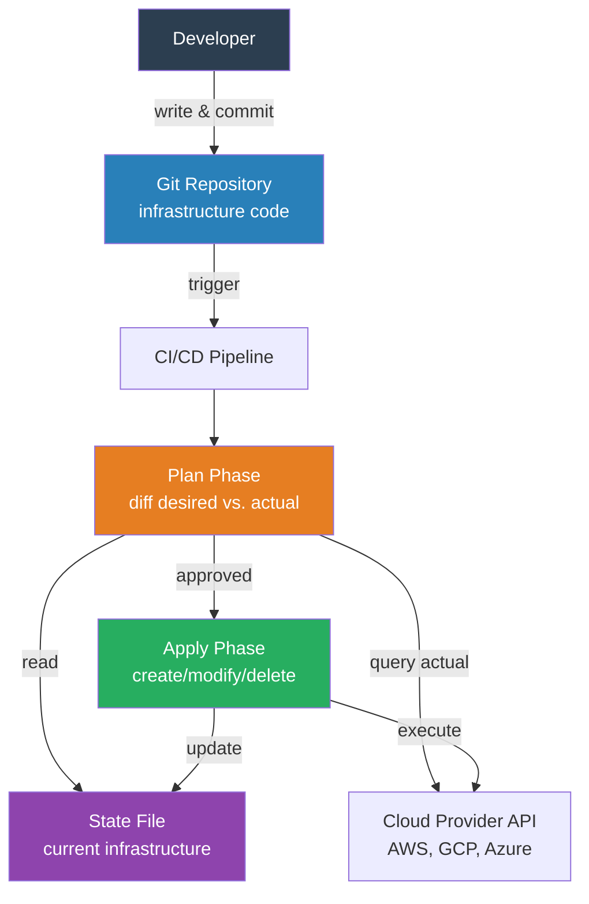
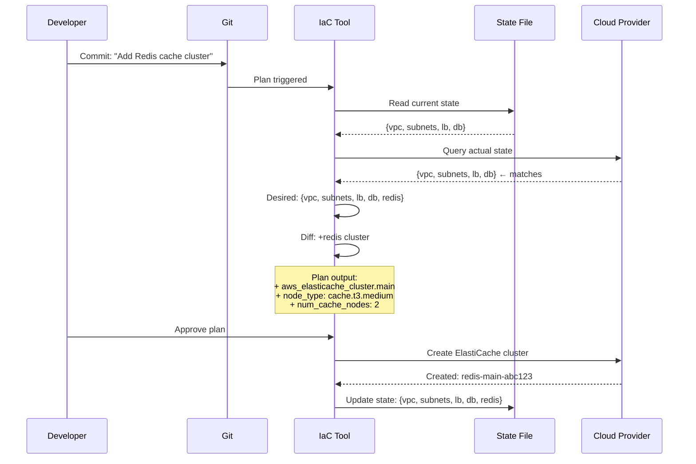

# Infrastructure as Code

## 1. The Problem (Story)

Your team runs a web application across 3 environments: development, staging, production. Each has a load balancer, 2-6 app servers, a database cluster, a Redis cache, and a CDN. The infrastructure was set up manually through the AWS console — clicking through wizards, typing values into forms, selecting dropdown options.

One Friday, an engineer adds a new security group rule in production to allow port 8443 for a new internal API. On Monday, a different engineer tries to debug a staging issue that works in production. After 4 hours, they discover staging is missing the security group rule. It was never applied to staging because no one documented the change.

A month later, disaster recovery time. Production goes down. The team needs to recreate the entire environment in a different region. The engineer who originally set everything up left the company 6 months ago. There's a 14-page runbook written in 2022, but it references old AWS UI elements. Steps 7 through 12 are wrong — the VPC wizard changed since then. Recreating the environment takes 3 days of trial and error.

**Manual infrastructure is unreproducible, undocumented, and drifts between environments. Nobody knows the true state of production.**

## 2. The Naïve Solutions

### Attempt 1: "Document everything in a wiki"

Write detailed runbooks for every infrastructure component:

```markdown
## Setting up the Load Balancer
1. Go to EC2 → Load Balancers → Create
2. Select "Application Load Balancer"
3. Name: "prod-alb"
4. Scheme: internet-facing
5. Listeners: HTTP:80, HTTPS:443
6. Select VPC: vpc-0abc123
7. Select subnets: subnet-pub-1a, subnet-pub-1b
...
```

39 pages of screenshots and step-by-step instructions. Problems:
- Out of date within a week (AWS UI changes, new requirements)
- No way to validate that the doc matches reality
- Can't diff two environments to find drift
- Executing the doc takes 4 hours of manual clicking per environment

### Attempt 2: "Shell scripts"

Automate with AWS CLI scripts:

```bash
#!/bin/bash
# create-infrastructure.sh
aws ec2 create-vpc --cidr-block 10.0.0.0/16
aws ec2 create-subnet --vpc-id $VPC_ID --cidr 10.0.1.0/24
aws ec2 create-security-group --group-name web-sg --vpc-id $VPC_ID
aws elbv2 create-load-balancer --name prod-alb --subnets $SUBNET_1 $SUBNET_2
# 200 more lines...
```

Better than clicking. But:
- Scripts are imperative: "create this." What if it already exists? The script fails.
- No state tracking: the script doesn't know what's already been created
- Ordering is fragile: subnet must exist before load balancer, but the script doesn't express dependencies
- Deleting is a separate, equally complex script
- Partial failures leave infrastructure in an unknown state

### Attempt 3: "Golden AMIs / Container images"

Bake everything into a machine image:

```bash
# Build a golden AMI with all dependencies
packer build -var 'app_version=3.4.1' server.json
# Launch instances from the AMI
aws ec2 run-instances --image-id ami-golden123 --count 4
```

Covers the app servers, but not the VPC, subnets, load balancer, DNS, database, cache, CDN, security groups, IAM roles. You still need to manually create the networking and routing that sits between these instances.

## 3. The Insight

**Define infrastructure in declarative, version-controlled files.** Describe the desired end state ("I want a VPC with these subnets, a load balancer with these rules, a database with this configuration"), not the steps to get there. A tool reads the declaration, compares it to the current real-world state, and calculates what to create, modify, or delete to reach the desired state. The infrastructure definition lives alongside the application code in Git — reviewed, versioned, diffable, and reproducible.

## 4. The Pattern

**Infrastructure as Code (IaC)** treats infrastructure definitions as software artifacts:

- **Declarative Configuration**: Files that describe the desired state of infrastructure (not how to create it)
- **State Tracking**: A record of what infrastructure currently exists and its properties
- **Plan/Apply Workflow**: Preview changes before executing them (like a pull request diff for infrastructure)
- **Provider Abstraction**: Plugins that translate declarations into API calls for specific cloud providers

### Guarantees
- Reproducibility: any environment can be recreated from the same files
- Version history: Git provides full audit trail of every infrastructure change
- Consistency: dev, staging, and prod are structurally identical (different sizes, same architecture)
- Drift detection: compare declared state to actual state to find manual changes

### Non-Guarantees
- Does not prevent bad infrastructure decisions (misconfigured security groups can still be coded)
- Does not eliminate the need to understand networking, security, and cloud services
- Does not provide instant apply — large infrastructure changes still take minutes
- Does not solve secret management on its own (credentials need a separate system)

## 5. Mental Model

**Architectural blueprints.** A building's blueprint declares the desired structure: 3 floors, load-bearing walls here, electrical runs there, plumbing through this wall. The blueprint doesn't say "first pour concrete, then install the wiring" — that's the builder's job. If you want to add a room, you update the blueprint and the builder figures out what to change. If the building is destroyed, anyone can reconstruct it from the blueprint. If someone makes an unauthorized modification, you compare the building to the blueprint and find the difference.

## 6. Structure





## 7. Code Example

### TypeScript — IaC engine with state tracking and plan/apply

```typescript
// ─── RESOURCE MODEL ──────────────────────────────────

interface ResourceDefinition {
  type: string;
  name: string;
  properties: Record<string, unknown>;
  dependsOn?: string[];
}

interface ResourceState {
  type: string;
  name: string;
  id: string;             // Cloud provider's ID
  properties: Record<string, unknown>;
  createdAt: Date;
}

type ChangeAction = 'create' | 'update' | 'delete' | 'no-change';

interface PlannedChange {
  action: ChangeAction;
  resource: string;       // type.name
  before?: Record<string, unknown>;
  after?: Record<string, unknown>;
}

// ─── STATE STORE ─────────────────────────────────────

class StateStore {
  private resources: Map<string, ResourceState> = new Map();

  private key(type: string, name: string): string {
    return `${type}.${name}`;
  }

  get(type: string, name: string): ResourceState | undefined {
    return this.resources.get(this.key(type, name));
  }

  set(state: ResourceState): void {
    this.resources.set(this.key(state.type, state.name), state);
  }

  delete(type: string, name: string): void {
    this.resources.delete(this.key(type, name));
  }

  getAll(): ResourceState[] {
    return Array.from(this.resources.values());
  }

  allKeys(): Set<string> {
    return new Set(this.resources.keys());
  }
}

// ─── CLOUD PROVIDER (simulated) ──────────────────────

class SimulatedCloudProvider {
  private nextId = 1;
  private resources: Map<string, Record<string, unknown>> = new Map();

  create(type: string, name: string, props: Record<string, unknown>): string {
    const id = `${type}-${this.nextId++}`;
    this.resources.set(id, { type, name, ...props });
    console.log(`  [Cloud] CREATE ${type}.${name} → ${id}`);
    return id;
  }

  update(id: string, props: Record<string, unknown>): void {
    const existing = this.resources.get(id);
    if (existing) {
      Object.assign(existing, props);
      console.log(`  [Cloud] UPDATE ${id}`);
    }
  }

  destroy(id: string): void {
    this.resources.delete(id);
    console.log(`  [Cloud] DELETE ${id}`);
  }
}

// ─── IAC ENGINE ──────────────────────────────────────

class IaCEngine {
  private state: StateStore;
  private cloud: SimulatedCloudProvider;

  constructor(state: StateStore, cloud: SimulatedCloudProvider) {
    this.state = state;
    this.cloud = cloud;
  }

  plan(desired: ResourceDefinition[]): PlannedChange[] {
    const changes: PlannedChange[] = [];
    const desiredKeys = new Set<string>();

    // Check for creates and updates
    for (const def of desired) {
      const key = `${def.type}.${def.name}`;
      desiredKeys.add(key);

      const existing = this.state.get(def.type, def.name);

      if (!existing) {
        changes.push({
          action: 'create',
          resource: key,
          after: def.properties,
        });
      } else if (!this.propsEqual(existing.properties, def.properties)) {
        changes.push({
          action: 'update',
          resource: key,
          before: existing.properties,
          after: def.properties,
        });
      } else {
        changes.push({
          action: 'no-change',
          resource: key,
        });
      }
    }

    // Check for deletes (in state but not in desired)
    for (const key of this.state.allKeys()) {
      if (!desiredKeys.has(key)) {
        const [type, name] = key.split('.');
        const existing = this.state.get(type, name)!;
        changes.push({
          action: 'delete',
          resource: key,
          before: existing.properties,
        });
      }
    }

    return changes;
  }

  displayPlan(changes: PlannedChange[]): void {
    console.log('\n' + '='.repeat(50));
    console.log('EXECUTION PLAN');
    console.log('='.repeat(50));

    const creates = changes.filter(c => c.action === 'create');
    const updates = changes.filter(c => c.action === 'update');
    const deletes = changes.filter(c => c.action === 'delete');
    const unchanged = changes.filter(c => c.action === 'no-change');

    for (const c of creates) {
      console.log(`\n  + ${c.resource} (CREATE)`);
      for (const [k, v] of Object.entries(c.after!)) {
        console.log(`      ${k}: ${JSON.stringify(v)}`);
      }
    }

    for (const c of updates) {
      console.log(`\n  ~ ${c.resource} (UPDATE)`);
      for (const [k, v] of Object.entries(c.after!)) {
        const old = c.before![k];
        if (JSON.stringify(old) !== JSON.stringify(v)) {
          console.log(`      ${k}: ${JSON.stringify(old)} → ${JSON.stringify(v)}`);
        }
      }
    }

    for (const c of deletes) {
      console.log(`\n  - ${c.resource} (DELETE)`);
    }

    console.log(`\nSummary: ${creates.length} to create, ${updates.length} to update, ` +
      `${deletes.length} to delete, ${unchanged.length} unchanged.`);
  }

  apply(changes: PlannedChange[], definitions: ResourceDefinition[]): void {
    console.log('\n[Apply] Executing plan...\n');

    // Sort: creates first (respecting dependencies), then updates, then deletes
    const sorted = this.sortByDependency(changes, definitions);

    for (const change of sorted) {
      const [type, name] = change.resource.split('.');

      switch (change.action) {
        case 'create': {
          const id = this.cloud.create(type, name, change.after!);
          this.state.set({
            type, name, id,
            properties: { ...change.after! },
            createdAt: new Date(),
          });
          break;
        }
        case 'update': {
          const existing = this.state.get(type, name)!;
          this.cloud.update(existing.id, change.after!);
          existing.properties = { ...change.after! };
          break;
        }
        case 'delete': {
          const existing = this.state.get(type, name)!;
          this.cloud.destroy(existing.id);
          this.state.delete(type, name);
          break;
        }
      }
    }

    console.log('\n[Apply] Complete.');
  }

  private propsEqual(a: Record<string, unknown>, b: Record<string, unknown>): boolean {
    return JSON.stringify(a) === JSON.stringify(b);
  }

  private sortByDependency(changes: PlannedChange[], definitions: ResourceDefinition[]): PlannedChange[] {
    // Simple sort: creates before updates before deletes
    // In production, topological sort on dependency graph
    return [
      ...changes.filter(c => c.action === 'create'),
      ...changes.filter(c => c.action === 'update'),
      ...changes.filter(c => c.action === 'delete'),
    ];
  }
}

// ─── SCENARIO ────────────────────────────────────────

function demo() {
  const state = new StateStore();
  const cloud = new SimulatedCloudProvider();
  const engine = new IaCEngine(state, cloud);

  // ─── Initial infrastructure definition ─────────────
  const v1: ResourceDefinition[] = [
    { type: 'vpc', name: 'main', properties: { cidr: '10.0.0.0/16', region: 'us-east-1' } },
    { type: 'subnet', name: 'public-1a', properties: { cidr: '10.0.1.0/24', az: 'us-east-1a' }, dependsOn: ['vpc.main'] },
    { type: 'subnet', name: 'public-1b', properties: { cidr: '10.0.2.0/24', az: 'us-east-1b' }, dependsOn: ['vpc.main'] },
    { type: 'lb', name: 'web', properties: { type: 'application', scheme: 'internet-facing' }, dependsOn: ['subnet.public-1a', 'subnet.public-1b'] },
    { type: 'db', name: 'primary', properties: { engine: 'postgres', version: '15', instanceType: 'db.t3.medium' } },
  ];

  console.log('╔══════════════════════════════╗');
  console.log('║  APPLY 1: Initial Setup      ║');
  console.log('╚══════════════════════════════╝');
  let plan = engine.plan(v1);
  engine.displayPlan(plan);
  engine.apply(plan, v1);

  // ─── Add Redis, upgrade DB ─────────────────────────
  const v2: ResourceDefinition[] = [
    { type: 'vpc', name: 'main', properties: { cidr: '10.0.0.0/16', region: 'us-east-1' } },
    { type: 'subnet', name: 'public-1a', properties: { cidr: '10.0.1.0/24', az: 'us-east-1a' } },
    { type: 'subnet', name: 'public-1b', properties: { cidr: '10.0.2.0/24', az: 'us-east-1b' } },
    { type: 'lb', name: 'web', properties: { type: 'application', scheme: 'internet-facing' } },
    { type: 'db', name: 'primary', properties: { engine: 'postgres', version: '16', instanceType: 'db.t3.large' } }, // UPGRADED
    { type: 'cache', name: 'redis', properties: { engine: 'redis', nodeType: 'cache.t3.medium', nodes: 2 } }, // NEW
  ];

  console.log('\n╔══════════════════════════════╗');
  console.log('║  APPLY 2: Add Redis, Upg DB  ║');
  console.log('╚══════════════════════════════╝');
  plan = engine.plan(v2);
  engine.displayPlan(plan);
  engine.apply(plan, v2);

  // ─── Remove subnet-1b ──────────────────────────────
  const v3: ResourceDefinition[] = [
    { type: 'vpc', name: 'main', properties: { cidr: '10.0.0.0/16', region: 'us-east-1' } },
    { type: 'subnet', name: 'public-1a', properties: { cidr: '10.0.1.0/24', az: 'us-east-1a' } },
    // subnet public-1b REMOVED
    { type: 'lb', name: 'web', properties: { type: 'application', scheme: 'internet-facing' } },
    { type: 'db', name: 'primary', properties: { engine: 'postgres', version: '16', instanceType: 'db.t3.large' } },
    { type: 'cache', name: 'redis', properties: { engine: 'redis', nodeType: 'cache.t3.medium', nodes: 2 } },
  ];

  console.log('\n╔══════════════════════════════╗');
  console.log('║  APPLY 3: Remove subnet-1b   ║');
  console.log('╚══════════════════════════════╝');
  plan = engine.plan(v3);
  engine.displayPlan(plan);
  engine.apply(plan, v3);
}

demo();
```

### Go — IaC engine with plan/apply

```go
package main

import (
	"encoding/json"
	"fmt"
)

// ─── TYPES ───────────────────────────────────────────

type Resource struct {
	Type  string
	Name  string
	Props map[string]string
}

func (r Resource) Key() string { return r.Type + "." + r.Name }

type Change struct {
	Action   string // create, update, delete, no-change
	Resource string
	Before   map[string]string
	After    map[string]string
}

// ─── ENGINE ──────────────────────────────────────────

type Engine struct {
	state map[string]map[string]string // key → props
	nextID int
}

func NewEngine() *Engine {
	return &Engine{state: make(map[string]map[string]string)}
}

func (e *Engine) Plan(desired []Resource) []Change {
	var changes []Change
	desiredKeys := make(map[string]bool)

	for _, r := range desired {
		key := r.Key()
		desiredKeys[key] = true

		existing, exists := e.state[key]
		if !exists {
			changes = append(changes, Change{Action: "create", Resource: key, After: r.Props})
		} else if !propsEqual(existing, r.Props) {
			changes = append(changes, Change{Action: "update", Resource: key, Before: existing, After: r.Props})
		} else {
			changes = append(changes, Change{Action: "no-change", Resource: key})
		}
	}

	for key, props := range e.state {
		if !desiredKeys[key] {
			changes = append(changes, Change{Action: "delete", Resource: key, Before: props})
		}
	}
	return changes
}

func (e *Engine) Apply(changes []Change) {
	for _, c := range changes {
		switch c.Action {
		case "create":
			e.nextID++
			e.state[c.Resource] = c.After
			fmt.Printf("  + CREATE %s (id=%d)\n", c.Resource, e.nextID)
		case "update":
			e.state[c.Resource] = c.After
			fmt.Printf("  ~ UPDATE %s\n", c.Resource)
		case "delete":
			delete(e.state, c.Resource)
			fmt.Printf("  - DELETE %s\n", c.Resource)
		}
	}
}

func (e *Engine) PrintPlan(changes []Change) {
	creates, updates, deletes := 0, 0, 0
	for _, c := range changes {
		switch c.Action {
		case "create":
			creates++
			fmt.Printf("  + %s\n", c.Resource)
		case "update":
			updates++
			fmt.Printf("  ~ %s\n", c.Resource)
		case "delete":
			deletes++
			fmt.Printf("  - %s\n", c.Resource)
		}
	}
	fmt.Printf("Plan: %d create, %d update, %d delete\n\n", creates, updates, deletes)
}

func propsEqual(a, b map[string]string) bool {
	aj, _ := json.Marshal(a)
	bj, _ := json.Marshal(b)
	return string(aj) == string(bj)
}

// ─── MAIN ────────────────────────────────────────────

func main() {
	engine := NewEngine()

	v1 := []Resource{
		{Type: "vpc", Name: "main", Props: map[string]string{"cidr": "10.0.0.0/16"}},
		{Type: "subnet", Name: "pub-1a", Props: map[string]string{"cidr": "10.0.1.0/24"}},
		{Type: "db", Name: "primary", Props: map[string]string{"engine": "postgres", "version": "15"}},
	}

	fmt.Println("=== Apply 1: Initial ===")
	plan := engine.Plan(v1)
	engine.PrintPlan(plan)
	engine.Apply(plan)

	v2 := []Resource{
		{Type: "vpc", Name: "main", Props: map[string]string{"cidr": "10.0.0.0/16"}},
		{Type: "subnet", Name: "pub-1a", Props: map[string]string{"cidr": "10.0.1.0/24"}},
		{Type: "db", Name: "primary", Props: map[string]string{"engine": "postgres", "version": "16"}},
		{Type: "cache", Name: "redis", Props: map[string]string{"engine": "redis", "nodes": "2"}},
	}

	fmt.Println("\n=== Apply 2: Add Redis, Upgrade DB ===")
	plan = engine.Plan(v2)
	engine.PrintPlan(plan)
	engine.Apply(plan)
}
```

## 8. Gotchas & Beginner Mistakes

| Mistake | Why It Happens | Fix |
|---------|---------------|-----|
| State file stored locally | Lost laptop = lost state = IaC has no idea what exists | Store state remotely (S3 + DynamoDB for Terraform, GCS for others) with locking |
| Secrets in code files | `password = "hunter2"` committed to Git | Use secret managers (Vault, AWS Secrets Manager). Reference secrets by ID, not value. |
| No plan review before apply | "Just apply it, what could go wrong?" — deletes production DB | Always run `plan`, review the diff, then `apply`. Gate production applies behind approval. |
| Manual changes outside IaC | Someone changes a security group in the console | Run drift detection regularly. Enforce that all changes go through IaC. |
| Monolithic state file | One state file for everything — planning takes 10 minutes | Split state into modules: networking, compute, database, each with its own state. |
| Copy-pasting between environments | Dev and prod configs are 90% identical with subtle differences | Use variables and modules. Same structure, different parameters. |

## 9. Related & Confusable Patterns

| Pattern | Relationship | Key Difference |
|---------|-------------|----------------|
| **Immutable Infrastructure** | Complementary | IaC defines what to build. Immutable infra says: never modify, always replace. |
| **GitOps** | Builds on IaC | GitOps automates IaC applies on every Git commit. IaC is the definition; GitOps is the delivery. |
| **Configuration Management** | Different scope | Config management (Ansible, Chef) manages software on servers. IaC manages the servers/networking themselves. |
| **Containerization** | Different layer | Containers package application code. IaC provisions the hosts that run the containers. |
| **Blue-Green Deployment** | Beneficiary | IaC makes it easy to spin up a second identical environment for blue-green. |

## 10. When This Pattern Is the WRONG Choice

| Scenario | Why IaC Hurts | Better Alternative |
|----------|--------------|-------------------|
| One-off experiments | Writing Terraform for a 2-hour experiment is overkill | Use the console. Delete when done. |
| Tiny team, single server | IaC learning curve for one VM is not worth it | Manual setup + documented runbook |
| Rapidly changing cloud features | IaC providers lag behind new API features by months | Mix IaC for stable resources, console/CLI for bleeding-edge features |
| Legacy systems that can't be recreated | Can't import 200 manually-created resources without breaking them | Gradually import resources into IaC, one at a time |

**Symptom you need IaC**: "How do I set up a staging environment that matches production?" takes more than 1 hour to answer. Infrastructure changes have no audit trail. Environments drift.

**Back-out strategy**: If IaC becomes too complex, fall back to well-maintained scripts with idempotency checks (`create-if-not-exists`). You lose the plan/apply workflow and state tracking but keep reproducibility.
