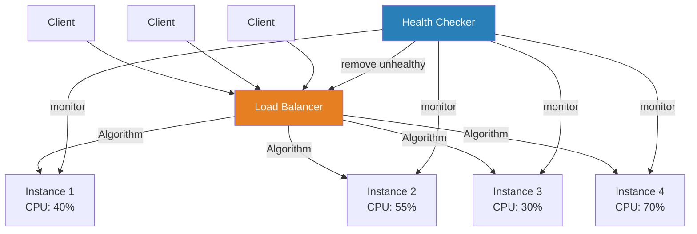
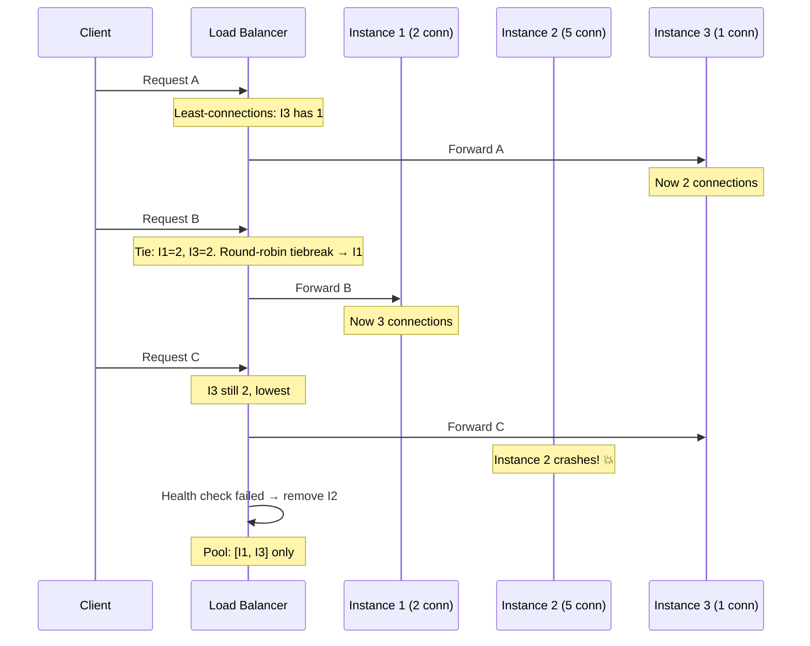

# Load Balancing

## 1. The Problem (Story)

Your ride-sharing app has 8 instances of the `ride-matching` service, each capable of handling 500 requests/second. Total capacity: 4,000 req/s. On a Friday evening, traffic hits 3,200 req/s. Should be fine.

But it's not. Instance 1 is receiving 1,800 req/s. Instance 2 gets 900. Instance 3 gets 300. Instances 4-8 are nearly idle at 40 req/s each. Instance 1 is dropping requests, response times are spiking, and users see "No drivers found" errors.

Why? The DNS resolved to a list of IPs with instance 1 first. Clients cached that first entry. When they did round-robin, the first two IPs dominated because most clients started iterating from index 0.

The on-call engineer manually redistributed traffic by updating the DNS ordering. Thirty minutes later, the same imbalance re-emerged because a new batch of clients cached the "fixed" ordering.

**You have the capacity to handle the load, but no mechanism to distribute it evenly.**

## 2. The Naïve Solutions

### Attempt 1: "Random selection"

Each client picks a random instance:

```typescript
const instances = ['inst1', 'inst2', 'inst3'];
const target = instances[Math.floor(Math.random() * instances.length)];
```

Over large numbers, this approaches even distribution. But:
- With small sample sizes (hundreds, not millions of requests), distribution can be surprisingly uneven
- No consideration for instance health — random can hit a sick instance
- No consideration for instance capacity — some instances may be smaller (heterogeneous fleet)
- No awareness of current load — a random choice might hit an instance that's already at 95% CPU

### Attempt 2: "Client-side round-robin"

```typescript
let counter = 0;
function nextInstance(instances: string[]): string {
  return instances[counter++ % instances.length];
}
```

Even distribution by index rotation. But:
- Each client maintains its own counter independently — if 100 clients all start at index 0, the first 100 requests all hit instance 0
- No awareness of connection duration: a long-running WebSocket on instance 3 makes it "busier" than a quick REST endpoint on instance 5, but round-robin treats them equally
- Adding or removing instances resets the rotation, causing a temporary imbalance
- No health awareness — keeps routing to crashed instances until the list is updated

### Attempt 3: "Sticky sessions"

Hash the user ID to always route the same user to the same instance:

```typescript
function sticky(userId: string, instances: string[]): string {
  const hash = hashCode(userId) % instances.length;
  return instances[hash];
}
```

Great for stateful services. But:
- Power users generate 100x more requests than average users — if a whale user hashes to instance 2, that instance is overloaded
- When an instance is removed, `% instances.length` changes — almost every user's hash moves, causing massive cache invalidation
- Not load balancing at all — it's traffic routing that ignores load

## 3. The Insight

**A dedicated component (the load balancer) sits between clients and instances, making per-request routing decisions based on an algorithm.** The algorithm can be simple (round-robin) or smart (least-connections, weighted). The key shift: move the routing decision away from clients (who lack global visibility) to a central point (which can see all instances' states).

## 4. The Pattern

**Load Balancing** distributes incoming requests across a pool of service instances to:

1. **Maximize throughput**: No instance is overloaded while others are idle
2. **Minimize latency**: Route to the least-busy instance
3. **Enable scaling**: Add instances and they automatically receive traffic
4. **Increase reliability**: Remove failed instances from the pool

### Common Algorithms

| Algorithm | How It Works | Best For |
|-----------|-------------|----------|
| **Round-Robin** | Cycles through instances 1, 2, 3, 1, 2, 3... | Stateless services, homogeneous fleet |
| **Weighted Round-Robin** | Cycles but bigger instances get more turns | Heterogeneous fleet (4-core and 8-core) |
| **Least Connections** | Routes to the instance with the fewest active connections | Long-running requests, WebSockets |
| **Weighted Least Connections** | Least connections ÷ weight | Heterogeneous fleet + variable request durations |
| **Consistent Hashing** | Hash(key) → ring position → nearest instance | Caching layers (maximize cache hits) |
| **Random** | Pick randomly | Very large pools where statistics even out |

### Guarantees
- Even-ish distribution (depending on algorithm)
- Automatic failover when instances fail health checks
- Transparent to clients (they call one address)

### Non-Guarantees
- Not a substitute for service discovery (LB needs to know instances exist)
- No guarantee of session affinity (unless explicitly configured)
- No guarantee of zero-downtime during instance removal

## 5. Mental Model

**A restaurant host.** When guests (requests) arrive, the host (load balancer) doesn't let everyone sit at the same table (instance). The host sees which tables are empty, which are nearly full, and which have a "reserved" sign (unhealthy). Simple hosts alternate tables (round-robin). Smart hosts check how many courses each table has remaining (least connections). The guests don't decide where to sit — the host does.

## 6. Structure





## 7. Code Example

### TypeScript — Load balancer with multiple algorithms

```typescript
// ─── TYPES ───────────────────────────────────────────

interface BackendInstance {
  id: string;
  host: string;
  port: number;
  weight: number;
  healthy: boolean;
  activeConnections: number;
}

type Algorithm = 'round-robin' | 'weighted-round-robin' | 'least-connections' | 'consistent-hash';

// ─── CONSISTENT HASH RING ───────────────────────────

class HashRing {
  private ring: Map<number, string> = new Map();
  private sortedKeys: number[] = [];
  private virtualNodes: number;

  constructor(virtualNodes = 150) {
    this.virtualNodes = virtualNodes;
  }

  private hash(key: string): number {
    let h = 0;
    for (let i = 0; i < key.length; i++) {
      h = ((h << 5) - h + key.charCodeAt(i)) | 0;
    }
    return Math.abs(h);
  }

  addNode(nodeId: string): void {
    for (let i = 0; i < this.virtualNodes; i++) {
      const virtualKey = `${nodeId}#${i}`;
      const hash = this.hash(virtualKey);
      this.ring.set(hash, nodeId);
      this.sortedKeys.push(hash);
    }
    this.sortedKeys.sort((a, b) => a - b);
  }

  removeNode(nodeId: string): void {
    for (let i = 0; i < this.virtualNodes; i++) {
      const virtualKey = `${nodeId}#${i}`;
      const hash = this.hash(virtualKey);
      this.ring.delete(hash);
    }
    this.sortedKeys = this.sortedKeys.filter(k => this.ring.has(k));
  }

  getNode(key: string): string | null {
    if (this.sortedKeys.length === 0) return null;

    const hash = this.hash(key);
    // Find the first node clockwise from the hash
    for (const nodeHash of this.sortedKeys) {
      if (nodeHash >= hash) {
        return this.ring.get(nodeHash)!;
      }
    }
    // Wrap around to first node
    return this.ring.get(this.sortedKeys[0])!;
  }
}

// ─── LOAD BALANCER ──────────────────────────────────

class LoadBalancer {
  private instances: BackendInstance[] = [];
  private algorithm: Algorithm;
  private roundRobinIndex = 0;
  private weightedQueue: string[] = [];
  private weightedIndex = 0;
  private hashRing = new HashRing();

  constructor(algorithm: Algorithm) {
    this.algorithm = algorithm;
  }

  addInstance(id: string, host: string, port: number, weight = 1): void {
    this.instances.push({
      id, host, port, weight,
      healthy: true,
      activeConnections: 0,
    });
    this.hashRing.addNode(id);
    this.rebuildWeightedQueue();
    console.log(`[LB] Added: ${id} (weight=${weight})`);
  }

  removeInstance(id: string): void {
    this.instances = this.instances.filter(i => i.id !== id);
    this.hashRing.removeNode(id);
    this.rebuildWeightedQueue();
    console.log(`[LB] Removed: ${id}`);
  }

  markUnhealthy(id: string): void {
    const inst = this.instances.find(i => i.id === id);
    if (inst) {
      inst.healthy = false;
      console.log(`[LB] Marked unhealthy: ${id}`);
    }
  }

  private healthyInstances(): BackendInstance[] {
    return this.instances.filter(i => i.healthy);
  }

  private rebuildWeightedQueue(): void {
    this.weightedQueue = [];
    for (const inst of this.healthyInstances()) {
      for (let i = 0; i < inst.weight; i++) {
        this.weightedQueue.push(inst.id);
      }
    }
    this.weightedIndex = 0;
  }

  route(requestKey?: string): BackendInstance | null {
    const healthy = this.healthyInstances();
    if (healthy.length === 0) return null;

    let selected: BackendInstance | null = null;

    switch (this.algorithm) {
      case 'round-robin': {
        selected = healthy[this.roundRobinIndex % healthy.length];
        this.roundRobinIndex++;
        break;
      }
      case 'weighted-round-robin': {
        if (this.weightedQueue.length === 0) return null;
        const id = this.weightedQueue[this.weightedIndex % this.weightedQueue.length];
        selected = this.instances.find(i => i.id === id) ?? null;
        this.weightedIndex++;
        break;
      }
      case 'least-connections': {
        selected = healthy.reduce((min, inst) =>
          inst.activeConnections < min.activeConnections ? inst : min
        );
        break;
      }
      case 'consistent-hash': {
        if (!requestKey) {
          // Fallback to round-robin if no key provided
          selected = healthy[this.roundRobinIndex++ % healthy.length];
        } else {
          const nodeId = this.hashRing.getNode(requestKey);
          selected = this.instances.find(i => i.id === nodeId && i.healthy) ?? null;
          // If hashed node is unhealthy, fallback to least connections
          if (!selected) {
            selected = healthy.reduce((min, inst) =>
              inst.activeConnections < min.activeConnections ? inst : min
            );
          }
        }
        break;
      }
    }

    if (selected) {
      selected.activeConnections++;
    }
    return selected;
  }

  releaseConnection(id: string): void {
    const inst = this.instances.find(i => i.id === id);
    if (inst && inst.activeConnections > 0) {
      inst.activeConnections--;
    }
  }

  printState(): void {
    console.log(`\n[LB State] Algorithm: ${this.algorithm}`);
    for (const inst of this.instances) {
      const status = inst.healthy ? '🟢' : '🔴';
      console.log(`  ${status} ${inst.id} | connections: ${inst.activeConnections} | weight: ${inst.weight}`);
    }
  }
}

// ─── DEMO ────────────────────────────────────────────

function demo() {
  console.log('═══ Round-Robin ═══');
  const rrLB = new LoadBalancer('round-robin');
  rrLB.addInstance('web-1', '10.0.1.1', 8080);
  rrLB.addInstance('web-2', '10.0.1.2', 8080);
  rrLB.addInstance('web-3', '10.0.1.3', 8080);

  for (let i = 0; i < 6; i++) {
    const inst = rrLB.route();
    console.log(`  Request ${i + 1} → ${inst?.id}`);
  }

  console.log('\n═══ Weighted Round-Robin (heterogeneous fleet) ═══');
  const wrrLB = new LoadBalancer('weighted-round-robin');
  wrrLB.addInstance('big-1', '10.0.2.1', 8080, 3);   // 8-core machine
  wrrLB.addInstance('small-1', '10.0.2.2', 8080, 1);  // 2-core machine

  const counts: Record<string, number> = {};
  for (let i = 0; i < 8; i++) {
    const inst = wrrLB.route();
    if (inst) counts[inst.id] = (counts[inst.id] ?? 0) + 1;
  }
  console.log('  Distribution:', counts); // big-1: 6, small-1: 2

  console.log('\n═══ Least Connections ═══');
  const lcLB = new LoadBalancer('least-connections');
  lcLB.addInstance('api-1', '10.0.3.1', 8080);
  lcLB.addInstance('api-2', '10.0.3.2', 8080);
  lcLB.addInstance('api-3', '10.0.3.3', 8080);

  // Simulate: api-1 has long-running connections
  const r1 = lcLB.route()!; // api-1 (all at 0, picks first)
  console.log(`  Long request → ${r1.id} (conn: ${r1.activeConnections})`);
  const r2 = lcLB.route()!; // api-2 (0 connections)
  console.log(`  Request 2 → ${r2.id} (conn: ${r2.activeConnections})`);
  const r3 = lcLB.route()!; // api-3 (0 connections)
  console.log(`  Request 3 → ${r3.id} (conn: ${r3.activeConnections})`);

  lcLB.releaseConnection(r2.id); // api-2 finishes
  lcLB.releaseConnection(r3.id); // api-3 finishes

  const r4 = lcLB.route()!; // api-2 or api-3 (both at 0, picks lowest)
  console.log(`  Request 4 → ${r4.id} (conn: ${r4.activeConnections})`);

  lcLB.printState();

  console.log('\n═══ Consistent Hashing (cache affinity) ═══');
  const chLB = new LoadBalancer('consistent-hash');
  chLB.addInstance('cache-1', '10.0.4.1', 8080);
  chLB.addInstance('cache-2', '10.0.4.2', 8080);
  chLB.addInstance('cache-3', '10.0.4.3', 8080);

  // Same key always routes to same instance
  console.log(`  user-42 → ${chLB.route('user-42')?.id}`);
  chLB.releaseConnection('cache-2'); // release for next demo
  console.log(`  user-42 → ${chLB.route('user-42')?.id}`); // Same!
  chLB.releaseConnection('cache-2');
  console.log(`  user-99 → ${chLB.route('user-99')?.id}`); // Different user, may differ

  // Remove a node — only keys mapped to that node move
  console.log('\n  Removing cache-2...');
  chLB.removeInstance('cache-2');
  console.log(`  user-42 → ${chLB.route('user-42')?.id}`); // Remapped
}

demo();
```

### Go — Load balancer with least-connections

```go
package main

import (
	"fmt"
	"math"
	"sync"
)

type Instance struct {
	ID          string
	Host        string
	Port        int
	Healthy     bool
	Connections int
	Weight      int
}

type LoadBalancer struct {
	mu        sync.Mutex
	instances []*Instance
	rrIndex   int
}

func NewLoadBalancer() *LoadBalancer {
	return &LoadBalancer{}
}

func (lb *LoadBalancer) Add(id, host string, port, weight int) {
	lb.mu.Lock()
	defer lb.mu.Unlock()
	lb.instances = append(lb.instances, &Instance{
		ID: id, Host: host, Port: port,
		Healthy: true, Weight: weight,
	})
}

func (lb *LoadBalancer) healthy() []*Instance {
	var result []*Instance
	for _, inst := range lb.instances {
		if inst.Healthy {
			result = append(result, inst)
		}
	}
	return result
}

func (lb *LoadBalancer) RoundRobin() *Instance {
	lb.mu.Lock()
	defer lb.mu.Unlock()

	h := lb.healthy()
	if len(h) == 0 {
		return nil
	}
	inst := h[lb.rrIndex%len(h)]
	lb.rrIndex++
	inst.Connections++
	return inst
}

func (lb *LoadBalancer) LeastConnections() *Instance {
	lb.mu.Lock()
	defer lb.mu.Unlock()

	h := lb.healthy()
	if len(h) == 0 {
		return nil
	}

	min := h[0]
	for _, inst := range h[1:] {
		if inst.Connections < min.Connections {
			min = inst
		}
	}
	min.Connections++
	return min
}

func (lb *LoadBalancer) WeightedLeastConnections() *Instance {
	lb.mu.Lock()
	defer lb.mu.Unlock()

	h := lb.healthy()
	if len(h) == 0 {
		return nil
	}

	best := h[0]
	bestScore := float64(best.Connections) / math.Max(float64(best.Weight), 1)

	for _, inst := range h[1:] {
		score := float64(inst.Connections) / math.Max(float64(inst.Weight), 1)
		if score < bestScore {
			best = inst
			bestScore = score
		}
	}
	best.Connections++
	return best
}

func (lb *LoadBalancer) Release(id string) {
	lb.mu.Lock()
	defer lb.mu.Unlock()
	for _, inst := range lb.instances {
		if inst.ID == id && inst.Connections > 0 {
			inst.Connections--
		}
	}
}

func main() {
	lb := NewLoadBalancer()
	lb.Add("web-1", "10.0.1.1", 8080, 1)
	lb.Add("web-2", "10.0.1.2", 8080, 1)
	lb.Add("web-3", "10.0.1.3", 8080, 1)

	fmt.Println("── Round-Robin ──")
	for i := 0; i < 6; i++ {
		inst := lb.RoundRobin()
		fmt.Printf("  Request %d → %s\n", i+1, inst.ID)
		lb.Release(inst.ID)
	}

	// Reset connections
	for _, inst := range lb.instances {
		inst.Connections = 0
	}

	fmt.Println("\n── Least Connections ──")
	// Simulate: web-1 has a long-running request
	r1 := lb.LeastConnections()
	fmt.Printf("  Long request → %s (conn: %d)\n", r1.ID, r1.Connections)

	r2 := lb.LeastConnections()
	fmt.Printf("  Request 2 → %s (conn: %d)\n", r2.ID, r2.Connections)

	r3 := lb.LeastConnections()
	fmt.Printf("  Request 3 → %s (conn: %d)\n", r3.ID, r3.Connections)

	lb.Release(r2.ID)
	lb.Release(r3.ID)

	r4 := lb.LeastConnections() // Should pick web-2 or web-3 (0 connections)
	fmt.Printf("  Request 4 → %s (conn: %d)\n", r4.ID, r4.Connections)
}
```

## 8. Gotchas & Beginner Mistakes

| Mistake | Why It Happens | Fix |
|---------|---------------|-----|
| Using round-robin for long-lived connections | WebSocket connections last minutes/hours; round-robin distributes initial connections evenly but ignores duration | Use least-connections for WebSockets, gRPC streams, or any long-lived protocol |
| No health checks | Load balancer routes to crashed instances → 50% error rate | Active health checks (periodic pings) + passive health checks (track 5xx responses) |
| Ignoring connection draining | Removing an instance drops in-flight requests | Drain: stop sending NEW requests, wait for existing ones to finish (30-60s timeout) |
| Session affinity via IP hash | Users behind NAT share an IP → one instance gets all their traffic | Use a cookie-based session ID or JWT claim for hashing instead of source IP |
| L4 when you need L7 | TCP load balancing can't read HTTP headers → can't route by path, host, or content type | Use L7 (HTTP) load balancing when you need path-based routing or header inspection |
| Thundering herd on failover | Instance dies → all its connections simultaneously reconnect to remaining instances | Implement connection backoff with jitter. Gradually ramp traffic after failover. |

## 9. Related & Confusable Patterns

| Pattern | Relationship | Key Difference |
|---------|-------------|----------------|
| **Service Discovery** | Prerequisite | Discovery finds instances. Load balancing decides which instance handles each request. |
| **API Gateway** | Complementary | API Gateway handles auth, rate limiting, protocol translation. Load balancer distributes traffic. Many gateways include built-in LB. |
| **Circuit Breaker** | Complementary | Circuit breaker stops calling a failing instance. Load balancer removes unhealthy instances from the pool. Both prevent error cascading. |
| **Reverse Proxy** | Overlapping | A reverse proxy can do load balancing plus caching, SSL termination, and compression. nginx and HAProxy serve both roles. |
| **CDN** | Geographic LB | CDNs route users to the nearest edge server. It's geographic load balancing with caching. |

## 10. When This Pattern Is the WRONG Choice

| Scenario | Why Load Balancing Hurts | Better Alternative |
|----------|--------------------------|-------------------|
| Single instance | One backend doesn't need balancing | Direct connection behind a reverse proxy (for SSL termination) |
| Event-driven / queue-based | Workers pull from a queue at their own pace — the queue IS the balancer | Use a message queue (competing consumers pattern) |
| Batch processing | Jobs run for hours; distributing evenly at start is sufficient | Job scheduler with work stealing |
| Peer-to-peer systems | No central point to balance through | DHT-based routing (chord, kademlia) |
| Very high throughput (10M+ req/s) | Single LB becomes a bottleneck | DNS-based anycast + multiple regional LBs |

**Symptom you need load balancing**: Some instances are at 90% CPU while others idle at 10%. Scaling out doesn't improve throughput. One instance failure takes down a disproportionate share of traffic.

**Back-out strategy**: Start with DNS round-robin (free, simple, no infrastructure). Graduate to cloud-managed ALBs (AWS ALB, GCP Cloud LB) which handle health checks and algorithms for you. Only run your own (HAProxy, nginx, Envoy) if you need custom routing logic.
