# Rolling Update

## 1. The Problem (Story)

Your API gateway runs 12 instances behind a load balancer. Each instance handles ~2,000 requests per second. Total capacity: 24,000 RPS. During peak hours, you operate at 80% capacity — 19,200 RPS.

Blue-green deployment worked great when you had 2 instances. Now with 12, it means maintaining 24 instances — 12 active, 12 idle. That's double the cloud bill: $14,400/month for infrastructure that sits idle 99.9% of the time, doing nothing until the next deploy.

You deploy 3 times a day. Each deploy's blue-green switch lasts 30 seconds. That means the 12 idle instances run for $14,400/month to serve traffic for a total of 90 seconds per day.

Your manager asks the obvious question: "Can we deploy without doubling our infrastructure?"

Canary won't help either — it still requires a separate canary fleet. You need a deployment strategy that uses your **existing capacity**.

## 2. The Naïve Solutions

### Attempt 1: "Deploy to all instances simultaneously"

```typescript
// Stop all 12 instances, deploy, start them all
async function deployAll(instances: string[], version: string): Promise<void> {
  // ALL instances go down at once
  for (const instance of instances) {
    await stopInstance(instance);
  }
  // Zero capacity right now. All 19,200 RPS are getting 503 errors.
  for (const instance of instances) {
    await deployToInstance(instance, version);
    await startInstance(instance);
  }
}
```

Total outage during deployment. Unacceptable for a service handling real-time traffic.

### Attempt 2: "Deploy one at a time, no coordination"

```typescript
for (const instance of instances) {
  await stopInstance(instance);      // Instance goes down
  await deployToInstance(instance, version);
  await startInstance(instance);     // Instance comes back
  // No health check. No drain. Just move to the next one.
}
```

Works if everything goes right. But:
- What if the new version crashes on startup? You already took the instance down.
- What if requests are in-flight when you stop the instance? They get dropped.
- What if you're at 90% capacity? Losing even one instance tips you over.

### Attempt 3: "Deploy in large batches for speed"

```typescript
// Deploy to 6 instances at a time (half the fleet)
const batch1 = instances.slice(0, 6);
const batch2 = instances.slice(6);

await Promise.all(batch1.map(i => deployToInstance(i, version)));
// 50% capacity during this period — if you were at 80%, you're now overloaded
```

Batch size too large = capacity drops below demand. Batch size of 1 = slow but safe. The tradeoff is between speed and capacity.

## 3. The Insight

**Replace instances one at a time (or in small batches), ensuring each new instance is healthy before moving to the next.** Before stopping an instance, drain its in-flight connections. After deploying, verify health. If the new instance is unhealthy, stop the rollout. At every point during the update, you maintain enough healthy capacity to serve traffic. There's no idle fleet — you use the same instances, just update them sequentially.

## 4. The Pattern

**Rolling Update** replaces instances incrementally while maintaining overall service availability:

- **Max Unavailable**: How many instances can be down simultaneously (e.g., 2 out of 12)
- **Max Surge**: How many extra instances can be created temporarily during the rollout (e.g., 1)
- **Health Check**: Verification that the new instance is ready before removing the next old one
- **Connection Draining**: Graceful shutdown — finish in-flight requests before stopping

### Guarantees
- No additional idle infrastructure — uses existing capacity
- Service remains available throughout the deployment
- Controllable blast radius via max-unavailable setting
- Health-based progression — bad versions don't spread

### Non-Guarantees
- Mixed versions during rollout (old and new serve traffic simultaneously)
- Rollback is not instant — requires another rolling update in reverse
- Temporary capacity reduction during the rollout
- Does not guarantee all users see the same version at the same time

## 5. Mental Model

**Replacing the tires on a moving car, one at a time.** You can't stop the car (downtime). You pull into a service lane (drain connections), replace one tire (swap one instance), verify it's secure (health check), and get back on the highway. You drive on 3 old + 1 new tire for a bit. Then replace the next. Eventually all 4 are new, and you never stopped driving.

## 6. Structure

```mermaid
graph TD
    LB[Load Balancer]

    subgraph "Rolling Update in Progress"
        I1[Instance 1<br/>v2.0 ✓ NEW]
        I2[Instance 2<br/>v2.0 ✓ NEW]
        I3[Instance 3<br/>⏳ UPDATING]
        I4[Instance 4<br/>v1.0 OLD]
        I5[Instance 5<br/>v1.0 OLD]
        I6[Instance 6<br/>v1.0 OLD]
    end

    LB --> I1
    LB --> I2
    LB -.->|draining| I3
    LB --> I4
    LB --> I5
    LB --> I6

    style I1 fill:#27ae60,color:#fff
    style I2 fill:#27ae60,color:#fff
    style I3 fill:#e67e22,color:#fff
    style I4 fill:#2980b9,color:#fff
    style I5 fill:#2980b9,color:#fff
    style I6 fill:#2980b9,color:#fff
    style LB fill:#2c3e50,color:#fff
```




## 7. Code Example

### TypeScript — Rolling update with health checks and draining

```typescript
// ─── TYPES ───────────────────────────────────────────

interface Instance {
  id: string;
  version: string;
  status: 'running' | 'draining' | 'stopped' | 'starting' | 'healthy';
  activeConnections: number;
}

interface RollingUpdateConfig {
  maxUnavailable: number;   // Max instances down at once
  drainTimeoutMs: number;   // Max time to wait for connections to drain
  healthCheckRetries: number;
  healthCheckIntervalMs: number;
}

interface UpdateResult {
  success: boolean;
  updated: string[];
  failed: string[];
  abortedAt?: string;
}

// ─── INSTANCE MANAGER (simulated) ────────────────────

class InstanceManager {
  private instances: Map<string, Instance> = new Map();

  addInstance(id: string, version: string): void {
    this.instances.set(id, {
      id, version, status: 'running',
      activeConnections: Math.floor(Math.random() * 50) + 10,
    });
  }

  getAll(): Instance[] {
    return Array.from(this.instances.values());
  }

  get(id: string): Instance {
    return this.instances.get(id)!;
  }

  async drain(id: string, timeoutMs: number): Promise<boolean> {
    const instance = this.instances.get(id)!;
    instance.status = 'draining';
    console.log(`  [${id}] Draining ${instance.activeConnections} connections...`);

    // Simulate connections finishing
    const drainTime = Math.min(instance.activeConnections * 10, timeoutMs);
    await delay(Math.min(drainTime, 200)); // Simulated delay

    if (drainTime >= timeoutMs) {
      console.log(`  [${id}] Drain timeout — forcing shutdown (${instance.activeConnections} connections dropped)`);
      instance.activeConnections = 0;
      return false; // Some connections were force-closed
    }

    instance.activeConnections = 0;
    console.log(`  [${id}] Drained successfully`);
    return true;
  }

  async deploy(id: string, newVersion: string): Promise<void> {
    const instance = this.instances.get(id)!;
    instance.status = 'stopped';
    console.log(`  [${id}] Deploying ${newVersion}...`);
    await delay(150); // Simulate deploy time
    instance.version = newVersion;
    instance.status = 'starting';
    console.log(`  [${id}] Starting...`);
    await delay(100); // Simulate startup time
  }

  async healthCheck(id: string): Promise<boolean> {
    const instance = this.instances.get(id)!;
    await delay(50);

    // Simulate: versions with "bad" are unhealthy
    const healthy = !instance.version.includes('bad');
    if (healthy) {
      instance.status = 'healthy';
      instance.activeConnections = 0; // Will receive traffic soon
      instance.status = 'running';
    }
    return healthy;
  }
}

// ─── ROLLING UPDATE ORCHESTRATOR ─────────────────────

class RollingUpdater {
  private manager: InstanceManager;
  private config: RollingUpdateConfig;

  constructor(manager: InstanceManager, config: RollingUpdateConfig) {
    this.manager = manager;
    this.config = config;
  }

  async update(newVersion: string): Promise<UpdateResult> {
    const instances = this.manager.getAll();
    const updated: string[] = [];
    const failed: string[] = [];

    console.log(`\n${'='.repeat(50)}`);
    console.log(`[Rolling] Starting update to ${newVersion}`);
    console.log(`[Rolling] Instances: ${instances.length}, maxUnavail: ${this.config.maxUnavailable}`);
    console.log('='.repeat(50));

    // Process instances in batches of maxUnavailable
    for (let i = 0; i < instances.length; i += this.config.maxUnavailable) {
      const batch = instances.slice(i, i + this.config.maxUnavailable);
      const batchNum = Math.floor(i / this.config.maxUnavailable) + 1;
      console.log(`\n[Batch ${batchNum}] Updating: ${batch.map(b => b.id).join(', ')}`);

      // Update each instance in the batch
      for (const instance of batch) {
        const success = await this.updateInstance(instance.id, newVersion);

        if (success) {
          updated.push(instance.id);
        } else {
          failed.push(instance.id);
          // If an instance fails, abort the rollout
          console.log(`\n[Rolling] ✗ ABORTED: ${instance.id} failed health check`);
          console.log(`[Rolling] Updated: ${updated.length}/${instances.length}`);
          console.log(`[Rolling] Remaining instances stay on old version`);
          return {
            success: false,
            updated,
            failed,
            abortedAt: instance.id,
          };
        }
      }

      // Capacity check before continuing
      const running = this.manager.getAll().filter(i => i.status === 'running');
      console.log(`[Batch ${batchNum}] Complete. Running instances: ${running.length}/${instances.length}`);
    }

    console.log(`\n[Rolling] ✓ COMPLETE: All ${instances.length} instances updated to ${newVersion}`);
    return { success: true, updated, failed };
  }

  private async updateInstance(id: string, version: string): Promise<boolean> {
    console.log(`\n  --- Updating ${id} ---`);

    // Step 1: Drain connections
    await this.manager.drain(id, this.config.drainTimeoutMs);

    // Step 2: Deploy new version
    await this.manager.deploy(id, version);

    // Step 3: Health check with retries
    for (let attempt = 1; attempt <= this.config.healthCheckRetries; attempt++) {
      const healthy = await this.manager.healthCheck(id);
      if (healthy) {
        console.log(`  [${id}] Health check passed ✓ (attempt ${attempt})`);
        return true;
      }
      console.log(`  [${id}] Health check failed (attempt ${attempt}/${this.config.healthCheckRetries})`);
      if (attempt < this.config.healthCheckRetries) {
        await delay(this.config.healthCheckIntervalMs);
      }
    }

    console.log(`  [${id}] ✗ All health checks failed`);
    return false;
  }

  printStatus(): void {
    console.log('\n[Status]');
    for (const instance of this.manager.getAll()) {
      const emoji = instance.status === 'running' ? '🟢' : '🔴';
      console.log(`  ${emoji} ${instance.id}: ${instance.version} [${instance.status}]`);
    }
  }
}

// ─── HELPERS ─────────────────────────────────────────

function delay(ms: number): Promise<void> {
  return new Promise(resolve => setTimeout(resolve, ms));
}

// ─── SCENARIO ────────────────────────────────────────

async function demo() {
  const manager = new InstanceManager();
  for (let i = 1; i <= 6; i++) {
    manager.addInstance(`instance-${i}`, 'v1.0.0');
  }

  const updater = new RollingUpdater(manager, {
    maxUnavailable: 2,
    drainTimeoutMs: 5000,
    healthCheckRetries: 3,
    healthCheckIntervalMs: 1000,
  });

  updater.printStatus();

  // Successful rolling update
  const result1 = await updater.update('v2.0.0');
  console.log('\nResult:', result1);
  updater.printStatus();

  // Failed rolling update (aborted after first batch)
  const result2 = await updater.update('v3.0.0-bad');
  console.log('\nResult:', result2);
  updater.printStatus();
  // Note: some instances are on v3.0.0-bad (failed), others still on v2.0.0
}

demo();
```

### Go — Rolling update orchestrator

```go
package main

import (
	"fmt"
	"strings"
	"time"
)

type Instance struct {
	ID      string
	Version string
	Status  string // running, draining, stopped, starting
}

type RollingUpdater struct {
	Instances      []*Instance
	MaxUnavailable int
}

func (ru *RollingUpdater) Update(newVersion string) error {
	fmt.Printf("\n[Rolling] Updating %d instances to %s (maxUnavail=%d)\n",
		len(ru.Instances), newVersion, ru.MaxUnavailable)

	for i := 0; i < len(ru.Instances); i += ru.MaxUnavailable {
		end := i + ru.MaxUnavailable
		if end > len(ru.Instances) {
			end = len(ru.Instances)
		}
		batch := ru.Instances[i:end]

		fmt.Printf("\n[Batch] Updating %d instances\n", len(batch))
		for _, inst := range batch {
			if err := ru.updateOne(inst, newVersion); err != nil {
				fmt.Printf("[Rolling] ABORTED at %s: %v\n", inst.ID, err)
				return err
			}
		}
	}

	fmt.Printf("[Rolling] ✓ All instances updated to %s\n", newVersion)
	return nil
}

func (ru *RollingUpdater) updateOne(inst *Instance, version string) error {
	// Drain
	inst.Status = "draining"
	fmt.Printf("  [%s] Draining...\n", inst.ID)
	time.Sleep(50 * time.Millisecond)

	// Deploy
	inst.Status = "stopped"
	inst.Version = version
	fmt.Printf("  [%s] Deploying %s...\n", inst.ID, version)
	time.Sleep(50 * time.Millisecond)

	// Health check
	inst.Status = "starting"
	if strings.Contains(version, "bad") {
		return fmt.Errorf("health check failed")
	}
	inst.Status = "running"
	fmt.Printf("  [%s] Healthy ✓\n", inst.ID)
	return nil
}

func (ru *RollingUpdater) PrintStatus() {
	fmt.Println("\n[Status]")
	for _, inst := range ru.Instances {
		status := "🟢"
		if inst.Status != "running" {
			status = "🔴"
		}
		fmt.Printf("  %s %s: %s [%s]\n", status, inst.ID, inst.Version, inst.Status)
	}
}

func main() {
	instances := make([]*Instance, 6)
	for i := range instances {
		instances[i] = &Instance{
			ID:      fmt.Sprintf("inst-%d", i+1),
			Version: "v1.0.0",
			Status:  "running",
		}
	}

	ru := &RollingUpdater{Instances: instances, MaxUnavailable: 2}
	ru.PrintStatus()

	ru.Update("v2.0.0")
	ru.PrintStatus()

	ru.Update("v3.0.0-bad") // Fails, partially updated
	ru.PrintStatus()
}
```

## 8. Gotchas & Beginner Mistakes

| Mistake | Why It Happens | Fix |
|---------|---------------|-----|
| No connection draining | Just kill the process — in-flight requests get 502 | Implement graceful shutdown: stop accepting, finish active requests, then exit |
| maxUnavailable too high | "Let's do 50% at a time for speed" — drops capacity below demand | Set maxUnavailable to ensure remaining capacity > peak traffic. Usually 1 or 2. |
| No health check between instances | One bad instance doesn't stop the rollout | Always verify health before proceeding. Abort on first failure. |
| Mixed version incompatibility | v1 and v2 serve different API responses during rollout | Use API versioning or ensure backward compatibility between consecutive versions |
| Rollback requires another full rolling update | Rolling back 12 instances takes as long as deploying | Accept this tradeoff, or use blue-green for services that need instant rollback |
| Ignoring database compatibility | New code needs new schema, but old instances still running | Use expand-contract migrations. New columns added first, old columns removed later. |

## 9. Related & Confusable Patterns

| Pattern | Relationship | Key Difference |
|---------|-------------|----------------|
| **Blue-Green Deployment** | Alternative | Blue-green switches all traffic instantly with a second environment. Rolling uses existing capacity. |
| **Canary Release** | Complementary | Canary controls traffic percentage. Rolling controls instance replacement order. Often combined: canary first, then rolling. |
| **Recreate Deployment** | Simpler but brutal | Recreate stops all instances, deploys, starts. Brief downtime. Rolling has zero downtime. |
| **Kubernetes Deployments** | Platform implementation | Kubernetes Deployments implement rolling updates natively with `maxUnavailable` and `maxSurge` settings. |
| **Load Balancing** | Required infrastructure | Rolling updates depend on the load balancer to stop routing to draining instances. |

## 10. When This Pattern Is the WRONG Choice

| Scenario | Why Rolling Updates Hurt | Better Alternative |
|----------|------------------------|-------------------|
| Need instant rollback | Rolling back is another full rolling update (slow) | Blue-green (instant switch) |
| Backward-incompatible changes | Can't run v1 and v2 simultaneously against the same DB | Blue-green with migration window |
| Very few instances (1-2) | Draining 1 of 2 means 50% capacity loss | Blue-green or recreate with brief downtime |
| Real-time systems with zero tolerance for mixed versions | WebSocket sessions see different behavior mid-rollout | Blue-green with connection migration |
| Long startup times (> 5 minutes per instance) | 12 instances × 5 minutes = 60-minute rolling update | Pre-warm new instances (surge), then drain old ones |

**Symptom you need rolling updates**: Blue-green deployment costs too much. You have many instances and deploy frequently. Brief mixed-version traffic is acceptable.

**Back-out strategy**: If rolling updates are too slow or mixed versions cause problems, switch to blue-green deployment. Use auto-scaling to spin up the idle environment only during deploys (minutes, not 24/7) to reduce cost.
