# Service Discovery

## 1. The Problem (Story)

Your company runs a microservices architecture: 14 services, each with 2-8 instances behind a load balancer. When the `orders-service` needs to call the `inventory-service`, it uses a hardcoded URL:

```typescript
const INVENTORY_URL = 'http://10.0.3.42:8080';
```

This worked when `inventory-service` ran on one server that never changed. Then:

1. **Auto-scaling**: inventory-service scaled from 2 to 6 instances during Black Friday. The new instances got IPs `10.0.3.50-53`. Orders-service only knew about `10.0.3.42`. The 4 new instances were idle while the original 2 were overloaded.

2. **Instance failure**: `10.0.3.42` crashed and was replaced by `10.0.3.67`. Orders-service kept calling `10.0.3.42` — connection refused. The on-call engineer had to update the config and redeploy orders-service at 3 AM to point it to the new IP.

3. **Environment differences**: Dev points to `inventory-dev.internal:8080`, staging to `inventory-staging.internal:8080`, prod to the IP. Environment-specific config files for every service pair.

The engineering team has a spreadsheet that maps service names to IPs. It's updated "when someone remembers." It's currently 3 weeks out of date.

**In a dynamic environment where instances come and go, hardcoding network locations creates a single point of fragility.**

## 2. The Naïve Solutions

### Attempt 1: "DNS"

Use DNS names instead of IPs:

```
inventory-service → CNAME → 10.0.3.42
```

When the IP changes, update DNS. But:
- DNS TTL (time-to-live) means clients cache the old IP for minutes to hours
- DNS doesn't handle multiple instances well (round-robin DNS has no health awareness)
- DNS returns IPs — no port information, no metadata, no health status
- Updating DNS records requires manual action or a separate automation tool

### Attempt 2: "Configuration file"

```json
{
  "services": {
    "inventory": ["10.0.3.42:8080", "10.0.3.43:8080"],
    "payment": ["10.0.5.10:9090"],
    "email": ["10.0.7.20:3000", "10.0.7.21:3000"]
  }
}
```

Every service loads this config at startup. Problems:
- When a new instance launches, every other service needs to reload its config
- When an instance dies, every client discovers it only when a request fails
- Config changes require service restarts (or a custom file-watching mechanism)
- Config lives in... a shared file? An environment variable? A config server? Now you need to discover the config server.

### Attempt 3: "Load balancer per service"

Put an AWS ALB in front of every service:

```
orders → ALB-inventory → [10.0.3.42, 10.0.3.43, ...]
orders → ALB-payment   → [10.0.5.10, ...]
```

Better — the ALB handles health checks and routing. But:
- 14 services = 14 ALBs = $14 × $20/month base cost + request fees
- Inter-service calls add an extra network hop through the ALB
- The ALB itself becomes a point of failure (rare, but possible)
- Every new service needs a new ALB provisioned

## 3. The Insight

**Services register themselves when they start and deregister when they stop. Clients look up the registry to find service instances dynamically.** The registry maintains a real-time map of service names to healthy instances (IP, port, metadata). Health checks automatically remove unhealthy instances. No hardcoded IPs, no stale configs, no manual spreadsheet.

## 4. The Pattern

**Service Discovery** is a mechanism for services to find each other at runtime:

- **Service Registry**: A highly available data store that maintains live mappings from service names to instances
- **Registration**: Each service instance registers itself on startup (with its IP, port, health endpoint)
- **Deregistration**: Instances deregister on shutdown or are automatically removed after failed health checks
- **Lookup**: Clients query the registry by service name to get a list of healthy instances

Two models:
- **Client-side discovery**: The client queries the registry directly and chooses an instance (load balancing done by the client)
- **Server-side discovery**: The client talks to a router/load balancer that queries the registry

### Guarantees
- Dynamic location: services can move, scale, and restart without client changes
- Health-aware: only healthy instances are returned
- Real-time: new instances are available within seconds, not hours
- Decoupled: services reference names, not IPs

### Non-Guarantees
- Does not replace load balancing (discovery finds instances; balancing distributes load)
- Does not guarantee the discovered instance is still alive (race condition between lookup and call)
- Does not solve cross-datacenter routing
- Does not encrypt or authenticate the communication

## 5. Mental Model

**A phone directory.** When you want to call "Inventory Pizza," you don't memorize their phone number (IP address). You look up their name in the phone directory (service registry). If they move buildings (new instance IP), they update their listing. If they close a branch (instance shutdown), the listing is removed. You always call "Inventory Pizza" — the directory translates the name to the current number.

## 6. Structure

```mermaid
graph TD
    subgraph "Client-Side Discovery"
        C1[Orders Service]
        R1[Service Registry]
        I1[Inventory Instance 1]
        I2[Inventory Instance 2]
        I3[Inventory Instance 3]

        C1 -->|1. lookup 'inventory'| R1
        R1 -->|2. [inst1, inst2, inst3]| C1
        C1 -->|3. call directly| I2
    end

    subgraph "Server-Side Discovery"
        C2[Orders Service]
        LB[Router / Load Balancer]
        R2[Service Registry]
        I4[Inventory Instance 1]
        I5[Inventory Instance 2]

        C2 -->|1. call 'inventory'| LB
        LB -->|2. lookup 'inventory'| R2
        R2 -->|3. [inst1, inst2]| LB
        LB -->|4. route| I4
    end

    style R1 fill:#2980b9,color:#fff
    style R2 fill:#2980b9,color:#fff
    style LB fill:#e67e22,color:#fff
```



```mermaid
sequenceDiagram
    participant Inv1 as Inventory-1
    participant Inv2 as Inventory-2
    participant Reg as Service Registry
    participant Orders as Orders Service

    Note over Inv1,Reg: Startup: instances register
    Inv1->>Reg: register("inventory", 10.0.3.42:8080)
    Inv2->>Reg: register("inventory", 10.0.3.43:8080)

    Note over Reg: Registry: inventory → [.42, .43]

    Orders->>Reg: lookup("inventory")
    Reg-->>Orders: [10.0.3.42:8080, 10.0.3.43:8080]
    Orders->>Inv1: GET /stock?sku=ABC

    Note over Inv1: Instance 1 crashes! 💥
    Reg->>Inv1: Health check failed (3 consecutive)
    Reg->>Reg: Deregister 10.0.3.42

    Note over Reg: Registry: inventory → [.43]

    Note over Reg: Auto-scaler launches Instance 3
    participant Inv3 as Inventory-3
    Inv3->>Reg: register("inventory", 10.0.3.50:8080)

    Note over Reg: Registry: inventory → [.43, .50]

    Orders->>Reg: lookup("inventory")
    Reg-->>Orders: [10.0.3.43:8080, 10.0.3.50:8080]
    Orders->>Inv3: GET /stock?sku=ABC
```

## 7. Code Example

### TypeScript — Service registry with health checks

```typescript
// ─── TYPES ───────────────────────────────────────────

interface ServiceInstance {
  id: string;
  serviceName: string;
  host: string;
  port: number;
  metadata: Record<string, string>;
  registeredAt: Date;
  lastHeartbeat: Date;
  healthy: boolean;
}

interface RegistrationRequest {
  serviceName: string;
  host: string;
  port: number;
  metadata?: Record<string, string>;
}

// ─── SERVICE REGISTRY ────────────────────────────────

class ServiceRegistry {
  private instances: Map<string, ServiceInstance> = new Map();
  private heartbeatTimeoutMs: number;
  private checkIntervalMs: number;
  private checkTimer: ReturnType<typeof setInterval> | null = null;

  constructor(heartbeatTimeoutMs = 10_000, checkIntervalMs = 3_000) {
    this.heartbeatTimeoutMs = heartbeatTimeoutMs;
    this.checkIntervalMs = checkIntervalMs;
  }

  register(req: RegistrationRequest): string {
    const id = `${req.serviceName}-${req.host}:${req.port}`;

    const instance: ServiceInstance = {
      id,
      serviceName: req.serviceName,
      host: req.host,
      port: req.port,
      metadata: req.metadata ?? {},
      registeredAt: new Date(),
      lastHeartbeat: new Date(),
      healthy: true,
    };

    this.instances.set(id, instance);
    console.log(`[Registry] ✓ Registered: ${id}`);
    return id;
  }

  deregister(id: string): void {
    if (this.instances.delete(id)) {
      console.log(`[Registry] ✗ Deregistered: ${id}`);
    }
  }

  heartbeat(id: string): void {
    const instance = this.instances.get(id);
    if (instance) {
      instance.lastHeartbeat = new Date();
      instance.healthy = true;
    }
  }

  lookup(serviceName: string): ServiceInstance[] {
    const healthy = Array.from(this.instances.values())
      .filter(i => i.serviceName === serviceName && i.healthy);

    console.log(`[Registry] Lookup "${serviceName}" → ${healthy.length} healthy instances`);
    return healthy;
  }

  // Run health checks — remove instances that missed heartbeats
  runHealthCheck(): void {
    const now = Date.now();
    for (const [id, instance] of this.instances) {
      const elapsed = now - instance.lastHeartbeat.getTime();
      if (elapsed > this.heartbeatTimeoutMs) {
        instance.healthy = false;
        console.log(`[Registry] ⚠ ${id} missed heartbeat (${elapsed}ms) — marked unhealthy`);
      }
    }
  }

  startHealthChecks(): void {
    this.checkTimer = setInterval(() => this.runHealthCheck(), this.checkIntervalMs);
  }

  stopHealthChecks(): void {
    if (this.checkTimer) clearInterval(this.checkTimer);
  }

  printState(): void {
    console.log('\n[Registry State]');
    const byService = new Map<string, ServiceInstance[]>();
    for (const instance of this.instances.values()) {
      const list = byService.get(instance.serviceName) ?? [];
      list.push(instance);
      byService.set(instance.serviceName, list);
    }
    for (const [name, instances] of byService) {
      console.log(`  ${name}:`);
      for (const i of instances) {
        const status = i.healthy ? '🟢' : '🔴';
        console.log(`    ${status} ${i.host}:${i.port} (last heartbeat: ${i.lastHeartbeat.toISOString()})`);
      }
    }
  }
}

// ─── SERVICE CLIENT (client-side discovery) ──────────

class ServiceClient {
  private registry: ServiceRegistry;
  private roundRobinIndex: Map<string, number> = new Map();

  constructor(registry: ServiceRegistry) {
    this.registry = registry;
  }

  async call(serviceName: string, path: string): Promise<string> {
    const instances = this.registry.lookup(serviceName);

    if (instances.length === 0) {
      throw new Error(`No healthy instances for service: ${serviceName}`);
    }

    // Client-side load balancing: round-robin
    const idx = this.roundRobinIndex.get(serviceName) ?? 0;
    const instance = instances[idx % instances.length];
    this.roundRobinIndex.set(serviceName, idx + 1);

    const url = `http://${instance.host}:${instance.port}${path}`;
    console.log(`[Client] → ${url}`);

    // Simulate HTTP call
    return `Response from ${instance.id} for ${path}`;
  }
}

// ─── SCENARIO ────────────────────────────────────────

function demo() {
  const registry = new ServiceRegistry(5000, 2000);

  // Services register on startup
  console.log('╔══════════════════════════════╗');
  console.log('║  Phase 1: Registration       ║');
  console.log('╚══════════════════════════════╝');

  const inv1 = registry.register({
    serviceName: 'inventory',
    host: '10.0.3.42',
    port: 8080,
    metadata: { version: 'v2.1', region: 'us-east-1' },
  });

  const inv2 = registry.register({
    serviceName: 'inventory',
    host: '10.0.3.43',
    port: 8080,
    metadata: { version: 'v2.1', region: 'us-east-1' },
  });

  registry.register({
    serviceName: 'payment',
    host: '10.0.5.10',
    port: 9090,
    metadata: { version: 'v1.0' },
  });

  registry.printState();

  // Client discovers and calls services
  console.log('\n╔══════════════════════════════╗');
  console.log('║  Phase 2: Discovery & Call   ║');
  console.log('╚══════════════════════════════╝');

  const client = new ServiceClient(registry);
  client.call('inventory', '/stock?sku=ABC');
  client.call('inventory', '/stock?sku=DEF'); // Round-robins to second instance
  client.call('payment', '/charge');

  // Instance crashes — heartbeat stops
  console.log('\n╔══════════════════════════════╗');
  console.log('║  Phase 3: Instance Failure   ║');
  console.log('╚══════════════════════════════╝');

  // Simulate: instance 1 stops sending heartbeats
  // Force the heartbeat check by backdating the timestamp
  const instance1 = Array.from((registry as any).instances.values())
    .find((i: any) => i.id === inv1) as any;
  instance1.lastHeartbeat = new Date(Date.now() - 15_000); // 15 seconds ago

  registry.runHealthCheck();
  registry.printState();

  // Client now only sees the healthy instance
  client.call('inventory', '/stock?sku=GHI');

  // New instance auto-scales in
  console.log('\n╔══════════════════════════════╗');
  console.log('║  Phase 4: Scale Up           ║');
  console.log('╚══════════════════════════════╝');

  registry.register({
    serviceName: 'inventory',
    host: '10.0.3.50',
    port: 8080,
    metadata: { version: 'v2.1', region: 'us-east-1' },
  });

  registry.printState();
  client.call('inventory', '/stock?sku=JKL');

  // Graceful shutdown — instance deregisters
  console.log('\n╔══════════════════════════════╗');
  console.log('║  Phase 5: Graceful Shutdown  ║');
  console.log('╚══════════════════════════════╝');

  registry.deregister(inv2);
  registry.printState();
}

demo();
```

### Go — Service registry with heartbeat

```go
package main

import (
	"fmt"
	"time"
)

type Instance struct {
	ID            string
	Service       string
	Host          string
	Port          int
	Healthy       bool
	LastHeartbeat time.Time
}

type Registry struct {
	instances map[string]*Instance
	timeout   time.Duration
}

func NewRegistry(timeout time.Duration) *Registry {
	return &Registry{
		instances: make(map[string]*Instance),
		timeout:   timeout,
	}
}

func (r *Registry) Register(service, host string, port int) string {
	id := fmt.Sprintf("%s-%s:%d", service, host, port)
	r.instances[id] = &Instance{
		ID:            id,
		Service:       service,
		Host:          host,
		Port:          port,
		Healthy:       true,
		LastHeartbeat: time.Now(),
	}
	fmt.Printf("[Registry] ✓ Registered: %s\n", id)
	return id
}

func (r *Registry) Deregister(id string) {
	delete(r.instances, id)
	fmt.Printf("[Registry] ✗ Deregistered: %s\n", id)
}

func (r *Registry) Heartbeat(id string) {
	if inst, ok := r.instances[id]; ok {
		inst.LastHeartbeat = time.Now()
		inst.Healthy = true
	}
}

func (r *Registry) Lookup(service string) []*Instance {
	var result []*Instance
	for _, inst := range r.instances {
		if inst.Service == service && inst.Healthy {
			result = append(result, inst)
		}
	}
	fmt.Printf("[Registry] Lookup '%s' → %d instances\n", service, len(result))
	return result
}

func (r *Registry) CheckHealth() {
	now := time.Now()
	for _, inst := range r.instances {
		if now.Sub(inst.LastHeartbeat) > r.timeout {
			inst.Healthy = false
			fmt.Printf("[Registry] ⚠ %s unhealthy\n", inst.ID)
		}
	}
}

func main() {
	reg := NewRegistry(10 * time.Second)

	id1 := reg.Register("inventory", "10.0.3.42", 8080)
	reg.Register("inventory", "10.0.3.43", 8080)
	reg.Register("payment", "10.0.5.10", 9090)

	// Lookup
	instances := reg.Lookup("inventory")
	if len(instances) > 0 {
		fmt.Printf("[Client] Calling %s:%d\n", instances[0].Host, instances[0].Port)
	}

	// Simulate failure
	reg.instances[id1].LastHeartbeat = time.Now().Add(-15 * time.Second)
	reg.CheckHealth()

	reg.Lookup("inventory") // Only 1 instance now

	// Scale up
	reg.Register("inventory", "10.0.3.50", 8080)
	reg.Lookup("inventory") // 2 instances again
}
```

## 8. Gotchas & Beginner Mistakes

| Mistake | Why It Happens | Fix |
|---------|---------------|-----|
| Registry as a single point of failure | One registry node goes down → all discovery fails | Run the registry as a highly available cluster (3-5 nodes with consensus) |
| Stale entries | Instance crashes without deregistering | TTL-based eviction: if no heartbeat in X seconds, remove the entry |
| No client-side caching | Every request queries the registry → registry overload | Cache lookups locally with a TTL. Subscribe to change notifications. |
| Ignoring race conditions | Instance discovered but crashes before the call completes | Implement retries with re-lookup. Use circuit breakers for persistent failures. |
| Symmetric registration | Every service instance registers individually — 200 instances = 200 registrations | Use a sidecar or platform-level registration (Kubernetes Services handle this automatically). |
| No metadata | Registry stores only IP:port, not version, region, or capabilities | Include metadata: version, region, environment, health endpoint, capabilities. |

## 9. Related & Confusable Patterns

| Pattern | Relationship | Key Difference |
|---------|-------------|----------------|
| **Load Balancing** | Complementary | Discovery finds instances. Load balancing distributes traffic among them. |
| **DNS** | Simple alternative | DNS provides name-to-IP resolution but lacks health awareness and real-time updates. |
| **Service Mesh** | Superset | Service mesh (Istio, Linkerd) includes discovery plus traffic management, security, and observability. |
| **API Gateway** | Different concern | API Gateway handles external-to-internal routing. Service discovery handles internal-to-internal routing. |
| **Kubernetes Services** | Platform implementation | K8s Services + DNS provide built-in service discovery via `service-name.namespace.svc.cluster.local`. |

## 10. When This Pattern Is the WRONG Choice

| Scenario | Why Service Discovery Hurts | Better Alternative |
|----------|---------------------------|-------------------|
| Monolithic application | One service doesn't need to discover itself | Direct configuration |
| Static infrastructure (2 servers, never change) | Over-engineering for endpoints that never move | Hardcoded config or DNS |
| External services you don't control | Can't register a third-party API in your registry | API Gateway with static routing |
| Kubernetes-native apps | K8s Services provide discovery for free | Use `ClusterIP` services and DNS |
| Very low latency requirements | Registry lookup adds microseconds to every call | Use DNS with short TTL (still cached, but simpler) |

**Symptom you need service discovery**: Services reference IP addresses. Scaling requires config changes. Instance failures require manual intervention to update clients.

**Back-out strategy**: If a full service registry is too complex, use DNS with short TTLs (5-15 seconds) and a DNS updater that watches your deployment platform. You lose real-time health awareness but gain simplicity. Kubernetes users should use native Services before reaching for Consul or Eureka.
