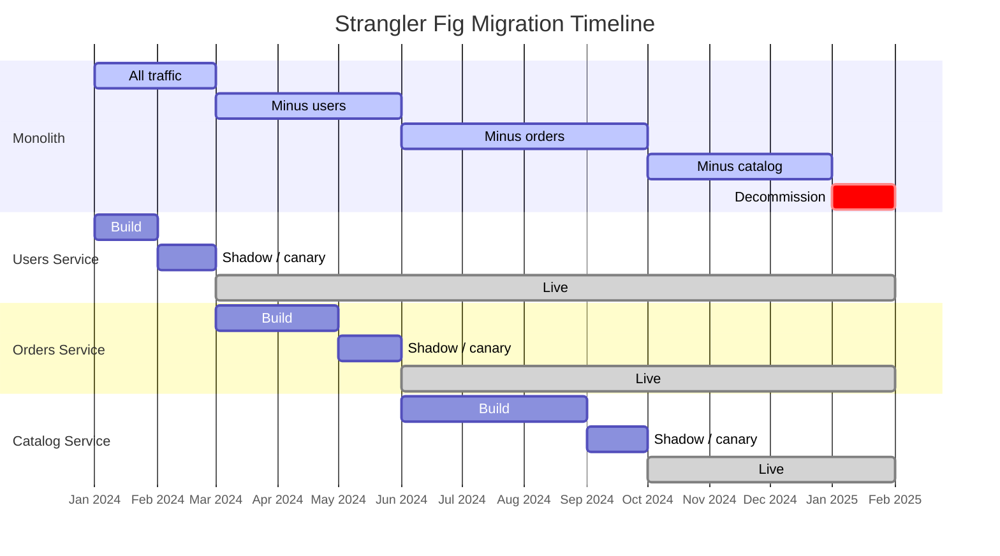

# Strangler Fig

## 1. The Problem (Story)

Your company's core product is a 400,000-line Java monolith called "OmniPlatform." It handles user management, product catalog, ordering, invoicing, shipping, and reporting — all deployed as a single WAR file on Tomcat. It was built in 2012 and has served the company well.

Now, in 2024, the problems are acute:

- **Deployment fear**: Every deploy takes 45 minutes and touches all functionality. A bug in the invoice template format crashed product search last month because they share a database connection pool.
- **Technology lock-in**: The app runs on Java 8. Upgrading to Java 17 requires updating all 400K lines simultaneously. The reporting module would benefit from Python's data libraries. The real-time notification feature would be better as a Node.js WebSocket server. Can't cherry-pick.
- **Team bottleneck**: 6 feature teams all commit to the same repo, step on each other's migrations, and deploy together on Tuesdays.

Management wants to move to microservices. The CTO proposes "The Big Rewrite": freeze all features for 12-18 months, rebuild from scratch.

Two teams tried this before:
- The 2018 rewrite was cancelled after 9 months (50% complete, no business value delivered)
- The 2020 rewrite shipped but was missing 30% of the edge cases the old system handled, causing customer escalations for 6 months

**A complete rewrite is the riskiest migration strategy.** You lose hard-won business logic. You can't deliver new features during the rewrite. And you have to "flip the switch" on launch day with zero gradual rollout.

## 2. The Naïve Solutions

### Attempt 1: "Big bang rewrite"

Build the entire new system in parallel. On launch day, switch DNS from old to new.

```
Day 1-365: Build new system
Day 366: Switch DNS from old.example.com → new.example.com
Day 367: Discover 200 bugs in edge cases that the old system handled silently
```

Problems:
- 12-18 months of feature freeze — competitors advance while you rebuild
- On switch day, 100% of traffic hits untested-at-scale code
- No partial rollback — it's all or nothing
- The old system's undocumented behaviors are only discovered when customers complain they're missing

### Attempt 2: "Refactor in place"

Incrementally refactor the monolith's internal architecture — extract modules, add interfaces, improve the code.

Problems:
- You're still deploying the entire monolith
- Technology choice is still locked to the monolith's stack
- Teams still merge to the same repo
- After 6 months of refactoring, the business sees zero customer-facing improvement
- Refactoring scope creeps — "while we're in there, let's also redesign the data model..."

### Attempt 3: "Parallel run"

Run old and new systems side by side. Send all traffic to both. Compare outputs.

Problems:
- Write operations: which system is the source of truth for mutations?
- Data synchronization: two databases that must stay in sync = distributed data nightmare
- Double infrastructure cost for 100% of the system, not just the migrated parts
- No incremental progress — you're still building the entire replacement before switching

## 3. The Insight

**Instead of replacing the entire system at once, intercept specific routes and redirect them to new services while the old system continues handling everything else.** Over time, more and more routes are redirected until the old system handles nothing and can be decommissioned. Like a strangler fig tree that slowly grows around and eventually replaces its host tree — the new system grows around the old one.

## 4. The Pattern

**Strangler Fig** is an incremental migration strategy:

1. **Identify a seam**: Choose a bounded piece of functionality (e.g., "user authentication")
2. **Build the replacement**: Implement that piece as a new service
3. **Route traffic**: Use a proxy/router to intercept requests for that functionality and send them to the new service
4. **Verify**: Run in shadow mode or canary, comparing old and new
5. **Cut over**: Remove the old code path for that functionality
6. **Repeat**: Pick the next seam

### Key Components
- **Facade/Proxy**: Sits in front of the old system and routes requests to old or new based on rules
- **Seam identification**: Finding natural boundaries to extract (URL paths, domain concepts, data boundaries)
- **Asset capture**: Ensuring the new service covers 100% of the old code's behavior for that seam

### Guarantees
- Incremental delivery: each migrated seam delivers value independently
- Low risk: if the new service fails, route traffic back to the old system instantly
- Continuous operation: the old system keeps running while migration proceeds
- Reversible: any individual step can be rolled back

### Non-Guarantees
- Does not solve data migration (shared databases must be handled separately)
- Does not set a timeline — migration could take months or years
- Does not prevent scope creep (temptation to "also migrate X while we're at it")
- The old system still needs maintenance during migration

## 5. Mental Model

**Building a new house one room at a time while living in the old one.** You don't demolish the old house and live in a tent for a year. Instead, you build a new kitchen (new "orders" service). When it's ready, you cook in the new kitchen and lock the old one. Then you build a new bedroom (new "users" service). Room by room, you move into the new house. Eventually, the old structure is empty and can be demolished.

## 6. Structure

```mermaid
graph TD
    subgraph "Phase 1: Start"
        C1[Client] --> P1[Routing Proxy]
        P1 -->|ALL routes| M1[Monolith<br/>Users + Orders + Catalog + Invoicing]
    end

    subgraph "Phase 2: First Extraction"
        C2[Client] --> P2[Routing Proxy]
        P2 -->|/api/users/*| NS1[New: Users Service]
        P2 -->|everything else| M2[Monolith<br/>Orders + Catalog + Invoicing]
    end

    subgraph "Phase 3: More Extractions"
        C3[Client] --> P3[Routing Proxy]
        P3 -->|/api/users/*| NS2[New: Users Service]
        P3 -->|/api/orders/*| NS3[New: Orders Service]
        P3 -->|remaining| M3[Monolith<br/>Catalog + Invoicing]
    end

    subgraph "Phase 4: Complete"
        C4[Client] --> P4[Routing Proxy]
        P4 -->|/api/users/*| NS4[New: Users Service]
        P4 -->|/api/orders/*| NS5[New: Orders Service]
        P4 -->|/api/catalog/*| NS6[New: Catalog Service]
        P4 -->|/api/invoices/*| NS7[New: Invoice Service]
        M4[Monolith — DECOMMISSIONED] ~~~ P4
    end

    style P1 fill:#e67e22,color:#fff
    style P2 fill:#e67e22,color:#fff
    style P3 fill:#e67e22,color:#fff
    style P4 fill:#e67e22,color:#fff
    style M4 fill:#c0392b,color:#fff
    style NS1 fill:#27ae60,color:#fff
    style NS2 fill:#27ae60,color:#fff
    style NS3 fill:#27ae60,color:#fff
    style NS4 fill:#27ae60,color:#fff
    style NS5 fill:#27ae60,color:#fff
    style NS6 fill:#27ae60,color:#fff
    style NS7 fill:#27ae60,color:#fff
```





## 7. Code Example

### TypeScript — Strangler Fig routing proxy

```typescript
// ─── TYPES ───────────────────────────────────────────

interface RouteRule {
  pathPrefix: string;
  target: 'monolith' | 'new-service';
  serviceUrl: string;
  shadowMode: boolean; // If true, send to BOTH old and new, return old's response
}

interface ProxyRequest {
  method: string;
  path: string;
  body?: string;
  headers: Record<string, string>;
}

interface ProxyResponse {
  status: number;
  body: string;
  source: string;
}

// ─── SIMULATED BACKENDS ─────────────────────────────

class MonolithBackend {
  async handle(req: ProxyRequest): Promise<ProxyResponse> {
    console.log(`  [Monolith] Handling ${req.method} ${req.path}`);

    // Simulate the monolith's accumulated business logic
    if (req.path.startsWith('/api/users')) {
      return { status: 200, body: '{"user":"from-monolith","legacy":true}', source: 'monolith' };
    }
    if (req.path.startsWith('/api/orders')) {
      return { status: 200, body: '{"order":"from-monolith","legacy":true}', source: 'monolith' };
    }
    if (req.path.startsWith('/api/catalog')) {
      return { status: 200, body: '{"catalog":"from-monolith","legacy":true}', source: 'monolith' };
    }
    return { status: 404, body: 'Not found', source: 'monolith' };
  }
}

class NewUserService {
  async handle(req: ProxyRequest): Promise<ProxyResponse> {
    console.log(`  [NewUserService] Handling ${req.method} ${req.path}`);
    return { status: 200, body: '{"user":"from-new-service","legacy":false}', source: 'new-users' };
  }
}

class NewOrderService {
  async handle(req: ProxyRequest): Promise<ProxyResponse> {
    console.log(`  [NewOrderService] Handling ${req.method} ${req.path}`);
    return { status: 200, body: '{"order":"from-new-service","legacy":false}', source: 'new-orders' };
  }
}

// ─── STRANGLER FIG PROXY ────────────────────────────

class StranglerProxy {
  private rules: RouteRule[] = [];
  private monolith: MonolithBackend;
  private services: Map<string, { handle(req: ProxyRequest): Promise<ProxyResponse> }>;
  private comparisonLog: Array<{ path: string; match: boolean; oldBody: string; newBody: string }> = [];

  constructor() {
    this.monolith = new MonolithBackend();
    this.services = new Map();
  }

  registerService(name: string, service: { handle(req: ProxyRequest): Promise<ProxyResponse> }): void {
    this.services.set(name, service);
  }

  addRoute(rule: RouteRule): void {
    this.rules.push(rule);
    this.rules.sort((a, b) => b.pathPrefix.length - a.pathPrefix.length); // Longest prefix first
    const mode = rule.shadowMode ? 'SHADOW' : 'LIVE';
    console.log(`[Proxy] Route added: ${rule.pathPrefix} → ${rule.target} (${mode})`);
  }

  removeRoute(pathPrefix: string): void {
    this.rules = this.rules.filter(r => r.pathPrefix !== pathPrefix);
    console.log(`[Proxy] Route removed: ${pathPrefix}`);
  }

  private findRule(path: string): RouteRule | null {
    return this.rules.find(r => path.startsWith(r.pathPrefix)) ?? null;
  }

  async handle(req: ProxyRequest): Promise<ProxyResponse> {
    const rule = this.findRule(req.path);

    // No rule → everything goes to monolith
    if (!rule) {
      return this.monolith.handle(req);
    }

    // Shadow mode: send to BOTH, return monolith's response, log comparison
    if (rule.shadowMode) {
      const [oldResponse, newResponse] = await Promise.all([
        this.monolith.handle(req),
        this.callNewService(rule, req),
      ]);

      const match = oldResponse.body === newResponse.body;
      this.comparisonLog.push({
        path: req.path,
        match,
        oldBody: oldResponse.body,
        newBody: newResponse.body,
      });

      if (!match) {
        console.log(`  [Shadow] ⚠ MISMATCH on ${req.path}`);
        console.log(`    Old: ${oldResponse.body}`);
        console.log(`    New: ${newResponse.body}`);
      } else {
        console.log(`  [Shadow] ✓ Match on ${req.path}`);
      }

      return oldResponse; // Return the monolith's response (safe)
    }

    // Live mode: route entirely to new service
    return this.callNewService(rule, req);
  }

  private async callNewService(rule: RouteRule, req: ProxyRequest): Promise<ProxyResponse> {
    // In real implementation, this would HTTP forward to rule.serviceUrl
    // Here, we use the registered in-memory services
    const serviceName = rule.serviceUrl;
    const service = this.services.get(serviceName);
    if (!service) {
      console.log(`  [Proxy] ⚠ Service not found: ${serviceName}, falling back to monolith`);
      return this.monolith.handle(req);
    }
    return service.handle(req);
  }

  printMigrationStatus(): void {
    console.log('\n╔═══════════════════════════════╗');
    console.log('║  Migration Status             ║');
    console.log('╠═══════════════════════════════╣');

    const migrated = this.rules.filter(r => !r.shadowMode);
    const shadowed = this.rules.filter(r => r.shadowMode);

    for (const r of migrated) {
      console.log(`║  🟢 ${r.pathPrefix.padEnd(20)} LIVE    ║`);
    }
    for (const r of shadowed) {
      console.log(`║  🟡 ${r.pathPrefix.padEnd(20)} SHADOW  ║`);
    }
    console.log(`║  ⚪ everything else          MONOLITH ║`);
    console.log('╚═══════════════════════════════╝');

    if (this.comparisonLog.length > 0) {
      const matches = this.comparisonLog.filter(c => c.match).length;
      const total = this.comparisonLog.length;
      console.log(`\n  Shadow comparison: ${matches}/${total} matches (${((matches / total) * 100).toFixed(1)}%)`);
    }
  }
}

// ─── SCENARIO: PHASED MIGRATION ─────────────────────

async function demo() {
  const proxy = new StranglerProxy();
  proxy.registerService('users-v2', new NewUserService());
  proxy.registerService('orders-v2', new NewOrderService());

  // ── Phase 1: All traffic to monolith ──

  console.log('\n══════════════════════════════');
  console.log('  PHASE 1: All Monolith');
  console.log('══════════════════════════════');

  await proxy.handle({ method: 'GET', path: '/api/users/42', headers: {} });
  await proxy.handle({ method: 'GET', path: '/api/orders/100', headers: {} });
  await proxy.handle({ method: 'GET', path: '/api/catalog/shoes', headers: {} });

  proxy.printMigrationStatus();

  // ── Phase 2: Shadow mode for users ──

  console.log('\n══════════════════════════════');
  console.log('  PHASE 2: Shadow Users');
  console.log('══════════════════════════════');

  proxy.addRoute({
    pathPrefix: '/api/users',
    target: 'new-service',
    serviceUrl: 'users-v2',
    shadowMode: true, // Compare old vs new, return old
  });

  await proxy.handle({ method: 'GET', path: '/api/users/42', headers: {} });
  await proxy.handle({ method: 'GET', path: '/api/orders/100', headers: {} }); // Still monolith  

  proxy.printMigrationStatus();

  // ── Phase 3: Users go live ──

  console.log('\n══════════════════════════════');
  console.log('  PHASE 3: Users Live');
  console.log('══════════════════════════════');

  proxy.removeRoute('/api/users');
  proxy.addRoute({
    pathPrefix: '/api/users',
    target: 'new-service',
    serviceUrl: 'users-v2',
    shadowMode: false, // Live! New service handles all /api/users traffic
  });

  const resp = await proxy.handle({ method: 'GET', path: '/api/users/42', headers: {} });
  console.log(`  Response source: ${resp.source}`); // "new-users"

  // ── Phase 4: Shadow orders, then go live ──

  console.log('\n══════════════════════════════');
  console.log('  PHASE 4: Orders Migration');
  console.log('══════════════════════════════');

  proxy.addRoute({
    pathPrefix: '/api/orders',
    target: 'new-service',
    serviceUrl: 'orders-v2',
    shadowMode: true,
  });

  await proxy.handle({ method: 'GET', path: '/api/orders/100', headers: {} });

  // After validation, go live
  proxy.removeRoute('/api/orders');
  proxy.addRoute({
    pathPrefix: '/api/orders',
    target: 'new-service',
    serviceUrl: 'orders-v2',
    shadowMode: false,
  });

  proxy.printMigrationStatus();

  // Catalog still on monolith
  await proxy.handle({ method: 'GET', path: '/api/catalog/shoes', headers: {} });
}

demo();
```

### Go — Strangler fig router

```go
package main

import (
	"fmt"
	"strings"
)

type RouteTarget int

const (
	TargetMonolith RouteTarget = iota
	TargetNewService
)

type Route struct {
	PathPrefix string
	Target     RouteTarget
	ServiceURL string
	Shadow     bool
}

type StranglerRouter struct {
	routes []Route
}

func NewRouter() *StranglerRouter {
	return &StranglerRouter{}
}

func (r *StranglerRouter) AddRoute(prefix, serviceURL string, shadow bool) {
	mode := "LIVE"
	if shadow {
		mode = "SHADOW"
	}
	r.routes = append(r.routes, Route{
		PathPrefix: prefix,
		Target:     TargetNewService,
		ServiceURL: serviceURL,
		Shadow:     shadow,
	})
	fmt.Printf("[Router] %s → %s (%s)\n", prefix, serviceURL, mode)
}

func (r *StranglerRouter) Route(path string) string {
	for _, route := range r.routes {
		if strings.HasPrefix(path, route.PathPrefix) {
			if route.Shadow {
				oldResp := callMonolith(path)
				newResp := callService(route.ServiceURL, path)
				if oldResp != newResp {
					fmt.Printf("  [Shadow] ⚠ MISMATCH: old=%q new=%q\n", oldResp, newResp)
				}
				return oldResp // Return old during shadow
			}
			return callService(route.ServiceURL, path)
		}
	}
	return callMonolith(path)
}

func callMonolith(path string) string {
	fmt.Printf("  [Monolith] %s\n", path)
	return fmt.Sprintf("monolith:%s", path)
}

func callService(service, path string) string {
	fmt.Printf("  [%s] %s\n", service, path)
	return fmt.Sprintf("%s:%s", service, path)
}

func (r *StranglerRouter) PrintStatus() {
	fmt.Println("\n── Migration Status ──")
	for _, route := range r.routes {
		mode := "🟢 LIVE"
		if route.Shadow {
			mode = "🟡 SHADOW"
		}
		fmt.Printf("  %s %s → %s\n", mode, route.PathPrefix, route.ServiceURL)
	}
	fmt.Println("  ⚪ everything else → monolith")
}

func main() {
	router := NewRouter()

	// Phase 1: All monolith
	fmt.Println("── Phase 1: Monolith ──")
	router.Route("/api/users/42")
	router.Route("/api/orders/100")

	// Phase 2: Shadow users
	fmt.Println("\n── Phase 2: Shadow Users ──")
	router.AddRoute("/api/users", "users-v2", true)
	router.Route("/api/users/42")

	// Phase 3: Users live
	fmt.Println("\n── Phase 3: Users Live ──")
	router.routes[0].Shadow = false
	router.Route("/api/users/42")
	router.Route("/api/orders/100") // Still monolith
	router.PrintStatus()

	// Phase 4: Orders migration
	fmt.Println("\n── Phase 4: Orders ──")
	router.AddRoute("/api/orders", "orders-v2", true)
	router.Route("/api/orders/100") // Shadow
	router.routes[1].Shadow = false
	router.Route("/api/orders/100") // Live
	router.PrintStatus()
}
```

## 8. Gotchas & Beginner Mistakes

| Mistake | Why It Happens | Fix |
|---------|---------------|-----|
| Extracting too much at once | "Let's migrate users AND orders AND catalog together" | Extract ONE bounded context at a time. Ship it. Stabilize. Then extract the next. |
| Ignoring shared database | Old and new services both read/write the same tables → data coupling defeats the purpose | Use database-per-service with a synchronization layer, or migrate data access incrementally via APIs. |
| No shadow mode validation | Going live before verifying the new service matches the old one's behavior | Shadow mode: send traffic to both, compare responses, fix mismatches before cutting over. |
| Never decommissioning the old code | "The monolith still works, we'll remove it later" → it stays forever | Set a decommission date per seam. Once live for 30 days with no rollbacks, delete the old code. |
| Underestimating undocumented behavior | The monolith does things nobody knows about — validation rules, default values, error handling edge cases | Run shadow mode for weeks. Analyze every mismatch. The old system's behavior IS the specification. |
| Proxy becomes a monolith | Complex routing logic, request transformation, aggregation all in the proxy | Keep the proxy thin: route only. Business logic goes in the services. |

## 9. Related & Confusable Patterns

| Pattern | Relationship | Key Difference |
|---------|-------------|----------------|
| **Blue-Green Deployment** | Complementary | Blue-green swaps the entire application. Strangler fig swaps one piece at a time. |
| **Canary Release** | Complementary | Canary releases a new version to a percentage of users. Strangler fig migrates a functional area, not a version. |
| **Feature Toggles** | Mechanism | Feature toggles can implement the routing logic for strangler fig (toggle between old and new code paths). |
| **API Gateway** | Infrastructure | The strangler fig proxy IS often the API gateway. NGINX, Kong, or Envoy route /path/x to old and /path/y to new. |
| **Branch by Abstraction** | Similar intent, different scope | Branch by abstraction works within a codebase (behind an interface). Strangler fig works at the system level (behind a proxy). |

## 10. When This Pattern Is the WRONG Choice

| Scenario | Why Strangler Fig Hurts | Better Alternative |
|----------|------------------------|-------------------|
| Small codebase (< 20K lines) | The proxy infrastructure costs more than just rewriting the whole thing | Direct rewrite over a few sprints |
| Tightly coupled data model | Every table joins with every other table — no natural seams exist | Refactor the monolith's data model first, then extract |
| No team to maintain the old system | The monolith still needs bug fixes and security patches during migration | Either maintain it or do a faster, focused rewrite |
| The monolith is fine | It's deployed easily, performs well, teams aren't struggling | Don't migrate for the sake of microservices. "If it ain't broke..." |
| Regulatory constraints | Can't run two systems simultaneously for compliance reasons | Big-bang migration with extensive pre-launch testing |

**Symptom you need strangler fig**: You want to decompose a monolith but can't afford the risk of a big-bang rewrite. You need to deliver business features during the migration, not pause for 12 months.

**Back-out strategy**: Each extracted service can be individually rolled back by flipping the proxy rule from "new service" back to "monolith." The monolith is always there as the fallback until you explicitly decommission it. This is the safest migration pattern precisely because every step is reversible.
