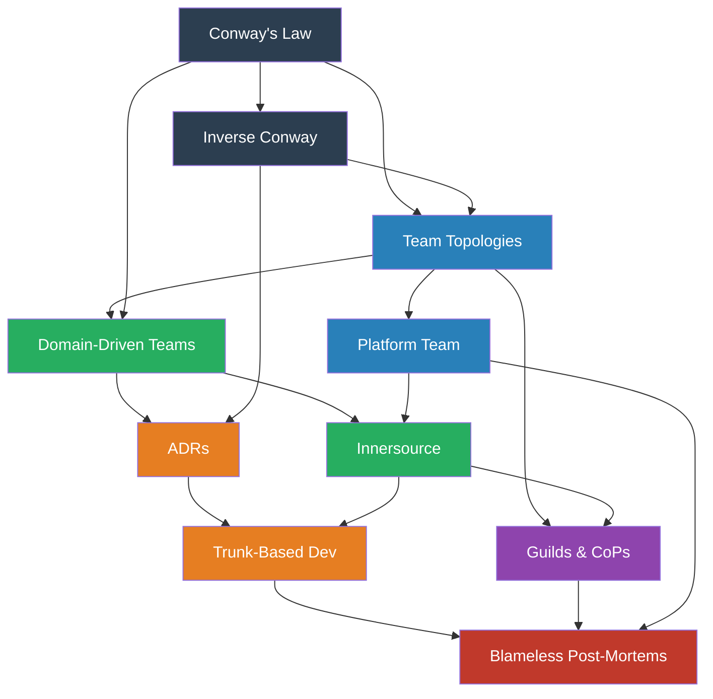

# Module 10 — Organizational Patterns

> How team structure shapes system design — and how to use that deliberately.

## Why This Module Exists

Every other module in this curriculum treats software as a technical problem: data flows, deployment strategies, reliability mechanisms. But the most persistent force shaping your architecture isn't technology — it's **people**. How teams are organized, how they communicate, how decisions get made — these forces determine what systems get built, regardless of what anyone draws on a whiteboard.

This module covers patterns that operate at the intersection of team structure and system design. These aren't "soft skills" — they're engineering patterns with the same structure: a recurring problem, forces in tension, and a proven resolution.

## Patterns in This Module

| # | Pattern | One-Liner |
|---|---------|-----------|
| 1 | [Conway's Law](conways-law.md) | Your system will mirror your org chart whether you plan it or not |
| 2 | [Inverse Conway Maneuver](inverse-conway.md) | Design teams to get the architecture you want |
| 3 | [Team Topologies](team-topologies.md) | Four team types and three interaction modes |
| 4 | [Platform Team](platform-team.md) | Build an internal product so every team doesn't reinvent infrastructure |
| 5 | [Domain-Driven Team Boundaries](domain-driven-teams.md) | Align team ownership to bounded contexts |
| 6 | [Innersource](innersource.md) | Apply open-source collaboration within the company |
| 7 | [Architecture Decision Records](adrs.md) | Document decisions as first-class engineering artifacts |
| 8 | [Trunk-Based Development](trunk-based-development.md) | One branch, continuous integration, small commits |
| 9 | [Guilds and Communities of Practice](guilds-cops.md) | Cross-team knowledge sharing without reporting-line changes |
| 10 | [Blameless Post-Mortems](blameless-post-mortems.md) | Turn failures into organizational learning |

## Dependency Graph

## Reading Order

| Phase | Patterns | Why This Order |
|-------|----------|----------------|
| **Foundations** | Conway's Law → Inverse Conway | Understand the force before learning to harness it |
| **Team Structure** | Team Topologies → Platform Team → Domain-Driven Teams | From framework to specific team shapes |
| **Collaboration** | Innersource → Guilds & CoPs | How teams work across boundaries |
| **Process** | ADRs → Trunk-Based Development | How decisions and code flow |
| **Learning** | Blameless Post-Mortems | How organizations improve from failure |

## Key Tensions

| Tension | Pattern A | Pattern B |
|---------|-----------|-----------|
| Autonomy vs. Alignment | Domain-Driven Teams (maximize autonomy) | Platform Team (standardize shared concerns) |
| Speed vs. Coordination | Trunk-Based Dev (ship fast, small changes) | ADRs (slow down, document choices) |
| Ownership vs. Collaboration | Team Topologies (clear ownership) | Innersource (anyone can contribute) |
| Specialization vs. Generalization | Platform Team (deep infrastructure expertise) | Guilds (spread knowledge broadly) |
| Blame vs. Learning | (Traditional incident response) | Blameless Post-Mortems (systemic analysis) |

## Prerequisites

- Complete Modules 01-09 (these patterns reference architectural, deployment, and reliability patterns)
- Experience working on a team of 3+ engineers
- Exposure to at least one production deployment pipeline
