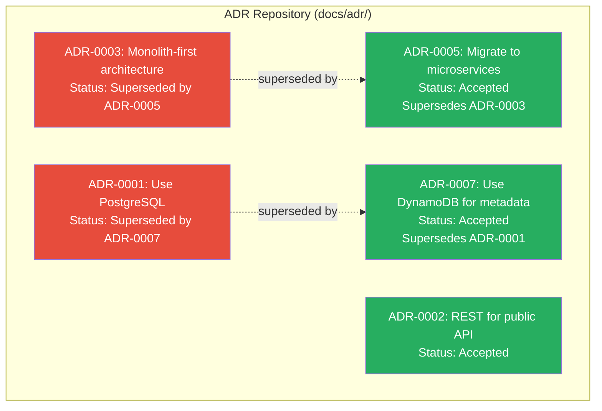
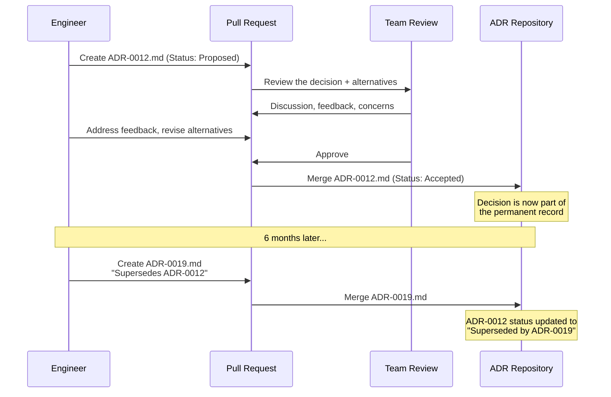

# Architecture Decision Records (ADRs)

## 1. The Problem (Story)

StreamCore is a video streaming startup. Over 3 years, they've grown from 5 to 60 engineers. The architecture has evolved dramatically: PostgreSQL → DynamoDB for metadata, REST → gRPC for internal RPCs, monolith → 14 microservices, Redis → Kafka for event bus.

Each transition made sense at the time. But now:

**New engineer Priya joins the platform team.** She's reading the codebase and finds three different serialization formats: JSON, Protocol Buffers, and MessagePack. She asks her tech lead: "Why do we use MessagePack between the transcoder and the CDN origin? Protobuf everywhere else seems cleaner."

Her tech lead, Marcus, pauses. "I think... there was a performance reason? Chen would know, but he left 8 months ago." They search Slack. Nothing. They check the PR that introduced it — the description says "Switch to MessagePack." No context. No rationale.

**Priya's options:**
1. Accept it and move on → the design decision becomes folklore, passed down by oral tradition
2. Change it to Protobuf → risk breaking something Chen knew about but never documented
3. Investigate independently → spend 2 weeks rediscovering what Chen knew in an afternoon

**More pain surfaces:**
- The team debates switching from Kafka to Pulsar. Nobody remembers why they chose Kafka over Pulsar 2 years ago. Was there a reason? Or was it just familiarity?
- A new service picks gRPC-Web for browser communication. Three months later, someone discovers there's an existing API Gateway that already handles browser-to-gRPC translation. Nobody knew it existed because the decision to build it was never recorded.
- Two teams independently evaluate GraphQL for their respective APIs. They reach opposite conclusions using different evaluation criteria. Neither team knows about the other's analysis.

**Decisions are the most expensive artifacts in engineering — and the easiest to lose.** Code captures WHAT was built. Tests capture HOW it should behave. But NOTHING captures WHY this approach was chosen over alternatives.

## 2. The Naïve Solutions

### Attempt 1: "We'll remember"

Decisions live in people's heads. Senior engineers become oral historians.

Problems:
- People leave (Chen walked out with 2 years of institutional knowledge)
- Memory distorts (6 months later, you remember the decision but not the reasoning)
- Doesn't scale — a 60-person team can't rely on tribal knowledge

### Attempt 2: "Wiki page for architecture"

A Confluence/Notion page titled "Architecture Decisions" with a running list.

Problems:
- No template → some entries are one line ("Use Kafka"), others are 5 pages
- Not versioned — decisions get silently edited without history
- Not discoverable — the page grows to 200 entries with no structure
- No status tracking — are old decisions still valid or superseded?

### Attempt 3: "Include rationale in code comments"

```typescript
// We use MessagePack here because Protobuf was too slow for
// high-throughput transcoder output (see benchmarks... somewhere?)
```

Problems:
- Comments are limited to the code they're near — no cross-service context
- Comments don't capture alternatives considered or rejected
- Comments aren't reviewable artifacts — no PR process, no discussion
- When code moves, comments get lost or become stale

## 3. The Insight

**Treat architectural decisions as first-class engineering artifacts — versioned, reviewed, and stored alongside the code.** Each significant decision gets a lightweight document with a fixed template: the context (why we're deciding), the decision (what we chose), the alternatives (what we rejected and why), and the consequences (what trade-offs we accepted). These documents are Markdown files in the repository, reviewed via PRs, and searchable. They form a decision log — a chronological record of WHY the system looks the way it does.

## 4. The Pattern

**Architecture Decision Records (ADRs)** are short documents that capture significant architectural decisions along with their context, considered alternatives, and consequences.

### Template (MADR format)

```
# ADR-NNNN: Title

## Status
[Proposed | Accepted | Deprecated | Superseded by ADR-XXXX]

## Context
What is the issue that we must address?

## Decision
What did we decide to do?

## Alternatives Considered
What options did we evaluate?

## Consequences
What are the trade-offs of this decision?
```

### Key Properties
- **Immutable once accepted**: ADRs are never modified. If a decision changes, a NEW ADR supersedes the old one.
- **Sequentially numbered**: ADR-0001, ADR-0002, etc. The numbering provides chronology.
- **Stored in the repo**: `docs/adr/` or `adr/` directory, versioned with git.
- **Lightweight**: An ADR is 1-2 pages. Not a design doc — a decision record.
- **Reviewed via PR**: The decision is discussed in the PR, preserved in git history.

### Status Lifecycle
```
Proposed → Accepted
                  → Deprecated (no longer relevant)
                  → Superseded by ADR-XXXX (replaced by newer decision)
```

### Guarantees
- Future engineers (including future-you) can find WHY decisions were made
- Alternative approaches are preserved — so others don't waste time re-evaluating
- Decision status is tracked — you know which decisions are still active
- Decisions are reviewable — the team can discuss before committing

### Non-Guarantees
- ADRs don't prevent bad decisions (they record decisions, they don't validate them)
- Not enforceable at build time (unlike linting rules or type checks)
- Require discipline to write (no one forces you to create an ADR)
- Don't capture implementation details (that's what code and design docs do)

## 5. Mental Model

**A ship's log.** A captain records significant events in the ship's log — storms encountered, course changes, ports visited. If a new captain takes the helm, they read the log to understand why the ship is where it is and heading where it's heading. The log doesn't steer the ship — the captain does. But without the log, a new captain has no idea why the previous captain turned east when the destination is north. ("There was a reef. I turned east to go around it.") ADRs are the engineering team's ship log.

## 6. Structure





## 7. Code Example

### TypeScript — ADR management system

```typescript
// ─── TYPES ───────────────────────────────────────────

type ADRStatus = 'proposed' | 'accepted' | 'deprecated' | 'superseded';

interface ADR {
  number: number;
  title: string;
  status: ADRStatus;
  context: string;
  decision: string;
  alternatives: Alternative[];
  consequences: Consequence[];
  createdDate: Date;
  acceptedDate?: Date;
  supersededBy?: number;
  supersedes?: number;
}

interface Alternative {
  name: string;
  pros: string[];
  cons: string[];
  rejected: boolean;
}

interface Consequence {
  description: string;
  type: 'positive' | 'negative' | 'neutral';
}

// ─── ADR REPOSITORY ─────────────────────────────────

class ADRRepository {
  private adrs: Map<number, ADR> = new Map();
  private nextNumber = 1;

  createADR(
    title: string,
    context: string,
    decision: string,
    alternatives: Alternative[],
    consequences: Consequence[],
  ): ADR {
    const adr: ADR = {
      number: this.nextNumber++,
      title,
      status: 'proposed',
      context,
      decision,
      alternatives,
      consequences,
      createdDate: new Date(),
    };

    this.adrs.set(adr.number, adr);
    console.log(`[ADR-${String(adr.number).padStart(4, '0')}] Created: "${title}" (Proposed)`);
    return adr;
  }

  accept(number: number): void {
    const adr = this.adrs.get(number);
    if (!adr) return;

    adr.status = 'accepted';
    adr.acceptedDate = new Date();
    console.log(`[ADR-${String(number).padStart(4, '0')}] ✅ Accepted: "${adr.title}"`);
  }

  supersede(oldNumber: number, newNumber: number): void {
    const oldAdr = this.adrs.get(oldNumber);
    const newAdr = this.adrs.get(newNumber);
    if (!oldAdr || !newAdr) return;

    oldAdr.status = 'superseded';
    oldAdr.supersededBy = newNumber;
    newAdr.supersedes = oldNumber;

    console.log(`[ADR-${String(oldNumber).padStart(4, '0')}] ⛔ Superseded by ADR-${String(newNumber).padStart(4, '0')}`);
  }

  deprecate(number: number): void {
    const adr = this.adrs.get(number);
    if (!adr) return;

    adr.status = 'deprecated';
    console.log(`[ADR-${String(number).padStart(4, '0')}] 🗑️ Deprecated: "${adr.title}"`);
  }

  // Render an ADR as Markdown (like you'd see in the repo)
  renderMarkdown(number: number): string {
    const adr = this.adrs.get(number);
    if (!adr) return '';

    const num = String(adr.number).padStart(4, '0');
    let md = `# ADR-${num}: ${adr.title}\n\n`;
    md += `## Status\n`;
    md += adr.status === 'superseded'
      ? `Superseded by [ADR-${String(adr.supersededBy).padStart(4, '0')}](adr-${String(adr.supersededBy).padStart(4, '0')}.md)\n\n`
      : `${adr.status.charAt(0).toUpperCase() + adr.status.slice(1)}\n\n`;

    if (adr.supersedes) {
      md += `*Supersedes [ADR-${String(adr.supersedes).padStart(4, '0')}](adr-${String(adr.supersedes).padStart(4, '0')}.md)*\n\n`;
    }

    md += `## Context\n${adr.context}\n\n`;
    md += `## Decision\n${adr.decision}\n\n`;

    md += `## Alternatives Considered\n`;
    for (const alt of adr.alternatives) {
      md += `### ${alt.name} ${alt.rejected ? '(Rejected)' : '(Chosen)'}\n`;
      md += `**Pros:** ${alt.pros.join(', ')}\n`;
      md += `**Cons:** ${alt.cons.join(', ')}\n\n`;
    }

    md += `## Consequences\n`;
    for (const c of adr.consequences) {
      const icon = c.type === 'positive' ? '✅' : c.type === 'negative' ? '⚠️' : '📝';
      md += `- ${icon} ${c.description}\n`;
    }

    return md;
  }

  // Show the decision log
  printDecisionLog(): void {
    console.log('\n╔═══════════════════════════════════════════════╗');
    console.log('║  Architecture Decision Log                    ║');
    console.log('╚═══════════════════════════════════════════════╝');

    const sorted = [...this.adrs.values()].sort((a, b) => a.number - b.number);

    for (const adr of sorted) {
      const num = String(adr.number).padStart(4, '0');
      const statusIcon = {
        proposed: '📋',
        accepted: '✅',
        deprecated: '🗑️',
        superseded: '⛔',
      }[adr.status];

      let extra = '';
      if (adr.supersededBy) extra = ` → see ADR-${String(adr.supersededBy).padStart(4, '0')}`;
      if (adr.supersedes) extra = ` (replaces ADR-${String(adr.supersedes).padStart(4, '0')})`;

      console.log(`  ${statusIcon} ADR-${num}: ${adr.title}${extra}`);
    }

    const active = sorted.filter(a => a.status === 'accepted').length;
    const superseded = sorted.filter(a => a.status === 'superseded').length;
    console.log(`\n  Active: ${active} | Superseded: ${superseded} | Total: ${sorted.length}`);
  }
}

// ─── SCENARIO ────────────────────────────────────────

function demo() {
  const repo = new ADRRepository();

  // Early decisions
  const adr1 = repo.createADR(
    'Use PostgreSQL for all persistent data',
    'We are building an MVP. We need a reliable, well-understood database. Team has PostgreSQL experience.',
    'Use PostgreSQL 14 for all services. Single database, schema-per-service.',
    [
      {
        name: 'PostgreSQL',
        pros: ['Team expertise', 'ACID transactions', 'Rich query language'],
        cons: ['Scaling beyond single node is complex'],
        rejected: false,
      },
      {
        name: 'MongoDB',
        pros: ['Flexible schema', 'Easy horizontal scaling'],
        cons: ['No team expertise', 'Weaker consistency guarantees'],
        rejected: true,
      },
    ],
    [
      { description: 'Team can move fast with familiar technology', type: 'positive' },
      { description: 'May need to migrate if we outgrow single-node PostgreSQL', type: 'negative' },
      { description: 'Schema migrations required for all changes', type: 'neutral' },
    ],
  );
  repo.accept(adr1.number);

  const adr2 = repo.createADR(
    'REST for public-facing API',
    'We need a stable API for third-party integrations. Must be simple to consume.',
    'Use REST with JSON over HTTPS. OpenAPI spec for documentation.',
    [
      {
        name: 'REST',
        pros: ['Universal client support', 'Simple', 'Cacheable'],
        cons: ['Over-fetching', 'Multiple round-trips'],
        rejected: false,
      },
      {
        name: 'GraphQL',
        pros: ['Flexible queries', 'Single endpoint'],
        cons: ['Complex for simple integrations', 'Caching challenges'],
        rejected: true,
      },
    ],
    [
      { description: 'Easy integration for partners', type: 'positive' },
      { description: 'May need BFF layer for mobile to avoid over-fetching', type: 'negative' },
    ],
  );
  repo.accept(adr2.number);

  // 1 year later: PostgreSQL can't scale for metadata
  const adr3 = repo.createADR(
    'Use DynamoDB for video metadata',
    'Video metadata queries reached 50K reads/sec. PostgreSQL cannot handle this load. Read replicas helped temporarily but we\'re hitting limits.',
    'Migrate video metadata to DynamoDB. PostgreSQL remains for user data and billing.',
    [
      {
        name: 'DynamoDB',
        pros: ['Virtually unlimited read throughput', 'Managed service', 'Pay-per-query'],
        cons: ['Limited query flexibility', 'New operational knowledge needed'],
        rejected: false,
      },
      {
        name: 'PostgreSQL with Citus',
        pros: ['Same query language', 'Horizontal sharding'],
        cons: ['Operational complexity', 'Still requires capacity planning'],
        rejected: true,
      },
    ],
    [
      { description: 'Metadata reads scale independently', type: 'positive' },
      { description: 'Team must learn DynamoDB access patterns', type: 'negative' },
      { description: 'Two databases to operate instead of one', type: 'negative' },
    ],
  );
  repo.accept(adr3.number);
  repo.supersede(adr1.number, adr3.number);

  // Print the decision log
  repo.printDecisionLog();

  // Print one ADR as markdown
  console.log('\n─── Example ADR ───');
  console.log(repo.renderMarkdown(adr3.number));
}

demo();
```

### Go — ADR file generator

```go
package main

import (
	"fmt"
	"strings"
)

type Status string

const (
	Proposed   Status = "Proposed"
	Accepted   Status = "Accepted"
	Deprecated Status = "Deprecated"
	Superseded Status = "Superseded"
)

type ADR struct {
	Number       int
	Title        string
	Status       Status
	Context      string
	Decision     string
	Alternatives []string
	Consequences []string
	SupersededBy int
}

type DecisionLog struct {
	adrs    []*ADR
	counter int
}

func NewDecisionLog() *DecisionLog {
	return &DecisionLog{}
}

func (dl *DecisionLog) Add(title, context, decision string, alts, cons []string) *ADR {
	dl.counter++
	adr := &ADR{
		Number:       dl.counter,
		Title:        title,
		Status:       Proposed,
		Context:      context,
		Decision:     decision,
		Alternatives: alts,
		Consequences: cons,
	}
	dl.adrs = append(dl.adrs, adr)
	return adr
}

func (dl *DecisionLog) Accept(number int) {
	for _, a := range dl.adrs {
		if a.Number == number {
			a.Status = Accepted
		}
	}
}

func (dl *DecisionLog) Supersede(old, new int) {
	for _, a := range dl.adrs {
		if a.Number == old {
			a.Status = Superseded
			a.SupersededBy = new
		}
	}
}

func (dl *DecisionLog) Render(number int) string {
	var adr *ADR
	for _, a := range dl.adrs {
		if a.Number == number {
			adr = a
			break
		}
	}
	if adr == nil {
		return ""
	}

	var b strings.Builder
	fmt.Fprintf(&b, "# ADR-%04d: %s\n\n", adr.Number, adr.Title)
	fmt.Fprintf(&b, "## Status\n%s\n\n", adr.Status)
	fmt.Fprintf(&b, "## Context\n%s\n\n", adr.Context)
	fmt.Fprintf(&b, "## Decision\n%s\n\n", adr.Decision)

	b.WriteString("## Alternatives Considered\n")
	for _, alt := range adr.Alternatives {
		fmt.Fprintf(&b, "- %s\n", alt)
	}

	b.WriteString("\n## Consequences\n")
	for _, c := range adr.Consequences {
		fmt.Fprintf(&b, "- %s\n", c)
	}
	return b.String()
}

func (dl *DecisionLog) PrintLog() {
	fmt.Println("\n── Decision Log ──")
	for _, a := range dl.adrs {
		icon := map[Status]string{
			Proposed: "📋", Accepted: "✅",
			Deprecated: "🗑️", Superseded: "⛔",
		}[a.Status]
		extra := ""
		if a.SupersededBy > 0 {
			extra = fmt.Sprintf(" → ADR-%04d", a.SupersededBy)
		}
		fmt.Printf("  %s ADR-%04d: %s%s\n", icon, a.Number, a.Title, extra)
	}
}

func main() {
	log := NewDecisionLog()

	a1 := log.Add("Use PostgreSQL",
		"Need reliable DB, team knows PostgreSQL",
		"PostgreSQL 14 for all services",
		[]string{"PostgreSQL (chosen)", "MongoDB (rejected: no expertise)"},
		[]string{"Fast start with familiar tech", "May need migration at scale"})
	log.Accept(a1.Number)

	a2 := log.Add("Switch metadata to DynamoDB",
		"50K reads/sec exceeds PostgreSQL capacity",
		"Migrate video metadata to DynamoDB",
		[]string{"DynamoDB (chosen)", "Citus (rejected: operational complexity)"},
		[]string{"Unlimited read scaling", "Two databases to operate"})
	log.Accept(a2.Number)
	log.Supersede(a1.Number, a2.Number)

	log.PrintLog()
	fmt.Println(log.Render(a2.Number))
}
```

## 8. Gotchas & Beginner Mistakes

| Mistake | Why It Happens | Fix |
|---------|---------------|-----|
| ADRs are too long | Engineer writes a 10-page design doc and calls it an ADR | ADRs are 1-2 pages. Context + Decision + Alternatives + Consequences. That's it. Keep design docs separate. |
| Editing accepted ADRs | "The decision changed, I'll update the old ADR" | NEVER edit accepted ADRs. Create a new ADR that supersedes the old one. The old ADR is historical record. |
| Recording every decision | "ADR-0047: Use camelCase for variable names" | ADRs are for ARCHITECTURALLY SIGNIFICANT decisions. If it would matter to a new team member joining in 6 months, write an ADR. |
| No alternatives section | "We're using Kafka." OK, but WHY not Pulsar? Why not RabbitMQ? | The alternatives section is the most valuable part. It prevents re-evaluation of options you already rejected. |
| ADRs stored in a wiki | "We put ADRs in Confluence" | ADRs belong in the repository. Version-controlled, reviewed via PRs, co-located with the code they govern. |
| No numbering | Files named `use-postgres.md`, `switch-to-kafka.md` — no chronology | Sequential numbering (`0001-use-postgres.md`) shows the order decisions were made, which creates a narrative. |

## 9. Related & Confusable Patterns

| Pattern | Relationship | Key Difference |
|---------|-------------|----------------|
| **Design Documents** | Complementary but different | Design docs describe HOW to build something. ADRs record WHY one approach was chosen over others. |
| **RFCs** | ADR is lighter-weight | RFCs propose changes for discussion. ADRs record the outcome. An RFC process may produce an ADR. |
| **Blameless Post-Mortems** | Both create institutional memory | Post-mortems capture WHY things broke. ADRs capture WHY things were built a certain way. |
| **Trunk-Based Development** | ADRs reviewed via PRs | ADRs live in the repo and follow the same PR review process as code. |
| **Conway's Law** | ADRs often span team boundaries | Cross-team architectural decisions (API contracts, shared data) especially benefit from ADRs. |

## 10. When This Pattern Is the WRONG Choice

| Scenario | Why ADRs Hurt | Better Alternative |
|----------|--------------|-------------------|
| Very early startup (2-3 people) | You can just talk. Writing ADRs for 3 people is overhead. | Verbal alignment + quick Slack summaries |
| Decisions within a single function | "ADR-0037: Use a hash map instead of array for lookups" — too granular | Code comments or PR descriptions |
| Highly regulated environments needing formal design review | ADRs are too lightweight for compliance audits | Formal design review process with approval matrices |
| Team doesn't read docs | Writing ADRs nobody reads is waste | Fix the culture first. Start with ADR onboarding ("read ADR-0001 through ADR-0005 your first week") |

**Symptom you need ADRs**: New engineers ask "why did we choose X?" and nobody knows. Teams re-evaluate decisions that were already made. Architectural changes are made without understanding the original constraints.

**Back-out strategy**: Start by recording your NEXT architectural decision as an ADR. Put it in `docs/adr/0001-*.md`. Link to it in your PR. After 3 months, count how many times someone referenced an ADR. If the count is > 0, it's working. If nobody ever references them, you're either writing about the wrong things or the team needs more onboarding about ADRs.
