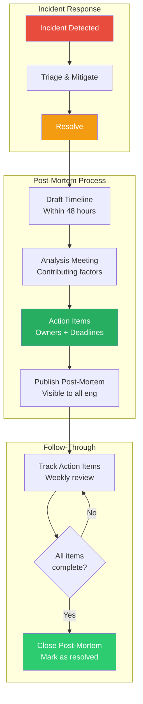
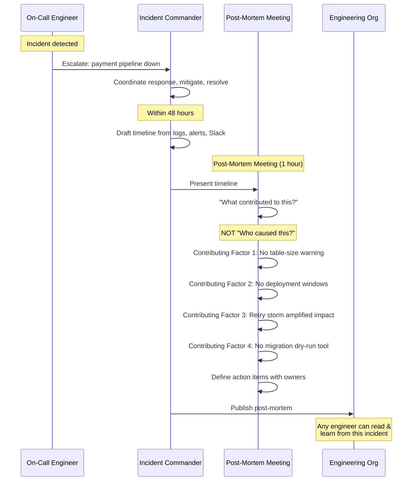

# Blameless Post-Mortems

## 1. The Problem (Story)

CloudServe is a B2B SaaS platform processing $2.3M in daily transactions for 800 enterprise clients. On a Tuesday at 2:47 PM, the payment pipeline stops processing. Orders queue up. By 3:15 PM, 1,200 orders are stuck. The on-call engineer, Raj, escalates. By 3:52 PM, the CEO is on a bridge call.

**The root cause:** A database migration ran during peak hours. It added an index to the `transactions` table — 47 million rows. The migration locked the table for 23 minutes. During the lock, all writes to `transactions` timed out. The payment service's retry logic caused a cascading failure in the queue processor.

**The migration was deployed by Maria**, a senior engineer who'd run similar migrations dozens of times. She didn't know the table had grown from 8 million to 47 million rows since her last migration. The migration tool didn't warn about table size. There was no production deployment window policy.

**The aftermath (how most companies handle it):**

**Meeting room, Thursday. The "Post-Mortem."**
- CTO: "How did this happen? Who approved this migration?"
- Engineering Manager: "Maria ran the migration without approval."
- Maria: "I didn't know I needed approval. We've never had an approval process for migrations."
- CTO: "Well, NOW we need one. From now on, all migrations need VP approval."
- The room goes quiet. Maria feels terrible. She updates her LinkedIn that evening.

**What actually changed after this meeting?**
- A new approval process that slows down ALL migrations (even safe ones) by 3 days
- Maria is "counseled" — she won't volunteer for risky work again
- Other engineers learn the real lesson: **don't be the one holding the keyboard when things break**

Six months later, a nearly identical incident occurs. Different engineer, different table, same problem. The VP-approval process didn't prevent it because the VP doesn't know which migrations are dangerous either. The REAL causes — no table-size warnings, no deployment windows, no lock-duration estimation — were never addressed because the post-mortem focused on WHO instead of WHAT.

## 2. The Naïve Solutions

### Attempt 1: "Find who's responsible and fix the person"

The investigation focuses on Maria. "She should have checked the table size. She should have run it during off-hours. She should have known better."

Problems:
- Maria is a scapegoat. The system allowed her to make this mistake. If she hadn't done it, someone else would have.
- Blame creates fear. Engineers stop taking initiative. "I won't run migrations. I won't deploy. I won't touch anything risky."
- The real causes (no tooling, no process, no guardrails) go unfixed because "we fixed the Maria problem."

### Attempt 2: "Add more approval gates"

Require VP approval for all database operations, deployments, and infrastructure changes.

Problems:
- Approval gates slow everything down — every migration takes 3 days instead of 30 minutes
- The VP becomes a bottleneck and rubber-stamps approvals because they can't evaluate every migration
- Approval processes create an illusion of safety without actually improving safety
- Engineers route around the process: "It's not a migration, it's a schema update" (same thing, different name)

### Attempt 3: "Just document what happened and move on"

Write a timeline, file it in Confluence, never read it again.

Problems:
- No analysis of contributing factors → same patterns recur
- No action items → nothing changes
- No follow-up → the document is forgotten within a week
- Lessons don't spread to other teams → the NEXT team makes the same mistake

## 3. The Insight

**Investigate incidents the way aviation investigates crashes — focus on SYSTEMS, not individuals.** When a plane crashes, investigators don't blame the pilot and move on. They examine every contributing factor: cockpit design, maintenance schedules, air traffic control communication, training programs, fatigue policies. They ask: "What SYSTEM allowed this accident to happen, and how do we change the system so it can't happen again?" The goal isn't to find the guilty party — it's to find the systemic weaknesses and fix them. This produces LEARNING, not punishment.

## 4. The Pattern

**Blameless Post-Mortems** are structured incident analysis meetings where the focus is on WHAT happened and WHY, never on WHO did it wrong.

### Core Principles
1. **Assume good intentions**: The person who caused the incident was doing their best with the information and tools they had.
2. **Focus on systems, not individuals**: "The migration tool didn't warn about table size" — not "Maria didn't check the table size."
3. **Multiple contributing factors**: Incidents are never caused by one mistake. They're caused by chains of contributing factors.
4. **Measurable action items**: Every post-mortem produces action items with owners and deadlines. Action items change SYSTEMS, not behavior.
5. **Published and shared**: Post-mortems are available to the entire engineering organization. Learning is organizational, not individual.

### Post-Mortem Document Template
```
# Incident: [Title]
## Summary
## Impact (duration, users affected, revenue lost)
## Timeline (minute-by-minute)
## Contributing Factors (NOT "root cause")
## What Went Well
## What Went Wrong
## Action Items (with owner + deadline)
## Lessons Learned
```

### Key Properties
- **No "root cause"**: Use "contributing factors" because incidents always have multiple causes. "Root cause" implies there's ONE thing to fix.
- **No blame**: The document never names individuals negatively. Actions are described, not judged.
- **Action items have owners**: "Improve monitoring" is not an action item. "Add table-size alert (owner: Platform team, deadline: March 15)" is.
- **Severity-based trigger**: Not every bug gets a post-mortem. Define thresholds (e.g., P1/P2 incidents, > 30 min downtime, data loss).

### Guarantees
- Incidents produce systemic improvements, not scapegoats
- Engineers feel safe reporting mistakes and near-misses
- Institutional memory: the post-mortem archive is a learning library
- The same class of incident doesn't repeat (because the system changed)

### Non-Guarantees
- Does not prevent all incidents (complex systems always fail)
- Requires follow-through on action items (post-mortems without action are theater)
- Requires psychological safety (blameless culture can't be declared, it must be demonstrated)
- Takes time (a good post-mortem takes 2-4 hours of preparation, 1 hour of meeting)

## 5. Mental Model

**An airplane black box investigation.** When a plane crashes, the NTSB doesn't fire the pilot (they're often dead, but even if they survive, the investigation isn't about blame). They recover the black box, reconstruct the timeline, identify EVERY contributing factor — the weather, the maintenance schedule, the cockpit indicator design, the co-pilot's training, the airline's fatigue policy. They publish a report with recommendations that change the ENTIRE INDUSTRY. The goal is: this type of crash never happens again. That's why commercial aviation is the safest form of transportation despite being the most complex.

## 6. Structure





## 7. Code Example

### TypeScript — Post-mortem management system

```typescript
// ─── TYPES ───────────────────────────────────────────

type Severity = 'P1' | 'P2' | 'P3' | 'P4';

interface Incident {
  id: string;
  title: string;
  severity: Severity;
  detectedAt: Date;
  resolvedAt: Date;
  impactMinutes: number;
  usersAffected: number;
  revenueLost: number;
}

interface TimelineEntry {
  timestamp: Date;
  description: string;
  actor: string;     // Role/system, NOT individual name
}

interface ContributingFactor {
  description: string;
  category: 'tooling' | 'process' | 'monitoring' | 'testing' | 'communication' | 'design';
  systemic: boolean; // Is this a one-off or a pattern?
}

interface ActionItem {
  id: number;
  description: string;
  owner: string;        // Team, not individual
  deadline: Date;
  status: 'open' | 'in-progress' | 'completed' | 'wont-fix';
  priority: 'critical' | 'high' | 'medium';
}

interface PostMortem {
  incident: Incident;
  timeline: TimelineEntry[];
  contributingFactors: ContributingFactor[];
  whatWentWell: string[];
  whatWentWrong: string[];
  actionItems: ActionItem[];
  lessonsLearned: string[];
  publishedAt?: Date;
  actionItemsComplete: boolean;
}

// ─── POST-MORTEM ENGINE ─────────────────────────────

class PostMortemSystem {
  private postMortems: Map<string, PostMortem> = new Map();
  private actionCounter = 0;

  createPostMortem(incident: Incident): PostMortem {
    const pm: PostMortem = {
      incident,
      timeline: [],
      contributingFactors: [],
      whatWentWell: [],
      whatWentWrong: [],
      actionItems: [],
      lessonsLearned: [],
      actionItemsComplete: false,
    };

    this.postMortems.set(incident.id, pm);
    console.log(`[Post-Mortem] Created for incident ${incident.id}: "${incident.title}"`);
    console.log(`  Severity: ${incident.severity} | Impact: ${incident.impactMinutes}min | Users: ${incident.usersAffected}`);
    return pm;
  }

  addTimeline(incidentId: string, entries: Array<{ time: Date; desc: string; actor: string }>): void {
    const pm = this.postMortems.get(incidentId);
    if (!pm) return;

    for (const e of entries) {
      pm.timeline.push({ timestamp: e.time, description: e.desc, actor: e.actor });
    }

    console.log(`\n[Timeline] ${entries.length} entries added to ${incidentId}`);
    for (const e of pm.timeline) {
      const time = e.timestamp.toISOString().slice(11, 19);
      console.log(`  ${time}  [${e.actor}] ${e.description}`);
    }
  }

  addContributingFactors(incidentId: string, factors: ContributingFactor[]): void {
    const pm = this.postMortems.get(incidentId);
    if (!pm) return;

    pm.contributingFactors.push(...factors);

    // Emphasize: these are NOT blame — they are system weaknesses
    console.log(`\n[Contributing Factors] — NOT "root cause", NOT individual blame`);
    for (const f of factors) {
      const systemic = f.systemic ? '🔄 SYSTEMIC' : '📌 one-off';
      console.log(`  [${f.category}] ${f.description} (${systemic})`);
    }
  }

  addWhatWentWell(incidentId: string, items: string[]): void {
    const pm = this.postMortems.get(incidentId);
    if (!pm) return;
    pm.whatWentWell.push(...items);

    console.log('\n[What Went Well]');
    for (const item of items) console.log(`  ✅ ${item}`);
  }

  addWhatWentWrong(incidentId: string, items: string[]): void {
    const pm = this.postMortems.get(incidentId);
    if (!pm) return;
    pm.whatWentWrong.push(...items);

    console.log('\n[What Went Wrong]');
    for (const item of items) console.log(`  ❌ ${item}`);
  }

  addActionItem(
    incidentId: string,
    description: string,
    owner: string,
    deadline: Date,
    priority: ActionItem['priority'],
  ): ActionItem {
    const pm = this.postMortems.get(incidentId);
    if (!pm) throw new Error(`Post-mortem ${incidentId} not found`);

    const item: ActionItem = {
      id: ++this.actionCounter,
      description,
      owner,
      deadline,
      status: 'open',
      priority,
    };

    pm.actionItems.push(item);
    const deadlineStr = deadline.toISOString().slice(0, 10);
    console.log(`  [AI-${item.id}] ${description}`);
    console.log(`         Owner: ${owner} | Deadline: ${deadlineStr} | Priority: ${priority}`);
    return item;
  }

  completeActionItem(incidentId: string, actionId: number): void {
    const pm = this.postMortems.get(incidentId);
    if (!pm) return;

    const item = pm.actionItems.find(a => a.id === actionId);
    if (item) {
      item.status = 'completed';
      console.log(`  [AI-${actionId}] ✅ Completed: ${item.description}`);
    }

    // Check if all items are complete
    if (pm.actionItems.every(a => a.status === 'completed' || a.status === 'wont-fix')) {
      pm.actionItemsComplete = true;
      console.log(`\n[Post-Mortem ${incidentId}] 🎉 ALL action items complete — post-mortem closed`);
    }
  }

  publish(incidentId: string, lessons: string[]): void {
    const pm = this.postMortems.get(incidentId);
    if (!pm) return;

    pm.lessonsLearned = lessons;
    pm.publishedAt = new Date();

    console.log(`\n[Published] Post-mortem ${incidentId} is now visible to all engineering`);
    console.log('\n[Lessons Learned]');
    for (const l of lessons) console.log(`  📚 ${l}`);
  }

  // Dashboard: are we learning from incidents?
  printDashboard(): void {
    console.log('\n╔═══════════════════════════════════════════════╗');
    console.log('║  Post-Mortem Dashboard                        ║');
    console.log('╚═══════════════════════════════════════════════╝');

    const all = [...this.postMortems.values()];
    const published = all.filter(pm => pm.publishedAt);
    const closed = all.filter(pm => pm.actionItemsComplete);
    const openActions = all.flatMap(pm => pm.actionItems.filter(a => a.status === 'open'));
    const overdue = openActions.filter(a => a.deadline < new Date());

    console.log(`\n  Total incidents analyzed: ${all.length}`);
    console.log(`  Published post-mortems: ${published.length}`);
    console.log(`  Fully closed (all actions done): ${closed.length}`);
    console.log(`  Open action items: ${openActions.length}`);
    console.log(`  ⚠️  Overdue action items: ${overdue.length}`);

    // Contributing factor categories
    const categories = new Map<string, number>();
    for (const pm of all) {
      for (const f of pm.contributingFactors) {
        categories.set(f.category, (categories.get(f.category) || 0) + 1);
      }
    }

    console.log('\n  Contributing factor categories:');
    const sorted = [...categories.entries()].sort((a, b) => b[1] - a[1]);
    for (const [cat, count] of sorted) {
      const bar = '█'.repeat(count * 3);
      console.log(`    ${cat.padEnd(15)} ${bar} (${count})`);
    }

    // Systemic vs one-off
    const systemic = all.flatMap(pm => pm.contributingFactors).filter(f => f.systemic).length;
    const total = all.flatMap(pm => pm.contributingFactors).length;
    console.log(`\n  Systemic factors: ${systemic}/${total} (${Math.round(systemic / Math.max(total, 1) * 100)}%)`);
    if (systemic / Math.max(total, 1) > 0.5) {
      console.log(`  ⚠️  High systemic factor rate — invest in tooling and process improvements`);
    }
  }
}

// ─── SCENARIO ────────────────────────────────────────

function demo() {
  const system = new PostMortemSystem();

  // The incident
  const incident: Incident = {
    id: 'INC-2024-042',
    title: 'Payment pipeline outage — database migration locked transactions table',
    severity: 'P1',
    detectedAt: new Date('2024-03-12T14:47:00'),
    resolvedAt: new Date('2024-03-12T15:52:00'),
    impactMinutes: 65,
    usersAffected: 347,
    revenueLost: 89000,
  };

  const pm = system.createPostMortem(incident);

  // Timeline
  system.addTimeline('INC-2024-042', [
    { time: new Date('2024-03-12T14:30:00'), desc: 'Database migration initiated via deploy pipeline', actor: 'CI/CD system' },
    { time: new Date('2024-03-12T14:32:00'), desc: 'ALTER TABLE transactions ADD INDEX — table lock acquired', actor: 'PostgreSQL' },
    { time: new Date('2024-03-12T14:47:00'), desc: 'Payment service timeout alerts fire', actor: 'Monitoring' },
    { time: new Date('2024-03-12T14:52:00'), desc: 'On-call engineer begins investigation', actor: 'On-call' },
    { time: new Date('2024-03-12T15:05:00'), desc: 'Root cause identified: table lock from migration', actor: 'On-call' },
    { time: new Date('2024-03-12T15:10:00'), desc: 'Decision: wait for migration to complete (estimated 12 min remaining)', actor: 'Incident Commander' },
    { time: new Date('2024-03-12T15:22:00'), desc: 'Migration completes, lock released', actor: 'PostgreSQL' },
    { time: new Date('2024-03-12T15:25:00'), desc: 'Payment service recovers, but queue backlog', actor: 'Payment service' },
    { time: new Date('2024-03-12T15:52:00'), desc: 'Queue fully drained, all systems nominal', actor: 'Queue processor' },
  ]);

  // Contributing factors — NOT blame
  system.addContributingFactors('INC-2024-042', [
    {
      description: 'Migration tool does not estimate lock duration or warn about table size',
      category: 'tooling',
      systemic: true,
    },
    {
      description: 'No deployment windows — migrations can run during peak hours',
      category: 'process',
      systemic: true,
    },
    {
      description: 'Payment service retry logic creates cascading queue backlog during timeouts',
      category: 'design',
      systemic: true,
    },
    {
      description: 'No alert for long-running database locks',
      category: 'monitoring',
      systemic: true,
    },
    {
      description: 'Table grew from 8M to 47M rows — no growth tracking or capacity alerts',
      category: 'monitoring',
      systemic: true,
    },
  ]);

  // What went well
  system.addWhatWentWell('INC-2024-042', [
    'Alert fired within 15 minutes of impact starting',
    'On-call engineer identified the cause within 13 minutes',
    'Incident commander made a clear decision (wait vs kill migration)',
    'Communication in #incident channel was timely and structured',
    'No data loss — all queued orders were eventually processed',
  ]);

  // What went wrong
  system.addWhatWentWrong('INC-2024-042', [
    '65 minutes of payment processing downtime',
    'Migration ran during peak hours without guardrails',
    'No pre-flight check on table size before acquiring lock',
    'Retry storms amplified the impact beyond the locked table',
    'No runbook for "database lock blocking writes" scenario',
  ]);

  // Action items — specific, owned, deadlined
  console.log('\n[Action Items]');
  const ai1 = system.addActionItem('INC-2024-042',
    'Add table-size estimation to migration tool — warn if > 10M rows, block if > 50M rows',
    'Platform Team', new Date('2024-03-26'), 'critical');

  const ai2 = system.addActionItem('INC-2024-042',
    'Define deployment windows: no migrations between 9 AM - 6 PM on weekdays',
    'Platform Team', new Date('2024-03-19'), 'critical');

  const ai3 = system.addActionItem('INC-2024-042',
    'Add circuit breaker to payment service retry logic (max 3 retries, then fail-open to DLQ)',
    'Payments Team', new Date('2024-04-02'), 'high');

  const ai4 = system.addActionItem('INC-2024-042',
    'Create alert for database locks exceeding 60 seconds',
    'Platform Team', new Date('2024-03-22'), 'high');

  const ai5 = system.addActionItem('INC-2024-042',
    'Create runbook: "Database lock blocking writes" with kill-query procedure',
    'Platform Team', new Date('2024-03-29'), 'medium');

  // Publish
  system.publish('INC-2024-042', [
    'Large-table migrations need pre-flight checks — don\'t assume table size is static',
    'Deployment windows exist for a reason — peak-hour migrations are gambling',
    'Retry logic without circuit breakers turns a 1-service problem into an N-service outage',
    'The person who runs the migration is NOT the problem — the system that allowed it during peak hours IS the problem',
  ]);

  // Simulate action item completion
  console.log('\n═══ Follow-Through (next 3 weeks) ═══');
  system.completeActionItem('INC-2024-042', ai2.id);
  system.completeActionItem('INC-2024-042', ai4.id);
  system.completeActionItem('INC-2024-042', ai1.id);
  system.completeActionItem('INC-2024-042', ai5.id);
  system.completeActionItem('INC-2024-042', ai3.id);

  // Dashboard
  system.printDashboard();
}

demo();
```

### Go — Post-mortem action tracker

```go
package main

import (
	"fmt"
	"time"
)

type ActionItem struct {
	ID          int
	Description string
	Owner       string
	Deadline    time.Time
	Done        bool
}

type PostMortem struct {
	IncidentID   string
	Title        string
	Severity     string
	Factors      []string
	Actions      []ActionItem
}

type Tracker struct {
	postMortems []*PostMortem
	aiCounter   int
}

func NewTracker() *Tracker {
	return &Tracker{}
}

func (t *Tracker) Create(id, title, severity string) *PostMortem {
	pm := &PostMortem{
		IncidentID: id,
		Title:      title,
		Severity:   severity,
	}
	t.postMortems = append(t.postMortems, pm)
	fmt.Printf("[PM] %s: %s (%s)\n", id, title, severity)
	return pm
}

func (t *Tracker) AddFactor(pm *PostMortem, factor string) {
	pm.Factors = append(pm.Factors, factor)
	fmt.Printf("  [Factor] %s\n", factor)
}

func (t *Tracker) AddAction(pm *PostMortem, desc, owner string, deadline time.Time) int {
	t.aiCounter++
	pm.Actions = append(pm.Actions, ActionItem{
		ID:          t.aiCounter,
		Description: desc,
		Owner:       owner,
		Deadline:    deadline,
	})
	fmt.Printf("  [AI-%d] %s (owner: %s)\n", t.aiCounter, desc, owner)
	return t.aiCounter
}

func (t *Tracker) Complete(pm *PostMortem, aiID int) {
	for i := range pm.Actions {
		if pm.Actions[i].ID == aiID {
			pm.Actions[i].Done = true
			fmt.Printf("  [AI-%d] ✅ Done: %s\n", aiID, pm.Actions[i].Description)
		}
	}
}

func (t *Tracker) Report() {
	fmt.Println("\n── Post-Mortem Report ──")
	for _, pm := range t.postMortems {
		done := 0
		for _, a := range pm.Actions {
			if a.Done {
				done++
			}
		}
		status := "🔴 OPEN"
		if done == len(pm.Actions) {
			status = "🟢 CLOSED"
		}
		fmt.Printf("  %s %s: %s (%d/%d actions done)\n",
			status, pm.IncidentID, pm.Title, done, len(pm.Actions))
		fmt.Printf("    Contributing factors: %d\n", len(pm.Factors))
	}
}

func main() {
	t := NewTracker()

	pm := t.Create("INC-042", "Payment pipeline outage", "P1")

	t.AddFactor(pm, "Migration tool has no table-size warning")
	t.AddFactor(pm, "No deployment windows defined")
	t.AddFactor(pm, "Retry storms amplify failures")

	deadline := time.Now().Add(14 * 24 * time.Hour)
	ai1 := t.AddAction(pm, "Add table-size check to migration tool", "Platform", deadline)
	ai2 := t.AddAction(pm, "Define deployment windows", "Platform", deadline)
	ai3 := t.AddAction(pm, "Add circuit breaker to payment retries", "Payments", deadline)

	fmt.Println("\n── Completing Actions ──")
	t.Complete(pm, ai1)
	t.Complete(pm, ai2)
	t.Complete(pm, ai3)

	t.Report()
}
```

## 8. Gotchas & Beginner Mistakes

| Mistake | Why It Happens | Fix |
|---------|---------------|-----|
| Blame sneaks in | "The migration was run by..." — naming individuals in a negative context | Describe actions by role: "A migration was executed via the deploy pipeline." Never "Person X did Y." |
| "Root cause" tunnel vision | Searching for THE ONE root cause → missing systemic issues | Use "contributing factors." Incidents always have multiple causes. List them all. |
| Action items with no owner | "We should improve monitoring" — who? by when? | Every action item needs: specific description, owning TEAM, deadline, priority. |
| No follow-through | Post-mortem produces 5 action items. 3 months later, 0 are done. | Track action items in the same system as team work (Jira, Linear). Review weekly. |
| Post-mortem only for P1s | Minor incidents repeat forever because they never get analyzed | Set thresholds: P1/P2 mandatory, P3 optional. Also do post-mortems for NEAR misses. |
| Post-mortem delayed 3 weeks | By then, people forget details. Logs have been rotated. | Hold the post-mortem within 48-72 hours of resolution. Freshness matters. |
| Not sharing post-mortems | "This is embarrassing — let's keep it within the team" | Publish ALL post-mortems to all engineers. The embarrassment you feel is the learning others need. |

## 9. Related & Confusable Patterns

| Pattern | Relationship | Key Difference |
|---------|-------------|----------------|
| **Chaos Engineering** | Proactive failure injection | Chaos engineering CAUSES controlled failures to test resilience. Post-mortems analyze UNCONTROLLED failures after they happen. They're complementary: post-mortems find weaknesses, chaos engineering validates fixes. |
| **Guilds & CoPs** | Knowledge distribution | Post-mortem lessons feed into guilds. The Observability Guild might use post-mortem findings to improve monitoring standards. |
| **ADRs** | Decision records | ADRs record WHY you built something. Post-mortems record WHY it broke. Both are institutional memory, different facets. |
| **Circuit Breaker** | Often an action item | "Add a circuit breaker" is a common post-mortem action item. Circuit breakers prevent the cascading failures that post-mortems often uncover. |
| **Health Checks** | Prevention mechanism | Better health checks are another common action item. Post-mortems reveal what wasn't being monitored. |

## 10. When This Pattern Is the WRONG Choice

| Scenario | Why Post-Mortems Hurt | Better Alternative |
|----------|----------------------|-------------------|
| Toxic blame culture | "We'll do blameless post-mortems" but the CTO still asks "who did this?" | Fix the culture FIRST. A post-mortem in a blame culture makes things worse. |
| Every minor bug | Post-mortem for "button color was wrong for 10 minutes" → process fatigue | Reserve post-mortems for incidents above a defined severity threshold. |
| No action item follow-through | 5 post-mortems, 25 action items, 0 completed → engineers lose faith | Start with ONE post-mortem. Complete ALL its action items. Demonstrate follow-through BEFORE scaling. |
| Security incidents requiring legal review | Blameless post-mortems may conflict with legal liability processes | Involve legal early. The technical post-mortem and legal investigation may need separation. |

**Symptom you need blameless post-mortems**: The same class of incident keeps recurring. Engineers are afraid to deploy on Fridays. When something breaks, the first question is "who did this?" instead of "what failed?" Senior engineers avoid touching risky systems because they don't want to be the scapegoat.

**Back-out strategy**: Start with your next P1 incident. Run ONE blameless post-mortem with the template. Produce 3-5 action items. Complete them ALL. Share the post-mortem with all engineers. After 3 post-mortems, survey the team: "Do you feel safer reporting incidents? Do you feel the post-mortem process is valuable?" If yes, continue. If not, examine whether the process is truly blameless (it might be blameless on paper but blaming in practice).
