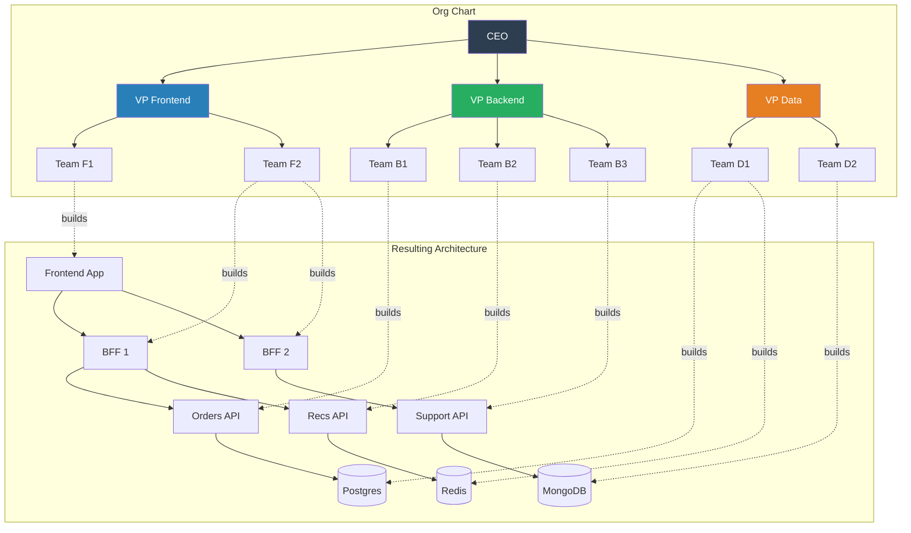
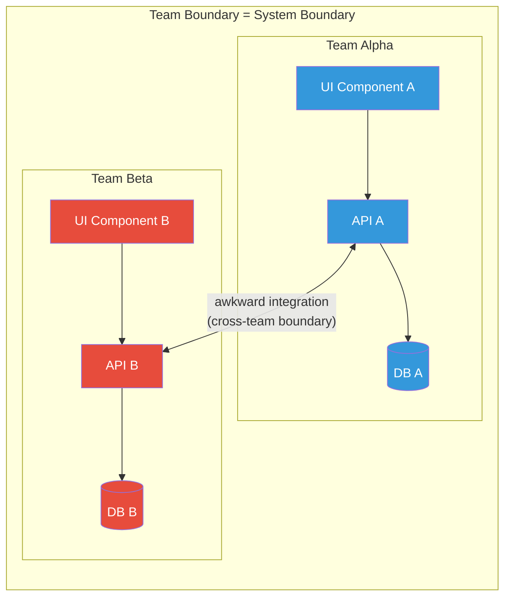

# Conway's Law

## 1. The Problem (Story)

MegaCorp has 200 engineers organized into three divisions: Frontend Division (40 engineers), Backend Division (80 engineers), and Data Division (80 engineers). Each division has its own VP, its own budget, and its own quarterly goals.

The CTO commissions a new "Unified Customer Platform" — a single product that shows customers their orders, recommendations, and support status in one seamless experience. She draws an elegant architecture: a single API layer backed by domain services, with a unified data model.

Nine months later, here's what shipped:

- The Frontend Division built a React app that calls **three different BFF endpoints** — one for orders, one for recommendations, one for support — because each maps to a different backend team
- The Backend Division built **three separate REST APIs** with inconsistent response formats — because three teams did it independently with no shared contracts
- The Data Division built **three separate data pipelines** — orders data in Postgres, recommendations in Redis, support tickets in MongoDB — because each data team was paired with a different backend team

The "Unified" platform is actually three platforms in a trench coat. The customer sees three loading spinners, inconsistent terminology ("order" vs "purchase" vs "transaction"), and data that's sometimes 30 minutes out of sync.

**Nobody designed this fragmentation.** It emerged from the organizational structure. Three divisions produced a three-way split, regardless of what the architecture diagram said.

## 2. The Naïve Solutions

### Attempt 1: "Better architecture documentation"

The CTO creates a detailed architecture document with a unified API specification. She presents it at an all-hands. Everyone agrees. Then each division goes back to their floor and builds what their team structure makes natural.

Why it fails:
- Documentation describes intent, but org structure determines execution
- Each division interprets the "unified API" through the lens of what their teams can independently build
- No one violates the spec intentionally — the spec just can't override the communication patterns that the org chart creates

### Attempt 2: "Architecture review board"

A committee of senior architects reviews all designs before they're built. They enforce consistency.

Why it fails:
- The review board becomes a bottleneck — designs wait weeks for review
- Reviews catch naming inconsistencies but can't change the fundamental team boundaries
- After review, teams still implement within their division's constraints
- The board becomes adversarial: "cops" that teams try to get past, not collaborators

### Attempt 3: "Cross-team standup"

A daily 15-minute cross-division standup to ensure alignment.

Why it fails:
- 20+ people in a meeting = nobody listens
- Teams report status but don't coordinate design
- Shared awareness doesn't change who builds what
- After 3 weeks, attendance drops to 4 people

## 3. The Insight

**"Organizations which design systems are constrained to produce designs which are copies of the communication structures of these organizations."** — Melvin Conway, 1967. The architecture of your software will mirror the communication boundaries in your organization, whether you intend it or not. This isn't a bug to fix — it's a force to understand and use deliberately.

## 4. The Pattern

**Conway's Law** is an observation (not a prescription) that:

1. **System boundaries mirror team boundaries**: If you have three teams, you'll get a three-part system
2. **Interface quality mirrors communication quality**: Teams that talk frequently build well-integrated components. Teams that rarely communicate build components with awkward, bolted-on interfaces.
3. **This is not optional**: You cannot architect around your org chart through documentation or willpower alone. The org chart IS the first draft of your architecture.

### What It Explains
- Why microservices architectures often have one service per team (that's who can independently build and deploy)
- Why "shared" libraries and platforms degrade into inconsistent forks
- Why cross-cutting concerns (auth, logging, error handling) are implemented differently by each team
- Why big-bang "re-architectures" fail when the org structure doesn't change

### What It Does NOT Explain
- How to choose the RIGHT architecture (Conway's Law tells you what you'll GET, not what you SHOULD get)
- That all org-mirrored architectures are bad (sometimes the natural structure IS correct)
- That you should constantly reorganize (the Inverse Conway Maneuver, covered in the next pattern, addresses this)

## 5. Mental Model

**A river carving a canyon.** Water (communication) flows along the path of least resistance (team boundaries). Over time, the canyon (architecture) deepens along exactly those channels. You can draw a different canyon on a map, but the water will still flow where gravity takes it. To change the canyon, you must redirect the water — change how people communicate — not just redraw the map.

## 6. Structure





## 7. Code Example

### TypeScript — Demonstrating how org structure shapes system design

```typescript
// ─── TYPES ───────────────────────────────────────────

interface Team {
  name: string;
  division: string;
  communicatesWith: string[]; // other team names
  owns: string[];              // service names
}

interface Service {
  name: string;
  ownedBy: string;
  dependsOn: string[];
  apiStyle: string;      // Each team chooses independently
  dataStore: string;     // Each team chooses independently
}

interface CommunicationLink {
  from: string;
  to: string;
  frequency: 'daily' | 'weekly' | 'monthly' | 'never';
  quality: 'tight' | 'loose' | 'awkward';
}

// ─── ORG ANALYZER (Conway's Law detector) ────────────

class ConwayAnalyzer {
  private teams: Map<string, Team> = new Map();
  private services: Map<string, Service> = new Map();
  private links: CommunicationLink[] = [];

  addTeam(team: Team): void {
    this.teams.set(team.name, team);
  }

  addService(service: Service): void {
    this.services.set(service.name, service);
  }

  addCommunicationLink(link: CommunicationLink): void {
    this.links.push(link);
  }

  // Predict: services owned by teams that rarely communicate
  // will have awkward integrations
  analyzeIntegrationQuality(): void {
    console.log('\n╔═══════════════════════════════════════╗');
    console.log('║  Conway\'s Law Analysis                ║');
    console.log('╚═══════════════════════════════════════╝');

    // Check each service dependency
    for (const [name, service] of this.services) {
      for (const depName of service.dependsOn) {
        const dep = this.services.get(depName);
        if (!dep) continue;

        const ownerTeam = service.ownedBy;
        const depTeam = dep.ownedBy;

        if (ownerTeam === depTeam) {
          console.log(`  ✅ ${name} → ${depName}: same team (${ownerTeam}) — tight integration`);
          continue;
        }

        // Find communication link between teams
        const link = this.links.find(
          l => (l.from === ownerTeam && l.to === depTeam) ||
               (l.from === depTeam && l.to === ownerTeam)
        );

        if (!link) {
          console.log(`  🔴 ${name} → ${depName}: teams (${ownerTeam}, ${depTeam}) NEVER communicate — integration will break`);
        } else if (link.frequency === 'monthly' || link.quality === 'awkward') {
          console.log(`  🟡 ${name} → ${depName}: teams communicate ${link.frequency} (${link.quality}) — expect inconsistencies`);
        } else {
          console.log(`  🟢 ${name} → ${depName}: teams communicate ${link.frequency} (${link.quality}) — good integration likely`);
        }
      }
    }
  }

  // Detect: architecture mirrors org boundaries
  detectBoundaryAlignment(): void {
    console.log('\n╔═══════════════════════════════════════╗');
    console.log('║  Boundary Alignment Check             ║');
    console.log('╚═══════════════════════════════════════╝');

    // Group services by owning team's division
    const divisionServices = new Map<string, string[]>();
    for (const [name, service] of this.services) {
      const team = this.teams.get(service.ownedBy);
      if (!team) continue;
      const list = divisionServices.get(team.division) ?? [];
      list.push(name);
      divisionServices.set(team.division, list);
    }

    for (const [division, serviceNames] of divisionServices) {
      console.log(`\n  Division: ${division}`);
      for (const sName of serviceNames) {
        const service = this.services.get(sName)!;
        console.log(`    📦 ${sName} (${service.apiStyle}, ${service.dataStore})`);
      }
    }

    // Check for inconsistencies within division
    for (const [division, serviceNames] of divisionServices) {
      const services = serviceNames.map(n => this.services.get(n)!);
      const apiStyles = new Set(services.map(s => s.apiStyle));
      const dataStores = new Set(services.map(s => s.dataStore));

      if (apiStyles.size > 1) {
        console.log(`  ⚠ ${division}: inconsistent API styles: ${[...apiStyles].join(', ')}`);
      }
      if (dataStores.size > 1) {
        console.log(`  ⚠ ${division}: multiple data stores: ${[...dataStores].join(', ')}`);
      }
    }
  }

  // Recommend: where to focus integration effort
  recommendFocus(): void {
    console.log('\n╔═══════════════════════════════════════╗');
    console.log('║  Recommendations                      ║');
    console.log('╚═══════════════════════════════════════╝');

    // Find cross-division dependencies
    const crossDivDeps: Array<{ service: string; dep: string; teams: string[] }> = [];

    for (const [name, service] of this.services) {
      const ownerTeam = this.teams.get(service.ownedBy);
      if (!ownerTeam) continue;

      for (const depName of service.dependsOn) {
        const dep = this.services.get(depName);
        if (!dep) continue;
        const depTeam = this.teams.get(dep.ownedBy);
        if (!depTeam) continue;

        if (ownerTeam.division !== depTeam.division) {
          crossDivDeps.push({
            service: name,
            dep: depName,
            teams: [ownerTeam.name, depTeam.name],
          });
        }
      }
    }

    if (crossDivDeps.length === 0) {
      console.log('  No cross-division dependencies. Architecture aligns with org structure.');
    } else {
      console.log('  Cross-division dependencies (Conway friction points):');
      for (const d of crossDivDeps) {
        console.log(`    ${d.service} → ${d.dep} (teams: ${d.teams.join(' ↔ ')})`);
      }
      console.log('\n  Options:');
      console.log('    1. Accept the friction and invest in clear API contracts');
      console.log('    2. Reorganize teams to align with desired architecture (Inverse Conway)');
      console.log('    3. Create a shared "platform" team to own the integration layer');
    }
  }
}

// ─── SCENARIO ────────────────────────────────────────

function demo() {
  const analyzer = new ConwayAnalyzer();

  // Define org structure
  analyzer.addTeam({
    name: 'frontend-orders',
    division: 'Frontend',
    communicatesWith: ['backend-orders'],
    owns: ['orders-ui'],
  });

  analyzer.addTeam({
    name: 'frontend-recs',
    division: 'Frontend',
    communicatesWith: ['backend-recs'],
    owns: ['recs-ui'],
  });

  analyzer.addTeam({
    name: 'backend-orders',
    division: 'Backend',
    communicatesWith: ['frontend-orders', 'data-orders'],
    owns: ['orders-api'],
  });

  analyzer.addTeam({
    name: 'backend-recs',
    division: 'Backend',
    communicatesWith: ['frontend-recs', 'data-recs'],
    owns: ['recs-api'],
  });

  analyzer.addTeam({
    name: 'data-orders',
    division: 'Data',
    communicatesWith: ['backend-orders'],
    owns: ['orders-db'],
  });

  analyzer.addTeam({
    name: 'data-recs',
    division: 'Data',
    communicatesWith: ['backend-recs'],
    owns: ['recs-db'],
  });

  // Define services (each team builds independently)
  analyzer.addService({
    name: 'orders-api',
    ownedBy: 'backend-orders',
    dependsOn: ['orders-db', 'recs-api'], // Orders needs recs for "customers also bought"
    apiStyle: 'REST',
    dataStore: 'PostgreSQL',
  });

  analyzer.addService({
    name: 'recs-api',
    ownedBy: 'backend-recs',
    dependsOn: ['recs-db'],
    apiStyle: 'GraphQL', // Different team, different choice
    dataStore: 'Redis',
  });

  analyzer.addService({
    name: 'orders-db',
    ownedBy: 'data-orders',
    dependsOn: [],
    apiStyle: 'SQL',
    dataStore: 'PostgreSQL',
  });

  analyzer.addService({
    name: 'recs-db',
    ownedBy: 'data-recs',
    dependsOn: [],
    apiStyle: 'Key-Value',
    dataStore: 'Redis',
  });

  // Communication links
  analyzer.addCommunicationLink({
    from: 'backend-orders', to: 'data-orders',
    frequency: 'daily', quality: 'tight',
  });

  analyzer.addCommunicationLink({
    from: 'backend-recs', to: 'data-recs',
    frequency: 'daily', quality: 'tight',
  });

  analyzer.addCommunicationLink({
    from: 'backend-orders', to: 'backend-recs',
    frequency: 'monthly', quality: 'awkward', // Different divisions!
  });

  // Run analysis
  analyzer.analyzeIntegrationQuality();
  analyzer.detectBoundaryAlignment();
  analyzer.recommendFocus();
}

demo();
```

### Go — Conway's Law analyzer

```go
package main

import "fmt"

type Team struct {
	Name     string
	Division string
	Owns     []string
}

type Service struct {
	Name      string
	OwnedBy  string
	DependsOn []string
}

type CommLink struct {
	TeamA     string
	TeamB     string
	Frequency string // daily, weekly, monthly, never
}

type Analyzer struct {
	teams    map[string]Team
	services map[string]Service
	links    []CommLink
}

func NewAnalyzer() *Analyzer {
	return &Analyzer{
		teams:    make(map[string]Team),
		services: make(map[string]Service),
	}
}

func (a *Analyzer) AddTeam(t Team) { a.teams[t.Name] = t }
func (a *Analyzer) AddService(s Service) { a.services[s.Name] = s }
func (a *Analyzer) AddLink(l CommLink) { a.links = append(a.links, l) }

func (a *Analyzer) findLink(t1, t2 string) *CommLink {
	for _, l := range a.links {
		if (l.TeamA == t1 && l.TeamB == t2) || (l.TeamA == t2 && l.TeamB == t1) {
			return &l
		}
	}
	return nil
}

func (a *Analyzer) Analyze() {
	fmt.Println("── Conway's Law Analysis ──")

	for _, svc := range a.services {
		for _, dep := range svc.DependsOn {
			depSvc := a.services[dep]
			ownerTeam := a.teams[svc.OwnedBy]
			depTeam := a.teams[depSvc.OwnedBy]

			if ownerTeam.Division == depTeam.Division {
				fmt.Printf("  ✅ %s → %s (same division: %s)\n",
					svc.Name, dep, ownerTeam.Division)
			} else {
				link := a.findLink(svc.OwnedBy, depSvc.OwnedBy)
				if link == nil {
					fmt.Printf("  🔴 %s → %s (cross-division, NO communication)\n",
						svc.Name, dep)
				} else {
					fmt.Printf("  🟡 %s → %s (cross-division, comm: %s)\n",
						svc.Name, dep, link.Frequency)
				}
			}
		}
	}
}

func main() {
	a := NewAnalyzer()

	a.AddTeam(Team{Name: "orders-team", Division: "Backend", Owns: []string{"orders-api"}})
	a.AddTeam(Team{Name: "recs-team", Division: "ML", Owns: []string{"recs-api"}})
	a.AddTeam(Team{Name: "data-team", Division: "Backend", Owns: []string{"shared-db"}})

	a.AddService(Service{Name: "orders-api", OwnedBy: "orders-team", DependsOn: []string{"recs-api", "shared-db"}})
	a.AddService(Service{Name: "recs-api", OwnedBy: "recs-team", DependsOn: []string{"shared-db"}})
	a.AddService(Service{Name: "shared-db", OwnedBy: "data-team", DependsOn: nil})

	a.AddLink(CommLink{TeamA: "orders-team", TeamB: "data-team", Frequency: "daily"})
	a.AddLink(CommLink{TeamA: "orders-team", TeamB: "recs-team", Frequency: "monthly"})
	a.AddLink(CommLink{TeamA: "recs-team", TeamB: "data-team", Frequency: "weekly"})

	a.Analyze()
}
```

## 8. Gotchas & Beginner Mistakes

| Mistake | Why It Happens | Fix |
|---------|---------------|-----|
| Ignoring Conway's Law | "Our architecture is independent of our org structure" — it isn't | Accept it. Use it deliberately (Inverse Conway). |
| Blaming engineers for inconsistency | Teams build differently not because they're bad, but because they communicate differently | Fix the communication structure, not the people |
| Too many teams for the architecture | 20 teams building a monolith = 20 conflicting commits daily | Match team count to service count |
| Shared ownership of critical components | "Everyone owns authentication" → no one owns it → it rots | Assign clear ownership. If no team owns it, create a team. |
| Reorganizing without architecture change | Merged two teams but kept two services → now one overloaded team with two codebases | Align BOTH: merge teams AND merge services (or split both) |
| Assuming Conway's Law is permanent | "We're stuck with this architecture because of our org chart" | The org chart can change. That's the Inverse Conway Maneuver. |

## 9. Related & Confusable Patterns

| Pattern | Relationship | Key Difference |
|---------|-------------|----------------|
| **Inverse Conway Maneuver** | Active use of this law | Conway's Law is the observation. Inverse Conway is the action: design teams to get the architecture you want. |
| **Team Topologies** | Framework for applying Conway | Team Topologies provides specific team types and interaction modes to harness Conway's Law deliberately. |
| **Microservices** | Often Conway-shaped | Microservice boundaries frequently follow team boundaries. Conway's Law explains why this is natural. |
| **Domain-Driven Design** | Bounded contexts parallel teams | DDD's bounded contexts often align with team boundaries. Conway's Law explains why this alignment works. |
| **Brooks's Law** | Related organizational law | "Adding people to a late project makes it later." Brooks addresses team SIZE. Conway addresses team STRUCTURE. |

## 10. When This Pattern Is the WRONG Choice

Conway's Law is an observation, not a pattern to "apply" or "avoid." However, blindly accepting it is wrong when:

| Scenario | Problem | Better Approach |
|----------|---------|----------------|
| Org structure is political, not technical | Teams exist because of empire-building, not system design | Reorganize around technical domains (Inverse Conway) |
| One team somehow owns 8 services | Team is overloaded, services degrade | Split the team along service boundaries |
| You're designing from scratch | No legacy org structure to constrain you | Design the architecture FIRST, then form teams to match |
| Cross-cutting concerns exist | Auth, logging, monitoring span all teams | Create a platform team or adopt shared libraries with clear ownership |
| Temporary project teams | A 3-month initiative doesn't warrant org restructuring | Use project teams with clear hand-off to permanent owners |

**The real mistake**: Treating Conway's Law as destiny rather than as a design lever. Your org chart is not read-only.

**Back-out strategy**: If you're stuck with a mismatched org/architecture, start by improving cross-team communication (regular integration meetings, shared API contracts, joint on-call rotations). This doesn't fix the root cause but reduces the friction until reorganization is possible.
