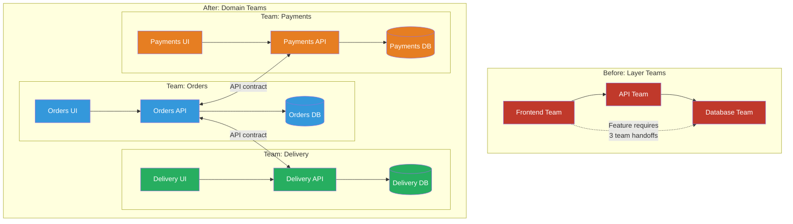
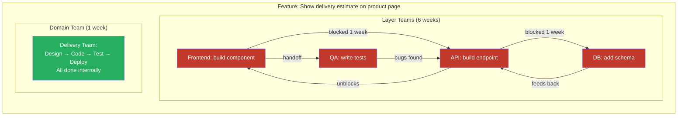

# Domain-Driven Team Boundaries

## 1. The Problem (Story)

RetailMax has 80 engineers building an e-commerce platform. Teams are organized by technical layer:

- **Frontend Team** (20 engineers): owns all React code
- **API Team** (25 engineers): owns all REST endpoints
- **Database Team** (15 engineers): owns all schemas and migrations
- **Infrastructure Team** (10 engineers): owns all deployments
- **QA Team** (10 engineers): owns all testing

When a product manager asks for "show estimated delivery dates on the product page," here's what happens:

1. **PM files 5 tickets** — one for each team
2. **Frontend Team** needs a new component. Blocked on API Team for the endpoint.
3. **API Team** needs a new endpoint `/products/{id}/delivery-estimate`. Blocked on Database Team for the delivery data schema.
4. **Database Team** designs the schema. Blocks on the API Team to know what fields are needed.
5. **Infrastructure Team** needs to provision a new queue for delivery estimate calculations. Blocked on API Team to know which service produces estimates.
6. **QA Team** can't write tests until all four teams finish. Tests are written last, by people who weren't in any design discussion.

**Timeline**: A feature that one full-stack team could ship in 1 week takes 6 weeks due to cross-team dependencies, handoffs, and waiting.

**Quality**: Each team optimizes for its layer. The Database Team builds a normalized schema. The API Team wraps it in REST. The Frontend Team renders it. Nobody owns the "delivery estimate" concept holistically. When the estimate is wrong, each team says "my layer works correctly."

**This is the cost of organizing by technology instead of by domain.**

## 2. The Naïve Solutions

### Attempt 1: "Cross-functional projects"

Form temporary project teams from members of each functional team. "Project Delivery Estimate" includes one person from Frontend, API, Database, and QA.

Problems:
- Members still report to their functional manager → split loyalty, split priorities
- After the project, they return to their functional team → no long-term ownership
- The project team doesn't own production operations → bugs filed back to functional teams who've moved on
- Knowledge disperses when the project disbands

### Attempt 2: "Matrix organization"

Each engineer reports to both a functional manager (Frontend Lead) and a domain manager (Commerce Lead).

Problems:
- Two bosses = conflicting priorities
- Engineers spend time in double the meetings
- Career growth is unclear: promoted by the functional lead or the domain lead?
- Despite the matrix, deployments still follow functional boundaries (one deploy pipeline for all frontend, one for all backend)

### Attempt 3: "Strong product owners with functional teams"

Keep functional teams but assign strong POs who coordinate across all teams for their domain.

Problems:
- The PO becomes a full-time coordinator, not a product thinker
- Cross-team coordination scales O(n²) with team count
- The PO has responsibility without authority — they can't tell the Database Team to prioritize their schema change over another PO's request
- Engineers still don't develop domain expertise — they context-switch between "delivery estimates" and "promotions" and "returns" weekly

## 3. The Insight

**Align team boundaries to business domain boundaries, not technology boundaries.** A "Delivery" team owns everything about delivery estimates: the UI components, the API endpoints, the database tables, the event consumers, and the production operations. They can ship a feature end-to-end without waiting for any other team. This is Domain-Driven Design's bounded context applied to organizational structure.

## 4. The Pattern

**Domain-Driven Team Boundaries** means:

1. **Identify bounded contexts**: Use DDD to find the natural business domains in your system (Orders, Inventory, Delivery, Payments, Users)
2. **One team per context**: Each team owns their entire bounded context — frontend, backend, data, and operations
3. **Teams own their data**: Each team has its own database (or schema). No shared database across teams.
4. **Communicate via contracts**: Teams interact through published APIs and events, not shared code or databases.
5. **Cross-cutting concerns go to platform**: Authentication, CI/CD, monitoring → platform team (see Platform Team pattern)

### Key Properties
- **Vertical slicing**: Teams cut through all technical layers for one domain
- **Autonomous delivery**: Teams can ship without coordinating deploys with other teams
- **Domain expertise**: Engineers become experts in their business domain
- **Clear ownership**: "Delivery is broken" → Delivery Team. No ambiguity.

### Guarantees
- Reduced cross-team dependencies (most features touch ONE team)
- Faster delivery (no handoff chains)
- Clear accountability (one team per domain)
- Conway's Law alignment (team structure matches architecture)

### Non-Guarantees
- Does not eliminate ALL cross-team work (some features truly span domains)
- Does not solve team sizing (some domains are too small for a full team)
- Does not prevent duplication (two teams may build similar UI components)
- Teams need full-stack skills (or must acquire them)

## 5. Mental Model

**Embassy compounds.** Each embassy (domain team) is a sovereign territory. It has its own building (services), its own staff (engineers), its own communications infrastructure (database, queues). The embassy handles all affairs related to its country (domain) independently. When two embassies need to coordinate (cross-domain feature), they communicate through formal diplomatic channels (APIs, events) — not by sharing buildings or staff.

## 6. Structure





## 7. Code Example

### TypeScript — Domain boundary mapper

```typescript
// ─── TYPES ───────────────────────────────────────────

interface BoundedContext {
  name: string;
  capabilities: string[];
  dataEntities: string[];       // Tables/collections this context owns
  publishedEvents: string[];    // Events it emits
  consumedEvents: string[];     // Events it listens to
  externalAPIs: string[];       // APIs it exposes to other contexts
}

interface DomainTeam {
  name: string;
  context: BoundedContext;
  headcount: number;
  skills: string[];
  autonomyScore: number; // Calculated
}

interface CrossDomainDependency {
  from: string;
  to: string;
  type: 'api-call' | 'event-consumed' | 'shared-data';
  description: string;
}

// ─── DOMAIN BOUNDARY ANALYZER ───────────────────────

class DomainBoundaryMapper {
  private contexts: Map<string, BoundedContext> = new Map();

  addContext(ctx: BoundedContext): void {
    this.contexts.set(ctx.name, ctx);
  }

  // Map contexts to teams and analyze dependencies
  analyzeTeamBoundaries(): {
    teams: DomainTeam[];
    dependencies: CrossDomainDependency[];
    issues: string[];
  } {
    const teams: DomainTeam[] = [];
    const dependencies: CrossDomainDependency[] = [];
    const issues: string[] = [];

    for (const [name, ctx] of this.contexts) {
      // Calculate headcount based on complexity
      const complexity = ctx.capabilities.length + ctx.dataEntities.length;
      const headcount = Math.max(3, Math.min(8, Math.ceil(complexity * 1.5)));

      // Determine required skills
      const skills = new Set(['backend', 'testing']);
      if (ctx.capabilities.some(c => c.toLowerCase().includes('ui'))) skills.add('frontend');
      if (ctx.dataEntities.length > 0) skills.add('data-modeling');
      if (ctx.publishedEvents.length > 0) skills.add('event-systems');

      teams.push({
        name: `team-${name}`,
        context: ctx,
        headcount,
        skills: [...skills],
        autonomyScore: 0,
      });
    }

    // Detect cross-domain dependencies
    for (const [name, ctx] of this.contexts) {
      // Event dependencies
      for (const consumed of ctx.consumedEvents) {
        for (const [otherName, otherCtx] of this.contexts) {
          if (otherName !== name && otherCtx.publishedEvents.includes(consumed)) {
            dependencies.push({
              from: name,
              to: otherName,
              type: 'event-consumed',
              description: `${name} consumes "${consumed}" published by ${otherName}`,
            });
          }
        }
      }

      // Shared data detection (anti-pattern!)
      for (const entity of ctx.dataEntities) {
        for (const [otherName, otherCtx] of this.contexts) {
          if (otherName !== name && otherCtx.dataEntities.includes(entity)) {
            dependencies.push({
              from: name,
              to: otherName,
              type: 'shared-data',
              description: `SHARED DATA: "${entity}" owned by both ${name} and ${otherName}`,
            });
            issues.push(`🔴 Shared data entity "${entity}" between ${name} and ${otherName} — violates domain boundary`);
          }
        }
      }
    }

    // Calculate autonomy (inverse of dependency count)
    for (const team of teams) {
      const depCount = dependencies.filter(
        d => d.from === team.context.name || d.to === team.context.name
      ).length;
      const sharedDataCount = dependencies.filter(
        d => (d.from === team.context.name || d.to === team.context.name) && d.type === 'shared-data'
      ).length;

      team.autonomyScore = Math.max(0, 100 - depCount * 10 - sharedDataCount * 25);
    }

    // Check for contexts too small for a team
    for (const team of teams) {
      if (team.context.capabilities.length <= 1) {
        issues.push(`🟡 "${team.context.name}" has only ${team.context.capabilities.length} capability — consider merging with a related context`);
      }
    }

    return { teams, dependencies, issues };
  }

  printAnalysis(): void {
    const { teams, dependencies, issues } = this.analyzeTeamBoundaries();

    console.log('╔═══════════════════════════════════════╗');
    console.log('║  Domain-Driven Team Boundaries        ║');
    console.log('╚═══════════════════════════════════════╝');

    // Teams
    console.log('\n── Proposed Domain Teams ──');
    for (const team of teams) {
      const bar = '█'.repeat(team.autonomyScore / 10) + '░'.repeat(10 - team.autonomyScore / 10);
      console.log(`\n  📦 ${team.name} (${team.headcount} engineers)`);
      console.log(`     Capabilities: ${team.context.capabilities.join(', ')}`);
      console.log(`     Data entities: ${team.context.dataEntities.join(', ')}`);
      console.log(`     Events out: ${team.context.publishedEvents.join(', ') || 'none'}`);
      console.log(`     Events in: ${team.context.consumedEvents.join(', ') || 'none'}`);
      console.log(`     Skills: ${team.skills.join(', ')}`);
      console.log(`     Autonomy: [${bar}] ${team.autonomyScore}%`);
    }

    // Dependencies
    console.log('\n── Cross-Domain Dependencies ──');
    for (const dep of dependencies) {
      const icon = dep.type === 'shared-data' ? '🔴' : dep.type === 'event-consumed' ? '📨' : '🔗';
      console.log(`  ${icon} ${dep.description}`);
    }

    // Issues
    if (issues.length > 0) {
      console.log('\n── Issues ──');
      for (const issue of issues) {
        console.log(`  ${issue}`);
      }
    }

    // Summary
    const avgAutonomy = teams.reduce((s, t) => s + t.autonomyScore, 0) / teams.length;
    const totalHeadcount = teams.reduce((s, t) => s + t.headcount, 0);
    console.log('\n── Summary ──');
    console.log(`  Teams: ${teams.length}`);
    console.log(`  Total headcount: ${totalHeadcount}`);
    console.log(`  Avg autonomy: ${Math.round(avgAutonomy)}%`);
    console.log(`  Cross-domain deps: ${dependencies.length}`);
    console.log(`  Issues: ${issues.length}`);
  }
}

// ─── SCENARIO ────────────────────────────────────────

function demo() {
  const mapper = new DomainBoundaryMapper();

  mapper.addContext({
    name: 'orders',
    capabilities: ['create-order', 'order-history', 'order-ui', 'order-tracking'],
    dataEntities: ['orders', 'order_items', 'order_status_history'],
    publishedEvents: ['OrderPlaced', 'OrderCancelled', 'OrderCompleted'],
    consumedEvents: ['PaymentConfirmed', 'DeliveryScheduled'],
    externalAPIs: ['POST /orders', 'GET /orders/{id}', 'GET /orders/history'],
  });

  mapper.addContext({
    name: 'delivery',
    capabilities: ['estimate-delivery', 'schedule-delivery', 'delivery-tracking-ui'],
    dataEntities: ['delivery_schedules', 'delivery_zones', 'carrier_rates'],
    publishedEvents: ['DeliveryScheduled', 'DeliveryCompleted'],
    consumedEvents: ['OrderPlaced'],
    externalAPIs: ['GET /delivery/estimate', 'POST /delivery/schedule'],
  });

  mapper.addContext({
    name: 'payments',
    capabilities: ['process-payment', 'refund', 'payment-history-ui'],
    dataEntities: ['payments', 'refunds', 'payment_methods'],
    publishedEvents: ['PaymentConfirmed', 'PaymentFailed', 'RefundProcessed'],
    consumedEvents: ['OrderPlaced'],
    externalAPIs: ['POST /payments/charge', 'POST /payments/refund'],
  });

  mapper.addContext({
    name: 'catalog',
    capabilities: ['product-listing', 'product-search', 'catalog-ui'],
    dataEntities: ['products', 'categories', 'product_images'],
    publishedEvents: ['ProductUpdated', 'ProductDelisted'],
    consumedEvents: [],
    externalAPIs: ['GET /products', 'GET /products/{id}'],
  });

  mapper.printAnalysis();
}

demo();
```

### Go — Domain boundary checker

```go
package main

import "fmt"

type Context struct {
	Name       string
	Entities   []string
	EventsOut  []string
	EventsIn   []string
}

func checkBoundaries(contexts []Context) {
	fmt.Println("── Domain Boundary Analysis ──")

	// Detect shared data entities
	entityOwners := map[string][]string{}
	for _, ctx := range contexts {
		for _, e := range ctx.Entities {
			entityOwners[e] = append(entityOwners[e], ctx.Name)
		}
	}

	for entity, owners := range entityOwners {
		if len(owners) > 1 {
			fmt.Printf("  🔴 SHARED DATA: '%s' owned by %v\n", entity, owners)
		}
	}

	// Map event dependencies
	for _, ctx := range contexts {
		for _, consumed := range ctx.EventsIn {
			for _, other := range contexts {
				if other.Name == ctx.Name {
					continue
				}
				for _, published := range other.EventsOut {
					if consumed == published {
						fmt.Printf("  📨 %s consumes '%s' from %s\n",
							ctx.Name, consumed, other.Name)
					}
				}
			}
		}
	}
}

func main() {
	contexts := []Context{
		{
			Name:      "orders",
			Entities:  []string{"orders", "order_items"},
			EventsOut: []string{"OrderPlaced", "OrderCompleted"},
			EventsIn:  []string{"PaymentConfirmed"},
		},
		{
			Name:      "payments",
			Entities:  []string{"payments", "refunds"},
			EventsOut: []string{"PaymentConfirmed", "RefundProcessed"},
			EventsIn:  []string{"OrderPlaced"},
		},
		{
			Name:      "delivery",
			Entities:  []string{"delivery_schedules"},
			EventsOut: []string{"DeliveryScheduled"},
			EventsIn:  []string{"OrderPlaced"},
		},
	}

	checkBoundaries(contexts)
}
```

## 8. Gotchas & Beginner Mistakes

| Mistake | Why It Happens | Fix |
|---------|---------------|-----|
| Treating "domain" as arbitrary | Teams split around projects, not business domains → short-lived, no long-term ownership | Domains come from DDD: identify bounded contexts from business language. |
| Shared database across domain teams | "It's easier to just join across schemas" | Each team owns its own data store. Inter-team data access through APIs only. |
| Domains too granular | "Address Validation" is not a domain — it's a capability within a domain | A domain needs enough scope for a 3-5 person team. If it doesn't, merge with a related context. |
| Not investing in full-stack skills | Backend engineers can't write frontend → team still depends on the "frontend team" | Train team members in full-stack skills or hire T-shaped engineers. |
| Ignoring cross-cutting features | Some features genuinely span 3 domains. Without a strategy, they stall. | Designate a "lead" team + supporting teams with an explicit collaboration protocol for multi-domain features. |
| Domain boundaries never evolve | Business changes but team boundaries stay fixed → misalignment | Review boundaries annually. Merge or split contexts as the business evolves. |

## 9. Related & Confusable Patterns

| Pattern | Relationship | Key Difference |
|---------|-------------|----------------|
| **Domain-Driven Design** | Source of this pattern | DDD identifies bounded contexts. This pattern maps those contexts to team ownership. |
| **Microservices** | Common implementation | Microservices = one service per domain. Domain teams = one team per domain. Often used together but orthogonal. |
| **Inverse Conway Maneuver** | Strategy this pattern implements | Inverse Conway says "match teams to architecture." Domain-driven teams says "match teams to business domains." |
| **Feature Teams** | Confusable | Feature teams work on features across the codebase (temporary). Domain teams own a domain permanently. |
| **Platform Team** | Complementary | Platform teams handle cross-cutting infrastructure so domain teams can focus on their domain. |

## 10. When This Pattern Is the WRONG Choice

| Scenario | Why Domain Teams Hurt | Better Alternative |
|----------|----------------------|-------------------|
| Very small org (< 12 engineers) | Can't staff 3-4 domain teams with 3-5 people each | One team with good modularity in the codebase |
| Heavy cross-domain features | If every feature touches 4+ domains, vertical teams create more coordination than they eliminate | Consider broader domains (fewer, larger teams) |
| No clear domain boundaries | The business model is evolving rapidly; yesterday's domains don't make sense today | Keep functional teams until the domain model stabilizes |
| Legacy monolith without seams | You can't split the codebase along domain lines because everything is tangled | Refactor/strangler-fig first, THEN create domain teams |
| Expertise concentration | Only 2 people know machine learning; they can't be split across 4 domain teams | Use a complicated-subsystem team for ML; domain teams consume it as a service |

**Symptom you need domain-driven teams**: Simple features take weeks because they require coordination across 3+ teams. No one owns "delivery" end-to-end. Layer teams optimize locally but nobody owns the customer experience.

**Back-out strategy**: Start with one pilot domain team. Take the smallest, most autonomous bounded context (e.g., "notifications") and form a 4-person full-stack team around it. Measure their velocity versus the layer-team approach. If it works, expand domain by domain. If it doesn't, the pilot is small enough to revert.
