# Guilds & Communities of Practice

## 1. The Problem (Story)

MedStack is a health-tech company with 90 engineers organized into 8 domain teams: Patient Records, Scheduling, Billing, Pharmacy, Lab Results, Telemedicine, Provider Portal, and Mobile. Thanks to domain-driven team boundaries, each team ships independently. Velocity is high within each domain.

But cross-cutting concerns are rotting:

**Observability:** Team Patient Records uses Datadog with structured JSON logging. Team Billing uses CloudWatch with unstructured text logs. Team Scheduling has no logging at all — they `console.log` in production. When an incident spans multiple services, engineers can't correlate events because every team logs differently. There is no shared logging standard.

**TypeScript practices:** Team Mobile uses `strict: true` with exhaustive pattern matching. Team Pharmacy still uses `any` in 40% of their codebase. Team Lab Results is on TypeScript 4.9. Team Provider Portal is on 5.3. When engineers rotate between teams, they have to re-learn coding conventions.

**Security:** Three teams implement JWT validation. Each team's implementation is slightly different. Team Billing's implementation has a known vulnerability (it doesn't verify the `iss` claim). Nobody knows this because security knowledge is siloed — no one reviews JWT code across team boundaries.

**Database migrations:** Team Patient Records has a sophisticated migration framework with rollback support. They spent 3 months building it. Team Scheduling is building the same thing from scratch because they don't know Patient Records already solved it.

**The pattern repeats everywhere:** Each team independently discovers, solves, and sometimes fails at the same problems. There's no mechanism for knowledge to flow ACROSS teams. Domain teams create vertical expertise (deep) but no horizontal expertise (wide).

When an engineer asks "What's our company standard for X?", the answer is always: "There isn't one. Ask your team lead."

## 2. The Naïve Solutions

### Attempt 1: "Centralized standards team"

Create a team of 3 senior engineers who define standards for everyone: logging format, TypeScript config, security practices, database patterns.

Problems:
- The standards team becomes ivory-tower architects — they set rules without living with the consequences
- Published standards are ignored because "that doesn't work for our team's context"
- Standards are always behind — by the time they publish a logging standard, 3 teams have already chosen conflicting approaches
- The 3 engineers can't cover all domains expertly — they're spread too thin

### Attempt 2: "All-hands tech talks"

Monthly tech talks where teams present their solutions. "Look, Patient Records has a great migration framework!"

Problems:
- Passive learning — people attend, nod, forget
- No follow-through mechanism — after the talk, who ensures other teams actually adopt the framework?
- Attendance drops: the first talk gets 80 engineers, the sixth gets 15
- One-way broadcast, not collaborative exploration

### Attempt 3: "Shared Slack channels"

`#engineering-general`, `#typescript-help`, `#security-questions` — let people ask organically.

Problems:
- Important discussions scroll away and are never found again
- No structure — questions get answered inconsistently
- No ownership — nobody is responsible for the channel's health
- Knowledge stays in the heads of whoever answered; it's not captured systematically

## 3. The Insight

**Create voluntary cross-team groups organized around shared practices, not shared products.** A "guild" for observability includes one engineer from each team who cares about logging, metrics, and tracing. They meet regularly, share what works, define lightweight standards, and build shared tools. The key word is VOLUNTARY — these groups exist because engineers find them valuable, not because management mandates them. They cut horizontally across the vertical domain teams.

## 4. The Pattern

**Guilds and Communities of Practice (CoPs)** are cross-team groups where engineers with shared interests collaborate on practices, standards, and tools. They are:

### Definitions
- **Guild**: Cross-team interest group. Any engineer can join. Meets regularly to share knowledge, create standards, and build shared tools. (Spotify model terminology.)
- **Community of Practice (CoP)**: Same concept, different name. Broader industry term. Emphasis on learning and practice improvement.
- **Chapter**: Team-local experts who represent the guild within their domain team. (e.g., the "observability chapter" within Team Billing = the Billing engineer who attends the Observability Guild.)

### Structure
- **Coordinator**: One volunteer who schedules meetings, maintains the guild's backlog, and ensures follow-through. Rotates periodically.
- **Members**: Engineers from different teams. 1-3 per team. Voluntary.
- **Cadence**: Bi-weekly or monthly meetings. Async work in between.
- **Outputs**: Standards documents, shared libraries, decision records, tech radar entries.

### Key Properties
- **Cross-cutting, not cross-team**: Guilds address practices that span all teams (observability, security, testing, TypeScript standards)
- **Voluntary**: Forced guilds die. People join because they care about the topic.
- **Advisory, not authoritative**: Guilds recommend standards. Teams choose to adopt them. (Exception: security guilds may have veto power for security-critical patterns.)
- **Time-bounded output**: Guilds with no output for 3 months should be paused. They're not social clubs.

### Guarantees
- Cross-team knowledge sharing without changing reporting lines
- Lightweight standards emerge from practitioners, not ivory-tower architects
- Reduces duplicate effort (one team's solution becomes everyone's solution)
- Engineers build relationships outside their immediate team

### Non-Guarantees
- Does not guarantee adoption (teams may still ignore guild recommendations)
- Not free — guild participation takes engineer time away from product work
- Requires management support (time allocation, meeting space, visibility)
- Can become talking shops if not output-oriented

## 5. Mental Model

**Professional associations.** Doctors work at different hospitals (teams), but they join professional organizations like the AMA or specialty societies (guilds). At the society, a cardiologist from Hospital A meets cardiologists from Hospitals B and C. They share case studies, debate best practices, and publish clinical guidelines. The guidelines don't FORCE any hospital to change — but most adopt them because they come from practitioners, not administrators. No hospital has to send their cardiologist, but the best ones do.

## 6. Structure

```mermaid
sequenceDiagram
    participant G as Observability Guild
    participant M1 as Member (Patient Records)
    participant M2 as Member (Billing)
    participant M3 as Member (Pharmacy)
    participant Teams as All Domain Teams

    Note over G: Bi-weekly meeting #1
    M1->>G: "We built structured JSON logging with correlation IDs"
    M2->>G: "We're using CloudWatch text logs — had 3 incidents where we couldn't trace"
    M3->>G: "We use Datadog but no correlation IDs"

    G->>G: Decision: adopt structured JSON + correlation IDs as standard
    G->>G: Write RFC: "Logging Standard v1"

    Note over G: Bi-weekly meeting #2
    M1->>G: "I'll extract our logging lib into a shared package"
    G->>Teams: Publish RFC + shared logging library

    Note over G: Month 2
    M2->>G: "Billing migrated to shared logging. Found 2 issues, submitted PRs."
    M3->>G: "Pharmacy adopted it. Reduced MTTR by 40% last incident."
```




## 7. Code Example

### TypeScript — Guild management system

```typescript
// ─── TYPES ───────────────────────────────────────────

interface Guild {
  name: string;
  topic: string;
  coordinator: string;
  members: GuildMember[];
  outputs: GuildOutput[];
  meetings: Meeting[];
  status: 'active' | 'paused' | 'disbanded';
  createdAt: Date;
}

interface GuildMember {
  name: string;
  team: string;
  role: 'coordinator' | 'member';
  joinedAt: Date;
}

interface GuildOutput {
  type: 'standard' | 'library' | 'rfc' | 'tech-radar-entry' | 'workshop';
  title: string;
  date: Date;
  adoptedByTeams: string[];
}

interface Meeting {
  date: Date;
  attendees: number;
  topics: string[];
  actionItems: string[];
}

// ─── GUILD PLATFORM ─────────────────────────────────

class GuildPlatform {
  private guilds: Map<string, Guild> = new Map();

  createGuild(name: string, topic: string, coordinator: string, coordinatorTeam: string): void {
    const guild: Guild = {
      name,
      topic,
      coordinator,
      members: [{
        name: coordinator,
        team: coordinatorTeam,
        role: 'coordinator',
        joinedAt: new Date(),
      }],
      outputs: [],
      meetings: [],
      status: 'active',
      createdAt: new Date(),
    };

    this.guilds.set(name, guild);
    console.log(`[Guild] Created: "${name}" — ${topic}`);
    console.log(`  Coordinator: ${coordinator} (${coordinatorTeam})`);
  }

  join(guildName: string, memberName: string, team: string): void {
    const guild = this.guilds.get(guildName);
    if (!guild) return;

    // Check if team already has representation
    const teamMembers = guild.members.filter(m => m.team === team);
    if (teamMembers.length >= 2) {
      console.log(`[⚠️] ${team} already has ${teamMembers.length} members in ${guildName}`);
    }

    guild.members.push({
      name: memberName,
      team,
      role: 'member',
      joinedAt: new Date(),
    });

    const teamsRepresented = new Set(guild.members.map(m => m.team)).size;
    console.log(`[Guild] ${memberName} (${team}) joined "${guildName}" — ${guild.members.length} members, ${teamsRepresented} teams`);
  }

  recordMeeting(guildName: string, attendees: number, topics: string[], actions: string[]): void {
    const guild = this.guilds.get(guildName);
    if (!guild) return;

    guild.meetings.push({
      date: new Date(),
      attendees,
      topics,
      actionItems: actions,
    });

    console.log(`\n[Meeting] ${guildName} — ${attendees} attendees`);
    console.log('  Topics:');
    for (const t of topics) console.log(`    • ${t}`);
    console.log('  Action items:');
    for (const a of actions) console.log(`    → ${a}`);
  }

  addOutput(guildName: string, type: GuildOutput['type'], title: string, adoptedBy: string[]): void {
    const guild = this.guilds.get(guildName);
    if (!guild) return;

    guild.outputs.push({
      type,
      title,
      date: new Date(),
      adoptedByTeams: adoptedBy,
    });

    console.log(`\n[Output] ${guildName}: ${type} — "${title}"`);
    console.log(`  Adopted by: ${adoptedBy.length > 0 ? adoptedBy.join(', ') : 'pending'}`);
  }

  // Health check: are guilds producing value?
  healthCheck(): void {
    console.log('\n╔═══════════════════════════════════════════╗');
    console.log('║  Guild Health Dashboard                   ║');
    console.log('╚═══════════════════════════════════════════╝');

    for (const [name, guild] of this.guilds) {
      const teamsRepresented = new Set(guild.members.map(m => m.team)).size;
      const recentMeetings = guild.meetings.length;
      const totalOutputs = guild.outputs.length;
      const totalAdoptions = guild.outputs.reduce((sum, o) => sum + o.adoptedByTeams.length, 0);

      // Health scoring
      const issues: string[] = [];
      if (teamsRepresented < 3) issues.push('low team diversity');
      if (recentMeetings < 2) issues.push('too few meetings');
      if (totalOutputs === 0) issues.push('no outputs produced');
      if (guild.members.length < 4) issues.push('too few members');

      const health = issues.length === 0 ? '🟢 Healthy'
        : issues.length <= 2 ? '🟡 Needs attention'
        : '🔴 At risk';

      console.log(`\n  📋 ${name} (${guild.status}) — ${health}`);
      console.log(`     Members: ${guild.members.length} from ${teamsRepresented} teams`);
      console.log(`     Meetings: ${recentMeetings}`);
      console.log(`     Outputs: ${totalOutputs} (${totalAdoptions} team-adoptions)`);

      if (issues.length > 0) {
        console.log(`     Issues: ${issues.join(', ')}`);
      }
    }
  }

  // Cross-pollination report: which engineers have visibility beyond their team?
  crossPollinationReport(): void {
    console.log('\n╔═══════════════════════════════════════════╗');
    console.log('║  Cross-Pollination Report                 ║');
    console.log('╚═══════════════════════════════════════════╝');

    const teamGuilds = new Map<string, Set<string>>();
    const engineerGuilds = new Map<string, string[]>();

    for (const [name, guild] of this.guilds) {
      for (const member of guild.members) {
        if (!teamGuilds.has(member.team)) teamGuilds.set(member.team, new Set());
        teamGuilds.get(member.team)!.add(name);

        if (!engineerGuilds.has(member.name)) engineerGuilds.set(member.name, []);
        engineerGuilds.get(member.name)!.push(name);
      }
    }

    console.log('\n  Team coverage:');
    for (const [team, guilds] of teamGuilds) {
      console.log(`    ${team}: member of ${guilds.size} guilds (${[...guilds].join(', ')})`);
    }

    console.log('\n  Top cross-pollinators:');
    const sorted = [...engineerGuilds.entries()]
      .sort((a, b) => b[1].length - a[1].length)
      .slice(0, 5);
    for (const [eng, guilds] of sorted) {
      console.log(`    ${eng}: ${guilds.length} guilds (${guilds.join(', ')})`);
    }
  }
}

// ─── SCENARIO ────────────────────────────────────────

function demo() {
  const platform = new GuildPlatform();

  // Create guilds
  platform.createGuild('Observability Guild', 'Logging, metrics, tracing standards', 'Sara', 'Patient Records');
  platform.createGuild('Security Guild', 'AppSec practices, vulnerability management', 'Jin', 'Billing');
  platform.createGuild('TypeScript Guild', 'Language standards, tooling, best practices', 'Priya', 'Mobile');

  // Engineers join guilds
  console.log('\n── Membership ──');
  platform.join('Observability Guild', 'Wei', 'Billing');
  platform.join('Observability Guild', 'Alex', 'Pharmacy');
  platform.join('Observability Guild', 'Kai', 'Scheduling');
  platform.join('Observability Guild', 'Morgan', 'Telemedicine');

  platform.join('Security Guild', 'Sara', 'Patient Records'); // Cross-guild
  platform.join('Security Guild', 'Alex', 'Pharmacy');        // Cross-guild
  platform.join('Security Guild', 'Noor', 'Scheduling');
  platform.join('Security Guild', 'Liam', 'Provider Portal');

  platform.join('TypeScript Guild', 'Wei', 'Billing');
  platform.join('TypeScript Guild', 'Kai', 'Scheduling');
  platform.join('TypeScript Guild', 'Ravi', 'Lab Results');

  // Observability Guild produces real output
  platform.recordMeeting('Observability Guild', 5, [
    'Compare logging approaches across teams',
    'Propose structured JSON standard',
    'Demo: Patient Records correlation ID implementation',
  ], [
    'Sara: Extract logging lib into shared package',
    'Wei: Test shared logging in Billing staging',
    'All: Review RFC by next meeting',
  ]);

  platform.addOutput('Observability Guild', 'rfc', 'RFC: Structured Logging Standard v1', []);
  platform.addOutput('Observability Guild', 'library', '@medstack/logger — shared structured logging', ['Patient Records', 'Billing', 'Pharmacy']);
  platform.addOutput('Observability Guild', 'standard', 'Correlation ID requirement for all inter-service calls', ['Patient Records', 'Billing', 'Scheduling', 'Pharmacy']);

  // Security Guild catches a cross-team vulnerability
  platform.recordMeeting('Security Guild', 4, [
    'Review JWT validation implementations across teams',
    'FOUND: Billing JWT does not verify issuer claim',
    'Action: unified JWT validation library',
  ], [
    'Jin: Fix Billing JWT validation TODAY (urgent)',
    'Sara: Create shared @medstack/auth-validator package',
    'All: Audit your team\'s JWT code before next meeting',
  ]);

  platform.addOutput('Security Guild', 'library', '@medstack/auth-validator — unified JWT validation', ['Billing', 'Patient Records', 'Scheduling']);

  // TypeScript Guild standardizes config
  platform.addOutput('TypeScript Guild', 'standard', 'Shared tsconfig.json with strict: true', ['Billing', 'Lab Results']);

  // Reports
  platform.healthCheck();
  platform.crossPollinationReport();
}

demo();
```

### Go — Guild membership tracker

```go
package main

import "fmt"

type Guild struct {
	Name    string
	Members []Member
	Outputs int
}

type Member struct {
	Name string
	Team string
}

type Platform struct {
	guilds map[string]*Guild
}

func NewPlatform() *Platform {
	return &Platform{guilds: make(map[string]*Guild)}
}

func (p *Platform) CreateGuild(name string) {
	p.guilds[name] = &Guild{Name: name}
}

func (p *Platform) Join(guild, name, team string) {
	g := p.guilds[guild]
	if g == nil {
		return
	}
	g.Members = append(g.Members, Member{Name: name, Team: team})
}

func (p *Platform) AddOutput(guild string) {
	if g := p.guilds[guild]; g != nil {
		g.Outputs++
	}
}

func (p *Platform) Report() {
	fmt.Println("\n── Guild Report ──")
	for _, g := range p.guilds {
		teams := map[string]bool{}
		for _, m := range g.Members {
			teams[m.Team] = true
		}
		health := "🟢"
		if len(teams) < 3 || g.Outputs == 0 {
			health = "🟡"
		}
		if len(g.Members) < 3 && g.Outputs == 0 {
			health = "🔴"
		}
		fmt.Printf("  %s %s: %d members, %d teams, %d outputs\n",
			health, g.Name, len(g.Members), len(teams), g.Outputs)
	}
}

func (p *Platform) TeamCoverage() {
	fmt.Println("\n── Team Coverage ──")
	coverage := map[string][]string{}
	for _, g := range p.guilds {
		for _, m := range g.Members {
			coverage[m.Team] = append(coverage[m.Team], g.Name)
		}
	}
	for team, guilds := range coverage {
		fmt.Printf("  %s: %d guilds\n", team, len(guilds))
	}
}

func main() {
	p := NewPlatform()
	p.CreateGuild("Observability")
	p.CreateGuild("Security")
	p.CreateGuild("TypeScript")

	p.Join("Observability", "Sara", "Patient-Records")
	p.Join("Observability", "Wei", "Billing")
	p.Join("Observability", "Alex", "Pharmacy")
	p.Join("Observability", "Kai", "Scheduling")

	p.Join("Security", "Jin", "Billing")
	p.Join("Security", "Sara", "Patient-Records")
	p.Join("Security", "Noor", "Scheduling")

	p.Join("TypeScript", "Priya", "Mobile")
	p.Join("TypeScript", "Wei", "Billing")
	p.Join("TypeScript", "Ravi", "Lab-Results")

	p.AddOutput("Observability")
	p.AddOutput("Observability")
	p.AddOutput("Security")

	p.Report()
	p.TeamCoverage()
}
```

## 8. Gotchas & Beginner Mistakes

| Mistake | Why It Happens | Fix |
|---------|---------------|-----|
| Management mandates guilds | "Every team MUST send one person to every guild" → forced participation kills engagement | Guilds are voluntary. If no one wants to join, the topic isn't painful enough yet. |
| Guilds produce no output | Meetings become social hours: "We talked about observability" but never shipped a standard or library | Every guild needs a backlog. Outputs are: standards, libraries, RFCs, workshops. No output for 3 months → pause the guild. |
| Too many guilds | 15 guilds for 90 engineers → everyone is in meetings all the time → product work suffers | Start with 3-5 guilds for the most painful cross-cutting concerns. Add more only when the need is clear. |
| Guild output isn't adopted | "The TypeScript Guild published a standard but nobody follows it" | Standards need champions in each team. Guild members ARE the champions. If they can't influence their team, the guild is ineffective. |
| No coordinator rotation | Same person runs the guild for 2 years → burns out → guild dies | Rotate coordinator every 6 months. Make it clear this is a temporary role, not a promotion. |
| Guilds replace team ownership | "The Security Guild will own all security" → no, each team owns security in their domain | Guilds ADVISE and ENABLE. Teams OWN. The Security Guild creates tools and standards; teams implement them. |

## 9. Related & Confusable Patterns

| Pattern | Relationship | Key Difference |
|---------|-------------|----------------|
| **Team Topologies (Enabling Team)** | Guilds resemble enabling teams | Enabling teams are FORMAL organizational units with a manager. Guilds are INFORMAL voluntary groups. Enabling teams have dedicated headcount; guild members have a "day job" on their domain team. |
| **Platform Team** | Guilds feed platform teams | Guilds identify shared needs ("we all need a logging library"). Platform teams BUILD shared solutions with dedicated headcount. Guilds are discovery; platform teams are delivery. |
| **Innersource** | Complementary | Guilds share KNOWLEDGE across teams. Innersource shares CODE across teams. Guild members often become innersource contributors to each other's repos. |
| **Conway's Law** | Guilds create informal communication | Domain teams shape architecture (Conway's). Guilds create cross-team communication channels that wouldn't exist otherwise — shaping integration points. |
| **ADRs** | Guild output format | Guilds often produce recommendations as ADRs that teams can adopt. The guild discusses; the ADR records the decision. |

## 10. When This Pattern Is the WRONG Choice

| Scenario | Why Guilds Hurt | Better Alternative |
|----------|----------------|-------------------|
| Small team (< 15 engineers) | Everyone already knows what everyone else is doing. Guilds are overhead. | Regular all-hands demos and informal lunch discussions |
| Single-product company with one team | No cross-team knowledge to share — there's only one team | Team retrospectives and internal tech talks |
| Critical cross-cutting work | "Security is critical — we can't rely on a voluntary guild" | Dedicated security team with authority, not a volunteer guild |
| No management support | Engineers join guilds but aren't given time → guild work happens at 9 PM → resentment | Get management buy-in first. 10% time allocation for guild work. |
| Guilds for everything | "Database Guild, Docker Guild, Git Guild, Meetings Guild..." — topic fatigue | Guilds for PAINFUL cross-cutting problems only. Not for personal interest topics. |

**Symptom you need guilds**: Teams independently solve the same problem differently. "We didn't know they had a solution for that." Security or quality practices vary wildly between teams. Engineers only know their own team's codebase.

**Back-out strategy**: Start ONE guild for the most painful cross-cutting problem (usually observability or security). Schedule 4 bi-weekly meetings. After 2 months, evaluate: did the guild produce an output? Did at least 1 team adopt it? If yes, continue and consider adding a second guild. If no output after 2 months, the topic isn't painful enough or the coordinator isn't effective. Try a different topic or coordinator, or pause.
