# Innersource

## 1. The Problem (Story)

FinServ Corp has 200 engineers across 15 domain teams. Thanks to domain-driven team boundaries, each team owns their services end-to-end. Delivery is fast within each domain. But a new pain emerges at the boundaries:

**Team Orders** needs a small change in the **Payments SDK** — they want to pass an `idempotency_key` through the payment client. It's a 15-line change. But Payments Team owns the SDK, so Orders Team files a ticket.

The ticket sits in Payments Team's backlog for 6 weeks. Orders Team can't prioritize it — only Payments Team can. When it finally gets picked up, the Payments engineer implements it differently than Orders Team wanted (batch parameter instead of per-request). Orders Team files another ticket for the fix.

**Meanwhile:**
- **Team Search** needs to add a field to the **Catalog Service** API. Catalog Team says "that's not our priority this quarter." Search Team builds a workaround: they scrape catalog data from a database replica, bypassing the API entirely.
- **Team Delivery** finds a bug in **the platform team's deployment CLI**. They fix it locally but can't contribute it back because there's no contribution process. Their fix lives in a fork that drifts from the mainline.
- **Team Analytics** needs 4 different teams to add tracking events. Each team says "we'll get to it." Three months later, one of four has been done.

**Strict ownership creates velocity within teams but creates walls between teams.** Small cross-team changes become expensive, slow, and politically fraught.

## 2. The Naïve Solutions

### Attempt 1: "Just let anyone commit to any repo"

No code ownership. Anyone pushes anywhere:

Problems:
- No quality control — unfamiliar engineers introduce bugs in services they don't understand
- On-call team gets woken up by bugs they didn't write
- No architectural coherence — 5 different teams, 5 different approaches to the same codebase

### Attempt 2: "Dedicated integration team"

A team that sits between domain teams, making cross-team changes on behalf of requestors.

Problems:
- The integration team has no domain expertise in any team's codebase
- They become a bottleneck (all cross-team work funnels through them)
- Yet another handoff: requesting-team → integration-team → owning-team
- Context is lost at every handoff

### Attempt 3: "Better prioritization"

Escalate cross-team requests through management. VPs negotiate priorities between teams.

Problems:
- A 15-line change shouldn't require VP involvement
- Political dynamics ("my team's priorities matter more") poison collaboration
- Engineers feel disempowered — they need management approval to help a colleague

## 3. The Insight

**Apply open-source collaboration practices within the company.** In open source, anyone can submit a pull request to any project. The project maintainers review and merge it. The contributor writes the code; the maintainer ensures quality. This model preserves ownership while enabling contribution. The owning team stays the "maintainer." Other teams become "contributors." The change gets done by the team that NEEDS it, reviewed by the team that OWNS it.

## 4. The Pattern

**Innersource** adapts open-source collaboration to corporate engineering:

### Roles
- **Maintainers**: The owning team. They review PRs, set contribution guidelines, own the roadmap.
- **Contributors**: Engineers from ANY team who submit changes.
- **Trusted Committers**: Experienced contributors who've earned merge rights (optional, for high-volume repos).

### Process
1. **Contributor** identifies a need in another team's codebase
2. **Contributor** reads the `CONTRIBUTING.md` guide
3. **Contributor** opens an issue describing the change
4. **Maintainers** confirm the approach (before code is written)
5. **Contributor** submits a pull request
6. **Maintainers** review, provide feedback, and merge

### Key Properties
- **Ownership is preserved**: Maintainers control quality and direction
- **Contribution is enabled**: Anyone can propose changes
- **Review is mandatory**: No unreviewed contributions
- **Transparency**: All work is visible — no private forks

### Guarantees
- Small cross-team changes happen without ticket queues
- The team that needs the change does the work (no waiting)
- Quality maintained by maintainer review
- Knowledge spreads as engineers read and contribute to other codebases

### Non-Guarantees
- Not free: reviewing contributions takes maintainer time
- Does not replace team roadmaps (major features still go through the owning team)
- Does not work without documentation (contributors need context)
- Contribution quality varies — some PRs need extensive feedback

## 5. Mental Model

**A public library with a librarian.** The librarian (maintainer) decides which books belong in the collection, where they go on the shelves, and what the cataloging standards are. But anyone (contributor) can donate a book. The librarian reviews it — is it appropriate? Is the binding quality acceptable? Does it fit the collection? If yes, it goes on the shelf. The librarian never loses control, but the library grows faster than if only the librarian could add books.

## 6. Structure

```mermaid
sequenceDiagram
    participant OE as Orders Engineer
    participant GH as GitHub
    participant PE as Payments Maintainer

    OE->>GH: Open Issue: "Need idempotency_key in PaymentClient"
    PE->>GH: Comment: "Makes sense. Here's how to implement it."
    OE->>GH: Open PR: add idempotency_key parameter
    Note over GH: CI runs: tests, lint, type-check

    PE->>GH: Review: "Add a default value for backward compat"
    OE->>GH: Push fix: default undefined

    PE->>GH: Approve & Merge ✓
    Note over GH: Payments SDK v2.4.0 released

    Note over OE,PE: Total time: 3 days (vs 6 weeks in ticket queue)
```




## 7. Code Example

### TypeScript — Innersource contribution workflow

```typescript
// ─── TYPES ───────────────────────────────────────────

interface Repository {
  name: string;
  team: string;
  contributingGuide: ContributingGuide;
  trustedCommitters: string[];
  pendingPRs: PullRequest[];
  mergedPRs: PullRequest[];
}

interface ContributingGuide {
  codeStyle: string;
  testRequirements: string;
  reviewSLA: string;       // How fast maintainers respond
  issueFirst: boolean;     // Must open issue before PR?
  ciChecks: string[];
}

interface PullRequest {
  id: number;
  title: string;
  author: string;
  authorTeam: string;
  targetRepo: string;
  status: 'open' | 'in-review' | 'changes-requested' | 'approved' | 'merged' | 'closed';
  linesChanged: number;
  reviewComments: ReviewComment[];
  createdAt: Date;
  mergedAt?: Date;
}

interface ReviewComment {
  reviewer: string;
  comment: string;
  type: 'approve' | 'request-changes' | 'comment';
}

// ─── INNERSOURCE PLATFORM ───────────────────────────

class InnersourcePlatform {
  private repos: Map<string, Repository> = new Map();
  private prCounter = 0;

  registerRepo(name: string, team: string, guide: ContributingGuide): void {
    this.repos.set(name, {
      name,
      team,
      contributingGuide: guide,
      trustedCommitters: [],
      pendingPRs: [],
      mergedPRs: [],
    });
    console.log(`[Innersource] Repo registered: ${name} (owned by ${team})`);
  }

  addTrustedCommitter(repo: string, engineer: string): void {
    const r = this.repos.get(repo);
    if (r) {
      r.trustedCommitters.push(engineer);
      console.log(`[Innersource] ${engineer} is now a trusted committer on ${repo}`);
    }
  }

  // Contributor submits a PR
  submitPR(
    authorName: string,
    authorTeam: string,
    targetRepo: string,
    title: string,
    linesChanged: number,
  ): PullRequest | null {
    const repo = this.repos.get(targetRepo);
    if (!repo) {
      console.log(`[❌] Repo "${targetRepo}" not found`);
      return null;
    }

    // Check if issue was filed first (if required)
    if (repo.contributingGuide.issueFirst) {
      console.log(`[ℹ] ${targetRepo} requires an issue before PR — assuming issue was filed`);
    }

    const pr: PullRequest = {
      id: ++this.prCounter,
      title,
      author: authorName,
      authorTeam,
      targetRepo,
      status: 'open',
      linesChanged,
      reviewComments: [],
      createdAt: new Date(),
    };

    repo.pendingPRs.push(pr);
    const isExternal = authorTeam !== repo.team;

    console.log(`\n[PR #${pr.id}] "${title}"`);
    console.log(`  Author: ${authorName} (${authorTeam})`);
    console.log(`  Target: ${targetRepo} (owned by ${repo.team})`);
    console.log(`  Type: ${isExternal ? '🌍 CROSS-TEAM contribution' : '🏠 Internal'}`);
    console.log(`  Lines: ${linesChanged}`);
    console.log(`  Review SLA: ${repo.contributingGuide.reviewSLA}`);

    // Auto-run CI checks
    console.log('  CI checks:');
    for (const check of repo.contributingGuide.ciChecks) {
      console.log(`    ✓ ${check}`);
    }

    pr.status = 'in-review';
    return pr;
  }

  // Maintainer reviews a PR
  review(prId: number, reviewer: string, type: 'approve' | 'request-changes', comment: string): void {
    for (const repo of this.repos.values()) {
      const pr = repo.pendingPRs.find(p => p.id === prId);
      if (!pr) continue;

      pr.reviewComments.push({ reviewer, comment, type });

      if (type === 'approve') {
        pr.status = 'approved';
        console.log(`\n[Review] PR #${prId}: ✅ APPROVED by ${reviewer}`);
        console.log(`  "${comment}"`);
      } else {
        pr.status = 'changes-requested';
        console.log(`\n[Review] PR #${prId}: 🔄 Changes requested by ${reviewer}`);
        console.log(`  "${comment}"`);
      }
    }
  }

  // Merge a PR
  merge(prId: number): void {
    for (const repo of this.repos.values()) {
      const idx = repo.pendingPRs.findIndex(p => p.id === prId);
      if (idx === -1) continue;

      const pr = repo.pendingPRs[idx];
      if (pr.status !== 'approved') {
        console.log(`[❌] PR #${prId} is not approved — cannot merge`);
        return;
      }

      pr.status = 'merged';
      pr.mergedAt = new Date();
      repo.mergedPRs.push(pr);
      repo.pendingPRs.splice(idx, 1);

      const daysOpen = Math.max(1, Math.round(
        (pr.mergedAt.getTime() - pr.createdAt.getTime()) / (1000 * 60 * 60 * 24)
      ));

      console.log(`\n[Merged] PR #${prId}: "${pr.title}"`);
      console.log(`  ${pr.author} (${pr.authorTeam}) → ${pr.targetRepo}`);
      console.log(`  Time to merge: ${daysOpen} day(s)`);
    }
  }

  // Dashboard: innersource health metrics
  printDashboard(): void {
    console.log('\n╔═══════════════════════════════════════════╗');
    console.log('║  Innersource Dashboard                    ║');
    console.log('╚═══════════════════════════════════════════╝');

    let totalCrossTeamPRs = 0;
    let totalMerged = 0;
    let totalPending = 0;

    for (const [name, repo] of this.repos) {
      const crossTeamMerged = repo.mergedPRs.filter(p => p.authorTeam !== repo.team);
      const crossTeamPending = repo.pendingPRs.filter(p => p.authorTeam !== repo.team);
      totalCrossTeamPRs += crossTeamMerged.length;
      totalMerged += repo.mergedPRs.length;
      totalPending += repo.pendingPRs.length;

      console.log(`\n  📦 ${name} (${repo.team})`);
      console.log(`     Merged: ${repo.mergedPRs.length} (${crossTeamMerged.length} cross-team)`);
      console.log(`     Pending: ${repo.pendingPRs.length} (${crossTeamPending.length} cross-team)`);
      console.log(`     Trusted committers: ${repo.trustedCommitters.length > 0 ? repo.trustedCommitters.join(', ') : 'none'}`);
    }

    console.log('\n  ── Summary ──');
    console.log(`  Total PRs merged: ${totalMerged}`);
    console.log(`  Cross-team contributions: ${totalCrossTeamPRs}`);
    console.log(`  Pending reviews: ${totalPending}`);
    console.log(`  Innersource adoption: ${this.repos.size} repos`);
  }
}

// ─── SCENARIO ────────────────────────────────────────

function demo() {
  const platform = new InnersourcePlatform();

  // Register repos with contributing guides
  platform.registerRepo('payments-sdk', 'team-payments', {
    codeStyle: 'ESLint + Prettier',
    testRequirements: 'Unit test coverage >= 80%',
    reviewSLA: '48 hours',
    issueFirst: true,
    ciChecks: ['lint', 'type-check', 'unit-tests', 'integration-tests', 'security-scan'],
  });

  platform.registerRepo('catalog-api', 'team-catalog', {
    codeStyle: 'ESLint + Prettier',
    testRequirements: 'Must include integration test',
    reviewSLA: '24 hours',
    issueFirst: false,
    ciChecks: ['lint', 'type-check', 'unit-tests', 'contract-tests'],
  });

  platform.registerRepo('platform-cli', 'team-platform', {
    codeStyle: 'Go standard',
    testRequirements: 'Table-driven tests',
    reviewSLA: '72 hours',
    issueFirst: true,
    ciChecks: ['go-vet', 'go-test', 'golangci-lint'],
  });

  // Cross-team contributions
  console.log('\n════════════════════════════════════════');
  console.log('  Contribution 1: Orders → Payments SDK');
  console.log('════════════════════════════════════════');

  const pr1 = platform.submitPR(
    'Alice', 'team-orders',
    'payments-sdk',
    'Add idempotency_key parameter to PaymentClient.charge()',
    15,
  );

  platform.review(pr1!.id, 'Bob (Payments)', 'request-changes',
    'Add a default value for backward compatibility');
  // Alice pushes fix...
  platform.review(pr1!.id, 'Bob (Payments)', 'approve',
    'LGTM. Clean implementation. Thanks!');
  platform.merge(pr1!.id);

  console.log('\n════════════════════════════════════════');
  console.log('  Contribution 2: Delivery → Platform CLI');
  console.log('════════════════════════════════════════');

  const pr2 = platform.submitPR(
    'Charlie', 'team-delivery',
    'platform-cli',
    'Fix: deploy command hangs when health check times out',
    42,
  );

  platform.review(pr2!.id, 'Dana (Platform)', 'approve',
    'Great catch. Added tests for the timeout path. Merging.');
  platform.merge(pr2!.id);

  // Promote Charlie to trusted committer
  platform.addTrustedCommitter('platform-cli', 'Charlie (Delivery)');

  platform.printDashboard();
}

demo();
```

### Go — Innersource contribution tracker

```go
package main

import "fmt"

type PR struct {
	ID         int
	Title      string
	Author     string
	AuthorTeam string
	Repo       string
	Merged     bool
}

type Repo struct {
	Name      string
	OwnerTeam string
	PRs       []PR
}

type Tracker struct {
	repos    map[string]*Repo
	prCount  int
}

func NewTracker() *Tracker {
	return &Tracker{repos: make(map[string]*Repo)}
}

func (t *Tracker) RegisterRepo(name, team string) {
	t.repos[name] = &Repo{Name: name, OwnerTeam: team}
}

func (t *Tracker) SubmitPR(author, authorTeam, repo, title string) int {
	t.prCount++
	r := t.repos[repo]
	if r == nil {
		return -1
	}
	r.PRs = append(r.PRs, PR{
		ID: t.prCount, Title: title,
		Author: author, AuthorTeam: authorTeam,
		Repo: repo,
	})
	crossTeam := ""
	if authorTeam != r.OwnerTeam {
		crossTeam = " [CROSS-TEAM]"
	}
	fmt.Printf("[PR #%d] %s (%s) → %s%s\n", t.prCount, author, authorTeam, repo, crossTeam)
	return t.prCount
}

func (t *Tracker) Merge(prID int) {
	for _, r := range t.repos {
		for i := range r.PRs {
			if r.PRs[i].ID == prID {
				r.PRs[i].Merged = true
				fmt.Printf("[Merged] PR #%d: %s\n", prID, r.PRs[i].Title)
				return
			}
		}
	}
}

func (t *Tracker) Stats() {
	fmt.Println("\n── Innersource Stats ──")
	total, crossTeam := 0, 0
	for _, r := range t.repos {
		for _, pr := range r.PRs {
			if pr.Merged {
				total++
				if pr.AuthorTeam != r.OwnerTeam {
					crossTeam++
				}
			}
		}
	}
	fmt.Printf("  Merged PRs: %d\n", total)
	fmt.Printf("  Cross-team: %d (%.0f%%)\n", crossTeam,
		float64(crossTeam)/float64(max(total, 1))*100)
}

func max(a, b int) int {
	if a > b { return a }
	return b
}

func main() {
	t := NewTracker()
	t.RegisterRepo("payments-sdk", "payments")
	t.RegisterRepo("platform-cli", "platform")

	id1 := t.SubmitPR("Alice", "orders", "payments-sdk", "Add idempotency key")
	id2 := t.SubmitPR("Charlie", "delivery", "platform-cli", "Fix deploy timeout")
	t.Merge(id1)
	t.Merge(id2)
	t.Stats()
}
```

## 8. Gotchas & Beginner Mistakes

| Mistake | Why It Happens | Fix |
|---------|---------------|-----|
| No `CONTRIBUTING.md` | Contributors guess at code style, test requirements, and process | Every innersource repo MUST have a contributing guide |
| Maintainers ignore external PRs | "We're too busy with our own roadmap" | Set an SLA (e.g., first response within 48 hours). Track SLA compliance. |
| Contributors submit massive PRs | 500-line refactoring of someone else's codebase → impossible to review | Contributing guide limits PR size. Large changes discussed in an issue FIRST. |
| No CI/CD on contributions | PRs merged without tests → contributor broke something they don't on-call for | All PRs must pass automated checks before review. No exceptions. |
| Using innersource for major features | "We'll just innersource a whole new payment method" — that's not a contribution, it's a project | Innersource for small-to-medium changes. Major features go through the owning team's roadmap. |
| No recognition | Contributors do extra work but get no credit | Track contributions. Recognize top contributors in eng all-hands. Consider innersource in performance reviews. |

## 9. Related & Confusable Patterns

| Pattern | Relationship | Key Difference |
|---------|-------------|----------------|
| **Open Source** | The model innersource copies | Open source is public. Innersource is within an organization. Same process, different visibility. |
| **Domain-Driven Teams** | Creates the need for innersource | Strong domain teams create strong boundaries. Innersource softens those boundaries for small cross-team changes. |
| **Platform Team** | Common innersource target | Platform repos are prime candidates for innersource: many teams use them, many teams want small changes. |
| **Guilds & CoPs** | Knowledge sharing complement | Guilds share knowledge across teams. Innersource shares CODE across teams. |
| **Feature Toggles** | Enabling mechanism | Feature toggles can protect innersource contributions: "this new parameter is behind a toggle until validated." |

## 10. When This Pattern Is the WRONG Choice

| Scenario | Why Innersource Hurts | Better Alternative |
|----------|----------------------|-------------------|
| Every repo is internal to one team | No cross-team needs → innersource is overhead | Standard internal code review within the team |
| No maintainer capacity | Owning team is 2 people and fully loaded → can't review external PRs | Hire or merge teams so there's review capacity |
| Security-sensitive code | Authentication, encryption, payment processing — casual contributions risk security | Restrict contributions to a few vetted engineers |
| Highly coupled codebase | Contributors need deep context to make safe changes | Decouple first, innersource later |
| No CI/CD automation | Without automated testing, every PR is a manual verification burden | Build CI/CD first, then enable innersource |

**Symptom you need innersource**: Cross-team tickets sit in backlogs for weeks. Teams build workarounds or forks. Small changes require VP-level prioritization negotiations.

**Back-out strategy**: Start with ONE popular repo (platform CLI, shared SDK). Add a `CONTRIBUTING.md`. Accept 2-3 external PRs. Measure time-to-merge versus the old ticket-queue process. If it works (faster, maintained quality), expand to more repos. If not (quality drops, maintainers overloaded), restrict contributions to trusted committers only.
