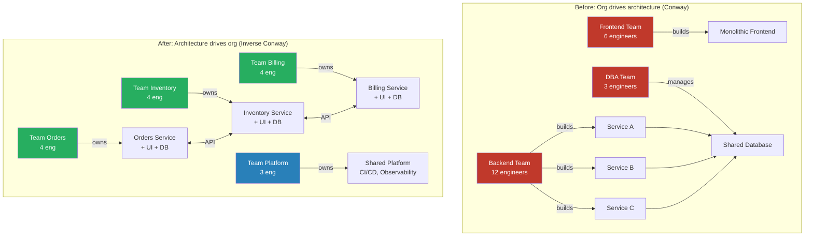
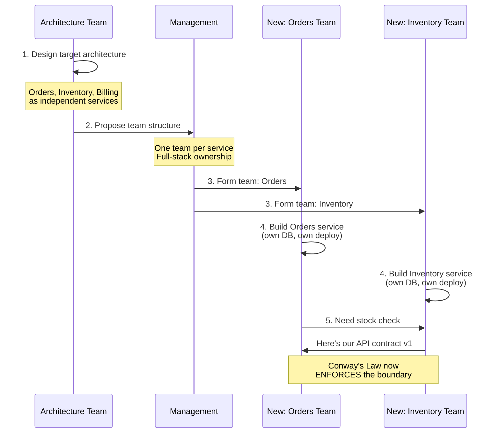

# Inverse Conway Maneuver

## 1. The Problem (Story)

FastGrow, a B2B SaaS company, has been running a monolithic Java application for 6 years. They've decided to move to microservices to enable independent deployments and faster feature development. The VP of Engineering reads the microservices book, draws 8 domain-aligned services on a whiteboard, and declares: "Let's build this."

Six months later, the "microservices" architecture looks nothing like the whiteboard. Here's why:

**The org structure hadn't changed.** FastGrow still had:
- A "Frontend Team" (6 engineers) — they built a single React app that calls all 8 services directly
- A "Backend Team" (12 engineers) — they built the 8 services, but since all 12 engineers work from one repo with shared deployments, the services are essentially a distributed monolith
- A "DBA Team" (3 engineers) — they run one shared PostgreSQL cluster that all 8 services connect to

Conway's Law in action: the team drew 8 services but the org chart had 3 teams. What they actually built was a 3-tier architecture (frontend, backend, database) with extra network calls.

The "microservices" have:
- Shared database schemas (because the DBA team manages one database)
- Synchronized deployments (because one backend team deploys together)
- Frontend bottleneck (because one frontend team must implement UI for all 8 domains)

**The architecture on the whiteboard is irrelevant. The architecture in production mirrors the org chart.**

## 2. The Naïve Solutions

### Attempt 1: "Enforce service boundaries with tooling"

Add linting rules that prevent cross-service database access. Use API gateways to enforce service isolation.

Why it fails:
- Teams work around the tooling — "just for now, we'll share this table"
- The single backend team has no incentive to maintain boundaries they don't feel
- Tooling prevents violations but doesn't create ownership or independent velocity
- The underlying problem (one team owns 8 services) remains

### Attempt 2: "Assign service owners within the backend team"

Designate 2 engineers as "owners" of each service within the same backend team:

```
Backend Team (12 engineers):
  - Alice & Bob → orders-service
  - Carol & Dave → inventory-service
  - Eve & Frank → billing-service
  - ...
```

Why it fails:
- Alice and Bob still sit next to Carol and Dave, share the same standup, and deploy together
- When Alice needs Carol's service to change, she walks over and asks — no API contract discipline
- When a service "belongs" to 2 people within a 12-person team, the team's shared priorities override service ownership
- The deploy pipeline doesn't change — 12 people still merge to one branch

### Attempt 3: "Hire an architect to maintain the vision"

Bring in a senior architect to enforce the intended service boundaries.

Why it fails:
- The architect can review PRs, but can't change the fact that one team deploys 8 services together
- Architectural direction from one person doesn't scale — they become a bottleneck
- The architect sees the code structure, but the org structure is the root cause

## 3. The Insight

**If Conway's Law means your org structure determines your architecture, then to change your architecture, change your org structure first.** Don't draw the architecture you want and hope teams will build it. Instead, organize teams to match the architecture you want, and Conway's Law will work FOR you instead of against you.

## 4. The Pattern

**Inverse Conway Maneuver** is the deliberate practice of designing team structure to produce a desired architecture:

1. **Design the target architecture**: Define the services, their boundaries, and their interactions
2. **Design teams to match**: Create one team per service (or bounded context), with full-stack ownership
3. **Give teams autonomy**: Each team owns their service end-to-end (code, deploy, monitor, on-call)
4. **Let Conway's Law work**: The team boundaries naturally reinforce the architectural boundaries

### Key Principles
- **Team-per-service**: Each team owns exactly one service (or a small, cohesive set)
- **End-to-end ownership**: Teams own frontend, backend, database, and operations for their domain
- **Independent deploy**: Teams deploy without coordinating with other teams
- **API contracts**: Inter-team communication happens through versioned APIs, not shared code

### Guarantees
- Architecture will align with team structure (Conway's Law working for you)
- Independent velocity: teams can ship without cross-team coordination
- Clear ownership: every component has one responsible team
- Natural API discipline: cross-team changes require formal interface negotiation

### Non-Guarantees
- Does not prevent duplication (teams may independently solve the same problem)
- Does not guarantee the target architecture is correct (garbage architecture + inverse Conway = well-built garbage)
- Does not solve hiring: you may not have enough people for the team structure you need
- Reorgs are painful — this isn't a "flip a switch" change

## 5. Mental Model

**City planning before construction.** You don't build random buildings and then draw roads. You design the road layout first (teams), knowing that buildings (services) will naturally fill the spaces between roads. If you want a downtown district (payments domain) separate from a residential area (user management domain), you put a road (team boundary) between them. The buildings will follow.

## 6. Structure





## 7. Code Example

### TypeScript — Inverse Conway team design tool

```typescript
// ─── TYPES ───────────────────────────────────────────

interface ArchitecturalService {
  name: string;
  domain: string;
  capabilities: string[];
  dependsOn: string[];
  estimatedComplexity: 'low' | 'medium' | 'high';
}

interface ProposedTeam {
  name: string;
  services: string[];
  requiredSkills: string[];
  headcount: number;
  autonomyScore: number; // 0-100: how independently can this team operate?
}

interface TeamDesignResult {
  teams: ProposedTeam[];
  crossTeamDependencies: Array<{ from: string; to: string; reason: string }>;
  autonomyScore: number;
  warnings: string[];
}

// ─── INVERSE CONWAY DESIGNER ────────────────────────

class InverseConwayDesigner {
  private services: ArchitecturalService[] = [];

  addService(service: ArchitecturalService): void {
    this.services.push(service);
  }

  // Step 1: Group services into teams based on domain alignment
  designTeams(maxServicesPerTeam = 2): TeamDesignResult {
    console.log('╔═══════════════════════════════════════╗');
    console.log('║  Inverse Conway: Team Design          ║');
    console.log('╚═══════════════════════════════════════╝');

    // Group by domain
    const domainGroups = new Map<string, ArchitecturalService[]>();
    for (const svc of this.services) {
      const list = domainGroups.get(svc.domain) ?? [];
      list.push(svc);
      domainGroups.set(svc.domain, list);
    }

    const teams: ProposedTeam[] = [];
    const warnings: string[] = [];

    for (const [domain, services] of domainGroups) {
      // If domain has too many services, split into sub-teams
      if (services.length > maxServicesPerTeam) {
        warnings.push(`Domain "${domain}" has ${services.length} services — consider sub-domains`);
      }

      // Calculate headcount based on complexity
      const complexityMultiplier: Record<string, number> = {
        low: 2, medium: 3, high: 5,
      };

      const headcount = services.reduce(
        (sum, s) => sum + complexityMultiplier[s.estimatedComplexity],
        0
      );

      // Determine required skills
      const skills = new Set<string>();
      skills.add('backend'); // Every team needs backend
      for (const svc of services) {
        if (svc.capabilities.some(c => c.includes('UI'))) skills.add('frontend');
        if (svc.capabilities.some(c => c.includes('data'))) skills.add('data-engineering');
        if (svc.capabilities.some(c => c.includes('ML'))) skills.add('machine-learning');
      }

      teams.push({
        name: `team-${domain}`,
        services: services.map(s => s.name),
        requiredSkills: [...skills],
        headcount,
        autonomyScore: 0, // Calculated below
      });
    }

    // Calculate cross-team dependencies
    const crossDeps: Array<{ from: string; to: string; reason: string }> = [];
    for (const svc of this.services) {
      const ownerTeam = teams.find(t => t.services.includes(svc.name));
      for (const depName of svc.dependsOn) {
        const depTeam = teams.find(t => t.services.includes(depName));
        if (ownerTeam && depTeam && ownerTeam.name !== depTeam.name) {
          crossDeps.push({
            from: ownerTeam.name,
            to: depTeam.name,
            reason: `${svc.name} depends on ${depName}`,
          });
        }
      }
    }

    // Calculate autonomy scores
    for (const team of teams) {
      const incomingDeps = crossDeps.filter(d => d.to === team.name).length;
      const outgoingDeps = crossDeps.filter(d => d.from === team.name).length;
      const totalDeps = incomingDeps + outgoingDeps;
      // Higher score = more autonomous
      team.autonomyScore = Math.max(0, 100 - (totalDeps * 15));
    }

    const avgAutonomy = teams.reduce((s, t) => s + t.autonomyScore, 0) / teams.length;

    if (avgAutonomy < 50) {
      warnings.push('Low average autonomy — teams will require frequent cross-team coordination');
      warnings.push('Consider: merge tightly coupled domains into one team');
    }

    return {
      teams,
      crossTeamDependencies: crossDeps,
      autonomyScore: Math.round(avgAutonomy),
      warnings,
    };
  }

  printDesign(result: TeamDesignResult): void {
    console.log('\n── Proposed Teams ──');
    for (const team of result.teams) {
      console.log(`\n  📋 ${team.name} (${team.headcount} engineers)`);
      console.log(`     Services: ${team.services.join(', ')}`);
      console.log(`     Skills: ${team.requiredSkills.join(', ')}`);
      console.log(`     Autonomy: ${'█'.repeat(team.autonomyScore / 10)}${'░'.repeat(10 - team.autonomyScore / 10)} ${team.autonomyScore}%`);
    }

    console.log('\n── Cross-Team Dependencies ──');
    if (result.crossTeamDependencies.length === 0) {
      console.log('  None! Teams are fully independent.');
    } else {
      for (const dep of result.crossTeamDependencies) {
        console.log(`  ${dep.from} → ${dep.to}: ${dep.reason}`);
      }
    }

    console.log(`\n── Overall Autonomy Score: ${result.autonomyScore}% ──`);

    if (result.warnings.length > 0) {
      console.log('\n── Warnings ──');
      for (const w of result.warnings) {
        console.log(`  ⚠ ${w}`);
      }
    }
  }

  // Compare before/after org structures
  compareBeforeAfter(
    beforeTeams: Array<{ name: string; services: string[] }>,
    afterResult: TeamDesignResult,
  ): void {
    console.log('\n╔═══════════════════════════════════════╗');
    console.log('║  Before vs After Comparison           ║');
    console.log('╚═══════════════════════════════════════╝');

    console.log('\n  BEFORE (current org):');
    for (const t of beforeTeams) {
      console.log(`    ${t.name}: ${t.services.join(', ')}`);
    }

    console.log('\n  AFTER (inverse Conway):');
    for (const t of afterResult.teams) {
      console.log(`    ${t.name}: ${t.services.join(', ')}`);
    }

    const beforeServicesPerTeam = beforeTeams.reduce((sum, t) => sum + t.services.length, 0) / beforeTeams.length;
    const afterServicesPerTeam = afterResult.teams.reduce((sum, t) => sum + t.services.length, 0) / afterResult.teams.length;

    console.log(`\n  Services/team: ${beforeServicesPerTeam.toFixed(1)} → ${afterServicesPerTeam.toFixed(1)}`);
    console.log(`  Team count: ${beforeTeams.length} → ${afterResult.teams.length}`);
    console.log(`  Cross-team deps: ? → ${afterResult.crossTeamDependencies.length}`);
  }
}

// ─── SCENARIO ────────────────────────────────────────

function demo() {
  const designer = new InverseConwayDesigner();

  // Define the target architecture
  designer.addService({
    name: 'orders-service',
    domain: 'orders',
    capabilities: ['order-CRUD', 'order-UI', 'order-events'],
    dependsOn: ['inventory-service', 'billing-service'],
    estimatedComplexity: 'high',
  });

  designer.addService({
    name: 'inventory-service',
    domain: 'inventory',
    capabilities: ['stock-tracking', 'warehouse-UI', 'data-pipeline'],
    dependsOn: [],
    estimatedComplexity: 'medium',
  });

  designer.addService({
    name: 'billing-service',
    domain: 'billing',
    capabilities: ['invoicing', 'payment-processing', 'billing-UI'],
    dependsOn: [],
    estimatedComplexity: 'high',
  });

  designer.addService({
    name: 'user-service',
    domain: 'identity',
    capabilities: ['authentication', 'profile-UI', 'permissions'],
    dependsOn: [],
    estimatedComplexity: 'medium',
  });

  designer.addService({
    name: 'notification-service',
    domain: 'identity',
    capabilities: ['email', 'push', 'SMS'],
    dependsOn: ['user-service'],
    estimatedComplexity: 'low',
  });

  // Design teams using Inverse Conway
  const result = designer.designTeams();
  designer.printDesign(result);

  // Compare with the old org structure
  designer.compareBeforeAfter(
    [
      { name: 'frontend-team', services: ['all-UIs'] },
      { name: 'backend-team', services: ['orders-service', 'inventory-service', 'billing-service', 'user-service', 'notification-service'] },
      { name: 'dba-team', services: ['shared-database'] },
    ],
    result,
  );
}

demo();
```

### Go — Team design calculator

```go
package main

import "fmt"

type Service struct {
	Name       string
	Domain     string
	DependsOn  []string
	Complexity string // low, medium, high
}

type Team struct {
	Name      string
	Services  []string
	Headcount int
	Autonomy  int
}

func designTeams(services []Service) []Team {
	domains := map[string][]Service{}
	for _, s := range services {
		domains[s.Domain] = append(domains[s.Domain], s)
	}

	complexityMap := map[string]int{"low": 2, "medium": 3, "high": 5}

	var teams []Team
	for domain, svcs := range domains {
		hc := 0
		var names []string
		for _, s := range svcs {
			hc += complexityMap[s.Complexity]
			names = append(names, s.Name)
		}
		teams = append(teams, Team{
			Name:      "team-" + domain,
			Services:  names,
			Headcount: hc,
		})
	}

	// Calculate autonomy based on cross-team deps
	teamOf := map[string]string{}
	for _, t := range teams {
		for _, s := range t.Services {
			teamOf[s] = t.Name
		}
	}

	crossDeps := map[string]int{}
	for _, s := range services {
		for _, dep := range s.DependsOn {
			if teamOf[s.Name] != teamOf[dep] {
				crossDeps[teamOf[s.Name]]++
				crossDeps[teamOf[dep]]++
			}
		}
	}

	for i := range teams {
		deps := crossDeps[teams[i].Name]
		teams[i].Autonomy = max(0, 100-deps*15)
	}

	return teams
}

func max(a, b int) int {
	if a > b {
		return a
	}
	return b
}

func main() {
	services := []Service{
		{Name: "orders", Domain: "orders", DependsOn: []string{"inventory", "billing"}, Complexity: "high"},
		{Name: "inventory", Domain: "inventory", DependsOn: nil, Complexity: "medium"},
		{Name: "billing", Domain: "billing", DependsOn: nil, Complexity: "high"},
		{Name: "users", Domain: "identity", DependsOn: nil, Complexity: "medium"},
		{Name: "notifications", Domain: "identity", DependsOn: []string{"users"}, Complexity: "low"},
	}

	teams := designTeams(services)

	fmt.Println("── Inverse Conway Team Design ──")
	for _, t := range teams {
		fmt.Printf("\n  %s (%d engineers)\n", t.Name, t.Headcount)
		fmt.Printf("    Services: %v\n", t.Services)
		fmt.Printf("    Autonomy: %d%%\n", t.Autonomy)
	}
}
```

## 8. Gotchas & Beginner Mistakes

| Mistake | Why It Happens | Fix |
|---------|---------------|-----|
| Reorganizing without a target architecture | "Let's do Inverse Conway!" without first defining what architecture you want | Architecture design FIRST, then team design |
| Teams too small | 2-person "teams" per service have no bus factor and no on-call rotation | Minimum viable team: 3-5 engineers |
| Ignoring the reorg cost | Moving people between teams disrupts productivity for weeks | Plan for a 2-4 week "storming" phase. Budget for reduced velocity. |
| No platform team | Every domain team reinvents CI/CD, monitoring, and infrastructure | Create a platform team to own shared concerns (see Platform Team pattern) |
| Partial inverse Conway | Reorganized backend but left frontend as a single team → frontend becomes the bottleneck | Apply the maneuver consistently across the full stack |
| Expecting instant results | "We reorged and the architecture didn't change" — it takes 6-12 months for Conway's Law to reshape the system | Be patient. New team boundaries gradually produce the aligned architecture. |

## 9. Related & Confusable Patterns

| Pattern | Relationship | Key Difference |
|---------|-------------|----------------|
| **Conway's Law** | The observation this pattern leverages | Conway's Law is the physics. Inverse Conway is the engineering that uses those physics. |
| **Team Topologies** | Specific framework | Team Topologies provides the vocabulary (stream-aligned, enabling, etc.). Inverse Conway is the principle. |
| **Microservices** | Common application target | Inverse Conway is often used to move from monolith to microservices, but it applies to any architecture transition. |
| **Domain-Driven Design** | Complementary | DDD identifies bounded contexts. Inverse Conway maps teams to those contexts. |
| **Strangler Fig** | Complementary | Strangler Fig migrates the code. Inverse Conway reorganizes the teams. Used together for monolith decomposition. |

## 10. When This Pattern Is the WRONG Choice

| Scenario | Why Inverse Conway Hurts | Better Alternative |
|----------|--------------------------|-------------------|
| Small company (< 15 engineers) | You don't have enough people to form domain teams | One team, well-structured monolith |
| Architecture isn't clear yet | Reorganizing for a target you haven't validated = churn | Build and iterate first, reorg once architecture stabilizes |
| High-attrition environment | People leave frequently → teams dissolve before Conway's Law takes effect | Stabilize retention first |
| The monolith is fine | Working monolith + working team = no problem to solve | "If it ain't broke, don't reorg" |
| Political resistance | Management won't allow team restructuring | Improve cross-team collaboration and contracts instead |

**Symptom you need Inverse Conway**: You've drawn the architecture you want but teams keep building something different. The org chart is fighting the architecture diagram — and the org chart always wins.

**Back-out strategy**: If a full reorg is too disruptive, try "virtual teams" — keep reporting lines unchanged but form cross-functional working groups aligned to domains. Run a 3-month pilot with one domain. If it works, formalize the structure. If it doesn't, dissolve the working group with minimal damage.
